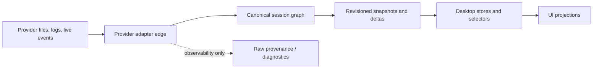

# Final GOD Architecture

## Problem Frame

Acepe has several strong pieces of the intended architecture: a revisioned session graph, canonical session envelopes, graph-backed activity, provider-owned restore direction, operation and interaction stores, and a hardened agent-panel renderer. But the codebase is still carrying compatibility paths from older designs. Those paths keep reintroducing split authority: frontend hot-state can still act like lifecycle truth, operation state still inherits `ToolCall` DTO semantics, raw session-update lanes still exist beside canonical envelopes, and durable local journal/snapshot paths still resemble restore authority.

The requested outcome is not another convergence slice. It is the final GOD architecture: provider quirks stop at the backend/provider edge, one backend-owned session graph owns product truth, desktop stores/selectors consume only canonical materializations, and old compatibility authorities are removed rather than preserved as fallback.

## Definitions

- **Canonical session graph:** the backend-owned product-state model for transcript, operations, interactions, lifecycle, capabilities, activity, telemetry, and Acepe-owned metadata.
- **Graph frontier:** the graph-owned monotonic continuity marker for non-transcript graph mutations. It is an internal sub-frontier of the canonical graph, not a second authority.
- **Transcript frontier:** the graph-owned monotonic continuity marker for transcript-bearing mutations. It is an internal sub-frontier of the canonical graph, not a separate transcript system.
- **Provider adapter edge:** the only layer allowed to understand provider-native payloads, sequencing quirks, retryability facts, provider identity, and provider-owned history formats before producing canonical graph inputs.
- **Canonical operation ID:** the stable graph identity for an operation. It is assigned or derived by the canonical graph reducer from provider provenance and session identity, persisted as Acepe-owned metadata when needed for later joins, and never inferred by UI components.
- **Operation provenance key:** the stable provider correlation evidence used to recognize the same logical operation across live, replay, and provider-history restore. It may include provider tool-call IDs or provider-native identifiers, but it is not itself the canonical operation ID.
- **Diagnostics/provenance:** raw or near-raw evidence retained only for observability, debugging, and fixture conformance. Diagnostics are not product state, may not be imported by desktop stores/selectors, and may not become fallback restore data.
- **Defensive renderer guard:** a null/teardown guard that prevents component lifecycle crashes. It may avoid reading missing props during Svelte/virtualization teardown, but it may not synthesize or default session status, lifecycle, operation state, capability state, activity state, or recovery actions.

## Requirements

**Single Authority**
- R1. Acepe must have one product-state authority path for sessions: provider facts/history/live events -> backend/provider edge -> canonical session graph -> revisioned materializations -> desktop stores/selectors -> UI.
- R2. Raw provider traffic, raw ACP updates, replay traffic, and debug provenance may exist internally, but must not be shared desktop product authority.
- R3. Legacy compatibility paths that act as alternate product truth must be deleted. Diagnostic retention is the exception, not the fallback: any retained diagnostic path must be explicitly justified in the plan that removes the authority path, must live behind a dedicated observability boundary, and must be impossible for product stores/selectors to import as session truth.
- R3a. "Impossible to import" means structural enforcement, not convention: diagnostics-only modules must not be re-exported from product barrels, product stores/selectors must be blocked from importing diagnostics modules by type/module boundaries or CI rules, and Rust diagnostic types must not be accepted as canonical graph reducer inputs.
- R4. Snapshot, delta, lifecycle, capabilities, activity, operations, interactions, and transcript state must be materializations of one canonical graph model, not peer architectures that compete for truth.
- R4a. Provider adapter outputs must be structurally unable to publish canonical lifecycle conclusions directly. They may emit provider facts; only the supervisor/graph reducer may produce canonical lifecycle states.
- R4b. The provider adapter edge owns provider sequencing normalization before graph application. It must emit a per-session monotonically ordered canonical event stream, or emit a canonical edge error when provider facts are missing, out of order, or impossible to order safely. The graph reducer accepts only ordered canonical events or explicit edge-error events; desktop stores may not reorder or repair provider event sequence.

**Operations and Interactions**
- R5. Operations must be first-class canonical graph nodes independent of transcript-layer `ToolCall` DTOs.
- R5a. The canonical `Operation` schema must not derive kind, status, result, location, skill, question, approval, or timing types from transcript-layer `ToolCall`. A provider `toolCallId` may remain only as provenance/correlation evidence, not as the operation's canonical identity.
- R5b. Canonical operation identity must be stable across live, replay, refresh, and cold-open restore. The graph reducer must either deterministically derive `operationId` from session identity plus operation provenance key, or persist the reducer-assigned `operationId` as Acepe-owned metadata keyed by that provenance. Existing interaction records keyed by provider tool-call IDs must migrate through this provenance key before `toolCallId` loses identity status.
- R6. Provider tool events, tool updates, permission requests, question requests, todo-bearing tool evidence, plan approvals, persisted history, replay, and live updates must merge into canonical operation and interaction patches before desktop product code consumes them.
- R6a. Operation patch merge semantics must be deterministic, idempotent, and monotonic for richer evidence: sparse later patches may not erase richer prior evidence, stale terminal updates may not regress terminal state, and conflicts must become explicit degraded canonical state instead of UI repair.
- R7. Operation records must preserve strict semantic fields plus provider-agnostic evidence/fallback categories needed by selectors. The final schema must be frozen before reducer/selector work begins and must account for current selector needs: locations, skill metadata, normalized questions and todos, question answers, plan approval linkage, timing, command/title/result evidence, parent/child relationships, source entry linkage, and degradation reasons.
- R7a. A degradation reason records why canonical operation state is partial, fallback-derived, conflict-derived, provider-incomplete, or failed to classify. Degradation is product-visible only through selectors; raw provider payload remains diagnostics.
- R8. Interactions must own reply/decision lifecycle and must link explicitly to canonical `operationId` when they block or enrich an operation. A `toolReference` or provider `toolCallId` alone is not sufficient.
- R8a. Interaction decisions that are Acepe-owned product facts, including permission decisions, question answers, and plan approvals, are local Acepe metadata. Cold-open restore must rebuild operation content from provider history, then layer Acepe-owned interaction decisions onto the graph through explicit operation identity joins.
- R8b. Cold-open interaction rebinding must join through canonical `operationId` when present and through the operation provenance key during legacy migration or restore re-derivation. If an interaction decision cannot be rebound to an operation, it must become an explicit unresolved interaction state rather than disappearing or attaching by transcript timing.
- R9. Desktop operation affordances must render tool, permission, question, approval, queue, kanban, and transcript operation UI from operation/interaction selectors, not from raw `ToolCall` fallback, transcript timing, or component-local matching. Presentational `@acepe/ui` components receive already-materialized selector output via props.

**Operation State**
- R9a. The canonical operation state machine must be explicit before implementation begins. At minimum it must distinguish pending, running, blocked on interaction, completed, failed, cancelled/abandoned, and degraded/partial operation states, with valid transitions and provider/supervisor triggers named in the plan.
- R9b. Interaction-blocked operation states must survive live updates, reconnect, refresh, and cold open without relying on visible prompt state or transcript row timing.

**Lifecycle, Capabilities, and Activity**
- R10. Session lifecycle truth must be backend/supervisor-owned and revision-bearing across named states (`Reserved`, `Activating`, `Ready`, `Reconnecting`, `Detached`, `Failed`, `Archived`) and transition flows (`open`, `activate`, `send`, `resume`, `retry`, `archive`).
- R10a. The lifecycle transition graph, transition guards, terminal states, retryability rules, and allowed user actions must be explicit before implementation begins.
- R11. Providers may emit transport, retryability, freshness, identity, capability, and provenance facts, but they must not publish canonical lifecycle conclusions directly.
- R12. Desktop lifecycle, actionability, model/mode availability, send enablement, retry/resume/archive affordances, compact status copy, and recovery UI must derive from canonical lifecycle/actionability/capability/activity selectors only.
- R13. `SessionHotState` and equivalent frontend-local lifecycle authorities must be removed from lifecycle truth and CTA behavior. Lifecycle-authority fields such as status, connection state, turn state, and send/retry/resume gates must come only from canonical selectors.
- R13a. Fields currently housed near hot-state that are real graph-owned projections, such as capabilities, config options, available commands, autonomous state, telemetry, and budget state, must move to explicit canonical capability/config/activity/telemetry selectors rather than disappearing or remaining in hot-state as hidden authority.
- R14. Session activity must be graph-backed and consistent across panel, tabs, queue, status cells, reopen, refresh, and reconnect.

**Restore and Durable Storage**
- R15. Provider-owned history must be the cold-open restore authority for session content; provider live events must be the attached-session authority.
- R16. Acepe-managed durable storage must keep only Acepe-owned metadata in this work. This work introduces no new durable provider-history cache or index.
- R16a. Any future provider-history cache/index requires a separate reviewed CE requirements/plan cycle after R15-R18 are proven. It must be subordinate, purgeable, rebuildable, non-content-authoritative, and blocked from storing full transcript, tool, permission, question, or provider payload bodies.
- R16b. Acepe-owned durable metadata includes product facts Acepe creates or owns, such as review state, permission decisions, local annotations, project/session identity binding, discovery metadata, and explicit user decisions. It does not include provider-owned transcript/tool payload copies.
- R17. Local snapshot/journal replay paths that reconstruct provider session content when provider history is missing must be removed.
- R17a. Before R17 deletion lands, planning must audit whether current non-archived sessions are restorable from provider-owned history alone for supported providers. Sessions that are no longer restorable through provider history must receive a specific user-visible restore-authority message rather than a generic failure.
- R17b. The restore audit gate must cover a documented corpus for each supported provider with non-archived sessions that have provider history present. Every audited session with present, parseable provider history must restore through provider history into a non-empty canonical graph/open result; provider-unavailable cases are retryable states and do not count as parser failures; provider-missing or provider-unparseable cases must map to the explicit R18 failure states before local restore authority can be deleted.
- R18. Missing, stale, or unparseable provider-owned history must surface explicit restore states; Acepe must not silently restore stale local content or empty success.
- R18a. Restore failures must distinguish at least retryable provider-history unavailable, provider-history missing, provider-history unparseable, and stale-lineage recovery cases. Retryable unavailable states must expose retry/resume affordances when canonically allowed; unparseable states must expose diagnostics/export affordances when safe.
- R18b. Cold-open restore performance must be measured before local restore/cache paths are removed. If provider-history parsing creates an unacceptable latency regression, the work must pause and return to requirements for a subordinate-cache design rather than keeping hidden local restore authority.
- R18c. The performance gate is P95 time-to-first-entry-render for cold open on the documented restore audit corpus. Before any local restore/cache path is deleted, planning must publish the current baseline and the provider-history path must stay within 25% of that baseline on the same corpus. If no reliable baseline exists, establishing the benchmark is a prerequisite task and deletion cannot proceed until the benchmark exists.

**Revision and Delivery Semantics**
- R19. The canonical graph owns two internal continuity sub-frontiers: the graph frontier for non-transcript state and the transcript frontier for transcript-bearing state. Neither frontier is a separate authority outside the graph.
- R20. Session open, refresh, reconnect, resume, live streaming, provider-history restore, and crash recovery must materialize from the same canonical graph/revision model.
- R21. Stale or invalid lineage must recover through fresh canonical snapshot materialization, not guessed continuation or local repair.
- R22. Delivery watermarks, open tokens, event sequence IDs, and buffering mechanisms must remain delivery/claim mechanics only; they must not become semantic authority.
- R22a. Delivery/claim mechanics may order and buffer transport, but semantic acceptance happens only when the canonical graph reducer applies a validated canonical event or snapshot.

**Frontend and Presentation Boundary**
- R23. Desktop stores must be consumers and projectors of canonical state, not semantic repair owners.
- R24. Presentation models for the agent panel, website scene, tab bar, queue, status cells, and input composer may remain, but they must be derived from canonical session/operation/lifecycle selectors.
- R25. Renderer components must receive normalized, presentation-safe DTOs. Defensive renderer guards may prevent null-dereference or stale-getter crashes during component mount/destroy, but they must not compute, default, or substitute session-semantic values.
- R26. The agent-panel teardown crash class must stay covered by behavior tests and must produce zero fresh occurrences in manual Tauri verification before this PR stack is mergeable, while final architecture work removes the deeper pressure for renderer-level semantic repair.

**Security and Data Handling**
- R26a. Raw provenance/diagnostic writes must use OS-managed application log/data locations, never paths derived from the source tree, and must be excluded from git-tracked directories.
- R26b. Raw provenance/diagnostics must redact, truncate, or refuse known-sensitive payload fields before disk persistence, including large file contents, credential-pattern text, environment dumps, and provider secret material.
- R26c. Diagnostic data for a session must be purged when the session is deleted and must have an explicit retention upper bound. Diagnostic retention must be documented as a privacy/data-lifecycle behavior.
- R26d. API keys and credentials must never enter canonical session graph state, emitted Tauri events, diagnostic logs, or frontend product stores. Any frontend IPC access to plaintext credentials must be removed or gated by explicit Tauri capability/user-intent boundaries.
- R26e. Destructive bulk data operations must require explicit user intent backed by a backend-issued one-time confirmation token, not a naked IPC command.
- R26f. SQL Studio or equivalent arbitrary-query surfaces must be prevented from connecting to or mutating Acepe's own application database unless a separately reviewed capability model explicitly allows it.
- R26g. Checkpoint file snapshots, pasted contents, and other non-transcript user payloads are sensitive durable content. Their retention, deletion, and IPC exposure must be explicit, session-scoped, and purged when the owning session is deleted unless a user-visible retention policy says otherwise.

**Deletion and Proof**
- R27. The final implementation must include deletion proof: no product code path should depend on `ToolCallManager` as operation truth, `SessionHotState` as lifecycle truth, raw session-update as semantic truth, or local transcript/journal snapshots as restore truth.
- R27a. Deletion must be sequenced by proof, not by compatibility preservation: each old authority may be removed only after the canonical graph/store replacement for that domain is proven end-to-end, and the final integration gate must verify all old authorities are gone or diagnostic-only behind the observability boundary.
- R28. Tests must prove fresh session, restored session, reconnect during active operation, pending permission/question/approval, provider-history restore failure, stale lineage refresh, app restart during active operation, provider process/lifecycle recovery, and agent-panel rendering behavior.
- R28a. Each R28 scenario must be assigned a minimum test seam during planning: Rust reducer/supervisor unit tests for graph/lifecycle semantics, TypeScript store/selector tests for desktop projection behavior, component behavior tests for presentation safety, and Tauri/manual verification for cross-boundary flows.
- R29. Documentation must name the final architecture and retire/supersede older active plans whose end state conflicts with the final authority model.
- R29a. Plan retirement means adding an explicit superseded status or superseded-by pointer to conflicting plan frontmatter/body, not deleting planning artifacts.
- R30. The delivered PR or PR stack must be reviewable as a completed architecture, not a transitional coexistence plan.
- R30a. A multi-plan stack satisfies R30 only when the final integration plan verifies R27 deletion proof, all R28 tests are green, all R29 conflicting active plans are retired/superseded, and no remaining PR in the stack depends on a coexistence bridge as its endpoint.

## Success Criteria

- A teammate can explain the architecture as one authority path without caveats about frontend hot-state, raw session-update fallback, local transcript restore, or ToolCall-era operation repair.
- Running product flows for fresh sessions, cold-open restored sessions, reconnect/resume, permission/question/approval gates, active tool execution, and explicit refresh produces the same canonical graph semantics.
- Repo search confirms old authorities are either deleted or non-authoritative diagnostics only.
- Operation presentation is derived from canonical operation/interaction selectors rather than `ToolCall` DTO fallback.
- Lifecycle/actionability and activity copy are derived from canonical graph fields on every desktop surface.
- Provider-owned restore failure is loud and explicit, never silently filled from local duplicate content.
- Agent panel rendering remains stable during virtualization/Svelte teardown and receives normalized presentation-safe data.
- Full desktop TypeScript checks, relevant Rust tests, frontend tests, and end-to-end/manual Tauri verification pass.
- Provider-history restore success and cold-open latency are measured before local restore authority is deleted, and any regression beyond the planned gate returns to requirements instead of smuggling back a hidden local authority.
- The known agent-panel teardown crash class has no fresh occurrence in targeted manual Tauri verification after the final presentation/store changes.
- Future implementation work becomes simpler to route: new session facts have one obvious home in the graph, one selector path to desktop, and no competing frontend repair lane.

## Scope Boundaries

- This work is allowed to split into multiple reviewed implementation plans and delegated execution streams, but the endpoint remains the final architecture.
- This work does not require a visual redesign of agent panel, kanban, queue, tab bar, settings, or composer surfaces.
- This work does not introduce a new durable cache for provider history. If performance later requires a cache, it must be planned as a subordinate, purgeable cache and must not block final authority cleanup.
- This work does not preserve old compatibility bridges for safety once their behavior conflicts with the final authority model.
- This work does not require redesigning provider-native file formats; provider parsing remains an accepted edge-maintenance cost.
- This work does not require offline restore when provider-owned history is unavailable.
- This work may add or refine error/restore/recovery copy required to make canonical failure states understandable, but it does not redesign the surrounding visual shell.

## Key Decisions

- **Final, not convergence:** The endpoint deletes alternate authority paths instead of naming them migration bridges.
- **Backend graph owns product truth:** Frontend stores and components consume canonical materializations and selectors.
- **Operations stop being ToolCall-shaped:** `ToolCall` remains a transcript/presentation DTO only where needed, not the operation source of truth.
- **Provider-owned restore wins over local transcript durability:** Honest not-restorable states are preferable to stale local success.
- **Renderer hardening remains defense-in-depth:** UI lifecycle guards prevent crashes, but the product semantics must arrive already normalized.
- **Plan stack is acceptable:** Multiple implementation plans may be created for reviewability and delegation, provided they compose into the final architecture and do not preserve coexistence as an endpoint.
- **Planning discoveries escalate:** Planning research may surface unresolved architecture decisions. If a planning discovery changes scope, authority boundaries, or product behavior, it must return to requirements/review instead of being resolved silently in an implementation plan.

## Plan Boundary Assumptions

The final GOD requirements supersede the endpoint framing of these overlapping active plans. Their details remain research input, but their end states must be retired or rewritten to point at the final architecture:

- `docs/plans/2026-04-12-002-refactor-god-clean-operation-model-plan.md`
- `docs/plans/2026-04-19-001-refactor-canonical-session-state-engine-plan.md`
- `docs/plans/2026-04-20-001-refactor-canonical-operation-state-model-plan.md`
- `docs/plans/2026-04-21-001-refactor-canonical-session-lifecycle-authority-plan.md`
- `docs/plans/2026-04-22-002-refactor-session-lifecycle-convergence-after-proof-plan.md`
- `docs/plans/2026-04-23-002-refactor-provider-owned-restore-authority-plan.md`

The plan stack may reuse these documents' implementation research, but the final stack must not inherit their transitional language as an acceptable endpoint.

## Dependencies / Assumptions

- Existing concept docs and active plans contain enough architecture context to produce a reviewed implementation plan stack.
- Provider-owned history is expected to be complete enough for normal restore behavior, but deletion of local restore authority is blocked until planning measures restore success across supported providers.
- The current virtualized-entry-list teardown fix can either ship as part of the final architecture PR stack or be retained as a prerequisite safety fix, but it must not be mistaken for the final architectural solution.
- The implementation will require coordinated Rust and TypeScript changes and should be planned as a deep refactor with TDD at each seam.
- Existing dirty work in the current branch, including the virtualized-entry-list teardown fix, must be handled deliberately by the plan stack so it is either merged as prerequisite safety work or isolated before the final architecture changes begin.

## Outstanding Questions

### Resolve During Planning Research Before Implementation

- [Affects R27][Needs research] Which exact Rust and TypeScript symbols remain as alternate authorities and must be deleted, narrowed, renamed, or moved behind diagnostics-only boundaries?
- [Affects R7][Technical] What is the minimal final operation evidence schema that supports current UI selectors without exposing provider-specific ad hoc fields?
- [Affects R16][Technical] Which existing local persistence tables are Acepe-owned metadata versus duplicate provider content?
- [Affects R30][Technical] Should the implementation ship as one PR or a tightly ordered PR stack, and how should review boundaries be drawn so the endpoint remains final?
- [Affects R17][Needs research] What is the provider-history restore success rate for currently supported providers before local restore authority is deleted?
- [Affects R18b][Needs research] What is the current cold-open restore latency baseline, and what regression gate is acceptable before subordinate cache planning is required?

## Next Steps

-> `/ce:plan` for structured implementation planning after document review.
