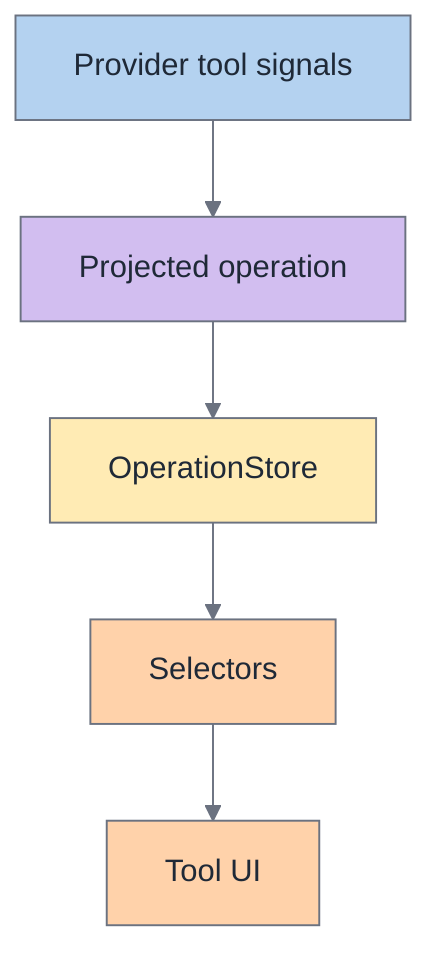
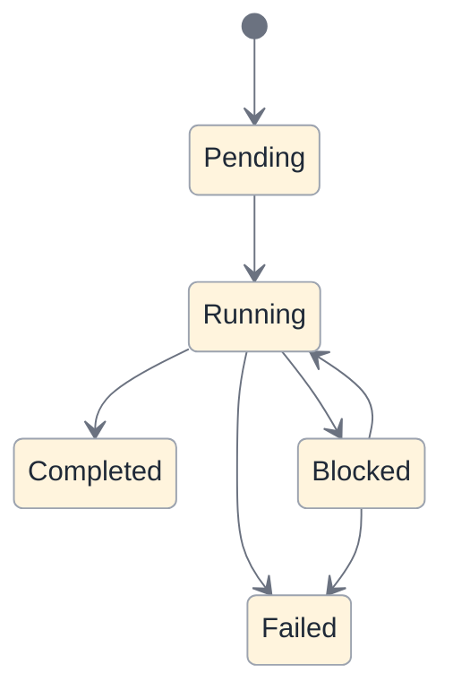

# Operations

An **operation** is the canonical record of runtime work inside a session.

Operations exist so Acepe can represent tool execution as durable product state instead of reconstructing it from transcript rows or provider-specific event timing.

## Operation in one picture

## Why operations exist

Tool execution has more semantics than transcript history can safely carry.

A transcript row can tell you that a tool appeared in history. It cannot reliably own:

- lifecycle transitions,
- blocked reasons,
- permission linkage,
- stable typed arguments,
- timing,
- parent/child structure,
- reconnect and replay repair.

Operations solve that by giving runtime work its own canonical node.

## Ownership table

| Runtime fact | Owned by operation? | Why |
|---|---|---|
| Tool identity | Yes | Different UI surfaces need one shared answer |
| Lifecycle/status | Yes | Reconnect/resume cannot guess these reliably |
| Blocked reason | Yes | Blocked state must survive beyond a transient popup |
| Typed arguments / semantic metadata | Yes | Transcript text is too degraded for stable UI semantics |
| Timing | Yes | Current and last-tool surfaces need durable execution context |
| Parent/child links | Yes | Tool relationships are domain state, not display-only hints |
| Transcript rendering text | No | That belongs to transcript entries |

## What an operation owns

An operation should be the place shared code looks for:

- tool identity,
- lifecycle and status,
- blocked reason,
- typed display metadata,
- execution timing,
- parent/child links,
- source entry links,
- raw evidence merged from provider signals.

## How operations are built

Operations are not authored directly by Svelte components.

They are produced by backend projection and then hydrated into desktop stores.

Typical path:

1. provider emits tool-related signals,
2. backend reducers and projections merge those signals into one operation record,
3. the frontend receives canonical snapshot/delta updates,
4. `OperationStore` materializes and updates operation state,
5. selectors drive tool-call UI.

## Operation vs transcript

| Question | Transcript row | Operation |
|---|---|---|
| "Should this appear in history?" | Yes | Not primary |
| "What is the current runtime state?" | Weak / degraded | Yes |
| "What blocked this?" | Not reliable | Yes |
| "What survives reconnect?" | Not enough by itself | Yes |
| "What command/title should the current tool UI show?" | Sometimes approximate | Yes |

## Important boundary

Transcript tool entries are still useful, but their role is narrower:

- transcript entry = "show this in history"
- operation = "this is the runtime truth of the work item"

That boundary matters because transcript replacement can legally degrade tool rows while operation state must stay stable enough to drive live UI.

## Lifecycle

Operations may pass through phases like:

- pending,
- running/in progress,
- blocked,
- completed,
- failed.

The exact enum is less important than the rule:

**lifecycle must be canonical and monotonic enough that reconnect/resume does not need to guess.**

## Blocking

Blocked state belongs to operations and their linked interactions, not to ad hoc UI conditions.

That means:

- a permission prompt can arrive before a full operation materializes,
- the system still preserves the blocked relationship,
- once the operation exists, the blocker attaches to the same canonical record,
- terminal lifecycle updates clear blocker state instead of leaving the operation semantically stuck.

## Selector contract

| Selector concern | Should read from |
|---|---|
| Current operation for a tool call | Canonical operation association |
| Display title / known command | Operation semantic fields / resolver helpers |
| Blocked-on-permission state | Operation + linked interaction |
| Last meaningful tool | Operation lifecycle/timing, not transcript fallback guessing |

## What shared UI should do

Shared UI should ask selectors questions like:

- what is the current operation for this tool call?
- what title/command should be displayed?
- is the operation blocked by a permission?
- what was the last meaningful tool state?

Shared UI should **not** re-classify provider payloads or rebuild tool semantics from transcript text.

## Smells that usually mean operations are being bypassed

- current/last tool UI depends on transcript fallback rows
- permission rendering is matched by loose UI heuristics instead of canonical association
- reconnect needs special-case repair code in components
- the frontend tries to infer lifecycle from scattered raw events
- different surfaces disagree about which tool is current
