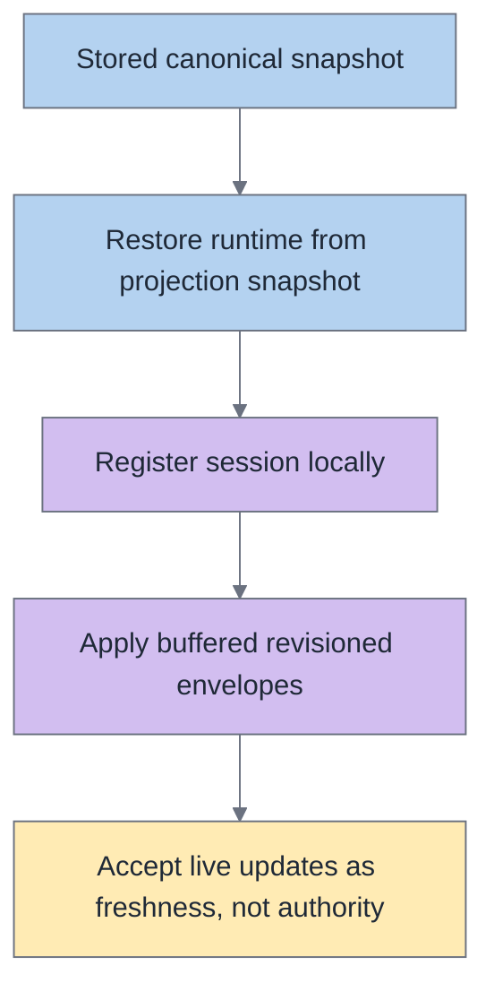

# Reconnect and resume

Reconnect and resume are where architecture lies get exposed fastest.

If Acepe has split authority, reconnect/resume will usually show it through:

- missing runtime state,
- lost blocked state,
- duplicated messages,
- incorrect current tool badges,
- prompts that vanish or attach to the wrong thing.

## Restore pipeline



## Principle

Reconnect and resume should restore from **canonical state first**, then layer live runtime/cache data on top where appropriate.

They must not depend on a component remembering local state or on the live process registry being the only place runtime truth exists.

## Survival table

| State | Should survive reopen/refresh? | Authority |
|---|---|---|
| Transcript history | Yes | Canonical session graph |
| Operation lifecycle | Yes | Canonical operation state |
| Pending interactions | Yes | Canonical interaction state |
| Runtime identity needed to continue session | Yes | Projection snapshot + canonical envelopes |
| Capabilities/config | Yes | Capability envelopes |
| UI-local open/closed panels | Optional/view-specific | UI layer |

## What should survive

Across reopen, reconnect, and refresh, Acepe should preserve:

- transcript history,
- operation lifecycle and evidence,
- linked interactions,
- runtime identity/state needed to continue the session,
- capabilities and telemetry that are part of canonical envelopes.

## Restore model

The intended restore sequence is:

1. load the stored canonical snapshot,
2. restore runtime state from projection snapshot data,
3. register the session locally,
4. apply buffered canonical envelopes in revision order,
5. let live transport updates improve freshness without replacing authority.

## What restores where

| Step | Layer | Responsibility |
|---|---|---|
| Load snapshot | Backend/desktop boundary | Supply the last canonical known state |
| Restore runtime | Projection/runtime restore path | Rehydrate runtime facts from stored snapshot |
| Register session | Session store | Make the target session addressable locally |
| Apply envelopes | Session event/store layer | Advance revisioned state in order |
| Render UI | Selectors/components | Reflect canonical state without inventing another source |

## What should not happen

Reconnect/resume should not require:

- reconstructing current tool state from transcript rows,
- guessing blocked state from whether a prompt is visible,
- depending on the live registry as the only source of runtime truth,
- provider-specific policy hidden in presentation metadata,
- raw transport events finalizing durable state independently.

## Anti-pattern map

```mermaid
%%{init: {'theme':'base','themeVariables':{'primaryTextColor':'#1f2937','primaryBorderColor':'#9ca3af','lineColor':'#6b7280','tertiaryColor':'#ffffff','background':'#ffffff'}}}%%
flowchart LR
    raw1["Raw event"] --> local["Component state"] --> patchup["Reconnect patch-up logic"]
    raw2["Raw event"] --> projection["Projection"] --> graph["Canonical graph"] --> store["Store"] --> selector["Selector"] --> component["Component"]

    classDef blue fill:#B4D2F0,stroke:#6b7280,color:#1f2937;
    classDef green fill:#B4E6C8,stroke:#6b7280,color:#1f2937;
    classDef yellow fill:#FFEBB4,stroke:#6b7280,color:#1f2937;
    classDef orange fill:#FFD2AA,stroke:#6b7280,color:#1f2937;
    classDef purple fill:#D2BEF0,stroke:#6b7280,color:#1f2937;
    classDef gray fill:#DCDCE1,stroke:#6b7280,color:#1f2937;

    class raw1,local,patchup orange;
    class raw2,projection blue;
    class graph purple;
    class store yellow;
    class selector,component green;
```

## Agent-agnostic rule

Provider-specific reconnect behavior is allowed at the adapter edge, but the shared architecture should still speak in the same concepts:

- session graph,
- operations,
- interactions,
- revisioned envelopes,
- canonical runtime state.

That is how Acepe stays agent-agnostic while still supporting provider-specific transports and policies.

## Bug triage matrix

| Question | Good answer |
|---|---|
| What should have survived? | A named canonical state element |
| Where should it live? | Graph node / projection snapshot / envelope |
| Why is it missing? | Projection, persistence, hydration, or authority leak |
| Where should the fix go? | At the owning layer, not just the rendering layer |

## Practical check

When a reconnect/resume bug appears, ask these questions in order:

1. Which canonical state should have survived?
2. Where is that state supposed to live?
3. Did the backend fail to project/persist it?
4. Did the frontend fail to hydrate/apply it?
5. Did a raw event path incorrectly become an authority path?

That sequence usually finds the real bug faster than debugging the surface symptom in the UI first.
