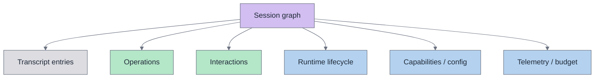
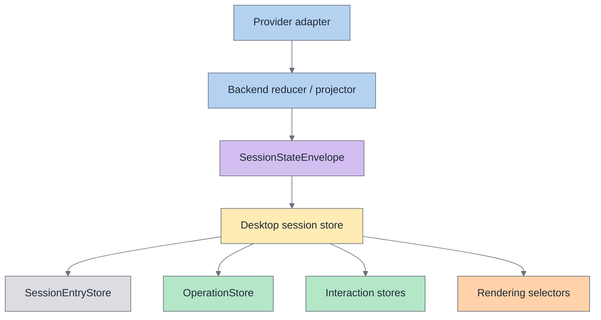

# Session graph

The **session graph** is Acepe's canonical model of product state for a session.

It is the durable structure that the rest of the architecture should look to when deciding what is true.

## Shape

## Ownership table

| Domain | Canonical owner | Typical consumer | Anti-pattern |
|---|---|---|---|
| Transcript history | Session graph transcript nodes | Transcript rendering | Mutating durable history from raw chunks |
| Runtime work | Operation nodes | Tool UI, current/last tool badges | Deriving tool truth from transcript rows |
| Human gates | Interaction nodes | Permission/question/approval UI | Treating prompts as local component state |
| Runtime identity/lifecycle | Projection snapshot + canonical envelopes | Reconnect/open flows | Depending only on a live in-memory registry |
| Capabilities/config | Capability envelopes | Launch/model/config UI | Parsing presentation metadata for policy |
| Telemetry/budget | Canonical telemetry envelopes | Usage display | Raw telemetry side-channel ownership |

## What the session graph owns

The session graph owns the state that must remain correct across:

- live streaming updates,
- reconnect,
- reopen,
- refresh,
- replay/import,
- provider-specific transport quirks.

In practice, that means the session graph owns:

- transcript history,
- operations,
- interactions,
- runtime lifecycle,
- capabilities and config envelopes,
- telemetry and budget state.

## What the session graph does not own

The session graph does **not** mean every raw event disappears.

Raw transport updates still exist for:

- optimistic UI,
- coordination while a session is being registered,
- observability and debugging,
- provider adapter mechanics.

But raw events are not allowed to become a second durable database.

## Authority rule

Acepe should have **one durable authority path** for session truth:

`provider signal -> backend projection -> canonical session graph -> desktop stores -> UI selectors`

If a feature needs to answer "what is the current tool?", "is this blocked on permission?", or "what runtime state should survive reopen?", it should answer from the session graph or a store materialized from it.

## Main graph nodes

### 1. Transcript entries

Transcript entries represent the conversation history shown to the user.

They are important for rendering history, but they are not rich enough to own all runtime semantics.

### 2. Operations

Operations represent durable runtime work such as tool execution and its lifecycle.

They own facts like:

- status and lifecycle,
- blocked reason,
- typed semantic fields,
- timing,
- parent/child links,
- evidence merged from live and replayed signals.

### 3. Interactions

Interactions represent things the system is waiting on from a human or policy path, such as:

- permission requests,
- questions,
- plan/apply approvals.

They are canonical state, not transient UI popups.

## View layering

| Layer | What it should do | What it must not do |
|---|---|---|
| Provider adapter | Parse provider-specific signals | Leak provider policy into shared UI |
| Backend projection | Merge into canonical graph | Emit parallel durable truth paths |
| Desktop stores | Materialize graph into queryable state | Reconstruct semantics from transcript text |
| UI | Render selectors and actions | Become the hidden owner of domain state |

## Invariants

The architecture should preserve these invariants:

1. **One state, many views.** Transcript, current tool UI, queue badges, and session previews may render different slices, but they must derive from the same underlying graph.
2. **Raw updates are observational unless promoted.** A transport event can coordinate UX, but it does not own durable truth by itself.
3. **Revisions matter.** Canonical envelopes apply in revision order and can be buffered until the target session is registered.
4. **Transcript is not operation authority.** Tool rows in transcript history are presentation data, not the sole live source of runtime tool state.
5. **Provider quirks belong at the edge.** Provider-specific parsing and lifecycle policy must be resolved before shared UI/store code consumes the state.

## Fast diagnostic matrix

| Symptom | Usual architectural cause |
|---|---|
| Current tool badge disappears after refresh | UI depended on transcript fallback instead of canonical operation state |
| Permission prompt vanishes on reconnect | Interaction was treated as transient UI state |
| Runtime/provider state disappears after reopen | Restore path depended on live registry only |
| Different surfaces disagree on current tool | Multiple authorities are deriving tool state separately |
| Resume logic differs by provider in shared code | Provider policy leaked beyond adapter/projection boundary |

## Design consequence

When adding a new feature, ask:

1. Is this durable product state?
2. If yes, where does it live in the canonical session graph?
3. Which store materializes it?
4. Which selector renders it?

If the answer starts with "the component can infer it from a transcript row" or "the frontend can reconstruct it from raw events," that is usually a sign the architecture is drifting.
