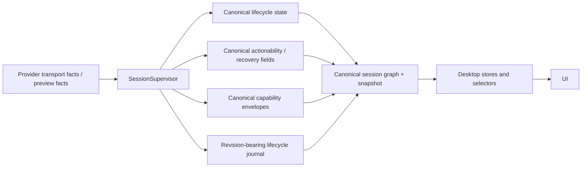
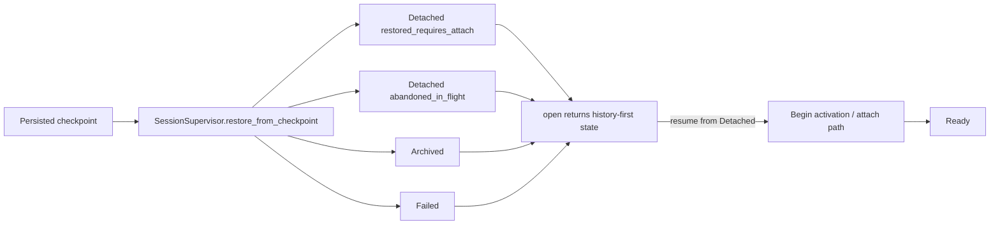
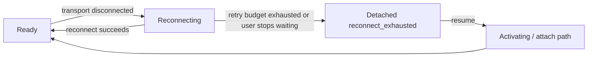
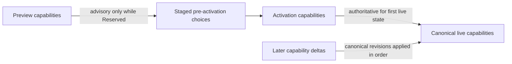

# Session lifecycle

The **session lifecycle** is Acepe's canonical model for whether a session is live, resumable, blocked on attach, or terminal.

It exists so shared code does not have to guess from transport status, frontend hot-state, or provider-specific timing.

Lifecycle is not the whole session-activity answer.

For this pipeline, lifecycle and session activity are related but separate canonical graph-backed fields:

- **lifecycle** answers whether the session is detached, ready, failed, reconnecting, and what actions are allowed,
- **activity** answers whether the session is awaiting model output, running work, blocked on an interaction, paused, in error, or idle.

Shared UI may render both, but it must not reconstruct session activity from lifecycle alone once the graph activity contract exists.

## Authority chain

Acepe's lifecycle truth flows through one path:



Provider adapters may report facts like disconnected, connected, preview capabilities, retryability, or provenance.
They do **not** publish canonical `Ready`, `Detached`, or `Failed` directly.

## The seven-state machine

| State | Meaning | Typical allowed actions |
|---|---|---|
| `Reserved` | Session exists but has never attached transport yet | preview, open, first-send activation, archive |
| `Activating` | Supervisor is attaching transport for first live use | wait |
| `Ready` | Live and dispatchable | send, set model/mode, archive |
| `Reconnecting` | Automatic recovery is in progress after live disconnect | wait, stop waiting if canonically offered |
| `Detached` | Not live, but resumable | resume, archive |
| `Failed` | Deterministic error or explicit error handling required before attach is legal | retry only when canonically allowed, archive |
| `Archived` | Closed and read-only | none |

Two rules matter most:

1. `Detached` is the canonical **resumable non-live** state.
2. `Reserved` is the only pre-live state that allows **first-send activation**.

## Public commands vs internal repair

The stable public lifecycle surface is:

- `reserve`
- `preview_capabilities`
- `open`
- `resume`
- `send`

Internal implementation may still use activation/reconnect helpers, but the user-facing recovery verb is `resume`, not `reconnect`.

## Main flows

### 1. New session -> first-send activation

```mermaid
flowchart LR
  A[Desktop] -->|reserve| B[Reserved]
  B -->|open history/frontier only| C[openToken armed]
  B -->|optional preview_capabilities| D[Preview facts]
  C -->|send first prompt| E[SessionSupervisor]
  D --> E
  E -->|begin_activation with ActivationOptions + initial prompt| F[Activating checkpoint]
  F -->|adapter connect(...)| G[Connected + capabilities facts]
  G -->|complete_activation| H[Ready checkpoint + capabilities envelope]
  H --> I[Buffered updates released]
```

Important detail: the waiter resolves on **`Ready` plus canonical capabilities**, not lifecycle alone.

### 2. Cold reopen -> explicit resume



Cold-open never pretends a previously live session is still live. A reopened session must become live again through explicit resume.

### 3. Live disconnect -> internal reconnect -> detached fallback



`Reconnecting` is an internal repair phase. If it cannot recover inside policy bounds, the session becomes `Detached`, not a fake-live state and not a generic failure.

## Canonical actionability

Lifecycle status alone is not enough for UI.

Canonical lifecycle payloads also carry fields like:

- `statusReason`
- `availableActions`
- `recommendedAction`
- `recoveryPhase` / `retryability`
- `lifecycleRevision`

That is what lets the UI show the right CTA without reconstructing policy from local booleans.

The same rule applies to session activity copy: "Planning next moves", working/tool activity, waiting-for-user prompts, and paused/error affordances must flow from graph-backed activity materialized by desktop stores, not from ad hoc lifecycle/status heuristics.

## Capability rule

Capabilities follow the same authority discipline as lifecycle:



If preview-selected options are invalid at activation time, the supervisor rejects the activation before prompt dispatch and leaves the session correctable.

## Relationship to the final GOD stack

- The final GOD stack promotes this seven-state lifecycle into graph materializations.
- Provider adapters emit facts; only the supervisor/graph reducer emits canonical lifecycle conclusions.
- Desktop lifecycle, actionability, compact copy, send enablement, retry/resume/archive affordances, and recovery UI derive from canonical selectors.
- Four-state compatibility projection, hot-state lifecycle authority, and frontend-local send/retry/resume gates are not lifecycle authorities. Any remaining transient projection exists only for non-authoritative compatibility/config/telemetry reactivity while canonical selectors own product behavior.

Conceptually: **one lifecycle authority, many projections.**
