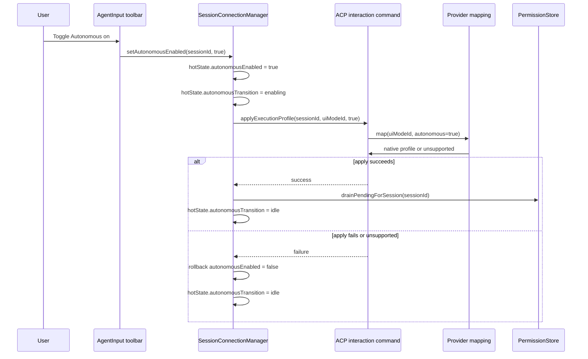

# Add session Autonomous toggle

## Overview

Add a single `Autonomous` toolbar toggle next to the mode picker that stays visually simple, but is backed by a strict cross-provider contract: providers declare which visible UI modes support Autonomous, the session store applies one normalized execution profile at a time, resumed sessions are explicitly reset to a safe non-autonomous profile, and Acepe auto-approves only eligible permission prompts for the exact live session after the backend confirms the new profile.

## Problem Frame

The origin document requires a one-click, per-session, non-persistent Autonomous mode that lets some users run hands-off without repeated permission interruptions. We do not want a Claude-only hack in the toolbar. We want one shared UI control with predictable behavior across agents, while still allowing each provider to translate `Autonomous` into its own native runtime logic. The hard parts are sequencing and trust boundaries: mode switching already has model-restore side effects, Claude already maps visible modes to native permission modes, resumed sessions must reopen safe, and permission bypass must never bleed into question handling or stale pending requests (see origin: `docs/brainstorms/2026-03-31-autonomous-session-toggle-requirements.md`).

## Requirements Trace

- R1-R6. Render one text-labeled `Autonomous` toolbar control next to the mode picker, use muted vs red styling, keep the UI minimal, and rely on tooltips for concise supported and unsupported explanations.
- R7-R12. Make Autonomous apply immediately to the current live session, keep it on until manually disabled, avoid persistence on reopen, and restore normal approval handling for future approval-worthy actions as soon as the user turns it off.
- R13-R16. Auto-handle Acepe-managed permission prompts while Autonomous is on, but do not invent a wrapper auto-answer policy for provider-owned questions.
- R17-R19. Disable the control when the current provider context cannot fully support Autonomous, and force it off whenever the session context moves into an unsupported combination.

## Scope Boundaries

- No repo-wide, worktree-wide, or global Autonomous preference.
- No modal warning, typed confirmation, or additional safety chrome beyond the button itself.
- No generic Acepe auto-answer engine for question requests.
- No best-effort partial mode for unsupported providers.
- No change to persisted workspace or panel schema for this feature; Autonomous resets by staying in non-persisted session hot state.

## Context & Research

### Relevant Code and Patterns

- `packages/desktop/src-tauri/src/acp/provider.rs` is the shared provider contract. It already normalizes visible mode IDs through `normalize_mode_id()` and `map_outbound_mode_id()`, which is the right seam for provider-owned Autonomous capability metadata and provider-native profile mapping.
- `packages/desktop/src-tauri/src/acp/registry.rs` builds the startup `AgentInfo` payload consumed by the frontend agent store. This is the cleanest place to advertise static Autonomous support metadata before a session connects.
- `packages/desktop/src-tauri/src/acp/commands/interaction_commands.rs` is the live command seam for session interaction changes like `acp_set_mode`; this is where a new execution-profile command belongs.
- `packages/desktop/src-tauri/src/acp/commands/mod.rs` and `packages/desktop/src-tauri/src/lib.rs` are the export and `generate_handler!` registration seams for new ACP commands.
- `packages/desktop/src-tauri/src/commands/names.rs` is the source-of-truth command-name definition. `packages/desktop/src-tauri/src/bindings/command-values.ts` and `packages/desktop/src/lib/services/command-names.ts` are generated artifacts and should be regenerated, not hand-edited.
- `packages/desktop/src-tauri/src/acp/providers/claude_code.rs` already normalizes Claude native mode strings like `default` and `acceptEdits` back to UI `build`, and `packages/desktop/src-tauri/src/acp/client/cc_sdk_client.rs` already knows about native `bypassPermissions` mode plus the existing `AskUserQuestion` and `PermissionRequest` separation.
- `packages/desktop/src-tauri/src/acp/commands/session_commands.rs` owns new-session and resume flows. This is the correct place to enforce a safe non-autonomous profile during resume instead of trusting local hot-state reset alone.
- `packages/desktop/src/lib/acp/store/agent-store.svelte.ts`, `packages/desktop/src/lib/acp/store/api.ts`, and `packages/desktop/src/lib/acp/store/types.ts` are the frontend startup metadata path for available agents.
- `packages/desktop/src/lib/acp/store/types.ts`, `packages/desktop/src/lib/acp/store/session-hot-state-store.svelte.ts`, and `packages/desktop/src/lib/acp/store/session-store.svelte.ts` already hold non-persisted session hot state. This is the correct home for `autonomousEnabled` because reopening a session should reset to off.
- `packages/desktop/src/lib/acp/store/services/session-connection-manager.ts` already owns mode switching and the existing per-mode model restore/default-model behavior. Any shared execution-profile path must preserve those semantics instead of replacing them.
- `packages/desktop/src/lib/acp/components/agent-input/agent-input-ui.svelte` renders the toolbar footer and already derives `effectiveCurrentModeId`, `sessionRuntimeState`, and `capabilitiesAgentId`. This is the concrete insertion point for the new button.
- `packages/desktop/src/lib/acp/components/mode-selector.svelte` shows the current style and tooltip pattern for compact toolbar controls.
- `packages/desktop/src/lib/components/main-app-view.svelte` currently routes permission and question requests into `permissionStore` and `questionStore`.
- `packages/desktop/src/lib/acp/store/permission-store.svelte.ts` already supports predicate-based silent auto-accept. That is the right seam for exact-session Autonomous auto-approval plus rollback-aware drain-on-enable.
- `packages/desktop/src/lib/acp/store/question-store.svelte.ts` and `packages/desktop/src/lib/acp/logic/inbound-request-handler.ts` already separate question routing from permission routing. The Autonomous path should strengthen that boundary, not bypass it.
- `packages/desktop/src/lib/acp/logic/__tests__/inbound-request-handler.test.ts`, `packages/desktop/src/lib/acp/store/__tests__/permission-store.vitest.ts`, and the `cc_sdk_client.rs` test module are the regression surfaces for permission versus question classification and auto-approval behavior.

### Institutional Learnings

- None beyond existing repo patterns. The codebase already has strong local seams for provider normalization, startup agent metadata, session hot state, and auto-accept predicates.

### External References

- None. This feature is driven by local architecture and provider behavior already present in the repo.

## Key Technical Decisions

- Keep `Autonomous` as wrapper-owned session state, not as a third visible mode. The user still sees Build and Plan; Autonomous changes which provider-native execution profile Acepe applies for the current visible UI mode.
- Keep the broad cross-provider design. Providers expose static Autonomous support metadata plus a runtime execution-profile mapping. Unsupported providers are first-class participants through an explicit disabled state, not by omission.
- Resolve live-session support from the live session’s effective agent identity (`capabilitiesAgentId` / `session.agentId`) and the current visible UI mode. Selected-agent-only panel state is not authoritative once a live session exists.
- Split support resolution from active-state resolution. A pure resolver returns `{ supported, disabledReason }` from agent metadata, current UI mode, and connection phase. The red active state comes from session hot state `autonomousEnabled`, not from startup metadata.
- Expose static Autonomous support metadata in startup `AgentInfo` even though the feature is session-scoped. This avoids per-click backend probing, keeps the disabled state deterministic, and lets the control stay visible before connection without layout shift.
- Add a dedicated backend command for execution-profile application in `interaction_commands.rs`, export it through `acp/commands/mod.rs`, register it in `src-tauri/src/lib.rs`, and regenerate command-name artifacts from `commands/names.rs`.
- Keep `SessionConnectionManager.setMode()` as the owner of current mode change side effects such as per-mode model restore and default model application. The new shared helper replaces only the provider profile application step, not the rest of mode switching.
- For Claude, treat Autonomous support as mode-sensitive: `build + off -> default`, `build + on -> bypassPermissions`, `plan + off -> plan`, `plan + on -> unsupported`. `bypassPermissions` continues to normalize back to visible UI `build`.
- Add `autonomousEnabled` plus an internal transition flag to session hot state. This supports optimistic UI updates, blocks re-entrant toggles while apply is in flight, and lets the toolbar stay visually simple without introducing a second visible state machine.
- Enabling Autonomous is a two-stage commit: flip local hot state optimistically, apply the backend execution profile, and only then drain any already-pending permission requests for that exact session. If backend apply fails, roll back hot state and leave the pending queue untouched.
- Autonomous auto-approval applies only to eligible permission requests for the exact session whose hot state is autonomous. It does not add any new inheritance from parent to child sessions. Existing child-session auto-accept behavior remains a separate concern and must not be conflated with Autonomous support.
- Only normalized `PermissionRequest` events are eligible for Autonomous auto-approval. `AskUserQuestion` or any question-tagged request must be routed to question handling before it reaches `PermissionStore`.
- Reopened and resumed sessions must be made safe explicitly. On resume, the backend must reapply the non-autonomous execution profile for the resumed visible UI mode before returning success to the frontend. Do not assume hot-state reset is enough.
- When a supported session changes into an unsupported combination, Acepe must force Autonomous off in the same shared state path, update the disabled reason, and emit a one-shot accessible status update. No persistent banner is required.
- Every autonomous auto-approval should emit structured logging with session ID, permission/request ID, tool label, and whether it was an on-arrival auto-approval or a drain-on-enable action. This preserves a minimal audit trail even when no permission card is shown.

## Open Questions

### Resolved During Deepening

- Which agent identity is authoritative for live-session support resolution? The live session identity via `capabilitiesAgentId` / `session.agentId`.
- Does the support helper own active-state resolution? No. The helper owns support and disabled reasons only; active state comes from hot state.
- Where does the new backend command belong? In `packages/desktop/src-tauri/src/acp/commands/interaction_commands.rs`, with normal export, registration, and generated-name regeneration.
- How do we avoid approving stale pending permissions before Autonomous is real? Drain pending permissions only after backend execution-profile apply succeeds.
- How do we preserve existing mode-side effects? `SessionConnectionManager.setMode()` keeps current model-restore/default-model behavior and delegates only provider profile application to the new helper.
- How do reopened sessions become safe? Resume path explicitly reapplies a non-autonomous profile before the frontend treats the session as ready.
- Does Autonomous alter question handling? No. Questions stay provider-owned and must be filtered out before the permission auto-accept path.

### Deferred to Implementation

- Exact internal naming for the transition flag and helper methods should follow nearby session-store conventions.
- Exact tooltip copy and one-shot accessible status wording should be finalized during implementation.
- If implementation reveals a richer existing session-activity surface than logger-only tracing, mirror the auto-approval audit payload there without changing the core flow.

## High-Level Technical Design

> This is directional guidance for review, not implementation code.

### Resume Safety Contract

- `acp_resume_session` resumes the underlying provider session first.
- Before returning success, the backend computes the resumed visible UI mode and reapplies that mode with `autonomous=false`.
- The frontend still initializes `autonomousEnabled=false`; the backend reset ensures the native provider state matches the UI.

### Execution Profile Matrix

| Provider context | UI mode | Autonomous | Native apply result | Visible UI mode after normalization |
|---|---|---:|---|---|
| Claude Code | build | off | `default` | `build` |
| Claude Code | build | on | `bypassPermissions` | `build` |
| Claude Code | plan | off | `plan` | `plan` |
| Claude Code | plan | on | unsupported | `plan` with Autonomous forced off |
| Unsupported providers | any | on | unsupported | unchanged, control disabled |

## Phased Delivery

- **Phase 1: Support contract and session-state scaffold**
  Units 1-2 establish provider support metadata, the support resolver, non-persisted Autonomous state, and the shared execution-profile apply seam.
- **Phase 2: Provider mapping and resume safety**
  Unit 3 wires concrete provider mappings and explicit safe reset on resume.
- **Phase 3: Toolbar integration**
  Unit 4 adds the button, disabled-state affordances, and forced-off UI feedback.
- **Phase 4: Permission auto-approval hardening**
  Unit 5 adds exact-session auto-approval, rollback-aware pending drain, question-boundary regression coverage, and audit logging.

## Implementation Units

- [ ] **Unit 1: Advertise provider Autonomous support and resolve live-session support state**

**Goal:** Give the frontend a normalized, provider-owned way to know whether the current agent plus visible mode combination supports Autonomous.

**Requirements:** R1-R6, R17-R19

**Dependencies:** None

**Files:**
- Modify: `packages/desktop/src-tauri/src/acp/provider.rs`
- Modify: `packages/desktop/src-tauri/src/acp/registry.rs`
- Modify: `packages/desktop/src-tauri/src/acp/providers/claude_code.rs`
- Modify: `packages/desktop/src/lib/acp/store/types.ts`
- Modify: `packages/desktop/src/lib/acp/store/api.ts`
- Modify: `packages/desktop/src/lib/acp/store/agent-store.svelte.ts`
- Create: `packages/desktop/src/lib/acp/components/agent-input/logic/autonomous-support.ts`
- Test: `packages/desktop/src-tauri/src/acp/registry.rs`
- Test: `packages/desktop/src/lib/acp/components/agent-input/logic/autonomous-support.test.ts`

**Approach:**
- Extend the provider contract with static Autonomous support metadata keyed by visible UI mode IDs.
- Add that metadata to `AgentInfo` in the registry and carry it through the frontend agent-store path.
- Implement a pure support resolver that accepts `agentId`, `connectionPhase`, `currentUiModeId`, and loaded agent metadata, then returns support plus disabled reason. It must not own the active red state.
- For live sessions, `AgentInput` passes `capabilitiesAgentId` or `sessionIdentity.agentId` into that resolver. If the control is rendered before connection, it may pass the currently selected agent, but only for disabled pre-live discoverability.
- Mark Claude as supporting Autonomous only in visible `build`. All other providers start explicitly unsupported until they implement a real full-bypass mapping.

**Patterns to follow:**
- `packages/desktop/src-tauri/src/acp/provider.rs`
- `packages/desktop/src-tauri/src/acp/registry.rs`
- `packages/desktop/src/lib/acp/store/agent-store.svelte.ts`

**Test scenarios:**
- Happy path - Claude metadata advertises Autonomous support for `build` and not for `plan`.
- Happy path - the support resolver enables a connected Claude `build` session.
- Edge case - the support resolver disables a connected Claude `plan` session with an unsupported-mode reason.
- Edge case - the resolver disables a pre-live toolbar state with a not-live reason while still identifying the current agent correctly.
- Edge case - an unknown or unsupported provider returns a disabled unsupported-agent reason.

**Verification:**
- The toolbar can determine support and disabled reason with no provider-ID branching in the component.

- [ ] **Unit 2: Add session hot-state and shared execution-profile apply pipeline**

**Goal:** Represent Autonomous as non-persisted session state and route Autonomous toggles plus provider-profile application through one shared store path while preserving existing mode-side effects.

**Requirements:** R7-R12, R17-R19

**Dependencies:** Unit 1

**Files:**
- Modify: `packages/desktop/src/lib/acp/store/types.ts`
- Modify: `packages/desktop/src/lib/acp/store/session-hot-state-store.svelte.ts`
- Modify: `packages/desktop/src/lib/acp/store/session-store.svelte.ts`
- Modify: `packages/desktop/src/lib/acp/store/services/session-connection-manager.ts`
- Modify: `packages/desktop/src/lib/acp/store/api.ts`
- Modify: `packages/desktop/src/lib/utils/tauri-client/acp.ts`
- Modify: `packages/desktop/src/lib/utils/tauri-client/commands.ts`
- Modify: `packages/desktop/src-tauri/src/acp/commands/interaction_commands.rs`
- Modify: `packages/desktop/src-tauri/src/acp/commands/mod.rs`
- Modify: `packages/desktop/src-tauri/src/lib.rs`
- Modify: `packages/desktop/src-tauri/src/commands/names.rs`
- Regenerate: `packages/desktop/src-tauri/src/bindings/command-values.ts`
- Regenerate: `packages/desktop/src/lib/services/command-names.ts`
- Test: `packages/desktop/src/lib/acp/store/__tests__/session-hot-state-store.vitest.ts`
- Test: `packages/desktop/src/lib/acp/store/services/session-connection-manager.test.ts`

**Approach:**
- Add `autonomousEnabled` and a small internal transition flag to session hot state. Keep both out of persisted workspace or panel state.
- Add a shared internal helper in `SessionConnectionManager`, e.g. `applyExecutionProfile(sessionId, uiModeId, autonomousEnabled)`, that calls the new backend command and centralizes optimistic update, rollback, and post-success callbacks.
- Keep `setMode()` as the owner of current mode changes, including per-mode model restore and default-model application. Replace only its direct backend profile-apply step with the new helper.
- Add a new public session-store method for `setAutonomousEnabled(sessionId, enabled)`. It uses the same helper, sets the transition flag, ignores re-entrant toggles while a profile mutation is already in flight, and clears the flag after success or rollback.
- Put the new ACP command in `interaction_commands.rs`, export and register it normally, and regenerate command-name artifacts from `commands/names.rs` rather than editing generated files by hand.
- When the user changes mode while Autonomous is on and the target mode is unsupported, compute that from the support resolver up front, clear `autonomousEnabled`, and apply the target mode with `autonomous=false` in one deterministic state transition.

**Patterns to follow:**
- `packages/desktop/src/lib/acp/store/services/session-connection-manager.ts`
- `packages/desktop/src/lib/utils/tauri-client/acp.ts`
- `packages/desktop/src-tauri/src/acp/commands/interaction_commands.rs`

**Test scenarios:**
- Happy path - toggling Autonomous on for a connected supported session updates hot state optimistically, marks the transition flag, calls the new backend command, and commits on success.
- Happy path - toggling it off restores the safe profile for the current visible UI mode.
- Happy path - changing mode while Autonomous is off preserves today’s model-restore/default-model behavior.
- Happy path - changing mode while Autonomous is on and the target mode is unsupported forces the local Autonomous flag off and applies the safe target-mode profile in one path.
- Edge case - repeated toggle clicks while a transition is already in flight do not dispatch duplicate backend apply calls.
- Edge case - reopened or recreated sessions start with `autonomousEnabled: false` and no transition flag.
- Error path - backend apply failure rolls back the optimistic Autonomous flag and clears the transition state.

**Verification:**
- One shared store path owns Autonomous state changes and provider profile application.
- Existing mode-change model behavior still works.
- Reopened sessions always come back with Autonomous off.

- [ ] **Unit 3: Map provider execution profiles and enforce safe resume semantics**

**Goal:** Keep provider-specific behavior in backend adapters and make resumed sessions explicitly safe.

**Requirements:** R7-R12, R13-R19

**Dependencies:** Unit 2

**Files:**
- Modify: `packages/desktop/src-tauri/src/acp/provider.rs`
- Modify: `packages/desktop/src-tauri/src/acp/providers/claude_code.rs`
- Modify: `packages/desktop/src-tauri/src/acp/client/cc_sdk_client.rs`
- Modify: `packages/desktop/src-tauri/src/acp/commands/session_commands.rs`
- Modify: `packages/desktop/src-tauri/src/acp/client/tests.rs`
- Test: `packages/desktop/src-tauri/src/acp/client/cc_sdk_client.rs`
- Test: `packages/desktop/src-tauri/src/acp/commands/tests.rs`

**Approach:**
- Add a provider hook that maps `(uiModeId, autonomousEnabled)` to a provider-native execution profile or returns unsupported.
- Implement the Claude mapping exactly: `build + off -> default`, `build + on -> bypassPermissions`, `plan + off -> plan`, `plan + on -> unsupported`.
- Keep native `bypassPermissions` normalized back to visible UI `build` so Autonomous remains a session flag, not a visible mode.
- Update the new backend apply command to use this provider hook before calling the underlying client.
- In `acp_resume_session`, after resume returns visible mode data but before success is returned to the frontend, immediately reapply the non-autonomous profile for the resumed visible UI mode. This guarantees reopened sessions are actually safe, not just locally marked safe.
- Keep unsupported providers on an explicit unsupported path rather than synthesizing a partial fallback.

**Patterns to follow:**
- `packages/desktop/src-tauri/src/acp/providers/claude_code.rs`
- `packages/desktop/src-tauri/src/acp/client/cc_sdk_client.rs`
- `packages/desktop/src-tauri/src/acp/commands/session_commands.rs`

**Test scenarios:**
- Happy path - Claude `build + off` maps to `default`.
- Happy path - Claude `build + on` maps to `bypassPermissions`.
- Happy path - Claude `plan + off` maps to `plan`.
- Edge case - Claude `plan + on` returns unsupported rather than coercing to another mode.
- Edge case - native `bypassPermissions` still normalizes back to visible `build` for UI mode reporting.
- Happy path - resumed Claude sessions that were previously in a native bypass profile are explicitly reset to the safe non-autonomous visible profile before the resume call returns.
- Error path - unsupported providers return a clear unsupported-profile result that the frontend can translate into forced-off disabled state.

**Verification:**
- Provider-specific rules remain confined to backend adapters.
- Resumed sessions do not silently stay autonomous behind an off UI.

- [ ] **Unit 4: Add the Autonomous button and accessible forced-off behavior**

**Goal:** Render the new control in the toolbar with one simple visual model while still making unsupported states understandable and keyboard reachable.

**Requirements:** R1-R6, R17-R19

**Dependencies:** Units 1-3

**Files:**
- Modify: `packages/desktop/src/lib/acp/components/agent-input/agent-input-ui.svelte`
- Create: `packages/desktop/src/lib/acp/components/agent-input/components/autonomous-toggle-button.svelte`
- Test: `packages/desktop/src/lib/acp/components/agent-input.test.ts`
- Test: `packages/desktop/src/lib/acp/components/agent-input/logic/autonomous-support.test.ts`

**Approach:**
- Insert the button immediately after `ModeSelector` and before the model selector divider so it reads as part of the same control cluster.
- Keep the control visible whenever the toolbar cluster is visible. Before a live connected session exists, keep it non-activating and explain that it becomes available once the session is live.
- Use the support resolver for enabled and disabled states, and use `sessionHotState.autonomousEnabled` for the active red state.
- Implement the disabled affordance in a way that still exposes tooltip content to hover and keyboard focus, e.g. a tooltip wrapper around an `aria-disabled` control instead of a fully unfocusable native disabled button.
- When Autonomous is forced off because the current mode or session context becomes unsupported, update the tooltip reason immediately and emit a one-shot accessible status message without adding persistent chrome.
- If the transition flag from Unit 2 is active, suppress repeated clicks and keep the visual surface stable.

**Patterns to follow:**
- `packages/desktop/src/lib/acp/components/mode-selector.svelte`
- `packages/desktop/src/lib/acp/components/agent-input/agent-input-ui.svelte`

**Test scenarios:**
- Happy path - a connected supported session renders the button enabled and muted when off.
- Happy path - enabling Autonomous flips the button into the red active state.
- Edge case - the toolbar keeps the button visible but non-activating before the session is live, with an explanatory tooltip.
- Edge case - unsupported provider or unsupported current mode renders a keyboard-reachable disabled state with tooltip copy.
- Edge case - changing into an unsupported mode while Autonomous is on forces the button out of the red state and updates the disabled reason.
- Edge case - repeated clicks during an in-flight transition do not dispatch duplicate state changes.

**Verification:**
- The toolbar gets exactly one labeled `Autonomous` control near the mode picker.
- Disabled-state explanation remains reachable without adding a modal or banner.

- [ ] **Unit 5: Auto-resolve eligible permission prompts with rollback-aware drain and preserved question boundaries**

**Goal:** Make Autonomous materially hands-off for the exact live session while preserving question routing, stale-request safety, and a minimal audit trail.

**Requirements:** R11-R16

**Dependencies:** Units 2-4

**Files:**
- Modify: `packages/desktop/src/lib/acp/store/permission-store.svelte.ts`
- Modify: `packages/desktop/src/lib/components/main-app-view.svelte`
- Test: `packages/desktop/src/lib/acp/store/__tests__/permission-store.vitest.ts`
- Test: `packages/desktop/src/lib/acp/logic/__tests__/inbound-request-handler.test.ts`
- Test: `packages/desktop/src/lib/components/main-app-view/question-tool-sync.test.ts`
- Test: `packages/desktop/src-tauri/src/acp/client/cc_sdk_client.rs`

**Approach:**
- Extend permission auto-accept to check exact-session Autonomous state in addition to the current child-session rule, but keep those two concepts logically separate. Autonomous should not introduce new parent-to-child inheritance.
- Add `drainPendingForSession(sessionId)` to `PermissionStore`, but trigger it only from the post-success callback of Unit 2’s shared execution-profile helper. It must snapshot currently pending requests for that exact session and skip anything already resolved before drain begins.
- Make the drain path rollback-aware: if an auto-reply fails, reinsert the permission into the pending map when it is still relevant, and log the failure with enough context to debug it.
- Log every Autonomous auto-approval with session ID, permission/request ID, tool or permission label, and source (`live-auto` vs `drain-on-enable`) via the existing logger.
- Preserve the question boundary: keep `AskUserQuestion` and question-tagged requests out of `PermissionStore`, and add regression coverage around both frontend inbound-request parsing and backend Claude dual-hook behavior so question flows never fall into Autonomous auto-approval.
- Leave notifications and queue behavior unchanged for non-autonomous sessions.

**Patterns to follow:**
- `packages/desktop/src/lib/acp/store/permission-store.svelte.ts`
- `packages/desktop/src/lib/components/main-app-view.svelte`
- `packages/desktop/src/lib/acp/logic/inbound-request-handler.ts`

**Test scenarios:**
- Happy path - a new permission request for an autonomous session is auto-replied and does not remain visible in pending state.
- Happy path - enabling Autonomous drains already-pending permissions for that exact session only after backend apply success.
- Edge case - toggling Autonomous off stops future permission requests from auto-resolving.
- Edge case - permissions from other sessions are not drained or auto-approved when the current session becomes autonomous.
- Edge case - existing child-session auto-accept behavior remains unchanged and is not treated as inherited Autonomous support.
- Edge case - `AskUserQuestion` or question-tagged permission-like payloads still route to question handling and never auto-approve.
- Error path - failed autonomous auto-replies are reinserted into pending state when still relevant and are logged with enough context to debug them.

**Verification:**
- Exact-session Autonomous stops Acepe from surfacing normal permission interruptions for that session.
- Provider-owned question flows remain unchanged.
- Failed autonomous replies do not disappear silently.

## System-Wide Impact

- Frontend session hot state gains one user-facing flag and one internal transition guard, both non-persisted.
- Toolbar UI gains one compact control with keyboard-reachable disabled-state explanation.
- ACP command surface gains an execution-profile apply command with normal export, registration, and generated-name regeneration.
- Provider adapters become the single place where Autonomous is translated into native agent behavior.
- Resume flow becomes explicitly responsible for restoring safe non-autonomous provider state.

## Risks and Mitigations

- Risk: live-session support could drift from panel-selected agent state.
  Mitigation: resolve support from live session identity for connected sessions; selected-agent-only state is advisory pre-live only.
- Risk: generated command names drift from the Rust command surface.
  Mitigation: treat `command-values.ts` and `command-names.ts` as generated artifacts and regenerate them from `commands/names.rs`.
- Risk: Autonomous enable approves pending requests before the backend actually switched profiles.
  Mitigation: post-success drain only, with optimistic UI rollback on backend failure.
- Risk: resumed sessions reopen with UI showing Autonomous off while the provider is still in native bypass mode.
  Mitigation: reapply the safe non-autonomous profile during resume before success is returned.
- Risk: question-like requests fall into permission auto-approval.
  Mitigation: preserve backend and frontend question classification boundaries and add regression tests at both seams.
- Risk: force-off behavior becomes confusing when the current mode changes.
  Mitigation: force off through the same shared state path, update disabled reason immediately, and emit a one-shot accessible status message.
