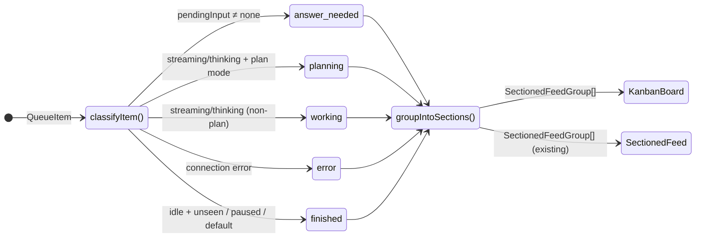
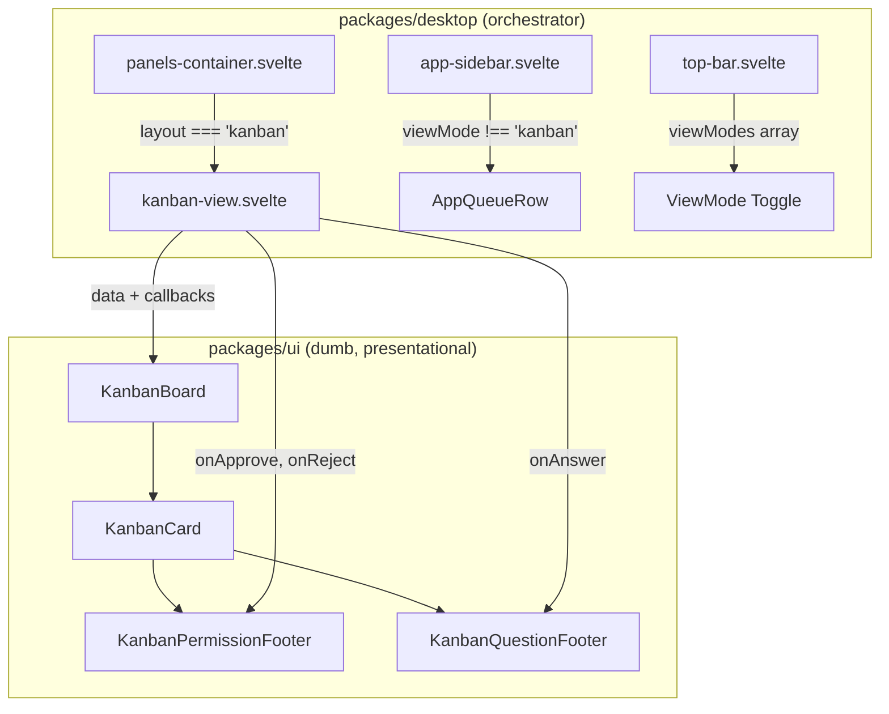

# feat: Add kanban view mode for attention queue

## Overview

Add a fourth layout mode — kanban — that renders all active sessions as cards organized in columns by queue section state. Cards follow the subagent-card visual language and embed inline permission/question controls so users can triage without leaving the board.

## Problem Frame

The existing attention queue is a compact sidebar widget optimized for quick triage. Power users running multiple agents across projects lack a spatial, persistent overview of all active work. A kanban board provides the bird's-eye layout where sessions are organized by state (Answer Needed → Planning → Working → Finished → Error), with inline action controls for permissions and questions.

Requirements are defined in [docs/brainstorms/2026-03-31-kanban-view-requirements.md](docs/brainstorms/2026-03-31-kanban-view-requirements.md).

## Requirements Trace

- R1. Kanban is a new `ViewMode` value, selectable from the layout menu
- R2. Queue sidebar section hides when kanban is active
- R3. Switching away from kanban restores prior panel/focus state
- R4. Kanban is persisted/restored via workspace state
- R5. Horizontal columns in section order: Answer Needed → Planning → Working → Finished → Error
- R6. Column headers with label, color accent, and item count
- R7. Empty columns remain visible with empty-state indicator
- R8. Vertical scroll per column
- R9. Horizontal scroll when columns overflow
- R10/R10a/R10b. Card design follows `AttentionQueueSubagentCard` tokens: `rounded-sm`, `border border-border/60`, `bg-accent/30`, violet accent strip, `Robot` icon, `TextShimmer`
- R11–R16. Card body: title, agent badge, project badge, time-ago, activity indicator, diff pill, error text, todo progress, mode badge
- R17. Click card → navigate to session in single view
- R18. Inline approval/answering in embedded card footer
- R19. No drag-and-drop
- R20. Same `QueueItem[]` and `groupIntoSections()` data source
- R21. Real-time updates as sessions change state
- R22. All queue sessions shown, no additional filtering
- R23. Board and card components in `packages/ui`
- R24. Desktop-specific wiring in `packages/desktop`
- R25–R27. Planning column via classifier change for plan-mode streaming sessions
- R28–R30. New dumb footer components in `packages/ui` for inline permission/question controls, wired by desktop

## Scope Boundaries

- No drag-and-drop between columns
- No custom column ordering, hiding, or filtering
- No inline chat or message composition from the board
- No additional queue sections beyond the five defined
- No WIP limits or column policies

## Context & Research

### Relevant Code and Patterns

- `packages/desktop/src/lib/acp/store/types.ts` L451 — `ViewMode` union: `"single" | "project" | "multi"`
- `packages/desktop/src/lib/acp/store/queue/queue-section-utils.ts` L14 — `QueueSectionId`, `classifyItem()`, `groupIntoSections()`, `SECTION_ORDER`
- `packages/desktop/src/lib/acp/store/queue/types.ts` — `QueueItem` interface with `currentModeId`, `state`, `pendingQuestion`
- `packages/ui/src/components/attention-queue/types.ts` — `SectionedFeedSectionId` already includes `"planning"` value
- `packages/ui/src/components/attention-queue/attention-queue-subagent-card.svelte` — design reference: `rounded-sm`, `border border-border/60`, `bg-accent/30`, violet accent strip, `Robot` icon, `TextShimmer`
- `packages/ui/src/components/attention-queue/feed-section-header.svelte` — already has icon/color mapping for `"planning"` (hammer icon, purple)
- `packages/ui/src/components/attention-queue/attention-queue.svelte` — `sectionColor()` already handles `"planning"` → `Colors.purple`
- `packages/desktop/src/lib/acp/logic/view-mode-state.ts` L41 — `getViewModeState()` maps `ViewMode` to layout decisions
- `packages/desktop/src/lib/components/main-app-view/components/content/panels-container.svelte` — layout conditional rendering
- `packages/desktop/src/lib/components/top-bar/top-bar.svelte` L61 — `viewModes` array for layout toggle UI
- `packages/desktop/src/lib/acp/store/workspace-store.svelte.ts` L542, L632 — persist/restore `viewMode`
- `packages/desktop/src/lib/acp/store/panel-store.svelte.ts` L65, L730 — `viewMode` state and `setViewMode()`
- `packages/desktop/src/lib/components/main-app-view/components/sidebar/app-sidebar.svelte` — queue section mount point
- `packages/desktop/src/lib/components/main-app-view/components/app-queue-row.svelte` L111 — `handleQueueItemSelect()` navigation callback
- `packages/ui/src/components/attention-queue/permission-feed-item.svelte` — design reference only (desktop-coupled, not reused)
- `packages/desktop/src/lib/acp/components/queue/queue-item-question-ui-state.ts` — design reference for question option color-cycling pattern (not reused)

### Institutional Learnings

- `/memories/repo/panel-viewmode-dual-fullscreen.md` — recent refactor making `viewMode="single"` + `focusedPanelId` the canonical agent fullscreen path
- `/memories/repo/workspace-store-fullscreen-restore-test-stub.md` — persistence test patterns for ViewMode

## Key Technical Decisions

- **Classifier change in `classifyItem()` directly**: Adding `"planning"` to `QueueSectionId` and classifying plan-mode streaming sessions there. The UI types and rendering already handle `"planning"` (color mapping, icon mapping). A post-classification split would add unnecessary indirection.
- **Flex-equal columns with horizontal scroll**: Each column takes equal flex space with `min-w-[200px]`. Below ~5×200px the container scrolls horizontally (R9). No fixed-width or responsive breakpoint complexity.
- **New dumb footer components, no queue-item reuse**: The card footer is built as new presentational components in `packages/ui` — `KanbanPermissionFooter` and `KanbanQuestionFooter`. They accept callback props (`onApprove`, `onReject`, `onAnswer`) and are wired by `packages/desktop`. Existing `PermissionFeedItem`, `PermissionActionBar`, and queue-item question UI are desktop-coupled and not reused.
- **Conditional unmount of queue sidebar section**: `{#if viewMode !== "kanban"}` guard around `AppQueueRow` in `app-sidebar.svelte`. Simpler than collapse-state management and avoids redundant rendering.
- **`getViewModeState()` returns `layout: "kanban"`**: New layout variant distinct from `"fullscreen"` and `"cards"`. `fullscreenPanel` and `activeProjectPath` are null in kanban mode.
- **Kanban persisted like other non-default modes**: saved as `"kanban"` in workspace state. On restore with unknown mode, the existing logic falls back to `"project"` which is safe.

## Open Questions

### Resolved During Planning

- **Column layout strategy** [R5, R9]: Flex-equal with `min-w-[200px]` per column and horizontal overflow scroll. Standard kanban pattern, no responsive breakpoints needed.
- **Footer component strategy** [R28–R30]: Build new dumb presentational components in `packages/ui` (`KanbanPermissionFooter`, `KanbanQuestionFooter`) that accept data + callback props. No reuse of existing `PermissionFeedItem` or `PermissionActionBar` — those are desktop-coupled. Desktop wires the callbacks.
- **Planning classifier approach** [R25–R27]: Directly in `classifyItem()`. The "planning" value already exists in `SectionedFeedSectionId`, `sectionColor()`, and `feed-section-header.svelte`. Adding it to the desktop classifier is the only missing piece.
- **Queue visibility in kanban** [R2]: Conditional unmount via `{#if}` in sidebar. The queue is an inline sidebar section, not a floating overlay.
- **Workspace restore** [R4]: Kanban saved/restored via same mechanism. No focused panel needed. Falls back safely to "project" if persisted kanban is ever unrecognized.

### Deferred to Implementation

- **Exact card sizing and padding scale-up**: R10 references subagent card tokens at "larger scale". The precise padding/font-size increase depends on visual testing at board scale.
- **Question option button layout in card footer**: Whether options wrap or truncate in the narrower card footer context depends on typical option count and card width.
- **Column empty-state text**: The specific copy for empty columns (e.g., "No sessions need attention") is a polish detail.

## High-Level Technical Design

> *This illustrates the intended approach and is directional guidance for review, not implementation specification. The implementing agent should treat it as context, not code to reproduce.*

## Implementation Units

- [ ] **Unit 1: Extend type system and classifier**

**Goal:** Add `"planning"` to `QueueSectionId`, `"kanban"` to `ViewMode`, and classify plan-mode streaming sessions as planning.

**Requirements:** R1, R25, R26, R27

**Dependencies:** None

**Files:**
- Modify: `packages/desktop/src/lib/acp/store/types.ts`
- Modify: `packages/desktop/src/lib/acp/store/queue/queue-section-utils.ts`
- Test: `packages/desktop/src/lib/acp/store/queue/queue-section-utils.test.ts`

**Approach:**
- Add `"kanban"` to the `ViewMode` union
- Add `"planning"` to `QueueSectionId` union
- Insert `"planning"` into `SECTION_ORDER` between `"answer_needed"` and `"working"`: `["answer_needed", "planning", "working", "finished", "error"]`
- Update `SECTION_LABELS` in `packages/desktop/src/lib/acp/components/queue/queue-section.svelte` to include a label mapping for `"planning"` (localized via paraglide)
- In `classifyItem()`, the updated priority chain (evaluated in order, first match wins):
  1. `pendingInput ≠ none` → `"answer_needed"`
  2. `(streaming || thinking) && currentModeId === "plan"` → `"planning"` *(new)*
  3. `streaming || thinking` → `"working"`
  4. `connection === "error"` → `"error"`
  5. `idle && hasUnseenCompletion` → `"finished"`
  6. `paused` → `"working"`
  7. default → `"finished"`
- R27 is satisfied automatically: plan-mode sessions with pending input still hit priority 1; idle/paused plan-mode sessions still hit priority 6/7
- Note: `classifyItem()` accesses `currentModeId` via the `item` parameter (`QueueItem.currentModeId`)

**Execution note:** Start with a failing test that asserts a streaming plan-mode item classifies as `"planning"`.

**Patterns to follow:**
- Existing `classifyItem()` priority chain pattern
- Existing `QueueSectionId` union pattern

**Test scenarios:**
- Happy path: streaming + `currentModeId === "plan"` → `"planning"`
- Happy path: thinking + `currentModeId === "plan"` → `"planning"`
- Happy path: streaming + `currentModeId !== "plan"` → `"working"` (unchanged)
- Happy path: streaming + `currentModeId === null` → `"working"` (unchanged)
- Edge case: plan mode + pending input → `"answer_needed"` (pending input takes priority — R27)
- Edge case: plan mode + idle + unseen completion → `"finished"` (R27)
- Edge case: plan mode + paused → `"working"` (R27)
- Integration: `groupIntoSections()` produces planning section in correct order between answer_needed and working

**Verification:**
- `classifyItem()` tests pass with planning scenarios
- `groupIntoSections()` test confirms section ordering includes planning
- Existing classifier tests still pass (no regressions)
- TypeScript check passes

---

- [ ] **Unit 2: KanbanCard presentational component**

**Goal:** Create the card component matching subagent-card visual language at board scale.

**Requirements:** R10, R10a, R10b, R11, R12, R13, R14, R15, R16

**Dependencies:** None (can be built independently of board layout)

**Files:**
- Create: `packages/ui/src/components/kanban/kanban-card.svelte`
- Create: `packages/ui/src/components/kanban/types.ts`
- Create: `packages/ui/src/components/kanban/index.ts` (public exports for `@acepe/ui`)
- Test: `packages/ui/src/components/kanban/kanban-card.test.ts`

**Approach:**
- Define a `KanbanCardData` interface in `types.ts` — a presentational projection of `QueueItem` with the fields needed for rendering (title, agentLabel, projectName, projectColor, timeAgo, activityText, isStreaming, isPlanMode, diffInsertions, diffDeletions, errorText, todoProgress, modeLabel, hasPendingInput)
- Card structure: outer container with `rounded-sm border border-border/60 bg-accent/30`, vertical layout
- Header row: violet `Robot` icon (Phosphor, `weight="fill"`, `Colors.purple`), title (truncated), time-ago
- Body: agent badge, project badge with color, mode badge
- Activity row: `TextShimmer` wrapping activity text when streaming (R10b), tool kind badge when not streaming
- Stats row: diff pill (insertions/deletions) when present, todo progress when present, error text when in error state
- Bottom: optional `{#snippet footer()}` slot for the embedded queue-item footer (Unit 3)
- Click handler on card container via `onclick` prop. The footer slot is responsible for calling `e.stopPropagation()` on its interactive elements to prevent card navigation when the user interacts with approval/question controls

**Patterns to follow:**
- `attention-queue-subagent-card.svelte` — exact design tokens
- `attention-queue-entry.svelte` — badge and diff pill patterns
- `packages/ui/src/lib/colors.ts` — `Colors.purple` for accent

**Test scenarios:**
- Happy path: renders title, agent badge, project badge with correct color
- Happy path: renders violet accent strip and Robot icon
- Happy path: streaming state shows TextShimmer around activity text
- Happy path: non-streaming state shows plain activity text
- Happy path: diff pill shows when insertions/deletions > 0
- Happy path: todo progress renders when present
- Happy path: error text renders when in error state
- Happy path: mode badge renders current mode
- Edge case: missing title shows fallback text
- Edge case: no activity, no diff, no todos — card still renders cleanly
- Integration: click fires onclick callback with card data

**Verification:**
- Component renders in all card states without errors
- Design tokens match subagent card reference
- TypeScript check passes

---

- [ ] **Unit 3: Kanban card footer components (permission + question)**

**Goal:** Create new dumb presentational components for inline permission approval and question answering inside kanban cards.

**Requirements:** R18, R28, R29, R30

**Dependencies:** Unit 2 (footer slot)

**Files:**
- Create: `packages/ui/src/components/kanban/kanban-permission-footer.svelte`
- Create: `packages/ui/src/components/kanban/kanban-question-footer.svelte`
- Modify: `packages/ui/src/components/kanban/types.ts` (footer prop types)
- Modify: `packages/ui/src/components/kanban/index.ts` (export new components)
- Test: `packages/ui/src/components/kanban/kanban-permission-footer.test.ts`
- Test: `packages/ui/src/components/kanban/kanban-question-footer.test.ts`

**Approach:**
- **No reuse of existing queue-item components.** Both footers are new dumb components in `packages/ui` that accept data + callback props. Desktop orchestrates them.
- `KanbanPermissionFooter` props: `permissionLabel: string`, `command: string | null`, `filePath: string | null`, `onApprove: () => void`, `onReject: () => void`. Renders a compact row with permission label text and approve/reject buttons. Buttons use the app's standard button primitives.
- `KanbanQuestionFooter` props: `questionText: string`, `options: readonly { label: string; selected: boolean }[]`, `onSelectOption: (index: number) => void`, `onSubmit: () => void`, `canSubmit: boolean`. Renders question text and option buttons using a color-cycling pattern. Single-select options call `onSelectOption` directly.
- Both footers call `e.stopPropagation()` on their interactive elements to prevent card navigation when the user interacts with approval/question controls
- Separator line (`border-t border-border/40`) at the top of each footer to visually divide from card body
- These are purely presentational — no store access, no Tauri imports, no runtime or app-specific logic

**Patterns to follow:**
- `attention-queue-subagent-card.svelte` — visual style reference (same card family)
- Existing button primitives in `packages/ui` for approve/reject styling
- Color-cycling pattern (visual reference from `queue-item-question-ui-state.ts`, reimplemented locally)

**Test scenarios:**
- Happy path: permission footer renders label and approve/reject buttons
- Happy path: question footer renders question text and option buttons
- Happy path: approve button calls onApprove callback
- Happy path: reject button calls onReject callback
- Happy path: selecting an option calls onSelectOption with index
- Edge case: no props → component does not render (guard at call site in KanbanCard)
- Integration: click on footer buttons does not bubble to card onclick

**Verification:**
- Components render correctly with props, fire callbacks on interaction
- Click propagation is stopped on footer interactions
- No imports from `packages/desktop` or any store/runtime
- TypeScript check passes

---

- [ ] **Unit 4: KanbanBoard presentational component**

**Goal:** Create the board layout with horizontal columns, section headers, and card slots.

**Requirements:** R5, R6, R7, R8, R9, R19, R22

**Dependencies:** Unit 2 (cards to render inside columns)

**Files:**
- Create: `packages/ui/src/components/kanban/kanban-board.svelte`
- Create: `packages/ui/src/components/kanban/kanban-column.svelte`
- Modify: `packages/ui/src/components/kanban/types.ts`
- Test: `packages/ui/src/components/kanban/kanban-board.test.ts`

**Approach:**
- `KanbanBoard` accepts `groups: SectionedFeedGroup<KanbanCardData>[]` and renders one `KanbanColumn` per group
- Board container: horizontal flex, `overflow-x-auto` for horizontal scroll (R9), full height
- `KanbanColumn`: vertical layout with section header (label, color, count), `overflow-y-auto` body for vertical scroll (R8), `min-w-[200px] flex-1` for equal sizing
- Empty column: show muted empty-state text placeholder (R7) — column stays visible in flex layout
- Section headers reuse the same color/icon mapping as `feed-section-header.svelte` — pass `sectionId` and derive color/icon from it
- All five columns always present (answer_needed, planning, working, finished, error) even when empty — unlike `groupIntoSections()` which skips empty sections, the board must show all columns for spatial stability
- Card slot via `{#snippet cardRenderer(item)}` pattern for desktop to inject wired cards

**Patterns to follow:**
- `attention-queue.svelte` — `sectionColor()` mapping
- `feed-section-header.svelte` — section icon mapping
- `SectionedFeedGroup` interface for group shape

**Test scenarios:**
- Happy path: renders 5 columns in correct order (answer_needed, planning, working, finished, error)
- Happy path: each column header shows label, count, and section color
- Happy path: cards render inside their correct column
- Happy path: empty column shows empty-state indicator
- Edge case: all columns empty — board renders 5 empty columns
- Edge case: one column has many items — column scrolls vertically
- Edge case: narrow viewport — board scrolls horizontally

**Verification:**
- Board renders all five columns regardless of data
- Items appear in correct columns
- TypeScript check passes

---

- [ ] **Unit 5: Desktop integration wiring**

**Goal:** Wire kanban view into the desktop app — layout state, persistence, sidebar, top-bar, navigation.

**Requirements:** R1, R2, R3, R4, R17, R20, R21, R24

**Dependencies:** Units 1–4

**Files:**
- Modify: `packages/desktop/src/lib/acp/logic/view-mode-state.ts`
- Modify: `packages/desktop/src/lib/components/main-app-view/components/content/panels-container.svelte`
- Modify: `packages/desktop/src/lib/components/main-app-view/components/sidebar/app-sidebar.svelte`
- Modify: `packages/desktop/src/lib/components/top-bar/top-bar.svelte`
- Modify: `packages/desktop/src/lib/acp/store/workspace-store.svelte.ts`
- Create: `packages/desktop/src/lib/components/main-app-view/components/content/kanban-view.svelte`
- Modify: `packages/desktop/src/lib/acp/components/queue/queue-section.svelte` (to pass all 5 sections including empty ones)
- Test: `packages/desktop/src/lib/acp/logic/view-mode-state.test.ts`

**Approach:**

*View mode state:*
- `getViewModeState()`: add a kanban branch before the existing layout derivation. When `viewMode === "kanban"`, return `layout: "kanban"`, `fullscreenPanel: null`, `activeProjectPath: null`, `isSingleMode: false`, `isFullscreenMode: false`. The boolean flags are false because kanban is not a single-panel or fullscreen layout — consumers that guard on `isSingleMode` or `isFullscreenMode` will correctly exclude kanban
- Update `ViewModeState` type: `layout` field changes from `"fullscreen" | "cards"` to `"fullscreen" | "cards" | "kanban"`. Search for `ViewModeState` usage to verify no consumers need additional updates

*Layout rendering:*
- In `panels-container.svelte`, add a third branch: `{:else if viewModeState.layout === "kanban"}` rendering the new `kanban-view.svelte` wrapper
- `kanban-view.svelte` is a desktop-specific wrapper that reads `queueStore.sections`, maps `QueueItem` → `KanbanCardData`, and renders `KanbanBoard` with wired callbacks
- Navigation callback: reuse the same `handleQueueItemSelect` pattern — clicking a card calls `panelStore.focusAndSwitchToPanel()` and sets `viewMode: "single"` (R17)
- Permission/question callbacks: `kanban-view.svelte` wires `onApprove`/`onReject`/`onAnswer` callbacks that call the permission and question stores in the desktop layer, then passes them as props through `KanbanBoard` → `KanbanCard` → footer components

*Sidebar:*
- In `app-sidebar.svelte`, wrap the queue section snippet in `{#if panelStore.viewMode !== "kanban"}` to hide the sidebar queue when kanban is active (R2)

*Top bar:*
- Add `{ value: "kanban", label: "Kanban", color: Colors.purple }` to the `viewModes` array
- Add icon case for kanban (Phosphor `Kanban` icon)

*Persistence:*
- `workspace-store.svelte.ts` save: include `"kanban"` in non-default save (currently saves non-"multi" modes — kanban is non-multi, so it's already covered)
- Restore: kanban value passes through existing `state.viewMode` setter. No focused panel needed.

*Data pipeline:*
- The kanban board must show all 5 columns including empty ones. `groupIntoSections()` skips empty sections. The board component or the desktop wrapper must produce all 5 section groups, filling in empty arrays for missing sections
- Real-time updates (R21) are automatic — `queueStore.sections` is reactive, and the kanban board re-renders when sections change

**Patterns to follow:**
- `getViewModeState()` existing branch pattern for layout decisions
- `panels-container.svelte` conditional rendering chain
- `app-queue-row.svelte` `handleQueueItemSelect()` navigation pattern
- `queue-section.svelte` desktop → UI mapping pattern

**Test scenarios:**
- Happy path: `getViewModeState()` with kanban returns `layout: "kanban"`, null fullscreenPanel
- Happy path: switching to kanban persists in workspace state
- Happy path: restoring kanban from persisted state sets correct viewMode
- Happy path: clicking a kanban card navigates to single view for that session
- Edge case: restoring unknown future mode falls back to "project" (existing behavior)
- Edge case: switching from kanban to project restores prior focus state (R3)
- Integration: kanban board receives reactive updates when queue items change state

**Verification:**
- Kanban selectable from top-bar view toggle
- Board renders in main content area, sidebar queue hidden
- Card click navigates to session
- Persist/restore round-trips correctly
- TypeScript check passes
- Full `bun --cwd packages/desktop run check` clean

## System-Wide Impact

- **Interaction graph:** `classifyItem()` change affects all consumers of `groupIntoSections()` — the existing sidebar queue and the new kanban board. Both already handle `"planning"` in their rendering paths.
- **Error propagation:** Permission approve/reject callbacks in the kanban footer are callback props wired by the desktop layer — they call the same permission/question stores as the existing queue. No new failure modes.
- **State lifecycle risks:** Switching view modes while a permission dialog is mid-interaction could lose user input. The footer should not maintain local state beyond what the permission/question store already tracks.
- **API surface parity:** The `SectionedFeedGroup` shape is shared between sidebar and kanban. Changes to group structure affect both consumers.
- **Integration coverage:** Card click → panel focus → view mode switch to single is a multi-component chain that unit tests alone will not fully prove.
- **Unchanged invariants:** The existing attention queue sidebar continues to work unchanged in single/project/multi modes. `groupIntoSections()` API remains the same — only its output now includes `"planning"` sections. `QueueItem` interface is unchanged.

## Risks & Dependencies

| Risk | Mitigation |
|------|------------|
| `"planning"` in QueueSectionId changes groupIntoSections() output for existing sidebar consumers | The sidebar's SectionedFeed and feed-section-header already handle "planning" — color, icon, and rendering are pre-wired. Low risk. |
| Workspace state with `"kanban"` loaded by older app version | Older versions treat unknown viewMode as undefined → fall back to "project" mode. Safe forward-compatibility. |
| Card footer permission/question interactions conflicting with card click navigation | Footer components stop click propagation on interactive elements (standard pattern). |
| Kanban board performance with many sessions (20+ cards) | Cards are lightweight presentational components. No virtualization needed for the expected scale (typically <20 active sessions). Defer optimization if needed. |

## Sources & References

- **Origin document:** [docs/brainstorms/2026-03-31-kanban-view-requirements.md](docs/brainstorms/2026-03-31-kanban-view-requirements.md)
- Related code: `packages/desktop/src/lib/acp/store/queue/queue-section-utils.ts` (classifier)
- Related code: `packages/ui/src/components/attention-queue/` (existing queue UI patterns)
- Related code: `packages/desktop/src/lib/acp/logic/view-mode-state.ts` (layout state)
