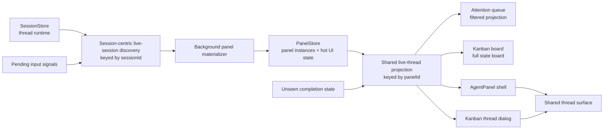

# feat: Unify live thread state across kanban and normal layouts

## Problem Frame

Kanban currently presents queue-derived cards while the normal layouts present real agent panels. That means layout changes can alter what thread state exists, what state is visible, and which interactions are available. The revised requirements now define a stronger model: every live session should join the normal panel system automatically, kanban should display that same live thread state, opening from kanban should show the full normal thread UI in a dialog, and completed threads should progress from Finished to Idle instead of disappearing from the broader thread board.

This plan describes how to make panel-backed live thread state the single source of truth across kanban, queue, and the normal layouts without regressing current panel behavior, restore behavior, or high-frequency streaming updates.

## Scope Boundaries

- Keep kanban as a layout mode; do not turn it into a separate panel type.
- Do not introduce a kanban-only quick view. The kanban dialog must host the real thread surface.
- Do not auto-remove panels when a live session becomes idle.
- Do not redesign the existing queue visuals unless required by the shared projection work.
- Do not change agent/runtime backends beyond what is needed to classify Idle vs Finished and to keep panel lifecycles synchronized.
- Persisting Finished versus Idle across a full app restart is out of scope for the first delivery; restored threads without a fresh unseen marker may resume as Idle.

## Requirements Traceability

- Shared panel-backed live state: R1-R5, R21, R35-R40 in docs/brainstorms/2026-03-31-kanban-view-requirements.md
- View-mode and restore guarantees: R6-R9
- Board order and status semantics: R10-R20
- Card and interaction model: R22-R34
- Shared UI reuse expectations: R39-R41

## Local Research Summary

- AgentPanel already composes SessionStore runtime data with PanelStore hot state keyed by panel id in packages/desktop/src/lib/acp/components/agent-panel/components/agent-panel.svelte.
- PanelsContainer already treats view mode as a presentation concern and renders AgentPanel for single, project, and multi in packages/desktop/src/lib/components/main-app-view/components/content/panels-container.svelte and packages/desktop/src/lib/acp/logic/view-mode-state.ts.
- Kanban currently bypasses panel-backed state and derives cards from queue items in packages/desktop/src/lib/components/main-app-view/components/content/kanban-view.svelte.
- The queue pipeline still depends on a separate session-to-panel bridge via queueStore.updateFromSessions in packages/desktop/src/lib/components/main-app-view/components/app-queue-row.svelte.
- Session panels are created today only on explicit open/create flows through SessionHandler, MainAppViewState, and direct panelStore.openSession calls.
- WorkspaceStore already persists and restores agent panels as the normal panel layout in packages/desktop/src/lib/acp/store/workspace-store.svelte.ts.
- Finished versus seen state is currently owned by UnseenStore and keyed by panel id in packages/desktop/src/lib/acp/store/unseen-store.svelte.ts and packages/desktop/src/lib/components/main-app-view.svelte.
- Existing deterministic session-state work already uses status value idle in packages/desktop/docs/plans/2026-01-28-deterministic-session-state.md, so Idle fits the current session vocabulary instead of inventing a new runtime concept.

## Decision Summary

- Treat SessionStore as canonical for thread runtime and PanelStore as canonical for panel instances plus panel-local UI state.
- Home the shared live-thread projection in a reusable acp/store-layer module so both queue and kanban can consume it without depending on main-app-view internals.
- Quietly create a normal agent panel for each live session without changing focus or layout.
- Materialize missing panels from session-centric liveness signals first, then build panel-backed board items after panel existence is guaranteed.
- Keep those panels in the normal layout after the thread becomes idle until the user closes them.
- Closing an auto-created live panel dismisses it without disconnecting the session and suppresses rematerialization until fresh activity or fresh pending input arrives.
- Suppression blocks only automatic rematerialization. Any explicit user-open action clears suppression and reopens the panel immediately.
- Extract a reusable thread surface from AgentPanel so kanban can host the full thread UI in a dialog.
- Keep Finished as unseen completion and Idle as seen resting state, with UnseenStore remaining the first-pass owner of that transition through the backing panel id.
- For the first implementation, unseen completion remains runtime-scoped; after a restart, restored threads without a fresh unseen marker resume as Idle. This should be explicit and tested.
- Explicit user engagement promotes an auto-created panel to user-owned, so later close behavior follows normal explicit-panel semantics.

## System-Wide Impact

- Panel lifecycle will no longer be driven only by explicit user opens; background live-session sync becomes part of app state orchestration.
- Kanban stops being a queue-only view and becomes a panel-backed board of thread states.
- Queue semantics remain attention-focused, but queue data must become a filtered projection of the same thread model rather than an independent builder.
- Workspace persistence must keep handling agent panels correctly even as more of them are created automatically.
- AgentPanel extraction affects one of the highest-churn Svelte components in the app and needs conservative regression coverage.

## High-Level Technical Design

This diagram illustrates the intended approach and is directional guidance for review, not implementation specification. The implementing agent should treat it as context, not code to reproduce.

The implementation should preserve the current separation of concerns while changing the join point:

- SessionStore keeps runtime truth about thread activity, entries, modes, and models.
- PanelStore keeps panel existence, ordering, focus/fullscreen state, drafts, review state, sidebars, and other panel-local UI state.
- A session-centric discovery path identifies live sessions before panel existence and materializes missing panels without focus theft.
- A new shared projection layer joins panel-backed sessions, unseen completion state, and pending-input state into board items with statuses Answer Needed, Planning, Working, Finished, Idle, and Error.
- Kanban and the queue consume that projection differently instead of each building its own runtime model.
- AgentPanel becomes a shell around a reusable thread surface so the same panel-backed interaction model can appear inside a kanban dialog.
- Both normal-panel viewing and kanban-dialog viewing must clear Finished through the same backing-panel seen path.

## Implementation Units

### [ ] Unit 1: Introduce a Shared Live-Thread Projection

**Goal**

Create a pure projection layer that turns panel-backed sessions into stable thread-board items with explicit Finished and Idle semantics.

**Requirements**

- R4-R5, R10-R20, R35-R38

**Dependencies**

- None

**Files**

- Add: packages/desktop/src/lib/acp/store/thread-board/thread-board-status.ts
- Add: packages/desktop/src/lib/acp/store/thread-board/thread-board-item.ts
- Add: packages/desktop/src/lib/acp/store/thread-board/build-thread-board.ts
- Add: packages/desktop/src/lib/acp/store/thread-board/__tests__/build-thread-board.test.ts

**Approach**

- Define a board-specific status vocabulary separate from raw session hot-state fields.
- Build pure helpers that accept panel-backed session inputs plus unseen and pending-input signals, then emit thread-board items keyed by panel id.
- Make precedence explicit and total: Answer Needed overrides Error, Error overrides active work, active plan work overrides active non-plan work, active work overrides Finished, and Finished overrides Idle.
- Encode Finished versus Idle explicitly: unseen completion remains Finished, seen resting thread becomes Idle.
- Keep UnseenStore as the first-pass authoritative owner for Finished versus Idle, and require both normal-panel focus and kanban-dialog open to reuse the same markSeen(panelId) path.
- Lock the initial restart behavior explicitly: restored threads without a fresh unseen marker resume as Idle.
- Keep the builder UI-agnostic; it should not depend on Svelte component types or queue-specific section objects.

**Execution Note**

- Implement test-first. Start with pure failing tests for status mapping and ordering before adding the builder.

**Patterns To Follow**

- packages/desktop/src/lib/acp/store/queue/queue-section-utils.ts
- packages/desktop/src/lib/components/main-app-view/components/content/panel-grouping.ts
- packages/desktop/src/lib/components/main-app-view/components/content/kanban-view.svelte

**Test Scenarios**

- A plan-mode thread that is streaming maps to Planning.
- A non-plan thread that is streaming maps to Working.
- A thread with pending permission or question maps to Answer Needed even if it is otherwise active.
- A thread with both error and unseen completion maps to Error.
- A thread with pending input and plan-mode streaming maps to Answer Needed.
- A completed unseen thread maps to Finished.
- A completed seen thread maps to Idle.
- A restored thread without an unseen marker maps to Idle.
- An error thread maps to Error regardless of Finished or Idle candidates.
- Ordering produces Answer Needed, Planning, Working, Finished, Idle, Error.

**Verification**

- A caller can derive stable board groups and card data from panel-backed session inputs without consulting queueStore-specific section builders.

### [ ] Unit 2: Add an Idempotent Background Panel Materialization Primitive

**Goal**

Add a PanelStore primitive that can materialize a session panel in the background without changing focus, fullscreen state, or layout.

**Requirements**

- R1-R3, R6-R9, R21, R38

**Dependencies**

- None

**Files**

- Modify: packages/desktop/src/lib/acp/store/panel-store.svelte.ts
- Add: packages/desktop/src/lib/acp/store/__tests__/panel-store-background-open.vitest.ts

**Approach**

- Add a non-focus-stealing panel materialization path in PanelStore, distinct from the existing user-facing open-and-focus behavior.
- Reuse existing panels when present instead of duplicating by session id.
- Preserve focusedPanelId, viewMode, and fullscreen selection exactly.
- Keep background-created ordering deterministic so new hidden panels do not cause visible tab or project-card jumps.

**Execution Note**

- Implement test-first. Characterize current openSession focus behavior, then add separate coverage for the new background materialization path.

**Patterns To Follow**

- packages/desktop/src/lib/acp/store/panel-store.svelte.ts

**Test Scenarios**

- A newly live session gets a panel if none exists.
- Background materialization does not change focusedPanelId, viewMode, or fullscreen selection.
- Re-materializing a session with an existing panel is a no-op.
- Background materialization preserves stable panel ordering.
- Explicit user-driven open behavior still focuses as before.

**Verification**

- PanelStore can create or reuse a hidden session panel with no observable focus theft, and duplicate panels by session id are prevented.

### [ ] Unit 3: Wire Live-Session Sync, Dismissal Policy, and Restore Behavior

**Goal**

Use session-centric liveness to materialize panels automatically, define what closing an auto-created live panel means, and make restore behavior explicit for hidden idle panels.

**Requirements**

- R1-R9, R21, R38

**Dependencies**

- Unit 2

**Files**

- Add: packages/desktop/src/lib/components/main-app-view/logic/live-session-panel-sync.ts
- Modify: packages/desktop/src/lib/acp/store/types.ts
- Modify: packages/desktop/src/lib/acp/store/panel-store.svelte.ts
- Modify: packages/desktop/src/lib/components/main-app-view.svelte
- Modify: packages/desktop/src/lib/components/main-app-view/logic/managers/session-handler.ts
- Modify: packages/desktop/src/lib/acp/store/workspace-store.svelte.ts
- Add: packages/desktop/src/lib/components/main-app-view/tests/live-session-panel-sync.test.ts
- Add: packages/desktop/src/lib/components/main-app-view/tests/live-session-panel-restore.test.ts

**Approach**

- Drive automatic panel creation from SessionStore runtime and pending-input signals keyed by session id, not from the panel-backed board projection.
- Introduce persisted provenance for auto-materialized agent panels so restore and dismissal behavior can be reasoned about explicitly.
- Treat closing an auto-created live panel as dismissal, not disconnect. Suppress only automatic rematerialization until the next fresh activity transition or fresh pending-input transition.
- Clear suppression immediately for any explicit user-open path, including queue selection, notification view actions, and kanban card open.
- Promote an auto-created panel to user-owned when the user explicitly opens or focuses it through a normal panel affordance.
- Restore persisted auto-created panels eagerly into panel topology so the board remains complete after restart, but defer ACP reconnection for hidden idle auto-created panels until the user surfaces them or fresh activity reactivates them.
- Make Unit 3 the explicit owner for both startup hydration behavior and close-panel behavior for auto-created panels.

**Execution Note**

- Implement test-first. Add coverage for dismissal and restore rules before wiring the sync manager into main-app-view.

**Patterns To Follow**

- packages/desktop/src/lib/components/main-app-view.svelte
- packages/desktop/src/lib/components/main-app-view/logic/managers/session-handler.ts
- packages/desktop/src/lib/acp/store/workspace-store.svelte.ts

**Test Scenarios**

- A session that becomes live is materialized from session-centric liveness even if no panel exists yet.
- A dismissed live panel does not immediately reopen while the same activity state is unchanged.
- Fresh activity or fresh pending input after dismissal recreates the panel.
- An explicit user-open action clears suppression and reopens the dismissed live panel immediately.
- Explicit user-open promotes the panel from auto-created to user-owned.
- A live panel hidden by project focus or fullscreen remains in the normal panel layout.
- Hidden idle auto-created panels restore into panel topology without eager reconnect churn.
- A workspace saved in kanban restores the board, focused state, and hidden auto-created panels coherently.

**Verification**

- Automatic panel lifecycle is predictable across live updates, user close actions, and workspace restore.

### [ ] Unit 4: Extract a Shared Thread Surface from AgentPanel

**Goal**

Make the full thread UI reusable so both the normal panel shell and a kanban dialog can render the same live interaction surface.

**Requirements**

- R4, R31-R34, R39-R41

**Dependencies**

- None

**Files**

- Add: packages/desktop/src/lib/acp/components/agent-panel/components/agent-panel-surface.svelte
- Add: packages/desktop/src/lib/acp/components/agent-panel/types/agent-panel-surface-props.ts
- Modify: packages/desktop/src/lib/acp/components/agent-panel/components/agent-panel.svelte
- Modify: packages/desktop/src/lib/acp/components/agent-panel/components/index.ts
- Add: packages/desktop/src/lib/acp/components/agent-panel/components/__tests__/agent-panel-surface.svelte.vitest.ts
- Modify: packages/desktop/src/lib/acp/components/agent-panel/__tests__/agent-panel-component.test.ts

**Approach**

- Move the thread-specific content, composer, review path, sidebars, and live runtime binding into a reusable surface component that still receives panelId and sessionId.
- Keep AgentPanel responsible for layout shell concerns such as width, resize edge, fullscreen shell, attached panes, and panel-specific chrome.
- Preserve current store access patterns so the extracted surface still reads the same PanelStore and SessionStore state keyed by panel id and session id.

**Execution Note**

- Implement characterization-first. Lock down the current AgentPanel behaviors that must survive extraction before moving markup.

**Patterns To Follow**

- packages/desktop/src/lib/acp/components/agent-panel/components/agent-panel.svelte
- packages/desktop/src/lib/acp/components/agent-panel/components/agent-panel-content.svelte
- packages/desktop/src/lib/acp/components/agent-panel/components/agent-panel-header.svelte
- packages/desktop/src/lib/components/review-fullscreen/review-fullscreen-page.svelte

**Test Scenarios**

- The extracted surface renders session entries, live tool calls, and composer state from the same panelId and sessionId inputs.
- Pending user-entry state still appears before session creation completes.
- Review mode and review file index remain driven by panel-local state.
- Browser sidebar, embedded terminal drawer, and plan sidebar stay synchronized through the same panel hot state.
- Existing AgentPanel shell behavior remains intact after delegation to the shared surface.

**Verification**

- A full thread interaction surface can be embedded in more than one shell without re-implementing session logic.

### [ ] Unit 5: Rebuild Kanban on the Shared Projection and Full Thread Dialog

**Goal**

Make kanban a board of panel-backed threads, including Idle, and let card click open the full thread UI in-dialog without leaving kanban.

**Requirements**

- R7-R20, R22-R34

**Dependencies**

- Unit 1
- Unit 3
- Unit 4

**Files**

- Add: packages/desktop/src/lib/components/main-app-view/components/content/kanban-thread-dialog.svelte
- Modify: packages/desktop/src/lib/components/main-app-view/components/content/kanban-view.svelte
- Modify: packages/desktop/src/lib/components/main-app-view/components/content/kanban-view.svelte.vitest.ts
- Modify: packages/desktop/src/lib/components/main-app-view/components/content/kanban-layout.contract.test.ts
- Modify: packages/desktop/src/lib/components/main-app-view/components/content/kanban-new-session.contract.test.ts

**Approach**

- Replace queue-item-first card building in KanbanView with the shared thread-board projection keyed by panel id.
- Keep inline permission and question controls on the card surface where they still make sense.
- Add a kanban dialog shell that hosts the shared thread surface using the same panelId and sessionId as the normal panel system.
- Mark the backing panel seen through the same unseen-store path used by normal panel focus when the kanban dialog first activates the shared thread surface.
- Preserve the current no-layout-switch behavior for kanban interactions.

**Execution Note**

- Implement test-first. Add source and behavior contracts for Idle column order and card-open behavior before rewiring the view.

**Patterns To Follow**

- packages/desktop/src/lib/components/main-app-view/components/content/kanban-view.svelte
- packages/desktop/src/lib/components/main-app-view/components/content/panels-container.svelte
- packages/ui/src/components/kanban/kanban-board.svelte

**Test Scenarios**

- Kanban renders columns in order Answer Needed, Planning, Working, Finished, Idle, Error.
- A seen completed thread appears in Idle, not Finished.
- A Finished thread becomes Idle after it is seen from either the kanban dialog or the normal layout.
- Clicking a card opens a dialog and keeps viewMode as kanban.
- The dialog renders the full thread surface, not a summary-only quick view.
- Live tool-call state and composer edits made in the dialog are reflected when returning to the normal layouts.
- Creating a new thread from kanban still leaves the user on the board.

**Verification**

- Kanban becomes a live board of the same threads that exist in the normal panel system, with no layout switch required for full interaction.

### [ ] Unit 6: Align the Attention Queue and Notification Flows with the Shared Model

**Goal**

Remove the remaining runtime split by making the attention queue consume the shared live-thread projection instead of a separate session-to-panel join path.

**Requirements**

- R5, R7, R18-R20, R29-R30, R35-R38

**Dependencies**

- Unit 1
- Unit 3

**Files**

- Modify: packages/desktop/src/lib/components/main-app-view/components/app-queue-row.svelte
- Modify: packages/desktop/src/lib/components/main-app-view.svelte
- Modify: packages/desktop/src/lib/acp/store/queue/queue-store.svelte.ts
- Modify: packages/desktop/src/lib/acp/store/queue/queue-section-utils.ts
- Modify: packages/desktop/src/lib/acp/store/queue/__tests__/queue-sections.test.ts
- Add: packages/desktop/src/lib/components/main-app-view/tests/live-thread-notifications.test.ts

**Approach**

- Reframe the queue as a filtered attention view over the shared projection, excluding Idle while keeping Finished until completion is seen.
- Remove the need for queueStore to be the place where session state and panel state are first joined.
- Keep the existing queue UI and section semantics, but feed it items derived from the shared board model.
- Update notification and popup view actions to assume panels already exist or can be recovered through the same materialization policy, then verify stale-popup dismissal and view actions under hidden-panel conditions.
- Treat explicit notification or queue open actions as suppression-clearing user intent so dismissed live panels remain recoverable on demand.

**Execution Note**

- Implement test-first. Preserve existing queue-section expectations while adding new Finished-to-Idle transition coverage.

**Patterns To Follow**

- packages/desktop/src/lib/components/main-app-view/components/app-queue-row.svelte
- packages/desktop/src/lib/acp/store/queue/queue-store.svelte.ts
- packages/desktop/src/lib/acp/store/queue/queue-section-utils.ts

**Test Scenarios**

- Idle threads are absent from the attention queue but present in kanban.
- Finished threads remain in the queue until the user sees them.
- Once seen, those threads leave the queue and move to Idle on the board.
- Queue item selection focuses the already-existing panel instead of creating a new one.
- Error and pending-input threads remain queue-visible regardless of Idle eligibility.
- Permission and question popup view actions resolve to the correct backing panel even when that panel is hidden.
- Completion notifications are dismissed or updated correctly when a Finished thread is seen from kanban.

**Verification**

- The queue and kanban differ only by filtering and grouping, and notification flows remain correct for hidden or auto-created panels.

## Risks And Mitigations

- Risk: AgentPanel extraction regresses fullscreen, review, or sidebar behaviors.
  Mitigation: characterize current shell behaviors before extraction and keep the shell/surface boundary narrow.

- Risk: Quiet background panel creation accidentally steals focus or pollutes ordering.
  Mitigation: introduce a dedicated background materialization API instead of overloading existing openSession behavior.

- Risk: Workspace persistence becomes noisy as more panels are created automatically.
  Mitigation: keep auto-created panels in the same persisted model and validate restore/ordering behavior explicitly.

- Risk: Queue semantics regress while migrating away from QueueItem-first joins.
  Mitigation: keep queue presentation stable and migrate it only after the shared projection has independent tests.

## Deferred Technical Questions

- Whether kanban should eventually reuse more presentational pieces from packages/ui once the dialog/thread split is stable.

## Validation Strategy

- Pure logic tests for status classification and Finished-to-Idle transitions.
- PanelStore tests for background panel materialization semantics.
- Sync and restore tests for dismissal suppression and lazy restore of hidden idle auto-created panels.
- Svelte component tests for AgentPanel surface extraction.
- Source contracts and component tests for kanban layout, dialog behavior, and idle column presence.
- Queue and notification regression tests to prove queue remains an attention-only filter over the shared model.
- Regression tests that lock the first-pass restart contract: restored threads without a fresh unseen marker resume as Idle while the board still restores complete panel topology.
- Desktop typecheck after each unit because the panel, queue, and agent-panel paths are highly interconnected.
