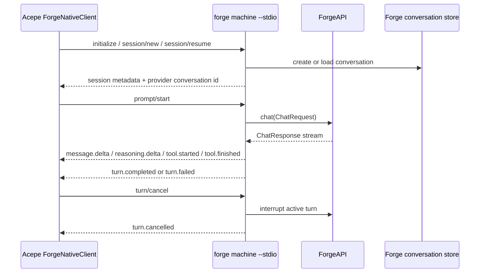

# feat: Add Forge machine interface and Acepe integration

## Problem Frame

Acepe integrates cleanly when the upstream agent exposes a stable machine-facing contract. Forge already has structured internal chat streaming, explicit conversation IDs, and conversation management APIs, but its public CLI remains terminal-first. Without an upstream contract, Acepe would need to scrape PTY output or couple itself to Forge's human UI rendering, which would be brittle for both projects.

This plan defines the clean split discussed in discovery: Forge should expose a first-class machine interface for prompt submission, streaming deltas, cancellation, and session resume, and Acepe should consume that interface through a dedicated client that fits its existing transport abstractions.

## Planning Bootstrap Requirements

- B1. Forge owns the machine-facing integration contract; Acepe consumes it rather than inferring state from terminal rendering.
- B2. The first delivery must support create, list, and resume session flows using Forge conversation IDs as the provider-owned identity.
- B3. The first delivery must support send-prompt, streamed assistant deltas, streamed reasoning deltas, tool lifecycle events, interrupt, completion, and error reporting.
- B4. Acepe must preserve its own session IDs as canonical UI identity and persist Forge conversation IDs separately via `provider_session_id`.
- B5. The first clean integration should avoid long-term PTY scraping and should not require a standalone ACP adapter.
- B6. The initial Acepe delivery may assume Forge credentials plus default provider and model are already configured in Forge.
- B7. ACP adapterization is explicitly deferred until the Forge-native machine interface proves stable and useful beyond Acepe.
- B8. Historical Forge sessions reopened from Acepe must load through the machine contract or Acepe-owned persisted state, not by scraping Forge terminal output or reading Forge transcript files directly.

## Success Criteria

- Forge can run in a machine-facing mode without a TTY and emit structured streaming events for a single turn from start through completion.
- Acepe can use `session/list` for explicit Forge resume discovery within the current workspace and can resume a listed conversation without importing unrelated Forge conversations into the persistent sidebar.
- Acepe can create or resume a Forge-backed session, send a prompt with `send_prompt_fire_and_forget`, and render streamed updates using its existing session update pipeline.
- Acepe resumes Forge sessions using persisted `provider_session_id` aliases rather than treating Forge conversation IDs as its own canonical session IDs.
- Acepe can reopen a persisted Forge-backed session from its own session metadata and load historical content through a provider-native machine snapshot instead of Forge disk scanning.
- A cancelled Forge turn yields a deterministic terminal state, leaves the conversation resumable, and can be replayed correctly from `session/export` history.
- Acepe fails fast with an actionable incompatibility error when the installed Forge binary is missing required machine protocol capabilities or is older than the minimum supported machine protocol version.
- The first delivery does not require Acepe to parse `forge conversation dump` output or scrape the interactive UI.
- The first delivery keeps the Forge interactive terminal UX unchanged for human users, with an explicit regression gate covering at least one existing human TTY prompt flow.

## Scope Boundaries

- Do not build a full ACP server inside Forge in the first delivery.
- Do not make Acepe depend on PTY scraping except for optional local spikes or diagnostics.
- Do not expose Forge provider login or provider selection inside Acepe in the first delivery.
- Do not expose Forge model pickers inside Acepe until Forge exposes stable machine-readable model discovery and per-session override semantics; v1 uses Forge's preconfigured default model.
- Do not add a Forge filesystem scanner in `packages/desktop/src-tauri/src/history/indexer.rs` in v1; Acepe's first-pass history support should cover sessions created or resumed through Acepe and load transcript contents through the machine interface.
- Do not redesign Forge's existing interactive CLI or terminal UI beyond factoring shared logic away from it.
- Do not add Acepe-managed Forge binary installation until Forge ships stable release artifacts and invocation semantics for the machine mode; v1 availability is PATH-detected only.

## Terminology Contract

- Visible mode IDs are `plan` and `build` and are the only mode values Acepe sends on the wire.
- Internal Forge targets (`muse` and `forge`) are provider-internal execution profiles chosen by Forge from the visible mode ID.
- Forge model configuration remains provider-owned in v1. Acepe does not expose Forge model pickers or session model overrides.

## Requirements Traceability

- Forge-owned machine contract: B1-B3, B5
- Provider-owned conversation aliasing and resume semantics: B2, B4
- Acepe transport integration: B3-B6
- Historical replay without disk scanning: B2, B4, B8
- Deferred adapterization and rollout boundaries: B6-B8

## Local Research Summary

- Acepe already dispatches agent implementations by transport in `packages/desktop/src-tauri/src/acp/client_trait.rs` and `packages/desktop/src-tauri/src/acp/client_factory.rs`, with current modes `Subprocess`, `Http`, `CcSdk`, and `CodexNative`.
- Acepe's current integrations show the desired pattern: Claude uses a direct SDK path in `packages/desktop/src-tauri/src/acp/providers/claude_code.rs`, Codex uses a native app-server transport in `packages/desktop/src-tauri/src/acp/providers/codex.rs`, OpenCode uses HTTP plus SSE in `packages/desktop/src-tauri/src/acp/providers/opencode.rs`, and Cursor and Copilot rely on machine-facing subprocess protocols.
- Provider-owned session aliasing is already a first-class Acepe pattern. `packages/desktop/src-tauri/src/acp/client/cc_sdk_client.rs` and `packages/desktop/src-tauri/src/acp/client/codex_native_client.rs` persist provider transcript IDs separately via `provider_session_id`.
- Acepe's built-in providers are registered centrally in `packages/desktop/src-tauri/src/acp/registry.rs`, exported through `packages/desktop/src-tauri/src/acp/providers/mod.rs`, and keyed by `CanonicalAgentId` in `packages/desktop/src-tauri/src/acp/types.rs`.
- Acepe's historical replay path is separate from provider registration. `packages/desktop/src-tauri/src/acp/commands/session_commands.rs` already persists session metadata for Acepe-originated sessions, while `packages/desktop/src-tauri/src/history/commands/session_loading.rs` still needs an agent-specific loader branch to reopen transcript contents. The background source scanner in `packages/desktop/src-tauri/src/history/indexer.rs` is for external disk-based sources and can remain unchanged in v1.
- Forge-facing frontend ripple is real. `packages/desktop/src/lib/acp/types/agent-id.ts`, `packages/desktop/src/lib/acp/store/agent-store.svelte.ts`, and `packages/desktop/src/lib/components/settings/models-tab.svelte` all hard-code current built-in agents and current default ordering assumptions.
- Specta-generated frontend history and ACP types are emitted from `packages/desktop/src-tauri/src/session_jsonl/export_types.rs`; generated files such as `packages/desktop/src/lib/services/claude-history-types.ts` and `packages/desktop/src/lib/services/acp-types.ts` should be regenerated, not treated as manual source-of-truth files.
- Forge already streams typed chat state internally. `crates/forge_main/src/ui.rs` runs `api.chat(chat)` and handles `ChatResponse::TaskMessage`, `TaskReasoning`, `ToolCallStart`, `ToolCallEnd`, `Interrupt`, and `TaskComplete`, while `crates/forge_domain/src/result_stream_ext.rs` can already emit partial markdown and reasoning deltas during stream aggregation.
- Forge's public CLI already supports explicit `--conversation-id`, `conversation list`, `conversation info`, `conversation show`, `conversation dump`, `conversation resume`, and `conversation retry` flows in `crates/forge_main/src/cli.rs`, but those flows currently target a human terminal contract instead of a machine client.

## Decision Summary

- Use Forge-first sequencing. Add a Forge-native machine mode before adding an Acepe provider.
- Use structured stdio NDJSON as the first public machine transport. This fits Forge's CLI shape, avoids local port lifecycle management, and maps cleanly onto Acepe's subprocess and native-client patterns.
- Reuse Forge conversation IDs as the provider-owned session identity and keep Acepe session IDs unchanged.
- Keep the first Acepe integration as a first-party built-in provider backed by an external PATH-installed `forge` CLI, not an Acepe-managed binary. In `pre_tag_hidden`, Forge remains hidden from user-visible built-in lists and default ordering; visibility can begin only in `tagged_preview`.
- Freeze model behavior in v1. Acepe sends only visible `build` or `plan` mode IDs on each `prompt/start`, and Forge owns the internal `build -> forge` and `plan -> muse` translation. Acepe does not expose Forge model defaults or `set_session_model` until Forge exposes stable machine-readable model discovery plus per-session override semantics. The machine handshake should advertise `sessionModels: false` in v1.
- Treat mode as turn-scoped in v1 rather than session-scoped. `session/new` and `session/resume` establish conversation identity only; Acepe chooses `plan` or `build` on each `prompt/start`.
- Treat `providerSessionId` as the sole conversation identity and `cwd` as a normalized workspace-context guard. `session/list` is cwd-scoped discovery, while `session/resume`, `session/export`, and `prompt/start` validate the supplied workspace context before operating.
- Add provider-native historical replay to the machine contract with a `session/export` style snapshot call so Acepe can reopen persisted Forge sessions without disk parsing.
- Gate Acepe's Forge provider on a minimum supported Forge machine protocol version and fail fast when the binary is missing or too old.
- Defer a standalone Forge ACP adapter until the native machine mode proves stable enough that an adapter would be thin rather than interpretive.

## Cross-Repo Execution And Handoff

This is a cross-repo plan with an explicit gate between Forge and Acepe work:

- Units 1-2 land in Forge first and ship in a tagged Forge release.
- Acepe may begin hidden, fixture-driven Units 3-4 plumbing once the protocol artifacts below are stable on a reviewed Forge branch, but user-visible provider enablement, default ordering changes, and release readiness remain gated on the tagged Forge release.
- Acepe may prototype locally against a temp Forge branch during discovery, but no enabled Acepe integration ships or is treated as release-ready until the released Forge tag is available.

The authoritative handoff artifacts are, in order:

- Forge `docs/machine-protocol-v1.md`
- Forge `crates/forge_main/src/machine/protocol.rs`
- Forge `crates/forge_main/tests/fixtures/machine_protocol_v1/`

If those released Forge artifacts drift from this plan document, the released Forge artifacts win and this plan must be updated before Acepe implementation resumes.

## Rollout Visibility States

- `pre_tag_hidden`: Acepe may merge fixture-driven and protocol plumbing, but Forge must stay out of user-visible built-in agent lists, default ordering, and settings surfaces.
- `tagged_preview`: once the required Forge tag exists, Forge may be visible in the agent list as preview-capable but must remain out of default ordering and must show setup-required remediation when unavailable.
- `broad_v1`: only after preview verification closes critical protocol and UX issues does Forge become a normal visible built-in option for general release.

Promotion gate from `tagged_preview` to `broad_v1` requires:

- no unresolved P1 protocol compatibility regressions,
- passing interactive TTY regression smoke checks,
- passing Forge unavailable/outdated/unconfigured remediation checks in Acepe.

## System-Wide Impact

- Forge gains a new public integration surface that must remain versioned and testable independently of the interactive UI.
- Acepe gains a sixth built-in agent integration and its first custom native transport after Codex.
- Acepe's built-in agent metadata, default-agent selection, and model settings surfaces all need explicit Forge handling even though Forge model selection remains disabled in v1.
- Acepe's history loading path gains a provider-backed replay branch, while the external filesystem indexer intentionally remains unchanged in v1.
- Session lifecycle semantics become cleaner across both projects because provider-owned conversation identity is made explicit instead of inferred.
- Release sequencing matters: Acepe's Forge integration should be gated on a Forge release that contains the machine mode contract and fixtures stable enough for client tests.

## High-Level Technical Design

This diagram is directional guidance for review, not implementation specification.

The intended split is:

- Forge owns request decoding, chat execution, conversation lookup, and translation from internal `ChatResponse` events into a stable NDJSON machine contract.
- Acepe owns provider registration, process lifecycle, session alias persistence, and translation from Forge machine events into existing `SessionUpdate` types.
- Neither side depends on the interactive terminal renderer for correctness.

## Normative v1 Machine Protocol

The plan above chooses NDJSON on stdio, but implementation should not proceed with an implied protocol. The v1 contract should be explicit enough that Acepe can reject incompatible binaries and Forge can test the contract independently of its terminal UI.

**Transport Rules**

- `forge machine --stdio` writes exactly one UTF-8 JSON object per line to stdout.
- Stdout is protocol-only. Human banners, logs, diagnostics, and tracing go to stderr or stay internal, never stdout.
- One `forge machine --stdio` process serves one client connection. Acepe should treat the subprocess as session-local in v1 rather than relying on cross-session multiplexing.
- Unexpected EOF or process exit before a terminal event is not a successful turn completion. Acepe must treat it as a transport failure for the in-flight turn and may recover only by starting a new subprocess and using `session/resume` or `session/export`.
- Clients send request frames shaped like `{"type":"request","id":"...","method":"initialize","params":{...}}`.
- Forge replies with response frames shaped like `{"type":"response","id":"...","result":{...}}` or `{"type":"response","id":"...","error":{"code":"...","message":"...","data":{...}}}`.
- Forge emits stream events shaped like `{"type":"event","event":"message.delta","providerSessionId":"...","turnId":"...","payload":{...}}`.

**Handshake And Versioning**

- `initialize` is mandatory before any other method.
- The client sends its supported protocol versions. Forge selects exactly one supported version or rejects the session with `unsupported_protocol_version`.
- The `initialize` result returns at least `protocolVersion`, `forgeVersion`, capability flags, supported visible modes, and whether session-scoped model selection is supported.
- Acepe's first release should require a minimum Forge machine protocol version and refuse to start the provider when the installed binary reports anything older.

**Required v1 Methods**

- `initialize`
- `session/new`
- `session/resume`
- `session/list`
- `session/export`
- `prompt/start`
- `turn/cancel`

`session/export` is part of v1 specifically so Acepe can reopen persisted Forge sessions from its own history without calling `forge conversation dump` or reading Forge files directly.

**Method Params And Results**

- `initialize.params = { clientName: string, clientVersion: string, supportedProtocolVersions: number[], capabilities?: { streaming?: boolean, historyExport?: boolean } }`
- `initialize.result = { protocolVersion: number, forgeVersion: string, capabilities: { streaming: true, reasoningDeltas: boolean, toolEvents: boolean, historyExport: true, sessionModels: false }, supportedModes: ["plan", "build"] }`
- `session/new.params = { cwd: string, title?: string }`
- `session/new.result = { providerSessionId: string, normalizedCwd: string, title: string | null, createdAtMs: number }`
- `session/resume.params = { providerSessionId: string, cwd: string }`
- `session/resume.result = { providerSessionId: string, normalizedCwd: string, title: string | null, updatedAtMs: number, activeTurn?: { turnId: string, state: "active" | "cancelling" } | null }`
- `session/list.params = { cwd: string, limit?: number, cursor?: string }`
- `session/list.result = { items: Array<{ providerSessionId: string, title: string | null, updatedAtMs: number, lastMode: "plan" | "build" | null }>, nextCursor?: string | null }`
- `session/export.params = { providerSessionId: string, cwd: string }`
- `session/export.result = { providerSessionId: string, normalizedCwd: string, title: string | null, items: TranscriptItem[] }`
- `prompt/start.params = { providerSessionId: string, cwd: string, mode: "plan" | "build", prompt: { text: string } }`
- `prompt/start.result = { providerSessionId: string, turnId: string, acceptedAtMs: number }`
- `turn/cancel.params = { providerSessionId: string, turnId: string }`
- `turn/cancel.result = { providerSessionId: string, turnId: string, accepted: true }`

Acepe's build-versus-plan intent is carried on every `prompt/start` call through `params.mode`. Forge maps `build -> forge` and `plan -> muse` internally in v1. There is no separate `session/set_mode` or `session/set_model` contract in the first release.

**Mode And Conversation Semantics**

- Mode is turn-scoped in v1, not session-scoped.
- `session/new` and `session/resume` do not set, restore, or lock a current mode.
- Acepe sends the intended visible mode on every `prompt/start`; Forge selects the internal agent for that turn only.
- `session/list.result.items[].lastMode` is advisory metadata for resume UX, derived from the most recently accepted turn, and does not constrain the next turn.
- Switching between `plan` and `build` across turns in the same conversation is allowed in v1. If Forge later needs stricter semantics, that should ship as a versioned protocol change rather than an implicit behavioral drift.

**Session Identity And Workspace Binding**

- `providerSessionId` is the only conversation identity key in the protocol.
- Forge canonicalizes `cwd` using realpath-style workspace binding semantics before storing it: symlink aliases collapse to one workspace identity, platform-specific case normalization is applied where needed, and distinct worktree checkout roots remain distinct workspace identities even when they share a git common directory.
- `cwd` is a canonical workspace-context guard and execution root, not a second identity key.
- `session/list` filters by `cwd` for explicit resume discovery.
- `session/new` binds the conversation to the canonical `normalizedCwd` and returns that exact value to the client.
- `session/resume` and `session/export` return the canonical `normalizedCwd` Forge has stored for the conversation.
- `session/resume`, `session/export`, and `prompt/start` must reject requests whose canonicalized `cwd` does not match the conversation's stored workspace context.
- Acepe must persist both `providerSessionId` and the server-returned `normalizedCwd` so cross-project resume mistakes fail deterministically without relying on Acepe's local path spelling.

**Typed Error Codes**

- `unsupported_protocol_version`
- `invalid_request`
- `unknown_method`
- `auth_required`
- `config_required`
- `session_not_found`
- `session_context_mismatch`
- `session_busy`
- `mode_unsupported`
- `turn_already_active`
- `turn_not_found`
- `internal_error`

Each error response should include a stable `code`, a human-readable `message`, and optional structured `data` that Acepe can surface or log.

**Event Payload Shapes**

- `message.delta.payload = { deltaMarkdown: string }`
- `reasoning.delta.payload = { deltaText: string }`
- `tool.started.payload = { toolCallId: string, toolName: string, argumentsText: string | null }`
- `tool.finished.payload = { toolCallId: string, status: "completed" | "failed" | "cancelled", resultText: string | null, errorMessage: string | null }`
- `turn.completed.payload = { stopReason: string, usage: { inputTokens: number | null, outputTokens: number | null } | null }`
- `turn.failed.payload = { code: string, message: string, retryable: boolean }`
- `turn.cancelled.payload = { by: "client" | "provider" }`

**Diagnostics, Redaction, And Trust Boundaries**

- Stdout payloads are treated as client-visible protocol data and must never include provider credentials, auth headers, environment variable values, cookie strings, or raw stack traces.
- Forge must redact provider tokens, `Authorization` or `Cookie` header values, environment variable values, and raw stack traces before emitting stdout protocol payloads, replacing scrubbed substrings with a stable `[redacted]` placeholder.
- `reasoning.delta`, tool arguments/results, terminal error messages, and `session/export` transcript items must follow the same redaction policy as the live machine stream; export is not allowed to reveal richer secrets than live streaming.
- Stderr is non-contract diagnostics only. Acepe should surface generic actionable errors by default, treat raw stderr as ephemeral unless the user explicitly opts into debug capture, and apply a second defensive scrub before any persisted or shared diagnostic record.
- Acepe launches Forge by absolute executable path with an explicit environment allowlist in v1: only `PATH`, `HOME`, `USER`, `LOGNAME`, `LANG`, `LC_ALL`, `LC_CTYPE`, `TERM`, and provider-specific config env keys explicitly required by Forge are forwarded. Other parent-process env vars are dropped.
- PATH detection establishes local executable discovery only. Acepe does not auto-download, auto-update, or silently trust a different Forge binary in v1; incompatibility diagnostics should include the resolved path and reported Forge version when available.

**Turn Lifecycle Invariants**

- `prompt/start` returns an immediate acknowledgement response containing `providerSessionId` and `turnId` before any stream event for that turn.
- At most one turn may be active for the same Forge conversation in v1. A second `prompt/start` for an active conversation returns a typed `turn_already_active` error.
- Events for a turn are totally ordered on stdout.
- Exactly one terminal event is emitted per started turn: `turn.completed`, `turn.failed`, or `turn.cancelled`.
- After a terminal event, no further `message.delta`, `reasoning.delta`, or `tool.*` events may appear for that `turnId`.
- Tool lifecycle events carry stable tool-call IDs so Acepe can reconcile `tool.started` and `tool.finished` pairs.
- Cancellation is best-effort internally but must end in the deterministic terminal event above.
- Acepe must treat `turn.cancelled` as a distinct terminal state, not collapse it into a generic failure path.
- If `turn/cancel` arrives after a turn has already reached a terminal state, Forge returns `turn_not_found` and emits no new terminal event.
- If completion and cancellation race, the first terminal event written to stdout wins and no second terminal event may follow for the same `turnId`.
- Duplicate `turn/cancel` calls for the same in-flight turn are idempotent and return `accepted: true` with no additional terminal event.

**History Snapshot Semantics**

- `session/new`, `session/resume`, `session/list`, and `session/export` return Forge conversation UUIDs as `providerSessionId`.
- `session/export` returns a finite ordered transcript snapshot that is sufficient to rebuild Acepe's historical thread view for completed, failed, and cancelled turns created or resumed through Acepe.
- `TranscriptItem` in v1 is an ordered union with four concrete variants:
    - `{ kind: "user_message", itemId: string, createdAtMs: number, text: string }`
    - `{ kind: "assistant_message", itemId: string, createdAtMs: number, chunks: Array<{ chunkKind: "message" | "reasoning", text: string }> }`
    - `{ kind: "tool_call", itemId: string, createdAtMs: number, toolCallId: string, toolName: string, argumentsText: string | null, status: "completed" | "failed" | "cancelled", resultText: string | null, errorMessage: string | null }`
    - `{ kind: "turn_state", itemId: string, createdAtMs: number, state: "completed" | "failed" | "cancelled", message: string | null }`
- Acepe maps this agent-neutral transcript snapshot into `ConvertedSession` inside `packages/desktop/src-tauri/src/history/commands/session_loading.rs`; Forge does not need to emit Acepe-specific UI types.
- In Acepe v1, `session/list` is resume discovery only. Acepe may use it in explicit resume flows, but it does not automatically import arbitrary Forge conversations into the persistent sidebar unless the user creates or resumes that conversation through Acepe.
- `session/export` rejects active conversations with `session_busy` in v1 rather than returning a partial snapshot. Active-turn continuity comes from the live stream, then from a later export after terminal settlement.
- On reconnect after transport loss, Acepe uses `session/resume.result.activeTurn` as the authoritative active-turn state. If `activeTurn` exists, Acepe resumes live streaming for that turn and defers export. If `activeTurn` is null, Acepe may call `session/export` immediately.
- v1 may return the entire transcript snapshot in one response payload. Incremental history export can be deferred.

## Implementation Units

### [ ] Unit 1: Add a Versioned Forge Machine Protocol on Structured Stdio

**Goal**

Define and expose a machine-facing Forge command that supports session lifecycle and streaming chat events over NDJSON on stdio.

**Requirements**

- B1-B3, B5-B7

**Dependencies**

- None

**Files**

- Modify (Forge): `crates/forge_main/src/cli.rs`
- Modify (Forge): `crates/forge_main/src/ui.rs`
- Add (Forge): `crates/forge_main/src/machine/mod.rs`
- Add (Forge): `crates/forge_main/src/machine/protocol.rs`
- Add (Forge): `crates/forge_main/src/machine/handler.rs`
- Add (Forge): `docs/machine-protocol-v1.md`
- Add (Forge): `crates/forge_main/tests/fixtures/machine_protocol_v1/`
- Add (Forge): `crates/forge_main/tests/machine_protocol.rs`

**Approach**

- Add a new top-level machine command group that is intentionally non-interactive and defaults to stdio transport.
- Define the v1 request, response, and event envelopes explicitly instead of implying them from examples. Lock `id`, `method`, `result`, `error`, `providerSessionId`, and `turnId` semantics with tests.
- Keep the request surface narrow in v1: `initialize`, `session/new`, `session/resume`, `session/list`, `session/export`, `prompt/start`, and `turn/cancel`. Do not ship `session/set_model` in v1.
- Lock the concrete method params, results, event payloads, and typed error codes in fixtures so Acepe and Forge are implementing the same contract rather than a prose interpretation.
- Treat the released protocol prose plus fixture directory as the Acepe handoff artifact. Acepe work should pin and consume those released artifacts rather than a temp branch snapshot.
- Emit provider-owned Forge conversation IDs explicitly as `providerSessionId` in session lifecycle responses so downstream clients never need to infer them from streamed events.
- Version the protocol in-band from day one so future ACP or HTTP adapters can reuse the same internal machine contract.
- Keep stdout protocol-only and route diagnostics to stderr so Acepe can treat any non-JSON stdout as a contract violation.
- Keep provider login and other human credential flows out of the machine contract in v1. Return explicit machine errors when Forge is not configured.
- Lock `session_context_mismatch` behavior in fixtures so workspace-bound resume and export semantics cannot drift between repos.

**Execution Note**

- Implement test-first. Lock the protocol envelopes and error semantics with failing tests before wiring them into CLI dispatch.

**Patterns To Follow**

- `crates/forge_main/src/cli.rs`
- `crates/forge_main/src/ui.rs`
- `crates/forge_main/src/cli.rs` conversation command handling for explicit conversation IDs

**Test Scenarios**

- `initialize` returns protocol version, capability flags, and mode/model support without requiring a TTY.
- `initialize` rejects unsupported protocol versions deterministically.
- `session/new` creates a conversation and returns the Forge conversation ID.
- `session/resume` resumes an existing conversation and returns the same Forge conversation ID.
- `session/new` and `session/resume` return the canonical `normalizedCwd` Forge bound for that conversation.
- `session/list` returns recent conversations without invoking interactive UI paths.
- `session/export` returns a transcript snapshot suitable for Acepe history replay.
- `session/export` includes failed and cancelled terminal states, not just successful happy-path messages.
- `session/export` rejects active conversations with `session_busy`.
- `prompt/start` rejects unsupported `mode` values with `mode_unsupported`.
- `session/resume`, `session/export`, and `prompt/start` reject mismatched workspace roots with `session_context_mismatch`.
- Invalid JSON or unknown methods return machine errors rather than panicking or printing UI text.
- `prompt/start` returns an acknowledgement before any stream event.
- Stdout never includes banners, ANSI styling, or diagnostics.
- Missing Forge credentials returns a machine-readable auth/configuration error.
- Cancel races and duplicate cancel requests resolve deterministically with at most one terminal event.
- Existing interactive TTY chat flows remain unchanged when machine mode code is compiled in.

**Verification**

- A local stdio client can perform initialize, session create, session export, workspace-mismatch rejection, and error-handling flows without any TTY prompts or UI banner output.
- Forge still passes an interactive human TTY smoke test after machine mode lands.

### [ ] Unit 2: Bridge Forge ChatResponse Streams Into Machine Events

**Goal**

Translate Forge's existing internal chat stream into stable machine events without changing the current human-facing terminal UX.

**Requirements**

- B1-B3, B5-B6

**Dependencies**

- Unit 1

**Files**

- Modify (Forge): `crates/forge_main/src/ui.rs`
- Add (Forge): `crates/forge_main/src/machine/chat_bridge.rs`
- Add (Forge): `crates/forge_main/tests/machine_chat_stream.rs`

**Approach**

- Reuse the existing `ForgeAPI::chat` and `ChatResponse` stream rather than creating a second chat execution path.
- Translate `ChatResponse::TaskMessage { Markdown { partial: true } }` into assistant message delta events, `TaskReasoning` into reasoning delta events, `ToolCallStart` and `ToolCallEnd` into tool lifecycle events, `Interrupt` into typed turn interruption events, and `TaskComplete` into terminal completion events.
- Preserve event ordering from the underlying stream so Acepe can batch and reconcile updates without inventing new causal rules.
- Ensure machine mode never passes through the terminal `StreamingWriter` or spinner codepaths from the interactive UI.
- Surface a small typed error vocabulary for cancelled turns, provider errors, parse errors, and internal failures.
- Guarantee the terminal invariants defined above: exactly one terminal event per turn and no post-terminal deltas.

**Execution Note**

- Implement test-first. Characterize the event ordering Acepe depends on before refactoring any shared chat code.

**Patterns To Follow**

- `crates/forge_main/src/ui.rs` `on_chat` and `handle_chat_response`
- `crates/forge_domain/src/result_stream_ext.rs`

**Test Scenarios**

- Partial markdown chunks are emitted incrementally and in order.
- Reasoning deltas are emitted independently of assistant text.
- Tool start is emitted before tool completion and before any dependent final completion event.
- A cancelled turn produces a deterministic terminal event and stops further deltas.
- A normal turn produces exactly one terminal completion event.
- No stream event for a turn appears before the `prompt/start` acknowledgement response.
- Stream failures propagate a typed machine error without mixing UI output into stdout.

**Verification**

- A machine-mode prompt produces stable NDJSON events from first delta through completion with no dependence on `StreamingWriter` or terminal styling, while the human TTY renderer remains behaviorally unchanged.

### [ ] Unit 3: Add a Native Forge Client and Built-In Provider in Acepe

**Goal**

Teach Acepe to start Forge machine mode as a built-in agent integration and translate Forge machine events into existing session updates.

**Requirements**

- B2-B6

**Dependencies**

- Unit 1
- Unit 2

**Files**

- Modify: `packages/desktop/src-tauri/src/acp/types.rs`
- Modify: `packages/desktop/src-tauri/src/acp/client_trait.rs`
- Modify: `packages/desktop/src-tauri/src/acp/commands/interaction_commands.rs`
- Add: `packages/desktop/src-tauri/src/acp/providers/forge.rs`
- Modify: `packages/desktop/src-tauri/src/acp/providers/mod.rs`
- Modify: `packages/desktop/src-tauri/src/acp/registry.rs`
- Modify: `packages/desktop/src-tauri/src/acp/agent_installer.rs` (only if needed to keep installability metadata aligned with a manual PATH-backed provider)
- Add: `packages/desktop/src-tauri/src/acp/client/forge_native_client.rs`
- Add: `packages/desktop/src-tauri/src/acp/client/forge_protocol.rs`
- Modify: `packages/desktop/src-tauri/src/acp/client/mod.rs`
- Modify: `packages/desktop/src-tauri/src/acp/client_factory.rs`
- Modify: `packages/desktop/src/lib/acp/types/agent-id.ts`
- Modify: `packages/desktop/src/lib/acp/types/prompt-request.ts`
- Modify: `packages/desktop/src/lib/acp/logic/acp-client.ts`
- Modify: `packages/desktop/src/lib/utils/tauri-client/acp.ts`
- Modify: `packages/desktop/src/lib/acp/store/api.ts`
- Modify: `packages/desktop/src/lib/acp/store/services/session-messaging-service.ts`
- Modify: `packages/desktop/src/lib/acp/store/agent-store.svelte.ts`
- Modify: `packages/desktop/src/lib/components/settings/models-tab.svelte`
- Regenerate: `packages/desktop/src/lib/services/claude-history-types.ts`
- Regenerate: `packages/desktop/src/lib/services/acp-types.ts`

**Approach**

- Add `CanonicalAgentId::Forge` and register Forge as a built-in provider in the backend registry.
- Introduce a Forge-native communication mode rather than overloading ACP or Codex-specific protocol handling.
- Start with PATH-detected availability via the `forge` binary. Forge should be reported as a built-in Acepe integration backed by an external PATH-installed CLI, not as a bundled or installable download target.
- Keep the shared `PromptRequest` provider-neutral. Add a Forge-specific prompt send path in `acp_send_prompt` and client wrappers that carries visible mode IDs only for Forge requests; existing providers continue using the current prompt envelope.
- Implement a dedicated `ForgeNativeClient` that resolves the `forge` executable to an absolute path, launches it with a conservative environment allowlist, performs the machine handshake, and maps NDJSON events into Acepe's existing session update types.
- Keep subprocess ownership simple in v1 by running one Forge machine subprocess per Acepe session.
- Define explicit subprocess health policy in `ForgeNativeClient`: 30s process-start timeout, 15s initialize timeout, request-class timeouts (prompt ack 15s, cancel ack 10s, export 30s), and deterministic teardown-plus-reconnect after timeout.
- Enforce the minimum supported Forge machine protocol version during client initialization and reject same-version binaries that are missing required v1 capabilities. Acepe should require `streaming: true`, `historyExport: true`, and `supportedModes` containing both `plan` and `build`; `reasoningDeltas` and `toolEvents` may degrade gracefully when false.
- Send only Acepe-visible `build` and `plan` mode IDs on `prompt/start`; Forge owns the internal `forge` or `muse` translation and no autonomous override exists in v1.
- Track the active Forge `turnId` inside `ForgeNativeClient` from `prompt/start` acknowledgement until terminal settlement so Acepe's session-shaped cancel surface can deterministically call `turn/cancel`.
- Require Forge to be preconfigured for auth and default model/provider in v1; treat missing config as an actionable session error, not as an Acepe onboarding flow.
- Touch `agent_installer.rs` only if needed to suppress install or uninstall actions for Forge's manual PATH-backed availability model; do not add download flows.
- Update frontend built-in agent constants and visibility gating to support Forge, but omit Forge from the model settings UI entirely in v1 until the machine handshake advertises session-scoped model support and keep Forge out of user-visible default ordering until the tagged Forge release gate clears.
- Keep streaming translation inside the client and feed it through Acepe's existing UI event dispatcher instead of publishing bespoke frontend events.
- If Acepe's current terminal update types cannot represent cancellation distinctly, extend them for Forge rather than collapsing `turn.cancelled` into `TurnError`.
- Ensure reconnect-time autonomous restore logic in `session-connection-manager.ts` skips execution-profile writes for Forge so resumed Forge sessions remain prompt-scoped for mode.

**Execution Note**

- Implement test-first. Start with protocol fixture tests for event translation before wiring the live subprocess client.

**Patterns To Follow**

- `packages/desktop/src-tauri/src/acp/providers/codex.rs`
- `packages/desktop/src-tauri/src/acp/client/codex_native_client.rs`
- `packages/desktop/src-tauri/src/acp/providers/claude_code.rs`
- `packages/desktop/src-tauri/src/acp/client_factory.rs`

**Test Scenarios**

- Forge provider registration adds `forge` to the built-in agent list without regressing existing ordering.
- Forge is reported as a built-in provider backed by a manual PATH-installed CLI, with no install or uninstall controls in Acepe.
- Before the tagged Forge release gate clears, Forge remains hidden from user-visible built-in lists and default selection ordering.
- Forge prompt send paths carry visible `build` or `plan` on every prompt request end to end.
- Resuming a Forge-backed Acepe session does not implicitly restore a sticky mode; the next turn uses the mode Acepe sends on `prompt/start`.
- Assistant message deltas map to `AgentMessageChunk` updates.
- Reasoning deltas map to `AgentThoughtChunk` updates.
- Tool start and end events map to coherent tool call updates.
- `tool.finished.status = cancelled` survives live rendering as a cancelled tool outcome rather than being coerced into a generic failure or left visually in progress.
- A machine completion event maps to exactly one `TurnComplete` update.
- A machine cancellation event maps to a distinct cancelled terminal state rather than a generic failure path.
- A reported machine protocol version older than Acepe's minimum supported version, or a same-version binary missing required capabilities, yields a deterministic incompatibility error.
- Cancel uses the stored active `turnId` and clears that state on terminal settlement or transport failure.
- Reconnect after transport loss uses `session/resume.result.activeTurn` to reconcile in-flight turns before any history export.
- When `activeTurn` is present after reconnect but no event is received within 15s, Acepe emits a deterministic transport-recovery error for that turn, retries `session/resume`, and only then attempts `session/export`.
- A workspace mismatch returned by Forge maps to a deterministic session-context error in Acepe instead of silently re-targeting the session.
- Forge does not appear with broken model-default UI controls when session model selection is unsupported.
- Missing Forge binary surfaces availability failure cleanly.

**Verification**

- Acepe can create a Forge-backed session and stream a full turn using the same front-end rendering pipeline used by existing integrations.

### [ ] Unit 4: Wire Session Alias Persistence, Historical Replay, and Resume Semantics

**Goal**

Make Forge sessions durable and resumable in Acepe without disk scanning or implicit identity coupling, while keeping the first release intentionally narrow.

**Requirements**

- B2-B8

**Dependencies**

- Unit 3

**Files**

- Modify: `packages/desktop/src-tauri/src/acp/commands/session_commands.rs`
- Modify: `packages/desktop/src-tauri/src/acp/commands/tests.rs`
- Modify: `packages/desktop/src-tauri/src/history/commands/session_loading.rs`
- Modify: `packages/desktop/src-tauri/src/acp/client/forge_native_client.rs`
- Modify: `packages/desktop/src/lib/acp/store/services/session-connection-manager.ts`
- Modify: `packages/desktop/src-tauri/tests/acp_session_list_probe.rs`
- Modify: `packages/desktop/src-tauri/src/db/entities/session_metadata.rs`
- Modify: `packages/desktop/src-tauri/src/db/repository.rs`
- Add: `packages/desktop/src-tauri/src/db/migrations/m20260404_000001_add_provider_workspace_binding_to_session_metadata.rs`
- Add: `packages/desktop/src-tauri/src/acp/client/forge_native_client_tests.rs`

**Approach**

- Persist the Forge conversation ID into `session_metadata.provider_session_id` as soon as Forge returns or confirms it.
- Persist the server-returned `normalizedCwd` in a dedicated `provider_workspace_binding` metadata field alongside the Forge conversation alias so later resume and export requests can enforce the same workspace-context guard.
- Migration semantics for `provider_workspace_binding`: the new column is nullable for backward compatibility; on first successful Forge resume/export of a legacy row, Acepe backfills it from server-returned `normalizedCwd`; strict workspace-context enforcement starts only after binding is present.
- Make resume flows prefer Forge's machine-facing session commands instead of transcript scanning. Use `session/list` only for explicit resume discovery, not automatic sidebar ingestion.
- Update the Acepe resume path so Forge skips the post-connect execution-profile reset currently applied to session-scoped mode providers. Forge resumes must rely on prompt-scoped mode dispatch instead of `set_session_mode` after reconnect.
- Preserve Acepe's own session row as canonical UI identity, following the same aliasing pattern already used for Claude and Codex.
- Add a Forge branch in `packages/desktop/src-tauri/src/history/commands/session_loading.rs` that requests a provider-native transcript snapshot through `session/export` and converts it into Acepe's historical thread shape.
- Extend Acepe's historical replay mapping so exported `tool_call.status = cancelled` stays cancelled in reopened sessions rather than being coerced to `failed` or omitted.
- Treat `lastMode` from `session/list` as display-only metadata. Acepe still chooses the next turn mode explicitly on `prompt/start`.
- Keep `packages/desktop/src-tauri/src/history/indexer.rs` unchanged in v1. Sessions created or resumed through Acepe already populate session metadata rows, so the missing capability is transcript replay, not background filesystem indexing.
- Keep v1 UX intentionally narrow: list, create, resume, send, stream, cancel, historical reopen for Acepe-originated sessions, and error/reporting. Do not surface Forge provider login or managed installation yet.
- Gate richer inbound attention events behind a follow-up once Forge can expose them machine-readably; in v1, treat unsupported interactive prompts as explicit protocol gaps rather than silent hangs.

**Execution Note**

- Implement test-first. Add resume and alias persistence coverage before wiring any history-specific UI assumptions.

**Patterns To Follow**

- `packages/desktop/src-tauri/src/acp/client/cc_sdk_client.rs`
- `packages/desktop/src-tauri/src/acp/client/codex_native_client.rs`
- `packages/desktop/src-tauri/src/acp/commands/session_commands.rs`
- `/memories/repo/claude-provider-session-alias.md`
- `/memories/repo/copilot-cli-history-acp-first.md`

**Test Scenarios**

- A newly created Forge session persists its provider conversation ID alias.
- A newly created or resumed Forge session persists the server-returned `normalizedCwd` used to bind that alias.
- Resume uses the stored Forge conversation ID instead of the Acepe session ID.
- Legacy metadata rows without `provider_workspace_binding` follow one-time guarded backfill on successful Forge resume/export and then enforce strict context matching thereafter.
- A stale stored Forge conversation ID returns a deterministic session-not-found path instead of silently creating a new conversation.
- A stored workspace root mismatch returns a deterministic session-context error instead of resuming the wrong project conversation.
- Session list returns Forge conversations without reading dump files from disk and does not auto-import unseen Forge sessions into Acepe's persistent sidebar.
- Explicit Forge resume discovery runs through an ephemeral machine probe subprocess that can call `session/list` before any Acepe session client is bound.
- Historical reopen loads a transcript snapshot through the machine contract without reading Forge transcript files, including failed and cancelled turn terminal states.
- Historical reopen preserves cancelled tool-call status instead of degrading it to a generic failed or completed tool row.
- Historical reopen handles `session_busy` by keeping the live stream authoritative until the in-flight turn settles.
- Cancel interrupts an in-flight turn and leaves the session resumable.
- Resume does not call `set_session_mode` for Forge after reconnect.
- Unsupported Forge-side interactive prompts surface a deterministic error path instead of hanging the Acepe client.
- Existing session command tests continue to pass for other providers.

**Verification**

- Acepe can reconnect to an existing Forge conversation using the alias stored in session metadata, reopen that conversation from its own history view, and do so without transcript scanning or PTY scraping.

## Rollout And Compatibility Gate

- Forge lands and releases the versioned machine protocol first, including fixture-backed tests that lock stdout-only NDJSON behavior and terminal event semantics.
- Acepe lands against that released Forge version, not an unreleased local branch, and hard-codes the minimum supported machine protocol version in the Forge client handshake.
- Acepe stores the required Forge compatibility floor in one constant (`MIN_FORGE_PROTOCOL_VERSION`) and verifies it in CI by running fixture-backed protocol tests against a Forge binary resolved from the required tag.
- CI gating by rollout state: in `pre_tag_hidden`, Acepe runs local fixture and contract-shape checks without requiring a tagged Forge binary; in `tagged_preview` and `broad_v1`, CI must enforce the required-tag binary compatibility check above.
- Acepe should treat the released Forge tag plus the protocol prose and fixture pack as the only supported handoff surface. Temp branches are acceptable for local spikes, not for release readiness.
- Acepe may land hidden, fixture-driven Forge plumbing before the tagged release exists, but user-visible provider enablement, default ordering, and release materials remain gated on the released Forge dependency and the `pre_tag_hidden` state above.
- Acepe should treat three cases differently in product and tests: Forge missing from PATH, Forge present but too old for the required protocol version, and Forge present but unconfigured for auth/provider defaults.
- The first Acepe release should not attempt to import arbitrary Forge conversations created outside Acepe into the sidebar. That can be added later through a dedicated provider-backed history source once `session/list` semantics and product need are validated.
- If the required Forge release slips, Acepe may keep local development or fixture-based client work moving, but the Forge provider must remain in `pre_tag_hidden` and omitted from user-facing rollout materials until the tagged Forge dependency exists.
- Forge's release gate must include an interactive TTY regression smoke test in addition to machine protocol tests so the new contract does not quietly degrade the existing human CLI path.
- Contract fixtures should cover stdout contamination versus stderr diagnostics, version mismatch, stale alias resume, session export failures, and typed turn terminal states so regressions are caught in either repo before release.

## Risks and Mitigations

- **Forge contract churn:** Mitigate by versioning the machine protocol from v1 and locking it with integration tests in Forge before Acepe depends on it.
- **Identity mismatch between Acepe sessions and Forge conversations:** Mitigate by reusing the existing `provider_session_id` alias pattern instead of collapsing IDs.
- **History replay drift:** Mitigate by adding `session/export` to the v1 protocol rather than teaching Acepe to parse Forge files or CLI dumps.
- **Interactive prompt gaps:** Mitigate by making missing machine support fail fast and by deferring rich attention flows until Forge can expose them explicitly.
- **Stdout contamination:** Mitigate by treating non-JSON stdout as a contract failure in tests and routing all diagnostics to stderr.
- **Distribution coupling:** Mitigate by making the first Acepe delivery PATH-detected and deferring managed installation until Forge publishes stable release assets.

## Deferred Follow-Ups

- Build a standalone Forge ACP adapter only after the native machine contract proves stable across at least one non-Acepe consumer and the adapter can stay thin.
- Add Acepe-managed Forge installation only after Forge publishes stable release artifacts, stable invocation semantics, and a trust policy Acepe can surface clearly.
- Add machine-facing Forge auth, provider selection, and richer inbound approval or question events only if Forge exposes them machine-readably without falling back to human TTY prompts.
- Add a dedicated Forge-backed history source only if product requirements later justify importing Forge conversations that were never created or resumed through Acepe.
- Consider HTTP plus SSE transport only if another downstream client needs long-lived daemon semantics that stdio cannot satisfy.