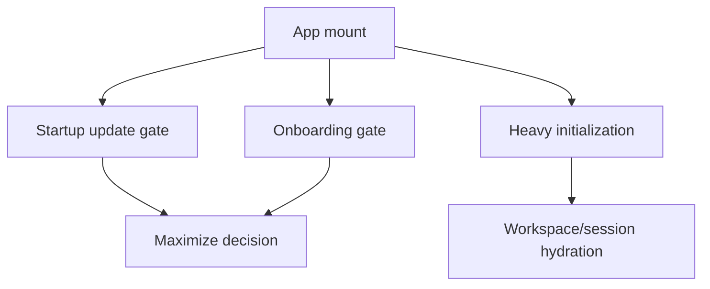

# fix: Decouple startup maximize from session initialization

## Overview

The desktop shell should maximize as soon as the startup gate is clear: onboarding has been resolved to **not showing** and no blocking updater flow is active. Today the maximize decision is both delayed by the full `viewState.initialize()` chain and vulnerable to reading splash state before the asynchronous splash lookup has resolved, so users see the small bootstrap window longer than necessary and risk a premature maximize if unresolved splash state is treated as clear.

| Startup mode | Onboarding state | Update state | Expected maximize behavior |
|---|---|---|---|
| Returning user, no update block | `showSplash === false` | non-blocking | Maximize immediately after the gate resolves |
| First launch or splash lookup failure | `showSplash === true` | any | Stay compact until onboarding dismissal |
| Onboarding state unresolved | `showSplash === null` | any | Stay compact until splash lookup resolves to a boolean |
| Blocking startup update | any | checking / downloading / installing / error | Stay compact until the updater gate clears |
| Dev mode, non-blocking simulated update | `showSplash === false` | available / idle | Maximize immediately after onboarding state resolves |

## Problem Frame

Startup currently mixes two separate concerns in one critical path:

1. **Startup gate resolution** — decide whether onboarding or startup update flow should block the main shell.
2. **Heavy app initialization** — restore workspace, hydrate startup panels, and load or scan session history.

Because `main-app-view.svelte` only calls `maximizeWindow()` after `await viewState.initialize()`, session loading latency is visible as a delayed native maximize animation. At the same time, splash lookup is currently a fire-and-forget async step, so any decoupled maximize gate must treat unresolved splash state as blocking until `showSplash` resolves to a boolean. The intended behavior is narrower: maximize should depend only on resolved onboarding state and blocking updater state, while session loading continues in the background.

## Requirements Trace

- R1. The main window maximizes as soon as startup update blocking is cleared and onboarding has been explicitly resolved as not active.
- R2. Workspace restore, startup panel hydration, and session/sidebar loading no longer delay the maximize decision.
- R3. First-launch onboarding still keeps the small window until dismissal, then maximizes once.
- R4. Blocking updater states still prevent maximize until the blocking overlay can yield.
- R5. Dev startup follows the same gating rule: no blocking updater means maximize should not wait for session initialization.

## Scope Boundaries

- No change to native window configuration in `src-tauri/tauri.conf.json`; the initial bootstrap window remains compact.
- No attempt to remove or customize the OS-native maximize animation.
- No redesign of session loading order beyond removing it from the maximize critical path.
- No changes to updater download/install behavior other than preserving its blocking gate.

## Context & Research

### Relevant Code and Patterns

- `packages/desktop/src/lib/components/main-app-view.svelte` currently awaits `checkForAppUpdate("startup")`, then `inboundRequestHandler.start(...)`, then `viewState.initialize()`, and only afterwards calls `maximizeWindow()`.
- `packages/desktop/src/lib/components/main-app-view/logic/managers/initialization-manager.ts` already documents a multi-phase initialization pipeline where `restoreWorkspace()` and `hydrateStartupPanels()` include session restoration and history loading.
- `packages/desktop/src/lib/components/main-app-view/logic/managers/initialization-manager.ts` already treats splash lookup as a fast, fire-and-forget concern (`checkSplashScreen()`), which is the right seam to extract from the heavy initialization chain.
- `packages/desktop/src/lib/components/main-app-view/logic/updater-state.ts` shows the local pattern for pure startup gating helpers with dedicated tests in `tests/updater-state.test.ts`.
- `packages/desktop/src/lib/components/main-app-view/tests/initialization-manager.test.ts` already protects workspace/session startup sequencing and is the right place to preserve those invariants while decoupling maximize timing.

### Institutional Learnings

- No relevant entries found in `docs/solutions/` for startup window behavior.

### External References

- None. The codebase already has strong local patterns for startup orchestration and updater gating.

## Key Technical Decisions

| Decision | Rationale |
|---|---|
| Split splash/onboarding resolution into an explicit startup-gate step that can run before heavy initialization completes | The maximize decision only needs resolved splash state and updater truth, not session hydration results |
| Treat unresolved splash state as blocking and only clear the gate on `showSplash === false` | Prevents premature maximize while the async splash lookup is still in flight |
| Treat maximize as a one-shot transition from “startup gate blocked” to “startup gate clear” using a guard shared by gate-based maximize and onboarding dismissal | Prevents repeated maximize calls from async startup completions or onboarding dismissal races |
| Keep session/workspace initialization semantics intact and let it continue after maximize | Fixes the visible delay without broadening the behavior change into a risky startup refactor |

## Open Questions

### Resolved During Planning

- Should session loading remain on the maximize critical path? **No.** It is unrelated to the user-visible startup gate.
- Should dev mode keep the same maximize rule? **Yes.** Without a blocking startup updater flow, dev should maximize as soon as onboarding state is known.
- Should onboarding dismissal still explicitly maximize? **Yes,** but it must use the same shared idempotency guard as the gate-based maximize path so a previously maximized window does not bounce.
- What counts as a clear startup gate? **Only** `showSplash === false` plus a non-blocking updater state. `showSplash === null` remains blocking, and splash lookup failure resolves to `showSplash === true` (fail-safe onboarding shown).
- How should ownership split across modules? `InitializationManager` (or a directly adjacent state helper) should resolve splash state to a boolean, `updater-state.ts` can host any pure gate predicate that combines onboarding and updater state, and `main-app-view.svelte` should remain the side-effect owner that actually calls the Tauri maximize API.

### Deferred to Implementation

- The exact helper names and whether the shared maximize guard uses only a local boolean or supplements it with `isMaximized()`. The plan fixes the ownership boundary and the requirement for a shared guard, while leaving the lightest safe implementation detail to code review.

## Implementation Units

- [ ] **Unit 1: Extract startup gate resolution from heavy initialization**

**Goal:** Make onboarding visibility available independently from the full initialization pipeline so maximize can stop waiting on session hydration.

**Requirements:** R1, R2, R3, R5

**Dependencies:** None

**Files:**
- Modify: `packages/desktop/src/lib/components/main-app-view/logic/managers/initialization-manager.ts`
- Modify: `packages/desktop/src/lib/components/main-app-view/logic/main-app-view-state.svelte.ts`
- Test: `packages/desktop/src/lib/components/main-app-view/tests/initialization-manager.test.ts`

**Approach:**
- Split the current “fast startup gate” work from the heavier `initialize()` path so splash lookup can resolve to a boolean before workspace restore and session loading matter to the maximize decision.
- Preserve the existing `initialize()` responsibilities and HMR guards for the heavy startup path; the new gate step should not accidentally duplicate session initialization.
- Treat `showSplash === null` as unresolved/blocking rather than optimistic-clear, and make splash lookup failures continue to fail safe by setting onboarding visible instead of maximizing.

**Execution note:** Start with a failing test that proves splash/onboarding state can resolve without awaiting full initialization.

**Patterns to follow:**
- `packages/desktop/src/lib/components/main-app-view/logic/managers/initialization-manager.ts` phase-splitting pattern
- `packages/desktop/src/lib/components/main-app-view/logic/updater-state.ts` pure gating helper style

**Test scenarios:**
- Happy path — persisted `has_seen_splash = "true"` resolves startup gate without waiting for workspace/session loading.
- Happy path — persisted `has_seen_splash != "true"` keeps onboarding active and leaves the window gate blocked.
- Error path — user-setting lookup failure resolves the gate to `showSplash === true` immediately enough that maximize cannot fire on unresolved/null state.
- Integration — existing `initialize()` still restores workspace and preserves startup session loading order after the gate work moves earlier.

**Verification:**
- Startup gate state can be resolved before session initialization finishes, and full initialization behavior remains intact.

- [ ] **Unit 2: Rewire main app startup so maximize follows the gate, not session loading**

**Goal:** Move window maximizing onto the startup-gate lifecycle so returning users see the maximized shell as soon as onboarding/update checks allow it.

**Requirements:** R1, R2, R3, R4, R5

**Dependencies:** Unit 1

**Files:**
- Modify: `packages/desktop/src/lib/components/main-app-view.svelte`
- Modify: `packages/desktop/src/lib/components/main-app-view/logic/updater-state.ts`
- Test: `packages/desktop/src/lib/components/main-app-view/tests/updater-state.test.ts`
- Test: `packages/desktop/src/lib/components/main-app-view/tests/updater-flow.contract.test.ts`

**Approach:**
- Compute a startup maximize gate from two sources only: resolved onboarding visibility and blocking updater state.
- Put any pure gate predicate in a testable helper, but keep the native maximize side effect and shared one-shot guard in the startup view layer so both startup gate completion and onboarding dismissal consult the same guard before calling Tauri.
- Trigger maximize when that gate clears, without awaiting `viewState.initialize()` completion.
- Keep startup updater blocking authoritative, including error/retry states that should continue to hold the compact bootstrap window until retry or another existing unblock path clears the gate.
- Preserve onboarding dismissal as the explicit “now maximize” path for first launch, with an idempotent guard against duplicate maximize calls.

**Execution note:** Implement test-first around the gate predicate or transition before rewiring the component.

**Patterns to follow:**
- `packages/desktop/src/lib/components/main-app-view/logic/updater-state.ts`
- `packages/desktop/src/lib/components/main-app-view.svelte` existing onboarding dismissal and updater flow wiring

**Test scenarios:**
- Happy path — returning user with no blocking updater maximizes once startup gate resolves, even if initialization is still in progress.
- Happy path — onboarding dismissal clears the remaining gate and maximizes once.
- Edge case — dev mode with non-blocking updater state maximizes without waiting on session loading.
- Edge case — unresolved `showSplash === null` keeps maximize suppressed until splash state resolves to `false`.
- Error path — blocking updater error state keeps maximize suppressed until retry or dismissal path clears the gate.
- Integration — maximize is not retriggered when later async initialization completes after the window is already maximized, and call-count assertions prove only one native maximize fires across gate-clear plus onboarding-dismissal races.

**Verification:**
- Window maximize timing depends only on onboarding/update gate state, not on session/workspace initialization completion.

- [ ] **Unit 3: Lock in regression coverage around startup sequencing**

**Goal:** Protect the new startup contract so future session-loading changes cannot reintroduce delayed maximize behavior.

**Requirements:** R2, R3, R4, R5

**Dependencies:** Unit 2

**Files:**
- Modify: `packages/desktop/src/lib/components/main-app-view/tests/initialization-manager.test.ts`
- Modify: `packages/desktop/src/lib/components/main-app-view/tests/updater-flow.contract.test.ts`
- Create: `packages/desktop/src/lib/components/main-app-view/tests/startup-maximize-gate.test.ts`

**Approach:**
- Add focused tests for the gate logic rather than relying only on source-order assertions in the Svelte file.
- Keep existing initialization-manager tests centered on workspace/session sequencing, but add assertions that those steps are no longer treated as maximize prerequisites.
- Use a dedicated gate test file for combinations of onboarding state, updater blocking state, and repeated async completions.

**Execution note:** Add characterization coverage before moving existing source-based contract assertions if the implementation extracts shared gate logic.

**Patterns to follow:**
- `packages/desktop/src/lib/components/main-app-view/tests/updater-state.test.ts`
- `packages/desktop/src/lib/components/main-app-view/tests/initialization-manager.test.ts`

**Test scenarios:**
- Happy path — gate opens only when onboarding is false and updater is non-blocking.
- Edge case — onboarding unknown / unresolved does not prematurely clear the gate.
- Edge case — repeated “gate clear” signals still result in a single maximize decision.
- Error path — splash lookup failure resolves to onboarding shown and keeps the gate blocked until dismissal.
- Integration — startup panel hydration and background scan continue in their current order even though maximize is no longer waiting on them.

**Verification:**
- The test suite expresses the startup contract directly enough that future changes to session initialization cannot silently become window-gate dependencies again.

## System-Wide Impact

- **Interaction graph:** `main-app-view.svelte` coordinates updater state, onboarding visibility, and heavy initialization; `InitializationManager` owns splash lookup and session/workspace startup; Tauri window APIs remain the side-effect boundary.
- **Error propagation:** Splash lookup errors should continue to fail safe into onboarding shown; heavy initialization errors should still surface through `viewState.initializationError` without becoming maximize blockers unless onboarding/update state requires it; startup updater error state remains a blocking gate until an existing retry/unblock path resolves it.
- **State lifecycle risks:** Async updater completion, onboarding dismissal, and late initialization completion can all emit “gate clear” signals, so maximize needs a one-shot guard.
- **API surface parity:** Both dev and production startup paths must share the same gate semantics even though only production performs a real startup update check.
- **Integration coverage:** Tests need to cover the interaction between splash resolution, updater state transitions, and late session hydration completion.
- **Unchanged invariants:** Initial Tauri window size stays compact, onboarding still owns first-launch blocking, startup updater overlay remains authoritative while blocking, and session hydration order remains the same as today.

## Risks & Dependencies

| Risk | Mitigation |
|------|------------|
| Duplicate maximize calls cause visual bounce or redundant native work | Add an explicit one-shot maximize guard and cover repeated async clear events in tests |
| Premature maximize before splash state resolves | Treat unresolved splash state as “not yet clear” until the gate is known |
| Startup refactor accidentally changes session hydration order | Keep initialization-manager ordering tests and add assertions that only the maximize dependency changed |

## Documentation / Operational Notes

- No end-user documentation change is required.
- If the startup behavior change is visually noticeable in release notes, the implementing agent can decide whether to add a changelog entry based on repo convention.

## Sources & References

- Related code: `packages/desktop/src/lib/components/main-app-view.svelte`
- Related code: `packages/desktop/src/lib/components/main-app-view/logic/managers/initialization-manager.ts`
- Related code: `packages/desktop/src/lib/components/main-app-view/logic/updater-state.ts`
- Related tests: `packages/desktop/src/lib/components/main-app-view/tests/initialization-manager.test.ts`
- Related tests: `packages/desktop/src/lib/components/main-app-view/tests/updater-flow.contract.test.ts`
