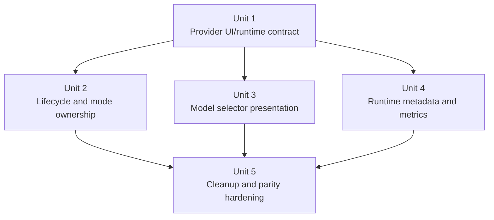
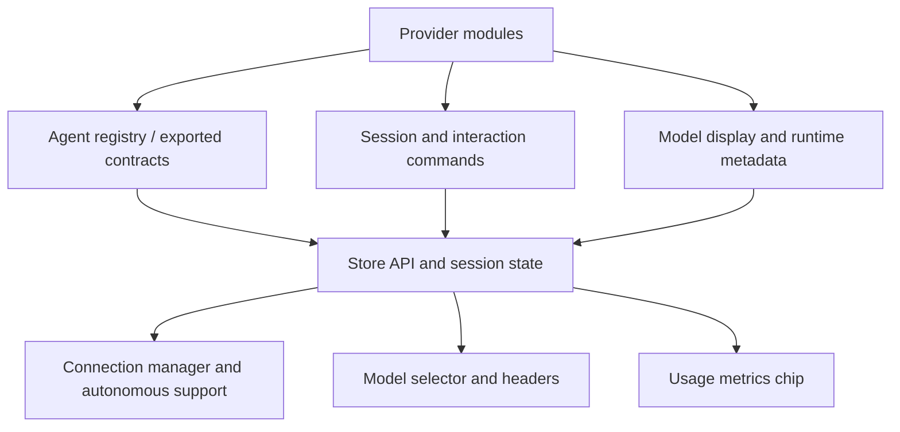

# refactor: make ACP frontend provider-agnostic

## Overview

Finish the migration to an agent-agnostic ACP frontend by moving the remaining built-in-provider behavior out of Svelte/TypeScript branches and behind backend/provider-owned contracts. The target state is: backend providers own quirks, normalization, and presentation metadata; the frontend renders generic capability and display contracts without branching on provider names.

## Problem Frame

Acepe's stated architecture goal is agent agnosticism at the core with provider-specific quirks pushed to adapters and edges. The backend already largely follows that rule through `AgentProvider`, provider modules, and backend-owned model display transforms, but the frontend still hardcodes built-in-provider behavior in several critical paths:

- Claude-only autonomous reconnect behavior in ACP session lifecycle
- discovery and preconnection capability behavior (`Open in Finder`, remote preconnection command loading)
- per-agent mode alias tables in frontend constants
- hardcoded agent capability overrides
- Claude-specific model name parsing
- Codex-specific model selector branching
- Claude-specific metrics chip behavior
- frontend-owned model runtime metadata lookups via `models.dev`-style fallback

Those leaks duplicate backend logic, make new provider support expensive, and create architectural drift where the frontend must understand individual agent quirks instead of consuming a durable contract.

## Requirements Trace

- R1. Remove built-in-provider name branching from ACP frontend lifecycle, discovery/preconnection capability, mode, model selector, and metrics rendering paths.
- R2. Make backend/provider-owned contracts the source of truth for UI capabilities, model presentation, and runtime metadata.
- R3. Preserve current user-visible behavior parity for Claude, Copilot, Codex, Cursor, and OpenCode while moving ownership.
- R4. Keep custom agents functional through safe generic defaults rather than requiring frontend edits per provider.
- R5. Lock the boundary in with regression coverage so future provider additions do not reintroduce frontend hardcoding.
- R6. Prove the strategic payoff of the refactor by making it possible for a future provider to land these surfaces through backend contracts only, without ACP frontend edits.

## Scope Boundaries

- No product-scope expansion beyond finishing the ownership migration.
- No redesign of provider launch transports or parser internals beyond the contract surfaces they expose.
- No removal of provider-specific backend modules; provider specialization remains valid at the adapter/backend layer.
- No dependency on a new external metadata service from the frontend; any shared catalog lookups belong behind the backend boundary.

## Context & Research

### Relevant Code and Patterns

- `packages/desktop/src-tauri/src/acp/provider.rs` already defines the core provider-owned policy boundary (`normalize_mode_id`, `map_outbound_mode_id`, `autonomous_supported_mode_ids`, `map_execution_profile_mode_id`, settings inheritance hooks, and parser/runtime hooks).
- `packages/desktop/src-tauri/src/acp/registry.rs` already exposes provider-derived `AgentInfo` to the frontend, but the contract is currently too thin for the frontend to stay generic.
- `packages/desktop/src-tauri/src/acp/model_display.rs` already centralizes model-display transformation and explicitly states that the frontend should render without parsing model IDs.
- `packages/desktop/src/lib/acp/application/dto/session-capabilities.ts` and `packages/desktop/src/lib/acp/store/agent-model-preferences-store.svelte.ts` already have a seam for backend-delivered `modelsDisplay`.
- `packages/desktop/src/lib/acp/store/services/session-connection-manager.ts` is the main lifecycle leak point because it still embeds Claude-specific reconnect policy.
- `packages/desktop/src/lib/acp/components/model-selector.content.svelte`, `packages/desktop/src/lib/acp/components/model-selector-logic.ts`, and `packages/desktop/src/lib/acp/components/model-selector.metrics-chip.svelte` are the main presentation leak points.

### Institutional Learnings

- `docs/solutions/logic-errors/kanban-live-session-panel-sync-2026-04-02.md` reinforces the right ownership rule for this refactor: keep one source of truth in the core layer and let UI surfaces project from it instead of inventing parallel state or policy.

### External References

- None. External research was intentionally skipped because the repo already contains strong local patterns for provider-owned contracts, and this work is an internal architecture refactor rather than an unfamiliar framework integration.

## Key Technical Decisions

| Decision | Rationale |
| --- | --- |
| Put session execution-profile transition policy behind backend commands/contracts, not frontend provider checks | The current Claude reconnect fix proves some providers require non-trivial lifecycle strategy. The frontend should request an outcome, not decide whether the provider needs live mutation or reconnect. |
| Expand provider-owned UI metadata only for truly presentational behavior | Read-only UI decisions such as Finder target, remote preconnection command behavior, model selector presentation, and usage-chip semantics belong in a typed contract, not in frontend constant tables. |
| Treat canonical UI modes as the default frontend product invariant, with an explicit extension path if a future provider cannot map honestly | Acepe currently standardizes on `build`/`plan`; this refactor should preserve that simplicity while avoiding a dead end where an unmappable provider would force another frontend ownership leak. |
| Finish the backend-owned model-display migration instead of inventing more frontend fallback parsing | `model_display.rs` already contains Claude/Codex-specific transforms. The right move is to make that contract sufficient and dependable, not to preserve duplicated parsing in Svelte. |
| Preserve custom-agent support through generic defaults and graceful fallback rendering | The contract must be additive and defaultable so custom agents remain functional without provider-specific frontend code. |
| Partition authoritative ownership by UX phase and concern | Discovery/preconnection capability data should come from `AgentInfo` + agent store, connected-session lifecycle policy should come from backend commands and canonical session capabilities, model selector rendering should come from `ModelsForDisplay` + selector presentation, and runtime/metrics behavior should come from session-state/runtime metadata transport. This avoids recreating overlapping sources of truth under new type names. |

## Open Questions

### Resolved During Planning

- Should this refactor expose raw provider identifiers or stringly typed hooks to the frontend? **No.** The plan uses typed capability and presentation contracts, plus backend-owned lifecycle commands, so the frontend branches on contract data rather than provider ids.
- Should the frontend keep a compatibility alias table for provider-native modes? **No.** The frontend should consume canonical modes only; compatibility normalization belongs at the backend/Tauri boundary.
- Should this preserve current specialized UX such as Claude model naming and Codex effort grouping? **Yes.** The migration is ownership-focused, not a behavior reset, so those experiences must survive behind generic contracts.
- Are discovery/preconnection capability surfaces in scope? **Yes.** They are already part of the leak set because the frontend currently hardcodes `Open in Finder` targeting and remote preconnection command behavior in ACP-specific helpers.
- What rollout posture should implementation follow? **Additive compatibility first.** Backend contracts should land before frontend consumers switch, and legacy helpers should be deleted only after the new contracts are read end-to-end and parity tests are green.
- Is `build`/`plan` still the intended frontend product model? **Yes for this refactor.** The plan preserves `build`/`plan` as the default product invariant, but requires the new contract boundary to leave an explicit extension path if a future provider cannot map to those concepts honestly.

### Deferred to Implementation

- Exact module and type names for the new provider UI/runtime contract types, as long as they remain repo-local and typed.
- The precise compatibility mechanism for persisted `modelsDisplay` data (schema versioning, invalidation, or migration), while treating explicit handling as mandatory rather than optional.
- Whether all built-in providers can guarantee rich model-display data on every path immediately, or whether one temporary generic fallback path is needed for custom/legacy sessions while the contract rolls out.

## High-Level Technical Design

> *This illustrates the intended approach and is directional guidance for review, not implementation specification. The implementing agent should treat it as context, not code to reproduce.*

In plain language, the target architecture is:

- **Backend providers know the quirks.**
- **Frontend reads generic contracts.**
- **UI components stop asking "is this Claude/Codex/OpenCode?"**
- **New providers plug in by filling backend contracts, not by teaching the frontend new special cases.**

ASCII sketch of the target:

```text
                    TARGET OWNERSHIP

          provider-specific logic lives here only

  +-----------------------------------------------+
  | backend provider modules / adapters           |
  | (Claude, Codex, Copilot, Cursor, OpenCode)    |
  +-----------------------------------------------+
               |              |              |
               |              |              |
               v              v              v
      +----------------+ +----------------+ +----------------+
      | discovery      | | session / mode | | model / usage  |
      | contract       | | contract       | | contract       |
      |                | |                | |                |
      | AgentInfo      | | commands +     | | ModelsDisplay  |
      | for agent list | | session        | | + runtime      |
      | + preconnect   | | capabilities   | | metadata       |
      +----------------+ +----------------+ +----------------+
               \              |              /
                \             |             /
                 \            |            /
                  v           v           v
             +----------------------------------+
             | frontend store / state layer     |
             | reads contracts, no provider ids |
             +----------------------------------+
                    |           |           |
                    v           v           v
             +----------+ +-----------+ +-----------+
             | lifecycle| | model     | | metrics   |
             | UI       | | selector  | | / headers |
             +----------+ +-----------+ +-----------+

Rule:
- backend decides provider-specific behavior
- frontend renders generic data
- adding a provider means extending backend contracts, not frontend branching
```

The core architectural move is to split the problem into two big buckets:

1. **Behavior the backend must decide**  
   Example: reconnect vs live toggle, mode normalization, execution-profile policy

2. **Data the frontend can render generically**  
   Example: agent capabilities, model display groups, runtime metadata, metrics presentation hints

The ownership split must stay explicit:

| UI concern | Backend source of truth | Frontend surface |
| --- | --- | --- |
| Agent list and preconnection behavior | `AgentInfo` stored in agent store | agent picker, open-in-finder target, remote preconnection commands |
| Connected-session behavior | backend commands + canonical session capabilities | connection manager, autonomous toggle, mode UI |
| Model selector behavior | `ModelsForDisplay` + selector presentation data | model selector, modified files header |
| Runtime / usage display | session-state runtime metadata transport | session event pipeline, session store, metrics chip |

## Implementation Units



- [ ] **Unit 1: Define the provider-owned UI/runtime contract**

**Goal:** Introduce the typed backend contract that the frontend will consume for provider capabilities and presentation behavior.

**Requirements:** R1, R2, R4

**Dependencies:** None

**Files:**
- Create: `packages/desktop/src-tauri/src/acp/provider_ui.rs`
- Modify: `packages/desktop/src-tauri/src/acp/provider.rs`
- Modify: `packages/desktop/src-tauri/src/acp/registry.rs`
- Modify: `packages/desktop/src-tauri/src/acp/mod.rs`
- Modify: `packages/desktop/src-tauri/src/session_jsonl/export_types.rs`
- Modify: `packages/desktop/src/lib/services/acp-types.ts`
- Modify: `packages/desktop/src/lib/utils/tauri-client/acp.ts`
- Modify: `packages/desktop/src/lib/acp/store/api.ts`
- Modify: `packages/desktop/src/lib/acp/logic/agent-manager.ts`
- Modify: `packages/desktop/src/lib/acp/store/types.ts`
- Modify: `packages/desktop/src/lib/acp/store/agent-store.svelte.ts`
- Modify: `packages/desktop/src/lib/acp/components/agent-panel/logic/open-in-finder-target.ts`
- Modify: `packages/desktop/src/lib/acp/components/agent-input/logic/preconnection-remote-commands-state.svelte.ts`
- Test: `packages/desktop/src-tauri/src/acp/registry.rs`
- Test: `packages/desktop/src-tauri/src/session_jsonl/export_types.rs`
- Test: `packages/desktop/src/lib/acp/components/agent-panel/logic/__tests__/open-in-finder-target.test.ts`
- Test: `packages/desktop/src/lib/acp/components/agent-input/logic/preconnection-remote-commands-state.vitest.ts`

**Approach:**
- Add a small, typed provider-owned contract for frontend-facing capabilities and presentation policy.
- Constrain Unit 1 to **discovery/preconnection** concerns only: agent discovery metadata, Finder target resolution, and remote preconnection command behavior should be retained through the frontend agent state instead of being recomputed by helper tables.
- Keep the contract intentionally narrow and semantic: it should describe capabilities and presentation intent, not become a bag of provider-shaped UI toggles.
- Source the contract from `AgentProvider` default methods so built-ins override only what they actually vary on and custom agents inherit safe generic defaults.
- Export the contract through the existing Tauri/ACP type-generation path rather than introducing a parallel frontend-only schema.

**Patterns to follow:**
- `packages/desktop/src-tauri/src/acp/provider.rs`
- `packages/desktop/src-tauri/src/acp/registry.rs`
- `packages/desktop/src-tauri/src/acp/model_display.rs`
- `packages/desktop/src-tauri/src/session_jsonl/export_types.rs`

**Test scenarios:**
- Happy path — each built-in provider advertises a complete provider UI/runtime contract with only the overrides it needs.
- Happy path — a custom agent with no custom metadata inherits safe defaults and remains serializable through `AgentInfo`.
- Edge case — omitted optional presentation metadata falls back to generic frontend-safe behavior instead of `undefined`-driven branching.
- Error path — generated TS types remain aligned with Rust exports after adding the contract.
- Integration — `acp_list_agents` returns the new contract end-to-end through Tauri types, agent-store retention, and concrete discovery/preconnection consumers without frontend post-processing to invent missing capabilities.

**Verification:**
- Agent discovery exposes enough typed metadata that frontend capability tables can be deleted instead of extended, and concrete consumers read the retained agent-state contract directly.

- [ ] **Unit 2: Move lifecycle policy and mode normalization fully behind backend ownership**

**Goal:** Remove provider-name branching from session lifecycle and mode handling by making the backend own execution-profile transition strategy and canonical mode exposure.

**Requirements:** R1, R2, R3, R4

**Dependencies:** Unit 1

**Files:**
- Modify: `packages/desktop/src-tauri/src/acp/commands/interaction_commands.rs`
- Modify: `packages/desktop/src-tauri/src/acp/commands/session_commands.rs`
- Modify: `packages/desktop/src-tauri/src/acp/commands/tests.rs`
- Modify: `packages/desktop/src/lib/acp/store/services/session-connection-manager.ts`
- Modify: `packages/desktop/src/lib/acp/store/services/session-connection-manager.test.ts`
- Modify: `packages/desktop/src/lib/acp/constants/mode-mapping.ts`
- Modify: `packages/desktop/src/lib/acp/constants/__tests__/mode-mapping.test.ts`
- Modify: `packages/desktop/src/lib/acp/constants/agent-capabilities.ts`
- Modify: `packages/desktop/src/lib/acp/constants/__tests__/agent-capabilities.test.ts`
- Modify: `packages/desktop/src/lib/acp/components/agent-input/logic/autonomous-support.ts`

**Approach:**
- Replace the current frontend-owned Claude reconnect branch with a provider-agnostic backend path that decides whether a toggle can be applied live or requires reconnect semantics.
- Keep the frontend’s mode vocabulary canonical and delete per-agent alias knowledge from `mode-mapping.ts`.
- Replace capability overrides with provider-delivered data from Unit 1.
- Preserve existing UX behavior; the migration is about moving ownership, not changing which providers support which modes or autonomy combinations.
- Preserve the current `build`/`plan` product model while leaving an explicit contract-level extension path for any future provider that cannot honestly map into those two modes.

**Execution note:** Start with a failing behavior test around autonomous toggle parity before deleting the existing Claude-specific branch.

**Patterns to follow:**
- `packages/desktop/src-tauri/src/acp/provider.rs`
- `packages/desktop/src-tauri/src/acp/commands/session_commands.rs`
- `packages/desktop/src/lib/acp/store/services/session-connection-manager.ts`

**Test scenarios:**
- Happy path — enabling autonomous on Claude still succeeds through reconnect semantics without the frontend checking for `claude-code`.
- Happy path — providers that support live execution-profile changes use the same generic frontend request path.
- Edge case — disconnected sessions with persisted autonomous state reconnect through the same provider-agnostic path.
- Error path — unsupported autonomous mode combinations still surface as unsupported through capabilities/commands rather than provider-name logic.
- Integration — current and available modes exposed to the frontend are canonical `build`/`plan` ids even when provider-native ids differ internally.

**Verification:**
- No lifecycle or mode decision in ACP frontend state management depends on a concrete built-in provider id.

- [ ] **Unit 3: Finish backend-owned model selector presentation**

**Goal:** Make model selector rendering fully contract-driven so Claude/Codex-specific parsing and layout logic no longer live in the frontend.

**Requirements:** R1, R2, R3, R4, R6

**Dependencies:** Unit 1

**Files:**
- Modify: `packages/desktop/src-tauri/src/acp/model_display.rs`
- Modify: `packages/desktop/src-tauri/src/acp/client_session.rs`
- Modify: `packages/desktop/src-tauri/src/acp/client/tests.rs`
- Modify: `packages/desktop/src/lib/acp/application/dto/session-capabilities.ts`
- Modify: `packages/desktop/src/lib/acp/store/agent-model-preferences-store.svelte.ts`
- Modify: `packages/desktop/src/lib/acp/components/model-selector.content.svelte`
- Modify: `packages/desktop/src/lib/acp/components/model-selector.svelte`
- Modify: `packages/desktop/src/lib/acp/components/model-selector-logic.ts`
- Modify: `packages/desktop/src/lib/acp/components/modified-files/modified-files-header.svelte`
- Test: `packages/desktop/src/lib/acp/components/__tests__/model-selector-logic.test.ts`
- Test: `packages/desktop/src/lib/acp/components/__tests__/model-selector-components.test.ts`
- Test: `packages/desktop/src/lib/acp/components/__tests__/model-selector-structure.test.ts`

**Approach:**
- Treat backend-generated `ModelsForDisplay` as the primary model selector input for built-in providers.
- Extend `ModelsForDisplay` or pair it with a small selector-presentation contract so the frontend can render generic list, grouped list, and grouped-with-variant-selection shapes without checking provider ids.
- Delete frontend Claude description parsing and Codex effort parsing once the backend contract fully covers them.
- Keep a safe generic fallback only for cases where a custom agent truly lacks enriched presentation data.
- Define stale-to-fresh transition rules for cached versus live selector metadata: preserve current selection, favorites/default markers, search query, and focus/keyboard position when richer live metadata replaces cached data.
- Treat keyboard navigation, focus retention, and accessible naming as parity invariants for every selector presentation shape, not as optional polish.

**Patterns to follow:**
- `packages/desktop/src-tauri/src/acp/model_display.rs`
- `packages/desktop/src/lib/acp/store/agent-model-preferences-store.svelte.ts`
- `packages/desktop/src/lib/acp/application/dto/session-capabilities.ts`

**Test scenarios:**
- Happy path — Claude model names render from backend-provided display data even if raw descriptions remain provider-specific.
- Happy path — Codex reasoning-effort variants render and switch through presentation contract data with no `isCodexAgent` branch.
- Edge case — providers with a small or flat model list still support search, favorites, and mode-default markers through the generic renderer.
- Error path — missing or partial display metadata for a custom agent falls back to a generic list without crashing or silently parsing provider-specific formats.
- Integration — cached `modelsDisplay` data remains usable for preconnection UX and stays in sync with connected-session capabilities.
- Integration — switching from cached to live presentation data preserves visible selection, focus, and keyboard traversal semantics.
- Integration — rendered selector surfaces keep correct accessible labels and interaction order across generic, grouped, and grouped-with-variant-selection modes.

**Verification:**
- Model selector and related headers render from backend-delivered display contracts and do not inspect built-in provider ids for layout or naming.

- [ ] **Unit 4: Move runtime model metadata and usage-chip semantics behind backend contracts**

**Goal:** Stop the frontend from owning model runtime metadata lookups and provider-specific usage presentation rules.

**Requirements:** R1, R2, R3

**Dependencies:** Unit 1

**Files:**
- Create: `packages/desktop/src-tauri/src/acp/model_runtime_metadata.rs`
- Modify: `packages/desktop/src-tauri/src/acp/provider.rs`
- Modify: `packages/desktop/src-tauri/src/acp/registry.rs`
- Modify: `packages/desktop/src-tauri/src/acp/client_session.rs`
- Modify: `packages/desktop/src-tauri/src/session_jsonl/export_types.rs`
- Modify: `packages/desktop/src/lib/acp/services/model-runtime-metadata.ts`
- Modify: `packages/desktop/src/lib/acp/store/types.ts`
- Modify: `packages/desktop/src/lib/acp/store/session-event-service.svelte.ts`
- Modify: `packages/desktop/src/lib/acp/store/session-event-handler.ts`
- Modify: `packages/desktop/src/lib/acp/store/session-store.svelte.ts`
- Modify: `packages/desktop/src/lib/acp/components/model-selector.metrics-chip.logic.ts`
- Modify: `packages/desktop/src/lib/acp/components/model-selector.metrics-chip.svelte`
- Test: `packages/desktop/src/lib/acp/components/__tests__/model-selector.metrics-chip.logic.test.ts`
- Create: `packages/desktop/src/lib/acp/components/__tests__/model-selector.metrics-chip.rendering.test.ts`
- Test: `packages/desktop/src/lib/acp/store/__tests__/session-event-service-streaming.vitest.ts`
- Test: `packages/desktop/src/lib/acp/components/modified-files/modified-files-header.structure.test.ts`
- Test: `packages/desktop/src-tauri/src/acp/model_runtime_metadata.rs`

**Approach:**
- Move context-window and related model runtime metadata resolution behind the backend boundary, whether the source is provider-specific discovery or a shared catalog.
- Deliver only generic runtime fields and presentation policy to the frontend.
- Choose an explicit transport path for live UI state: initial metadata can arrive with session capability snapshots, but live updates and resumed/disconnected-session behavior must flow through the existing session event/state pipeline instead of bypassing it with a standalone helper.
- Replace the current `isClaudeCode` metrics behavior with contract-driven rendering rules that declare what the chip should emphasize and when it should be visible.
- Keep graceful degradation for sessions that lack runtime metadata instead of falling back to provider-specific frontend lookups.

**Execution note:** Add characterization coverage for the current metrics presentation before replacing it with the generic contract.

**Patterns to follow:**
- `packages/desktop/src/lib/acp/services/model-runtime-metadata.ts`
- `packages/desktop/src/lib/acp/components/model-selector.metrics-chip.logic.ts`
- `packages/desktop/src-tauri/src/acp/provider.rs`

**Test scenarios:**
- Happy path — context-window metadata reaches the frontend from backend-owned runtime metadata without calling a frontend `models.dev` helper.
- Happy path — providers that should emphasize context usage can do so through contract data rather than provider-id checks.
- Edge case — a provider with spend data but no context-window metadata still renders a generic, correct metrics chip.
- Error path — missing runtime metadata does not cause bad percentages, invalid totals, or provider-specific fallbacks.
- Integration — the same generic chip logic renders correctly across at least Claude, Copilot/Codex-style spend providers, and a custom-agent default.
- Integration — live usage updates, resumed sessions, and disconnected-session state all resolve the same runtime metadata/presentation policy through the session store pipeline.
- Integration — rendered chip and related headers preserve visible labels, tooltip content, and accessibility semantics at the component layer, not just in leaf formatting helpers.

**Verification:**
- ACP frontend runtime metadata and metrics rendering no longer depend on provider-specific services or agent-id checks.

- [ ] **Unit 5: Remove legacy frontend branches, harden parity tests, and document the boundary**

**Goal:** Delete obsolete compatibility helpers and lock the new contract boundary in with parity-focused regression coverage.

**Requirements:** R1, R2, R3, R4, R5, R6

**Dependencies:** Unit 2, Unit 3, Unit 4

**Files:**
- Modify: `packages/desktop/src/lib/acp/constants/mode-mapping.ts`
- Modify: `packages/desktop/src/lib/acp/constants/agent-capabilities.ts`
- Modify: `packages/desktop/src/lib/acp/logic/agent-manager.ts`
- Modify: `packages/desktop/src/lib/acp/store/api.ts`
- Modify: `packages/desktop/src/lib/services/acp-types.ts`
- Modify: `packages/desktop/src-tauri/src/acp/client/tests.rs`
- Modify: `packages/desktop/src-tauri/src/acp/commands/tests.rs`
- Modify: `packages/desktop/src-tauri/src/acp/providers/claude_code.rs`
- Modify: `packages/desktop/src-tauri/src/acp/providers/copilot.rs`
- Modify: `packages/desktop/src-tauri/src/acp/providers/codex.rs`
- Modify: `packages/desktop/src-tauri/src/acp/providers/cursor.rs`
- Modify: `packages/desktop/src-tauri/src/acp/providers/opencode.rs`
- Test: `packages/desktop/src/lib/acp/store/services/session-connection-manager.test.ts`
- Test: `packages/desktop/src/lib/acp/components/__tests__/model-selector-components.test.ts`
- Test: `packages/desktop/src/lib/acp/components/__tests__/model-selector.metrics-chip.logic.test.ts`

**Approach:**
- Delete the legacy helpers only after the new contracts are wired and parity tests are green.
- Add provider-parity assertions for the built-ins plus a custom-agent default path so future providers extend backend contracts instead of frontend branches.
- Add one explicit onboarding-proof fixture that demonstrates a new provider can satisfy lifecycle, selector, metrics, and discovery/preconnection surfaces through backend contracts only, with no ACP frontend edits beyond generated type updates.
- Preserve backward-compatible degradation only at explicit boundary seams such as generated types or persisted cache reads, not inside UI components.
- Capture the new ownership boundary in a follow-up solution document after implementation lands.

**Patterns to follow:**
- `packages/desktop/src-tauri/src/acp/provider.rs`
- `packages/desktop/src-tauri/src/acp/registry.rs`
- `docs/solutions/logic-errors/kanban-live-session-panel-sync-2026-04-02.md`

**Test scenarios:**
- Happy path — each built-in provider advertises a complete contract and the generic frontend paths render equivalent behavior.
- Edge case — custom agents inherit the default contract and remain usable without provider-specific frontend wiring.
- Error path — deleting the legacy constant tables does not break startup, cached agent lists, or disconnected-session UI.
- Integration — a repo-scoped contract test confirms the targeted ACP frontend surfaces no longer branch on concrete built-in provider ids for lifecycle, capabilities, model naming, selector layout, or metrics rendering.
- Integration — generated Rust-to-TS contract types stay synchronized after the cleanup.
- Integration — a new-provider fixture can populate the backend contracts and achieve the expected ACP frontend behavior without bespoke frontend code paths.

**Verification:**
- The remaining provider-specific logic for these concerns exists only in backend provider modules, model-display/runtime-metadata adapters, or transport clients.

## System-Wide Impact



- **Interaction graph:** `AgentProvider` implementations, agent registry, session commands, generated ACP types, store API, connection manager, model selector surfaces, and metrics presentation all participate in this migration.
- **Error propagation:** Missing provider metadata should fail closed to explicit backend defaults; the frontend should never invent provider-specific behavior because a field is absent.
- **State lifecycle risks:** Persisted `modelsDisplay`, mode caches, and disconnected-session state must remain coherent while the contract expands; migration seams should be additive and default-safe, and the implementation must explicitly version, invalidate, or migrate old cache shapes rather than leaving compatibility to implicit luck.
- **API surface parity:** `AgentInfo`, session capability DTOs, generated TS ACP types, and any lifecycle commands that toggle autonomy or execution profile must move in lockstep.
- **Integration coverage:** New session creation, resumed sessions, disconnected-session UI, cached model selector state, metrics chip display, and autonomous toggle flows all need cross-layer tests.
- **Unchanged invariants:** The UI-facing mode vocabulary remains canonical (`build`, `plan`), built-in provider UX stays equivalent, and provider-specific launch/runtime logic continues to live in backend provider and client layers.

## Risks & Dependencies

| Risk | Mitigation |
|------|------------|
| Contract inflation makes the new metadata surface too provider-specific or stringly typed | Keep the contract minimal, typed, and tied only to concrete frontend decisions that exist today |
| Partial migration leaves two sources of truth alive at once | Sequence contract introduction before frontend cleanup and delete legacy helpers only after parity tests pass |
| Persisted cache or generated type drift creates upgrade bugs | Keep fields additive, run export-type regression tests, and add compatibility-safe defaults at the boundary |
| Codex or Claude UX regresses while removing explicit frontend branches | Preserve parity with behavior-focused tests before cleanup, especially around autonomous toggle, display naming, and selector presentation |

## Documentation / Operational Notes

- Regenerate ACP TS exports whenever the backend contract changes.
- Land the rollout additively unless the implementation intentionally chooses a single atomic change: backend fields/commands first, frontend state ingestion second, generic consumers third, legacy helper deletion last.
- After implementation, add a compounded learning under `docs/solutions/` that documents the final ownership boundary and the rule that ACP frontend surfaces must branch on contracts/capabilities, not provider names.
- No rollout flag is required, but implementation should not be considered complete until provider-parity tests for the built-ins and a custom-agent default path are green.

## Sources & References

- `AGENTS.md`
- `packages/desktop/src-tauri/src/acp/provider.rs`
- `packages/desktop/src-tauri/src/acp/registry.rs`
- `packages/desktop/src-tauri/src/acp/model_display.rs`
- `packages/desktop/src/lib/acp/store/services/session-connection-manager.ts`
- `packages/desktop/src/lib/acp/components/model-selector.content.svelte`
- `packages/desktop/src/lib/acp/components/model-selector.metrics-chip.svelte`
- `packages/desktop/src/lib/acp/services/model-runtime-metadata.ts`
- `docs/solutions/logic-errors/kanban-live-session-panel-sync-2026-04-02.md`
