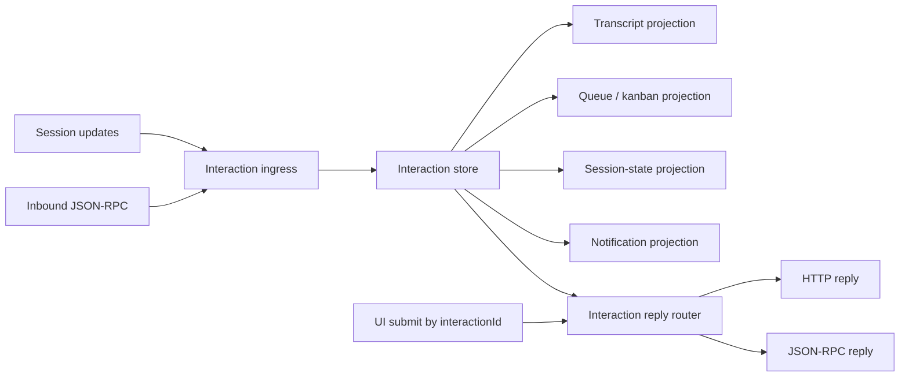

# refactor: Unify interaction state model

## Overview

Replace Acepe's split ownership for permissions, questions, and plan approvals with one canonical interaction model. The new model should own interaction lifecycle, reply routing, and projection state once, while timeline rows, queue cards, kanban cards, and session summaries become projections of that canonical state instead of competing sources of truth.

## Problem Frame

Acepe currently models user-facing agent interactions in overlapping ways. Questions can exist as streamed tool calls, pending question requests, and synthetic backfilled tool rows. Permissions are store-owned pending requests, but plan approvals split again: `create_plan` approvals live directly on tool-call fields while `exit_plan_mode` approvals piggyback on permission state. This creates duplicate ingress paths, loose pairing logic, transport metadata loss risk, and UI duplication across transcript, queue, and kanban.

The result is a recurring class of bugs where one logical interaction is represented more than once, or loses enough provenance that the UI submits through the wrong transport path. The architecture also pushes provider-specific quirks too far into shared UI/state layers, which conflicts with Acepe's stated goal of durable, agent-agnostic internal models.

## Requirements Trace

- R1. A permission, question, or plan approval must have exactly one canonical owner in desktop runtime state.
- R2. Transcript, queue, kanban, notifications, and session-state summaries must derive from canonical interactions rather than maintaining separate live ownership.
- R3. Reply transport details (`jsonRpcRequestId`, HTTP reply IDs, provider-specific approval payloads) must stay below the UI boundary and be preserved across duplicate or partial updates.
- R4. The refactor must preserve current product contracts for inline approvals/answers in panel, queue, and kanban surfaces.
- R5. The refactor must cover both current plan-approval shapes: direct `create_plan` approval requests and `exit_plan_mode` approvals currently modeled as permissions.
- R6. Autonomous-mode permission behavior must keep working, and the refactor must not introduce Acepe-managed auto-answering for agent questions.
- R7. The migration must remove loose session-level question pairing and synthetic question tool backfill from steady-state architecture.

## Scope Boundaries

- No redesign of permission, question, or plan card visuals beyond what is required to unify data flow.
- No new user-facing autonomy policy for questions or plan approvals.
- No provider-wide protocol redesign in Rust for this phase; adapter changes should stay limited to what desktop needs for a canonical interaction model.
- No attempt to unify unrelated runtime concepts such as todos, reviews, or generic notifications into the interaction store.

## Context & Research

### Relevant Code and Patterns

- `packages/desktop/src/lib/components/main-app-view.svelte` currently wires permission/question updates into separate stores and still backfills synthetic question tool calls through `registerQuestion(...)`.
- `packages/desktop/src/lib/acp/store/session-event-service.svelte.ts` already acts as a primary session-update normalization seam and should remain the preferred session-stream ingress layer.
- `packages/desktop/src/lib/acp/logic/inbound-request-handler.ts` handles ACP JSON-RPC requests and currently duplicates question ingress for `AskUserQuestion`.
- `packages/desktop/src/lib/acp/logic/interaction-reply.ts` already centralizes transport choice for permissions/questions and is the right place to generalize reply routing.
- `packages/desktop/src/lib/acp/store/question-store.svelte.ts` and `packages/desktop/src/lib/acp/store/permission-store.svelte.ts` prove the current canonical behavior expectations for pending, resolved, and transport-preserving replies.
- `packages/desktop/src/lib/acp/store/session-state.ts` introduces a second owner via `pendingInput`.
- `packages/desktop/src/lib/components/main-app-view/question-tool-sync.ts` and `packages/desktop/src/lib/acp/store/question-selectors.ts` are explicit sync-glue seams to retire.
- `packages/desktop/src/lib/acp/components/tool-calls/tool-call-create-plan.svelte` and `packages/desktop/src/lib/acp/components/tool-calls/tool-call-exit-plan-mode.svelte` show that plan approvals currently use two different interaction shapes.
- `packages/ui/src/components/agent-panel/agent-tool-question.svelte`, `packages/ui/src/components/attention-queue/attention-queue-question-card.svelte`, `packages/ui/src/components/kanban/kanban-question-footer.svelte`, and `packages/ui/src/components/kanban/kanban-permission-footer.svelte` are the shared presentation surfaces that should consume one view-model contract.

### Institutional Learnings

- `docs/solutions/logic-errors/kanban-live-session-panel-sync-2026-04-02.md` documents the same core smell in another area: kanban and normal panels diverged because two runtime owners existed for one thread. The fix was to make panel state canonical and let kanban project from it.

### Product Constraints from Existing Requirements

- `docs/brainstorms/2026-03-31-kanban-view-requirements.md` requires inline question/permission handling on kanban cards and explicitly says kanban, queue, and panels should project from shared runtime truth.
- `docs/brainstorms/2026-03-31-autonomous-session-toggle-requirements.md` requires that autonomous mode suppress Acepe's normal permission interruptions without inventing a generic Acepe answer policy for agent questions.

## Key Technical Decisions

- **Canonical model:** Introduce one `Interaction` domain object for `permission`, `question`, and `plan_approval`, with stable identity, transport metadata, lifecycle status, and optional tool/session references.
- **One-way projection:** Transcript rows, queue state, kanban state, notifications, and `SessionState.pendingInput` should all derive from canonical interactions. They must not own separate live interaction lifecycle.
- **Ingress normalization at the edges:** Session updates and inbound JSON-RPC should normalize into the same interaction upsert/resolution events before touching UI stores.
- **Reply routing stays shared and transport-aware:** UI submits by canonical interaction ID; the reply layer chooses JSON-RPC or HTTP using stored transport metadata.
- **Plan approvals become first-class interactions:** `create_plan` approvals and `exit_plan_mode` approvals should converge on the same interaction lifecycle even if they retain different provider adapter metadata.
- **Explicit association only:** Interaction-to-tool pairing should use explicit references or deterministic interaction projections. Session-ID fallback matching is not acceptable in the steady state.
- **Presentation stays dumb:** Reusable interaction shells remain in `packages/ui`, while desktop adapters map canonical interaction view models into those presentational components.

## Open Questions

### Resolved During Planning

- **Should the refactor cover permissions, questions, and plan approvals together?** Yes. Splitting them would preserve the same architectural mistake under different names.
- **Should transcript rows stay canonical?** No. Transcript rows should become projections of canonical interaction state, not the owner of live interaction lifecycle.
- **Should provider-specific payload quirks leak into UI stores?** No. Provider transport and reply-shape differences stay in ingress/reply adapters.

### Deferred to Implementation

- **Whether `exit_plan_mode` can be promoted directly to a canonical `plan_approval` interaction at ingress, or needs a short-lived compatibility bridge from permission metadata:** depends on how much provider-specific context the current permission payload is carrying once implementation starts.
- **Whether historical sessions need an explicit interaction history adapter, or can continue rendering resolved state from existing tool-call history fields while live state is unified:** depends on the minimum migration needed to preserve old transcripts without rewriting persisted data.
- **Exact naming for compatibility shims versus final store/module names:** can be settled during implementation once the code movement is clearer.

## High-Level Technical Design

> *This illustrates the intended approach and is directional guidance for review, not implementation specification. The implementing agent should treat it as context, not code to reproduce.*

The important architectural shift is that `D[Interaction store]` becomes the only live owner. Every other surface derives from it or routes through it.

## Alternative Approaches Considered

- **Keep tool calls canonical and derive queue/kanban from them:** rejected because permissions and plan approvals already prove that not every interaction is naturally or cleanly owned by a tool row.
- **Keep pending-input/session state canonical and derive transcript from it:** rejected because it still leaves plan approvals and tool-linked interaction history awkwardly bolted on.
- **Patch the current question flow only:** rejected because the same ownership smell already exists across permissions and both plan-approval paths.

## Implementation Units

- [ ] **Unit 1: Introduce the canonical interaction domain**

**Goal:** Define the shared runtime model, indexing rules, and reply-target metadata for permissions, questions, and plan approvals.

**Requirements:** R1, R3, R5, R7

**Dependencies:** None

**Files:**
- Create: `packages/desktop/src/lib/acp/types/interaction.ts`
- Create: `packages/desktop/src/lib/acp/store/interaction-store.svelte.ts`
- Create: `packages/desktop/src/lib/acp/store/__tests__/interaction-store.vitest.ts`
- Modify: `packages/desktop/src/lib/acp/logic/interaction-reply.ts`
- Modify: `packages/desktop/src/lib/acp/logic/__tests__/interaction-reply.test.ts`
- Modify: `packages/desktop/src/lib/acp/types/permission.ts`
- Modify: `packages/desktop/src/lib/acp/types/question.ts`

**Approach:**
- Define a canonical envelope with stable ID, kind, lifecycle status, transport metadata, optional tool reference, and kind-specific payload.
- Add canonical store operations for upsert, resolve, cancel, lookup by session/tool, and answered/resolved history.
- Move transport choice fully behind the reply router so UI-facing callers never branch on JSON-RPC vs HTTP.
- Preserve the current semantics that duplicate question updates must merge without losing original reply routing, and that multiple ACP permissions for the same tool call can coexist until resolution.

**Execution note:** Start with characterization coverage for the current duplicate-question routing fix and ACP sibling-permission behavior before moving the data model underneath them.

**Patterns to follow:**
- `packages/desktop/src/lib/acp/store/question-store.svelte.ts`
- `packages/desktop/src/lib/acp/store/permission-store.svelte.ts`
- `packages/desktop/src/lib/acp/logic/interaction-reply.ts`

**Test scenarios:**
- Happy path — a permission, question, and plan approval each upsert into the canonical store with stable IDs and can be retrieved by session and tool reference.
- Happy path — replying to a JSON-RPC-backed interaction routes through inbound responders, while an HTTP-backed interaction routes through Tauri HTTP commands.
- Edge case — a duplicate question upsert that omits `jsonRpcRequestId` preserves the original reply route and payload.
- Edge case — two ACP permissions for the same session/tool remain distinct, and lookup prefers the latest request ID without deleting the older unresolved sibling.
- Error path — a failed reply restores or preserves pending state so the UI does not silently lose an actionable interaction.
- Integration — resolved question state remains available for post-submit display using the same canonical interaction history path.

**Verification:**
- The codebase has one shared interaction domain/reply layer that can represent all three interaction kinds without requiring question- or permission-specific transport branching in UI code.

- [ ] **Unit 2: Normalize ingress into one interaction pipeline**

**Goal:** Ensure session updates and inbound JSON-RPC normalize into a single interaction upsert/resolution stream.

**Requirements:** R1, R2, R3, R5, R6

**Dependencies:** Unit 1

**Files:**
- Create: `packages/desktop/src/lib/acp/logic/interaction-ingress.ts`
- Create: `packages/desktop/src/lib/acp/logic/__tests__/interaction-ingress.test.ts`
- Modify: `packages/desktop/src/lib/acp/store/session-event-service.svelte.ts`
- Modify: `packages/desktop/src/lib/acp/store/__tests__/session-event-service-streaming.vitest.ts`
- Modify: `packages/desktop/src/lib/acp/logic/inbound-request-handler.ts`
- Modify: `packages/desktop/src/lib/acp/logic/__tests__/inbound-request-handler.test.ts`
- Modify: `packages/desktop/src/lib/components/main-app-view.svelte`

**Approach:**
- Introduce one normalized ingress contract for live interactions, then have `SessionEventService` and `InboundRequestHandler` feed that contract instead of pushing directly into separate stores.
- Keep `SessionEventService` as the preferred session-stream normalization seam, and reduce `InboundRequestHandler` to provider-specific gaps and reply transport duties.
- Remove duplicate question registration paths in `main-app-view.svelte`; main-app-view should subscribe once to canonical interaction events.
- Preserve autonomous permission auto-accept by applying it against canonical permission interactions, not a side store.

**Patterns to follow:**
- `packages/desktop/src/lib/acp/store/session-event-service.svelte.ts`
- `packages/desktop/src/lib/acp/logic/inbound-request-handler.ts`

**Test scenarios:**
- Happy path — one streamed `AskUserQuestion` tool flow yields one canonical interaction even when both tool-call data and question-request data arrive.
- Happy path — a legacy inbound ACP question without corresponding session-update data still produces one canonical question interaction and one valid reply route.
- Edge case — turn completion, interruption, and error events resolve or cancel only the matching session's active interactions.
- Error path — malformed inbound permission/question payloads are rejected without creating partial interaction state.
- Integration — autonomous mode auto-accept still resolves permission interactions without surfacing duplicate pending UI.

**Verification:**
- There is one ingress pipeline for live interactions, and main-app-view no longer needs separate question backfill registration logic to keep state coherent.

- [ ] **Unit 3: Replace duplicate projections and remove sync glue**

**Goal:** Make session state, transcript pairing, and attention derivations project from canonical interactions instead of maintaining second owners.

**Requirements:** R1, R2, R4, R7

**Dependencies:** Unit 2

**Files:**
- Create: `packages/desktop/src/lib/acp/store/interaction-selectors.ts`
- Create: `packages/desktop/src/lib/acp/store/__tests__/interaction-selectors.test.ts`
- Modify: `packages/desktop/src/lib/acp/store/session-state.ts`
- Modify: `packages/desktop/src/lib/acp/store/__tests__/session-state.test.ts`
- Modify: `packages/desktop/src/lib/acp/components/tool-calls/tool-call-router.svelte`
- Modify: `packages/desktop/src/lib/components/main-app-view/question-tool-sync.ts`
- Modify: `packages/desktop/src/lib/components/main-app-view/question-tool-sync.test.ts`
- Modify: `packages/desktop/src/lib/acp/store/question-selectors.ts`

**Approach:**
- Derive `SessionState.pendingInput` from canonical interaction lookups so it remains a projection, not a second owner.
- Replace loose session-level question fallback matching with explicit interaction references or deterministic projection rules.
- Retire synthetic question tool-call backfill from steady-state architecture. If a compatibility bridge is temporarily needed during migration, it must be isolated behind a deletion-targeted seam and must not remain the canonical model.
- Keep transcript rendering tool-call-centric only where an actual tool row exists; otherwise render an interaction projection deliberately rather than synthesizing fake tool rows.

**Execution note:** Add characterization tests for the current duplicate-surface behavior before deleting the compatibility glue so the cutover proves the bug is gone rather than just rearranged.

**Patterns to follow:**
- `packages/desktop/src/lib/acp/store/session-state.ts`
- `packages/desktop/src/lib/components/main-app-view/question-tool-sync.ts`
- `docs/solutions/logic-errors/kanban-live-session-panel-sync-2026-04-02.md`

**Test scenarios:**
- Happy path — a single pending question projects to session state, transcript, and queue without creating duplicate live owners.
- Edge case — an interaction linked to a tool call is found by explicit tool reference only, not by a session-wide fallback that can attach the wrong interaction.
- Edge case — turn completion removes stale canonical interactions once, without deleting still-pending interactions for another live session.
- Error path — a provider event order where tool metadata arrives after interaction metadata still converges to one canonical interaction record.
- Integration — post-answer transcript state shows one answered question projection with no duplicate pending card remaining in queue or timeline.

**Verification:**
- The question backfill and session-ID fallback logic are removed or strictly quarantined as temporary compatibility seams, and canonical interactions drive all pending-input projections.

- [ ] **Unit 4: Standardize interaction rendering across panel, queue, and kanban**

**Goal:** Feed all interactive UI surfaces from one interaction view-model contract while keeping presentation reusable and dumb.

**Requirements:** R2, R4, R6

**Dependencies:** Unit 3

**Files:**
- Modify: `packages/ui/src/components/agent-panel/agent-tool-question.svelte`
- Modify: `packages/ui/src/components/attention-queue/attention-queue-question-card.svelte`
- Modify: `packages/ui/src/components/kanban/kanban-question-footer.svelte`
- Modify: `packages/ui/src/components/kanban/kanban-permission-footer.svelte`
- Modify: `packages/desktop/src/lib/acp/components/tool-calls/tool-call-question.svelte`
- Modify: `packages/desktop/src/lib/acp/components/queue/queue-item-question-ui-state.ts`
- Modify: `packages/desktop/src/lib/acp/components/queue/__tests__/queue-item-question-ui-state.test.ts`
- Modify: `packages/desktop/src/lib/acp/components/queue/queue-item.svelte`
- Modify: `packages/desktop/src/lib/components/main-app-view/components/content/kanban-view.svelte`
- Modify: `packages/desktop/src/lib/components/main-app-view/components/content/kanban-view.svelte.vitest.ts`

**Approach:**
- Define a shared desktop interaction view model that maps canonical interactions into presentational props for panel, queue, and kanban shells.
- Keep selection state centralized, but generalize it so it belongs to interaction lifecycle instead of question-only state.
- Reuse existing shared UI components where possible, extending them only where the canonical interaction contract requires stable props across surfaces.
- Ensure each shell renders the same interaction once, in the surface that legitimately owns it, instead of showing one live interaction through multiple unrelated ownership paths.

**Patterns to follow:**
- `packages/ui/src/components/agent-panel/agent-tool-question.svelte`
- `packages/ui/src/components/attention-queue/attention-queue-question-card.svelte`
- `packages/ui/src/components/kanban/kanban-question-footer.svelte`
- `packages/ui/src/components/kanban/kanban-permission-footer.svelte`

**Test scenarios:**
- Happy path — a single-select question can be answered from the panel, queue, or kanban surface using the same interaction view model and resolves once.
- Happy path — a permission interaction shows the same compact summary/actions across queue and kanban while panel rendering stays aligned.
- Edge case — multi-select plus “other” text retains selections correctly when the same interaction is reopened in another shell.
- Error path — a failed submit rolls UI state back from optimistic answered/approved state to actionable pending state.
- Integration — a live interaction visible in kanban does not also appear as a duplicate pending prompt in the same thread's transcript shell.

**Verification:**
- Panel, queue, and kanban render from the same interaction contract, and no shell needs bespoke lifecycle ownership for pending questions or permissions.

- [ ] **Unit 5: Promote plan approvals to first-class interactions**

**Goal:** Unify `create_plan` and `exit_plan_mode` approval behavior under the canonical interaction lifecycle while preserving current inline/sidebar UX.

**Requirements:** R1, R4, R5, R6

**Dependencies:** Unit 4

**Files:**
- Modify: `packages/desktop/src/lib/acp/components/tool-calls/tool-call-create-plan.svelte`
- Modify: `packages/desktop/src/lib/acp/components/tool-calls/tool-call-exit-plan-mode.svelte`
- Modify: `packages/desktop/src/lib/acp/components/tool-calls/exit-plan-helpers.ts`
- Modify: `packages/desktop/src/lib/acp/components/tool-calls/tool-definition-registry.ts`
- Modify: `packages/desktop/src/lib/acp/store/plan-store.svelte.ts`
- Create: `packages/desktop/src/lib/acp/components/tool-calls/__tests__/tool-call-plan-approval.contract.test.ts`
- Modify: `packages/desktop/src/lib/acp/logic/__tests__/interaction-reply.test.ts`

**Approach:**
- Model plan approvals explicitly as canonical interactions, even when one provider currently exposes them through permission-shaped payloads.
- Keep `PlanCard`-based UX intact, but source interactive state from canonical interactions rather than tool-local booleans or permission-store lookups.
- Preserve optimistic approval/rejection behavior with rollback on failed reply.
- Keep plan content streaming in `PlanStore`; only the approval decision path moves into canonical interaction ownership.

**Patterns to follow:**
- `packages/desktop/src/lib/acp/components/tool-calls/tool-call-create-plan.svelte`
- `packages/desktop/src/lib/acp/components/tool-calls/tool-call-exit-plan-mode.svelte`
- `packages/ui/src/components/plan-card/plan-card.svelte`

**Test scenarios:**
- Happy path — approving or rejecting a `create_plan` interaction sends the existing adapter payload and updates the UI once.
- Happy path — approving or cancelling an `exit_plan_mode` interaction no longer relies on generic permission state for lifecycle ownership.
- Edge case — a plan approval that arrives before full plan content still renders actionable state and later converges with streamed plan content.
- Error path — failed plan approval replies roll optimistic UI state back to interactive mode.
- Integration — autonomous mode continues to suppress normal permissions without implicitly auto-approving plan interactions.

**Verification:**
- Both plan approval flows are represented in the canonical interaction model, and plan UI no longer depends on provider-specific ownership hacks in the view layer.

- [ ] **Unit 6: Cut over, remove legacy owners, and lock regression coverage**

**Goal:** Complete the migration, delete the overlapping ownership seams, and leave strong regression coverage for the duplicate-question class of failures.

**Requirements:** R1, R2, R3, R4, R7

**Dependencies:** Units 1-5

**Files:**
- Modify: `packages/desktop/src/lib/components/main-app-view.svelte`
- Modify: `packages/desktop/src/lib/acp/store/index.ts`
- Modify: `packages/desktop/src/lib/acp/store/question-store.svelte.ts`
- Modify: `packages/desktop/src/lib/acp/store/permission-store.svelte.ts`
- Modify: `packages/desktop/src/lib/components/main-app-view/tests/live-session-panel-sync.test.ts`
- Modify: `packages/desktop/src/lib/acp/store/__tests__/question-store.vitest.ts`
- Modify: `packages/desktop/src/lib/acp/store/__tests__/permission-store.vitest.ts`
- Create: `packages/desktop/src/lib/acp/logic/__tests__/interaction-duplication-regression.test.ts`

**Approach:**
- Switch main-app-view and store exports to the canonical interaction store as the only live owner.
- Remove or demote legacy question/permission stores to compatibility facades only if another internal surface still needs a transition seam; otherwise delete them.
- Add regression coverage for the original “one logical question became two frontend concepts” failure, plus reply-route preservation and single-surface rendering expectations.
- Keep notification dismissal and per-session cleanup aligned with canonical interactions so resolved prompts disappear consistently across all surfaces.

**Execution note:** Finish with a user-visible regression test that proves one logical question yields one interactive prompt and one successful submit path end to end.

**Patterns to follow:**
- `packages/desktop/src/lib/components/main-app-view.svelte`
- `packages/desktop/src/lib/acp/store/__tests__/question-store.vitest.ts`
- `packages/desktop/src/lib/acp/store/__tests__/permission-store.vitest.ts`

**Test scenarios:**
- Happy path — the original duplicated-question session shape now yields one live interaction and one successful answer submission.
- Happy path — notification IDs for permission/question interactions are dismissed when the canonical interaction resolves.
- Edge case — two simultaneous sessions with similarly shaped tool IDs do not cross-wire interactions or cleanup.
- Error path — turn interruption cancels pending interactions once and leaves no ghost pending UI behind.
- Integration — queue, kanban, and transcript remain in sync for the same session before and after answering or approving an interaction.

**Verification:**
- The duplicate-owner seams are removed from the default runtime path, and regression tests cover both the original question duplication bug and the mixed plan/permission/question migration paths.

## System-Wide Impact

- **Interaction graph:** `SessionEventService`, `InboundRequestHandler`, `main-app-view`, session-state derivation, tool-call routing, queue derivation, kanban rendering, notifications, and plan approval components all participate in this cutover.
- **Error propagation:** Reply failures must surface through the shared interaction reply layer and restore actionable pending state instead of silently swallowing errors.
- **State lifecycle risks:** Duplicate upserts, partial metadata refreshes, and turn-complete cleanup are the highest-risk transitions because current bugs already cluster there.
- **API surface parity:** Panel, queue, kanban, notifications, and autonomous-mode permission suppression must all keep parity while the ownership model changes underneath them.
- **Integration coverage:** The most valuable coverage is cross-layer: one live interaction visible through multiple shells must resolve once and disappear consistently everywhere.
- **Unchanged invariants:** Existing visual affordances, inline answer/approval behavior, `PlanCard` interactions, and autonomous-mode question policy all remain unchanged by design.

## Dependencies / Prerequisites

- A clear desktop-side mapping from provider events to stable canonical interaction IDs.
- Agreement that temporary compatibility bridges are acceptable only as migration seams with explicit deletion targets.
- Existing interaction and queue/kanban tests must be kept green while coverage moves to canonical interaction contracts.

## Risk Analysis & Mitigation

| Risk | Likelihood | Impact | Mitigation |
|------|-----------|--------|------------|
| Plan approvals regress because two providers encode them differently today | Medium | High | Promote plan approvals explicitly in the model, but preserve provider adapter metadata at ingress/reply boundaries until both paths are proven under tests |
| A partial migration leaves two runtime owners in place | High | High | Sequence the work so projections move only after canonical ownership exists, then delete legacy owners in a dedicated cutover unit |
| UI parity drifts between panel, queue, and kanban during the cutover | Medium | High | Standardize one interaction view model and add cross-surface contract/behavior tests before removing old adapters |
| Transport metadata is lost during duplicate or reordered events | Medium | High | Carry forward characterization tests for duplicate question routing and same-tool ACP siblings before changing ingress logic |
| Historical sessions lose resolved interaction rendering | Low | Medium | Preserve history rendering through existing tool-call fields until a dedicated history adapter is warranted |

## Phased Delivery

### Phase 1
- Introduce canonical interaction types/store/reply routing and normalize ingress without changing UI ownership yet.

### Phase 2
- Move projections and renderers onto canonical interactions, then promote plan approvals into the same lifecycle.

### Phase 3
- Remove legacy ownership seams, finalize regression coverage, and verify all surfaces still read from one interaction truth.

## Documentation / Operational Notes

- After implementation, add a solution doc in `docs/solutions/` describing the prior split-brain interaction model and the final canonical interaction architecture.
- If document review reveals unresolved product questions about plan-approval behavior or autonomous-mode semantics, update the relevant brainstorm docs before implementation rather than burying the decision in code.

## Sources & References

- Related requirements: `docs/brainstorms/2026-03-31-kanban-view-requirements.md`
- Related requirements: `docs/brainstorms/2026-03-31-autonomous-session-toggle-requirements.md`
- Related learning: `docs/solutions/logic-errors/kanban-live-session-panel-sync-2026-04-02.md`
- Related code: `packages/desktop/src/lib/components/main-app-view.svelte`
- Related code: `packages/desktop/src/lib/acp/store/session-event-service.svelte.ts`
- Related code: `packages/desktop/src/lib/acp/logic/inbound-request-handler.ts`
- Related code: `packages/desktop/src/lib/acp/logic/interaction-reply.ts`
- Related code: `packages/desktop/src/lib/components/main-app-view/question-tool-sync.ts`
