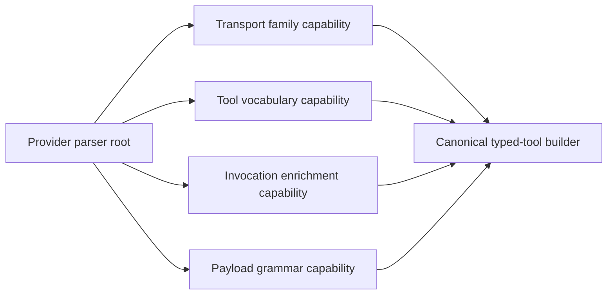

# refactor: compose ACP parser capabilities

## Overview

Tranche 1 is complete on current HEAD: shared chat vocabulary, shared chat wire parsing, neutral patch grammar ownership, replay-safe Copilot edit handling, and the first mounted provider-boundary guard are all in place. This plan rebaselines from that state and defines the remaining work required to reach the intended end-state: provider parsers as thin composition roots over explicit neutral capabilities, with current-provider parity locked to a baseline corpus and future-provider onboarding reduced to a lightweight smoke check below the existing registry seam.

## Problem Frame

The original Copilot/Claude ownership smell is fixed, but the parser layer is not yet at "god architecture."

What still remains:

- `claude_code_parser.rs` and `copilot_parser.rs` now compose neutral shared-chat capabilities, but `cursor_parser.rs`, `codex_parser.rs`, and `opencode_parser.rs` still own overlapping invocation and transport-shape logic in parallel.
- Cursor and Codex each still carry provider-local logic for argument enrichment, path inference, kind promotion, and nested/raw argument recovery even where the behavior is conceptually shared.
- OpenCode now depends on neutral patch grammar ownership, but its remaining overlap with other providers is still expressed through parallel code rather than explicit capability selection. The roadmap needs an explicit rule for deciding what OpenCode overlap becomes shared versus what remains intentionally provider-owned.
- `parsers/mod.rs` and `types.rs` still read as a provider registry plus parser structs, not as a declarative map of provider -> capability stack.
- The current boundary guard proves the tranche-one ownership rule, but the final architecture still lacks a full all-provider conformance suite and a test-only future-provider onboarding proof.

The system is therefore cleaner, but still not fully capability-first. A new provider would still require spelunking multiple bespoke parser files rather than wiring a clear transport/vocabulary/argument/edit capability stack.

## Requirements Trace

- R1. Provider-owned parser, adapter, and edit-normalizer modules must not import sibling provider-owned parser internals.
- R2. Shared behavior must live under neutral ownership named for the capability or transport shape, not a provider.
- R3. Provider parser files must remain explicit composition roots where genuine provider quirks are assembled.
- R4. Canonical parsing behavior must remain stable for Claude Code, Copilot, Cursor, Codex, and OpenCode.
- R5. Architecture guardrails must widen beyond tranche one so future refactors cannot silently reintroduce cross-provider borrowing.
- R6. Adding a future provider should be mostly a composition exercise plus contract tests, not a copy-and-edit parser fork.
- R7. Invocation enrichment and argument recovery must become explicit neutral capability families rather than hidden parser-local heuristics.
- R8. The parser registry/factory seam must make each built-in provider's capability stack inspectable from one place.

## Scope Boundaries

- No frontend, replay UI, or session-store redesign beyond the parser contracts they already consume.
- No ACP runtime transport or provider launch redesign.
- No `ToolKind` / `ToolArguments` semantic redesign beyond what is necessary to preserve already-landed behavior.
- No macro/codegen/DSL system for parser construction in this tranche.
- No speculative convergence of provider-specific aliases that are not already demonstrably shared.
- No forced convergence of OpenCode-specific behavior; any OpenCode extraction must be justified by explicit overlap discovered during conformance and boundary work.

## Context & Research

### Relevant Code and Patterns

- `packages/desktop/src-tauri/src/acp/parsers/shared_chat.rs` already owns the shared chat-family update and telemetry parsing for Claude Code and Copilot.
- `packages/desktop/src-tauri/src/acp/parsers/adapters/shared_chat.rs` already owns the neutral shared chat vocabulary used by multiple providers.
- `packages/desktop/src-tauri/src/acp/parsers/edit_normalizers/patch_text.rs` is now the neutral owner of `apply_patch` grammar parsing, including add/update/delete/move support.
- `packages/desktop/src-tauri/src/acp/session_update/tool_calls.rs` remains the canonical typed-tool builder and is already the seam where argument-derived kind upgrades are normalized.
- `packages/desktop/src-tauri/src/acp/parsers/tests/provider_composition_boundary.rs` proves the tranche-one ownership rule and is the right home for wider architectural enforcement.
- `packages/desktop/src-tauri/src/acp/parsers/cursor_parser.rs` and `packages/desktop/src-tauri/src/acp/parsers/codex_parser.rs` still contain overlapping argument recovery and inference logic that should become a neutral capability family.
- `packages/desktop/src-tauri/src/acp/parsers/opencode_parser.rs` is mostly ownership-compliant, but still represents a separate transport family that should be made explicit in the final architecture.

### Institutional Learnings

- `docs/plans/2026-04-07-001-refactor-provider-agnostic-frontend-plan.md` reinforces the adjacent architectural rule: provider quirks belong behind internal contracts, not in downstream consumers.
- No `docs/solutions/` artifact currently captures the ACP parser ownership rule; the final exit criteria should include compounding that learning once the architecture stabilizes.

### External References

- None. Local code and the just-landed tranche-one implementation are sufficient to plan the remaining architecture work.

## Key Technical Decisions

| Decision | Rationale |
| --- | --- |
| Rebaseline this plan from current HEAD instead of creating a competing follow-up plan | Tranche-one work is already landed; the durable artifact should now describe the remaining roadmap from the real baseline |
| Split the remaining work by capability family, not by provider | The architectural target is explicit capability ownership, so the roadmap should follow the desired shape |
| Treat invocation enrichment as its own shared capability family | Kind promotion, path recovery, nested-argument flattening, and location-derived hints are shared concerns distinct from payload grammar |
| Keep OpenCode as a separate transport family unless overlap is explicitly proven | "God architecture" should not flatten providers into false sameness just to maximize reuse |
| Make the provider registry/factory seam declarative only after the capability families are explicit | A registry is only useful if the capabilities it wires are themselves coherent and named truthfully |
| If a capability manifest is introduced, it must become the single source of truth for capability wiring rather than a second parallel description | The review risk here is permanent drift between parser files and a separate manifest |
| Treat OpenCode overlap as auditable scope rather than mandatory convergence | "God architecture" should capture true shared behavior, not erase real provider differences |
| Use architecture guardrails and a current-HEAD conformance corpus as the exit gate before considering macro/codegen abstractions | The next leverage point is stronger composition and proof, not metaprogramming |

## Open Questions

### Resolved During Planning

- Should this become a brand-new plan file for "phase two"? **No.** Updating the active parser architecture plan in place keeps one durable roadmap tied to the refactor.
- Should the remaining work aim for one universal parser implementation? **No.** The target is provider-composed, capability-owned architecture, not provider erasure.
- Should OpenCode be forced through the shared chat stack? **No.** OpenCode should only adopt capabilities that are actually shared.
- Should OpenCode overlap automatically become shared work in this roadmap? **No.** The remaining roadmap must explicitly classify overlap as either truly shared or intentionally provider-specific.
- Should the plan redesign downstream tool semantics while cleaning ownership? **No.** The roadmap keeps canonical session-update semantics stable.

### Deferred to Implementation

- Exact helper function names and module-private type names within each new capability family.
- Whether `AgentParser` can stay unchanged while the provider registry becomes more declarative, or whether it needs an internal descriptor layer under the same public API.

## High-Level Technical Design

> *This illustrates the intended approach and is directional guidance for review, not implementation specification. The implementing agent should treat it as context, not code to reproduce.*

Target capability stacks after this roadmap:

| Provider | Transport family | Vocabulary | Invocation enrichment | Edit / argument grammar |
| --- | --- | --- | --- | --- |
| Claude Code | shared chat | shared chat + Claude quirks | neutral shared invocation helpers where applicable | shared chat edit normalization |
| Copilot | shared chat | shared chat + Copilot quirks | neutral shared invocation helpers where applicable | shared chat edit normalization |
| Cursor | provider-specific transport over explicit shared helpers | Cursor + shared chat vocabulary | neutral invocation enrichment | Cursor edit normalization |
| Codex | provider-specific transport over explicit shared helpers | Codex + shared chat vocabulary | neutral invocation enrichment | Codex edit normalization |
| OpenCode | OpenCode transport family | OpenCode vocabulary plus any explicitly extracted shared layers | provider-specific unless overlap is proven | neutral patch grammar + generic edit helpers |

## Current Status on Current HEAD

- [x] **Unit 1: Define the parser capability taxonomy and shared seam layout**
- [x] **Unit 2: Extract the shared tool-name vocabulary under neutral ownership**
- [x] **Unit 3: Extract shared session/update wire-format parsing for the shared chat family**
- [x] **Unit 4: Extract shared payload grammar normalization and land the tranche-one boundary guard**
- [x] **Tranche-one stop/go checkpoint**

Tranche one is already proven by current HEAD:

- Copilot no longer borrows Claude-owned parser or edit-normalizer internals.
- Shared chat vocabulary and shared chat transport parsing now live under neutral ownership.
- Neutral patch grammar ownership is in place, including add/update/delete/move handling.
- Cursor/Codex no longer fall back through Claude-owned adapter normalization.
- The tranche-one architecture-boundary test is mounted and hardened.

## Implementation Units

- [ ] **Unit 5: Extract shared invocation-enrichment capabilities for Cursor and Codex**

**Goal:** Move shared argument recovery and kind/path enrichment out of provider-local parser branches and into neutral capability ownership.

**Requirements:** R1, R2, R3, R4, R7

**Dependencies:** Tranche-one checkpoint

**Files:**
- Create: `packages/desktop/src-tauri/src/acp/parsers/argument_enrichment.rs`
- Modify: `packages/desktop/src-tauri/src/acp/parsers/mod.rs`
- Modify: `packages/desktop/src-tauri/src/acp/parsers/arguments.rs`
- Modify: `packages/desktop/src-tauri/src/acp/parsers/cursor_parser.rs`
- Modify: `packages/desktop/src-tauri/src/acp/parsers/codex_parser.rs`
- Modify: `packages/desktop/src-tauri/src/acp/parsers/edit_normalizers/cursor.rs`
- Modify: `packages/desktop/src-tauri/src/acp/parsers/edit_normalizers/codex.rs`
- Modify: `packages/desktop/src-tauri/src/acp/session_update/tool_calls.rs`
- Test: `packages/desktop/src-tauri/src/acp/parsers/tests/cursor.rs`
- Test: `packages/desktop/src-tauri/src/acp/session_update/tests.rs`
- Test: `packages/desktop/src-tauri/src/acp/session_update/tool_calls.rs`
- Test: `packages/desktop/src-tauri/src/acp/parsers/cursor_parser.rs`
- Test: `packages/desktop/src-tauri/src/acp/parsers/codex_parser.rs`

**Approach:**
- Extract neutral helpers for the shared invocation problems that remain spread across Cursor and Codex:
  - parsed-command path recovery
  - location-derived path hints
  - nested/raw argument flattening
  - argument-derived kind upgrades when typed parsing resolves a richer operation
- Promote a rule into `argument_enrichment.rs` only when at least two providers demonstrably implement the same behavior with the same expected outcome in tests; any heuristic that remains provider-specific stays owned by the provider parser or provider edit normalizer.
- Leave generic raw field extraction in `arguments.rs`; move only cross-provider invocation hinting and enrichment logic into `argument_enrichment.rs`.
- Keep provider-specific title parsing, name inference, and payload-shape quirks in the provider roots.
- Decide explicitly in this unit which layer owns final kind resolution:
  - provider/parser-side helpers may derive hints
  - `session_update/tool_calls.rs` remains the final canonical arbitration point unless a narrower shared seam proves safer
- Treat the new module as a capability that returns hints or normalized argument inputs, not as a new catch-all parser.

**Execution note:** Characterization-first for any helper moved out of a provider parser where the current behavior is still implied by parser tests rather than isolated unit coverage.

**Patterns to follow:**
- `packages/desktop/src-tauri/src/acp/parsers/shared_chat.rs`
- `packages/desktop/src-tauri/src/acp/parsers/edit_normalizers/patch_text.rs`
- `packages/desktop/src-tauri/src/acp/session_update/tool_calls.rs`

**Test scenarios:**
- Happy path — Codex edit/apply-patch payloads recover missing file paths from parsed command metadata through the neutral invocation helper.
- Edge case — Cursor payloads with a file path only in the first `locations` entry enrich the parsed tool arguments without overwriting an explicit path already present in `rawInput`.
- Error path — malformed `parsed_cmd`, empty `locations`, or empty merged argument objects fail closed and preserve the current fallback behavior.
- Integration — parsed edit payloads that resolve to a richer canonical kind (for example `Move`) promote the final tool kind consistently across Cursor, Codex, and the already-landed Copilot path.

**Verification:**
- Cursor and Codex no longer need separate private implementations for the same argument-enrichment behavior.
- Every rule promoted into neutral ownership is justified by at least two provider call sites plus regression coverage proving the behavior is genuinely shared.
- The plan's chosen ownership split between `arguments.rs`, `argument_enrichment.rs`, provider parsers, and the canonical typed-tool builder is implemented explicitly rather than left implicit across multiple layers.

- [ ] **Unit 6: Make the provider capability stack explicit at the registry/factory seam**

**Goal:** Turn the parser registry from a provider list into an inspectable provider -> capability composition map without creating a second source of truth for wiring.

**Requirements:** R2, R3, R6, R8

**Dependencies:** Unit 5

**Files:**
- Create: `packages/desktop/src-tauri/src/acp/parsers/provider_capabilities.rs`
- Modify: `packages/desktop/src-tauri/src/acp/parsers/mod.rs`
- Modify: `packages/desktop/src-tauri/src/acp/parsers/types.rs`
- Modify: `packages/desktop/src-tauri/src/acp/parsers/claude_code_parser.rs`
- Modify: `packages/desktop/src-tauri/src/acp/parsers/copilot_parser.rs`
- Modify: `packages/desktop/src-tauri/src/acp/parsers/cursor_parser.rs`
- Modify: `packages/desktop/src-tauri/src/acp/parsers/codex_parser.rs`
- Modify: `packages/desktop/src-tauri/src/acp/parsers/opencode_parser.rs`
- Test: `packages/desktop/src-tauri/src/acp/parsers/tests/mod.rs`
- Test: `packages/desktop/src-tauri/src/acp/session_update/tests.rs`

**Approach:**
- Make the key architectural decision in this unit instead of deferring it: introduce an executable capability descriptor/registry layer under `types.rs` and `provider_capabilities.rs`.
- That descriptor layer becomes the single source of truth for capability wiring:
  - transport family
  - tool vocabulary
  - invocation enrichment
  - edit normalization
  - usage telemetry parsing
- Keep provider parser files as the public entry points, but make them thin delegators over the authoritative descriptor so the selected capability stack is readable from one seam instead of being discoverable only by reading multiple parser files.
- Preserve the existing `AgentParser` trait unless a purely internal adapter layer is required to keep the registry declarative.

**Patterns to follow:**
- `packages/desktop/src-tauri/src/acp/parsers/mod.rs`
- `packages/desktop/src-tauri/src/acp/parsers/types.rs`
- `packages/desktop/src-tauri/src/acp/parsers/shared_chat.rs`

**Test scenarios:**
- Happy path — the registry still returns the correct parser for each built-in provider while exposing the same composition stack in one place.
- Edge case — a provider with no optional capability beyond transport/vocabulary/invocation/edit composition still composes correctly from defaults without bespoke branches in the registry.
- Error path — unsupported update types and malformed tool-call payloads still produce the same `ParseError` classes after the registry is made declarative.
- Integration — a reviewer can identify every built-in provider's capability stack from the registry/factory seam without reading sibling provider files, and without a second drifting manifest to reconcile.

**Verification:**
- The parser tree reads as explicit provider composition over named capability families.
- The registry/factory seam is the single inspectable source of capability wiring rather than a second drifting description.
- Any future-provider test support required by later units is provided intentionally by this unit rather than assumed implicitly.

- [ ] **Unit 7: Expand architecture-boundary enforcement to the full provider allowlist**

**Goal:** Widen the tranche-one ownership guard so the no-cross-provider rule is enforced across the remaining provider parser families.

**Requirements:** R1, R5

**Dependencies:** Units 5 and 6

**Files:**
- Modify: `packages/desktop/src-tauri/src/acp/parsers/tests/provider_composition_boundary.rs`
- Modify: `packages/desktop/src-tauri/src/acp/parsers/tests/mod.rs`
- Test: `packages/desktop/src-tauri/src/acp/parsers/tests/provider_composition_boundary.rs`

**Approach:**
- Widen the boundary guard from tranche-one modules to the full allowlist of provider parser, adapter, and edit-normalizer files that should never import sibling provider internals.
- Explicitly classify any remaining OpenCode overlap surfaced during this audit as either:
  - truly shared and eligible for extraction in the next unit, or
  - intentionally provider-specific and therefore left in OpenCode ownership
- Keep this unit focused on ownership enforcement only; broader parity and future-provider proof belong in the next unit.

**Patterns to follow:**
- `packages/desktop/src-tauri/src/acp/parsers/tests/provider_composition_boundary.rs`
- `packages/desktop/src-tauri/src/acp/parsers/mod.rs`

**Test scenarios:**
- Error path — the widened boundary test fails on direct imports, grouped imports, re-export aliases, or fully qualified sibling-provider references.
- Edge case — OpenCode-owned modules are only added to the allowlist where the ownership rule is actually intended to apply, so the guard does not create false architectural constraints.
- Integration — Cursor, Codex, Claude Code, Copilot, and OpenCode can all be classified by the same ownership rule without ambiguous exceptions hidden in reviewer lore.

**Verification:**
- Provider ownership backsliding is blocked by the test suite, not only by review discipline.
- The plan leaves an explicit written classification for OpenCode overlap rather than an implied future decision.

- [ ] **Unit 8: Lock current-provider parity to a baseline corpus and add a lightweight future-provider smoke check**

**Goal:** Prove that the refactor preserves today’s provider behavior before adding only the smallest necessary proof that a future provider can compose below the registry seam.

**Requirements:** R4, R5, R6, R8

**Dependencies:** Unit 7

**Files:**
- Create: `packages/desktop/src-tauri/src/acp/parsers/tests/provider_conformance.rs`
- Create: `packages/desktop/src-tauri/src/acp/parsers/tests/future_provider_composition.rs`
- Modify: `packages/desktop/src-tauri/src/acp/parsers/tests/mod.rs`
- Modify: `packages/desktop/src-tauri/src/acp/parsers/tests/opencode.rs`
- Modify: `packages/desktop/src-tauri/src/acp/session_update/tests.rs`
- Test: `packages/desktop/src-tauri/src/acp/parsers/tests/provider_conformance.rs`
- Test: `packages/desktop/src-tauri/src/acp/parsers/tests/future_provider_composition.rs`

**Approach:**
- Build a baseline corpus from current HEAD behavior rather than from hand-picked representative examples alone. The corpus can be assembled from existing golden fixtures, parser tests, and captured real payloads already used in the repo.
- Add conformance coverage for the canonical behaviors this refactor promises not to change across Claude Code, Copilot, Cursor, Codex, and OpenCode.
- Add only a lightweight future-provider smoke check, but make it exercise the real registry/descriptor seam: the test provider must be wired through the same executable capability descriptor path used by built-in providers, with no edits outside provider-owned files plus the registry entry.
- Treat the future-provider smoke check as corroborating evidence for R6, not as the main proof obligation of the roadmap. The primary proof remains authoritative capability wiring in Unit 6 plus current-provider parity in this unit.

**Execution note:** Execution target: external-delegate

**Patterns to follow:**
- `packages/desktop/src-tauri/src/acp/session_update/tests.rs`
- `packages/desktop/src-tauri/src/acp/parsers/tests/snapshots/`
- `packages/desktop/src-tauri/src/acp/parsers/tests/opencode.rs`

**Test scenarios:**
- Happy path — all built-in providers still normalize the baseline corpus of read, edit, execute, search, task, question, and todo payloads into the same canonical tool shapes as current HEAD.
- Edge case — provider-specific behaviors intentionally left owned by OpenCode, Cursor, or Codex remain stable and are not accidentally flattened by shared capability extraction.
- Error path — malformed payloads and unsupported update types still produce the same parser errors across the baseline corpus after the refactor.
- Integration — the future-provider smoke check registers below the existing registry seam and passes a minimal contract suite without touching existing provider-owned parser files.

**Verification:**
- Stability claims are grounded in a current-HEAD baseline corpus rather than only in newly selected examples.
- The future-provider proof stays small enough that it cannot dominate the roadmap over today’s provider parity, while still exercising the real executable onboarding seam.

## System-Wide Impact

- **Interaction graph:** Parser composition affects live session updates, replay parsing, typed tool-call construction, and permission-request enrichment, but leaves downstream display contracts unchanged.
- **Error propagation:** Shared capability modules must preserve current `ParseError` classes so downstream layers do not gain new branching logic.
- **State lifecycle risks:** Mixed migration states can leave duplicate ownership paths in place temporarily; each unit should remove old import paths as it lands.
- **API surface parity:** `AgentParser`, canonical `ToolKind`, and canonical `ToolArguments` remain unchanged invariants for downstream consumers.
- **Integration coverage:** Parser tests must prove cross-provider parity because architecture cleanup can regress one provider while another stays green.
- **Unchanged invariants:** Provider-specific quirks remain allowed, but only in provider composition roots or provider-owned capability wrappers.

## Risks & Dependencies

| Risk | Mitigation |
| --- | --- |
| Invocation-enrichment helpers become a new dumping ground for unrelated heuristics | Keep the capability narrowly scoped to path/kind/argument recovery and leave provider-only name/title quirks in the provider roots |
| A declarative registry adds indirection without improving clarity | Introduce it only after the capability families exist and keep the current `AgentParser` consumer contract stable |
| Conformance fixtures become stale or too broad to maintain | Keep fixtures representative and canonical, and scope them to behavior that must remain stable across providers |

## Documentation / Operational Notes

- Once Unit 8 lands, add a `docs/solutions/` artifact capturing the ACP parser ownership rule and the provider-composed capability model.
- For phased PRs, each PR should name the capability family being extracted and the old provider-local logic it removes.
- Final completion requires an all-provider parity pass covering Claude Code, Copilot, Cursor, Codex, and OpenCode.

## Sources & References

- Related code: `packages/desktop/src-tauri/src/acp/parsers/mod.rs`
- Related code: `packages/desktop/src-tauri/src/acp/parsers/types.rs`
- Related code: `packages/desktop/src-tauri/src/acp/parsers/shared_chat.rs`
- Related code: `packages/desktop/src-tauri/src/acp/parsers/edit_normalizers/patch_text.rs`
- Related code: `packages/desktop/src-tauri/src/acp/session_update/tool_calls.rs`
- Related plan: `docs/plans/2026-04-07-001-refactor-provider-agnostic-frontend-plan.md`
