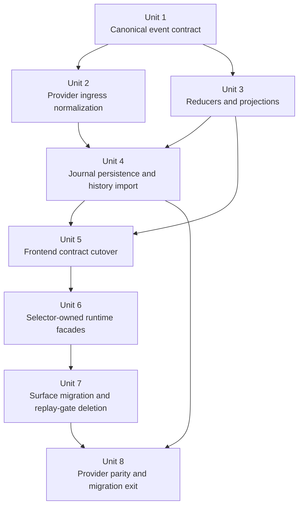

# refactor: unify agent runtime around a canonical event journal

## Overview

Replace Acepe's transitional ACP runtime with one end-to-end canonical architecture:

- provider adapters normalize raw transport into canonical backend domain events
- the backend appends those events to a durable per-session journal
- backend reducers/projectors derive canonical runtime state for sessions, turns, transcript segments, operations, interactions, todos, and usage
- persistence and history hydration read from the same journal/snapshot model as live streaming
- the frontend consumes canonical snapshots and deltas instead of reconstructing provider semantics, replay suppression, or preload reconciliation on its own

The goal is not another local patch. The goal is to remove the entire class of split-brain bugs by making live, replayed, restored, and provider-specific data all pass through the same identity and reducer pipeline.

## Phase Success Criteria

This phase is successful when all of the following are true:

- there is one canonical backend event contract for all providers and all session lifecycle shapes
- live streaming and historical hydration use the same reducer/projection model instead of separate frontend preload logic
- provider quirks stop at parser/adapter boundaries and do not leak into frontend store or component matching logic
- canonical `Operation`, `Interaction`, `Turn`, and transcript segment state are reducer-owned domain projections, not ad-hoc frontend reconstructions
- replay suppression, duplicate tool replay handling, and preload dedupe are expressed as journal/idempotence guarantees rather than independent frontend patches
- persistence can restore old and new sessions without reintroducing duplicate cards, missing identity, or wrong reply routing
- frontend UI surfaces render projections/selectors over canonical state and submit commands by canonical IDs
- the concrete user-visible regressions that motivated this work stay fixed through restore, reconnect, and replay:
  - duplicate question ownership
  - duplicated command cards
  - wrong reply routing for pending interactions
  - session/panel/worktree restore drift
- adding or refining a provider no longer requires frontend ownership changes in the affected runtime flow
- the canonical frontend/runtime path contains zero semantic branching on provider name, transport protocol, replay fingerprints, or provider-local raw payload shape outside explicitly documented compatibility-only adapters

## Problem Frame

Acepe has made the right recent moves:

- `InteractionStore` became the canonical owner for live pending interactions
- `OperationStore` became the canonical owner for tool execution identity and association
- duplicate execute/permission and duplicate replayed tool-call bugs were fixed without provider-specific UI branches

But those fixes are still layered on a transitional runtime:

1. **Ingress is still split**
   - provider session updates stream through `SessionEventService`
   - legacy ACP inbound requests still enter through `InboundRequestHandler`
   - preload/history hydration still materializes state through separate bulk-load paths

2. **Persistence is still transport-shaped**
   - restored sessions come back through stored entry conversion, replay suppression, and preload-specific cleanup
   - the system still distinguishes "live events" and "history load" as architecture, not just transport

3. **Frontend still owns too much runtime semantics**
   - replay suppression is coordinated in frontend services
   - preload normalization exists in frontend state
   - hot state and connection state are partially duplicated
   - transcript/tool/interactions are still composed from multiple stores instead of one reducer-owned projection model

4. **Provider-agnostic direction is incomplete**
   - parser/provider composition still leaks ownership
   - backend reconciliation is stronger than before but not yet the universal event ownership boundary
   - the frontend still consumes a session-update protocol rather than a durable domain-event/snapshot contract

This architecture is now safer, but it is still a repaired pipeline. The GOD architecture is a canonical journal and reducer system where transport differences and restore/live differences are adapter concerns only.

The user-visible justification for doing the full redesign now is concrete, not abstract:

- duplicate questions and duplicate command cards already proved that one logical action can still acquire multiple owners depending on replay order and transport shape
- restore/reconnect/worktree issues already proved that persistence and live runtime do not share one identity model
- panel/kanban and operation/interaction work already proved Acepe keeps paying for split-brain ownership until a canonical owner exists
- future provider work will stay expensive until the frontend stops consuming transport semantics directly

## Requirements Trace

- R1. All providers must normalize into one canonical backend event contract before persistence or frontend dispatch.
- R2. Live streaming, replay, reconnect, and history hydration must flow through the same reducer/projection architecture.
- R3. Session identity must keep Acepe-local stable IDs distinct from provider session IDs, with no frontend rekeying.
- R4. `Operation`, `Interaction`, `Turn`, transcript segments, usage, and todos must be canonical reducer-owned state, not reconstructed differently per surface.
- R5. Replay and duplicate suppression must be guaranteed by event identity and reducer idempotence, not by frontend special cases.
- R6. Frontend UI surfaces must consume canonical projections/selectors and submit commands by canonical IDs only.
- R7. Provider-specific parsing, transport quirks, and reply-shape differences must terminate at backend adapters and contracts.
- R8. Persistence must support both new journal-backed sessions and compatibility loading for existing stored sessions without duplicate UI or lost reply routing.
- R9. The migration must be additive and parity-preserving for Claude, Copilot, Codex, Cursor, and OpenCode.
- R10. The resulting architecture must make a future provider primarily a backend composition exercise rather than a frontend or cross-layer refactor.
- R11. Canonical reply routing must use backend-owned canonical handler metadata rather than frontend protocol detection or provider-specific request shapes.
- R12. GA is blocked until the canonical path is free of unlisted frontend provider/transport ownership and the provider/restore parity matrix is green.

## Scope Boundaries

- In scope:
  - backend event contract redesign
  - backend reducer/projector architecture
  - persistence and history hydration redesign
  - provider parser/adapter ownership cleanup required to feed the new contract
  - frontend contract and state-layer cutover to canonical snapshots/deltas
- Out of scope:
  - broad visual redesign of transcript, queue, kanban, tabs, or notifications
  - changing product behavior unrelated to ownership/data flow
  - replacing all current storage formats in one flag day with no compatibility path
  - inventing a speculative generic event-sourcing platform beyond what Acepe's runtime actually needs

## Planning Inputs

This plan intentionally supersedes and composes the strongest pieces of recent architecture work rather than competing with them:

- `docs/plans/2026-04-07-001-refactor-provider-agnostic-frontend-plan.md`
- `docs/plans/2026-04-07-001-refactor-unified-interaction-model-plan.md`
- `docs/plans/2026-04-07-001-refactor-unify-acp-tool-reconciliation-plan.md`
- `docs/plans/2026-04-07-003-refactor-canonical-operation-association-plan.md`
- `docs/plans/2026-04-07-004-refactor-composable-acp-parser-architecture-plan.md`
- `docs/solutions/logic-errors/kanban-live-session-panel-sync-2026-04-02.md`
- `docs/solutions/logic-errors/operation-interaction-association-2026-04-07.md`

## Superseded Plans and Disposition

This plan is the new umbrella architecture source of truth, but not every input plan has the same disposition:

- **Absorbed into this plan**
  - `docs/plans/2026-04-07-001-refactor-provider-agnostic-frontend-plan.md`
  - `docs/plans/2026-04-07-001-refactor-unified-interaction-model-plan.md`
  - `docs/plans/2026-04-07-001-refactor-unify-acp-tool-reconciliation-plan.md`
  - `docs/plans/2026-04-07-003-refactor-canonical-operation-association-plan.md`
  - `docs/plans/2026-04-07-004-refactor-composable-acp-parser-architecture-plan.md`
- **Remain as implementation inputs and historical rationale**
  - `docs/solutions/logic-errors/kanban-live-session-panel-sync-2026-04-02.md`
  - `docs/solutions/logic-errors/operation-interaction-association-2026-04-07.md`

Once execution starts from this plan, work required to reach the defined migration boundary should stay inside this document. Runtime work beyond that boundary should move into follow-on plans rather than reopening this one indefinitely.

## Current Architecture Diagnosis

### What is already right

- `OperationStore` and `InteractionStore` prove the system wants canonical domain owners.
- `ToolCallManager` already behaves like a write adapter, which is the right direction.
- backend tool reconciliation is already stronger than frontend-only reconciliation.
- panel-backed kanban and session identity fixes already established the rule: one runtime owner, many projections.

### What is still structurally wrong

- `SessionEventService` still mediates too much runtime meaning instead of applying canonical domain deltas.
- `SessionEntryStore` still acts as both transcript materialization and part of semantic state ownership.
- preload/history hydration is not the same architecture as live streaming.
- replay suppression and duplicate tolerance are not first-class journal/reducer invariants.
- the frontend replay gate can still discard valid live semantic updates; the missing sub-agent tool/tally regression proved that repeated parent task `toolCall` events with richer `taskChildren` can be misclassified as stale replay before the UI ever sees the canonical child graph.
- provider parser/adapter ownership is cleaner but still not a single truthful capability stack.
- frontend session state still mixes domain projections with transport/reconnect concerns.

## Current Migration Status Entering the Final Phase

The migration is no longer hypothetical. The repo already contains the first durable slices of the target architecture:

- canonical backend domain-event types exist and are exported to the frontend
- backend projection ownership exists for session, operation, and interaction state
- journal-backed persistence and journal-first restore precedence exist
- compatibility import for old sessions already feeds backend projection state
- frontend preload/live hydration already consumes backend projections for interactions
- several of the motivating bugs are fixed by backend-owned canonical interaction and operation state rather than frontend provider-specific patches

What remains is the **final huge phase** rather than the first construction phase:

- the frontend still consumes transport-shaped `toolCall` / `toolCallUpdate` semantics for core transcript/runtime behavior
- `SessionEventService` still owns replay heuristics, duplicate suppression, and event-policy decisions that belong behind canonical event identity
- transcript and cross-surface rendering still depend on transitional entry-store / tool-call-manager seams rather than one reducer-owned runtime snapshot model
- the provider parity and migration-verification boundary is not yet strong enough to safely delete the remaining compatibility shims

So the final phase is not "invent canonical runtime." It is **finish the cutover, remove the last transport-owned frontend seams, and prove parity strongly enough to delete them**.

## Remaining Non-Agnostic Seam Inventory

These are the strongest remaining reasons the runtime cannot yet claim to be 100% agnostic:

- `packages/desktop/src/lib/acp/store/session-event-service.svelte.ts` still interprets transport-shaped session updates, replay fingerprints, and duplicate-suppression policy for canonical entities.
- `packages/desktop/src/lib/acp/logic/interaction-reply.ts` still decides reply strategy from transport protocol shape (`jsonRpcRequestId` / HTTP fallback) instead of a backend-owned canonical reply handler identity.
- `packages/desktop/src/lib/acp/converters/stored-entry-converter.ts`, `packages/desktop/src/lib/acp/logic/entry-converter.ts`, and `packages/desktop/src/lib/components/main-app-view/logic/session-preload-connect.ts` still preserve a separate frontend restore/preload adaptation path instead of treating restore as the same canonical snapshot/delta architecture as live sessions.
- `packages/desktop/src/lib/acp/utils/merge-permission-args.ts` still parses provider-shaped `rawInput` in the frontend to recover canonical tool meaning, which means provider edit-shape quirks have not fully terminated at backend adapters.
- Legacy tool-name/display normalization is still duplicated across frontend conversion seams, which is acceptable only as temporary compatibility glue and must not remain on the canonical path.

## Phase Boundary

This document is now frozen to a specific migration boundary:

- complete the canonical runtime cutover for the current ACP runtime
- remove the remaining frontend semantic replay / transport-owned ownership layers
- prove restore/live/reconnect parity strongly enough to make the canonical pipeline the default runtime path
- expand that cutover across the currently supported providers with explicit parity gates

Future runtime improvements that go beyond this cutover boundary — new projection families, new provider capabilities, or post-migration architecture refinements — should land in follow-on plans rather than being appended indefinitely to this one.

## Key Technical Decisions

| Decision | Rationale |
| --- | --- |
| Introduce a canonical backend event journal | This gives one durable identity boundary for live, replayed, restored, and persisted session state. |
| Make reducers/projectors the canonical owners of runtime state | `Operation`, `Interaction`, `Turn`, transcript segments, and usage should be derived once, not reconstructed per consumer. |
| Keep local session ID and provider session ID separate forever | This preserves panel/workspace stability and avoids map rekeying. |
| Feed both live transport and history import through the same reducer path | This removes preload-specific cleanup as architecture. |
| Terminate provider quirks at parser/adapter composition roots | Frontend and persistence should never care that one provider used `shell-permission` and another used a direct tool ID. |
| Promote backend-owned idempotence over frontend replay suppression | Duplicate tool-call or interaction replays should be ignored because event identity says so, not because a frontend service is in a special suppression mode. |
| Replace raw session-update consumption with canonical snapshot/delta contracts | The frontend should apply domain deltas, not session-protocol semantics. |
| Treat repeated task-parent enrichment as canonical state mutation, not replay noise | Sub-agent parent operations legitimately gain child structure over time; the final architecture must model that as reducer-owned operation evolution rather than letting a frontend dedupe layer drop it. |
| Canonical reply routing is backend-owned | The frontend should submit replies against canonical handler metadata, not decide between JSON-RPC and HTTP strategies on its own. |
| Frontend raw payload recovery is compatibility-only | Provider-local `rawInput`, legacy tool-name cleanup, and restore conversion helpers may exist temporarily, but they must be quarantined off the canonical path and explicitly deleted or documented as compatibility-only. |
| Keep UI surfaces projection-only | Transcript, queue, kanban, tabs, and notifications should render canonical selectors, not perform matching or ownership inference. |
| Preserve compatibility via import/adaptation, not by freezing the current model | Existing JSONL/history data needs an adapter into the journal/reducer world, not permanent dual architecture. |

## Open Questions

### Resolved During Planning

- **What should the planning boundary be?** Full end-to-end protocol, persistence, and provider contract redesign.
- **Should this replace the recent operation/interaction work?** No. It should absorb and preserve those wins as sublayers of the final architecture.
- **Should this be frontend-only?** No. The frontend cannot become truly clean while backend contracts and persistence remain transport-shaped.
- **What storage contract should the journal use?** SQLite-backed append-only journal tables plus projection snapshots. JSONL remains export/import compatibility material, not the primary canonical store.
- **Who owns transcript ordering/deduplication in the final architecture?** Backend reducers/projectors. The frontend only renders transcript selectors/view models.
- **Should the final migration phase create a new top-level plan?** No. The active umbrella plan remains the architecture source of truth; this deepening pass updates it with the remaining cutover boundary and migration status.
- **What does the newly discovered sub-agent regression imply for the final phase?** The remaining semantic replay gate in the frontend must be deleted or reduced to sequence-gap recovery only; it cannot remain as a meaning-owning policy layer.
- **What should the first compatibility-import timing be?** Lazy import on first access in the initial rollout. This keeps startup cost bounded while preserving a canonical import path for dormant historical sessions.
- **What counts as "low" compatibility-import volume for exit?** For planning purposes, treat it as **fewer than 2% of weekly distinct restored sessions** triggering old-session import for **three consecutive stable releases**, with **>=99.5% import success** and no unresolved quarantined import failures.

### Deferred To Implementation

- Exact dashboard/alert wiring and telemetry ownership for compatibility-import health, rollback triggers, and migration exit reporting.

## High-Level Technical Design

```text
                           TARGET ARCHITECTURE

 provider stdout/json-rpc/sse
 Claude / Copilot / Codex / Cursor / OpenCode
                  |
                  v
      +--------------------------------------+
      | provider parsers + adapter contracts |
      | - transport decoding                 |
      | - provider quirks                    |
      | - explicit identity extraction       |
      +--------------------------------------+
                  |
                  v
      +--------------------------------------+
      | canonical backend event ingress      |
      | SessionDomainEvent                   |
      | event_id, seq, session ids, cause    |
      +--------------------------------------+
                  |
                  v
      +--------------------------------------+
      | session event journal                |
      | append-only, idempotent, durable     |
      +--------------------------------------+
                  |
                  v
      +--------------------------------------+
      | reducers / projectors                |
      | - SessionProjection                  |
      | - TurnProjection                     |
      | - TranscriptProjection               |
      | - OperationProjection                |
      | - InteractionProjection              |
      | - UsageProjection                    |
      +--------------------------------------+
                  |
        +---------+----------+
        |                    |
        v                    v
 +----------------+  +----------------------+
 | persistence     |  | frontend domain      |
 | snapshots       |  | snapshot/delta API   |
 | history import  |  | no transport quirks  |
 +----------------+  +----------------------+
                               |
                               v
                    +-------------------------+
                    | selectors / view models |
                    | transcript queue kanban |
                    | tabs notifications      |
                    +-------------------------+
                               |
                               v
                    +-------------------------+
                    | UI submits commands by  |
                    | canonical operation /   |
                    | interaction / turn IDs  |
                    +-------------------------+
```

The architectural rule is simple:

- **providers produce canonical events**
- **journal preserves them**
- **reducers own meaning**
- **frontend projects state**

## End-to-End Flow in ASCII

```text
LIVE PATH
=========

provider raw stream / json-rpc / sse
        |
        v
+-------------------------------+
| parser + adapter composition  |
| - provider quirks end here    |
| - raw transport decoded here  |
+-------------------------------+
        |
        v
+-------------------------------+
| canonical event ingress       |
| SessionDomainEvent            |
| event_id + seq + causation    |
+-------------------------------+
        |
        v
+-------------------------------+
| append to SQLite journal      |
| (atomic ordered event write)  |
+-------------------------------+
        |
        v
+-------------------------------+
| reducers / projectors         |
| session / turn / transcript   |
| operation / interaction /     |
| usage / todo projections      |
+-------------------------------+
        |
        +------------------------------+
        |                              |
        v                              v
+----------------------+     +----------------------+
| snapshot persistence |     | frontend delta/snap |
| for restore / preload|     | contract            |
+----------------------+     +----------------------+
                                       |
                                       v
                           +--------------------------+
                           | selectors / view models  |
                           | transcript queue kanban  |
                           | tabs notifications       |
                           +--------------------------+
                                       |
                                       v
                           +--------------------------+
                           | user action by canonical |
                           | operation/interaction id |
                           +--------------------------+
                                       |
                                       v
                           +--------------------------+
                           | backend command/reply    |
                           | routing                  |
                           +--------------------------+


RESTORE / PRELOAD PATH
======================

old session history or current snapshot
                |
                v
+--------------------------------------+
| load canonical snapshot directly     |
| OR lazy compatibility import once    |
+--------------------------------------+
                |
                v
+--------------------------------------+
| same reducers / projectors shape     |
| as live path                         |
+--------------------------------------+
                |
                v
+--------------------------------------+
| same frontend snapshot/delta model   |
| as live path                         |
+--------------------------------------+


KEY INVARIANT
=============

provider transport  ->  canonical events  ->  journal  ->  reducers  ->  projections  ->  UI

There is no separate "special preload architecture" and no separate
"frontend replay repair architecture" in the target state.
```

## Proof Slice and Go/No-Go Gate

This plan should not hard-commit Acepe to the entire journal architecture on faith. Before the plan becomes the uncontested path, execution must complete a proof slice with explicit acceptance criteria.

**Proof slice boundary:**

- canonical event envelope exists
- at least one cross-provider tool/interation flow emits canonical events
- reducers/projectors derive stable operation + interaction + transcript state from those events
- one live/new canonical session, one restored transitional journal-backed session, and one compatibility-imported historical session converge to the same projection family
- the frontend can render the proof flow without replay suppression or preload-specific dedupe

**Go criteria:**

- the proof slice preserves existing behavior for Claude, Copilot, and at least one structurally distinct third supported provider path
- duplicate command-card and duplicate-question regressions stay green through live + restore paths
- restore/reconnect do not require frontend ownership patches in the proof flow
- compatibility-imported old sessions and already journal-backed transitional sessions both match the proof-flow canonical projections before the plan becomes the uncontested path

**No-go criteria:**

- canonical events cannot represent the proof flow without reintroducing provider-specific frontend behavior
- reducers require transport-specific branching to preserve parity
- historical import or transitional-journal upgrade cannot converge to the same projection state as live sessions without a parallel architecture
- any supported provider requires reducer-level or frontend-level provider branching on the canonical path to preserve parity

If the proof slice fails, the plan should be revised before it supersedes adjacent implementation plans in practice.

## Canonical Event Model

The new backend contract should be a small, explicit family of domain events rather than raw transport-shaped updates. Representative categories:

- session lifecycle
  - `SessionIdentityResolved`
  - `SessionConnected`
  - `SessionDisconnected`
  - `SessionConfigChanged`
- turn lifecycle
  - `TurnStarted`
  - `TurnCompleted`
  - `TurnFailed`
  - `TurnCancelled`
- transcript
  - `UserMessageSegmentAppended`
  - `AssistantMessageSegmentAppended`
  - `AssistantThoughtSegmentAppended`
- operation lifecycle
  - `OperationUpserted`
  - `OperationChildLinked`
  - `OperationCompleted`
- interaction lifecycle
  - `InteractionUpserted`
  - `InteractionResolved`
  - `InteractionCancelled`
- other runtime state
  - `UsageTelemetryUpdated`
  - `TodoStateUpdated`

Exact names can change, but the invariant must not: event categories must represent domain meaning, not provider wire shape.

Idempotence must also be explicit:

- canonical deduplication keys are reducer-owned and derived from canonical ingress identity, not raw provider retransmit heuristics
- two events with the same canonical identity for the same session are idempotent even if replayed
- two events with different canonical identities are distinct even if their payload text happens to match
- provider adapters may preserve causation metadata from raw transport, but they must not be the final deciders of duplicate suppression

### Canonical Identity Derivation Rules

Unit 1 must turn event identity from a principle into a normative contract shared by live ingress and compatibility import. The exact helper names can change, but both paths must call the same derivation logic and produce the same canonical IDs for the same logical event family.

| Event family | Canonical identity basis | Notes |
| --- | --- | --- |
| Session lifecycle | local session ID + lifecycle kind + canonical cause key | Provider reconnect noise must collapse when it represents the same lifecycle transition. |
| Turn lifecycle | local session ID + turn ID + lifecycle transition kind | Turn start/complete/fail/cancel must never mint unrelated IDs for replayed provider updates. |
| Transcript segment | local session ID + canonical message/segment ID + segment kind | History import and live streaming must land the same transcript segment identity. |
| Operation mutation | local session ID + canonical operation ID + mutation kind + causal version key | Parent-task enrichment must reuse the same canonical operation identity while emitting distinct mutation events as child structure grows. |
| Interaction mutation | local session ID + canonical interaction ID + lifecycle transition | Permission/question/plan-approval updates must resolve to one interaction lineage across live, replay, and restore. |
| Usage / todo mutation | local session ID + canonical metric or todo identity + causal version key | Telemetry/todo reducers should stay idempotent without provider-specific fallback matching. |

The plan is not allowed to hand-wave this later: Unit 2 and Unit 4 should be blocked until fixtures prove live ingress and compatibility import derive identical canonical IDs for the same logical events.

### Representative Canonical Identity Examples

The exact helper names can change, but Unit 1 should include reviewable derivation examples at roughly this level of specificity before Unit 2 broadens:

| Event family | Normalized source inputs | Derivation sketch |
| --- | --- | --- |
| Session reconnect | local session ID, lifecycle kind, normalized provider session ID, canonical cause key | `hash(local_session_id, "session_connected", normalized_provider_session_id, canonical_cause_key)` |
| Operation mutation | local session ID, canonical operation ID, mutation kind, causal version key | `hash(local_session_id, canonical_operation_id, mutation_kind, causal_version_key)` where `causal_version_key` is derived from normalized operation semantics after adapter normalization (status, canonical arguments hash, normalized child graph hash, and other mutation-relevant fields) |
| Interaction upsert/resolution | local session ID, canonical interaction ID, lifecycle transition, causal version key | `hash(local_session_id, canonical_interaction_id, lifecycle_transition, causal_version_key)` |
| Transcript segment append | local session ID, canonical message/segment ID, segment kind, canonical ordering key | `hash(local_session_id, canonical_message_segment_id, segment_kind, canonical_ordering_key)` |

These derivations are intentionally domain-shaped rather than provider-shaped: providers may supply raw material for the normalized fields, but Unit 2 and Unit 4 must prove the normalized inputs converge before hashing.

## Canonical Runtime Projections

Reducers/projectors should own:

- **SessionProjection** — local/provider identity, connectivity, current mode/model, capability snapshot, current turn pointers
- **TurnProjection** — active turn state, errors, completion metadata, causal boundaries
- **TranscriptProjection** — ordered transcript segments and tool-display rows derived from canonical events
- **OperationProjection** — canonical tool execution state, hierarchy, progressive arguments, terminal results
- **InteractionProjection** — canonical permissions, questions, plan approvals, reply routing metadata, resolution history
- **UsageProjection** — context budget, token telemetry, usage presentation inputs
- **TodoProjection** — canonical todo list state and attention-relevant todo deltas derived from canonical events

Recent Acepe work already proved `Operation` and `Interaction` want canonical ownership. This plan completes that logic across the whole session runtime.

## Alternative Approaches Considered

- **Keep the current frontend architecture and keep patching reconciliation seams** — rejected because it preserves split ownership between live, preload, and provider-specific flows.
- **Move only more logic into frontend canonical stores** — rejected because history, persistence, and provider contracts would still remain transport-shaped.
- **Do a pure backend rewrite without changing the frontend contract** — rejected because the frontend would still inherit the old replay/preload/session-update model.
- **Flag-day replace all persistence with no compatibility adapter** — rejected because it is unnecessarily risky and not required for architectural correctness.

## Implementation Units

Status note: Units 1-4 define and harden the foundational canonical runtime boundary, and significant slices of that groundwork are already landed. This deepening pass primarily sharpens the remaining execution boundary in Units 5-8 so the final migration phase is bounded and shippable.



- [ ] **Unit 1: Define the canonical backend event contract**

**Goal:** Establish one durable event envelope and event taxonomy for all providers and all runtime flows.

**Delta from current state:**

- `acp/domain_events.rs` already exists, but the repo still mixes canonical event scaffolding with transitional session-update/journal behavior.
- This unit upgrades that scaffolding into the normative event-ID and causation contract that every later unit must reuse.
- Transitional stored-update envelopes remain readable until Unit 4 finishes the persistence upgrade, but they stop being the architecture target.

**Requirements:** R1, R3, R5, R7, R10

**Dependencies:** None

**Files:**
- Modify: `packages/desktop/src-tauri/src/acp/domain_events.rs`
- Create: `packages/desktop/src-tauri/src/acp/domain_event_ids.rs`
- Modify: `packages/desktop/src-tauri/src/acp/mod.rs`
- Modify: `packages/desktop/src-tauri/src/acp/client_updates/mod.rs`
- Modify: `packages/desktop/src-tauri/src/session_jsonl/export_types.rs`
- Modify: `packages/desktop/src/lib/services/acp-types.ts`
- Modify: `packages/desktop/src/lib/utils/tauri-client/acp.ts`

**Approach:**
- Define a canonical `SessionDomainEvent` envelope with stable event ID, session-local identity, optional provider identity, sequence, timestamp, causation metadata, and typed payload.
- Define deterministic event identity derivation rules up front:
  - live ingress and compatibility import must derive the same canonical event ID for the same logical event
  - event IDs are derived from canonical source fields and causation metadata, not arbitrary runtime UUID generation
  - the reducer treats `(session_id, canonical_event_id)` as the idempotence boundary
- Include a normative derivation appendix for representative session, transcript, operation, and interaction events so `canonical_event_id` and `causal_version_key` are reviewable before implementation starts; Unit 2 and Unit 4 must reuse the same derivation helpers rather than inventing parallel formulas.
- Make event identity/idempotence explicit so replay/duplicate handling becomes reducer logic, not UI cleanup.
- Keep the initial taxonomy narrow and domain-shaped; do not mirror every raw transport variation.
- Thread the contract through the Rust↔TypeScript export path before broader cutover.

**Patterns to follow:**
- `packages/desktop/src-tauri/src/acp/provider.rs`
- `packages/desktop/src-tauri/src/session_jsonl/export_types.rs`
- `docs/plans/2026-04-07-001-refactor-provider-agnostic-frontend-plan.md`

**Test scenarios:**
- Happy path — built-in providers can emit the same canonical event type for equivalent domain actions.
- Edge case — duplicate raw provider updates resolve to the same event identity/causation policy.
- Error path — malformed provider payloads fail before journal append and do not produce partial canonical events.
- Integration — live ingress and compatibility import derive the same canonical event IDs for the same logical tool, interaction, and transcript fixtures.
- Integration — generated TS types stay aligned with Rust exports.

**Verification:**
- The repo has one explicit event contract that future units can target instead of inventing their own shapes.

- [ ] **Unit 2: Normalize provider ingress into canonical events**

**Goal:** Terminate provider/parser/transport quirks at backend composition roots and emit only canonical events downstream.

**Requirements:** R1, R2, R7, R9, R10

**Dependencies:** Unit 1

**Files:**
- Modify: `packages/desktop/src-tauri/src/acp/parsers/mod.rs`
- Modify: `packages/desktop/src-tauri/src/acp/parsers/types.rs`
- Modify: `packages/desktop/src-tauri/src/acp/parsers/claude_code_parser.rs`
- Modify: `packages/desktop/src-tauri/src/acp/parsers/copilot_parser.rs`
- Modify: `packages/desktop/src-tauri/src/acp/parsers/adapters/*.rs`
- Modify: `packages/desktop/src-tauri/src/acp/parsers/edit_normalizers/*.rs`
- Modify: `packages/desktop/src-tauri/src/acp/client_updates/reconciler.rs`
- Modify: `packages/desktop/src-tauri/src/acp/client_transport.rs`
- Modify: `packages/desktop/src-tauri/src/acp/commands/inbound_commands.rs`
- Modify: `packages/desktop/src-tauri/src/acp/task_reconciler.rs`
- Modify: `packages/desktop/src-tauri/src/acp/streaming_delta_batcher.rs`

**Approach:**
- Use the parser-capability refactor and backend tool-reconciliation work as the foundation, but make canonical domain-event emission the explicit output contract.
- Ensure tool lifecycle, interaction lifecycle, and session lifecycle semantics are resolved before frontend dispatch or persistence.
- Keep provider modules as composition roots, with shared capability modules under neutral ownership.
- Preserve local session identity/provider session identity separation at ingress.
- Normalize inbound request families and reply-routing metadata at the same backend boundary as streaming/provider events so the canonical path no longer distinguishes JSON-RPC, HTTP, or provider-local request shapes.
- Normalize provider-local raw tool payloads (for example, Codex edit/change shapes) into canonical arguments before canonical event creation so frontend readers never need `rawInput` recovery to understand tool meaning.
- Capture a canonical argument mapping table for representative cross-provider tools (`edit`, `execute`, and question/interaction tools) so adapter parity is reviewable before implementation rather than inferred from downstream fixes.

**Patterns to follow:**
- `docs/plans/2026-04-07-001-refactor-unify-acp-tool-reconciliation-plan.md`
- `docs/plans/2026-04-07-004-refactor-composable-acp-parser-architecture-plan.md`

**Test scenarios:**
- Happy path — Claude/Copilot/Codex/Cursor/OpenCode equivalent tool lifecycles emit equivalent canonical operation events.
- Edge case — provider-specific synthetic IDs still collapse to one canonical operation/interation causality chain.
- Edge case — duplicate replayed raw tool events do not produce duplicate canonical events.
- Integration — plan approvals, permissions, and questions all enter the same canonical interaction event family.
- Integration — canonical interaction events carry backend-owned reply handler metadata so equivalent replies use the same frontend submission contract regardless of JSON-RPC or HTTP transport.

**Verification:**
- The backend, not the frontend, is the first truthful owner of runtime meaning.

- [ ] **Unit 3: Build canonical reducers and runtime projections**

**Goal:** Make reducer-owned projections the source of truth for session runtime state.

**Delta from current state:**

- `ProjectionRegistry` already owns meaningful session, operation, and interaction slices, and those slices have already fixed real bugs.
- This unit completes the reducer-owned runtime model by finishing the remaining projection families and moving residual transport-shaped reconciliation semantics behind reducer invariants.
- Existing frontend/store and reconciler seams remain temporary adapters during the migration, not peer owners.

**Requirements:** R2, R4, R5, R8

**Dependencies:** Unit 1, Unit 2

**Files:**
- Create: `packages/desktop/src-tauri/src/acp/projections/session_projection.rs`
- Create: `packages/desktop/src-tauri/src/acp/projections/turn_projection.rs`
- Create: `packages/desktop/src-tauri/src/acp/projections/transcript_projection.rs`
- Create: `packages/desktop/src-tauri/src/acp/projections/operation_projection.rs`
- Create: `packages/desktop/src-tauri/src/acp/projections/interaction_projection.rs`
- Create: `packages/desktop/src-tauri/src/acp/projections/usage_projection.rs`
- Create: `packages/desktop/src-tauri/src/acp/projections/todo_projection.rs`
- Create: `packages/desktop/src-tauri/src/acp/projections/mod.rs`
- Modify: `packages/desktop/src-tauri/src/acp/client_loop.rs`
- Modify: `packages/desktop/src-tauri/src/acp/commands/session_commands.rs`

**Approach:**
- Implement Unit 3 against a journal interface and in-memory append stream first; Unit 4 is responsible for durable persistence of that same contract, not for inventing a second journal model later.
- Implement reducer/projector logic that consumes canonical journal events and produces stable projection snapshots.
- Express duplicate suppression, replay tolerance, and ordering as projector invariants.
- Fold the existing backend reconciliation work into the operation/interaction projections instead of leaving meaning split between reconciler and frontend stores.
- Produce snapshot DTOs suitable for both history load and live delta dispatch.
- Define reducer transition rules for `OperationProjection`, `InteractionProjection`, and `TurnProjection` as reviewable directional tables/pseudocode before broad implementation so out-of-order delivery, idempotence, and enrichment mutation semantics are explicit instead of implicit.

**Patterns to follow:**
- `docs/solutions/logic-errors/operation-interaction-association-2026-04-07.md`
- `docs/solutions/logic-errors/kanban-live-session-panel-sync-2026-04-02.md`

**Test scenarios:**
- Happy path — one logical command yields one operation projection and one associated interaction projection across replay/live/history.
- Edge case — duplicate or late events are idempotently ignored.
- Edge case — child tool updates preserve hierarchy without frontend child merge logic.
- Integration — turn completion, errors, and interrupted flows converge to stable snapshots.

**Verification:**
- `Operation` and `Interaction` are no longer special exceptions; they are part of one consistent reducer-owned runtime.
- **Gate A exit criterion:** live journal-fed projections and in-memory replay fixtures match for the proof flow before Unit 4 broadens durable persistence responsibilities.

- [ ] **Unit 4: Redesign persistence around the journal and snapshots**

**Goal:** Make history loading and restore use the same canonical model as live sessions.

**Delta from current state:**

- `acp/session_journal.rs`, `db/entities/session_journal_event.rs`, `db/entities/session_projection_snapshot.rs`, and the `m20260408_000001_*` / `m20260408_000002_*` migrations already persist transitional journal-backed runtime state.
- This unit upgrades those already-written rows and snapshots onto the final canonical event/snapshot contract instead of pretending persistence starts from scratch.
- Three restore populations must coexist during migration: pre-journal history sessions, already journal-backed transitional sessions, and newly written canonical journal-backed sessions.

**Requirements:** R2, R3, R5, R8, R9

**Dependencies:** Unit 1, Unit 2, Unit 3

**Files:**
- Modify: `packages/desktop/src-tauri/src/acp/session_journal.rs`
- Create: `packages/desktop/src-tauri/src/acp/session_snapshot.rs`
- Modify: `packages/desktop/src-tauri/src/history/session_loader.rs`
- Modify: `packages/desktop/src-tauri/src/history/types.rs`
- Modify: `packages/desktop/src-tauri/src/db/entities/session_journal_event.rs`
- Modify: `packages/desktop/src-tauri/src/db/entities/session_projection_snapshot.rs`
- Modify: `packages/desktop/src-tauri/src/db/repository.rs`
- Modify: `packages/desktop/src-tauri/src/db/migrations/m20260408_000001_create_session_projection_snapshots.rs`
- Modify: `packages/desktop/src-tauri/src/db/migrations/m20260408_000002_create_session_journal_events.rs`
- Modify: `packages/desktop/src-tauri/src/session_jsonl/export_types.rs`
- Modify: `packages/desktop/src/lib/acp/store/services/session-repository.ts`
- Modify: `packages/desktop/src/lib/acp/store/api.ts`
- Modify: `packages/desktop/src/lib/acp/converters/stored-entry-converter.ts`
- Modify: `packages/desktop/src/lib/acp/logic/entry-converter.ts`
- Modify: `packages/desktop/src/lib/components/main-app-view/logic/session-preload-connect.ts`

**Approach:**
- Persist canonical journal events and projection snapshots for new sessions in SQLite-backed append-only journal tables plus projection snapshots.
- Add an explicit upgrade path for already journal-backed transitional rows:
  - dual-read transitional and canonical journal/snapshot payloads during migration
  - write canonical payloads once the new contract is available
  - either backfill or read-old/write-new on access, but do not strand currently persisted sessions between formats
- Add a compatibility import path that maps old stored session entries into canonical journal/projection state without making the old format permanent architecture.
- Use **lazy import on first access** for old sessions in the initial rollout so startup scan complexity and migration blast radius stay contained.
- Remove preload-specific entry dedupe and replay semantics from frontend ownership once canonical history loading is trustworthy.
- Preserve worktree/project/provider identity fidelity during restore.
- Make the three restore populations explicit in a migration state machine (`pre-journal history`, `transitional journal`, `canonical journal`) covering read precedence, write-new behavior on access, failed-import quarantine, and the condition that retires transitional reads.
- Demote `stored-entry-converter.ts`, `entry-converter.ts`, and preload-specific session-load glue to explicit compatibility adapters only:
  - they may translate old persisted shapes into canonical snapshot/journal inputs during migration
  - they must stop being peer runtime architectures for canonical sessions
  - their remaining responsibilities and deletion criteria must be documented before Unit 5 broadens
- Add explicit failure handling for compatibility import:
  - failed imports are quarantined and do not append partial canonical events into the primary journal
  - projection snapshots can be rebuilt from trusted journal state
  - import diagnostics are preserved so a bad import can be retried after a fix without poisoning the session

**Patterns to follow:**
- prior worktree/session identity restore patterns already used in desktop history loading
- `docs/solutions/logic-errors/worktree-session-restore-2026-03-27.md`

**Test scenarios:**
- Happy path — restoring a new journal-backed session yields the same projection state as the live session had before restart.
- Happy path — restoring an already journal-backed transitional session upgrades cleanly into the canonical projection family without duplicate or missing state.
- Edge case — restoring an old session through compatibility import does not duplicate transcript rows or interactions.
- Edge case — provider session identity binds without rekeying the local session ID.
- Integration — startup scans and lazy preloads read the same canonical snapshot family across old-history, transitional-journal, and canonical-journal populations.

**Verification:**
- "History load" is no longer a separate runtime architecture.
- Compatibility import has an explicit exit path and can be removed only after evidence shows low dormant-session import volume, stable import success rate, and a documented fallback/recovery path for the remaining population.
- Failed-import quarantine and snapshot rebuild paths are tested before the compatibility layer is considered safe.
- **Gate B exit criterion:** native canonical journal restore, transitional journal restore, and compatibility-imported restore match before Unit 5 broadens frontend cutover.
- Gate B uses **projection-equivalence** as the match standard: identity, ordering, hierarchy, reply-routing metadata, and surface-visible fields must converge even when stored payloads are not byte-identical.

- [ ] **Unit 5: Cut the frontend over to canonical snapshot/delta contracts**

**Goal:** Replace raw session-update semantics in the frontend with canonical domain snapshots and deltas.

**Requirements:** R2, R4, R5, R6, R7, R9

**Dependencies:** Unit 3, Unit 4

**Files:**
- Modify: `packages/desktop/src/lib/acp/logic/session-domain-event-subscriber.ts`
- Modify: `packages/desktop/src/lib/acp/store/services/session-projection-hydrator.ts`
- Modify: `packages/desktop/src/lib/acp/store/services/live-interaction-projection-sync.ts`
- Modify: `packages/desktop/src/lib/acp/logic/acp-event-bridge.ts`
- Modify: `packages/desktop/src/lib/acp/logic/event-subscriber.ts`
- Modify: `packages/desktop/src/lib/acp/logic/interaction-reply.ts`
- Modify: `packages/desktop/src/lib/acp/utils/merge-permission-args.ts`
- Modify: `packages/desktop/src/lib/acp/store/session-event-service.svelte.ts`
- Modify: `packages/desktop/src/lib/acp/store/session-store.svelte.ts`
- Modify: `packages/desktop/src/lib/acp/store/session-event-handler.ts`
- Modify: `packages/desktop/src/lib/acp/store/services/session-connection-manager.ts`
- Modify: `packages/desktop/src/lib/acp/store/services/session-messaging-service.ts`
- Modify: `packages/desktop/src-tauri/src/acp/ui_event_dispatcher.rs`
- Modify: `packages/desktop/src-tauri/src/acp/projections/mod.rs`

**Approach:**
- Use the already-landed domain-event subscriber and projection hydrator work as the entry point, then broaden it from interaction-only hydration to the remaining runtime surfaces that still rely on transport-shaped `toolCall` / `toolCallUpdate` handling.
- Make the frontend event service a generic canonical-delta applier instead of a session-protocol interpreter.
- Reduce replay suppression and preload-specific dedupe to **compatibility-only** behavior during transition for legacy non-canonical entities only; the steady-state path for canonical entities must trust canonical event identity and projection sequence, not local fingerprints.
- Replace raw tool/question/permission event handling with projection/delta application.
- Replace protocol-shaped interaction reply submission with one canonical frontend contract that sends backend-owned reply handler metadata and never branches on JSON-RPC versus HTTP at the UI boundary.
- Remove canonical-path dependence on frontend `rawInput` recovery or legacy tool-name normalization; if compatibility import still needs those helpers temporarily, quarantine them behind explicit compatibility-only entry points.
- Treat parent task enrichment as canonical operation mutation: repeated parent-task emissions that add child structure must update frontend projection state rather than being eligible for replay-drop heuristics.
- Keep additive compatibility until the canonical contract is proven end to end.
- Prove Unit 5 against the same compatibility-imported fixture introduced in Unit 4 so restored old sessions and native journal-backed sessions produce equivalent frontend state.
- Mechanically separate canonical delta apply from legacy replay fallback before Unit 7 deletion begins: canonical sessions must bypass compatibility replay gates through an explicit boundary rather than by convention or shared branching.
- Add an explicit delta recovery contract:
  - frontend tracks monotonic canonical sequence per session
  - gaps or out-of-order canonical deltas force a full resync from the latest trusted snapshot
  - deltas that arrive after the gap are buffered until a fresh snapshot with an explicit high-water mark is applied
  - buffered deltas replay only if they continue contiguously from the snapshot sequence; otherwise they are discarded and the session refetches again
  - repeated gap or buffer overflow conditions suspend optimistic live apply and keep the session on snapshot recovery until sequence health is restored
  - canonical deltas are never applied optimistically across sequence gaps
  - gap recovery is snapshot-only: the frontend requests a fresh snapshot plus high-water mark, not arbitrary partial delta replay from missing offsets
  - use an explicit resync contract such as `getSessionProjection({ sessionId, knownSeqUpTo }) -> { snapshot, highWaterMark }`
  - recovery completes only after the snapshot is applied and the buffered deltas form a contiguous sequence starting at `highWaterMark + 1`; only that contiguous prefix is flushed

**Patterns to follow:**
- existing service extraction and interface boundaries in `packages/desktop/src/lib/acp/store/services/`
- `packages/desktop/src/lib/acp/logic/session-domain-event-subscriber.ts`
- `packages/desktop/src/lib/acp/store/services/session-projection-hydrator.ts`
- `packages/desktop/src/lib/acp/store/services/live-interaction-projection-sync.ts`

**Test scenarios:**
- Happy path — connecting to a live session and preloading a restored session apply the same projection family.
- Edge case — duplicate backend event delivery does not duplicate frontend state.
- Edge case — pending interactions and operations remain stable across reconnects.
- Edge case — a sub-agent parent operation that is re-emitted with incrementally growing child tool structure updates the rendered task card and ToolTally instead of being dropped as duplicate replay.
- Edge case — a compatibility-imported old session produces the same frontend projection state as an equivalent native journal-backed session.
- Error path — repeated sequence gaps or failed snapshot recovery move the session into an explicit recovery/quarantine state rather than silently drifting or falling back to transport-shaped semantics.
- Integration — no frontend path needs to special-case `shell-permission`, replay suppression, parent-task enrichment, or preload tool-call collapse.
- Integration — canonical interaction replies succeed through the same frontend submission path regardless of provider transport protocol, with no JSON-RPC/HTTP detection in the canonical UI path.
- Integration — canonical-path readers do not inspect provider name, `_meta.askUserQuestion`, `rawInput`, or duplicated legacy tool labels to recover meaning.

**Verification:**
- Frontend runtime stops owning transport semantics.
- Sequence-gap detection and forced full-resync are covered by integration tests before cutover is considered complete.
- Repeated same-id canonical task-parent enrichment is preserved as live semantic state rather than filtered as replay.
- **Proof-slice exit criterion:** one live/new canonical session, one restored transitional journal-backed session, and one compatibility-imported historical session converge on the same frontend projections for Claude, Copilot, and at least one structurally distinct third supported provider without frontend replay heuristics enabled on the canonical path.

- [ ] **Unit 6: Collapse frontend runtime facades to canonical selectors**

**Goal:** Make the remaining frontend runtime facades selector-owned readers of canonical state instead of overlapping semantic owners.

**Requirements:** R4, R6, R7, R8

**Dependencies:** Unit 5

**Files:**
- Modify: `packages/desktop/src/lib/acp/store/session-entry-store.svelte.ts`
- Modify: `packages/desktop/src/lib/acp/store/session-state.ts`
- Modify: `packages/desktop/src/lib/acp/store/session-connection-service.svelte.ts`
- Modify: `packages/desktop/src/lib/acp/store/session-hot-state-store.svelte.ts`
- Modify: `packages/desktop/src/lib/acp/store/operation-store.svelte.ts`
- Modify: `packages/desktop/src/lib/acp/store/interaction-store.svelte.ts`
- Modify: `packages/desktop/src/lib/acp/store/services/tool-call-manager.svelte.ts`

**Approach:**
- Collapse hot-state duplication by deriving transient UI state from canonical session/turn projections.
- In this phase, **reduce** `SessionEntryStore` to transcript/view concerns only; do not replace it wholesale.
- In this phase, `OperationStore` and `InteractionStore` become **thin projection facades** over canonical runtime state; do not subsume/delete them until a later cleanup pass.
- Keep this unit focused on store/facade ownership transfer, not cross-surface rendering cleanup.
- Unit 6 is the ownership-transfer boundary for frontend runtime facades: by the end of this unit, `SessionEntryStore`, `OperationStore`, and `InteractionStore` may still exist, but only as canonical readers/adapters; Unit 7 must not take on additional semantic-ownership transfer work.
- Establish hard ownership transfer points:
  - once Unit 5 lands, legacy frontend stores stop owning live event ingestion
  - after that point they may only adapt/read canonical projections
  - no dual-write or dual-ingress transition is allowed for the same domain entity
- Preserve transcript entry materialization and UI component contracts while moving semantic ownership behind canonical selectors/facades first.

**Patterns to follow:**
- panel-backed kanban and operation/interaction association principles already established in prior fixes

**Test scenarios:**
- Happy path — runtime facade stores read canonical session/operation/interaction projections without owning independent ingress.
- Edge case — historical sessions and live sessions populate the same facade state for pending interactions and operations.
- Edge case — task-parent child structure remains available through canonical runtime facades after live update, reconnect, and restored-session hydration.
- Integration — `SessionEntryStore`, `OperationStore`, and `InteractionStore` converge on the same canonical identities without dual-write behavior.

**Verification:**
- `OperationStore` and `InteractionStore` retain zero independent event-ingress ownership by the end of the unit.
- `SessionEntryStore` and sibling frontend runtime facades no longer act as hidden semantic owners.
- Canonical entities no longer pass through frontend replay fingerprinting or processed-tool suppression before Unit 7 begins surface cleanup.

- [ ] **Unit 7: Migrate user-facing surfaces to canonical selectors and delete semantic replay gates**

**Goal:** Make transcript, queue, kanban, tabs, and notifications render the same canonical runtime state and delete the remaining frontend replay heuristics that can suppress valid live semantic updates.

**Requirements:** R4, R5, R6, R7, R8

**Dependencies:** Unit 6

**Files:**
- Modify: `packages/desktop/src/lib/acp/components/tool-calls/tool-call-router.svelte`
- Modify: `packages/desktop/src/lib/acp/components/tool-calls/tool-call-task.svelte`
- Modify: `packages/desktop/src/lib/acp/components/tool-calls/permission-bar.svelte`
- Modify: `packages/desktop/src/lib/acp/components/tool-calls/tool-call-question.svelte`
- Modify: `packages/desktop/src/lib/acp/logic/interaction-reply.ts`
- Modify: `packages/desktop/src/lib/acp/utils/merge-permission-args.ts`
- Modify: `packages/desktop/src/lib/acp/converters/stored-entry-converter.ts`
- Modify: `packages/desktop/src/lib/acp/logic/entry-converter.ts`
- Modify: `packages/desktop/src/lib/components/main-app-view/components/app-queue-row.svelte`
- Modify: `packages/desktop/src/lib/components/main-app-view/components/content/kanban-view.svelte`
- Modify: `packages/desktop/src/lib/acp/store/tab-bar-store.svelte.ts`
- Modify: `packages/desktop/src/lib/acp/store/urgency-tabs-store.svelte.ts`
- Modify: `packages/desktop/src/lib/components/main-app-view.svelte`
- Modify: `packages/desktop/src/lib/acp/store/session-event-service.svelte.ts`
- Test: `packages/desktop/src/lib/acp/store/__tests__/tool-call-event-flow.test.ts`
- Test: `packages/desktop/src/lib/acp/components/tool-calls/__tests__/tool-call-task.svelte.vitest.ts`
- Test: `packages/desktop/src/lib/acp/components/queue/__tests__/queue-item-display.test.ts`

**Approach:**
- Begin this unit only after Unit 5 proves canonical sessions can bypass compatibility replay gates and Unit 6 completes facade ownership transfer; Unit 7 is surface migration and seam deletion, not a hidden second ownership cutover.
- Cut surfaces over by cluster, but do not allow any surface to retain transport-aware fallback matching once its canonical selector path exists.
- Delete or neutralize frontend semantic replay layers that still make meaning decisions from transport-shaped events:
  - replay fingerprinting for `toolCall` / `toolCallUpdate`
  - processed-tool replay dropping for parent task re-emission
  - transcript/runtime matching that assumes canonical child structure is optional decoration instead of core operation state
- Delete or quarantine the remaining transport/provider-owned interpretation seams from the canonical path:
  - protocol detection in `interaction-reply.ts`
  - provider-local `rawInput` parsing in `merge-permission-args.ts`
  - duplicated legacy tool-name canonicalization in frontend conversion helpers
  - preload/restore conversion helpers acting as peer runtime architectures instead of compatibility adapters
- Promote sub-agent parent-task child growth to a first-class migration invariant: it must render identically in transcript, queue, kanban, and restored sessions.
- Treat the completion of this unit as the earliest **internal dogfood checkpoint**, not GA:
  - core user-facing surfaces consume canonical selectors
  - frontend semantic replay gates are deleted or permanently disabled on the canonical path
  - proof providers retain parity on the motivating regressions

**Patterns to follow:**
- panel-backed kanban and operation/interaction association principles already established in prior fixes

**Test scenarios:**
- Happy path — transcript, queue, kanban, tabs, and notifications all agree on one pending interaction/operation state.
- Edge case — replayed duplicated raw events do not surface duplicate UI.
- Edge case — repeated same-id task-parent enrichment preserves child-tool rendering instead of disappearing behind replay suppression.
- Edge case — old persisted sessions import cleanly into canonical projections and render the same task hierarchy as native journal-backed sessions.
- Integration — startup load, lazy preload, reconnect, live streaming, and action replies all operate through canonical IDs and projections across all migrated surfaces.
- Integration — the motivating regressions remain green together, not just in isolation: duplicate questions, duplicated command cards, stale pending interactions, and missing sub-agent child-tool rendering.

**Verification:**
- Core user-facing surfaces become pure projections over canonical runtime state.
- `SessionEventService` no longer decides whether a task-parent semantic update is "real" based on a frontend fingerprint.
- The first dogfood checkpoint is achieved without split-brain UI state on the proof-provider path.
- The canonical UI/runtime path contains zero semantic branching on provider name, transport protocol, replay fingerprints, or provider-local raw payload shape outside documented compatibility-only adapters.

- [ ] **Unit 8: Provider parity, migration exit criteria, and compatibility closeout**

**Goal:** Expand the cutover safely across all supported providers, prove old-session compatibility, and define the explicit deletion/GA exit criteria for the migration.

**Requirements:** R8, R9, R10

**Dependencies:** Unit 7

**Files:**
- Modify test suites across Rust and TypeScript in touched areas
- Create migration/compatibility tests where missing
- Update durable docs in `docs/solutions/` after implementation

**Approach:**
- Maintain a provider verification matrix for Claude, Copilot, Codex, Cursor, and OpenCode, but separate proof-provider parity from full-provider GA parity.
- Keep old-session compatibility fixtures to prove journal import/hydration parity.
- Own rollout controls explicitly before GA:
  - define where canonical event emission, journal-backed history load, and canonical snapshot/delta consumption are gated during rollout
  - define enable/disable order, rollback behavior, and deletion criteria for each rollout boundary
  - do not leave feature flags as undocumented implementation-time improvisation
- Make the deletion list explicit before closing the phase:
  - any remaining frontend replay fingerprinting for canonical runtime entities
  - processed-tool replay suppression that assumes repeated same-id tool calls are stale by default
  - transport-shaped fallback matching for tool/interaction ownership
  - preload-specific cleanup that duplicates reducer/journal invariants
- Replace time-based compatibility exit with evidence-based exit criteria:
  - low old-session import volume (**planning default:** <2% of weekly distinct restored sessions for three consecutive stable releases)
  - stable import success rate (**planning default:** >=99.5%)
  - documented fallback/recovery path for the remaining dormant-session population

**Patterns to follow:**
- existing provider parity and compatibility-import verification slices already added during the canonical journal migration

**Test scenarios:**
- Happy path — all built-in providers complete end-to-end session flows without frontend provider branches on the canonical path.
- Edge case — old persisted sessions import cleanly into canonical projections with documented fallback behavior on failure.
- Edge case — provider-specific synthetic identifiers still collapse to the same canonical operation/interaction identities.
- Integration — the full provider matrix covers canonical tool lifecycle parity, interaction parity, restore/reconnect parity, old-session import parity, and duplicate/replay regression parity.

**Verification:**
- The old and new architecture cannot silently diverge because parity is locked by fixtures and cross-layer tests.
- GA is blocked until the provider matrix and compatibility exit criteria are green.
- Rollout-control boundaries have explicit owners, rollback paths, and deletion criteria before GA.
- GA is also blocked until every remaining compatibility-only seam is explicitly listed, justified, and proven absent from the canonical path for proof providers.
- GA cannot be claimed for any provider that still depends on the legacy path for required matrix columns; every supported provider must have the full required matrix green or remain explicitly excluded from the GA claim.

## Stage Gates

- **Gate A (Unit 3 -> Unit 4):** live journal-fed projections and in-memory replay fixtures match for the proof flow before durable persistence lands.
- **Gate B (Unit 4 -> Unit 5):** native journal-backed restore and compatibility-imported restore match before frontend cutover begins.
- **Proof gate (inside Unit 5 exit):** live/new canonical, restored transitional journal-backed, and compatibility-imported historical sessions converge on proof-provider frontend state without canonical-path replay heuristics.
- **Dogfood gate (after Unit 7):** proof-provider paths are usable internally with canonical selectors on core surfaces and no remaining frontend semantic replay gate on that path.
- **GA gate (after Unit 8):** all supported providers meet the minimum parity matrix and compatibility-closeout criteria are explicit enough to remove or quarantine the remaining migration-only seams safely.

## System-Wide Impact

- **Interaction graph:** Canonical runtime state now spans provider ingress, journal append, reducer/projection ownership, snapshot fetch/hydration, and selector-driven surfaces. The final phase especially affects `SessionEventService`, projection hydrators/subscribers, transcript/tool-call rendering, queue/kanban aggregation, and action reply routing.
- **Error propagation:** Canonical delta gaps, malformed compatibility imports, or provider normalization failures must surface as backend resync / replay / quarantine behavior rather than leaving the frontend to guess whether to suppress or reconstruct missing state.
- **State lifecycle risks:** The most dangerous remaining lifecycle bug is partial cutover: backend projections become canonical, but frontend replay heuristics still discard valid semantic updates. Task-parent child growth, reconnect hydration, and restored-session parity are the highest-signal examples.
- **API surface parity:** The frontend event bridge, Tauri domain-event payloads, snapshot fetch APIs, session-load flows, and provider compatibility import path all need parity treatment. A fix that only changes one surface will recreate split-brain semantics elsewhere.
- **Integration coverage:** Cross-layer tests must prove that live streaming, reconnect, restore, and compatibility import all produce the same operation/interactions graph for the same logical session history. Sub-agent task hierarchies need explicit coverage in that matrix.
- **Unchanged invariants:** Local Acepe session IDs stay stable; provider adapters remain the only place provider quirks are allowed; UI behavior should remain parity-preserving even as transport-shaped frontend seams are removed.

## Risks & Dependencies

| Risk | Mitigation |
|------|------------|
| Frontend cutover leaves a hidden semantic replay gate in place, causing missing or duplicated task/interactions depending on update order | Add explicit deletion inventory in Units 7-8 and cover same-id parent-task enrichment in live/reconnect/restore tests before calling the migration complete |
| Canonical delta gaps or out-of-order delivery cause projection drift | Keep monotonic sequence tracking plus forced snapshot resync in Unit 5; do not allow optimistic canonical delta application across gaps |
| Old-session compatibility import diverges from native journal-backed sessions | Maintain side-by-side fixtures and Gate B parity requirements before broader frontend cutover |
| Provider parity silently regresses during final cleanup | Keep provider verification matrix active through Unit 8 and block seam deletion on parity regressions |
| Transcript and selector consumers keep transport-shaped fallback logic after backend ownership exists | Bound Units 6-7 to specific files/surfaces and require removal or neutralization of transport-aware matching outside canonical selectors |

## Documentation / Operational Notes

- When the final phase lands, update `docs/solutions/` with a post-cutover architectural learning focused on replay semantics and canonical task hierarchy ownership.
- Keep rollout telemetry for duplicate-card reintroduction, failed canonical reply submission, compatibility-import fallbacks, sequence-gap resync frequency, and task-child rendering divergence until at least one stable release proves the frontend semantic replay gates are no longer needed.
- If the final phase ships before all legacy facades are physically deleted, document which remaining layers are compatibility-only and what objective conditions permit their removal.

## Verification Strategy

- Rust unit tests for provider parsers/adapters, event ingress, reducers, journal append/idempotence, and snapshot restore
- TypeScript unit/integration tests for event bridge, repository loading, frontend snapshot/delta application, and cross-surface projection parity
- provider verification matrix for Claude, Copilot, Codex, Cursor, and OpenCode with one row per provider and these required GA columns:
  - canonical tool lifecycle parity
  - canonical interaction parity
  - restore/reconnect parity
  - old-session compatibility import parity
  - transitional-journal upgrade parity
  - duplicate/replay regression parity
- old-session fixtures for compatibility import and restore
- targeted regression coverage for the concrete bugs that motivated this architecture:
  - duplicate question ownership
  - duplicated command cards from mismatched permission anchors
  - replayed identical tool-call duplication
  - missing sub-agent child-tool rendering / ToolTally regression
  - worktree/session identity restore drift
  - kanban/panel split-brain

## Rollout Notes

- This plan should be executed as a sequence of reviewed architectural slices, not as one giant branch.
- The early units establish the truth boundary; later units should mostly delete compatibility seams rather than invent new ones.
- `OperationStore` and `InteractionStore` should be treated as stepping stones and likely end up either reducer-backed or fully absorbed by the new canonical runtime snapshot model.
- The rollout should use explicit feature-flag boundaries around:
  - canonical event emission
  - journal-backed history load
  - frontend canonical snapshot/delta consumption
- Sessions that begin on one runtime path finish on that path; mid-session hybrid cutovers between legacy and canonical event ownership are not allowed during rollout.
- Rollback sequencing should be explicit and ordered:

| Rollback trigger | Disable order | Expected fallback state |
| --- | --- | --- |
| Frontend canonical snapshot/delta consumption is unstable | 1. disable canonical frontend consumption 2. keep backend canonical emission/journal enabled for observation | active sessions stay on their current path; restore/load falls back to the last trusted compatibility-backed read path |
| Journal-backed history load is unstable | 1. disable canonical history load 2. keep canonical emission for new sessions if live parity remains healthy | restore/load returns to trusted snapshot or compatibility import while canonical live sessions remain isolated from hybrid restore logic |
| Canonical event emission or reducer parity regresses | 1. disable canonical emission for new sessions 2. freeze further cutover 3. keep already-started sessions on their original path | no new sessions enter the failing path; active sessions are not hybrid-cut over mid-turn |
- Rollback triggers must be explicit:
  - duplicate command/question regressions reappear
  - task hierarchy / ToolTally rendering diverges between live, reconnect, and restored sessions
  - restored sessions diverge from live-session state
  - reply routing fails for canonical interactions
  - provider parity matrix loses a green cell in the targeted proof flow
- Add telemetry during rollout for duplicate-card reintroduction, failed canonical reply submission, compatibility-import fallbacks, and restore/reconnect divergence so rollback is evidence-driven rather than anecdotal.

## Recommended Next Artifact Relationship

If this plan is accepted and the proof slice passes, it should become the umbrella architecture plan for the ACP runtime and explicitly supersede piecemeal future planning on:

- provider-agnostic frontend ownership
- interaction unification follow-through
- operation association follow-through
- backend tool reconciliation follow-through
- parser capability ownership follow-through

Those older plans still matter as implementation inputs, but this document becomes the top-level source of truth for the final runtime shape.
