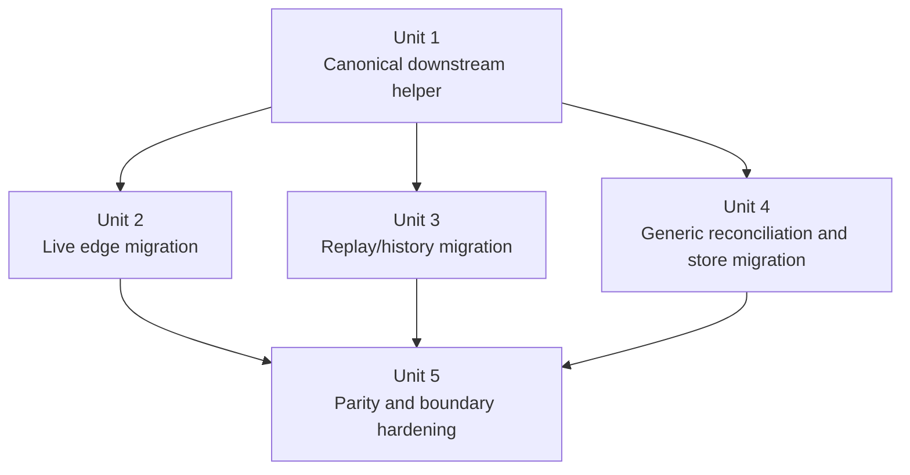

# refactor: migrate ACP consumers to canonical tool contract

## Overview

The ACP parser "god architecture" is complete, but the downstream ACP lifecycle is still split across several live-update, replay, reconciliation, and store seams that each recover or present tool metadata slightly differently. This plan turns that open-ended follow-on into a bounded five-unit migration: establish one Rust-authoritative downstream tool-contract policy, migrate the four known consumer surfaces that still drift from it, retire frontend title synthesis as part of the migration, and close with parity and boundary guardrails.

## Problem Frame

Acepe now has the right parser boundary: provider-owned parser edges, neutral shared capabilities, an authoritative capability registry, and canonical typed tool data in `ToolArguments` / `EditEntry`. The remaining gap is that several downstream ACP consumers still make local decisions about sparse edit merges, generic placeholder-title repair, and file-operation presentation.

The current drift is concentrated in a fixed seam list for this phase:

- `packages/desktop/src-tauri/src/acp/providers/cursor_session_update_enrichment.rs` enriches live Cursor updates with provider-local title/location recovery.
- `packages/desktop/src-tauri/src/acp/client/codex_native_events.rs` still synthesizes file-read/file-change titles directly from Codex-native events.
- `packages/desktop/src-tauri/src/session_converter/cursor.rs` overlays replayed Cursor tool updates into stored sessions, while `packages/desktop/src-tauri/src/session_converter/mod.rs` still applies updates with shallow replacement semantics.
- `packages/desktop/src-tauri/src/acp/task_reconciler.rs` and `packages/desktop/src/lib/acp/store/services/tool-call-manager.svelte.ts` both merge sparse tool updates and backfill generic titles, but only part of that logic is aligned today.
- Regression coverage exists for individual seams, but there is not yet a single bounded parity matrix proving that live updates, replay conversion, reconciliation, and store rendering all preserve the same canonical tool contract.

The result is that the parser layer is standardized, but the broader ACP lifecycle still makes future-provider work more expensive than it should be. We need a finite migration that ends with named seams, named tests, and named boundaries rather than an indefinite "keep standardizing" posture.

## Requirements Trace

- R1. Downstream ACP consumers outside the parser layer must consume canonical `ToolArguments` / `EditEntry` data instead of re-deriving provider-specific edit/read/delete behavior from raw payload shapes or provider identity.
- R2. Rename-aware edit entries (`ToolArguments::Edit` with `EditEntry.move_from`) must survive live updates, replay/history conversion, reconciliation, and frontend store rendering without collapsing back to plain `Edit <destination>`.
- R3. Generic placeholder titles such as `Read File`, `Edit File`, `Delete File`, and equivalent placeholder history titles must only be backfilled from the canonical contract; explicit provider-authored titles must remain authoritative.
- R4. Cursor live updates, Cursor replay overlays, Codex native file events, and generic tool reconciliation/store flows must preserve current user-visible parity while moving to the shared downstream contract.
- R5. The migration must end with bounded regression coverage and boundary guardrails so future provider additions can rely on the canonical contract without reopening generic-consumer seams.
- R6. This follow-on phase must stay scoped to ACP tool/event consumers; it must not expand into a general frontend provider-agnostic rewrite.

## Scope Boundaries

- No parser capability or provider-registry redesign beyond small helper hooks needed by downstream consumers.
- No semantic redesign of `ToolKind`, `ToolArguments`, or the decision to represent mixed rename patches as `Edit + move_from`.
- No UI component redesign or broader agent-agnostic frontend migration outside ACP tool/event consumption.
- No ACP runtime transport or provider-launch changes.
- No speculative cleanup of every provider-specific backend module; provider-owned enrichers and translators may remain as edges so long as generic consumers stop owning provider quirks.
- This phase is limited to the four named surfaces in the Problem Frame: Cursor live enrichment, Codex native file events, Cursor replay/session conversion, and generic reconciliation/store consumers.
- Newly discovered consumers only enter this phase if they break the named parity matrix or boundary guard; otherwise they are logged for a new follow-on plan.

## Placeholder-Title Contract

This phase treats the following titles as the only rewriteable placeholders after trim-normalization:

| Rewriteable placeholder | Intended canonical rewrite |
| --- | --- |
| `Read File` | `Read <path>` when canonical read arguments provide a path |
| `Edit File` | `Edit <path>` or `Rename <from> -> <to>` when canonical edit arguments provide the needed data |
| `Delete File` | `Delete <path>` when canonical delete arguments provide a path |
| `View Image` | provider/generic image title only when canonical arguments provide a path and there is no richer explicit title |
| `Terminal` | backend-owned command-derived title only when the canonical execute arguments provide a clear command |
| `Apply Patch` | history/replay-only rewrite to canonical edit/rename presentation when canonical edit arguments make the operation explicit |

Counterexamples that must remain authoritative and must **not** be rewritten:

- `Read README.md`
- `Edit /tmp/example.rs`
- `Rename src/old.rs -> src/new.rs`
- `Apply patch to README`

## Context & Research

### Relevant Code and Patterns

- `packages/desktop/src-tauri/src/acp/session_update/tool_calls.rs` is the canonical typed-tool builder and remains the right ownership seam for canonical tool semantics.
- `packages/desktop/src-tauri/src/acp/providers/cursor_session_update_enrichment.rs` already demonstrates the downstream need: it enriches sparse live updates from persisted provider input and now includes rename-aware title synthesis.
- `packages/desktop/src-tauri/src/session_converter/cursor.rs` and `packages/desktop/src-tauri/src/session_converter/mod.rs` are the main replay/history paths where sparse tool updates can still be merged too shallowly.
- `packages/desktop/src-tauri/src/acp/client/codex_native_events.rs` is the clearest native-event translator still formatting file-operation titles directly.
- `packages/desktop/src-tauri/src/acp/task_reconciler.rs` and `packages/desktop/src/lib/acp/store/services/tool-call-manager.svelte.ts` are the generic merge/reconciliation seams that should stay provider-agnostic while preserving canonical edit metadata.
- `packages/desktop/src/lib/acp/store/__tests__/tool-call-event-flow.test.ts` and `packages/desktop/src/lib/acp/store/services/__tests__/tool-call-manager.test.ts` are the right frontend verification seams for generic title and sparse-merge behavior.

### Institutional Learnings

- `docs/plans/2026-04-07-004-refactor-composable-acp-parser-architecture-plan.md` established the architectural rule that shared behavior belongs under neutral ownership and provider quirks belong at the edges.
- `docs/plans/2026-04-07-001-refactor-provider-agnostic-frontend-plan.md` reinforces the adjacent rule that downstream consumers should read durable contracts rather than branching on provider-specific behavior.

### External References

- None. Local code and the current ACP architecture work provide enough signal to plan this migration responsibly.

## Key Technical Decisions

| Decision | Rationale |
| --- | --- |
| Create a new follow-on migration plan instead of reopening the parser roadmap | The parser plan is complete; this is a bounded downstream phase with different seams and exit criteria |
| Bound the migration to five implementation units covering helper foundation, live edges, replay/history, generic consumers, and final parity/boundary hardening | The user asked to make the next phase non-open-ended, so the plan must name a finite checklist and exit gate |
| Preserve `ToolArguments::Edit` + `EditEntry.move_from` as the canonical representation for mixed rename edits | The parser layer already made this contract decision; downstream work should consume it instead of reinterpreting it |
| Keep the seam inventory fixed to the four surfaces named in the Problem Frame | This makes the phase objectively bounded and prevents replay/history cleanup from turning back into an open-ended sweep |
| Allow provider-owned enrichers/translators to remain at the edges, but move shared title/location/merge policy into a Rust-authoritative downstream helper | The architectural target is agent-agnostic generic consumers, not erasure of all provider-owned modules |
| Treat explicit provider titles as authoritative and only synthesize replacements for generic placeholders | This preserves current UX while stopping generic consumers from inventing provider-shaped display behavior |
| Rust is the authority for downstream tool presentation policy, and this phase removes frontend title synthesis once backend/replay paths are migrated | This prevents the frontend store from remaining a second source of truth after the migration completes |
| Keep `session_converter::merge_tool_call_update` out of scope for this phase and implement Cursor replay migration locally in `session_converter/cursor.rs` | That keeps Copilot/OpenCode consumers out of this bounded plan and avoids silently broadening replay scope through a shared seam |
| Finish with parity and boundary tests rather than more "cleanup later" notes | The migration should end with objective proof that the named seams are complete and future-provider-safe |

## Open Questions

### Resolved During Planning

- Should this work stay folded into the parser architecture plan? **No.** The parser roadmap is complete; this is a new bounded downstream migration.
- Should the plan attempt a broader provider-agnostic frontend rewrite? **No.** This plan stays scoped to ACP tool/event consumers and their contract boundaries.
- Should mixed rename edits be coerced into `Move` everywhere downstream? **No.** Consumers should adopt the canonical `Edit + move_from` contract that already exists.
- Should provider-owned enrichers such as `cursor_session_update_enrichment.rs` disappear entirely? **No.** Provider-owned edges may remain, but they should delegate shared downstream policy instead of being the only place that knows it.
- Where is the authoritative downstream presentation policy? **Rust.** Backend/live/replay paths share one Rust helper, and Unit 4 removes frontend title synthesis so the store no longer owns placeholder/title policy.
- How do we keep Cursor replay bounded when the current merge helper is shared more widely? **Do not modify the shared merge helper in this phase.** Unit 3 moves Cursor replay/session conversion onto a local path in `session_converter/cursor.rs` so Copilot/OpenCode remain out of scope.

### Deferred to Implementation

- The exact module/type names for the shared downstream helper layer, as long as ownership stays neutral and the helper remains reusable from both live and replay paths.

## High-Level Technical Design

> *This illustrates the intended approach and is directional guidance for review, not implementation specification. The implementing agent should treat it as context, not code to reproduce.*

```text
provider live/native edges     replay/history overlays
        |                              |
        v                              v
  canonical downstream helper: title / location / sparse-edit merge policy
                               |
                               v
                   generic reconciliation + store update paths
                               |
                               v
                       UI renders canonical tool contract

Rules:
- provider edges may recover provider-specific raw shapes
- Rust owns the canonical downstream title/location/merge policy
- generic consumers may only read canonical contract data
- the frontend store stops synthesizing titles once the named backend/replay surfaces materialize them canonically
- sparse updates must preserve richer edit metadata, including move_from
```

## Implementation Units



- [x] **Unit 1: Introduce a canonical downstream tool-contract helper**

**Goal:** Define one Rust-authoritative helper layer for downstream title/location synthesis and sparse edit-merge behavior so live, replay, and generic-consumer seams stop duplicating policy.

**Requirements:** R1, R2, R3, R5

**Dependencies:** None

**Files:**
- Create: `packages/desktop/src-tauri/src/acp/tool_call_presentation.rs`
- Modify: `packages/desktop/src-tauri/src/acp/mod.rs`
- Test: `packages/desktop/src-tauri/src/acp/tool_call_presentation.rs`
- Test: `packages/desktop/src-tauri/src/acp/session_update/tests.rs`

**Approach:**
- Extract pure helper functions for:
  - placeholder-title detection
  - canonical title synthesis from `ToolArguments`
  - location/path synthesis from canonical arguments
  - sparse `EditEntry` merge that preserves `file_path`, `move_from`, `old_string`, `new_string`, and `content`
- Keep the helper contract canonical-data-only: it should not inspect provider ids or raw provider payload shapes.
- Make explicit titles authoritative and limit synthesis to generic placeholders and genuinely absent values.
- Treat this helper as the single backend/replay authority and capture the exact placeholder-title taxonomy from the section above in characterization tests before migrating callers.

**Execution note:** Characterization-first. Start by pinning current read/edit/delete placeholder-repair behavior and the new rename-aware behavior before moving any shared logic.

**Patterns to follow:**
- `packages/desktop/src-tauri/src/acp/providers/cursor_session_update_enrichment.rs`
- `packages/desktop/src-tauri/src/acp/task_reconciler.rs`
- `packages/desktop/src/lib/acp/store/services/tool-call-manager.svelte.ts`

**Test scenarios:**
- Happy path — a canonical read argument with `file_path` synthesizes `Read <path>` only when the existing title is missing or generic.
- Happy path — an edit argument with `file_path` and `move_from` synthesizes `Rename <from> -> <to>`.
- Edge case — an explicit provider-authored title such as `Read README.md` survives helper evaluation unchanged.
- Edge case — sparse edit updates preserve previously known `move_from`, `old_string`, and `new_string` values.
- Error path — canonical arguments with no usable path/title hints return `None` instead of inventing misleading presentation data.

**Verification:**
- A single neutral helper exists for the downstream policy currently spread across provider enrichers, replay overlays, and generic store merges.
- The helper API reads only canonical data and can be reused without importing provider-owned modules.

- [x] **Unit 2: Migrate live update and native-event edges onto the helper**

**Goal:** Make provider-owned live enrichment and native-event translation edges delegate shared downstream presentation policy instead of formatting file-operation titles inline.

**Requirements:** R1, R2, R3, R4

**Dependencies:** Unit 1

**Files:**
- Modify: `packages/desktop/src-tauri/src/acp/providers/cursor_session_update_enrichment.rs`
- Modify: `packages/desktop/src-tauri/src/acp/client_updates/mod.rs`
- Modify: `packages/desktop/src-tauri/src/acp/client/codex_native_events.rs`
- Test: `packages/desktop/src-tauri/src/acp/providers/cursor_session_update_enrichment.rs`
- Test: `packages/desktop/src-tauri/src/acp/client_updates/mod.rs`
- Test: `packages/desktop/src-tauri/src/acp/client/codex_native_events.rs`

**Approach:**
- Keep Cursor-specific persisted-input recovery and Codex-native event parsing at the provider edge.
- Replace direct string formatting and ad hoc placeholder replacement with calls into the shared downstream helper.
- Ensure live edges continue to populate titles, arguments, and locations before dispatch so the frontend keeps receiving rich, canonical updates.
- Expand tests to cover both classic read/edit cases and rename-aware edit updates.

**Execution note:** Test-first. Add or update failing live-edge tests before migrating each provider edge to the shared helper.

**Patterns to follow:**
- `packages/desktop/src-tauri/src/acp/providers/cursor_session_update_enrichment.rs`
- `packages/desktop/src-tauri/src/acp/client_updates/mod.rs`

**Test scenarios:**
- Happy path — a generic Cursor `Edit File` update with recovered edit arguments becomes `Edit <path>`.
- Happy path — a generic Cursor edit update with `move_from` becomes `Rename <from> -> <to>`.
- Happy path — a Codex native `fileRead` / `fileChange` event uses the shared helper to produce canonical read/edit titles and arguments.
- Edge case — explicit provider titles continue to win over synthesized replacements.
- Error path — a live update with incomplete arguments keeps its original generic title rather than synthesizing an incorrect one.
- Integration — live updates dispatched through `client_updates` reach the UI event pipeline with canonical title, location, and argument data already aligned.

**Verification:**
- No live-edge file formats `Read {path}` / `Edit {path}` / `Rename {from} -> {to}` inline when the shared helper can do it.
- Cursor live updates and Codex native file events produce the same canonical presentation rules for equivalent canonical arguments.

- [x] **Unit 3: Migrate replay and history conversion onto canonical merge/presentation rules**

**Goal:** Make the named replay/session-conversion surface preserve the same canonical contract as live updates instead of applying shallow or provider-local update semantics.

**Requirements:** R1, R2, R3, R4, R5

**Dependencies:** Unit 1

**Files:**
- Modify: `packages/desktop/src-tauri/src/session_converter/cursor.rs`
- Test: `packages/desktop/src-tauri/src/session_converter/cursor.rs`

**Approach:**
- Move Cursor replay/session conversion onto a local overlay/merge path in `session_converter/cursor.rs` that uses the shared helper without changing `session_converter::merge_tool_call_update`.
- Preserve explicit historical titles but allow generic placeholders such as `Apply Patch` or `Edit File` to be upgraded when canonical arguments make the intended action obvious.
- Keep this unit bounded to Cursor replay/session conversion. If other replay/history surfaces are discovered to need the same fix and are not required by Unit 5's named matrix, log them for a follow-on plan instead of broadening this unit.

**Execution note:** Characterization-first for replay surfaces. Capture current history/overlay behavior in focused tests before replacing the merge path.

**Patterns to follow:**
- `packages/desktop/src-tauri/src/session_converter/mod.rs`
- `packages/desktop/src-tauri/src/session_converter/cursor.rs`
- `packages/desktop/src-tauri/src/copilot_history/mod.rs`

**Test scenarios:**
- Happy path — a replayed Cursor tool-call update overlays richer edit arguments onto a stored placeholder edit and produces the canonical title.
- Happy path — a replayed update carrying `move_from` preserves rename semantics in the reconstructed session.
- Edge case — sparse replay updates do not erase previously known edit metadata.
- Edge case — explicit historical titles remain unchanged when replay data is incomplete.
- Error path — malformed or unrelated replay log entries are ignored without corrupting the reconstructed session.
- Integration — Cursor replay/session conversion converges on the same canonical merged tool-call state as the live Cursor path for equivalent edit metadata.

**Verification:**
- Replay/history conversion uses the same sparse-merge and placeholder-title policy as live updates.
- The named Cursor replay/session-conversion surface no longer needs separate one-off behavior to preserve canonical edit metadata, and the shared `session_converter::merge_tool_call_update` seam remains unchanged in this phase.

- [x] **Unit 4: Migrate generic reconciliation and store consumers onto the canonical contract**

**Goal:** Ensure the generic ACP reconciliation and frontend store layers remain provider-agnostic while preserving rich canonical tool metadata across sparse duplicates and progressive updates, then remove frontend title synthesis as the migration end-state.

**Requirements:** R1, R2, R3, R4, R6

**Dependencies:** Unit 1

**Files:**
- Modify: `packages/desktop/src-tauri/src/acp/task_reconciler.rs`
- Modify: `packages/desktop/src/lib/acp/store/services/tool-call-manager.svelte.ts`
- Modify: `packages/desktop/src/lib/acp/store/__tests__/tool-call-event-flow.test.ts`
- Modify: `packages/desktop/src/lib/acp/store/services/__tests__/tool-call-manager.test.ts`
- Test: `packages/desktop/src-tauri/src/acp/task_reconciler.rs`
- Test: `packages/desktop/src/lib/acp/store/__tests__/tool-call-event-flow.test.ts`
- Test: `packages/desktop/src/lib/acp/store/services/__tests__/tool-call-manager.test.ts`

**Approach:**
 - Align generic duplicate/reconciliation merges with the shared sparse-edit policy so they preserve `move_from` and other richer fields.
 - Migrate the frontend store away from title synthesis: after the named backend/replay surfaces materialize canonical titles, the store should preserve them and only merge canonical metadata.
 - Avoid provider checks entirely in this unit; the generic consumer should work for any provider that delivers the canonical contract.
 - Use this unit to remove residual generic-consumer assumptions that an edit always means `Edit <file_path>` and to delete the now-temporary frontend placeholder-title repair logic.

**Execution note:** Test-first. Start from failing generic merge/store tests that prove the desired provider-agnostic behavior without referencing a specific provider module.

**Patterns to follow:**
- `packages/desktop/src-tauri/src/acp/task_reconciler.rs`
- `packages/desktop/src/lib/acp/store/services/tool-call-manager.svelte.ts`

**Test scenarios:**
 - Happy path — a generic store update carrying an already-materialized backend title preserves `Read <path>` / `Edit <path>` / `Rename <from> -> <to>` through entry state.
 - Edge case — a repeated sparse duplicate preserves the richer edit entry already present in the reconciler/store.
 - Edge case — explicit frontend-visible titles remain unchanged across sparse duplicate merges.
 - Error path — a generic consumer presented with incomplete canonical arguments preserves the last canonical title/location instead of fabricating new presentation data.
 - Integration — end-to-end store event flow retains canonical edit metadata from backend update through frontend entry state.

**Verification:**
- Generic consumers no longer assume that edit presentation can be derived from `file_path` alone.
- The frontend store stays provider-agnostic while rendering rename-aware canonical data correctly **without** owning title-synthesis policy.

- [x] **Unit 5: Lock the migration with parity and boundary guardrails**

**Goal:** Finish the migration with a bounded regression matrix and architecture guardrails so this phase has a clear end-state.

**Requirements:** R4, R5, R6

**Dependencies:** Unit 2, Unit 3, Unit 4

**Files:**
- Create: `packages/desktop/src-tauri/src/acp/tests/downstream_canonical_contract.rs`
- Modify: `packages/desktop/src-tauri/src/acp/mod.rs`
- Modify: `packages/desktop/src/lib/acp/store/__tests__/tool-call-event-flow.test.ts`
- Test: `packages/desktop/src-tauri/src/acp/tests/downstream_canonical_contract.rs`
- Test: `packages/desktop/src/lib/acp/store/__tests__/tool-call-event-flow.test.ts`

**Approach:**
- Add one bounded downstream parity matrix covering the exact critical surfaces for this phase:

| Surface | Files | Must prove |
| --- | --- | --- |
| Cursor live update enrichment | `packages/desktop/src-tauri/src/acp/providers/cursor_session_update_enrichment.rs`, `packages/desktop/src-tauri/src/acp/client_updates/mod.rs` | generic read/edit placeholders become canonical read/edit/rename presentation from canonical arguments |
| Cursor replay/session overlay | `packages/desktop/src-tauri/src/session_converter/cursor.rs` | replay preserves sparse edit metadata and rename-aware presentation through a Cursor-local overlay path without modifying the shared replay merge seam |
| Codex native file events | `packages/desktop/src-tauri/src/acp/client/codex_native_events.rs` | native `fileRead` / `fileChange` events produce the same canonical downstream presentation rules as equivalent canonical arguments elsewhere |
| Generic reconciliation / store merge | `packages/desktop/src-tauri/src/acp/task_reconciler.rs`, `packages/desktop/src/lib/acp/store/services/tool-call-manager.svelte.ts` | sparse duplicates preserve canonical edit metadata and the frontend store renders already-materialized canonical titles without synthesizing new ones |

- Add a boundary-oriented check with two parts:
  1. the shared helper must read only canonical `ToolArguments` / `EditEntry` data and must not inspect provider ids or raw payload values
  2. the migrated edge/generic-consumer files below must not keep private title/location/merge formatting logic or import provider-owned internals where that logic should now be delegated

Exact guard targets:
  - `packages/desktop/src-tauri/src/acp/tool_call_presentation.rs`
  - `packages/desktop/src-tauri/src/acp/providers/cursor_session_update_enrichment.rs`
  - `packages/desktop/src-tauri/src/acp/client/codex_native_events.rs`
  - `packages/desktop/src-tauri/src/session_converter/mod.rs`
  - `packages/desktop/src-tauri/src/session_converter/cursor.rs`
  - `packages/desktop/src-tauri/src/acp/task_reconciler.rs`
  - `packages/desktop/src/lib/acp/store/services/tool-call-manager.svelte.ts`
- Use this unit to declare the migration complete: once the named matrix and guardrail are green, any further work is a new plan, not "Unit 6".

**Patterns to follow:**
- `packages/desktop/src-tauri/src/acp/parsers/tests/provider_composition_boundary.rs`
- `packages/desktop/src/lib/acp/store/__tests__/tool-call-event-flow.test.ts`

**Test scenarios:**
- Happy path — equivalent canonical read/edit/rename metadata produces equivalent downstream state across live, replay, native-translation, and generic-store surfaces.
- Edge case — sparse duplicate updates preserve richer edit metadata in every covered surface.
- Error path — malformed or incomplete inputs fail closed without creating incorrect titles or locations.
- Integration — a future provider-shaped tool update that already satisfies the canonical contract passes through the generic consumer matrix without requiring provider-specific branches.
- Integration — the boundary guard fails if a generic consumer file starts checking provider identity or importing a provider-owned module.

**Verification:**
- The migration ends with one named parity matrix and one named boundary guard rather than an open-ended cleanup list.
- A new provider that emits the canonical tool contract can reuse the covered downstream consumers without reopening this plan.

## System-Wide Impact

- **Interaction graph:** provider live/native edges, replay/history converters, generic reconciliation, and frontend store rendering now share one downstream contract policy instead of each carrying a private variant.
- **Authority boundary:** Rust owns the downstream title/location/merge policy; the end-state of this plan removes frontend title synthesis so the store is no longer a second source of truth.
- **Error propagation:** provider edges remain responsible for recovering provider-specific raw payloads; generic consumers must fail closed and preserve the last known good canonical data when updates are sparse or malformed.
- **State lifecycle risks:** sparse duplicate updates, replay overlays, and placeholder-title replacement are the main drift points; the shared helper and parity tests are the mitigation.
- **API surface parity:** if implementation adjusts exported canonical metadata, generated TS types must stay aligned with Rust definitions.
- **Integration coverage:** live Cursor updates, Cursor replay/session conversion, Codex native file events, and frontend event/store flows all need explicit contract coverage.
- **Unchanged invariants:** parser ownership, provider capability registry, and the existing `Edit + move_from` canonical semantics do not change in this plan.

## Risks & Dependencies

| Risk | Mitigation |
|------|------------|
| Shared downstream helper becomes a hidden second parser | Constrain it to canonical-data-only title/location/merge policy; raw payload recovery stays at provider edges |
| Replay/history paths have legacy titles that should not be rewritten | Restrict synthesis to generic placeholders and preserve explicit historical titles |
| Frontend title logic survives as a second source of truth | Make Rust authoritative, delete frontend title synthesis in Unit 4, and add parity tests proving the store renders already-materialized canonical titles unchanged |
| Scope expands into the broader provider-agnostic frontend epic | Keep file lists and verification anchored to ACP tool/event consumers only; anything broader becomes a new plan |

## Documentation / Operational Notes

- When this plan is executed, update the parser architecture follow-on narrative so the downstream migration is recorded as a separate completed phase rather than implied future work.
- If the shared downstream contract yields a durable architectural lesson, compound it into `docs/solutions/` after implementation.

## Sources & References

- Related plan: `docs/plans/2026-04-07-004-refactor-composable-acp-parser-architecture-plan.md`
- Related plan: `docs/plans/2026-04-07-001-refactor-provider-agnostic-frontend-plan.md`
- Related code: `packages/desktop/src-tauri/src/acp/providers/cursor_session_update_enrichment.rs`
- Related code: `packages/desktop/src-tauri/src/session_converter/cursor.rs`
- Related code: `packages/desktop/src-tauri/src/acp/client/codex_native_events.rs`
- Related code: `packages/desktop/src/lib/acp/store/services/tool-call-manager.svelte.ts`
