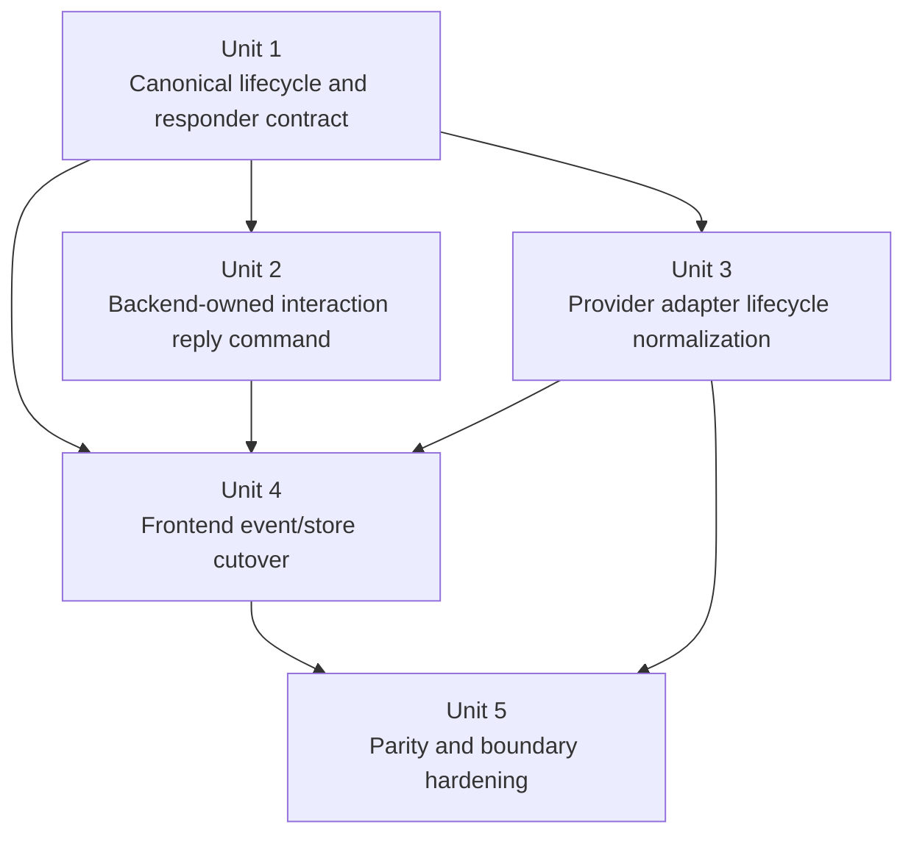
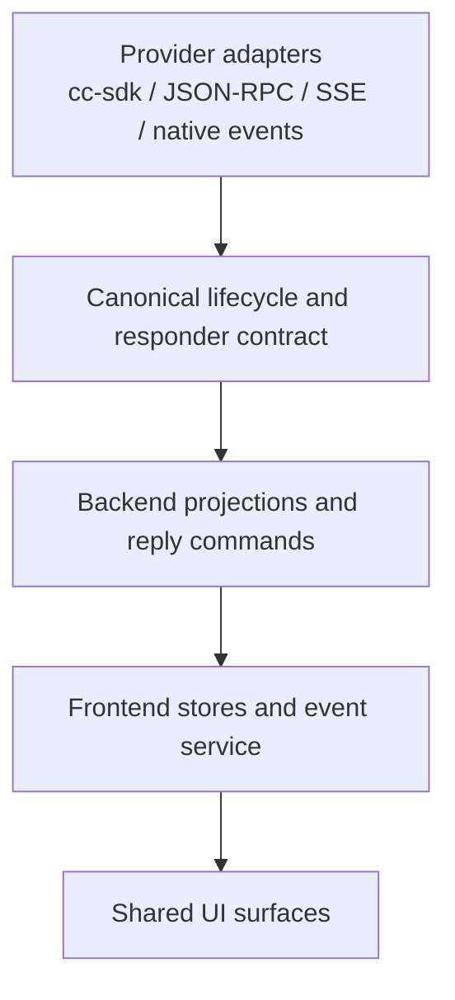

# refactor: canonicalize provider lifecycle and reply routing

## Overview

Acepe has already made downstream tool presentation much more canonical, but the runtime still leaks provider transport semantics in one critical place: tool lifecycle, approval handling, and interaction reply routing. This plan defines the next bounded migration slice at that lifecycle boundary: move terminal truth, approval state, stable reply identity, and reply-routing semantics behind canonical backend contracts so providers translate raw events, the frontend consumes generic runtime facts, and provider-specific transport decisions stop leaking into store logic and UI behavior. Restore and hydration seams are included only where they are required to keep live, replayed, and restored interactions on the same canonical contract.

## Problem Frame

The recent ACP work improved the right layers:

- downstream tool presentation now has a Rust-owned canonical contract
- the agent panel renders generic read/execute entries correctly
- provider-specific parser ownership is stronger than before

But the runtime is still not cleanly agent-agnostic at the lifecycle boundary. The remaining smells are architectural, not cosmetic:

| Remaining seam | Why it is still non-agnostic |
| --- | --- |
| `packages/desktop/src-tauri/src/acp/client/cc_sdk_client.rs` | Claude bridge logic still owns meaning about missing permission callbacks, synthetic completion, and terminal-state repair |
| `packages/desktop/src-tauri/src/acp/parsers/cc_sdk_bridge.rs` | The adapter still fabricates lifecycle completion from transport resumption rather than emitting a richer canonical terminal contract |
| `packages/desktop/src/lib/acp/logic/interaction-reply.ts` | Frontend reply logic still chooses between JSON-RPC and HTTP by inspecting transport-shaped fields such as `jsonRpcRequestId` |
| `packages/desktop/src/lib/acp/store/session-event-service.svelte.ts` | Frontend replay suppression and duplicate heuristics still own semantic policy for some runtime flows |
| `packages/desktop/src/lib/acp/types/permission.ts` and `packages/desktop/src/lib/acp/types/question.ts` | Interaction contracts still expose reply transport details as primary frontend routing inputs |

The concrete user-visible consequence is already proven: Claude could surface command cards that looked completed even when the runtime never confirmed execution output. The recent fix corrected the misleading success state, but it remains a bridge-local repair. The cleaner architecture is to make the runtime capable of expressing lifecycle phase, approval state, stable canonical reply identity, terminal reason, and reply handler canonically so the same logic works across providers and across live, replayed, and restored interaction flows without frontend transport inference.

This plan is intentionally narrower than the umbrella canonical-journal architecture plan. It does not attempt to finish every runtime redesign in one pass. It targets the next highest-value seam where provider transport still leaks into runtime truth.

## Requirements Trace

- R1. Tool lifecycle must be represented by canonical runtime semantics rather than provider-specific bridge heuristics.
- R2. Approval and interaction reply routing must be backend-owned and transport-agnostic from the frontend’s perspective.
- R3. Providers must preserve current user-visible behavior parity for each lifecycle-bearing interaction capability they support while emitting the same canonical lifecycle/reply contract.
- R4. Live, replayed, and restored lifecycle updates must follow the same canonical terminal and reply-routing rules.
- R5. Frontend stores and UI surfaces must stop branching on reply transport details such as JSON-RPC vs HTTP when handling permissions, questions, and plan approvals.
- R6. The migration must end with provider parity and boundary tests across the supported capability matrix so provider-name or transport-shape ownership cannot creep back into the canonical path.

## Scope Boundaries

- No full replacement of the umbrella canonical journal / reducer architecture in this slice.
- No redesign of agent install, auth, history listing, or provider provisioning flows.
- No broad transcript or panel visual redesign.
- No removal of provider modules or adapters; provider-specific parsing and transport adaptation remain valid at the edge.
- No flag-day replacement of every existing session update type; additive compatibility is allowed only as a transitional shim where canonical fields are authoritative for migrated consumers, legacy transport-shaped fields are read-only compatibility inputs, and the plan defines explicit retirement gates before the slice is considered complete.
- No expansion into unrelated provider-agnostic frontend cleanup that is not directly tied to lifecycle, approval, or reply-routing ownership.

## Planning Inputs

This plan builds on the current architecture source material rather than replacing it:

- `docs/plans/2026-04-07-005-refactor-canonical-agent-runtime-journal-plan.md`
- `docs/plans/2026-04-07-001-refactor-provider-agnostic-frontend-plan.md`
- `docs/plans/2026-04-08-001-refactor-migrate-acp-consumers-canonical-contract-plan.md`
- `docs/brainstorms/2026-03-30-github-copilot-cli-agent-requirements.md`
- `docs/solutions/logic-errors/kanban-live-session-panel-sync-2026-04-02.md`
- `docs/solutions/logic-errors/operation-interaction-association-2026-04-07.md`

## Context & Research

### Relevant Code and Patterns

- `packages/desktop/src-tauri/src/acp/provider.rs` and `packages/desktop/src-tauri/src/acp/registry.rs` already define the provider-edge ownership boundary and are the right place to preserve adapter specialization.
- `packages/desktop/src-tauri/src/acp/tool_call_presentation.rs` demonstrates the preferred pattern: Rust owns canonical tool semantics, frontend consumers fail closed instead of synthesizing policy.
- `packages/desktop/src-tauri/src/acp/task_reconciler.rs` and `packages/desktop/src/lib/acp/store/operation-store.svelte.ts` show the right ownership split between canonical backend assembly and projection-oriented frontend consumption.
- `packages/desktop/src/lib/acp/registry/tool-kind-ui-registry.ts` is the right UI pattern to preserve: render by canonical kind, not provider-local names.
- `packages/desktop/src/lib/acp/store/session-event-service.svelte.ts` is the main frontend seam still carrying replay and transport-shaped semantics that should move behind canonical runtime facts.
- `packages/desktop/src/lib/acp/logic/interaction-reply.ts` and `packages/desktop/src/lib/acp/logic/inbound-request-handler.ts` are the clearest current examples of frontend reply transport ownership.
- `packages/desktop/src-tauri/src/acp/client/cc_sdk_client.rs`, `packages/desktop/src-tauri/src/acp/parsers/cc_sdk_bridge.rs`, `packages/desktop/src-tauri/src/acp/cursor_extensions.rs`, `packages/desktop/src-tauri/src/acp/opencode/sse/conversion.rs`, and `packages/desktop/src-tauri/src/acp/client/codex_native_events.rs` are the provider-edge files most likely to participate in the contract cutover.

### Institutional Learnings

- `docs/solutions/logic-errors/operation-interaction-association-2026-04-07.md` established the rule that transport IDs are adapter metadata, not domain identity. Canonical ownership belongs in neutral runtime layers.
- `docs/solutions/logic-errors/kanban-live-session-panel-sync-2026-04-02.md` reinforced the “one runtime owner, many projections” rule that should also govern lifecycle and interaction state.
- `docs/brainstorms/2026-03-30-github-copilot-cli-agent-requirements.md` established ACP-first behavior as the durable contract for provider integration instead of undocumented storage scraping.

### External References

- None. The repo already contains strong local patterns and current architecture context for this migration.

## Key Technical Decisions

| Decision | Rationale |
| --- | --- |
| Create a bounded follow-on plan instead of reopening the umbrella runtime plan | The canonical journal plan remains the architecture umbrella, but execution needs a narrower slice with named seams and exit criteria |
| Introduce a canonical lifecycle/reply contract instead of adding more bridge-local repairs | Missing-callback, synthetic-completion, and reply-routing bugs are all symptoms of the same ownership gap |
| Keep provider adapters responsible for translation, not product semantics | Provider-specific transport details remain valid at the edge, but lifecycle meaning must be expressed canonically before frontend dispatch |
| Include permissions, questions, and plan approvals in the foundational contract | Plan approval is the most likely exception path because it is still structurally transport-shaped today; the canonical responder model is not real if plan approval remains outside it |
| Make canonical reply identity authoritative across live, replay, and restore | Backend-owned routing only works if one stable interaction/reply identity survives projection, persistence, hydration, and restore instead of falling back to transport-local keys in each layer |
| Remove frontend transport inference from interaction replies | The frontend should answer canonical interactions, not decide whether the backend must speak JSON-RPC or HTTP |
| Distinguish “confirmed failure” from “ended without confirmed execution” in the runtime contract | The current `completed` vs `failed` split is too blunt for approval/callback gaps, and the repo already shows drift between bridge-local synthetic `Completed` and backend-rewritten `Failed`; Unit 1 must choose one authoritative terminal representation and use it consistently across projections, exports, restore, and frontend types |
| Roll out additively with canonical authority and explicit retirement gates | The migration should harden the architecture without creating a flag-day break for existing providers or stored sessions, but compatibility cannot leave a permanent second semantic owner in transport-shaped fields |

## Open Questions

### Resolved During Planning

- Should this be a brand-new broad architecture rewrite? **No.** It is the next bounded execution slice under the umbrella canonical-runtime effort.
- Should frontend reply routing continue to branch on `jsonRpcRequestId` presence? **No.** Reply routing belongs behind a backend-owned canonical responder contract.
- Should Claude’s missing-callback behavior stay as a cc-sdk-specific patch forever? **No.** Claude revealed the seam, but the fix should become a generic runtime contract.
- Should this plan absorb all remaining provider-agnostic frontend work? **No.** It stays focused on lifecycle, approval, and reply-routing ownership.
- Should provider adapters disappear? **No.** Adapters remain, but they should emit canonical runtime facts instead of leaking transport meaning upward.
- Should plan approval stay as a transport-shaped exception to the canonical responder model? **No.** Plan approvals must share the same canonical reply identity and backend-owned routing contract as permissions and questions.
- Can additive compatibility leave legacy transport fields as a second semantic owner? **No.** Compatibility shims are transitional only and must have explicit retirement gates.

### Deferred to Implementation

- Unit 1 must lock one authoritative terminal representation at the start of execution and propagate it consistently; the exact shape can be a new status enum variant, a nested terminal-reason object, or a documented combined form, but downstream units must not encode mixed meanings.
- Older stored sessions may continue to render through compatibility data during rollout, but live and restored reply actions must converge on canonical reply identity via backend projections or compatibility adapters; the frontend must not recover transport routing directly.

## High-Level Technical Design

> *This illustrates the intended approach and is directional guidance for review, not implementation specification. The implementing agent should treat it as context, not code to reproduce.*

```text
provider transport events
Claude cc-sdk / ACP JSON-RPC / SSE / native events
                 |
                 v
      provider adapters and bridges
     (transport-specific translation only)
                 |
                 v
    canonical lifecycle + reply contract
    - lifecycle phase
    - approval state
    - stable canonical reply identity
    - terminal semantics
    - responder metadata
                 |
                 v
      backend projections / commands
                 |
        +--------+---------+
        |                  |
        v                  v
frontend event/store   interaction reply API
consumes facts only    answers canonical interaction IDs
        |                  |
        +--------+---------+
                 v
          shared UI surfaces
```

The important ownership rule is:

- **providers translate**
- **canonical runtime decides meaning**
- **frontend renders and submits canonical commands**

## Alternative Approaches Considered

| Approach | Why not chosen |
| --- | --- |
| Keep patching Claude-specific bridge behavior only | Fixes the symptom but preserves the architectural seam that will reappear for other providers |
| Push reply routing into more frontend helper branches | Moves farther away from agent-agnostic architecture and duplicates provider transport knowledge in UI/store code |
| Wait and solve this only as part of the full journal cutover | Too broad for the immediate problem; this seam is already causing user-visible bugs and can be bounded cleanly now |

## Implementation Units



- [ ] **Unit 1: Define the canonical lifecycle and responder contract**

**Goal:** Introduce the additive backend-owned contract that carries lifecycle phase, approval state, stable canonical reply identity, terminal meaning, and interaction responder metadata for permissions, questions, and plan approvals in a transport-agnostic way.

**Requirements:** R1, R2, R4, R5

**Dependencies:** None

**Files:**
- Modify: `packages/desktop/src-tauri/src/acp/session_update/types/interaction.rs`
- Modify: `packages/desktop/src-tauri/src/acp/session_update/types/tool_calls.rs`
- Modify: `packages/desktop/src-tauri/src/acp/projections/mod.rs`
- Modify: `packages/desktop/src-tauri/src/session_jsonl/export_types.rs`
- Modify: `packages/desktop/src/lib/services/acp-types.ts`
- Modify: `packages/desktop/src/lib/services/converted-session-types.ts`
- Modify: `packages/desktop/src/lib/acp/types/permission.ts`
- Modify: `packages/desktop/src/lib/acp/types/question.ts`
- Test: `packages/desktop/src-tauri/src/acp/projections/mod.rs`
- Test: `packages/desktop/src/lib/acp/logic/__tests__/interaction-reply.test.ts`

**Approach:**
- Add a typed canonical contract that can express:
  - lifecycle phase/state for tools and interactions
  - approval state plus stable canonical reply identity for permissions, questions, and plan approvals
  - responder metadata needed to route replies without frontend transport inference
  - terminal semantics for non-success endings that are not equivalent to a confirmed runtime failure
- Start Unit 1 by choosing one authoritative terminal representation and using it across projections, exports, restore, and frontend type surfaces.
- Keep the rollout additive so existing fields can coexist temporarily while consumers switch, but treat canonical fields as authoritative for migrated consumers from the first cut.
- Treat `json_rpc_request_id` and similar transport-route details as adapter/backend metadata, not as the primary frontend contract.
- Make backend projections the first consumer so the new contract is present in one canonical place before frontend cutover starts.

**Patterns to follow:**
- `packages/desktop/src-tauri/src/acp/tool_call_presentation.rs`
- `packages/desktop/src-tauri/src/acp/projections/mod.rs`
- `packages/desktop/src/lib/acp/registry/tool-kind-ui-registry.ts`

**Test scenarios:**
- Happy path — a permission request emitted from a JSON-RPC-backed provider includes canonical responder metadata without requiring frontend transport inspection.
- Happy path — a question request emitted from a non-JSON-RPC provider uses the same canonical responder shape as the JSON-RPC path.
- Happy path — a plan approval interaction carries the same canonical reply identity and responder contract as permission and question flows.
- Edge case — older or minimal provider payloads with no rich responder metadata degrade to additive compatibility fields without breaking serialization.
- Edge case — a tool update can represent a terminal non-success outcome that is distinct from an executed runtime failure.
- Error path — generated TypeScript types stay aligned with the Rust exports after the new contract lands.
- Integration — backend projections persist and rehydrate the new lifecycle/reply metadata, including stable canonical reply identity, without changing interaction or tool identity.

**Verification:**
- Frontend-facing types can consume lifecycle and reply metadata generically for permissions, questions, and plan approvals without needing provider-specific transport assumptions.

- [ ] **Unit 2: Move interaction replies behind one backend-owned command path**

**Goal:** Replace frontend JSON-RPC vs HTTP reply branching with one canonical reply command path keyed by canonical interaction data.

**Requirements:** R2, R5

**Dependencies:** Unit 1

**Files:**
- Modify: `packages/desktop/src-tauri/src/acp/commands/inbound_commands.rs`
- Modify: `packages/desktop/src-tauri/src/acp/commands/mod.rs`
- Modify: `packages/desktop/src-tauri/src/acp/commands/tests.rs`
- Modify: `packages/desktop/src/lib/acp/store/api.ts`
- Modify: `packages/desktop/src/lib/acp/logic/interaction-reply.ts`
- Modify: `packages/desktop/src/lib/acp/logic/inbound-request-handler.ts`
- Modify: `packages/desktop/src/lib/acp/store/interaction-store.svelte.ts`
- Modify: `packages/desktop/src/lib/acp/types/interaction.ts`
- Modify: `packages/desktop/src/lib/utils/tauri-client/acp.ts`
- Modify: `packages/desktop/src/lib/utils/tauri-client/commands.ts`
- Modify: `packages/desktop/src/lib/acp/components/tool-calls/tool-call-create-plan.svelte`
- Modify: `packages/desktop/src/lib/acp/components/queue/queue-item.svelte`
- Test: `packages/desktop/src/lib/acp/logic/__tests__/interaction-reply.test.ts`
- Test: `packages/desktop/src/lib/acp/logic/__tests__/inbound-request-handler.test.ts`
- Test: `packages/desktop/src/lib/acp/store/__tests__/permission-store.vitest.ts`
- Test: `packages/desktop/src/lib/acp/store/__tests__/question-store.vitest.ts`
- Test: `packages/desktop/src/lib/acp/store/__tests__/interaction-store-plan-approval-ownership.contract.test.ts`

**Approach:**
- Introduce or extend a single Tauri/backend command that accepts canonical interaction reply input and performs the transport-specific routing internally.
- Keep `InboundRequestHandler` focused on ingesting legacy/provider-specific inbound events rather than serving as a UI-facing reply router.
- Update frontend reply helpers, interaction store projections, and plan-approval callers to submit canonical replies through `store/api.ts` only.
- Preserve current permission/question/plan-approval behavior while deleting frontend branching on `jsonRpcRequestId`; keep any temporary numeric plan-approval fallback only until Unit 4 guarantees canonical interaction hydration for both live and restored sessions, then remove it explicitly as part of the retirement gate.

**Execution note:** Start with a failing frontend behavior test that proves replies no longer branch on transport-shaped fields.

**Patterns to follow:**
- `packages/desktop/src-tauri/src/acp/commands/inbound_commands.rs`
- `packages/desktop/src/lib/acp/store/api.ts`
- `packages/desktop/src/lib/acp/logic/interaction-reply.ts`

**Test scenarios:**
- Happy path — replying to a JSON-RPC-backed permission request succeeds through the canonical command without direct `respondToPermission` usage in frontend reply logic.
- Happy path — replying to an HTTP-backed question request succeeds through the same canonical command path.
- Happy path — plan approval responses use the same backend-owned routing shape as permission/question replies.
- Edge case — cancelling a question produces the expected backend response without transport-specific frontend branching.
- Error path — unknown or stale interaction responder metadata returns a clear backend error instead of silently dropping the reply.
- Integration — permission, question, and plan-approval stores/UI callers continue to complete the interaction lifecycle correctly after the reply-path swap.

**Verification:**
- Frontend reply code submits canonical interaction replies only; transport selection happens behind backend commands.

- [ ] **Unit 3: Normalize provider adapter lifecycle emission**

**Goal:** Make provider bridges and adapters emit canonical lifecycle and responder semantics instead of provider-local repairs or transport-shaped terminal guesses.

**Requirements:** R1, R2, R3, R4

**Dependencies:** Unit 1

**Files:**
- Modify: `packages/desktop/src-tauri/src/acp/client/cc_sdk_client.rs`
- Modify: `packages/desktop/src-tauri/src/acp/parsers/cc_sdk_bridge.rs`
- Modify: `packages/desktop/src-tauri/src/acp/cursor_extensions.rs`
- Modify: `packages/desktop/src-tauri/src/acp/opencode/sse/conversion.rs`
- Modify: `packages/desktop/src-tauri/src/acp/client/codex_native_events.rs`
- Modify: `packages/desktop/src-tauri/src/acp/client_updates/mod.rs`
- Test: `packages/desktop/src-tauri/src/acp/client/cc_sdk_client.rs`
- Test: `packages/desktop/src-tauri/src/acp/client/tests.rs`
- Test: `packages/desktop/src-tauri/src/acp/parsers/tests/provider_conformance.rs`
- Test: `packages/desktop/src-tauri/src/acp/parsers/tests/provider_composition_boundary.rs`

**Approach:**
- Move provider-edge logic toward a common contract where adapters emit canonical lifecycle transitions and responder metadata before UI dispatch.
- In Claude’s cc-sdk path, stop treating transport resumption and missing callbacks as success-shaped completions; emit canonical terminal meaning instead.
- Ensure Cursor, Codex, OpenCode, and other providers populate the same responder and lifecycle contract for the capabilities they support even if their transport shapes differ.
- Keep provider-specific parsing where needed, but terminate provider quirks before the canonical update reaches generic consumers.

**Execution note:** Test-first for provider edges. Start with failing characterization tests for the current Claude callback/result gap and one contrasting non-JSON-RPC interaction path, then extend the same capability matrix across the remaining supported providers before closing the unit.

**Patterns to follow:**
- `packages/desktop/src-tauri/src/acp/provider.rs`
- `packages/desktop/src-tauri/src/acp/client_updates/mod.rs`
- `packages/desktop/src-tauri/src/acp/tool_call_presentation.rs`

**Test scenarios:**
- Happy path — a Claude tool result with confirmed output emits a canonical successful terminal update.
- Happy path — a non-Claude provider emits canonical responder metadata that routes replies without JSON-RPC inference in the frontend.
- Edge case — duplicate or repeated tool-use observations do not create duplicate pending-callback tracking or contradictory lifecycle updates.
- Edge case — a provider bridge that resumes a tool turn without confirmed output emits a canonical non-success terminal meaning instead of a misleading success shape.
- Error path — malformed provider lifecycle events do not corrupt canonical tool identity or interaction identity.
- Integration — provider conformance tests prove equivalent lifecycle/reply behavior across the supported provider/capability matrix.

**Verification:**
- Provider adapters are still specialized, but generic consumers receive one canonical lifecycle and reply contract regardless of transport.

- [ ] **Unit 4: Remove frontend semantic replay and transport-owned lifecycle policy**

**Goal:** Cut the frontend event and store layers over to canonical lifecycle/reply semantics and reduce replay suppression to ordering/identity safety rather than runtime meaning.

**Requirements:** R1, R4, R5

**Dependencies:** Units 2 and 3

**Files:**
- Modify: `packages/desktop/src/lib/acp/store/session-event-service.svelte.ts`
- Modify: `packages/desktop/src/lib/acp/store/interaction-store.svelte.ts`
- Modify: `packages/desktop/src/lib/acp/store/services/tool-call-manager.svelte.ts`
- Modify: `packages/desktop/src/lib/acp/store/services/live-interaction-projection-sync.ts`
- Modify: `packages/desktop/src/lib/acp/store/services/session-projection-hydrator.ts`
- Modify: `packages/desktop/src/lib/acp/store/__tests__/session-event-service-streaming.vitest.ts`
- Modify: `packages/desktop/src/lib/acp/store/__tests__/tool-call-event-flow.test.ts`
- Modify: `packages/desktop/src/lib/acp/store/__tests__/interaction-store-plan-approval-ownership.contract.test.ts`
- Modify: `packages/desktop/src/lib/acp/store/services/__tests__/tool-call-manager.test.ts`
- Modify: `packages/desktop/src/lib/acp/store/__tests__/operation-store.vitest.ts`
- Modify: `packages/desktop/src/lib/acp/store/services/__tests__/live-interaction-projection-sync.test.ts`
- Modify: `packages/desktop/src/lib/acp/store/services/__tests__/session-projection-hydrator.test.ts`

**Approach:**
- Update `SessionEventService` to treat lifecycle/reply data as canonical facts rather than reconstructing meaning from replay fingerprints or transport-specific fields.
- Reduce replay suppression to duplicate-identity / sequence-gap safety only; do not let it decide whether richer later updates are semantically stale.
- Keep `ToolCallManager` focused on merging canonical argument and lifecycle fields rather than compensating for provider transport quirks.
- Make live interaction sync, session hydration, interaction stores, and operation stores consume the new canonical responder/lifecycle contract directly.

**Execution note:** Characterization-first around replay and parent-task enrichment. Preserve the already-fixed child-graph and duplicate-tool protections while deleting meaning-owning replay policy.

**Patterns to follow:**
- `packages/desktop/src/lib/acp/store/session-event-service.svelte.ts`
- `packages/desktop/src/lib/acp/store/services/tool-call-manager.svelte.ts`
- `packages/desktop/src/lib/acp/store/operation-store.svelte.ts`

**Test scenarios:**
- Happy path — a canonical lifecycle update flows through `SessionEventService`, `ToolCallManager`, and `OperationStore` without transport-specific branching.
- Happy path — repeated parent task updates with richer child graphs are accepted as canonical evolution, not dropped as replay noise.
- Edge case — terminal tool updates do not regress back to pending or in-progress after replay/hydration noise.
- Edge case — restored sessions and live sessions converge on the same lifecycle/reply state for equivalent canonical updates.
- Error path — duplicate replay fingerprints no longer suppress valid richer canonical updates.
- Integration — permission/question/plan-approval ownership remains stable end-to-end after removing transport-aware frontend reply logic.

**Verification:**
- The frontend canonical path no longer needs transport inference to render or answer lifecycle-bearing interactions.

- [ ] **Unit 5: Harden provider parity and architecture boundaries**

**Goal:** Lock the migration in with parity coverage and explicit guardrails so future providers cannot reintroduce transport or provider-name ownership into canonical runtime flows.

**Requirements:** R3, R6

**Dependencies:** Units 3 and 4

**Files:**
- Modify: `packages/desktop/src-tauri/src/acp/parsers/tests/provider_conformance.rs`
- Modify: `packages/desktop/src-tauri/src/acp/parsers/tests/provider_composition_boundary.rs`
- Modify: `packages/desktop/src/lib/acp/store/__tests__/tool-call-canonical-contract.contract.test.ts`
- Modify: `packages/desktop/src/lib/acp/components/tool-calls/__tests__/tool-call-router-permission.contract.test.ts`
- Modify: `packages/desktop/src/lib/acp/store/__tests__/permission-store.vitest.ts`
- Modify: `packages/desktop/src/lib/acp/store/__tests__/question-store.vitest.ts`
- Create: `packages/desktop/src-tauri/src/acp/parsers/tests/provider_lifecycle_conformance.rs`
- Create: `packages/desktop/src/lib/acp/store/__tests__/interaction-store-reply-handler.contract.test.ts`

**Approach:**
- Add a provider parity matrix for lifecycle-bearing scenarios: permission request, question request, plan approval, successful tool completion, non-success terminal outcome, and replay-safe richer update.
- Run the matrix by supported capability rather than assuming every provider implements every interaction shape.
- Add architecture contract tests that fail if canonical frontend/store code starts branching on provider names or transport-route fields for these flows.
- Add semantic lifecycle conformance coverage instead of relying only on parser-argument or composition-boundary fixtures that do not currently prove approval/reply parity.
- Explicitly document any remaining compatibility-only seams that survive the migration and make them test-visible rather than implicit.

**Patterns to follow:**
- `packages/desktop/src/lib/acp/store/__tests__/tool-call-canonical-contract.contract.test.ts`
- `packages/desktop/src-tauri/src/acp/parsers/tests/provider_conformance.rs`

**Test scenarios:**
- Happy path — each supported provider satisfies the parity matrix for the lifecycle-bearing capabilities it actually implements.
- Edge case — a provider with minimal metadata still satisfies the canonical contract through safe defaults.
- Error path — introducing provider-name or transport-shaped branching into the canonical path fails a boundary test.
- Integration — provider conformance plus frontend runtime contract tests prove the same lifecycle-bearing scenario renders and routes consistently across surfaces.

**Verification:**
- The lifecycle, approval, and reply-routing boundary is protected by tests rather than relying on architectural memory.

## System-Wide Impact



- **Interaction graph:** Provider adapters, backend projections, backend reply commands, frontend event/store layers, and shared UI all participate in this cutover.
- **Persistence / codegen / rehydration:** This cut crosses projection serialization, `session_jsonl/export_types.rs`, generated TypeScript type surfaces, and session rehydration paths; those are first-class blast-radius surfaces, not incidental plumbing.
- **Restore / hydration convergence:** `live-interaction-projection-sync.ts` and `session-projection-hydrator.ts` are explicit migration seams because reply behavior must converge between live and restored sessions before numeric fallback routing can retire.
- **Error propagation:** Terminal lifecycle meaning must propagate from adapters through projections to UI without looking like success when execution was never confirmed.
- **State lifecycle risks:** Approval, running, terminal, and restore/replay transitions now share one contract; during rollout, canonical fields must be authoritative for migrated consumers and legacy fields must remain compatibility shims only, with explicit retirement before the slice closes.
- **API surface parity:** Permission, question, and plan-approval flows must all use the same backend-owned reply-routing model; plan approval is the most likely exception path because it is still structurally JSON-RPC-shaped today and must be normalized intentionally rather than assumed.
- **Integration coverage:** Provider conformance and frontend contract tests are required because unit tests alone cannot prove cross-layer lifecycle parity.
- **Unchanged invariants:** Tool identity, interaction identity, and the existing provider module structure remain intact; this plan changes ownership of lifecycle and reply semantics, not the product’s basic session model.

## Risks & Dependencies

| Risk | Mitigation |
|------|------------|
| Canonical lifecycle contract becomes a vague “bag of metadata” | Keep the contract semantic and narrow: phase, approval state, stable canonical reply identity, terminal meaning, and backend-owned responder metadata for permissions/questions/plan approvals only |
| Compatibility with existing providers or stored sessions regresses during rollout | Land the contract additively first, switch consumers second, keep live/hydrated interaction parity under test, and retire legacy fallback routing explicitly instead of leaving it implicit |
| Frontend replay cleanup accidentally reopens earlier duplicate-task or duplicate-tool bugs | Use characterization-first tests around replay suppression, parent task enrichment, and terminal-state regression protection |
| The plan expands into a full journal/storage rewrite | Keep the boundary explicit: lifecycle, approval, and reply-routing only; defer broader journal work to the umbrella plan |

## Documentation / Operational Notes

- When this plan is executed, update the umbrella architecture plan’s “current migration status” section to reflect that lifecycle and reply-routing ownership have moved behind the canonical contract.
- If the implementation uncovers a stable new runtime pattern or a subtle provider parity pitfall, capture it in `docs/solutions/`.
- Any compatibility-only leftover seam should be documented explicitly in this plan or in a follow-on plan rather than left as an implicit exception.

## Sources & References

- Related plans:
  - `docs/plans/2026-04-07-005-refactor-canonical-agent-runtime-journal-plan.md`
  - `docs/plans/2026-04-07-001-refactor-provider-agnostic-frontend-plan.md`
  - `docs/plans/2026-04-08-001-refactor-migrate-acp-consumers-canonical-contract-plan.md`
- Related brainstorm:
  - `docs/brainstorms/2026-03-30-github-copilot-cli-agent-requirements.md`
- Related learnings:
  - `docs/solutions/logic-errors/kanban-live-session-panel-sync-2026-04-02.md`
  - `docs/solutions/logic-errors/operation-interaction-association-2026-04-07.md`
