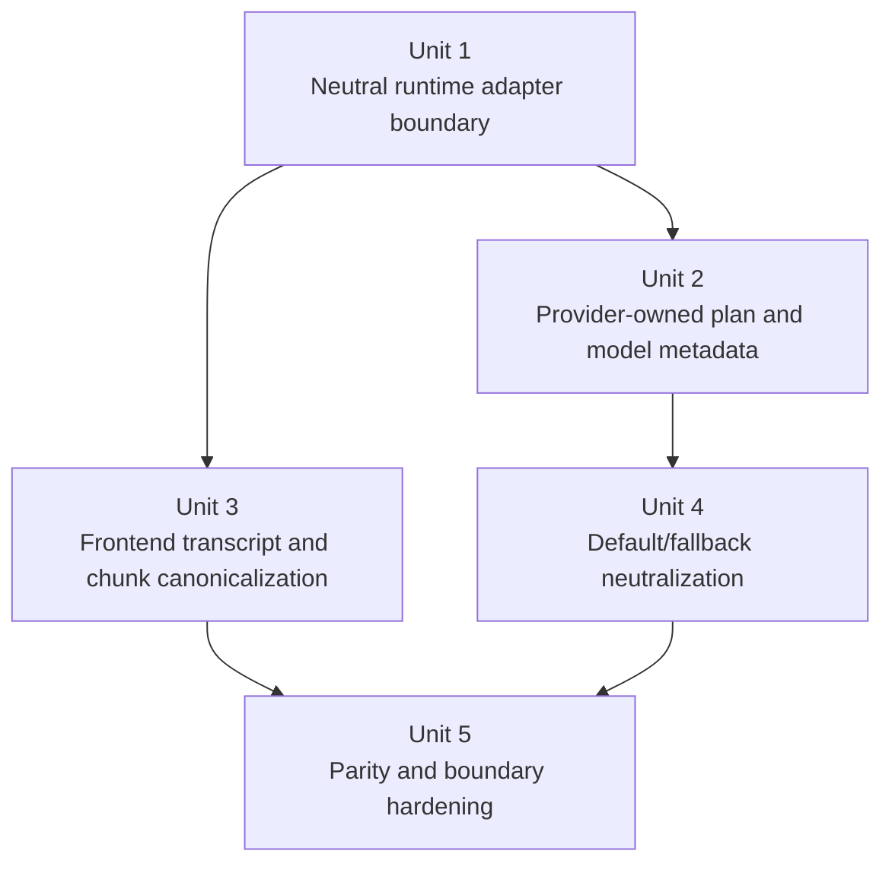

# refactor: close remaining agent-agnostic seams

## Overview

The lifecycle/reply-routing migration removed the biggest transport-owned runtime bugs, but Acepe still has a fixed set of non-agnostic seams in shared runtime and frontend layers. This plan turns that seam inventory into a bounded follow-on refactor: move the remaining provider-specific runtime behavior behind provider-owned contracts and adapter edges, remove agent-type branching from generic orchestration paths, and cut frontend transcript/chunk handling over to canonical semantics instead of provider-local heuristics.

This work is worth doing now because the remaining seams still make every provider addition or transport refinement leak into generic runtime/UI code. The near-term payoff is concrete: reduce the cost of landing new provider work, stop replaying the same ownership bugs in transcript/runtime flows, and avoid another round of “fix the shared layer for one provider” patches before the canonical journal phase is finished.

The target state is not “zero specialization anywhere.” The target state is:

- provider quirks live at adapters, capabilities, and provider-owned metadata
- shared runtime orchestration consumes provider-neutral contracts
- frontend logic renders canonical transcript, interaction, and plan data without knowing provider names or transport-specific fallbacks

## Problem Frame

Acepe’s architecture direction is already clear:

- provider adapters and parser edges are valid places for specialization
- canonical runtime and projection layers should own meaning
- UI and store layers should project canonical state instead of inventing their own provider/transport policy

That rule is still violated in a bounded set of shared files:

| Remaining seam | Why it is still non-agnostic |
| --- | --- |
| `packages/desktop/src-tauri/src/acp/task_reconciler.rs` | Generic reconciliation changes behavior for `AgentType::Copilot` instead of consuming provider-owned reconciliation policy |
| `packages/desktop/src-tauri/src/acp/client_loop.rs` | Shared subprocess loop owns `CursorResponseAdapter` and Cursor-specific web-search remap/dedup behavior |
| `packages/desktop/src-tauri/src/acp/client_transport.rs` | Generic inbound response handling still depends on a Cursor-named adapter type |
| `packages/desktop/src-tauri/src/acp/inbound_request_router/helpers.rs` | Shared router parses a Cursor-style permission title (`Web search: ...`) as fallback behavior |
| `packages/desktop/src-tauri/src/acp/client_updates/plan.rs` | Shared plan enrichment hardcodes `AgentType` matches for plan source, confidence, and provider IDs |
| `packages/desktop/src-tauri/src/acp/model_display.rs` | Shared model-display transform is still hardcoded per built-in agent instead of being provider-owned metadata/strategy |
| `packages/desktop/src/lib/acp/logic/message-processor.ts` | Frontend message assembly still knows the Cursor `[Thinking]` disguise pattern |
| `packages/desktop/src/lib/acp/logic/chunk-action-resolver.ts` | Generic chunk merge behavior still contains a Codex-specific punctuation carryover heuristic |
| `packages/desktop/src/lib/acp/store/agent-store.svelte.ts` | Default-agent selection is still a hardcoded provider priority list in frontend state |
| `packages/desktop/src-tauri/src/acp/agent_context.rs` | Ambient runtime fallback still defaults missing context to `ClaudeCode` |

The risk is not only aesthetic. These seams mean new providers or transport changes still require edits in generic runtime/UI code, which is exactly the coupling the recent migration was supposed to remove. The immediate product tradeoff is also explicit: this tranche prioritizes removing the remaining shared-layer coupling that blocks cheaper provider work and more reliable runtime behavior, instead of spending the same effort on adjacent UX polish that would sit on top of the same unstable seams.

## Requirements Trace

- R1. Shared runtime orchestration must stop branching on provider names or `AgentType` for behavior that can be expressed through provider-owned policies or metadata.
- R2. Shared inbound-response and synthetic-permission handling must stop depending on Cursor-specific adapter and title conventions.
- R3. Plan enrichment, model display, and default-agent metadata must come from provider-owned contracts or registry data rather than hardcoded shared-layer matches.
- R4. Frontend transcript and chunk handling must consume canonical message/thought/chunk semantics instead of provider-local textual heuristics.
- R5. Preserve current user-visible behavior parity for Claude, Copilot, Cursor, Codex, and OpenCode while moving ownership.
- R6. End with boundary and parity tests that prevent provider-name branching and transport-shaped heuristics from returning to the canonical path.

## Scope Boundaries

- No broad visual redesign of transcript, queue, kanban, tabs, or agent picker UX.
- No full replacement of the canonical journal umbrella plan; this is a bounded seam-removal phase inside the current architecture.
- No removal of provider modules, parser edges, or adapter translators that legitimately own provider specialization.
- No product-scope expansion into auth, install, provisioning, or unrelated agent management work.
- No flag-day rewrite of every existing model-display or plan-export type; additive compatibility is acceptable during the cutover as long as the final canonical read path is clearly defined.
- If a new smell appears outside the named seam inventory and is not required to complete one unit, capture it as follow-on work instead of widening this plan indefinitely.

## Planning Inputs

This plan builds on the completed and active architecture work already in the repo:

- `docs/plans/2026-04-07-001-refactor-provider-agnostic-frontend-plan.md`
- `docs/plans/2026-04-07-005-refactor-canonical-agent-runtime-journal-plan.md`
- `docs/plans/2026-04-08-001-refactor-migrate-acp-consumers-canonical-contract-plan.md`
- `docs/plans/2026-04-08-002-refactor-provider-lifecycle-reply-routing-plan.md`
- `docs/solutions/logic-errors/kanban-live-session-panel-sync-2026-04-02.md`
- `docs/solutions/logic-errors/operation-interaction-association-2026-04-07.md`

## Context & Research

### Relevant Code and Patterns

- `packages/desktop/src-tauri/src/acp/provider.rs` is the correct ownership seam for provider-specific policy and metadata defaults.
- `packages/desktop/src-tauri/src/acp/provider.rs` must stay narrow; this phase should add concern-local strategy types rather than turning `AgentProvider` into a catch-all callback bag.
- `packages/desktop/src-tauri/src/acp/tool_call_presentation.rs` is the preferred pattern: provider quirks terminate before generic consumers, and canonical helpers stay neutral.
- `packages/desktop/src-tauri/src/acp/projections/mod.rs` demonstrates backend-owned canonical state instead of UI-layer ownership.
- `packages/desktop/src/lib/acp/store/operation-store.svelte.ts` and `packages/desktop/src/lib/acp/store/interaction-store.svelte.ts` already embody the “one owner, many projections” rule on the frontend side.
- `packages/desktop/src-tauri/src/acp/cursor_extensions.rs`, `packages/desktop/src-tauri/src/acp/opencode/sse/conversion.rs`, and `packages/desktop/src-tauri/src/acp/client/codex_native_events.rs` already show the right edge pattern: provider translation happens before generic consumers.
- `packages/desktop/src/lib/acp/logic/message-processor.ts` and `packages/desktop/src/lib/acp/logic/chunk-action-resolver.ts` are now the main frontend canonical-path exceptions because they still recover provider semantics from textual patterns and missing IDs.

### Institutional Learnings

- `docs/solutions/logic-errors/kanban-live-session-panel-sync-2026-04-02.md` established the durable rule: one runtime owner, many projections.
- `docs/solutions/logic-errors/operation-interaction-association-2026-04-07.md` established that transport IDs are adapter metadata, not domain ownership.
- The just-completed lifecycle/reply-routing migration established the same rule for responder metadata: frontend code should submit canonical commands, not infer transport behavior.

### External References

- None. The repo already contains the architectural patterns and recent learnings needed for this bounded refactor.

## Key Technical Decisions

| Decision | Rationale |
| --- | --- |
| Create a new bounded follow-on plan instead of reopening the just-finished lifecycle plan | The lifecycle slice is done; this is a separate remaining seam inventory with its own exit gate |
| Move runtime behavior behind provider-owned policy hooks or typed metadata instead of more `AgentType` branches | Shared orchestration should ask for policy, not identify providers |
| Keep Unit 1 split across narrow seams, not one god-interface | Response adaptation, synthetic permission recovery, and reconciliation policy are separate concerns even if they land in the same tranche |
| Replace Cursor-named adapter ownership in shared runtime with a neutral inbound-response adapter contract | Generic transport handling should not know which provider introduced the adaptation shape |
| Keep canonical agent identity registry-owned and stable | Providers may supply metadata and defaults, but the registry owns canonical identity and precedence |
| Registry default selection must be metadata-driven, not a hidden built-in priority table | Moving the constant into the registry only helps if future providers can participate through facts/registration data rather than new central branches |
| Treat plan defaults, model display, and default-agent ordering as metadata/policy problems rather than frontend constant tables | These are not UI inventions; they are provider/runtime configuration concerns |
| Move transcript/chunk provider heuristics to backend canonical semantics where possible, and quarantine any compatibility fallback explicitly when not yet removable | The frontend should not detect `[Thinking]` or infer Codex carryover behavior forever |
| Keep behavior parity as a hard requirement | This is an ownership refactor, not a product reset |
| Finish with source-boundary and behavior-level contract tests | The change should become mechanically hard to regress |

## Open Questions

### Resolved During Planning

- Should this be folded into the journal umbrella plan? **No.** This is the next bounded seam-removal phase underneath that umbrella.
- Should provider-specific model-display behavior disappear entirely? **No.** It should move behind provider-owned metadata/strategy rather than shared hardcoded matches.
- Should default-agent ordering remain a frontend constant? **No.** The effective default should be computed by one registry-owned policy with this precedence: persisted existing user preference first, registry-computed metadata-driven default second, stable first-available agent last. Providers may supply facts that inform the registry policy, but they do not own final default selection and the registry must not preserve a hidden built-in priority table.
- Should frontend transcript logic continue parsing provider-local text conventions like `[Thinking]`? **No.** Canonical semantic chunk typing should own that meaning.
- Should shared runtime continue to know about `CursorResponseAdapter` by name? **No.** Shared transport/orchestration should only know a neutral response-adaptation contract.
- Should this phase change current user-visible default-agent behavior? **No.** The ownership move must preserve the current effective default for built-ins in this phase; any intentional product-policy change is follow-on work.

### Deferred to Implementation

- The precise type names for the neutral inbound-response adapter contract and reconciliation policy hooks, as long as they stay narrow and do not collapse into one catch-all provider callback surface.

## High-Level Technical Design

> *This illustrates the intended approach and is directional guidance for review, not implementation specification. The implementing agent should treat it as context, not code to reproduce.*

```text
provider adapters / capabilities / metadata
  - response adaptation
  - task reconciliation policy
  - synthetic permission/query recovery
  - plan defaults
  - model display strategy
  - transcript/thought normalization
                |
                v
     shared runtime orchestration
  client_loop / client_transport / task_reconciler
  client_updates / inbound router
                |
                v
      canonical projections + typed exports
                |
                v
     frontend logic and stores render facts
  without provider-name or transport-shaped inference
```

Ownership rule:

- **provider layers decide quirks and defaults**
- **registry owns canonical identity and default-selection precedence**
- **shared runtime consumes neutral contracts**
- **frontend renders canonical semantics**

## Implementation Units



- [ ] **Unit 1: Extract a neutral runtime adapter boundary**

**Goal:** Remove provider-named behavior from shared runtime orchestration by introducing narrow neutral seams for inbound response adaptation, synthetic permission recovery, and task reconciliation behavior.

**Requirements:** R1, R2, R5

**Dependencies:** None

**Files:**
- Modify: `packages/desktop/src-tauri/src/acp/provider.rs`
- Modify: `packages/desktop/src-tauri/src/acp/client_loop.rs`
- Modify: `packages/desktop/src-tauri/src/acp/client_transport.rs`
- Modify: `packages/desktop/src-tauri/src/acp/client/mod.rs`
- Modify: `packages/desktop/src-tauri/src/acp/client/state.rs`
- Modify: `packages/desktop/src-tauri/src/acp/task_reconciler.rs`
- Modify: `packages/desktop/src-tauri/src/acp/inbound_request_router/helpers.rs`
- Modify: `packages/desktop/src-tauri/src/acp/inbound_request_router/mod.rs`
- Modify: `packages/desktop/src-tauri/src/acp/cursor_extensions.rs`
- Modify: `packages/desktop/src-tauri/src/acp/providers/copilot.rs`
- Test: `packages/desktop/src-tauri/src/acp/client_loop.rs`
- Test: `packages/desktop/src-tauri/src/acp/client_transport.rs`
- Test: `packages/desktop/src-tauri/src/acp/task_reconciler.rs`
- Test: `packages/desktop/src-tauri/src/acp/inbound_request_router/mod.rs`

**Approach:**
- Replace `CursorResponseAdapter` usage in shared runtime with a neutral response-adaptation type or trait that providers can supply.
- Define Unit 1 as three narrow seams, not one catch-all provider interface:
  - response adaptation
  - synthetic permission/query extraction
  - reconciliation policy
- Do not solve Unit 1 by expanding `AgentProvider` into a single mega-interface; each seam should use the narrowest concern-local contract it needs.
- Move Copilot-specific implicit child-parent reconciliation behavior behind provider-owned policy rather than `agent_type == AgentType::Copilot`.
- Move Cursor-style synthetic web-search query/title recovery behind provider-owned extraction or canonical parsed arguments instead of generic router title parsing.
- Keep provider-edge translation in provider-specific files, but ensure generic runtime files no longer branch on provider names to decide behavior.

**Execution note:** Start with characterization tests that pin current Copilot task reconciliation and Cursor inbound-response behavior before changing any shared signatures.

**Patterns to follow:**
- `packages/desktop/src-tauri/src/acp/provider.rs`
- `packages/desktop/src-tauri/src/acp/tool_call_presentation.rs`
- `packages/desktop/src-tauri/src/acp/projections/mod.rs`

**Test scenarios:**
- Happy path — a provider-specific inbound response is adapted through a neutral shared runtime contract without importing a Cursor-named type.
- Happy path — Copilot task reconciliation still attaches implicit child operations correctly through provider-owned policy.
- Edge case — synthetic web-search permissions still recover the correct query without shared router knowledge of Cursor title conventions.
- Error path — missing provider adaptation metadata fails closed instead of mutating the wrong interaction or tool state.

**Verification:**
- Shared runtime orchestration contains no provider-name or provider-type behavior branches for the migrated paths.

- [ ] **Unit 2: Move plan and model metadata behind provider-owned contracts**

**Goal:** Remove hardcoded `AgentType` matches from plan enrichment and model-display transformation by sourcing defaults and presentation strategy from provider metadata/capabilities while keeping canonical agent identity registry-owned.

**Requirements:** R1, R3, R5

**Dependencies:** Unit 1 not required, but may share provider metadata extensions

**Files:**
- Modify: `packages/desktop/src-tauri/src/acp/provider.rs`
- Modify: `packages/desktop/src-tauri/src/acp/client_updates/plan.rs`
- Modify: `packages/desktop/src-tauri/src/acp/model_display.rs`
- Modify: `packages/desktop/src-tauri/src/acp/registry.rs`
- Modify: `packages/desktop/src-tauri/src/session_jsonl/export_types.rs`
- Modify: `packages/desktop/src/lib/services/acp-types.ts`
- Modify: `packages/desktop/src/lib/services/converted-session-types.ts`
- Modify: `packages/desktop/src/lib/acp/components/model-selector.svelte`
- Modify: `packages/desktop/src/lib/acp/components/model-selector.content.svelte`
- Modify: `packages/desktop/src/lib/acp/components/model-selector-logic.ts`
- Modify: `packages/desktop/src/lib/acp/components/model-selector.metrics-chip.svelte`
- Modify: `packages/desktop/src/lib/acp/components/model-selector.metrics-chip.logic.ts`
- Modify: `packages/desktop/src/lib/acp/components/modified-files/modified-files-header.svelte`
- Test: `packages/desktop/src-tauri/src/acp/client_updates/plan.rs`
- Test: `packages/desktop/src-tauri/src/acp/model_display.rs`
- Test: `packages/desktop/src-tauri/src/acp/registry.rs`
- Test: `packages/desktop/src/lib/acp/components/__tests__/model-selector-logic.test.ts`
- Test: `packages/desktop/src/lib/acp/components/__tests__/model-selector-components.test.ts`
- Test: `packages/desktop/src/lib/acp/components/__tests__/model-selector.metrics-chip.logic.test.ts`

**Approach:**
- Extend provider or registry metadata so plan source/confidence defaults and model-display strategy come from provider-owned policy instead of shared matches.
- Keep canonical agent identity assigned and validated centrally by the registry; providers supply facts and presentation/default metadata, not identity.
- Treat model-display grouping and label strategy as backend/provider-owned presentation metadata rather than hardcoded built-in transforms in a shared module.
- Cut the frontend model-selector and metrics surfaces over to backend `modelsDisplay` and related metadata as the canonical source for the covered behaviors.
- Preserve current Claude/Codex/Cursor/OpenCode/Copilot UX parity while deleting shared-layer `AgentType` branching for those defaults.

**Execution note:** Characterization-first. Pin current displayed model groups and plan-source defaults before moving ownership.

**Patterns to follow:**
- `packages/desktop/src-tauri/src/acp/provider.rs`
- `packages/desktop/src-tauri/src/acp/registry.rs`
- `packages/desktop/src-tauri/src/acp/model_display.rs`

**Test scenarios:**
- Happy path — each built-in provider still yields the same effective plan source/confidence after the ownership move.
- Happy path — current model selector grouping/parsing behavior remains unchanged for Codex and Claude through provider-owned metadata.
- Edge case — custom agents inherit safe generic defaults without requiring new shared matches.
- Error path — missing metadata falls back to neutral defaults rather than provider-name string checks in shared files.

**Verification:**
- Plan enrichment and model-display code read provider metadata/policy only; they no longer decide behavior from `AgentType` matches.

- [ ] **Unit 3: Canonicalize transcript and chunk semantics**

**Goal:** Remove provider-specific textual and chunk-continuity heuristics from the frontend canonical path by pushing thought/message normalization and chunk continuity semantics behind backend/provider normalization and an explicit canonical transcript contract.

**Requirements:** R4, R5

**Dependencies:** Unit 1

**Files:**
- Modify: `packages/desktop/src-tauri/src/acp/client/codex_native_events.rs`
- Modify: `packages/desktop/src-tauri/src/acp/cursor_extensions.rs`
- Modify: `packages/desktop/src-tauri/src/acp/session_update/types/*.rs`
- Modify: `packages/desktop/src-tauri/src/acp/session_update/normalize.rs`
- Modify: `packages/desktop/src/lib/acp/logic/normalize-chunk.ts`
- Modify: `packages/desktop/src/lib/acp/logic/message-processor.ts`
- Modify: `packages/desktop/src/lib/acp/logic/chunk-action-resolver.ts`
- Modify: `packages/desktop/src/lib/acp/store/services/chunk-aggregator.ts`
- Modify: `packages/desktop/src/lib/acp/utils/thought-prefix-stripper.ts`
- Modify: `packages/desktop/src/lib/acp/store/session-event-service.svelte.ts`
- Test: `packages/desktop/src-tauri/src/acp/client/codex_native_events.rs`
- Test: `packages/desktop/src-tauri/src/acp/cursor_extensions.rs`
- Test: `packages/desktop/src/lib/acp/logic/__tests__/normalize-chunk.test.ts`
- Test: `packages/desktop/src/lib/acp/store/services/__tests__/chunk-aggregator.test.ts`
- Test: `packages/desktop/src/lib/acp/utils/__tests__/thought-prefix-stripper.test.ts`
- Test: `packages/desktop/src/lib/acp/store/__tests__/session-event-service-streaming.vitest.ts`

**Approach:**
- Define the canonical transcript contract for this phase before implementation:
  - explicit thought vs message kind
  - logical message identity / continuation target
  - malformed-data fail-closed behavior
  - live and persisted/replayed parity expectations
- Stop relying on frontend detection of `[Thinking]` and Codex punctuation carryover to recover canonical semantics.
- Prefer provider-edge normalization or explicit canonical chunk/message metadata so the frontend only renders typed meaning.
- If temporary compatibility fallback remains necessary, constrain it to backend/provider-edge normalization only, explicitly forbid it in the frontend canonical path, and require Unit 5 to prove its removal from canonical reads.

**Execution note:** TDD from current regressions. Add failing tests that prove the frontend no longer needs provider-name or textual-pattern heuristics to keep transcript continuity and thought rendering correct.

**Patterns to follow:**
- `packages/desktop/src-tauri/src/acp/session_update/normalize.rs`
- `packages/desktop/src/lib/acp/store/operation-store.svelte.ts`
- `packages/desktop/src/lib/acp/store/interaction-store.svelte.ts`

**Test scenarios:**
- Happy path — Cursor thought content renders as thoughts without frontend prefix detection.
- Happy path — Codex punctuation carryover still merges to the correct assistant entry through canonical chunk continuity.
- Edge case — explicit thought chunks and plain assistant messages remain distinct without textual false positives.
- Error path — sparse or malformed chunk metadata fails closed without creating duplicate transcript entries.

**Verification:**
- Frontend transcript/chunk logic no longer contains provider-specific heuristics in the canonical path.

- [ ] **Unit 4: Neutralize remaining default and fallback ownership leaks**

**Goal:** Remove the remaining shared-layer provider defaults that are product policy or ambient fallback, not provider-specific runtime ownership.

**Requirements:** R3, R5

**Dependencies:** Unit 2

**Files:**
- Modify: `packages/desktop/src/lib/acp/store/agent-store.svelte.ts`
- Modify: `packages/desktop/src-tauri/src/acp/agent_context.rs`
- Modify: `packages/desktop/src-tauri/src/acp/registry.rs`
- Modify: `packages/desktop/src/lib/acp/logic/agent-manager.ts`
- Modify: `packages/desktop/src-tauri/src/acp/session_update_parser.rs`
- Modify: `packages/desktop/src-tauri/src/acp/session_update/deserialize.rs`
- Modify: `packages/desktop/src-tauri/src/acp/session_update/tool_calls.rs`
- Modify: `packages/desktop/src-tauri/src/acp/client_updates/mod.rs`
- Modify: `packages/desktop/src-tauri/src/acp/streaming_accumulator.rs`
- Modify: `packages/desktop/src-tauri/src/acp/parsers/cc_sdk_bridge.rs`
- Test: `packages/desktop/src/lib/acp/store/agent-store.svelte.ts`
- Test: `packages/desktop/src-tauri/src/acp/agent_context.rs`

**Approach:**
- Replace hardcoded frontend default-agent ordering with one registry-owned precedence rule:
  - existing persisted user preference first
  - registry-computed built-in default second
  - stable first-available agent last
- Do not introduce new persisted preference semantics in this phase; preserve current behavior and rewire ownership only.
- Remove ambient fallback to `ClaudeCode` from `agent_context.rs` only as part of an explicit migration of its current consumers so parsing and session-update code accept explicit context or fail closed safely.
- Add an explicit compatibility rule for persisted or replayed data that currently lacks ambient agent context: derive context from persisted canonical metadata where available, otherwise surface a tested fail-closed error rather than silently assigning a built-in provider.
- Keep UX parity for the default selected agent in this phase; any intentional product-policy change is follow-on work.

**Execution note:** Characterize current default-agent selection behavior first so any intentional product-policy difference is explicit.

**Patterns to follow:**
- `packages/desktop/src-tauri/src/acp/registry.rs`
- `packages/desktop/src/lib/acp/store/agent-store.svelte.ts`

**Test scenarios:**
- Happy path — the same effective default agent is selected for built-ins through metadata-driven policy.
- Edge case — custom-agent-only installs still produce a deterministic default without built-in ordering constants.
- Error path — missing ambient agent context no longer silently becomes Claude-specific behavior.

**Verification:**
- Remaining default/fallback behavior is provider-neutral and metadata-driven.

- [ ] **Unit 5: Parity and boundary hardening**

**Goal:** Prove the seam inventory is closed and make regressions mechanically hard.

**Requirements:** R5, R6

**Dependencies:** Units 1-4

**Files:**
- Modify: `packages/desktop/src-tauri/src/acp/parsers/tests/provider_composition_boundary.rs`
- Modify: `packages/desktop/src-tauri/src/acp/parsers/tests/future_provider_composition.rs`
- Create or modify: targeted runtime/frontend contract tests near the migrated seams
- Test: `packages/desktop/src-tauri/src/acp/client_loop.rs`
- Test: `packages/desktop/src-tauri/src/acp/client_transport.rs`
- Test: `packages/desktop/src-tauri/src/acp/client_updates/plan.rs`
- Test: `packages/desktop/src/lib/acp/logic/message-processor.ts`
- Test: `packages/desktop/src/lib/acp/logic/chunk-action-resolver.ts`

**Approach:**
- Add boundary tests that fail if generic runtime/frontend files reintroduce provider-name branching, provider-specific helper ownership, or `AgentType` / provider-enum behavior branching in the migrated seams.
- Add a minimum hardening matrix for this phase:
  - one boundary test for runtime adapter seams
  - one boundary test for plan/model/default metadata ownership
  - one boundary test for transcript/chunk canonical-path ownership
  - one future-provider composition test
  - one behavior parity test per covered user-visible flow family:
    - inbound response adaptation
    - task reconciliation
    - synthetic web search permission recovery
    - model display / plan defaults
    - thought rendering / chunk continuity
    - default-agent selection
- Add a future-provider test that proves a new provider can plug into the migrated seams through registration data and seam-local contracts without edits to generic runtime/frontend files or central policy tables.
- Prefer behavior tests first; use source-boundary contract tests only where the invariant is explicitly architectural ownership.

**Execution note:** Keep the hardening suite narrow and purposeful. Only guard the migrated seams and the architectural rules they enforce.

**Patterns to follow:**
- `packages/desktop/src-tauri/src/acp/parsers/tests/provider_composition_boundary.rs`
- `packages/desktop/src/lib/acp/components/tool-calls/__tests__/operation-interaction-parity.contract.test.ts`

**Test scenarios:**
- Happy path — a supported provider can still complete the covered flows with no frontend/shared-runtime provider branching.
- Edge case — a future provider addition can plug into the migrated seams through provider-owned policy/metadata without edits to generic files.
- Error path — missing provider metadata or adapter policy fails loudly in tests instead of silently falling back to a built-in provider.

**Verification:**
- The named seam inventory is closed, and the repo has explicit boundary tests to keep it closed.

## Verification Strategy

- `cd packages/desktop && bun run check`
- `cd packages/desktop && bun test <targeted-ts-tests>`
- `cd packages/desktop/src-tauri && cargo test <targeted-rust-tests>`
- `cd packages/desktop/src-tauri && cargo clippy`

Use targeted tests during execution and reserve broader sweeps for the final integration pass.

## Exit Criteria

This plan is complete when all of the following are true:

- the named shared runtime files no longer own provider-specific behavior for the migrated seams
- plan/model/default metadata is provider-owned or registry-owned rather than hardcoded in shared logic, with canonical identity and default precedence owned centrally by the registry
- persisted/replayed paths that lack explicit agent context either recover it from canonical metadata or fail through a surfaced, tested compatibility rule instead of silently defaulting to a built-in provider
- frontend transcript/chunk logic renders canonical semantics without provider-local heuristics in the canonical path
- behavior parity is preserved for the covered provider flows
- boundary tests make it difficult to reintroduce provider-name, `AgentType`, provider-specific helper, or transport-shaped ownership into shared layers
