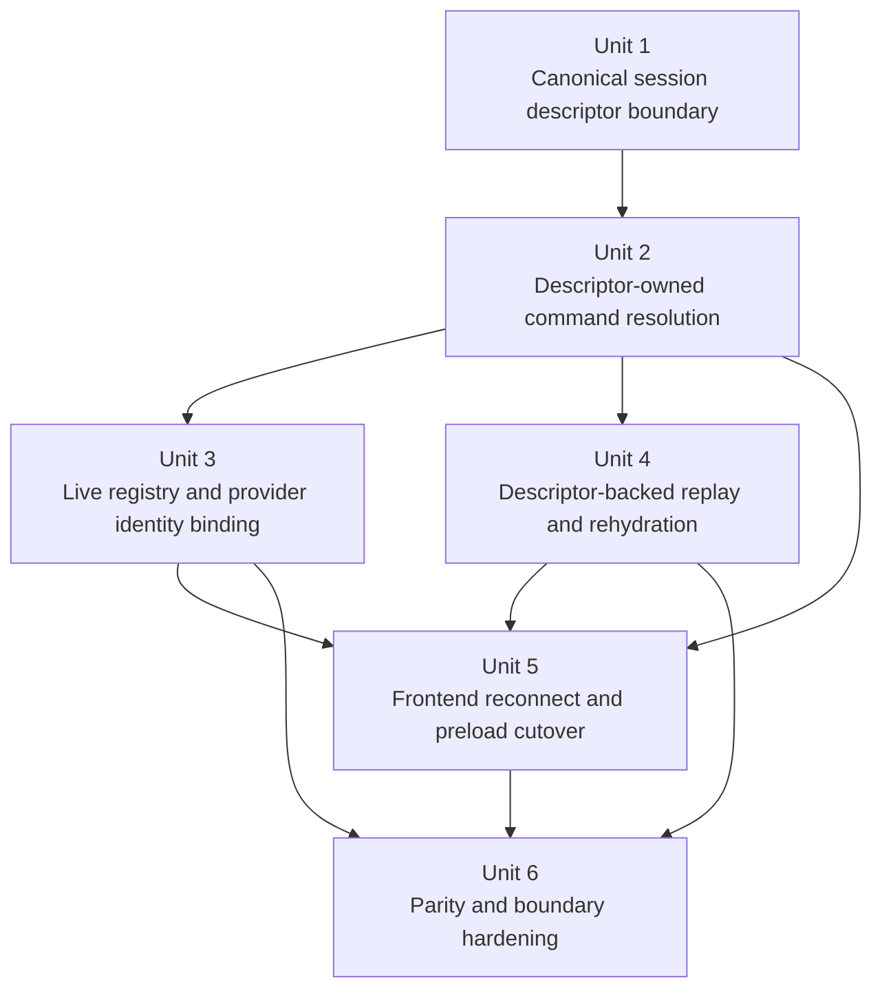
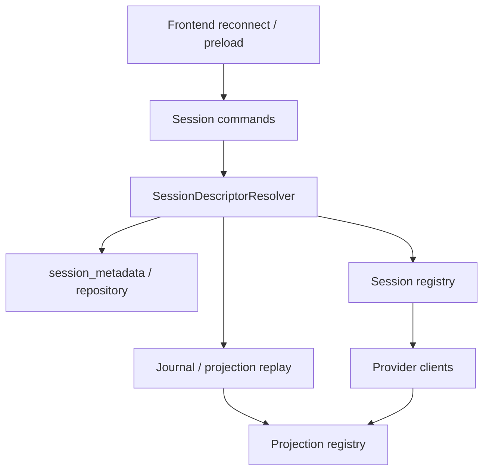

# refactor: canonicalize session descriptor ownership

## Overview

Acepe has already moved major runtime ownership seams behind canonical backend contracts, but session identity and restore behavior are still split across too many layers. The same session can currently derive truth from request arguments, active UI agent selection, `session_metadata`, `session_registry`, provider client internals, and journal replay context. This plan defines the next deep but bounded migration slice: introduce one backend-owned session descriptor boundary that resolves local session identity, provider identity, parser/replay context, and effective project/worktree context once, then make resume, replay, permission rehydration, and frontend reconnect flows consume that descriptor instead of re-deriving policy ad hoc.

This is the "god migration" for session ownership, but it is intentionally **not** the entire umbrella runtime rewrite. The scope here is the highest-value identity seam: make **existing-session** resolution deterministic and provider-agnostic enough that Claude, Copilot, Cursor, Codex, and OpenCode all resume and rehydrate through the same session-owned rules. New session and fork flows only participate where reusing the descriptor boundary prevents the old bug from re-entering through a side door; they are not a general session-lifecycle redesign. Broader cutover of the full ACP runtime to descriptor- and reducer-owned architecture remains follow-on work under the canonical journal umbrella plan.

## Problem Frame

The recent agent-agnostic seam work removed several shared-layer provider leaks, but the resume/replay bugs uncovered immediately afterward show that Acepe still lacks one canonical owner for session identity and replay context.

| Current source of truth | Where it leaks today | Why it is still structurally wrong |
| --- | --- | --- |
| Request payload (`session_id`, `cwd`, optional `agent_id`) | `packages/desktop/src-tauri/src/acp/commands/session_commands.rs` | Existing-session resume still accepts caller-provided policy instead of resolving from persisted session facts first |
| Active UI agent selection | `packages/desktop/src-tauri/src/acp/commands/session_commands.rs` | Resume can fall back to the currently selected agent even when the stored session belongs to a different provider |
| Persisted metadata | `packages/desktop/src-tauri/src/db/entities/session_metadata.rs`, `packages/desktop/src-tauri/src/db/repository.rs` | Metadata already stores agent, provider session ID, worktree path, and sequence information, but commands and replay paths do not consistently treat it as authoritative |
| Live client registry | `packages/desktop/src-tauri/src/acp/session_registry.rs` | Registry owns local session -> live client mapping, but not the full resolved identity needed for provider session binding, replay context, or restart-safe resume |
| Journal / stored projection replay context | `packages/desktop/src-tauri/src/acp/session_journal.rs`, `packages/desktop/src-tauri/src/db/repository.rs` | Replay still depends on threaded `Option<CanonicalAgentId>` or ambient agent context instead of a first-class session-owned replay contract |
| Provider client internals | `packages/desktop/src-tauri/src/acp/client/cc_sdk_client.rs` and other provider clients | Provider-specific restore/rehydration behavior still has to guess context that should already be available from a canonical descriptor |

The concrete failures match the architectural smell:

- Claude resume could reconnect successfully and then fail during stored projection replay because replayed `ToolCallData` no longer had explicit agent context.
- Copilot resume could attempt to use the wrong provider because existing-session resolution could still fall back to the active agent instead of the persisted session agent.
- Permission cache rehydration and other post-connect flows could reload stored projection state with `None` agent context even when the session already had a known provider identity.

These are not isolated bugs. They are symptoms of one missing boundary: **there is no single descriptor that tells Acepe what a session is, who owns it, how to resume it, and how to replay it**.

## Requirements Trace

- R1. Existing-session resume and reconnect must derive provider, effective cwd/worktree, provider session ID, and replay/parser context from one backend-owned descriptor boundary.
- R2. Acepe-local session IDs and provider-owned session IDs must remain distinct and stable; frontend state must never rekey itself around provider IDs.
- R3. Journal replay, stored projection loading, permission rehydration, and compatibility import must become deterministic from descriptor-owned context rather than active-agent fallback or ambient task-local state.
- R4. Existing-session resume, history import, startup preload, and live client rebinding must share one session resolution model with explicit compatibility behavior where needed; new session and fork paths may reuse descriptor construction helpers only where that keeps the boundary coherent.
- R5. Provider parity must be preserved for Claude, Copilot, Cursor, Codex, and OpenCode; no provider should resume under another provider's identity by default.
- R6. The migration must end with regression and boundary tests that make active-agent fallback, missing replay context, and provider/local identity confusion hard to reintroduce.

## Scope Boundaries

- No full replacement of the umbrella canonical journal plan in this slice.
- No broad transcript, queue, kanban, or panel redesign beyond what is required to consume descriptor-owned resume data safely.
- No flag-day storage rewrite that replaces all existing session metadata and history formats in one pass.
- No expansion into unrelated provider capability, auth, install, or model-selection work.
- No general redesign of new-session creation or session-store architecture beyond the minimum reuse needed to keep existing-session identity rules consistent.
- No permanent dual ownership: compatibility shims are acceptable during migration, but the final read path for resumed sessions must be descriptor-owned.
- Broader runtime consolidation (full canonical event/reducer descriptor model, deeper restore/import unification, follow-on storage separation) remains follow-on work once this session-ownership slice is complete.

## Planning Inputs

This plan extends, rather than replaces, the strongest local architecture work already in the repo:

- `docs/plans/2026-04-07-005-refactor-canonical-agent-runtime-journal-plan.md`
- `docs/plans/2026-04-07-001-refactor-unified-interaction-model-plan.md`
- `docs/plans/2026-04-08-002-refactor-provider-lifecycle-reply-routing-plan.md`
- `docs/plans/2026-04-08-003-refactor-close-remaining-agent-agnostic-seams-plan.md`
- `docs/solutions/logic-errors/kanban-live-session-panel-sync-2026-04-02.md`
- `docs/solutions/logic-errors/operation-interaction-association-2026-04-07.md`
- `docs/superpowers/plans/2026-03-25-claude-provider-session-id.md`

## Context & Research

### Relevant Code and Patterns

- `packages/desktop/src-tauri/src/acp/commands/session_commands.rs` already acts as the main session lifecycle boundary for new session, resume, fork, and projection restore; it is the right place to *consume* a descriptor, but not to keep accumulating identity derivation logic.
- `packages/desktop/src-tauri/src/db/entities/session_metadata.rs` and `packages/desktop/src-tauri/src/db/repository.rs` already persist most of the fields a descriptor needs (`agent_id`, `provider_session_id`, `project_path`, `worktree_path`, `sequence_id`). The cleaner direction is to build a domain/repository boundary around this data rather than keep reading raw rows everywhere.
- `packages/desktop/src-tauri/src/history/session_context.rs` is already descriptor-like backend prior art; it should inform the new boundary instead of being bypassed by another ad hoc identity helper.
- `packages/desktop/src-tauri/src/acp/session_registry.rs` already demonstrates the right "one runtime owner, many consumers" posture for live clients, but it currently only stores local session ID -> client + agent ID. That is not enough for provider-session rebinding or deterministic resume context.
- `packages/desktop/src-tauri/src/acp/session_journal.rs` plus `packages/desktop/src-tauri/src/db/repository.rs` show that replay already wants explicit context; the recent replay regression proved that `Option<CanonicalAgentId>` is too weak and ambient context is unsafe.
- `packages/desktop/src-tauri/src/acp/client/cc_sdk_client.rs` shows the preferred provider-edge pattern: provider-specific translation can stay local, but the inputs it receives for restore/rehydration should already be canonical.
- `packages/desktop/src-tauri/src/history/commands/scanning.rs` still performs provider-alias remap and history-binding work that must stay compatible with the new descriptor boundary.
- `packages/desktop/src/lib/acp/application/dto/session-identity.ts` and `packages/desktop/src/lib/acp/application/dto/session-cold.ts` are already a cleaner frontend model for stable local identity than the backend currently exposes; the migration should extend those shapes instead of inventing a parallel frontend concept.
- `packages/desktop/src/lib/acp/store/session-connection-service.svelte.ts`, `packages/desktop/src/lib/components/main-app-view/logic/managers/initialization-manager.ts`, and adjacent frontend connection/preload files are the main frontend seams that still need to stop inventing existing-session policy from active UI state.

### Institutional Learnings

- `docs/solutions/logic-errors/kanban-live-session-panel-sync-2026-04-02.md` established the durable ownership rule: one runtime owner, many projections. This migration applies that same rule to session identity and restore policy.
- `docs/solutions/logic-errors/operation-interaction-association-2026-04-07.md` established that transport IDs are adapter metadata, not domain identity. Provider session IDs should therefore be bound below the UI boundary rather than leak into frontend session ownership.
- The just-finished seam work in `docs/plans/2026-04-08-003-refactor-close-remaining-agent-agnostic-seams-plan.md` proved that "remove shared-layer fallback ownership" creates immediate product value, but also surfaced that session identity is still one of the remaining god seams.

### External References

- None. The repo already contains current, directly relevant architecture and implementation context for this migration.

## Key Technical Decisions

| Decision | Rationale |
| --- | --- |
| Introduce a backend-owned `SessionDescriptor` / resolver boundary instead of adding more resume helpers inside commands | Identity derivation is currently duplicated across commands, registry, metadata reads, and provider clients; a single descriptor object is the cleanest place to resolve and document session truth |
| Start by wrapping existing persisted metadata rather than creating a brand-new persistence subsystem in one pass | `session_metadata` already stores most descriptor facts; the architectural gap is the missing domain boundary, not necessarily the lack of columns |
| Existing-session resume must prefer persisted descriptor facts over active UI agent selection | Active agent is session-creation policy, not existing-session identity. Letting it override stored sessions is what caused the Copilot resume smell |
| Keep local Acepe session ID and provider session ID distinct forever | This preserves stable panel/workspace identity and matches the canonical journal umbrella plan's local-vs-provider identity invariant |
| Descriptor authority order must be explicit and frozen | Persisted descriptor facts are authoritative for cold replay and resume; compatibility alias remaps may map into that descriptor before launch; live provider-discovered facts become authoritative only after they are persisted back; registry cache never outranks persisted descriptor state |
| Descriptor v1 must not require an undeclared storage migration | In this slice, persisted descriptor facts are limited to what `session_metadata` or explicit existing schema additions can safely represent; replay/parser context and compatibility state are derived/resolved fields unless the plan is explicitly revised with a storage-focused sub-slice |
| A compatibility fact matrix defines resumability | Existing sessions need local session ID, canonical agent ID, and effective cwd/worktree; providers with distinct durable IDs also require `provider_session_id`. Sessions missing required facts may remain readable through compatibility import but are not resumable |
| Treat unresolved provider-backed sessions as explicitly non-resumable until descriptor facts are complete | Failing clearly is safer than silently launching under guessed provider identity, and it preserves the earlier provider-session-id planning rule |
| Late-discovered provider identity must be promoted back into canonical persisted descriptor state immediately | Restart-safe resume cannot depend on live-registry-only identity facts; the repository-backed descriptor must become authoritative after binding |
| Move replay and stored-projection loading to descriptor-derived replay context, not raw `Option<CanonicalAgentId>` threading | The recent journal regression proved that partial context passing is fragile; replay needs one richer, explicit contract |
| Provider clients remain responsible for transport translation, but not for reconstructing missing session identity | Claude/Copilot-specific code should consume canonical resume context rather than guess it or reload projections with `None` agent context |
| Replay context and execution cwd are related but not identical | Replay/parser determinism must be based on persisted descriptor facts; runtime cwd fallback for missing worktrees may affect launch behavior but must not rewrite replay identity or history binding |
| Extend the existing frontend `SessionIdentity` / `SessionCold` model instead of inventing a second frontend descriptor abstraction | The frontend already has a better stable-identity shape than the backend; the migration should converge on that direction |
| Frontend identity DTOs must remain stable-key contracts | Local session ID stays the only identity key; provider/session descriptor facts can be added only as non-key display or reconnect metadata so panel/workspace state never rekeys on reconnect |
| Explicit provider override for an existing resolved session must not reuse stale provider-bound state in place | Override paths must either fork/create a fresh local session or clear provider-bound descriptor facts before launch; silent in-place provider mutation recreates the split-identity bug |
| Frontend reconnect/startup flows should identify existing sessions by local session ID and let the backend resolve the rest | Existing session identity belongs below the UI boundary. The frontend may request an explicit override deliberately, but it should not invent default resume policy |
| Broader runtime consolidation stays follow-on | Trying to absorb the full canonical journal umbrella plan into this slice would make the migration too wide to land safely |

## Open Questions

### Resolved During Planning

- **What scope should the "god migration" cover first?** A phased roadmap with **session identity + resume/replay ownership first**. Broader ACP runtime consolidation follows later.
- **Should this plan create a dedicated new descriptor table immediately?** No. Start with a domain/repository layer around existing persisted session metadata, adding schema only when the current table cannot responsibly represent descriptor facts.
- **Should active agent selection ever control existing-session resume by default?** No. It may remain an explicit user override, but stored session identity wins by default.
- **Should replay rely on task-local ambient parser context?** No. Replay context must be derived explicitly from the session descriptor.
- **Should provider-specific restore hooks stay in provider clients?** Yes, but only as provider-edge consumers of canonical session descriptor data.
- **What should happen to provider-backed sessions whose durable provider identity has not been resolved yet?** They should be explicitly compatibility-scoped and fail safely for resume until descriptor facts are sufficient.
- **Where should worktree/project context become authoritative?** At the earliest descriptor-resolution boundary, not later during startup or scan repair.
- **What is the authority order for descriptor facts?** Persisted descriptor facts win for cold replay/resume; compatibility alias remaps only map into the same descriptor before launch; live provider-discovered facts matter only after they are persisted back; registry cache is never authoritative over persisted descriptor state.
- **How should explicit provider override behave for an already resolved existing session?** It must not silently mutate the existing local session's provider-bound state in place. The implementation must use either a fresh local session/fork or an explicit descriptor-reset path that clears stale provider state first.

### Deferred to Implementation

- Whether the final domain type should be named `SessionDescriptor`, `ResolvedSession`, or a similar term, as long as it is clearly the single session-owned identity/resume contract.
- Whether compatibility import for older stored sessions needs additive replay-envelope metadata immediately, or whether descriptor-derived replay context is sufficient for this slice.
- Whether `session_metadata` remains the long-term persistence home for descriptor fields once the umbrella canonical runtime plan reaches its final storage cutover.

## High-Level Technical Design

> *This illustrates the intended approach and is directional guidance for review, not implementation specification. The implementing agent should treat it as context, not code to reproduce.*

```text
frontend existing-session action
resume / preload / reconnect / open history
                 |
                 v
      SessionDescriptorResolver
   - local session id
   - provider session id
   - agent/provider identity
   - effective cwd/worktree
   - replay/parser context
   - resume eligibility / compatibility state
        |            |            |
        v            v            v
 session commands  session registry  replay / projection loaders
        |            |            |
        +------------+------------+
                     |
                     v
              provider clients
     consume canonical descriptor context
     instead of reconstructing session truth
```

The ownership rule for this slice is:

- **metadata persists facts**
- **the descriptor resolver turns those facts into one authoritative session contract**
- **commands, replay, and provider clients consume that contract**
- **frontend identifies the session; backend resolves what it means**

## Alternative Approaches Considered

| Approach | Why not chosen |
| --- | --- |
| Keep patching each provider-specific resume bug separately | Fixes symptoms but preserves the root architectural smell, which has already reappeared across Claude and Copilot |
| Build a brand-new persistence subsystem before introducing a descriptor boundary | Too much change at once. The immediate problem is split ownership, not the absolute inability to store descriptor facts |
| Wait and solve session identity only inside the final umbrella runtime migration | Too broad and too late. Resume/replay ownership is already generating concrete regressions now |

## Implementation Units



- [ ] **Unit 1: Introduce the canonical session descriptor boundary**

**Goal:** Define one backend-owned domain object and resolver that turns persisted session facts plus compatibility inputs into one authoritative session descriptor.

**Requirements:** R1, R2, R4

**Dependencies:** None

**Files:**
- Create: `packages/desktop/src-tauri/src/acp/session_descriptor.rs`
- Modify: `packages/desktop/src-tauri/src/acp/commands/session_commands.rs`
- Modify: `packages/desktop/src-tauri/src/db/entities/session_metadata.rs`
- Modify: `packages/desktop/src-tauri/src/db/repository.rs`
- Modify: `packages/desktop/src-tauri/src/history/session_context.rs`
- Test: `packages/desktop/src-tauri/src/acp/commands/session_commands.rs`
- Test: `packages/desktop/src-tauri/src/db/repository_test.rs`

**Approach:**
- Introduce a data-only domain contract that includes, at minimum:
  - local session ID
  - provider session ID (if resolved)
  - canonical agent/provider ID
  - effective project/worktree/cwd context
  - replay/parser context
  - explicit compatibility or unresolved state when required
- Keep the storage boundary explicit in this unit: persisted descriptor facts are limited to representable metadata; replay/parser context and compatibility state are resolved/adapted values unless a later reviewed change explicitly extends schema.
- Define a descriptor fact matrix that distinguishes:
  - always-required existing-session facts
  - provider-specific durable-ID requirements
  - compatibility/read-only states that can render history but must not claim resumability
- Centralize resolution rules for:
  - existing persisted sessions
  - new sessions
  - forked sessions
  - compatibility fallback when metadata is incomplete
- Move "what session is this?" logic out of command handlers so those handlers consume a single resolved object.
- Preserve the existing invariant that explicit user overrides can exist, but they must be clearly distinguished from default resolution.

**Execution note:** Start with characterization coverage for current resume resolution behavior before changing command flow so the migration proves which fallback paths are intentionally kept or removed.

**Patterns to follow:**
- `packages/desktop/src-tauri/src/acp/commands/session_commands.rs`
- `packages/desktop/src-tauri/src/db/entities/session_metadata.rs`
- `docs/solutions/logic-errors/kanban-live-session-panel-sync-2026-04-02.md`

**Test scenarios:**
- Happy path — resuming an existing Copilot session with no explicit override resolves `CanonicalAgentId::Copilot` from stored metadata even when the active UI agent is Claude.
- Happy path — a worktree-backed session descriptor resolves the stored worktree path as the effective cwd when the directory still exists.
- Edge case — a session with no `provider_session_id` remains resumable by local ID when that is the provider's durable identity, without rekeying frontend state.
- Edge case — a partially imported or metadata-thin session yields an explicit compatibility state instead of silently inheriting the active agent.
- Error path — missing required persisted descriptor facts for an existing session return a clear session-resolution error rather than guessing provider identity.
- Integration — repository-backed resolution and command-layer resolution produce the same descriptor facts for the same session row.

**Verification:**
- Existing-session identity is resolved in one place, and command handlers no longer independently choose provider, cwd, and replay context from mixed inputs.

- [ ] **Unit 2: Move session commands onto descriptor-owned resolution**

**Goal:** Make new session, resume, fork, and related command paths consume the descriptor boundary instead of re-deriving session identity from request payloads and active UI state.

**Requirements:** R1, R4, R5

**Dependencies:** Unit 1

**Files:**
- Modify: `packages/desktop/src-tauri/src/acp/commands/session_commands.rs`
- Modify: `packages/desktop/src-tauri/src/acp/commands/client_ops.rs`
- Modify: `packages/desktop/src-tauri/src/acp/commands/tests.rs`
- Test: `packages/desktop/src-tauri/src/acp/commands/tests.rs`

**Approach:**
- Route `acp_new_session`, `acp_resume_session`, and `acp_fork_session` through descriptor resolution or descriptor construction helpers instead of inline identity logic.
- Ensure existing-session resume defaults to descriptor-owned agent identity and effective cwd/worktree context.
- Keep explicit override semantics narrow and intentional so "switch provider and retry" remains possible without polluting default resume behavior.
- Move descriptor-owned metadata persistence and promotion decisions close to the command boundary instead of scattering them across post-connect steps.
- Keep this unit tightly focused on existing-session semantics; any new-session/fork edits must be justified as boundary reuse, not as general lifecycle cleanup.
- Separate "replay context" from "launch cwd fallback" explicitly: deleted-worktree fallback may change runtime launch location, but it must not mutate the persisted descriptor facts used for replay/history binding.

**Execution note:** Add focused failing tests for current wrong-provider resume behavior before deleting the fallback path.

**Patterns to follow:**
- `packages/desktop/src-tauri/src/acp/commands/session_commands.rs`
- `packages/desktop/src-tauri/src/acp/commands/tests.rs`

**Test scenarios:**
- Happy path — `acp_resume_session` for an existing stored Copilot session resumes using Copilot when no explicit override is provided.
- Happy path — `acp_fork_session` preserves descriptor-owned agent identity and project/worktree context for the new session.
- Edge case — deleted worktree paths fall back to canonical project cwd for launch without changing the persisted replay/history identity captured by the descriptor.
- Edge case — explicit provider override wins only when provided intentionally, not because the active UI agent happened to change.
- Error path — an attempt to resume an existing session with an incompatible override surfaces a clear protocol/session-resolution error rather than quietly launching the wrong provider.
- Integration — command-layer projection restore and metadata persistence use the same resolved descriptor agent identity and cwd.

**Verification:**
- Command handlers become descriptor consumers; existing-session provider selection is no longer coupled to active agent UI state.

- [ ] **Unit 3: Bind live registry state and provider identity to the descriptor**

**Goal:** Extend live session registry state so local session identity, provider identity, and provider-session rebinding are tracked coherently below the UI boundary without creating a second authoritative owner.

**Requirements:** R2, R4, R5

**Dependencies:** Units 1 and 2

**Files:**
- Modify: `packages/desktop/src-tauri/src/acp/session_registry.rs`
- Modify: `packages/desktop/src-tauri/src/acp/client/cc_sdk_client.rs`
- Modify: `packages/desktop/src-tauri/src/acp/providers/copilot.rs`
- Modify: `packages/desktop/src-tauri/src/acp/client/codex_native_client.rs`
- Modify: `packages/desktop/src-tauri/src/acp/commands/client_ops.rs`
- Modify: `packages/desktop/src-tauri/src/db/repository.rs`
- Test: `packages/desktop/src-tauri/src/acp/client/cc_sdk_client.rs`
- Test: `packages/desktop/src-tauri/src/acp/client/tests.rs`
- Test: `packages/desktop/src-tauri/src/acp/commands/tests.rs`

**Approach:**
- Expand registry state from "local session ID -> client + agent ID" into a descriptor-aware live session entry that can cache bound provider session identity and other live facts needed before the next repository refresh.
- Introduce one binding/update API for provider clients to report provider-session identity or other descriptor-owned facts once discovered.
- Persist newly discovered provider-session identity back into repository-backed descriptor state as part of the binding flow so restart-safe resume does not depend on live memory.
- Keep the local Acepe session ID as the only frontend/runtime handle for live session maps, panels, and workspace linkage.
- Make provider post-connect behavior (including permission cache rehydration and provider-specific safe resume rules) read descriptor-owned identity rather than reconstructing it ad hoc.
- Treat registry data as a cache/mirror of descriptor facts, not a rival source of truth with stronger precedence than persisted descriptor state.
- Do not activate this unit's new binding path on normal resumes until Unit 2's command boundary is descriptor-owned, so rollout cannot split between old command resolution and new registry semantics.

**Patterns to follow:**
- `packages/desktop/src-tauri/src/acp/session_registry.rs`
- `packages/desktop/src-tauri/src/acp/client/cc_sdk_client.rs`
- `docs/superpowers/plans/2026-03-25-claude-provider-session-id.md`

**Test scenarios:**
- Happy path — a live Claude session binds a discovered provider session ID without changing the local Acepe session ID used by the registry.
- Happy path — once a provider session ID is discovered after connect, it is persisted back into canonical metadata and survives restart-safe resume.
- Happy path — provider-specific permission rehydration uses the descriptor's canonical agent identity when loading stored projection state.
- Edge case — a provider that does not expose a distinct provider session ID still registers a coherent live descriptor entry with local-only identity.
- Edge case — rebinding provider session identity for a resumed client does not orphan pending inbound responders or live client access.
- Error path — conflicting provider-session binding for the same local session is rejected or surfaced explicitly instead of silently overwriting live identity.
- Integration — session registry, command-layer resume, and provider clients all agree on the same local vs provider identity mapping for the same live session.

**Verification:**
- Live registry ownership becomes rich enough that provider clients and command handlers no longer need their own hidden identity side channels.

- [ ] **Unit 4: Cut replay, projection restore, and compatibility import over to descriptor-backed context**

**Goal:** Make journal replay, stored projection loading, permission rehydration, and compatibility import consume explicit descriptor-owned replay context instead of ambient or partially threaded agent state.

**Requirements:** R1, R3, R4

**Dependencies:** Units 1, 2, and 3

**Files:**
- Modify: `packages/desktop/src-tauri/src/acp/commands/session_commands.rs`
- Modify: `packages/desktop/src-tauri/src/acp/session_journal.rs`
- Modify: `packages/desktop/src-tauri/src/db/repository.rs`
- Modify: `packages/desktop/src-tauri/src/acp/client/cc_sdk_client.rs`
- Modify: `packages/desktop/src-tauri/src/copilot_history/mod.rs`
- Modify: `packages/desktop/src-tauri/src/history/commands/scanning.rs`
- Modify: `packages/desktop/src-tauri/src/acp/session_update/deserialize.rs`
- Test: `packages/desktop/src-tauri/src/acp/commands/session_commands.rs`
- Test: `packages/desktop/src-tauri/src/acp/client/cc_sdk_client.rs`
- Test: `packages/desktop/src-tauri/src/copilot_history/mod.rs`
- Test: `packages/desktop/src-tauri/src/history/commands/scanning.rs`
- Test: `packages/desktop/src-tauri/src/db/repository_test.rs`

**Approach:**
- Replace "raw optional agent ID" replay APIs with a richer descriptor-backed replay context or adapter that can safely deserialize provider-shaped data.
- Ensure stored projection loading, journal listing, and compatibility import all obtain replay context from the descriptor boundary.
- Apply the descriptor fact matrix here: compatibility-loaded sessions may restore readable historical state through explicit compatibility replay context, but provider-backed sessions missing required durable-ID facts remain non-resumable.
- Quarantine any remaining compatibility-only ambient context usage behind explicit adapters and document retirement gates for it.
- Keep the additive migration narrow: replay can continue to use existing persisted data formats as long as the canonical restore path is descriptor-owned.

**Execution note:** Start with the failing stored-tool-call replay cases and compatibility-import cases that already exposed missing agent-context regressions.

**Patterns to follow:**
- `packages/desktop/src-tauri/src/acp/session_journal.rs`
- `packages/desktop/src-tauri/src/db/repository.rs`
- `docs/plans/2026-04-07-005-refactor-canonical-agent-runtime-journal-plan.md`

**Test scenarios:**
- Happy path — stored projection replay for a Claude session with tool calls succeeds through explicit descriptor replay context.
- Happy path — Copilot history import rehydrates session updates under the descriptor's canonical provider/parser identity.
- Edge case — journal replay for a session with no stored tool calls or interactions still restores a coherent session projection through the same descriptor-backed path.
- Edge case — compatibility-loaded sessions with minimal metadata use explicit compatibility replay context instead of falling back to active agent or task-local defaults.
- Error path — replay with insufficient descriptor context fails closed with a session-replay error instead of producing partial projection state.
- Integration — permission cache rehydration, journal replay, and projection restore all consume the same descriptor-owned replay context for the same session.

**Verification:**
- Restore and replay no longer depend on ambient parser identity or ad hoc `Option<CanonicalAgentId>` wiring in production paths.

- [ ] **Unit 5: Cut frontend reconnect and preload flows over to backend-owned descriptor resolution**

**Goal:** Ensure startup preload, reconnect, and existing-session opening flows identify sessions by local session ID and let the backend resolve provider/cwd identity through the descriptor boundary.

**Requirements:** R1, R2, R4, R5

**Dependencies:** Units 2, 3, and 4

**Files:**
- Modify: `packages/desktop/src/lib/acp/application/dto/session-identity.ts`
- Modify: `packages/desktop/src/lib/acp/application/dto/session-cold.ts`
- Modify: `packages/desktop/src/lib/acp/store/api.ts`
- Modify: `packages/desktop/src/lib/acp/store/types.ts`
- Modify: `packages/desktop/src/lib/acp/store/panel-store.svelte.ts`
- Modify: `packages/desktop/src/lib/acp/store/session-connection-service.svelte.ts`
- Modify: `packages/desktop/src/lib/acp/store/services/session-connection-manager.ts`
- Modify: `packages/desktop/src/lib/components/main-app-view/logic/managers/initialization-manager.ts`
- Test: `packages/desktop/src/lib/acp/store/__tests__/panel-store-workspace-panels.vitest.ts`
- Test: `packages/desktop/src/lib/acp/store/services/session-connection-manager.test.ts`
- Test: `packages/desktop/src/lib/components/main-app-view/tests/initialization-manager.test.ts`

**Approach:**
- Reduce frontend resume/reconnect inputs for existing sessions to stable local session identity plus explicit override only when the user intentionally requests it.
- Make backend descriptor-owned session facts the source for reconnect agent identity, effective cwd/worktree, and any restart-safe provider behavior the frontend needs to display.
- Preserve frontend stores as projection layers: they may render descriptor facts, but they must not derive existing-session provider identity from current agent picker state.
- Keep `SessionIdentity` / `SessionCold` immutable as key contracts: add descriptor-backed facts only as non-key fields or adjacent view-model data.
- Keep new-session creation policy separate from existing-session resolution policy.
- Do not use this unit to refactor unrelated frontend session-store architecture; only change DTOs and connection/preload seams that must understand descriptor-owned existing-session facts.
- Add an upgrade path for alias-keyed startup state: workspace/panel/session references that still point at provider aliases must be rewritten through descriptor/history alias mapping before reconnect so upgraded users do not lose session linkage.

**Patterns to follow:**
- `packages/desktop/src/lib/acp/store/session-connection-service.svelte.ts`
- `packages/desktop/src/lib/acp/store/services/session-connection-manager.ts`
- `packages/desktop/src/lib/components/main-app-view/logic/managers/initialization-manager.ts`

**Test scenarios:**
- Happy path — startup reconnect of a stored Copilot session resumes Copilot even when the active agent picker is set to Claude.
- Happy path — a worktree-backed session reconnect uses backend-resolved worktree context without requiring the frontend to re-infer it.
- Happy path — upgraded workspace/panel state that still references a provider alias is remapped to the local Acepe session ID before reconnect, without orphaning panels or opening the wrong session.
- Edge case — explicit user-selected provider override for a retry path either routes through a fresh local session / explicit descriptor-reset path or fails clearly; it must not reuse stale provider-bound state on the existing session.
- Edge case — frontend stores continue to key panels and live state by local Acepe session ID while displaying descriptor-owned provider facts.
- Error path — missing descriptor resolution for an existing session yields a clear non-resumable message with preserved read-only/history access instead of a silent wrong-provider launch.
- Integration — frontend reconnect/preload and backend command resolution agree on the same local session ID, agent ID, and effective cwd for the same session.

**Verification:**
- Existing-session reconnect is backend-owned from the frontend's perspective; UI state no longer decides provider identity by accident.

- [ ] **Unit 6: Add parity and boundary hardening for descriptor-owned session behavior**

**Goal:** End the migration with regression coverage and explicit parity gates that make provider fallback, replay-context loss, and local/provider identity confusion hard to reintroduce.

**Requirements:** R5, R6

**Dependencies:** Units 2, 3, 4, and 5

**Files:**
- Modify: `packages/desktop/src-tauri/src/acp/commands/tests.rs`
- Modify: `packages/desktop/src-tauri/src/acp/client/tests.rs`
- Modify: `packages/desktop/src-tauri/src/acp/client/codex_native_client.rs`
- Modify: `packages/desktop/src-tauri/src/db/repository_test.rs`
- Modify: `packages/desktop/src-tauri/src/acp/providers/codex.rs`
- Modify: `packages/desktop/src-tauri/src/acp/providers/cursor.rs`
- Modify: `packages/desktop/src-tauri/src/acp/providers/opencode.rs`
- Modify: `packages/desktop/src/lib/acp/store/services/session-connection-manager.test.ts`
- Modify: `packages/desktop/src/lib/components/main-app-view/tests/initialization-manager.test.ts`
- Test: `packages/desktop/src-tauri/src/acp/commands/tests.rs`
- Test: `packages/desktop/src-tauri/src/acp/client/tests.rs`
- Test: `packages/desktop/src-tauri/src/db/repository_test.rs`
- Test: `packages/desktop/src/lib/acp/store/services/session-connection-manager.test.ts`

**Approach:**
- Add boundary tests that fail if existing-session resume falls back to active agent when persisted descriptor metadata exists.
- Add parity coverage for local-vs-provider identity across provider clients, command handlers, journal replay, and frontend reconnect.
- Add explicit replay-context tests so stored tool calls, permissions, and compatibility import cannot deserialize without descriptor-owned context in production code.
- Where a provider does not expose a dedicated client-level alias-binding seam, prove parity through shared command/provider tests rather than silently downgrading the parity requirement.
- Prefer focused characterization and contract tests over large end-to-end fixtures unless only a cross-layer scenario can prove the invariant.

**Patterns to follow:**
- `packages/desktop/src-tauri/src/acp/commands/tests.rs`
- `packages/desktop/src-tauri/src/acp/client/tests.rs`
- `packages/desktop/src-tauri/src/db/repository_test.rs`
- `docs/solutions/logic-errors/operation-interaction-association-2026-04-07.md`

**Test scenarios:**
- Happy path — Claude, Copilot, Cursor, Codex, and OpenCode each resume through descriptor-owned provider selection with preserved local session IDs or explicit provider-owned compatibility rules documented by the descriptor.
- Happy path — stored projection replay plus permission rehydration for a resumed session succeeds through descriptor-owned replay context.
- Edge case — compatibility sessions with unresolved provider session IDs remain stable under local session identity and fail safely when required descriptor facts are absent.
- Edge case — explicit override paths still work without weakening the default descriptor-owned behavior for normal resumes.
- Error path — attempts to deserialize replayed tool-call data without descriptor context fail in test-only negative coverage and cannot reach production happy paths.
- Integration — frontend reconnect, command-layer resume, live registry state, and replay restore all agree on the same descriptor facts for one session across a full resume cycle.

**Verification:**
- The canonical path for resumed sessions is guarded by provider-parity and boundary tests that make the old fallback bugs difficult to reintroduce unnoticed.

## System-Wide Impact



- **Interaction graph:** `session_commands.rs`, `session_registry.rs`, provider clients, `session_journal.rs`, repository code, and frontend reconnect/preload flows all participate in session resolution today; this plan makes the descriptor resolver the single fan-out point.
- **Authority order:** persisted descriptor facts are authoritative for cold replay/resume; compatibility remap may bind old aliases into that descriptor before launch; live registry/provider updates become authoritative only after persistence writes them back.
- **Error propagation:** Session-resolution failures should surface as explicit resume/replay errors before provider launch or projection mutation, not as late generic command failures after transport already connected.
- **State lifecycle risks:** The migration touches persisted metadata, live registry state, replay context, alias remap, and frontend reconnect semantics. Partial cutover could create split identity again if one path still bypasses the descriptor resolver or rewrites panel/workspace state under the wrong key.
- **API surface parity:** Tauri session commands, provider client resume hooks, stored projection loaders, and frontend session API/store contracts must all agree on the same local-vs-provider identity semantics.
- **Integration coverage:** Unit tests alone will not prove that frontend reconnect, backend resume, provider client post-connect behavior, and journal replay all agree; focused integration tests across those seams are required.
- **Unchanged invariants:** Local Acepe session ID remains the stable frontend/runtime identity, provider adapters still own transport translation, and broader transcript/UI rendering behavior is intentionally unchanged in this slice.

## Risks & Dependencies

| Risk | Mitigation |
| --- | --- |
| The descriptor boundary becomes a new god object with unrelated responsibilities | Keep it data-only and identity/resume-focused in this slice; broader runtime concerns stay in follow-on plans |
| Compatibility sessions or older metadata rows lack enough facts for clean resolution | Represent explicit compatibility/unresolved state in the descriptor and test the failure behavior instead of guessing |
| Provider parity drifts while fixing Claude/Copilot-specific bugs | Add provider-parity tests at the descriptor boundary and keep provider-specific logic at the client/adapter edge |
| Startup alias remap or history binding regresses when provider-owned IDs and local IDs are unified behind the new descriptor | Include history/scanning coverage and preserve the explicit local-vs-provider identity invariant in repository and resume tests |
| Frontend/backend contract drift reintroduces implicit active-agent fallback | Add frontend reconnect tests plus command boundary tests that prove persisted descriptor identity wins |
| Replay/deserialization remains partially ambient through hidden production paths | Route all production replay/loading entry points through descriptor-owned context and add negative regression tests for missing context |

## Documentation / Operational Notes

- This plan should be followed by `document-review` before `/ce:work`.
- Execution should preserve the current TDD / characterization-first posture for bug-bearing seams, especially resume selection and replay-context regressions.
- If implementation reveals that `session_metadata` cannot safely host descriptor facts for this slice, update the plan or create a follow-on persistence-focused plan rather than silently widening scope mid-execution.
- Compatibility or legacy sessions that are intentionally non-resumable after descriptor validation must remain visible/readable and surface an explicit recovery message rather than appearing lost.
- After landing the migration, compound the durable session-ownership rule into `docs/solutions/` so future provider work inherits the boundary.

## Sources & References

- Related plan: `docs/plans/2026-04-07-005-refactor-canonical-agent-runtime-journal-plan.md`
- Related plan: `docs/plans/2026-04-08-002-refactor-provider-lifecycle-reply-routing-plan.md`
- Related plan: `docs/plans/2026-04-08-003-refactor-close-remaining-agent-agnostic-seams-plan.md`
- Related rationale: `docs/superpowers/plans/2026-03-25-claude-provider-session-id.md`
- Related learning: `docs/solutions/logic-errors/kanban-live-session-panel-sync-2026-04-02.md`
- Related learning: `docs/solutions/logic-errors/operation-interaction-association-2026-04-07.md`
- Related code: `packages/desktop/src-tauri/src/acp/commands/session_commands.rs`
- Related code: `packages/desktop/src-tauri/src/acp/session_registry.rs`
- Related code: `packages/desktop/src-tauri/src/acp/session_journal.rs`
- Related code: `packages/desktop/src-tauri/src/db/repository.rs`
