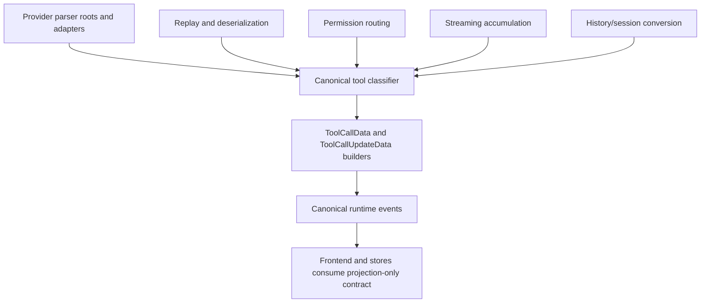
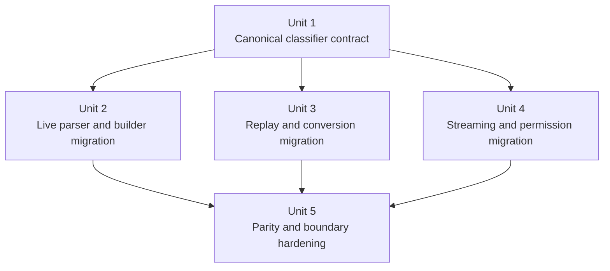

# refactor: centralize ACP tool classification

## Overview

Acepe already has the right high-level direction for ACP: provider quirks stay at adapters and edges, while canonical runtime data belongs to backend-owned neutral seams. Tool classification is still one of the remaining leaks. The same raw tool invocation can currently be classified separately in parser implementations, `session_update` builders, replay deserialization, streaming accumulation, permission routing, and history/session conversion. This plan defines a bounded deep refactor to make one backend-owned classification pipeline the canonical source of tool `kind`, canonical display name, and typed arguments, then migrate the named consumers onto that pipeline without redesigning the public tool contract.

This refactor is the next "god architecture" slice for ACP tool identity, but it stays intentionally bounded. It does not redesign `ToolKind`, replace parser capability architecture, or reopen frontend rendering. It standardizes the backend ownership seam so live parse, replay, permission prompts, streaming deltas, and conversion paths stop drifting from one another.

## Problem Frame

The recent `rg -> unknown` Copilot regression exposed a broader architectural smell rather than a one-off parser bug. Today, tool identity is still derived in multiple places:

| Seam | Current behavior | Why it is structurally wrong |
| --- | --- | --- |
| Live parser entrypoints | Provider parsers decide effective name/kind with local fallback chains | The same provider event can be interpreted differently than downstream builders or replay |
| `session_update/tool_calls.rs` | Builders re-resolve kind and parse typed args again | Canonical assembly is mixed with duplicate inference logic |
| Serialized replay / deserialization | `ToolCallData` replay has its own kind recovery rules | Replay parity depends on a second classification path |
| Streaming accumulation | Tool names are cached and re-detected from partial updates | Progressive UI can drift from final canonical tool identity |
| Permission request routing | Synthetic tool calls infer names/kinds separately from normal tool events | Permission UX can present a different tool identity than the session timeline |
| Session/history conversion | Conversion code directly detects kind and parses args | Historical or imported sessions can diverge from live ACP behavior |

This split matters because Acepe's Copilot architecture is ACP-first (see origin: `docs/brainstorms/2026-03-30-github-copilot-cli-agent-requirements.md`). History, resume, and replay are supposed to remain authoritative through ACP-backed data rather than undocumented transcript scraping. If the same raw tool payload classifies differently by ingestion path, Acepe violates that architectural promise even when the provider transport is correct.

The concrete user-facing smell is already visible:

- Copilot tool calls with sparse payloads can fall through to `unknown` even when `title` or raw arguments clearly identify the tool.
- Replay/deserialization can recover `kind` differently than the live parser path.
- Streaming/permission flows can build provisional tool identity with fallback rules that are not guaranteed to match final `ToolCallData`.

The missing boundary is therefore: **there is no single backend-owned classifier that turns raw ACP tool signals into one canonical tool identity contract before downstream consumers render or merge anything.**

## Requirements Trace

- R1. All ACP tool-entry paths that materialize tool identity must derive canonical `kind`, canonical display name, and typed arguments from one backend-owned classification pipeline.
- R2. The same raw tool payload must classify the same way across live parse, tool-call updates, replay/deserialization, permission routing, streaming accumulation, and history/session conversion.
- R3. Provider-specific vocabulary and payload quirks must remain at adapters or parser edges; the shared classifier must consume normalized signals rather than introduce new provider leakage into generic consumers.
- R4. Backend-emitted `ToolCallData` / `ToolCallUpdateData` must remain the canonical contract for the frontend and downstream stores; this refactor must reduce, not expand, consumer-side inference.
- R5. Existing `ToolKind`, `ToolArguments`, rename/edit semantics, and provider parity must remain stable for all providers touched by this seam: explicit migration work covers Claude Code, Copilot, Cursor, and Codex live parser paths, while Unit 5 adds smoke/parity coverage for OpenCode through shared builder and replay paths.
- R6. The migration must end with parity and boundary tests that make new duplicate classification paths hard to reintroduce.

## Scope Boundaries

- No semantic redesign of `ToolKind`, `ToolArguments`, or edit/rename modeling.
- No provider-launch, install, auth, session, or history-product redesign beyond the classification seam they consume.
- No broad frontend rewrite; frontend changes are limited to verification or narrow consumer cleanup if a duplicated inference path blocks canonical backend ownership.
- No speculative cleanup of all parser capability code; only classification-related seams that materially own tool identity are in scope.
- No forced convergence of genuinely provider-specific quirks that should stay at adapters or provider parser roots.
- No expansion into non-ACP transports beyond the named history/conversion seams that already build `ToolCallData`.

## Context & Research

### Relevant Code and Patterns

- `packages/desktop/src-tauri/src/acp/parsers/types.rs` already defines the parser boundary through `detect_tool_kind`, `parse_typed_tool_arguments`, and `infer_tool_display_name`.
- `packages/desktop/src-tauri/src/acp/parsers/kind.rs` already contains shared fallback inference and canonical display-name helpers; it is the strongest current foundation for a neutral classifier.
- `packages/desktop/src-tauri/src/acp/parsers/adapters/shared_chat.rs`, `packages/desktop/src-tauri/src/acp/parsers/adapters/cursor.rs`, and adjacent adapter modules already own provider/shared vocabulary normalization and should stay inputs to the classifier rather than become downstream policy owners.
- `packages/desktop/src-tauri/src/acp/session_update/tool_calls.rs` remains the canonical `ToolCallData` / `ToolCallUpdateData` builder and is the correct seam to consume a single resolved classification result rather than re-decide classification.
- `packages/desktop/src-tauri/src/acp/session_update/types/tool_calls.rs` and `packages/desktop/src-tauri/src/acp/session_update/deserialize.rs` are the replay parity seam and must stop owning replay-only recovery rules.
- `packages/desktop/src-tauri/src/acp/streaming_accumulator.rs`, `packages/desktop/src-tauri/src/acp/inbound_request_router/permission_handlers.rs`, `packages/desktop/src-tauri/src/acp/inbound_request_router/helpers.rs`, `packages/desktop/src-tauri/src/acp/providers/cursor_session_update_enrichment.rs`, and `packages/desktop/src-tauri/src/session_jsonl/parser/convert.rs` are the secondary consumers that currently re-detect kind and/or re-parse typed arguments.
- `packages/desktop/src-tauri/src/acp/parsers/tests/provider_composition_boundary.rs` is the right prior-art seam for architecture guardrails once the ownership boundary is defined.

### Institutional Learnings

- `docs/plans/2026-04-07-004-refactor-composable-acp-parser-architecture-plan.md` established the durable rule that provider parsers are composition roots and shared behavior belongs under neutral ownership.
- `docs/plans/2026-04-08-001-refactor-migrate-acp-consumers-canonical-contract-plan.md` established the adjacent downstream rule that generic consumers should read canonical tool contracts rather than re-derive provider semantics.
- `docs/plans/2026-04-07-001-refactor-unify-acp-tool-reconciliation-plan.md` and `docs/plans/2026-04-07-005-refactor-canonical-agent-runtime-journal-plan.md` reinforce that backend contracts, not frontend heuristics, should own durable runtime meaning.
- `AGENTS.md` explicitly pushes Acepe toward agent-agnostic architecture at the core and encourages architectural overhauls when provider-specific leakage remains.

### External References

- None. Local architecture, tests, and recent plans provide enough current signal for this refactor.

## Key Technical Decisions

| Decision | Rationale |
| --- | --- |
| Introduce one neutral backend classifier contract instead of continuing alias-by-alias patches | The issue is split ownership, not missing one more mapping entry |
| Keep adapters and provider parser roots as signal producers, but make one shared resolver decide final classification | This preserves provider-edge ownership while removing duplicate downstream policy |
| Treat `session_update` builders as the canonical assembly seam that consumes classification, not as a second classifier | The builders should assemble canonical tool data from one resolved result rather than keep re-interpreting raw inputs |
| Use a monotonic three-stage ownership model for typed arguments | Stage 1 resolves canonical name/kind from explicit and normalized signals, Stage 2 parses typed arguments once, and Stage 3 allows only bounded idempotent promotions that do not change parser selection or require reparsing |
| Put live parse, tool updates, replay/deserialization, permission routing, streaming accumulation, and history/session conversion in scope together | Partial centralization would leave path-specific divergence intact and weaken the point of the refactor |
| Preserve the current specificity ordering in one place: explicit tool name first, then normalized vocabulary, then kind/title/raw-argument hints | This matches existing repo intent while preventing each seam from implementing a slightly different fallback order |
| Keep the frontend projection-only for tool identity | Backend ownership is the architectural target; frontend classification would become a second source of truth |
| Migrate with characterization/parity coverage before deleting duplicate paths | This area is legacy, shared, and behavior-sensitive; coverage must prove parity before cleanup |
| Start from an explicit seam inventory and use it as an exit gate | The refactor only succeeds if every known classification call site is either migrated to the neutral seam or explicitly declared out of scope with rationale |

## Open Questions

### Resolved During Planning

- **Should this be solved with more parser-local fixes?** No. The desired end-state is one shared classifier, not more provider-local heuristics.
- **Should the classifier live in the frontend or store layer?** No. Tool identity is backend-owned runtime meaning and must remain canonical before UI projection.
- **Should replay/deserialization stay on a different recovery path from live ACP events?** No. Replay must consume the same classification rules to preserve ACP-first parity.
- **Should this refactor redesign `ToolKind` or `ToolArguments`?** No. The target is ownership consolidation, not semantics redesign.
- **Should secondary seams such as permission routing and streaming remain out of scope for a later cleanup?** No. They already materialize tool identity and would keep the architecture split if excluded.
- **How are typed arguments derived without creating a parse-classify-reparse loop?** Use a monotonic contract: resolve canonical name/kind from explicit and normalized signals first, parse typed arguments once, then allow only bounded idempotent promotions that never change parser selection or require a second parse.

### Deferred to Implementation

- The exact module/type names for the new classifier contract, as long as ownership remains neutral and discoverable.
- Whether auxiliary seams such as streaming accumulation should cache the full classification result or only the resolved name/kind pair.
- The exact shape of the seam-inventory artifact used during implementation, as long as it names every approved classification site and completion requires resolving the full list.

## High-Level Technical Design

> *This illustrates the intended approach and is directional guidance for review, not implementation specification. The implementing agent should treat it as context, not code to reproduce.*

Classifier inputs should be limited to normalized backend signals that already exist in the system, such as:

- agent/provider identity
- explicit raw tool name
- `kind` hint
- `title`
- raw arguments / locations / parsed payload hints
- update-vs-initial-call context when relevant

Classifier ownership should stay monotonic:

1. Resolve canonical name/kind from explicit names, normalized vocabulary, and coarse hints.
2. Parse typed arguments once from the selected canonical input path.
3. Allow only bounded idempotent promotions from typed arguments when they reveal a richer operation, without changing parser selection or requiring a second parse.

Classifier outputs should be sufficient for all named consumers to stop re-deciding tool identity:

- canonical `ToolKind`
- canonical display name
- typed arguments derived by the single allowed parse step
- explicit fallback/no-confidence behavior when signals are insufficient

## Alternative Approaches Considered

| Approach | Why not chosen |
| --- | --- |
| Keep fixing individual aliases and fallback gaps as bugs appear | Fixes symptoms but preserves drift across live, replay, permission, and streaming paths |
| Move all final classification into provider parser implementations | Improves one seam but leaves replay, history conversion, and downstream synthetic tool-call paths with duplicated logic |
| Let the frontend/store repair mismatched tool names or kinds | Violates the repo's backend-owned canonical contract direction and creates a second source of truth |

## Success Metrics

- A named classification seam exists under neutral backend ownership and is consumed by every in-scope path that materializes tool identity.
- The same regression corpus passes for live parse, replay/deserialization, permission routing, streaming, and conversion paths.
- New provider/tool additions can extend adapter vocabulary or raw-argument parsing without re-implementing fallback classification in multiple consumers.
- Sparse Copilot tool calls with enough title or raw-argument evidence no longer render as `unknown` in the live timeline.
- A permission prompt and its corresponding tool-call row use the same canonical tool identity for the same `tool_call_id`.
- Replayed sessions render the same canonical tool labels as the live classifier for the regression corpus.

## Implementation Units

- [ ] **Unit 1: Introduce the canonical tool-classification contract**

**Goal:** Define one neutral backend-owned classification contract that resolves canonical tool identity from raw ACP tool signals.

**Requirements:** R1, R3, R5

**Dependencies:** None

**Files:**
- Create: `packages/desktop/src-tauri/src/acp/tool_classification.rs`
- Modify: `packages/desktop/src-tauri/src/acp/mod.rs`
- Modify: `packages/desktop/src-tauri/src/acp/parsers/kind.rs`
- Modify: `packages/desktop/src-tauri/src/acp/parsers/types.rs`
- Test: `packages/desktop/src-tauri/src/acp/tool_classification.rs`
- Test: `packages/desktop/src-tauri/src/acp/parsers/kind.rs`
- Test: `packages/desktop/src-tauri/src/acp/session_update/tests.rs`

**Approach:**
- Introduce a data-only classification input/output contract under neutral `acp` ownership.
- Record an explicit seam inventory of every current classification call site before migration starts; use that inventory to map each site to Unit 2, Unit 3, Unit 4, or an explicit out-of-scope rationale.
- Centralize the fallback order that is currently split across parser roots, shared helpers, and replay code:
  - explicit tool name and normalized vocabulary
  - parser/adapter kind hints
  - title-based hints
  - bounded idempotent raw-argument-derived promotions when the single typed-argument parse proves a richer operation
- Keep provider-specific vocabulary and payload normalization outside the classifier; the classifier should consume normalized signals, not provider-specific branching.
- Lock the monotonic ownership model in the contract itself so typed arguments are parsed once and later units can only consume the resolved result.

**Execution note:** Characterization-first. Start by capturing the current fallback and promotion behaviors that must survive the refactor, including the `rg`/`ripgrep` regression shape.

**Patterns to follow:**
- `packages/desktop/src-tauri/src/acp/parsers/kind.rs`
- `packages/desktop/src-tauri/src/acp/session_update/tool_calls.rs`
- `docs/plans/2026-04-07-004-refactor-composable-acp-parser-architecture-plan.md`

**Test scenarios:**
- Happy path — an explicit normalized tool name such as `Read` or `rg` resolves to the expected canonical `ToolKind` and display name.
- Happy path — a raw edit payload whose typed arguments imply a richer operation promotes the final canonical kind consistently.
- Edge case — sparse payloads with only `title: "rg"` and no explicit tool name still resolve to `Search`.
- Edge case — conflicting hints favor the more specific explicit tool-name signal over a coarse `kind: "other"` hint.
- Error path — payloads with no usable name, title, kind, or argument evidence remain canonical `Other` without inventing a misleading specific tool.

**Verification:**
- A single neutral contract exists for classification inputs and outputs.
- The fallback order and argument-derived upgrades are implemented once rather than scattered across multiple seams.
- The seam inventory exists and names every approved migration target before implementation moves past Unit 1.

- [ ] **Unit 2: Migrate live parser and builder paths onto the classifier**

**Goal:** Remove duplicated classification logic from live ACP parser entrypoints and `session_update` builders so initial tool calls and tool-call updates share one classification path.

**Requirements:** R1, R2, R3, R5

**Dependencies:** Unit 1

**Files:**
- Modify: `packages/desktop/src-tauri/src/acp/parsers/copilot_parser.rs`
- Modify: `packages/desktop/src-tauri/src/acp/parsers/claude_code_parser.rs`
- Modify: `packages/desktop/src-tauri/src/acp/parsers/cursor_parser.rs`
- Modify: `packages/desktop/src-tauri/src/acp/parsers/codex_parser.rs`
- Modify: `packages/desktop/src-tauri/src/acp/parsers/shared_chat.rs`
- Modify: `packages/desktop/src-tauri/src/acp/session_update/tool_calls.rs`
- Test: `packages/desktop/src-tauri/src/acp/session_update/tests.rs`
- Test: `packages/desktop/src-tauri/src/acp/parsers/tests/cursor.rs`
- Test: `packages/desktop/src-tauri/src/acp/parsers/copilot_parser.rs`
- Test: `packages/desktop/src-tauri/src/acp/parsers/claude_code_parser.rs`
- Test: `packages/desktop/src-tauri/src/acp/parsers/codex_parser.rs`

**Approach:**
- Refactor parser entrypoints so they normalize provider-owned raw signals, then delegate final classification to the shared classifier.
- Keep provider-specific payload extraction, shared-chat transport parsing, and adapter vocabulary mapping at the parser edge.
- Update `build_tool_call_from_raw` and `build_tool_call_update_from_raw` so they consume the resolved classification contract instead of re-resolving `kind` and reparsing arguments independently.
- Preserve the existing rule that tool-call updates and initial tool calls must end in the same canonical classification for the same payload family, even though `ToolCallUpdateData` itself does not carry a `kind` field.
- Include Codex in this unit because it still owns final live-path classification logic in its parser implementation.

**Execution note:** Test-first. Add failing regression coverage for at least one provider per path before removing parser-local fallback branches.

**Patterns to follow:**
- `packages/desktop/src-tauri/src/acp/parsers/shared_chat.rs`
- `packages/desktop/src-tauri/src/acp/parsers/adapters/shared_chat.rs`
- `packages/desktop/src-tauri/src/acp/session_update/tool_calls.rs`

**Test scenarios:**
- Happy path — a Copilot shared-chat tool call with explicit `title`, `kind`, and raw arguments emits the same canonical tool identity through the live parser and builder path.
- Happy path — a Cursor tool call update that starts sparse but has enough normalized signals ends with the same canonical kind/name as the initial tool call path.
- Happy path — a Codex live tool call that previously resolved name/kind in `codex_parser.rs` now reaches the same canonical classification through the shared classifier and builders.
- Edge case — explicit tool names continue to win over generic or stale `kind` hints when both are present.
- Error path — malformed raw arguments still produce a safe canonical fallback without panicking or emitting a contradictory kind/name pair.
- Integration — the same provider payload corpus yields identical classification through parser entrypoints and `ToolCallData` / `ToolCallUpdateData` assembly.

**Verification:**
- Live parser roots stop containing independent final-classification policy.
- Initial tool calls and tool-call updates share one canonical classification outcome for equivalent payloads.

- [ ] **Unit 3: Migrate replay, deserialization, and conversion paths onto the classifier**

**Goal:** Make replayed, deserialized, and converted tool calls classify the same way as live ACP events.

**Requirements:** R1, R2, R4, R5

**Dependencies:** Unit 1

**Files:**
- Modify: `packages/desktop/src-tauri/src/acp/session_update/deserialize.rs`
- Modify: `packages/desktop/src-tauri/src/acp/session_update/types/tool_calls.rs`
- Modify: `packages/desktop/src-tauri/src/session_jsonl/parser/convert.rs`
- Modify: `packages/desktop/src-tauri/src/session_converter/fullsession.rs`
- Test: `packages/desktop/src-tauri/src/acp/session_update/tests.rs`
- Test: `packages/desktop/src-tauri/src/acp/session_update/types/tool_calls.rs`
- Test: `packages/desktop/src-tauri/src/session_jsonl/parser/convert.rs`
- Test: `packages/desktop/src-tauri/src/session_converter/fullsession.rs`

**Approach:**
- Replace replay-only kind recovery helpers with calls into the same shared classifier used by live ACP parsing.
- Preserve `with_agent(...)` and agent-aware replay context so adapter vocabulary and parser capabilities stay correct during replay.
- Move history/session conversion off direct `detect_tool_kind` and direct typed-argument parsing so converted sessions do not become a permanent side channel for classification drift.
- Include the full-session conversion path anywhere it materializes `ToolCallData`, not just JSONL conversion helpers, so imported or reconstructed sessions cannot bypass the shared classifier.
- Keep serialized data compatibility intact; the change is how missing or sparse fields are interpreted, not a new stored schema.

**Execution note:** Characterization-first for replay. Capture current serialized and converted edge cases before consolidating recovery logic.

**Patterns to follow:**
- `packages/desktop/src-tauri/src/acp/session_update/deserialize.rs`
- `packages/desktop/src-tauri/src/acp/session_update/types/tool_calls.rs`
- `docs/plans/2026-04-08-001-refactor-migrate-acp-consumers-canonical-contract-plan.md`

**Test scenarios:**
- Happy path — a serialized tool call with complete canonical fields round-trips unchanged through deserialization.
- Happy path — a replayed Copilot payload with sparse name data but sufficient title/raw-input evidence resolves to the same canonical classification as the live path.
- Edge case — converted session JSONL events that only retain a coarse kind hint still honor richer tool-name or raw-argument evidence when present.
- Error path — corrupted or partial serialized arguments fail closed to canonical `Other` rather than producing a mismatched specific name/kind pair.
- Integration — the same stored payload corpus produces matching classification in live ACP replay and session conversion.

**Verification:**
- Replay and conversion stop maintaining separate classification heuristics.
- Stored session recovery matches the live classifier for the same payload shapes.

- [ ] **Unit 4: Migrate streaming, permission, and auxiliary enrichment seams**

**Goal:** Remove duplicate classification from progressive and synthetic tool-call consumers so provisional runtime paths remain aligned with final canonical tool identity.

**Requirements:** R1, R2, R4, R5

**Dependencies:** Unit 1

**Files:**
- Modify: `packages/desktop/src-tauri/src/acp/streaming_accumulator.rs`
- Modify: `packages/desktop/src-tauri/src/acp/client_updates/reconciler.rs`
- Modify: `packages/desktop/src-tauri/src/acp/inbound_request_router/helpers.rs`
- Modify: `packages/desktop/src-tauri/src/acp/inbound_request_router/permission_handlers.rs`
- Modify: `packages/desktop/src-tauri/src/acp/providers/cursor_session_update_enrichment.rs`
- Test: `packages/desktop/src-tauri/src/acp/streaming_accumulator.rs`
- Test: `packages/desktop/src-tauri/src/acp/client_updates/reconciler.rs`
- Test: `packages/desktop/src-tauri/src/acp/inbound_request_router/permission_handlers.rs`
- Test: `packages/desktop/src-tauri/src/acp/providers/cursor_session_update_enrichment.rs`

**Approach:**
- Change streaming accumulation to seed/cache classifier-derived identity instead of re-detecting kind from ad hoc resolved names.
- Update the reconciler seed point so the accumulator receives canonical identity from the initial tool call rather than only `tool_call.name`.
- Update permission routing so synthetic tool calls and parsed permission arguments are built from the same canonical classification path as normal tool events.
- Remove any remaining auxiliary reclassification that would let persisted enrichment or progressive UI disagree with final canonical tool identity.
- Keep these seams narrowly scoped to tool identity; they should consume classification, not become new parser roots.

**Patterns to follow:**
- `packages/desktop/src-tauri/src/acp/streaming_accumulator.rs`
- `packages/desktop/src-tauri/src/acp/inbound_request_router/permission_handlers.rs`
- `packages/desktop/src-tauri/src/acp/providers/cursor_session_update_enrichment.rs`

**Test scenarios:**
- Happy path — a seeded streaming tool call retains the same canonical name/kind through delta accumulation and final normalization.
- Happy path — a permission request for a tool with sparse raw metadata synthesizes the same canonical tool identity as a normal timeline event for that tool.
- Edge case — cached streaming state upgrades from `Other` to a specific kind only when the classifier gains stronger evidence, not because of divergent local heuristics.
- Error path — null or malformed permission `rawInput` returns no typed arguments while preserving a safe canonical identity fallback.
- Integration — a permission prompt, synthetic tool call, and final tool-call row stay anchored to the same `tool_call_id` while rendering the same canonical identity.
- Integration — a tool requiring enrichment in an auxiliary seam still renders the same canonical identity in streaming/permission paths and final `ToolCallData`.

**Verification:**
- Progressive and synthetic tool-call paths no longer maintain their own classification logic.
- Streaming and permission UX stay aligned with the final canonical tool timeline.

- [ ] **Unit 5: Add parity coverage and ownership guardrails**

**Goal:** Prove the migration is complete and keep duplicate classification logic from creeping back into new consumers.

**Requirements:** R2, R4, R6

**Dependencies:** Unit 2, Unit 3, Unit 4

**Files:**
- Modify: `packages/desktop/src-tauri/src/acp/session_update/tests.rs`
- Modify: `packages/desktop/src-tauri/src/acp/session_update/tool_calls.rs`
- Modify: `packages/desktop/src-tauri/src/acp/parsers/tests/provider_composition_boundary.rs`
- Modify: `packages/desktop/src-tauri/src/session_converter/fullsession.rs`
- Test: `packages/desktop/src-tauri/src/acp/session_update/tests.rs`
- Test: `packages/desktop/src-tauri/src/acp/streaming_accumulator.rs`
- Test: `packages/desktop/src-tauri/src/acp/parsers/tests/provider_composition_boundary.rs`

**Approach:**
- Build a bounded parity matrix that exercises the same representative payloads through live parse, replay/deserialization, permission routing, streaming accumulation, and conversion seams.
- Add an ACP-scoped ownership guardrail that flags new downstream classification hotspots in the modules named by this plan, including `session_update`, `streaming_accumulator`, `inbound_request_router`, and `session_converter`, while leaving broader repo-wide architecture enforcement to follow-on work.
- Keep the matrix small but representative: search, read, edit/rename, terminal/execute, a safe `Other` fallback case, and lightweight parity/smoke coverage for OpenCode through the shared builder/replay paths touched by this refactor.
- Use this unit to remove any transitional compatibility helpers left behind by the migration.

**Patterns to follow:**
- `packages/desktop/src-tauri/src/acp/session_update/tests.rs`
- `packages/desktop/src-tauri/src/acp/parsers/tests/provider_composition_boundary.rs`

**Test scenarios:**
- Happy path — the same `Search` corpus passes identically across all named seams.
- Happy path — an edit/rename corpus preserves the same canonical kind/name and typed arguments across live, replay, and auxiliary seams.
- Edge case — an intentionally ambiguous payload remains canonical `Other` in every seam.
- Error path — malformed input stays behaviorally aligned across all seams instead of failing differently by path.
- Integration — the parity matrix catches any newly introduced mismatch between a parser edge and a downstream synthetic/replay path.

**Verification:**
- Named parity tests exist for every in-scope seam.
- A new duplicate classification path would fail an architecture or parity guard rather than ship silently.

## System-Wide Impact

- **Interaction graph:** Provider adapters and parser roots continue to normalize raw transport signals; the classifier becomes the single handoff into `ToolCallData`, replay recovery, streaming normalization, and synthetic permission tool calls.
- **Update-path invariant:** `ToolCallUpdateData` still has no `kind` field after this refactor, so the backend must keep update-path classification and typed arguments aligned without relying on frontend reclassification.
- **Error propagation:** Classification failures should fail closed to canonical `Other` or absent typed arguments rather than inventing a misleading specific operation.
- **State lifecycle risks:** Partial migration would leave some seams double-classifying; the implementation must land by named seam, not by scattered helper adoption.
- **API surface parity:** `ToolCallData`, `ToolCallUpdateData`, and frontend event contracts stay stable; the change is ownership of how those fields are derived.
- **Integration coverage:** Cross-path parity tests are required because unit tests inside a single seam will not prove live/replay/streaming/permission alignment or permission anchoring to the same `tool_call_id`.
- **Unchanged invariants:** Provider-specific vocabulary remains at the edge, frontend remains projection-only, and canonical tool semantics (`ToolKind`, `ToolArguments`, rename/edit modeling) do not change in this refactor.

## Risks & Dependencies

| Risk | Mitigation |
| --- | --- |
| The classifier becomes an over-centralized blob that absorbs provider-specific quirks it should not own | Keep adapters and parser roots responsible for provider-specific normalization and only centralize final classification from normalized signals |
| Live and replay paths appear unified but still parse typed arguments differently | Make the unit-1 contract explicit about where typed arguments are derived and exercise both paths through the same parity corpus |
| Streaming or permission UX regresses because provisional state used to rely on local heuristics | Include those seams explicitly in scope and require parity tests before considering the migration complete |
| Architecture cleanup stalls halfway, leaving duplicate code plus a new helper | Use the named seam inventory as the completion gate and remove transitional compatibility paths in Unit 5 |

## Documentation / Operational Notes

- After implementation, add a compounded solution document if the migration exposes a reusable rule for canonical runtime ownership of tool identity.
- If this refactor changes how future providers add vocabulary or fallback hints, update the active ACP parser architecture plan or its follow-on solution artifact to reflect the new boundary.

## Sources & References

- **Origin document:** `docs/brainstorms/2026-03-30-github-copilot-cli-agent-requirements.md`
- Related plan: `docs/plans/2026-04-07-004-refactor-composable-acp-parser-architecture-plan.md`
- Related plan: `docs/plans/2026-04-08-001-refactor-migrate-acp-consumers-canonical-contract-plan.md`
- Related plan: `docs/plans/2026-04-07-001-refactor-unify-acp-tool-reconciliation-plan.md`
- Related code: `packages/desktop/src-tauri/src/acp/session_update/tool_calls.rs`
- Related code: `packages/desktop/src-tauri/src/acp/session_update/types/tool_calls.rs`
- Related code: `packages/desktop/src-tauri/src/acp/streaming_accumulator.rs`
