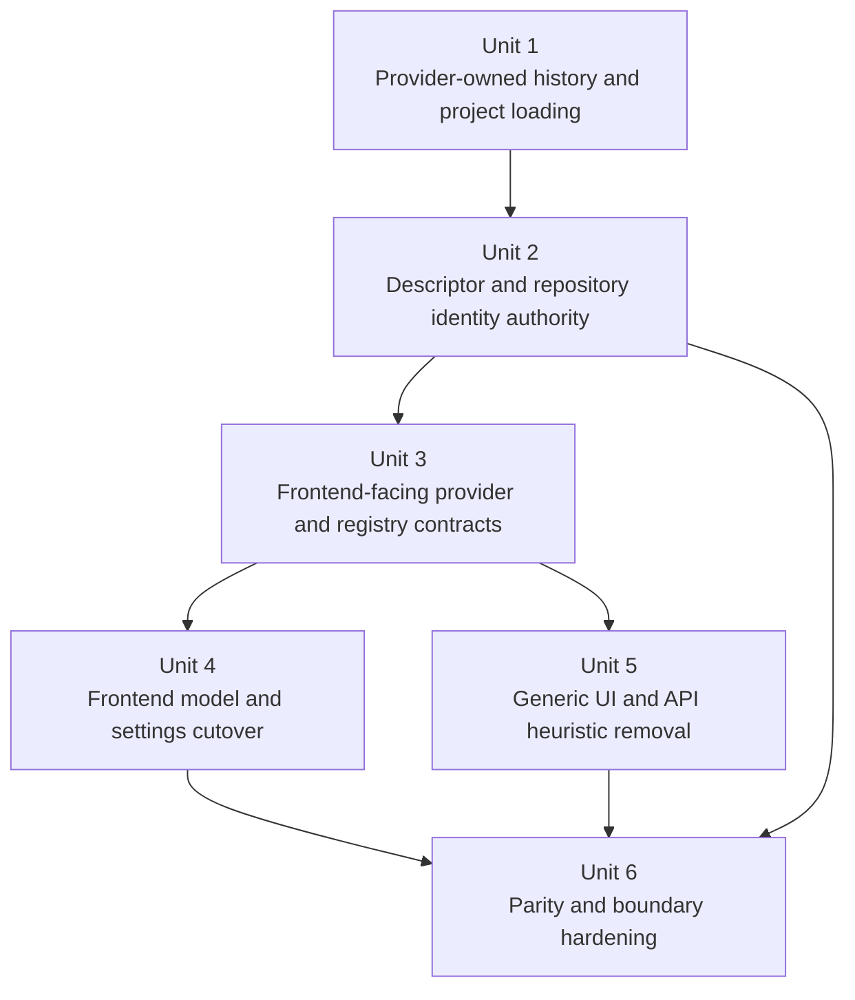

# refactor: finish remaining agent-agnostic seams

## Overview

Acepe has already removed the biggest shared-layer provider leaks, but a final cluster of non-agnostic seams still remains across history loading, project discovery, repository identity handling, default agent resolution, model metadata consumption, and a few generic frontend/UI helpers. This plan finishes that cleanup by moving the remaining provider-specific behavior behind provider-owned adapters, descriptor-backed identity contracts, and registry-driven metadata so shared runtime and UI layers stop branching on provider names, parsing provider-local IDs, or scraping provider-shaped text.

This is a deep follow-on refactor, but it is still bounded. The goal is not to eliminate legitimate provider adapters or provider-owned metadata. The goal is to make shared backend/frontend code consume explicit contracts instead of reconstructing provider behavior from IDs, labels, defaults, or presentation text.

## Problem Frame

The current architecture direction is already established:

- provider quirks belong in adapters, provider capabilities, and provider-owned metadata
- shared runtime should consume canonical session and capability contracts
- frontend/shared UI should render canonical semantics instead of inventing provider policy

The remaining non-agnostic seams violate that rule in three broad ways:

| Remaining seam class | Current examples | Why it is still structurally wrong |
| --- | --- | --- |
| Shared backend loaders still branch on concrete providers | `packages/desktop/src-tauri/src/history/commands/session_loading.rs`, `packages/desktop/src-tauri/src/history/commands/projects.rs` | History loading and project discovery still own provider-specific replay/fallback behavior instead of selecting provider-owned adapters |
| Shared identity/persistence code still guesses provider behavior | `packages/desktop/src-tauri/src/db/repository.rs`, `packages/desktop/src-tauri/src/acp/commands/session_commands.rs` | Repository and command layers still normalize provider identity or default to `ClaudeCode` instead of consuming canonical persisted or registry-owned facts |
| Shared frontend/UI still parses provider IDs or text | `packages/desktop/src/lib/acp/components/model-selector-logic.ts`, `packages/desktop/src/lib/acp/components/messages/command-output-card.svelte`, `packages/desktop/src/lib/components/settings/models-tab.svelte` | Generic UI still infers provider behavior from ID syntax, description strings, or hardcoded provider lists rather than backend-projected metadata and registry contracts |

The product risk is concrete:

- startup restore, preload, reconnect, and replay can drift if local identity, provider identity, and project/worktree authority are resolved in different layers
- adding or changing providers still requires edits in shared runtime/UI code
- the just-landed provider-metadata and descriptor work can regress if the remaining fallback heuristics stay alive beside the canonical seams

## Requirements Trace

- R1. Shared backend history loading and project discovery must stop branching on concrete providers in the canonical path and instead consume provider-owned loader/discovery contracts.
- R2. Repository, descriptor, and command layers must stop guessing provider identity or defaulting existing-session behavior from provider-specific rules in shared code.
- R3. Shared frontend model, settings, open-in-finder, runtime metadata, and command-output surfaces must consume provider metadata or registry facts instead of parsing provider-local IDs, labels, or text.
- R4. Startup restore, preload, reconnect, replay, and override flows must preserve current provider parity for Claude, Copilot, Cursor, Codex, and OpenCode while removing shared-layer heuristics.
- R5. The refactor must end with boundary and regression tests that make local/provider identity drift, backend default guessing, and provider-text parsing hard to reintroduce.
- R6. Completion must demonstrate the architectural payoff: a representative provider metadata/capability extension can land through provider-owned contracts and generated bindings without adding new provider-specific edits to shared runtime or shared UI logic.

## Scope Boundaries

- No removal of legitimate provider adapters, parser edges, or provider-owned metadata structures.
- No broad redesign of panel UX, kanban UX, or transcript visuals beyond what is required to remove shared-layer provider heuristics.
- No flag-day persistence rewrite that replaces all existing session metadata storage in one pass.
- Any model-change event/schema work in this plan must be additive and minimal, limited to the metadata needed to replace shared stdout parsing. Broader event-contract redesign is follow-on work.
- No product-policy change to the current built-in provider behavior beyond ownership cleanup; the target is parity, not new semantics.
- No expansion into unrelated auth, installation, provisioning, or non-ACP settings work.
- If additional smells appear outside this seam inventory and are not required to complete one implementation unit, capture them as follow-on work instead of widening this plan indefinitely.

## Planning Inputs

This plan continues the recent agnostic-overhaul work already in the repo:

- `docs/plans/2026-04-08-003-refactor-close-remaining-agent-agnostic-seams-plan.md`
- `docs/plans/2026-04-09-001-refactor-canonical-session-descriptor-plan.md`
- `docs/solutions/best-practices/provider-owned-policy-and-identity-not-ui-projections-2026-04-09.md`
- `docs/solutions/logic-errors/operation-interaction-association-2026-04-07.md`
- `docs/solutions/logic-errors/kanban-live-session-panel-sync-2026-04-02.md`
- `docs/solutions/logic-errors/worktree-session-restore-2026-03-27.md`
- `AGENTS.md`
- `CHANGELOG.md`

## Context & Research

### Relevant Code and Patterns

- `packages/desktop/src-tauri/src/acp/provider.rs` and `packages/desktop/src-tauri/src/acp/parsers/provider_capabilities.rs` are the preferred ownership seams for provider policy, metadata, and frontend projection.
- `packages/desktop/src-tauri/src/acp/session_descriptor.rs` already demonstrates the right backend pattern: resolve partial persisted facts into one canonical or explicitly read-only session contract.
- `packages/desktop/src-tauri/src/history/session_context.rs` already distinguishes local session identity from provider replay identity; the remaining work is to make shared loaders consistently consume that seam.
- `packages/desktop/src/lib/acp/store/services/session-connection-manager.ts` and related tests already show the preferred frontend direction: shared code consumes explicit provider metadata and backend display groups instead of display-derived behavior.
- `packages/desktop/src/lib/acp/components/model-selector-logic.ts`, `packages/desktop/src/lib/acp/components/agent-input/logic/toolbar-config-options.ts`, and `packages/desktop/src/lib/acp/components/agent-panel/logic/open-in-finder-target.ts` are useful pure-logic seams, but they still contain provider-specific fallbacks that should move to backend/registry-owned facts.

### Institutional Learnings

- `docs/solutions/best-practices/provider-owned-policy-and-identity-not-ui-projections-2026-04-09.md` — provider policy and identity must stay in explicit provider-owned contracts, not UI projection or labels.
- `docs/solutions/logic-errors/operation-interaction-association-2026-04-07.md` — transport/provider IDs are adapter metadata, not shared-layer domain identity.
- `docs/solutions/logic-errors/kanban-live-session-panel-sync-2026-04-02.md` — one runtime owner, many projections; do not keep parallel authorities in UI/store layers.
- `docs/solutions/logic-errors/worktree-session-restore-2026-03-27.md` — preserve identity at the earliest restore boundary, not through later repair logic.

### External References

- None. The repo already contains strong local patterns and recent architecture decisions for this refactor.

## Key Technical Decisions

| Decision | Rationale |
| --- | --- |
| Create a follow-on deep refactor plan instead of reopening the just-finished descriptor plan | The descriptor slice is complete; this is the remaining seam-removal phase that consumes and extends that work |
| Backend ownership comes first | Frontend cleanup depends on backend-exported metadata and descriptor contracts; reversing the order would force more temporary heuristics |
| History loading and project discovery should move behind provider-owned services, not larger generic switches | Those are the highest-value remaining shared backend leaks and they are structurally the same problem |
| Repository and command layers must consume normalized descriptor facts rather than normalize provider identity themselves | Persistence should store canonical facts, not own provider alias policy in the shared repository layer |
| Shared frontend surfaces should prefer backend-projected metadata and registry facts; if absent, fail flat rather than guess provider semantics | Guessing from ID syntax or stdout text recreates the exact architectural smell this phase is meant to remove |
| Preserve local session ID as the only shared frontend identity key | This keeps panel/workspace identity stable and avoids provider/local rekey drift |
| Remove generic `ClaudeCode` defaults from shared paths | Existing-session and generic helper behavior should never silently inherit one provider as the default authority |
| Keep behavior parity as a hard requirement | This is an ownership migration, not a product reset |

### Fallback and parity policy

To keep “degrade neutrally” from becoming a hidden product regression, this plan uses one explicit per-surface policy:

| Surface | Required behavior when canonical metadata is missing |
| --- | --- |
| Resume, reconnect, replay, history load | Fail closed. Do not guess a provider, project path, or replay identity. |
| Project discovery | Preserve the current returned project set through parity-safe merged discovery; completeness signals may change ownership, but not user-visible project loss semantics in this phase. |
| Selector, settings, runtime metadata, open-in-finder | Render neutral/generic presentation: hide provider marks, use generic labels/icons, and disable provider-specific actions rather than inferring behavior from IDs or labels. |
| Saved model/default selections | If the saved selection is unavailable after reconnect/startup, keep the resolved current model, clear the stale saved default, and require explicit re-selection instead of silently remapping to a guessed provider-specific replacement. |
| Command-output model changes | Prefer structured metadata. If unavailable, fall back to a generic model-change presentation or the raw command card rather than parsing provider-shaped stdout into branded output. |

## Open Questions

### Resolved During Planning

- **Should this be one mega-refactor?** No. Execute by dependency-ordered boundaries: backend loaders and identity first, then metadata/registry contracts, then frontend shared-surface cutover.
- **Is external research needed?** No. The repo has direct, recent patterns for provider metadata, descriptor authority, and boundary testing.
- **Should shared code preserve fallback parsing from provider-local IDs or text when metadata is missing?** Only as short-lived compatibility behavior inside explicitly quarantined fallback paths; the target shared path should prefer typed backend/registry facts or degrade safely to flatter UI.
- **Should the repository continue normalizing provider session IDs directly?** No. Provider normalization belongs before persistence or inside provider-owned identity services, with the repository storing/querying canonical results.
- **Should existing-session or generic helpers default to `ClaudeCode` when identity is missing?** No. Use explicit default-selection policy above the shared seam or fail closed when the flow is not allowed to guess.

### Deferred to Implementation

- The exact trait/type names for provider-owned history loading and project discovery services, as long as shared loaders select neutral contracts rather than branching on provider names.
- Whether the best home for frontend-facing provider metadata expansion is `ProviderCapabilities`, `FrontendProviderProjection`, or a small adjacent projection type, as long as shared frontend code stops inventing provider facts locally.
- Whether the deprecated `getConvertedSession()` helper should be deleted outright or reduced to an explicit-edge compatibility wrapper during the cutover.

## High-Level Technical Design

> *This illustrates the intended approach and is directional guidance for review, not implementation specification. The implementing agent should treat it as context, not code to reproduce.*

```text
provider adapters / provider capabilities / descriptor facts
  - history replay + project discovery
  - provider identity normalization
  - frontend provider projection
                |
                v
      shared backend contracts
  session descriptor / session commands
  repository / history loading / projects
                |
                v
      shared frontend contracts
  session API / provider metadata / agent registry
                |
                v
      generic UI and store logic render facts
  without provider-name, model-id, or stdout parsing
```

Ownership rule:

- provider layers own quirks, replay formats, and provider identity policies
- descriptor/repository layers own canonical persisted facts
- shared frontend/store layers consume exported metadata, not guessed semantics
- local session identity remains the only frontend identity key

## Alternative Approaches Considered

| Approach | Why not chosen |
| --- | --- |
| Patch each remaining smell in place without a plan | That would likely reintroduce temporary heuristics and split ownership again |
| Rewrite persistence and all frontend metadata in one flag-day migration | Too much change at once; the bounded seams can be closed incrementally while preserving parity |
| Stop at backend cleanup and leave frontend parsing fallbacks in place | That would leave shared UI code as a second semantic owner and preserve future provider-coupling work |

## Implementation Units



- [ ] **Unit 1: Move history loading and project discovery behind provider-owned services**

**Goal:** Remove concrete-provider branching from the shared history loading and project discovery paths by introducing neutral provider-owned loader/discovery seams.

**Requirements:** R1, R4

**Dependencies:** None

**Files:**
- Modify: `packages/desktop/src-tauri/src/history/commands/session_loading.rs`
- Modify: `packages/desktop/src-tauri/src/history/commands/projects.rs`
- Modify: `packages/desktop/src-tauri/src/acp/provider.rs`
- Modify: `packages/desktop/src-tauri/src/acp/parsers/provider_capabilities.rs`
- Modify: `packages/desktop/src-tauri/src/history/session_context.rs`
- Modify: provider-specific history/loading files under `packages/desktop/src-tauri/src/acp/`
- Test: `packages/desktop/src-tauri/src/history/commands/session_loading.rs`
- Test: `packages/desktop/src-tauri/src/history/commands/projects.rs`
- Test: `packages/desktop/src-tauri/src/acp/provider.rs`

**Approach:**
- Replace direct `CanonicalAgentId` branching in shared loaders with a provider-selected loader/discovery contract.
- Keep provider-specific retry/fallback rules at the provider edge, but make the shared path responsible only for descriptor/session-context resolution and adapter selection.
- Preserve the local-vs-provider identity split by continuing to resolve replay input through `history_session_id`.
- Replace the Claude-only project-discovery fallback heuristic with a provider-owned or source-emitted completeness signal folded into one merged discovery result; this changes ownership of the decision, not the expected project set returned to users.

**Execution note:** Start with characterization coverage for current session-loading fallback behavior and project discovery before moving signatures.

**Patterns to follow:**
- `packages/desktop/src-tauri/src/acp/provider.rs`
- `packages/desktop/src-tauri/src/acp/session_descriptor.rs`
- `packages/desktop/src-tauri/src/history/session_context.rs`

**Test scenarios:**
- Happy path — provider-owned history load selects the correct provider adapter without a provider-name branch in the shared loader.
- Happy path — provider-owned replay still uses `history_session_id` while local session identity remains the UI/runtime key.
- Edge case — worktree-path-first loading still falls back to project path when the worktree copy is missing.
- Edge case — project discovery still returns the same project set as today when one source is partial, without using a Claude-only fallback.
- Error path — unknown or incomplete provider loader capability fails closed instead of silently replaying through the wrong provider path.
- Integration — startup scan/discovery and later history load still agree on local session identity and project path.

**Verification:**
- Shared history/project loaders select provider-owned services through neutral contracts and parity tests remain green for current providers.

- [ ] **Unit 2: Make descriptor and repository layers the only shared identity authority**

**Goal:** Remove provider-identity normalization and default-provider guessing from repository and command layers so shared backend code consumes canonical persisted or descriptor-resolved facts only.

**Requirements:** R2, R4, R5

**Dependencies:** Unit 1

**Files:**
- Modify: `packages/desktop/src-tauri/src/db/repository.rs`
- Modify: `packages/desktop/src-tauri/src/acp/session_descriptor.rs`
- Modify: `packages/desktop/src-tauri/src/acp/commands/session_commands.rs`
- Modify: `packages/desktop/src-tauri/src/history/commands/scanning.rs`
- Modify: `packages/desktop/src-tauri/src/db/entities/session_metadata.rs`
- Test: `packages/desktop/src-tauri/src/db/repository.rs`
- Test: `packages/desktop/src-tauri/src/acp/session_descriptor.rs`
- Test: `packages/desktop/src-tauri/src/acp/commands/tests.rs`

**Approach:**
- Move provider-session normalization/alias handling out of generic repository helpers and behind provider-owned identity services or earlier ingest paths.
- Keep `SessionDescriptor` as the authoritative resolver for resumability, local/provider identity, and compatibility state.
- Remove generic `ClaudeCode` fallback from shared command resolution; default-selection must come from explicit higher-level policy or an already-resolved active/default agent seam.
- Preserve startup alias-remap and restore ordering while ensuring repository/descriptor facts win over stale UI hints.
- Add an explicit mixed-state compatibility strategy for pre-cutover persisted rows: legacy provider-session aliases are read through compatibility resolution, normalized/backfilled at the provider-owned seam or scan path, and never allowed to rekey the local session identity during upgrade.

**Execution note:** Add characterization coverage first for current alias remap, provider-session normalization, and default-agent resolution behavior before changing the authority order.

**Patterns to follow:**
- `packages/desktop/src-tauri/src/acp/session_descriptor.rs`
- `packages/desktop/src-tauri/src/history/session_context.rs`
- `packages/desktop/src-tauri/src/acp/parsers/provider_capabilities.rs`

**Test scenarios:**
- Happy path — an existing session resumes with persisted descriptor facts and never falls back to `ClaudeCode` when the session already has a known provider.
- Happy path — provider session IDs are normalized before or at the provider-owned seam, and the repository stores/queries canonical values only.
- Edge case — unresolved provider-backed sessions remain explicitly non-resumable instead of guessing a provider.
- Edge case — alias-remapped startup sessions remain bound to the same local session identity and are not cleared as missing.
- Edge case — pre-cutover persisted rows with legacy provider-session aliases load through compatibility handling, normalize safely, and preserve the same local session identity after upgrade.
- Error path — conflicting or incomplete provider identity facts surface compatibility or failure explicitly instead of silently mutating the wrong row.
- Integration — scan/remap, repository lookup, descriptor resolution, and command resume all agree on local session ID, provider session ID, and effective project path.

**Verification:**
- Repository and command-layer tests prove there is one shared identity authority and no provider-specific defaulting remains in canonical backend paths.

- [ ] **Unit 3: Expand provider and registry contracts for shared frontend surfaces**

**Goal:** Export enough backend/provider metadata and registry facts that Units 4-5 can remove hardcoded agent lists, provider-name unions, and provider-local runtime metadata fallbacks from shared frontend surfaces.

**Requirements:** R2, R3, R4

**Dependencies:** Unit 2

**Files:**
- Modify: `packages/desktop/src-tauri/src/acp/provider.rs`
- Modify: `packages/desktop/src-tauri/src/acp/parsers/provider_capabilities.rs`
- Modify: `packages/desktop/src-tauri/src/session_jsonl/export_types.rs`
- Modify: `packages/desktop/src/lib/acp/constants/agent-capabilities.ts`
- Generate: `packages/desktop/src/lib/services/acp-types.ts`
- Generate: `packages/desktop/src/lib/services/converted-session-types.ts`
- Test: `packages/desktop/src-tauri/src/acp/parsers/provider_capabilities.rs`
- Test: `packages/desktop/src-tauri/src/session_jsonl/export_types.rs`
- Test: `packages/desktop/src/lib/acp/constants/__tests__/agent-capabilities.test.ts`
- Test: `packages/desktop/src/lib/acp/store/services/session-connection-manager.test.ts`

**Approach:**
- Extend backend/frontend provider projection so registry-driven UI can read display name, icon, finder/open target policy, model-default support, runtime metadata support, and variant-group behavior from explicit metadata.
- Remove provider-branded unions in shared frontend constants where a neutral concept is sufficient.
- Keep provider-local branding and affordances visible, but make them data-driven.
- Regenerate committed Specta outputs from `packages/desktop/src-tauri/src/session_jsonl/export_types.rs` whenever Rust-exported contracts change; generated TS artifacts are outputs, not hand-edited source files.

**Patterns to follow:**
- `packages/desktop/src-tauri/src/acp/provider.rs`
- `packages/desktop/src/lib/acp/application/dto/session-capabilities.ts`
- `packages/desktop/src/lib/acp/store/services/session-connection-manager.ts`

**Test scenarios:**
- Happy path — frontend receives provider metadata sufficient to render settings/defaults/open-in-finder behavior without hardcoded provider lists.
- Happy path — session capability and metadata propagation still preserves current provider marks and variant-group behavior on reconnect.
- Edge case — providers with no optional metadata support degrade safely to neutral/shared UI behavior instead of triggering hardcoded fallbacks.
- Error path — missing optional projection fields do not crash shared consumers or re-enable provider-name switches.
- Integration — backend provider projection contracts and frontend generated types stay aligned.

**Verification:**
- Shared frontend surfaces can obtain provider behavior from exported metadata/registry contracts, the generated Specta outputs are regenerated and reviewed in the same unit, and contract tests cover the new projection fields.

### Checkpoint after Unit 3

After Units 1-3, re-evaluate whether the backend identity/restore risks are fully retired and whether the remaining frontend heuristic removals still need to land in the same tranche. If Units 4-5 are the only remaining path to eliminate shared semantic ownership, continue immediately; otherwise they may split into a follow-on patch without reopening backend authority work.

- [ ] **Unit 4: Cut frontend model, settings, and finder surfaces over to metadata-driven behavior**

**Goal:** Remove provider/model ID parsing and hardcoded provider lists from shared selector, settings, toolbar, and open-in-finder logic.

**Requirements:** R3, R4, R5

**Dependencies:** Unit 3

**Files:**
- Modify: `packages/desktop/src/lib/acp/components/model-selector-logic.ts`
- Modify: `packages/desktop/src/lib/acp/components/model-selector.content.svelte`
- Modify: `packages/desktop/src/lib/acp/components/agent-input/logic/toolbar-config-options.ts`
- Modify: `packages/desktop/src/lib/acp/components/agent-panel/logic/open-in-finder-target.ts`
- Modify: `packages/desktop/src/lib/components/settings/models-tab.svelte`
- Modify: `packages/desktop/src/lib/acp/services/model-runtime-metadata.ts`
- Test: `packages/desktop/src/lib/acp/components/__tests__/model-selector-logic.test.ts`
- Test: `packages/desktop/src/lib/acp/components/__tests__/model-selector-provider-marks.test.ts`
- Test: `packages/desktop/src/lib/acp/components/agent-input/logic/toolbar-config-options.vitest.ts`
- Test: `packages/desktop/src/lib/acp/components/agent-panel/logic/__tests__/open-in-finder-target.test.ts`

**Approach:**
- Remove Claude-specific description parsing and provider-name grouping heuristics from generic model-selector logic wherever backend display groups and provider metadata can supply the answer.
- Replace Codex-specific reasoning-effort fallback behavior with metadata-driven or display-group-driven handling; when metadata is absent, prefer a flatter generic UI over synthetic provider inference.
- Replace the hardcoded settings agent list and display/icon mapping with registry-driven metadata.
- Replace provider-named finder target unions with neutral target concepts backed by provider metadata.
- Move generic runtime metadata lookup off OpenCode/Anthropic-shaped fallbacks and onto explicit provider-aware metadata sources.
- Apply the explicit fallback policy from this plan: neutral/generic selector/settings/finder presentation is acceptable, but stale saved defaults must be cleared with explicit re-selection instead of silently remapping to guessed provider-specific substitutes.

**Execution note:** Keep narrow characterization tests for the existing shared heuristics until each one is replaced by metadata-driven behavior.

**Patterns to follow:**
- `packages/desktop/src/lib/acp/store/services/session-connection-manager.ts`
- `packages/desktop/src/lib/acp/store/agent-model-preferences-store.svelte.ts`
- `packages/desktop/src-tauri/src/acp/provider.rs`

**Test scenarios:**
- Happy path — selector rendering uses backend display groups and provider metadata without parsing provider IDs.
- Happy path — settings render available agents, names, icons, and default-model support from registry/provider metadata.
- Edge case — current model resolves correctly when the backend returns a base model ID, differing display labels, or only one grouped variant family.
- Edge case — providers without reasoning-effort metadata still render usable model selection without Codex-specific parsing.
- Edge case — a persisted saved default or grouped variant that no longer exists after reconnect/startup is cleared as unavailable and requires explicit user re-selection rather than silent remap.
- Error path — missing runtime metadata support or finder-target metadata degrades to neutral behavior instead of provider-name branching.
- Integration — reconnect caches, selector rendering, toolbar options, and settings all agree on the same provider metadata contract.

**Verification:**
- Shared frontend selector/settings/finder logic has no provider-name or model-ID parsing in the canonical path, and behavior-level tests remain green.

- [ ] **Unit 5: Remove provider-text and provider-default heuristics from generic UI and API helpers**

**Goal:** Eliminate the last generic UI/API helpers that still parse provider-shaped stdout or assume a built-in provider default.

**Requirements:** R3, R5

**Dependencies:** Unit 3

**Files:**
- Modify: `packages/desktop/src/lib/acp/components/messages/command-output-card.svelte`
- Modify: `packages/desktop/src/lib/acp/store/api.ts`
- Modify: related command output parsing or event-shape files under `packages/desktop/src/lib/acp/`
- Modify: related Rust session-update or exported contract files under `packages/desktop/src-tauri/src/acp/` when canonical model-change metadata is missing
- Modify: `packages/desktop/src-tauri/src/session_jsonl/export_types.rs` when Rust-exported command-output metadata changes
- Test: `packages/desktop/src/lib/acp/components/messages/__tests__/command-output-card.test.ts`
- Test: `packages/desktop/src/lib/acp/store/services/session-connection-manager.test.ts`
- Test: `packages/desktop/src-tauri/src/session_jsonl/export_types.rs` when exported metadata changes
- Test: any API contract test added for deprecated helper behavior

**Approach:**
- Replace stdout scraping for model-change rendering with structured event or tool metadata when available.
- If the current runtime contract does not yet expose enough structure, add the minimum additive canonical metadata needed at the Rust/session-update export boundary rather than teaching the card more provider-specific parsing.
- Remove or harden deprecated generic helpers that silently assume `claude-code`; shared helpers should require explicit agent context or route through descriptor/provider metadata.

**Patterns to follow:**
- `packages/desktop/src/lib/acp/logic/session-domain-event-subscriber.ts`
- `packages/desktop/src/lib/acp/store/services/session-connection-manager.ts`
- `packages/desktop/src/lib/acp/components/tool-calls/`

**Test scenarios:**
- Happy path — model-change cards render from structured metadata without parsing Claude-shaped stdout.
- Edge case — older events or compatibility payloads degrade gracefully without showing incorrect provider-specific labels.
- Error path — missing explicit agent or model metadata does not silently default to `claude-code`.
- Integration — model-change output, runtime metadata, and reconnect-selected model all remain consistent for current providers.

**Verification:**
- Generic UI/API helpers stop depending on provider-specific stdout/defaults, additive structured metadata is regenerated through the export-types boundary when needed, and dedicated tests anchor the new behavior.

- [ ] **Unit 6: Parity and boundary hardening**

**Goal:** Lock in the new ownership boundaries with targeted contract, startup, and cross-layer regression coverage.

**Requirements:** R4, R5, R6

**Dependencies:** Units 2, 4, 5

**Files:**
- Modify: `packages/desktop/src/lib/components/main-app-view/tests/initialization-manager.test.ts`
- Modify: `packages/desktop/src/lib/acp/store/services/__tests__/session-repository-startup-sessions.test.ts`
- Modify: `packages/desktop/src/lib/acp/store/services/session-connection-manager.test.ts`
- Modify: `packages/desktop/src-tauri/src/history/commands/session_loading.rs`
- Modify: `packages/desktop/src-tauri/src/history/commands/projects.rs`
- Modify: `packages/desktop/src-tauri/src/acp/commands/tests.rs`
- Modify: `packages/desktop/src-tauri/src/db/repository.rs`
- Modify: any new provider capability contract tests needed in `packages/desktop/src-tauri/src/acp/parsers/provider_capabilities.rs`
- Modify: `packages/desktop/src-tauri/src/acp/parsers/tests/provider_conformance.rs`

**Approach:**
- Add integration-oriented regression coverage around startup restore ordering, alias remap, preload suppression, reconnect authority, and provider/local identity separation.
- Add source-boundary tests that assert shared files no longer carry provider-specific defaulting/parsing logic where the new contracts are meant to replace it.
- Keep parity coverage focused on the high-risk flows surfaced by the audit instead of snapshotting broad implementation detail.

**Provider parity matrix:**

| Provider | Startup restore / preload / reconnect | History load / replay | Selector / settings / finder metadata | Command-output / legacy metadata compatibility |
| --- | --- | --- | --- | --- |
| Claude Code | Required | Required | Required | Required |
| Copilot | Required | Required | Required | Required |
| Cursor | Required | Required | Required | Required |
| Codex | Required | Required | Required | Required |
| OpenCode | Required | Required | Required | Required |

**Patterns to follow:**
- `packages/desktop/src/lib/components/main-app-view/tests/initialization-manager.test.ts`
- `packages/desktop/src/lib/acp/store/services/__tests__/session-repository-startup-sessions.test.ts`
- `packages/desktop/src-tauri/src/acp/parsers/provider_capabilities.rs`
- `packages/desktop/src-tauri/src/acp/parsers/tests/provider_conformance.rs`

**Test scenarios:**
- Happy path — startup restore remaps aliased sessions, preloads canonical metadata, and reconnects without stale panel/provider drift.
- Happy path — explicit `agentOverrideId` still redirects capability/model cache ownership without mutating local session identity.
- Edge case — unresolved provider-backed sessions fail closed for resume but remain readable through compatibility paths.
- Edge case — providers with partial optional metadata still render generic UI correctly and do not revive hardcoded provider heuristics.
- Error path — missing provider loader/metadata support produces explicit failure or degraded neutral behavior, not silent fallback to another provider.
- Integration — backend scan/remap, descriptor resolution, repository lookup, frontend preload/connect, and selector rendering preserve the same local/provider identity split.
- Integration — a representative provider metadata/capability change lands through provider-owned contracts plus generated bindings without introducing new provider-name branches in shared runtime or shared UI files.

**Verification:**
- High-risk startup, reconnect, replay, selector, and provider-parity regressions are covered across backend and frontend seams, including the named-provider conformance corpus and the provider parity matrix above.
- The final diff demonstrates the intended payoff: provider-owned metadata/capability evolution does not require new provider-specific edits in shared canonical paths.

## System-Wide Impact

- **Interaction graph:** provider adapters and provider capabilities feed descriptor/repository authority, which feeds session APIs and frontend provider metadata consumers across startup restore, reconnect, selector rendering, settings, and command-output display.
- **Error propagation:** missing provider-owned loader or metadata should fail closed or degrade to neutral presentation at the nearest boundary instead of silently guessing another provider.
- **State lifecycle risks:** startup alias remap, preload suppression, provider/local identity splits, and cached model/provider metadata remain the main partial-cutover risks.
- **API surface parity:** session-loading responses, provider projection contracts, settings-visible agent metadata, and any structured model-change event fields must stay aligned across Rust and generated frontend types.
- **Integration coverage:** the critical cross-layer seams are scan/remap -> repository/descriptor -> history load, and resume response -> preferences cache -> selector/settings rendering.
- **Unchanged invariants:** local session ID remains the only shared frontend identity key; provider-specific adapters and parser edges remain valid ownership seams; current provider behavior parity is preserved unless the plan explicitly replaces a heuristic with a canonical equivalent.

## Risks & Dependencies

| Risk | Mitigation |
|------|------------|
| Partial backend cutover leaves two identity authorities alive | Land Unit 2 before frontend/API cleanup and add boundary tests around descriptor/repository authority |
| Provider parity regresses while removing provider-name branches | Start with characterization coverage and keep provider-specific behavior at adapter-owned seams |
| Frontend still falls back to guessed semantics when metadata is missing | Expand provider projection in Unit 3 before removing frontend heuristics in Units 4-5 |
| Startup restore/preload order regresses | Add explicit integration tests for alias remap, preload suppression, and reconnect authority in Unit 6 |
| Command-output or runtime metadata loses compatibility for older payloads | Use structured metadata with explicit compatibility handling instead of deleting compatibility outright |

## Documentation / Operational Notes

- Update `docs/solutions/` again if execution reveals a new canonical seam or a narrower best-practice rule worth preserving separately.
- If the refactor materially changes provider projection fields or startup behavior, reflect that in the changelog/release notes for reviewers.

## Sources & References

- Related plans:
  - `docs/plans/2026-04-08-003-refactor-close-remaining-agent-agnostic-seams-plan.md`
  - `docs/plans/2026-04-09-001-refactor-canonical-session-descriptor-plan.md`
- Related learnings:
  - `docs/solutions/best-practices/provider-owned-policy-and-identity-not-ui-projections-2026-04-09.md`
  - `docs/solutions/logic-errors/operation-interaction-association-2026-04-07.md`
  - `docs/solutions/logic-errors/kanban-live-session-panel-sync-2026-04-02.md`
  - `docs/solutions/logic-errors/worktree-session-restore-2026-03-27.md`
- Related code:
  - `packages/desktop/src-tauri/src/history/commands/session_loading.rs`
  - `packages/desktop/src-tauri/src/db/repository.rs`
  - `packages/desktop/src/lib/acp/components/model-selector-logic.ts`
  - `packages/desktop/src/lib/components/settings/models-tab.svelte`
