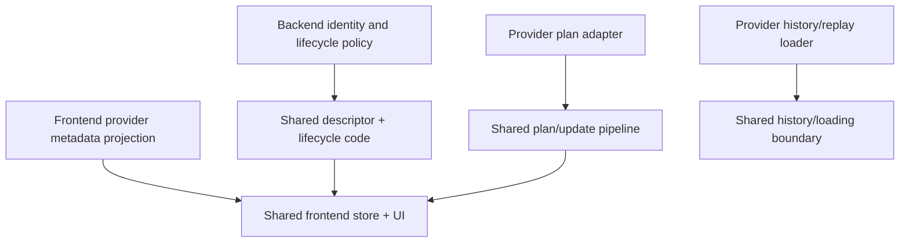
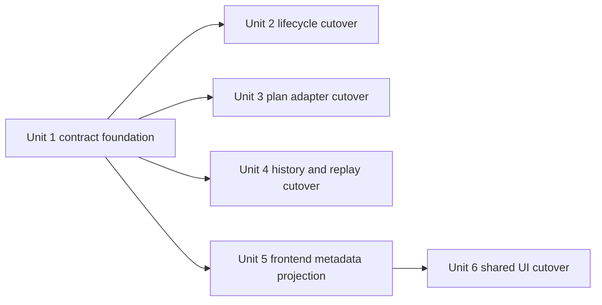

# refactor: finish the remaining agent-agnostic architecture overhaul

## Overview

Acepe has already landed the most important canonical ownership seams: descriptor-backed session identity, canonical replay context, hook-based ACP update processing, and a largely adapter-owned parser layer. The remaining work is to finish the cutover so shared backend and frontend layers stop carrying the last provider-specific lifecycle, plan, and UI rules.

This plan focuses on the final smells still visible in current code: Claude-specific session/autonomous behavior in shared session logic, Codex-specific plan-wrapper handling in shared update flow, centralized provider-shaped history loading, and provider-branched shared UI components. The goal is not a product redesign. The goal is to move the remaining provider-specific meaning out to capability/adapter edges and leave shared layers canonical.

## Terminology

- **Provider** is the primary architectural boundary term in this plan: the adapter-owned source of provider-specific behavior, capabilities, history loading, and update translation.
- **Agent** refers to the canonical selectable runtime identity surfaced through `CanonicalAgentId` and related frontend/runtime DTOs.
- **Provider-specific branching** in this plan means any shared-layer branch on provider names, agent IDs, `CanonicalAgentId`, or `AgentType` to recover behavior that should instead come from a provider-owned contract or a frontend projection.
- **Frontend projection** means presentation-only metadata shipped to shared UI. It must not carry resume/history/parser semantics.

## Problem Frame

The current architecture is no longer a provider soup, but it is not yet fully agent-agnostic. Shared layers still contain several kinds of provider-specific ownership that should live elsewhere:

- Shared backend session logic still knows that Claude requires distinct provider session identity and special autonomous reconnect behavior.
- Shared update/plan processing still knows how to extract and finalize Codex wrapper plans instead of consuming only canonical plan updates.
- Shared history loading still switches centrally on provider identity in places where adapter-owned loader boundaries should own provider semantics.
- Shared frontend components still carry provider-specific UX and built-in agent assumptions rather than consuming provider metadata/capabilities.

The recent descriptor migration made these remaining seams easier to isolate. Now the risk is architectural drift: if the last branches stay in shared layers, new features will keep inheriting the wrong ownership model.

## Requirements Trace

- R1. Shared backend session lifecycle code must stop hardcoding provider-specific resume/autonomous/session-ID rules; those rules must come from provider capabilities or adapter-owned policy.
- R2. Shared replay, restore, live, and imported paths must continue to agree on canonical local-vs-provider identity semantics.
- R3. Shared update/plan processing must stop embedding Codex-specific wrapper behavior and instead consume canonical provider-owned plan extraction hooks.
- R4. Shared frontend UI/store code must stop embedding provider-specific UX/state assumptions and instead consume provider metadata/capabilities through canonical projections.
- R5. Behavior parity must be preserved for Claude, Copilot, Cursor, Codex, and OpenCode.
- R6. Boundary tests must make reintroduction of provider-name/AgentType ownership in shared layers hard to miss.

## Success Criteria

- **Workflow parity:** existing-session resume, imported/replayed history restore, plan display, and model/default selection still work for the providers currently exercising those paths.
- **Developer/operator value:** the top workflow seams this refactor touches become easier to reason about and safer to change: fewer provider-specific support exceptions in shared code, no frontend/provider identity guessing on reconnect, and a smaller change surface when adding or adjusting a provider.
- **Shared-layer cleanliness:** shared backend/frontend code no longer owns provider semantics by branching on provider or agent identifiers.
- **Rollout safety:** the implementation proves primary-path behavior explicitly for the providers with unique behavior in each seam and treats generic-path providers as parity-checked, not implied.

## Provider Parity and Rollout Matrix

| Provider | Primary seams in this plan | Evidence expectation |
| --- | --- | --- |
| Claude | Session identity, resume/autonomous lifecycle, history loading | Focused backend + frontend characterization tests |
| Copilot | History/import loading, generic lifecycle path | Focused loader tests plus generic-path parity checks |
| Cursor | Generic identity/lifecycle path, history loading | Generic-path parity checks plus provider-loader coverage where touched |
| Codex | Wrapper-plan handling, model presentation, generic lifecycle path | Focused plan/update tests plus shared UI/model tests |
| OpenCode | Generic identity/lifecycle path, settings/model presentation | Generic-path parity checks plus shared UI/model tests |

## Scope Boundaries

- No new provider features, auth flows, or capability expansion beyond what is required to remove shared-layer ownership leaks.
- No new session storage model or rewrite of canonical descriptor persistence.
- No redesign of visual styling or model-picker product behavior beyond what is required to move provider-specific logic out of shared components.
- No flag-day rewrite of every history loader; this slice only moves provider-owned meaning out of shared logic.
- No weakening of the current descriptor-backed resume/replay behavior.

## Context & Research

### Relevant Code and Patterns

- `packages/desktop/src-tauri/src/acp/session_descriptor.rs` already owns canonical existing-session meaning; remaining provider-specific requirements should be supplied to it, not hardcoded inside it.
- `packages/desktop/src-tauri/src/db/repository.rs` already resolves descriptor facts from persisted metadata; remaining provider-specific metadata policy should flow through canonical capability rules rather than direct provider-name branches.
- `packages/desktop/src-tauri/src/acp/provider.rs`, `packages/desktop/src-tauri/src/acp/parsers/provider_capabilities.rs`, and `packages/desktop/src-tauri/src/acp/providers/*` already establish the preferred edge pattern: providers translate and advertise capabilities, shared code consumes canonical contracts.
- `packages/desktop/src-tauri/src/acp/client_updates/plan.rs` is the clearest remaining shared-layer ownership leak for Codex-specific behavior.
- `packages/desktop/src-tauri/src/history/commands/session_loading.rs`, `packages/desktop/src-tauri/src/acp/session_journal.rs`, and `packages/desktop/src-tauri/src/db/repository.rs` still mix shared orchestration with provider/parser-owned replay and loading concerns.
- `packages/desktop/src/lib/acp/store/services/session-connection-manager.ts`, `packages/desktop/src/lib/acp/components/model-selector-logic.ts`, and `packages/desktop/src/lib/components/settings/models-tab.svelte` show the three remaining frontend smells: lifecycle policy, model presentation heuristics, and hardcoded provider lists.
- `packages/desktop/src/lib/components/settings-page/settings-page.svelte` mounts `packages/desktop/src/lib/components/settings-page/sections/agents-models-section.svelte`; that mounted settings surface, not legacy `models-tab.svelte`, is the primary Unit 6 target.
- `packages/desktop/src/lib/services/acp-types.ts` already carries `ModelsForDisplay`; it is the right bridge for explicit frontend projection fields such as branding, grouping, and stable ordering.

### Institutional Learnings

- `docs/solutions/logic-errors/operation-interaction-association-2026-04-07.md` established the durable rule: transport/provider IDs are adapter metadata, not domain identity.
- `docs/plans/2026-04-07-005-refactor-canonical-agent-runtime-journal-plan.md` established the umbrella ownership model: canonical backend owns meaning, providers translate, frontend renders projections.
- `docs/plans/2026-04-08-003-refactor-close-remaining-agent-agnostic-seams-plan.md` established that registry/default precedence and shared-layer ownership leaks should move below the UI boundary.
- `docs/plans/2026-04-09-001-refactor-canonical-session-descriptor-plan.md` established that existing-session identity, replay context, and resume policy must be descriptor-owned.

### External References

- None. The repo already contains the architectural decisions and prior art needed for this follow-on cutover.

## Key Technical Decisions

| Decision | Rationale |
| --- | --- |
| Keep the descriptor-backed session migration as the base and treat this plan as a completion pass | The recent work already moved core identity/replay ownership to the right boundary; the remaining task is to remove lingering shared-layer provider policy |
| Replace provider-name branches in shared backend code with **bounded contracts by concern**, not one giant provider registry | This refactor must not replace string switches with a new cross-layer god abstraction |
| Front-load all shared Rust contract changes into Unit 1 | Later backend streams can only run in parallel if `acp/provider.rs` and related shared contract surfaces are stabilized first |
| Move Codex wrapper-plan extraction **and finalization ownership** out of shared `client_updates/plan.rs` | Shared update flow should consume finalized canonical plan events only; provider-specific buffering/parsing belongs at the provider edge |
| Treat centralized provider dispatch in history loading as a temporary boundary with a hard limit | Shared history code may dispatch and propagate canonical errors, but it must not retain provider identity repair or compatibility heuristics after dispatch |
| Push shared frontend components toward a minimal provider metadata/view-model projection | Shared UI should not encode built-in agent lists, icons, or Codex-specific UX state; it should render explicit provider metadata and preserve important provider differences visibly |
| Frontend projection fields are presentation-only | Resume/history/parser semantics must not cross into frontend metadata just because they share a provider source |
| Preserve current local session ID invariants and descriptor-owned resume semantics unchanged | This refactor should remove architectural smells without reopening the identity bugs just fixed |
| Plan execution as parallel work after one contract-foundation unit | Backend lifecycle, history/replay cleanup, plan/update cleanup, and frontend metadata/UI can split only after shared contract changes are front-loaded |

## Open Questions

### Resolved During Planning

- **Should this update the session descriptor plan or become a new plan?** A new follow-on plan. The descriptor plan solved one major seam; this work finishes the remaining shared-layer leaks across backend lifecycle, shared update flow, and frontend UI.
- **Should the frontend continue to hardcode provider-specific model-selector/settings behavior?** No. Shared UI should consume provider metadata/capabilities rather than built-in agent assumptions.
- **Should history loading become fully generic in this slice?** Not necessarily. A boundary dispatcher is acceptable, but the provider-specific meaning currently embedded there should move behind adapter-owned interfaces or canonical contracts.

### Deferred to Implementation

- The exact shape of the provider capability/policy surface for lifecycle behavior (new trait methods vs extending existing capability registries) should be decided in code once the touched interfaces are open, but it must stay bounded by concern.
- Whether `models-tab.svelte` should consume provider metadata directly from existing cached models/state or via a new frontend provider registry helper can be decided during implementation.
- The precise minimal adapter seam for Codex wrapper-plan extraction should be chosen after opening the current `client_updates` and provider update flow together, but one owner must hold both buffering and turn-end finalization.

## High-Level Technical Design

> *This illustrates the intended approach and is directional guidance for review, not implementation specification. The implementing agent should treat it as context, not code to reproduce.*

The completion rule for this slice is:

- shared layers own canonical orchestration
- providers own provider-specific meaning
- frontend renders provider metadata rather than inventing provider behavior

## Implementation Units

- [x] **Unit 1: Define the remaining provider capability and policy contract**

**Goal:** Replace the last provider-name branches in shared ownership code with a bounded set of concern-specific contracts that later units can consume without reopening shared trait files.

**Requirements:** R1, R2, R5

**Dependencies:** None

**Files:**
- Modify: `packages/desktop/src-tauri/src/acp/provider.rs`
- Modify: `packages/desktop/src-tauri/src/acp/parsers/provider_capabilities.rs`
- Modify: `packages/desktop/src-tauri/src/acp/session_descriptor.rs`
- Modify: `packages/desktop/src-tauri/src/db/repository.rs`
- Modify: `packages/desktop/src-tauri/src/acp/providers/claude_code.rs`
- Modify: `packages/desktop/src-tauri/src/acp/providers/copilot.rs`
- Modify: `packages/desktop/src-tauri/src/acp/providers/codex.rs`
- Modify: `packages/desktop/src-tauri/src/acp/providers/cursor.rs`
- Modify: `packages/desktop/src-tauri/src/acp/providers/opencode.rs`
- Modify: `packages/desktop/src-tauri/src/acp/providers/mod.rs`
- Test: `packages/desktop/src-tauri/src/db/repository_test.rs`
- Test: `packages/desktop/src-tauri/src/acp/commands/tests.rs`

**Approach:**
- Introduce or extend concern-bounded provider-owned contracts for the remaining shared concerns: backend identity/lifecycle policy, plan adaptation, history/replay loading, and frontend projection shape.
- Move shared `history_session_id` fallback and provider-session normalization rules behind backend identity policy rather than direct `CanonicalAgentId` or provider-name branching.
- Front-load any shared trait or capability-table signatures needed by Units 2-5 so later units do not reopen `acp/provider.rs`.
- Explicitly forbid frontend projection contracts from carrying resume/history/parser semantics.
- Preserve descriptor compatibility/read-only behavior; only the source of provider-specific policy should move.

**Execution note:** Start with characterization coverage for the existing Claude-specific behavior before moving the ownership boundary. Execution target: external-delegate.

**Patterns to follow:**
- `packages/desktop/src-tauri/src/acp/provider.rs`
- `packages/desktop/src-tauri/src/acp/parsers/provider_capabilities.rs`
- `packages/desktop/src-tauri/src/acp/providers/*`
- `packages/desktop/src-tauri/src/acp/session_descriptor.rs`

**Test scenarios:**
- Happy path — a provider that requires distinct provider session identity still resolves canonical descriptors and resume eligibility correctly after policy extraction.
- Happy path — providers that do not require distinct provider session identity continue to resolve local/provider/history IDs exactly as before.
- Happy path — Copilot, Cursor, and OpenCode continue to compile and use generic-path defaults without adding bespoke logic where it is not needed.
- Edge case — unresolved provider-backed sessions remain read-only and non-resumable without guessing provider semantics.
- Error path — missing descriptor facts still fail closed through canonical resolution errors rather than provider-name fallback.
- Integration — descriptor resolution and repository metadata logic agree on the same capability-driven provider requirements for the same session.

**Verification:**
- Shared descriptor/repository code no longer encodes provider names or provider-specific requirements directly.
- Shared provider contract changes are fully front-loaded here; later units should not need new signatures in `acp/provider.rs`.

- [x] **Unit 2: Remove shared lifecycle special-cases from resume and autonomous flows**

**Goal:** Move remaining provider-specific lifecycle behavior out of shared backend/frontend session orchestration.

**Requirements:** R1, R2, R5, R6

**Dependencies:** Unit 1

**Files:**
- Modify: `packages/desktop/src-tauri/src/acp/commands/session_commands.rs`
- Modify: `packages/desktop/src/lib/acp/store/services/session-connection-manager.ts`
- Modify: `packages/desktop/src/lib/acp/store/services/session-connection-manager.test.ts`
- Test: `packages/desktop/src-tauri/src/acp/commands/tests.rs`
- Test: `packages/desktop/src/lib/acp/store/services/session-connection-manager.test.ts`

**Approach:**
- Replace Claude-specific reconnect/autonomous logic in shared session commands and shared frontend connection manager with capability-driven lifecycle policy.
- Replace model-id prefix and unsupported-autonomous heuristics in `session-connection-manager.ts` with explicit policy or alias data from canonical contracts.
- Keep existing descriptor-owned resume authority intact: this unit changes who owns lifecycle decisions, not session identity.
- Make explicit override/reconnect paths continue to fail safely when provider policy does not allow in-place reuse.

**Execution note:** Characterization-first. Capture the current autonomous/reconnect behavior before moving the policy source. Execution target: external-delegate.

**Patterns to follow:**
- `packages/desktop/src-tauri/src/acp/session_descriptor.rs`
- `packages/desktop/src/lib/acp/store/services/session-connection-manager.ts`

**Test scenarios:**
- Happy path — the current Claude autonomous reconnect behavior still occurs after the policy moves out of shared code.
- Happy path — providers that do not need special reconnect behavior continue to reconnect through the default shared path.
- Happy path — model resolution for base/variant mismatches uses canonical alias/projection data instead of string prefix guessing.
- Edge case — explicit provider override for an existing session still does not mutate provider-bound state in place.
- Error path — unsupported lifecycle combinations still surface a clear canonical error instead of silently falling back.
- Integration — backend command-layer resume and frontend reconnect consume the same capability-driven lifecycle rule for the same provider.

**Verification:**
- Shared lifecycle code no longer branches on `"claude-code"` or equivalent provider-specific checks.

- [x] **Unit 3: Move provider-specific plan wrapper handling to the adapter edge**

**Goal:** Make shared plan/update processing consume canonical plan data only, with provider-specific wrapper extraction owned by providers or update adapters.

**Requirements:** R3, R5, R6

**Dependencies:** Unit 1

**Files:**
- Modify: `packages/desktop/src-tauri/src/acp/client_updates/plan.rs`
- Modify: `packages/desktop/src-tauri/src/acp/client_updates/mod.rs`
- Modify: `packages/desktop/src-tauri/src/acp/providers/codex.rs`
- Modify: `packages/desktop/src-tauri/src/acp/streaming_accumulator.rs`
- Test: `packages/desktop/src-tauri/src/acp/client_updates/plan.rs`
- Test: `packages/desktop/src-tauri/src/acp/client/tests.rs`

**Approach:**
- Remove Codex-specific wrapper-plan extraction/finalization from shared `client_updates/plan.rs`.
- Use the Unit 1 plan-adapter contract so a single provider-owned owner is responsible for wrapper buffering and turn-end finalization before shared plan enrichment runs.
- Keep shared plan enrichment focused on canonical defaults, rendering, confidence, and timestamps.

**Execution note:** Test-first on the current Codex wrapper behavior to preserve parity while moving ownership. Execution target: external-delegate.

**Patterns to follow:**
- `packages/desktop/src-tauri/src/acp/client_updates/mod.rs`
- `packages/desktop/src-tauri/src/acp/provider.rs`
- `packages/desktop/src-tauri/src/acp/providers/*`

**Test scenarios:**
- Happy path — Codex wrapper-plan chunks still produce canonical `PlanData` through the new provider-owned seam.
- Happy path — providers already emitting canonical plan updates continue to flow through shared plan enrichment unchanged.
- Edge case — turn-end finalization still flushes any partially streamed Codex wrapper plan without splitting stream-state ownership across shared and provider layers.
- Error path — non-plan chunks or malformed wrapper fragments do not synthesize partial plans in shared code.
- Integration — provider-owned wrapper extraction plus shared plan enrichment yield the same frontend-visible plan semantics as before.

**Verification:**
- `client_updates/plan.rs` no longer contains provider-specific wrapper extraction logic.

- [x] **Unit 4: Reduce shared provider ownership in history and compatibility loading**

**Goal:** Move remaining provider-specific history-loading and replay-decoding semantics behind adapter-owned boundaries while preserving canonical restore/import parity.

**Requirements:** R2, R5, R6

**Dependencies:** Unit 1

**Files:**
- Modify: `packages/desktop/src-tauri/src/history/commands/session_loading.rs`
- Modify: `packages/desktop/src-tauri/src/history/session_context.rs`
- Modify: `packages/desktop/src-tauri/src/acp/session_journal.rs`
- Modify: `packages/desktop/src-tauri/src/db/repository.rs`
- Modify: `packages/desktop/src-tauri/src/copilot_history/mod.rs`
- Modify: `packages/desktop/src-tauri/src/acp/providers/claude_code.rs`
- Modify: `packages/desktop/src-tauri/src/acp/providers/copilot.rs`
- Modify: `packages/desktop/src-tauri/src/acp/providers/codex.rs`
- Modify: `packages/desktop/src-tauri/src/acp/providers/cursor.rs`
- Modify: `packages/desktop/src-tauri/src/acp/providers/opencode.rs`
- Test: `packages/desktop/src-tauri/tests/history_integration_test.rs`
- Test: `packages/desktop/src-tauri/src/acp/client/tests.rs`

**Approach:**
- Keep a central boundary if needed, but limit it to provider resolution, dispatch, and canonical error propagation.
- Require provider-owned load/import entry points to return canonical session content plus canonical identity facts; shared history code must not perform provider identity repair or compatibility heuristics after dispatch.
- Move journal replay decode/parsing ownership out of repository-layer provider/parser selection and into replay-layer/provider-owned codecs.
- Preserve the descriptor-owned replay context and local-vs-provider identity rules from the recent migration.
- Treat this as boundary cleanup, not a new storage or import redesign.

**Execution note:** Characterization-first for imported/restored session parity before reducing central provider branching. Execution target: external-delegate.

**Patterns to follow:**
- `packages/desktop/src-tauri/src/history/commands/session_loading.rs`
- `packages/desktop/src-tauri/src/acp/session_descriptor.rs`
- `packages/desktop/src-tauri/src/copilot_history/mod.rs`
- `packages/desktop/src-tauri/src/acp/session_journal.rs`

**Test scenarios:**
- Happy path — live, replayed, and imported sessions still converge on the same canonical local/provider/history identity after boundary cleanup.
- Happy path — provider-specific loaders still return the same canonical session content as before.
- Happy path — repository returns raw journal data while replay/session-journal layers apply the correct provider/parser codec without shared repository branching.
- Edge case — compatibility sessions with incomplete provider identity remain readable without guessing provider semantics.
- Error path — unsupported provider-specific import/load behavior fails clearly at the boundary instead of falling back in shared code.
- Integration — history loading, descriptor-backed replay context, and restore flows agree on canonical identity for the same session.

**Verification:**
- Shared history loading keeps orchestration responsibility only; provider-specific semantics move behind explicit loader boundaries.
- Repository and history commands no longer act as semantic switchboards for provider/parser selection.

- [x] **Unit 5: Introduce provider metadata projection for shared frontend surfaces**

**Goal:** Give shared frontend components a canonical provider metadata/capability view so they stop depending on built-in agent assumptions.

**Requirements:** R4, R5

**Dependencies:** Unit 1

**Files:**
- Modify: `packages/desktop/src/lib/services/acp-types.ts`
- Modify: `packages/desktop/src/lib/acp/store/api.ts`
- Modify: `packages/desktop/src/lib/acp/store/types.ts`
- Modify: `packages/desktop/src/lib/acp/store/agent-store.svelte.ts`
- Modify: `packages/desktop/src/lib/acp/store/agent-model-preferences-store.svelte.ts`
- Modify: `packages/desktop/src/lib/acp/store/services/session-connection-manager.ts`
- Modify: `packages/desktop/src/lib/acp/components/model-selector-logic.ts`
- Test: `packages/desktop/src/lib/acp/store/provider-metadata.contract.test.ts`
- Test: `packages/desktop/src/lib/acp/store/services/session-connection-manager.test.ts`
- Test: `packages/desktop/src/lib/acp/components/__tests__/model-selector-logic.test.ts`

**Approach:**
- Project only the minimal metadata needed to remove current shared-component branches: explicit `providerBrand`, `displayName`, `displayOrder`, `supportsModelDefaults`, `variantGroup`, `defaultAlias`, `reasoningEffortSupport`, and `autonomousApplyStrategy`.
- Make `ModelsForDisplay` and related frontend types carry explicit branding/grouping/ordering data so shared components stop using string heuristics to infer provider meaning.
- Keep provider metadata as projection data; do not let the frontend recover provider semantics by branching on raw agent IDs in components.
- Do not add resume/history/parser hooks to the projection surface.
- Update the actual model-display cache path used by shared UI (`session-connection-manager.ts` plus `agent-model-preferences-store.svelte.ts`) rather than assuming `session-store.svelte.ts` is the projection owner.
- Reuse existing canonical agent/provider stores where possible rather than inventing a parallel provider registry.

**Execution note:** Execution target: external-delegate.

**Patterns to follow:**
- `packages/desktop/src/lib/acp/store/index.ts`
- `packages/desktop/src/lib/services/acp-types.ts`
- `packages/desktop/src/lib/acp/components/model-selector-logic.ts`
- `packages/ui/src/lib/provider-brand.ts`

**Test scenarios:**
- Happy path — shared frontend logic can derive display and capability decisions from provider metadata without hardcoded agent lists.
- Happy path — settings surfaces render providers in a stable order driven by metadata rather than array literal order.
- Edge case — providers with no special capability flags still render through the generic path.
- Error path — missing provider metadata falls back to neutral UI behavior instead of crashing or misclassifying the provider.
- Integration — the same provider metadata drives both shared ACP model selection and settings defaults surfaces.

**Verification:**
- Shared frontend logic has one canonical provider metadata source rather than multiple built-in agent tables.
- Rust -> Tauri -> TypeScript provider metadata projection is covered by a dedicated contract gate, not just component tests.

- [x] **Unit 6: Remove provider-branched UX from shared model and settings UI**

**Goal:** Make shared frontend components render provider-neutral flows, with provider-specific presentation and affordance rules driven by metadata rather than component-local branching.

**Requirements:** R4, R5, R6

**Dependencies:** Unit 5

**Files:**
- Modify: `packages/desktop/src/lib/acp/components/model-selector.svelte`
- Modify: `packages/desktop/src/lib/acp/components/model-selector.content.svelte`
- Modify: `packages/desktop/src/lib/components/settings-page/sections/agents-models-section.svelte`
- Modify: `packages/desktop/src/lib/components/settings/models-tab.svelte` only if tests/build still prove it is user-relevant after the mounted settings surface is migrated
- Test: `packages/desktop/src/lib/acp/components/__tests__/model-selector-components.test.ts`
- Test: `packages/desktop/src/lib/acp/components/__tests__/model-selector-logic.test.ts`
- Test: `packages/desktop/src/lib/acp/components/__tests__/model-selector-provider-marks.test.ts`
- Test: `packages/desktop/src/lib/acp/components/__tests__/model-selector-structure.test.ts`
- Test: `packages/desktop/src/lib/components/settings-page/sections/agents-models-section.structure.test.ts`

**Approach:**
- Remove Codex-only component state and built-in agent tables from shared UI components.
- Drive any remaining provider-specific presentation via metadata/view-model decisions computed outside the Svelte components.
- Preserve the current interaction contract explicitly: open/close behavior, reasoning/model handoff, variant selection, and `ontoggle` semantics must remain behavior-tested, not only structure-tested.
- Define stable provider ordering and explicit empty-state/fallback behavior for missing metadata or missing cached models.
- Keep shared UI “dumb”: render projection data, invoke generic actions, and avoid encoding provider ownership in component state machines.

**Execution note:** Add or update structure/behavior tests before moving the shared UI state shape. Execution target: external-delegate.

**Patterns to follow:**
- `packages/desktop/src/lib/acp/components/__tests__/model-selector-provider-marks.test.ts`
- `packages/desktop/src/lib/acp/components/__tests__/model-selector-components.test.ts`
- `packages/ui/src/components/provider-mark`
- `packages/desktop/src/lib/components/settings-page/sections/agents-models-section.svelte`

**Test scenarios:**
- Happy path — shared model selector renders provider marks and any special affordances from metadata without branching on provider IDs in component code.
- Happy path — shared selector interaction preserves the current split-control behavior where reasoning/model affordances exist.
- Happy path — settings defaults UI renders available providers dynamically instead of from a built-in list.
- Edge case — providers without special capabilities still render through the common path with no empty affordance chrome.
- Error path — missing cached models/provider metadata produces explicit disabled or explanatory fallback states rather than ambiguous blank UI.
- Integration — model-selector and settings defaults use the same provider metadata projection and stable provider ordering.

**Verification:**
- Shared frontend components no longer encode provider-specific UX state or built-in provider lists directly.

## System-Wide Impact

- **Interaction graph:** Provider capabilities feed shared backend lifecycle, shared history loading, and shared frontend metadata projection; provider adapters continue to own transport and provider-specific parsing/update translation.
- **User-visible gates:** existing-session resume, history restore/import, plan rendering, model selection, and default-model settings must remain understandable and usable for the providers that expose those flows today.
- **Error propagation:** Descriptor/lifecycle errors should continue to surface as canonical protocol/store errors rather than provider-specific fallback behavior.
- **State lifecycle risks:** Partial cutover could split provider policy between backend and frontend again; implementation units must remove old branches completely rather than layering new metadata beside them.
- **API surface parity:** Any new provider capability or metadata contract must stay aligned across Rust provider traits, Tauri client surfaces, and shared frontend store consumers.
- **Integration coverage:** Descriptor resolution, reconnect, plan extraction, history loading, and shared UI metadata rendering must all be exercised across provider parity slices.
- **Unchanged invariants:** Local Acepe session IDs remain the only frontend/runtime identity keys; providers remain responsible for transport translation; descriptor-backed resume/replay stays authoritative.

## Risks & Dependencies

| Risk | Mitigation |
|------|------------|
| Shared capability contract becomes a new god abstraction | Keep it narrowly scoped to the remaining provider-specific decisions currently leaking into shared layers |
| Claude/Codex parity regresses while removing shared branches | Capture characterization tests first and keep provider-owned edge behavior intact while only moving ownership |
| Frontend metadata projection duplicates backend capability semantics incorrectly | Limit frontend metadata to presentation/UX needs and keep backend lifecycle/resume policy authoritative |
| History loading cleanup accidentally reopens replay/import drift | Preserve descriptor-backed replay context invariants and cover live/import/replay parity explicitly |
| Parallel execution units conflict in shared files | Sequence Unit 1 first, keep all shared contract edits there, then split backend plan/history and frontend metadata/UI tracks with explicit file ownership boundaries |

## Documentation / Operational Notes

- Run `document-review` on this plan before any implementation work.
- During execution, treat Unit 1 as the prerequisite gate for parallel sub-agent work.
- After landing the final units, compound the remaining ownership rule into `docs/solutions/` so future provider work inherits the completed agnostic boundary.

## Sources & References

- Related plan: `docs/plans/2026-04-07-001-refactor-provider-agnostic-frontend-plan.md`
- Related plan: `docs/plans/2026-04-07-005-refactor-canonical-agent-runtime-journal-plan.md`
- Related plan: `docs/plans/2026-04-08-002-refactor-provider-lifecycle-reply-routing-plan.md`
- Related plan: `docs/plans/2026-04-08-003-refactor-close-remaining-agent-agnostic-seams-plan.md`
- Related plan: `docs/plans/2026-04-09-001-refactor-canonical-session-descriptor-plan.md`
- Related rationale: `docs/solutions/logic-errors/operation-interaction-association-2026-04-07.md`
