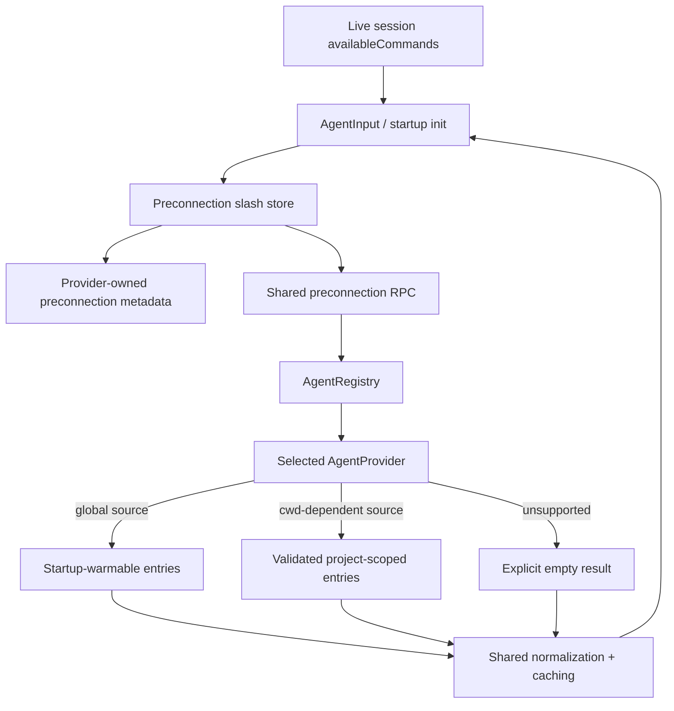
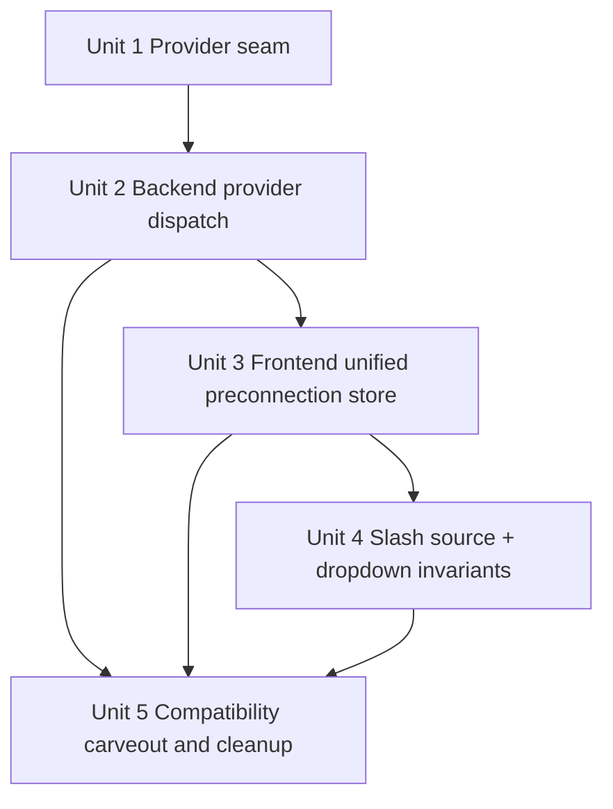

# refactor: Move preconnection slash loading behind providers

## Overview

Move pre-connection slash entry authority out of the shared skills subsystem and into provider-owned ACP seams. The backend should ask the selected provider for preconnection slash metadata and entries, the frontend should consume provider-owned metadata instead of agent-specific capability switches, and the existing Skills Manager/library/plugin flows should remain intact as a separate subsystem rather than staying the hidden authority for agent preconnection loading.

## Problem Frame

Acepe currently satisfies preconnection slash behavior through three separate authorities: a shared Rust `SkillsService` with hardcoded provider roots, an OpenCode-only backend preconnection RPC, and a frontend capability table that decides which agents load remote preconnection commands. That violates the origin requirements because provider identity, skill path resolution, and preconnection support are still decided in shared code instead of by the provider that owns the agent contract (see origin: `docs/brainstorms/2026-04-09-provider-owned-agent-skill-loading-requirements.md`).

The refactor must preserve the user-visible behavior from the earlier preconnect dropdown work — agent-scoped suggestions, no merge with live commands, hidden dropdown for empty preconnection sources, and non-blocking invalid-file handling — while changing the authority boundary so new providers gain support by implementing a provider seam rather than by editing shared switches or root maps.

## Requirements Trace

- R1. Preconnection slash entry discovery is provider-owned rather than shared hardcoded authority.
- R2. Providers without an implementation explicitly return no preconnection entries.
- R3. Shared backend/frontend code stops branching on provider identity for preconnection loading support, path resolution, and source selection.
- R4. Adding support for a provider requires implementing the provider seam, not editing a central registry or capability switch.
- R5. Frontend preconnection source selection and capability reporting come from provider-owned metadata or RPC results.
- R6. Before connection, `/` uses only the selected agent's provider-owned preconnection entries.
- R7. Once live session commands are available, the input switches back to the connected-session source without merging.
- R8. Empty preconnection sources do not open the slash dropdown.
- R9. Providers that load from disk own their path resolution rules, including `.agents` where applicable.
- R10. Invalid or unreadable provider-owned skill files do not block valid siblings.
- R11. Shared code may normalize provider results, but not decide locations or support.
- R12. Shared code may pass validated project context such as cwd, but may not retake authority while doing so.
- R13. Startup caching applies only to provider-returned global sources; cwd-dependent discovery may stay on-demand.
- R14. Existing built-in provider behavior for Claude Code, Cursor, Codex, and OpenCode remains available.
- R15. Copilot support is gained through the same provider-owned seam, not another shared special case.
- R16. This migration is scoped to Claude Code, Cursor, Codex, OpenCode, and Copilot.
- R17. Any retained shared service may only cache/normalize/aggregate provider results for preconnection loading.
- R18. Skills Manager, library skills, plugin skills, and skill-copy surfaces keep working or have an explicit migration path before related shared services are removed.

## Scope Boundaries

- No redesign of the slash dropdown UX beyond preserving existing preconnection/live switching behavior.
- No requirement to unify library skills, plugin skills, and provider-owned preconnection entries into one product surface.
- No requirement to migrate Skills Manager CRUD, tree rendering, or sync ownership in this change.
- No requirement to add file watching if provider startup warmup or on-demand loading is sufficient.
- No requirement to make every provider disk-backed; only provider ownership is mandatory.
- Providers outside the in-scope migration set must preserve their current user-visible preconnection behavior during this refactor; explicit empty results are only acceptable where current behavior is already empty.
- No requirement to add new user-facing failure UI for preconnection load errors in this change, but failure state must remain distinguishable in store state and logs so retry and diagnosis do not collapse into true empty/unsupported state.

## Context & Research

### Relevant Code and Patterns

- `packages/desktop/src-tauri/src/acp/provider.rs` already hosts provider-owned seams with shared default behavior and provider overrides for runtime policy, history loading, and project discovery.
- `packages/desktop/src-tauri/src/acp/registry.rs` is the established shared entry point for resolving a provider by canonical agent id.
- `packages/desktop/src-tauri/src/acp/commands/preconnection_commands.rs` is the current backend preconnection RPC, but it hardcodes OpenCode as the only supported provider.
- `packages/desktop/src-tauri/src/acp/opencode/http_client/mod.rs` already demonstrates provider-owned preconnection command fetching.
- `packages/desktop/src-tauri/src/skills/service.rs` and `packages/desktop/src-tauri/src/skills/commands.rs` currently act as the shared preconnection authority through `skills_list_agent_skills`, but those files also power Skills Manager and must not be casually deleted.
- `packages/desktop/src-tauri/src/skills/sync.rs` still contains provider/path assumptions for library sync targets, reinforcing that Skills Manager compatibility must be handled deliberately rather than by broad deletion.
- `packages/desktop/src/lib/skills/store/preconnection-agent-skills-store.svelte.ts` and `packages/desktop/src/lib/acp/components/agent-input/logic/preconnection-remote-commands-state.svelte.ts` currently split frontend authority between a startup-loaded global skills cache and an OpenCode-only remote loader.
- `packages/desktop/src/lib/acp/components/agent-input/logic/slash-command-source.ts` already isolates source switching logic and has regression tests that can be repointed at the new provider-owned metadata/store.
- `packages/desktop/src/lib/acp/store/provider-metadata.contract.test.ts` is prior art for carrying provider-owned metadata from Rust to TS instead of reconstructing policy in shared UI code.

### Institutional Learnings

- `docs/solutions/best-practices/provider-owned-policy-and-identity-not-ui-projections-2026-04-09.md` is the strongest architectural precedent: shared runtime/UI code should consume explicit provider-owned contracts instead of inferring provider behavior from presentation data or local heuristics.
- `docs/solutions/logic-errors/worktree-session-restore-2026-03-27.md` supports a second rule that matters here: if a capability is safe to warm early, load it at the earliest shared boundary and thread it forward rather than relying on later reconciliation.

### External References

- None. The repo already contains direct local patterns for provider-owned seams, frontend provider metadata projection, startup warmup, and slash-command source switching.

## Key Technical Decisions

| Decision | Rationale |
|---|---|
| Introduce a provider-owned preconnection slash seam adjacent to `AgentProvider` rather than extending `SkillsService` | The provider layer already owns runtime policy and provider-specific lifecycle behavior. Preconnection slash support is the same kind of provider-owned contract. |
| Represent provider preconnection support as provider-owned metadata plus provider-owned loading behavior | The frontend needs to know whether a provider is startup-warmable, cwd-dependent, or unsupported without hardcoding agent ids. |
| Extend the existing provider metadata projection and generated TS contract for preconnection loading mode | The repo already carries provider-owned metadata from Rust into generated frontend types; reusing that contract keeps warmup/on-demand policy synchronized across Rust and TS. |
| Keep one shared backend RPC for preconnection loading, but make it registry/provider-dispatched | Shared transport can remain neutral orchestration. The forbidden part is provider identity branching or provider-specific path resolution in shared code. |
| Keep `AgentRegistry` as a passive lookup boundary only | The registry may resolve provider instances, but it must not become a second policy table for preconnection modes, support flags, or path/layout rules. |
| Retain `SkillsService` for Skills Manager/library/plugin/copy surfaces during this refactor | The origin requirements explicitly scope this migration to preconnection authority. Removing broader skills features would create unnecessary blast radius. |
| Split cache policy by provider-owned loading mode | Global disk-backed sources can be warmed at startup; cwd-dependent sources such as validated project-local layouts or provider RPC calls should load on demand and be cached by the relevant context key. |
| Limit Copilot support in this refactor to validated cwd-aware `.agents` discovery | This gives Copilot a concrete reviewed acceptance boundary now, avoids unreviewed filesystem expansion during implementation, and stays aligned with the project-context validation requirements. |
| Keep the product split explicit for now | This refactor deliberately separates architectural ownership from any broader product unification of Skills Manager, plugin/library surfaces, and preconnection slash discovery; a unified user-facing skill model is a follow-up question, not an implementation-time surprise. |

### In-Scope Provider Loading Strategy

| Provider | Planned preconnection source shape | Cache posture |
|---|---|---|
| Claude Code | Provider-owned disk-backed slash entries from Claude-owned skill layout | Startup warmup |
| Cursor | Provider-owned disk-backed slash entries from Cursor-owned skill layout | Startup warmup |
| Codex | Provider-owned disk-backed slash entries from Codex-owned skill layout | Startup warmup |
| OpenCode | Provider-owned remote/project-scoped preconnection command listing | On-demand per validated project context |
| Copilot | Provider-owned validated cwd-aware `.agents` slash entry loading owned by the Copilot provider | On-demand per validated project context |

## Open Questions

### Resolved During Planning

- **Where should the new ownership seam live?** On the ACP provider boundary, with a concern-local preconnection slash contract adjacent to `AgentProvider` rather than inside the shared skills subsystem.
- **Should `SkillsService` be deleted in this refactor?** No. It should be carved out of the preconnection path but retained for Skills Manager/library/plugin/copy surfaces until those features receive their own migration.
- **Should startup warmup remain app-owned?** Only for provider-declared global sources. Providers that require validated project context should load on demand.
- **How should frontend support be selected?** By provider-owned metadata/RPC results projected from the backend, not by `getAgentCapabilities().loadsRemotePreconnectionCommands`.
- **What is Copilot support in this refactor?** Validated cwd-aware `.agents` discovery only. Any global fallback is out of scope for this plan.

### Deferred to Implementation

- Exact type and helper names for the provider-owned preconnection contract should follow nearby ACP/provider naming once the seam is introduced.
- The exact ordered search paths inside each provider-owned disk resolver can be finalized during implementation as long as tests pin the intended layouts for the in-scope providers and shared code stays path-agnostic.

## High-Level Technical Design

> *This illustrates the intended approach and is directional guidance for review, not implementation specification. The implementing agent should treat it as context, not code to reproduce.*

## Implementation Units

- [ ] **Unit 1: Define the provider-owned preconnection slash contract**

**Goal:** Introduce a provider-owned ACP seam that describes whether a provider supports preconnection slash entries, what context it needs, and how shared code should request them without branching on provider identity.

**Requirements:** R1, R2, R3, R4, R5, R11, R12, R13, R16

**Dependencies:** None

**Files:**
- Create: `packages/desktop/src-tauri/src/acp/preconnection_slash.rs`
- Modify: `packages/desktop/src-tauri/src/acp/provider.rs`
- Modify: `packages/desktop/src-tauri/src/acp/parsers/provider_capabilities.rs`
- Modify: `packages/desktop/src-tauri/src/acp/registry.rs`
- Modify: `packages/desktop/src-tauri/src/acp/providers/claude_code.rs`
- Modify: `packages/desktop/src-tauri/src/acp/providers/cursor.rs`
- Modify: `packages/desktop/src-tauri/src/acp/providers/codex.rs`
- Modify: `packages/desktop/src-tauri/src/acp/providers/opencode.rs`
- Modify: `packages/desktop/src-tauri/src/acp/providers/copilot.rs`
- Modify: `packages/desktop/src/lib/services/acp-types.ts`
- Test: `packages/desktop/src-tauri/src/acp/provider.rs`
- Test: `packages/desktop/src-tauri/src/acp/registry.rs`
- Test: `packages/desktop/src/lib/acp/store/provider-metadata.contract.test.ts`

**Approach:**
- Add a neutral provider-owned contract that lets providers declare their preconnection loading mode and return entries or metadata through shared dispatch without forcing the frontend or transport layer to know agent-specific rules.
- Keep the default trait behavior explicit: unsupported providers return a concrete "no preconnection entries" result rather than falling back to shared filesystem heuristics.
- Extend the existing provider metadata projection so the generated TS contract carries the new preconnection mode/source fields before frontend store work begins.
- Make the registry the shared lookup boundary so backend commands and frontend metadata projection both resolve providers through the same path, while explicitly forbidding the registry from owning provider-specific preconnection policy.

**Execution note:** Start with focused Rust characterization tests that prove unsupported providers return explicit empty support and that shared code no longer needs provider-id switches to determine support.

**Patterns to follow:**
- `packages/desktop/src-tauri/src/acp/provider.rs`
- `packages/desktop/src-tauri/src/acp/registry.rs`
- `packages/desktop/src-tauri/src/acp/providers/opencode.rs`

**Test scenarios:**
- Happy path - a provider that implements the seam advertises supported metadata and can be resolved through `AgentRegistry` without shared provider branching.
- Happy path - a provider that does not override the seam returns an explicit unsupported/empty result instead of falling back to shared logic.
- Edge case - metadata distinguishes startup-warmable global loading from cwd-dependent loading.
- Edge case - the generated TS provider metadata contract exposes the new preconnection fields and stays aligned with the Rust source of truth.
- Error path - provider lookup failure for an unknown agent id returns an empty/unsupported result at the shared boundary without synthesizing a fallback filesystem source.
- Integration - in-scope built-in providers expose the intended loading mode through the registry/provider seam, and a new provider can add preconnection support without editing shared preconnection policy outside normal provider registration.

**Verification:**
- The provider layer exposes a single neutral preconnection contract that backend and frontend orchestration can consume without agent-id switches.
- Unsupported providers are explicit and deterministic.

- [ ] **Unit 2: Replace shared preconnection authority with provider-dispatched backend loading**

**Goal:** Make the backend preconnection RPC obtain entries through the provider seam for all in-scope providers, including Copilot, while preserving Skills Manager as a separate subsystem.

**Requirements:** R1, R2, R3, R4, R9, R10, R11, R12, R14, R15, R16, R17, R18

**Dependencies:** Unit 1

**Files:**
- Modify: `packages/desktop/src-tauri/src/acp/commands/preconnection_commands.rs`
- Modify: `packages/desktop/src-tauri/src/acp/opencode/http_client/mod.rs`
- Modify: `packages/desktop/src-tauri/src/acp/providers/claude_code.rs`
- Modify: `packages/desktop/src-tauri/src/acp/providers/cursor.rs`
- Modify: `packages/desktop/src-tauri/src/acp/providers/codex.rs`
- Modify: `packages/desktop/src-tauri/src/acp/providers/copilot.rs`
- Modify: `packages/desktop/src-tauri/src/skills/service.rs`
- Modify: `packages/desktop/src-tauri/src/skills/commands.rs`
- Test: `packages/desktop/src-tauri/src/acp/commands/tests.rs`
- Test: `packages/desktop/src-tauri/src/skills/service.rs`

**Approach:**
- Convert the shared preconnection command into neutral orchestration that validates shared inputs such as cwd, resolves the selected provider through the registry, and delegates all provider-specific loading to the provider-owned seam.
- Reuse neutral parsing helpers where valuable, but do not leave `SkillsService` as the preconnection authority. If disk-backed providers need shared parsing utilities, extract them as provider-consumable helpers rather than a shared provider/path map.
- Migrate the in-scope built-in providers to their provider-owned implementations: Claude/Cursor/Codex keep provider-local disk-backed behavior, OpenCode keeps provider-owned remote listing, and Copilot gains provider-owned `.agents`-aware loading.
- By the end of this unit, backend preconnection loading for agent input must no longer depend on `skills_list_agent_skills` or the shared hardcoded agent-root list; any remaining skills APIs are for Skills Manager surfaces only.
- Leave Skills Manager endpoints intact, but keep their compatibility verification external to the preconnection loading path instead of making them co-own the migration.

**Execution note:** Add failing backend tests first for Copilot visibility, OpenCode dispatch without an OpenCode-only `if`, and invalid-skill sibling survival before moving authority.

**Patterns to follow:**
- `packages/desktop/src-tauri/src/acp/commands/preconnection_commands.rs`
- `packages/desktop/src-tauri/src/acp/opencode/http_client/mod.rs`
- `packages/desktop/src-tauri/src/skills/service.rs`

**Test scenarios:**
- Happy path - Claude/Cursor/Codex providers return preconnection entries from their provider-owned disk layouts through the shared RPC.
- Happy path - OpenCode preconnection entries still come from the provider-owned remote command path through the same shared RPC.
- Happy path - Copilot provider returns `.agents`-backed preconnection entries through the same shared RPC without adding a shared `copilot` special case.
- Edge case - a provider with no usable entries returns an empty list and does not trigger fallback loading from `SkillsService`.
- Edge case - invalid or unreadable provider-owned skill files are skipped while valid sibling entries still load.
- Error path - cwd-dependent providers reject invalid/unvalidated cwd inputs through the shared validation boundary.
- Integration - `skills_list_agent_skills` and other Skills Manager commands continue working for their existing surfaces even though preconnection loading no longer depends on them.

**Verification:**
- The backend preconnection RPC dispatches entirely through provider-owned contracts for the in-scope providers.
- Copilot participates through the same seam as the other providers.
- Shared skills commands remain available for Skills Manager without staying the preconnection source of truth.
- The agent-input backend path no longer consults the legacy preconnection-specific skills API.

- [ ] **Unit 3: Replace split frontend preconnection stores with provider-owned metadata-driven state**

**Goal:** Unify startup-warm and on-demand preconnection loading behind one frontend store/state model driven by provider-owned metadata instead of hardcoded capability switches.

**Requirements:** R3, R5, R6, R11, R12, R13, R14, R15, R17

**Dependencies:** Units 1-2

**Files:**
- Create: `packages/desktop/src/lib/acp/store/preconnection-slash-entries-store.svelte.ts`
- Modify: `packages/desktop/src/lib/components/main-app-view.svelte`
- Modify: `packages/desktop/src/lib/components/main-app-view/logic/managers/initialization-manager.ts`
- Modify: `packages/desktop/src/lib/acp/components/agent-input/logic/preconnection-remote-commands-state.svelte.ts`
- Modify: `packages/desktop/src/lib/skills/store/preconnection-agent-skills-store.svelte.ts`
- Modify: `packages/desktop/src/lib/acp/constants/agent-capabilities.ts`
- Test: `packages/desktop/src/lib/components/main-app-view/tests/initialization-manager.test.ts`
- Test: `packages/desktop/src/lib/acp/components/agent-input/logic/preconnection-remote-commands-state.vitest.ts`
- Test: `packages/desktop/src/lib/skills/store/preconnection-agent-skills-store.vitest.ts`
- Test: `packages/desktop/src/lib/acp/constants/__tests__/agent-capabilities.test.ts`
- Test: `packages/desktop/src/lib/acp/store/provider-metadata.contract.test.ts`

**Approach:**
- Replace the current split between a global skill cache and an OpenCode-only remote loader with a single provider-owned preconnection store keyed by provider-owned source identity plus any required validated project context.
- Make the new `preconnection-slash-entries-store.svelte.ts` the intended end-state authority for agent input. `preconnection-agent-skills-store.svelte.ts` may survive temporarily only as a migration shim while callers are moved, and Unit 5 should retire that shim if it is no longer needed.
- In startup sequencing, load provider metadata first inside `InitializationManager.loadBasicMetadata()`, then warm only providers whose metadata says they are startup-warmable. Cwd-dependent providers remain unloaded until agent input requests them.
- Warm only providers whose metadata says their preconnection entries are safe to preload globally; load cwd-dependent providers on demand and cache them by the relevant source key rather than by project path alone.
- Remove the preconnection loading decision from `getAgentCapabilities()`. If the shared capability helper still exists for unrelated surfaces such as `openInFinderTarget`, it should stop carrying preconnection authority.
- Keep the frontend consuming plain slash command data for the input layer, but make the decision of *how* that data is obtained entirely metadata-driven.
- Keep failure state distinct from true empty/unsupported state in the unified store so retry and diagnostics remain possible even though the dropdown stays hidden for both in this refactor.

**Execution note:** Start with characterization tests around the current startup warmup and OpenCode remote-loading behavior, then replace the capability switch with provider-metadata-driven tests.

**Patterns to follow:**
- `packages/desktop/src/lib/components/main-app-view/logic/managers/initialization-manager.ts`
- `packages/desktop/src/lib/acp/store/provider-metadata.contract.test.ts`
- `packages/desktop/src/lib/skills/store/preconnection-agent-skills-store.svelte.ts`

**Test scenarios:**
- Happy path - startup warmup preloads only providers marked as startup-warmable and leaves cwd-dependent providers unloaded until requested.
- Happy path - on-demand loading for a cwd-dependent provider caches results by the correct context key and reuses them on repeat access.
- Happy path - two agents on the same provider but with different provider-owned source identities do not share stale cached entries.
- Edge case - switching agents with different loading modes changes which backend call or warm cache is used without hardcoded agent checks.
- Edge case - a second agent using the same project path does not reuse stale cached entries from another agent or provider.
- Error path - provider-owned preconnection fetch failure leaves the store retryable and does not break app initialization.
- Integration - frontend metadata projection remains aligned with the Rust provider contract when new preconnection support modes are added.

**Verification:**
- No frontend preconnection loading decision depends on `loadsRemotePreconnectionCommands` or a hardcoded agent-id table.
- Startup warmup and on-demand loading both work through provider-owned metadata.
- Agent-input preconnection warmup and lookup consume the unified store rather than the legacy preconnection-specific skills API path.

- [ ] **Unit 4: Reassert slash input source and dropdown invariants on top of the new store**

**Goal:** Keep the slash dropdown behavior correct once the provider-owned store replaces the old split stores: live commands win after connect, preconnection sources stay agent-scoped, and empty preconnection sources stay hidden.

**Requirements:** R6, R7, R8, R14

**Dependencies:** Unit 3

**Files:**
- Modify: `packages/desktop/src/lib/acp/components/agent-input/logic/slash-command-source.ts`
- Modify: `packages/desktop/src/lib/acp/components/agent-input/logic/slash-command-source.vitest.ts`
- Modify: `packages/desktop/src/lib/acp/components/agent-input/agent-input-ui.svelte`
- Test: `packages/desktop/src/lib/acp/components/agent-input.test.ts`
- Test: `packages/desktop/src/lib/acp/components/agent-input/state/__tests__/agent-input-state-triggers.vitest.ts`

**Approach:**
- Update the source-selection helper so live connected-session commands are the only source once available, with no fallback to preconnection entries after connection just because the live list is temporarily empty.
- Keep preconnection entries scoped to the selected agent/provider context returned by the unified store.
- Tighten the dropdown visibility rule so empty preconnection sources do not open or render the dropdown while preserving existing connected-session behavior.
- Preserve the existing query/refilter interaction when the source swaps from preconnection entries to live commands.

**Patterns to follow:**
- `packages/desktop/src/lib/acp/components/agent-input/logic/slash-command-source.ts`
- `packages/desktop/src/lib/acp/components/agent-input/agent-input-ui.svelte`

**Test scenarios:**
- Happy path - before connection, a selected agent with provider-owned preconnection entries shows only those entries.
- Happy path - once live session commands arrive, the source switches to live commands without merging.
- Edge case - a selected agent with no preconnection entries keeps the dropdown hidden rather than showing an empty state.
- Edge case - changing the selected agent before connection swaps preconnection entries without leaking commands from the prior agent.
- Edge case - if the dropdown is open on preconnection entries and live commands arrive, the query text is preserved and the list refilters against the live source.
- Error path - if the preconnection store has no data because loading failed, slash trigger handling stays closed and does not throw.

**Verification:**
- The slash input exposes exactly one authoritative command source at a time.
- Empty preconnection sources no longer open the dropdown.

- [ ] **Unit 5: Preserve Skills Manager compatibility and remove obsolete preconnection authority**

**Goal:** Finish the migration by making the new provider-owned path the sole preconnection authority while leaving non-preconnection skills surfaces working and clearly separated.

**Requirements:** R3, R11, R17, R18

**Dependencies:** Units 2-4

**Files:**
- Modify: `packages/desktop/src-tauri/src/skills/commands.rs`
- Modify: `packages/desktop/src/lib/skills/api/skills-api.ts`
- Modify: `packages/desktop/src/lib/utils/tauri-client/skills.ts`
- Modify: `packages/desktop/src/lib/utils/tauri-client/commands.ts`
- Modify: `packages/desktop/src/lib/skills/store/preconnection-agent-skills-store.svelte.ts`
- Test: `packages/desktop/src/lib/skills/store/preconnection-agent-skills-store.vitest.ts`
- Test: `packages/desktop/src/lib/components/main-app-view/tests/initialization-manager.test.ts`

**Approach:**
- Remove or deprecate only the specific shared APIs and startup flows that still imply `SkillsService` is the source of truth for agent preconnection slash loading.
- Retire the old preconnection store/shim if Unit 3 made it obsolete, or leave it as a thin compatibility wrapper only if an existing non-preconnection caller still needs it temporarily.
- Keep Skills Manager tree/CRUD/plugin/library surfaces functioning, but verify compatibility from the outside instead of modifying sync ownership or broad skills internals unless a failing test proves that work is required.
- Avoid broad cleanup that reopens plugin/library ownership questions; the point of this unit is to make the architectural split explicit and safe.

**Patterns to follow:**
- `packages/desktop/src-tauri/src/skills/commands.rs`
- `packages/desktop/src/lib/utils/tauri-client/skills.ts`

**Test scenarios:**
- Happy path - Skills Manager tree/list operations still return the expected data after preconnection slash loading migrates away.
- Edge case - removing the old preconnection-specific API path does not break unrelated Skills Manager surfaces that still use shared skills APIs.
- Error path - a Skills Manager failure does not affect preconnection slash loading because the input path no longer depends on it.
- Integration - the frontend no longer calls the legacy preconnection-specific shared skills API during slash input warmup or lookup.

**Verification:**
- Shared skills APIs are no longer the hidden authority for agent preconnection slash loading.
- Skills Manager and related non-preconnection surfaces remain functional.

## System-Wide Impact

- **Interaction graph:** `AgentInput` and startup initialization will depend on provider-owned preconnection metadata plus a unified preconnection store; the backend preconnection RPC will depend on `AgentRegistry` + provider seam instead of `SkillsService`.
- **Error propagation:** provider-owned loading errors should surface as empty/retryable preconnection state and logs, not as app-startup failure or fallback to shared heuristics.
- **State lifecycle risks:** startup caches must avoid persisting cwd-dependent data under the wrong scope; on-demand caches must key by provider-owned source identity plus any relevant project context to avoid cross-agent leakage.
- **API surface parity:** Rust provider metadata projection and TS provider metadata consumers must stay in sync; provider-owned loading must work across all in-scope built-in providers.
- **Integration coverage:** unit tests alone will not prove the full migration; coverage should include backend provider dispatch, frontend metadata projection, startup warmup, on-demand loading, and agent-input source switching.
- **Unchanged invariants:** live connected-session slash commands remain authoritative after connect; Skills Manager/library/plugin/copy surfaces remain separate features; this refactor does not redesign slash dropdown rendering or plugin/library product behavior.

## Risks & Dependencies

| Risk | Mitigation |
|------|------------|
| Provider-owned disk loading duplicates parsing/path logic from `SkillsService` in a brittle way | Extract only neutral parsing utilities as needed and keep provider-specific roots/layout choice inside providers. |
| Copilot remains empty during migration because the shared fallback is removed before provider-owned support lands | Add Copilot provider coverage in the same backend migration unit and gate cleanup on that regression test. |
| Cwd-dependent caches leak entries across providers or projects | Cache by provider plus validated project context, and add explicit cross-agent reuse tests. |
| Skills Manager regressions are introduced while carving out preconnection authority | Keep the migration scoped, preserve existing Skills Manager endpoints, and add compatibility tests that prove the separation. |

## Documentation / Operational Notes

- The reviewed requirements document for this work is `docs/brainstorms/2026-04-09-provider-owned-agent-skill-loading-requirements.md`.
- This refactor should be executed with TDD/characterization-first posture because it changes a live cross-layer ownership boundary while preserving existing user-visible slash behavior.
- This plan intentionally keeps richer user-facing failure affordances and any broader unification of Skills Manager/plugin/library/preconnection discovery out of scope; those are follow-up product questions once provider ownership is correct.
- After implementation, `/ce:review` should specifically inspect for lingering shared provider-id switches in both Rust and TS preconnection paths.

## Sources & References

- **Origin document:** `docs/brainstorms/2026-04-09-provider-owned-agent-skill-loading-requirements.md`
- Related requirements: `docs/brainstorms/2026-03-28-preconnect-agent-skill-dropdown-requirements.md`
- Superseded prior plan: `docs/plans/2026-03-28-001-feat-preconnect-agent-skills-plan.md`
- Relevant code: `packages/desktop/src-tauri/src/acp/provider.rs`
- Relevant code: `packages/desktop/src-tauri/src/acp/commands/preconnection_commands.rs`
- Relevant code: `packages/desktop/src-tauri/src/skills/service.rs`
- Relevant code: `packages/desktop/src/lib/acp/components/agent-input/logic/slash-command-source.ts`
- Relevant code: `packages/desktop/src/lib/acp/components/agent-input/logic/preconnection-remote-commands-state.svelte.ts`
- Related learning: `docs/solutions/best-practices/provider-owned-policy-and-identity-not-ui-projections-2026-04-09.md`
