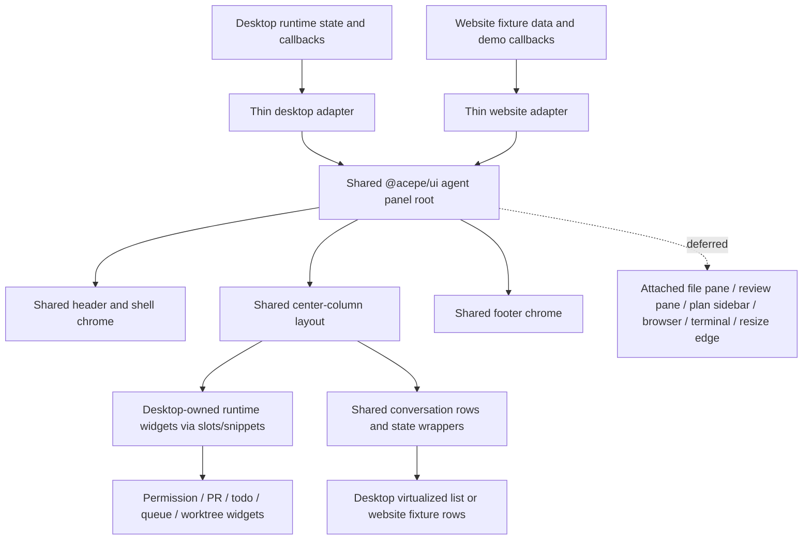

# refactor: Extract desktop-shared agent panel

## Overview

Replace the current split agent-panel architecture with a desktop-derived shared panel surface in `packages/ui`. Desktop should stop being the only real panel composer, website should stop assembling its own parallel renderer, and both surfaces should render the same extracted presentational component tree for the panel subtree.

This plan assumes the **agent panel subtree** is the migration target. The surrounding homepage shell may remain website-composed for now as long as the panel subtree itself stops using website-only composition components.

## Problem Frame

The current result still fails the original reset intent from `docs/brainstorms/2026-04-10-agent-panel-ui-extraction-reset-requirements.md`:

- desktop remains the true owner of the real panel composition
- website renders a parallel composition via `packages/website/src/lib/components/website-agent-panel-renderer.svelte`
- several shared panel exports exist primarily to support the website path rather than to represent extracted desktop UI

That means the website is still not a trustworthy rendering of the product panel, and `packages/ui` is only partially serving as the canonical presentational surface. The fix is not another adapter layer. The fix is to extract the real desktop panel composition boundary into `packages/ui`, keep runtime ownership in desktop, and force website through that same shared boundary.

## Requirements Trace

- R1. Extract the shared panel surface from the real desktop panel, not from a website-first abstraction `(see origin: docs/brainstorms/2026-04-10-agent-panel-ui-extraction-reset-requirements.md)`.
- R2. Keep `packages/ui` dumb and controlled: explicit props, callbacks, and snippet/slot seams only; no desktop stores, ACP runtime helpers, or Tauri imports.
- R3. Make website consume the same shared panel composition as desktop for the panel subtree; delete the website-only renderer path afterward.
- R4. Preserve the desktop-owned runtime seam: virtualization, thread-follow, session wiring, review persistence, browser/terminal integrations, and side effects remain in desktop.
- R5. Define a mandatory first-shipment shared slice and an explicit defer list for visually integrated panel regions that are not yet safe to extract.
- R6. Add auditable parity coverage for named panel states so completion is judged against desktop, not against a new interpretation.

## Scope Boundaries

- In scope: the agent panel subtree rendered inside the website demo and the desktop panel.
- Out of scope for this pass: full homepage-shell de-duplication outside the panel subtree.
- Fixed first-shipment defer list (only a plan update may promote an item out of this list):
  - `packages/desktop/src/lib/acp/components/main-app-view/components/content/agent-attached-file-pane.svelte`
  - `packages/desktop/src/lib/acp/components/agent-panel/components/agent-panel-review-content.svelte`
  - `packages/desktop/src/lib/acp/components/checkpoint/checkpoint-timeline.svelte`
  - `packages/desktop/src/lib/acp/components/agent-panel/components/agent-panel-terminal-drawer.svelte`
  - browser sidebar composition in `packages/desktop/src/lib/acp/components/agent-panel/components/agent-panel.svelte`
  - plan sidebar composition in `packages/desktop/src/lib/acp/components/agent-panel/components/agent-panel.svelte`
  - resize-edge behavior in `packages/desktop/src/lib/acp/components/agent-panel/components/agent-panel-resize-edge.svelte`
- Do not introduce a new scene-first or website-first panel contract to bridge the migration.

## Mandatory First-Shipment Shared Slice

The first shipment is complete only when these panel-subtree surfaces are shared and used by both desktop and website:

- shared panel composition root in `packages/ui`
- shared desktop-derived header presentation
- shared center-column framing for state/body/pre-composer/composer/footer
- shared conversation row presentation and lightweight state wrappers
- website panel subtree routed directly through the same shared root, with the website-only renderer path deleted

These surfaces are sufficient to make the website panel recognizably the same panel as desktop while preserving the approved desktop runtime seam.

## Injected Child Migration Matrix

This matrix keeps the website migration honest: deleting the website-only renderer is not allowed until every non-deferred injected child below is either synthesized on the website through the shared root or explicitly hidden as deferred.

| Surface | Current owner | Phase-1 website posture | Notes |
|---|---|---|---|
| `ModifiedFilesHeader` | desktop runtime widget | **Required in phase 1** | Needed for visible status/review context parity |
| `TodoHeader` | desktop runtime widget | **Required in phase 1** | Needed for task/progress legibility above the composer |
| `QueueCardStrip` | desktop runtime widget | **Required in phase 1** | Needed where queue context is part of the panel state being demonstrated |
| `AgentInput` composer presentation | desktop runtime widget | **Required in phase 1** | Composer readiness is part of the mandatory parity slice |
| `PermissionBar` | desktop runtime widget | Deferred | Hide on website unless a clearly non-interactive demo state is intentionally added |
| `PrStatusCard` | desktop runtime widget | Deferred | Do not show as broken or empty on website |
| `AgentErrorCard` | desktop runtime widget | Optional targeted fixture | Only required when exercising the named error/recovery parity state |
| `WorktreeSetupCard` | desktop runtime widget | Deferred | Keep out of website until there is a desktop-derived shared presentation |
| `AgentInstallCard` | desktop runtime widget | Deferred | Keep out of website until there is a desktop-derived shared presentation |

Any non-deferred surface above must appear in at least one named parity state and in the implementation PR's parity artifact before first-shipment signoff.

## Parity Review Method

Completion should be reviewed against named states, not against a general visual impression:

- **Ready / empty panel** — shell, header, composer-ready state, footer
- **Active conversation** — header, conversation rows, pre-composer rail, composer, footer
- **Running / status context visible** — modified-files or plan/status context above the composer, conversation still intact
- **Error / recovery state** — header, error presentation, composer availability, footer

Evidence for each named state should include:

- desktop render through the shared root
- website render through the same shared root
- one import-path check proving the website panel subtree no longer depends on `packages/website/src/lib/components/website-agent-panel-renderer.svelte`
- side-by-side screenshots plus a short checklist covering layout, spacing, typography, borders/elevation, iconography, empty/loading/error/streaming states, and local interaction states
- targeted tests covering the state-specific surface that changed

Parity comparison must run at the same normalized panel frame on both surfaces: the desktop panel rendered with all deferred panes closed, and the website panel rendered at that same shared-root width inside the homepage card.

Deferred regions must not appear as broken affordances on the website demo. For first shipment, each deferred region must either be hidden entirely in the website panel subtree or replaced with a clearly non-interactive unavailable state that is explicitly called out in the parity evidence.

## Context & Research

### Relevant Code and Patterns

- `packages/desktop/src/lib/acp/components/agent-panel/components/agent-panel.svelte` is the real panel composition root today. Its snippet structure already expresses the correct ownership split: header, optional side panes, top bar, body, pre-composer rail, composer, footer, drawers, and trailing panes.
- `packages/desktop/src/lib/acp/components/agent-panel/components/agent-panel-header.svelte` already adapts a shared UI layout component, which is a good pattern for a thin desktop wrapper around shared presentation.
- `packages/desktop/src/lib/acp/components/agent-panel/components/agent-panel-content.svelte` and `packages/desktop/src/lib/acp/components/agent-panel/components/virtualized-entry-list.svelte` show the approved seam for conversation extraction: desktop owns list behavior and virtualization; shared UI owns row presentation.
- `packages/ui/src/components/agent-panel/agent-panel-shell.svelte`, `agent-panel-footer-chrome.svelte`, `agent-panel-header.svelte`, `agent-panel-state-panel.svelte`, and `agent-panel-conversation-entry.svelte` are the strongest existing shared primitives to preserve or build on.
- `packages/website/src/lib/components/website-agent-panel-renderer.svelte` and `packages/website/src/lib/components/agent-panel-demo-scene.ts` are the current divergence path. They must stop being the composition authority for the panel subtree.
- `packages/desktop/src/lib/acp/components/agent-panel/components/agent-panel-compose-stack.structure.test.ts` and `agent-panel-footer-order.structure.test.ts` capture important composition invariants today, even though their current source-string approach is brittle.

### Institutional Learnings

- `docs/solutions/best-practices/provider-owned-policy-and-identity-not-ui-projections-2026-04-09.md` reinforces the key boundary for this refactor: shared UI must not become the authority for provider/runtime policy. Presentation shape cannot be allowed to drive provider behavior.
- `docs/solutions/logic-errors/thinking-indicator-scroll-handoff-2026-04-07.md` reinforces the approved conversation seam: reveal/follow logic and virtualization stay desktop-owned, while shared extraction stops at presentational rows and light state surfaces.

### External References

- None. The codebase already has strong local patterns for this refactor, and external research would add less value than staying tightly grounded in the current desktop ownership model.

## Key Technical Decisions

| Decision | Choice | Rationale |
|---|---|---|
| Shared composition boundary | Extract a desktop-derived shared panel root from the current desktop snippet structure | This eliminates the current split where desktop owns the real composition and website owns a lookalike renderer |
| Shared state flow | Use explicit props, callbacks, and snippet/slot seams rather than context-driven hidden state | The user requirement is for dumb shared UI; explicit seams also make desktop/runtime ownership reviewable |
| Conversation seam | Keep `VirtualizedEntryList`, thread-follow, and session wiring in desktop; share row presentation and lightweight state wrappers only | This follows the existing proven seam and avoids reintroducing the scroll/follow bugs already documented in the repo |
| Website migration posture | Replace `WebsiteAgentPanelRenderer` with direct consumption of the desktop-derived shared panel root | The website should stop being a second panel author and become a fixture-driven consumer |
| Deletion posture | Remove panel-specific shared exports and website helpers that are only justified by the parallel website composition path | Reuse only counts if one presentational implementation remains per shared region |

## Open Questions

### Resolved During Planning

- **What is the primary scope boundary?** The panel subtree is the required reset target. The homepage shell can stay website-composed for now if it consumes shared/desktop-aligned surfaces instead of a website-only panel renderer.
- **How should shared panel state flow?** Through explicit props, callbacks, and snippet/slot seams, not shared context or runtime-owned hidden state.
- **Where does shared conversation stop?** At presentational rows and simple state wrappers. Desktop retains virtualization, reveal/follow behavior, tool routing, and session context wiring.
- **What is the end-state for `AgentPanelSceneModel`?** It must not remain a public shared panel API after first shipment. If fixture helpers still need a scene-like shape, that shape becomes internal to the website/demo path and is removed from the `@acepe/ui` public barrels.

### Deferred to Implementation

- **Which current UI files are refactored in place versus replaced with desktop-derived counterparts?** The plan names the seams and expected ownership; final filenames can be settled once the shared root lands.
- **Should existing source-string structure tests be fully replaced during this refactor?** The implementation should replace them where practical with behavioral or SSR-level composition assertions, but the exact replacement set can be decided while touching the seam.

## High-Level Technical Design

> *This illustrates the intended approach and is directional guidance for review, not implementation specification. The implementing agent should treat it as context, not code to reproduce.*

## Implementation Units

- [ ] **Unit 1: Extract the shared panel composition root from desktop**

**Goal:** Move the real panel composition boundary out of desktop-only markup and into a canonical shared root under `packages/ui`.

**Requirements:** R1, R2, R4

**Dependencies:** None

**Files:**
- Create: `packages/ui/src/components/agent-panel/agent-panel.svelte`
- Modify: `packages/ui/src/components/agent-panel/agent-panel-shell.svelte`
- Modify: `packages/ui/src/components/agent-panel/index.ts`
- Modify: `packages/ui/src/index.ts`
- Modify: `packages/desktop/src/lib/acp/components/agent-panel/components/agent-panel.svelte`
- Test: `packages/ui/src/components/agent-panel/__tests__/agent-panel.test.ts`
- Test: `packages/desktop/src/lib/acp/components/agent-panel/components/agent-panel-layout.test.ts`

**Approach:**
- Extract the current desktop snippet layout into a shared presentational root so both desktop and website call through the same composition surface.
- Preserve the existing slot/snippet seams for header, panes, top bar, body, pre-composer rail, composer, footer, drawers, and trailing panes.
- Keep width/fullscreen/drag-edge styling props explicit so desktop remains the runtime owner while the layout becomes shared.

**Execution note:** Start with characterization coverage around the current desktop composition order and layout behavior. Do not add new raw-source string tests for this seam.

**Patterns to follow:**
- `packages/desktop/src/lib/acp/components/agent-panel/components/agent-panel.svelte`
- `packages/ui/src/components/agent-panel/agent-panel-shell.svelte`

**Test scenarios:**
- Happy path — desktop renders through the shared root and still shows header, center column, footer, and optional panes in the same visible order.
- Edge case — omitting leading/trailing panes, drawers, or top bar does not leave broken gaps or collapse the center column.
- Integration — fullscreen and drag-edge props still affect the shared root layout the same way the desktop panel expects.

**Verification:**
- Desktop panel markup delegates to a shared `packages/ui` root for composition.
- The shared root can render with only the panel column populated, which the website will need.

- [ ] **Unit 2: Extract the desktop header presentation into shared UI**

**Goal:** Make the actual desktop header presentation the shared header surface used by both desktop and website.

**Requirements:** R1, R2

**Dependencies:** Unit 1

**Files:**
- Modify: `packages/ui/src/components/agent-panel/agent-panel-header.svelte`
- Modify: `packages/ui/src/components/agent-panel/types.ts`
- Modify: `packages/desktop/src/lib/acp/components/agent-panel/components/agent-panel-header.svelte`
- Modify: `packages/ui/src/components/agent-panel/index.ts`
- Test: `packages/ui/src/components/agent-panel/__tests__/agent-panel-header.test.ts`
- Test: `packages/desktop/src/lib/acp/components/agent-panel/__tests__/agent-panel-component.test.ts`

**Approach:**
- Promote the real desktop header states into the shared component: standard session header, status icon, action menu, fullscreen/close controls, and worktree-close confirmation surface.
- Leave desktop wrappers responsible only for translating runtime/session/worktree state into shared props and callbacks.
- Make website fixtures feed the same header contract instead of going through `AgentPanelModelHeader`.

**Patterns to follow:**
- `packages/desktop/src/lib/acp/components/agent-panel/components/agent-panel-header.svelte`
- `packages/ui/src/components/agent-panel/agent-panel-header.svelte`

**Test scenarios:**
- Happy path — a normal session header renders title, project badge, status indicator, and action controls with the same visible structure desktop uses today.
- Edge case — worktree-close confirmation replaces the normal header with the correct confirm/cancel/remove affordances.
- Error path — disabled or absent action callbacks hide or disable the corresponding controls without requiring runtime imports in shared UI.
- Integration — desktop header wrapper still wires fullscreen, close, export, and worktree callbacks into the shared header without changing behavior.

**Verification:**
- Desktop and website both render the same shared header component for the panel subtree.

- [ ] **Unit 3: Extract the desktop center-column layout while keeping runtime widgets injected**

**Goal:** Share the visible center-column layout of the panel without pulling runtime-owned widgets or list behavior into `packages/ui`.

**Requirements:** R1, R2, R4, R5

**Dependencies:** Unit 1, Unit 2

**Files:**
- Create: `packages/ui/src/components/agent-panel/agent-panel-center-column.svelte`
- Create: `packages/ui/src/components/agent-panel/agent-panel-pre-composer-rail.svelte`
- Modify: `packages/ui/src/components/agent-panel/agent-panel-state-panel.svelte`
- Modify: `packages/ui/src/components/agent-panel/agent-panel-footer-chrome.svelte`
- Modify: `packages/desktop/src/lib/acp/components/agent-panel/components/agent-panel-content.svelte`
- Modify: `packages/desktop/src/lib/acp/components/agent-panel/components/agent-panel-footer.svelte`
- Modify: `packages/desktop/src/lib/acp/components/agent-panel/components/virtualized-entry-list.svelte`
- Test: `packages/desktop/src/lib/acp/components/agent-panel/components/agent-panel-compose-stack.structure.test.ts`
- Test: `packages/desktop/src/lib/acp/components/agent-panel/components/agent-panel-footer-order.structure.test.ts`
- Test: `packages/desktop/src/lib/acp/components/agent-panel/logic/__tests__/virtualized-entry-display.test.ts`
- Test: `packages/desktop/src/lib/acp/components/agent-panel/components/__tests__/virtualized-entry-list.svelte.vitest.ts`
- Test: `packages/desktop/src/lib/acp/components/agent-panel/logic/__tests__/thread-follow-controller.test.ts`

**Approach:**
- Extract the desktop center-column framing: state panel shell, conversation body container, above-composer rail spacing, composer gutter, and footer positioning.
- Keep runtime-heavy widgets desktop-owned and injected into the shared rail: `PermissionBar`, `PrStatusCard`, `ModifiedFilesHeader`, `TodoHeader`, `QueueCardStrip`, `AgentInput`, worktree/install/error widgets, and any equivalent runtime cards.
- Preserve the current approved conversation seam: shared rows and state wrappers are fine; virtualization, follow logic, and tool routing stay in desktop.

**Execution note:** Treat the existing scroll/follow behavior as characterization-sensitive. Do not widen the shared seam beyond presentational rows and wrappers.

**Patterns to follow:**
- `packages/desktop/src/lib/acp/components/agent-panel/components/agent-panel.svelte`
- `packages/desktop/src/lib/acp/components/agent-panel/components/agent-panel-content.svelte`
- `packages/desktop/src/lib/acp/components/agent-panel/components/virtualized-entry-list.svelte`

**Test scenarios:**
- Happy path — the above-composer widgets still render in the same visible order above the composer after desktop switches to the shared rail.
- Edge case — ready, error, and project-selection states still render through the shared state surfaces without conversation markup leaking in.
- Error path — inline error/install/worktree states can appear above the composer without collapsing composer spacing or footer placement.
- Integration — the virtualized conversation still follows the latest reveal target correctly and still respects manual detach behavior.

**Verification:**
- Desktop center-column layout is visibly routed through shared `packages/ui` components.
- Desktop runtime widgets remain in desktop files and arrive via explicit injected children rather than shared runtime logic.

- [ ] **Unit 4: Lock the conversation seam and parity-sensitive behavior**

**Goal:** Preserve the approved desktop-owned conversation behavior while making the shared row/state seam explicit and reviewable.

**Requirements:** R2, R4, R6

**Dependencies:** Unit 3

**Files:**
- Modify: `packages/desktop/src/lib/acp/components/agent-panel/components/virtualized-entry-list.svelte`
- Modify: `packages/desktop/src/lib/acp/components/agent-panel/scene/desktop-agent-panel-scene.ts`
- Modify: `packages/ui/src/components/agent-panel/types.ts`
- Test: `packages/desktop/src/lib/acp/components/agent-panel/logic/__tests__/virtualized-entry-display.test.ts`
- Test: `packages/desktop/src/lib/acp/components/agent-panel/logic/__tests__/thread-follow-controller.test.ts`
- Test: `packages/desktop/src/lib/acp/components/agent-panel/components/__tests__/virtualized-entry-list.svelte.vitest.ts`

**Approach:**
- Treat the current desktop conversation seam as a guarded boundary: shared UI owns row rendering and simple state display, while desktop continues to own reveal targeting, resize-follow behavior, tool routing, and session context.
- Keep the shared types aligned to that seam so the website can feed the same row/state contract without gaining a second composition API.
- Use the existing logic tests as the stop condition for any conversation-surface changes touching the shared boundary.

**Execution note:** Characterization-first. This unit exists to keep the refactor from silently broadening the shared seam under the pressure of website parity.

**Patterns to follow:**
- `packages/desktop/src/lib/acp/components/agent-panel/components/virtualized-entry-list.svelte`
- `docs/solutions/logic-errors/thinking-indicator-scroll-handoff-2026-04-07.md`

**Test scenarios:**
- Happy path — shared conversation rows still render the same entry types desktop expects.
- Edge case — synthetic thinking rows remain visible in the correct place without changing which node desktop follows for resize observation.
- Error path — tool-row routing and mixed entry stacks still resolve correctly when shared row rendering is exercised through the desktop list.
- Integration — send-time reveal, same-frame thinking handoff, and manual-detach behavior remain unchanged.

**Verification:**
- Desktop still owns the conversation container behavior, but the shared seam is explicit and unchanged by website adoption.

- [ ] **Unit 5: Force the website panel subtree through the desktop-derived shared root**

**Goal:** Replace website-owned panel composition with direct consumption of the shared desktop-derived panel surface.

**Requirements:** R1, R3, R4, R6

**Dependencies:** Unit 1, Unit 2, Unit 3, Unit 4

**Files:**
- Modify: `packages/website/src/lib/components/main-app-view-demo.svelte`
- Modify: `packages/website/src/lib/components/agent-panel-demo-scene.ts`
- Delete: `packages/website/src/lib/components/website-agent-panel-renderer.svelte`
- Modify: `packages/website/src/lib/components/main-app-view-demo.test.ts`
- Create or modify a dedicated website panel-root assertion test near `packages/website/src/lib/components/`
- Test: `packages/website/src/lib/components/main-app-view-demo.test.ts`

**Approach:**
- Replace the website renderer layer with a thin fixture adapter that produces the same shared panel props and injected children the desktop-derived root expects.
- Keep website-only composition at the homepage shell level only; inside each panel card, the website should instantiate the same shared panel surface desktop now uses.
- Use fixture data to represent panel-local states, but do not let the fixture helper become a second composition API.
- Deleting `packages/website/src/lib/components/website-agent-panel-renderer.svelte` is only allowed after every non-deferred surface in the injected-child matrix is either present through the shared root or explicitly hidden as deferred.

**Patterns to follow:**
- `packages/desktop/src/lib/acp/components/agent-panel/components/agent-panel.svelte`
- `packages/website/src/lib/components/main-app-view-demo.svelte`

**Test scenarios:**
- Happy path — each of the three homepage panels renders via the shared panel root and still shows the expected title, project, status/review context, conversation flow, and composer readiness.
- Edge case — fixture states that omit optional cards or panes still render a valid panel without the deleted website renderer.
- Integration — `main-app-view-demo.svelte` has no dependency on `website-agent-panel-renderer.svelte`, and the website panel subtree imports shared panel components directly.
- Integration — any deferred region that remains visible in desktop is either hidden on the website or shown as an explicitly unavailable demo state, never as a broken affordance.
- Integration — a dedicated SSR/render assertion proves the website subtree instantiates the same shared panel root component desktop uses, not just a new wrapper around shared leaf components.

**Verification:**
- The website panel subtree no longer imports `WebsiteAgentPanelRenderer`.
- Homepage demo panels render through the same shared panel root as desktop.
- `AgentPanelModelHeader` is no longer needed by the website migration path.

- [ ] **Unit 6: Remove the parallel panel surface and lock parity with an explicit defer list**

**Goal:** Delete or internalize panel-specific surfaces that only exist to support the old website path, then formalize parity and deferrals so the shared root remains the single source of presentation truth.

**Requirements:** R3, R5, R6

**Dependencies:** Unit 5

**Files:**
- Modify: `packages/ui/src/components/agent-panel/index.ts`
- Modify: `packages/ui/src/index.ts`
- Modify: `packages/ui/src/components/agent-panel/parity-fixtures.ts`
- Delete: `packages/ui/src/components/agent-panel/agent-panel-model-header.svelte`
- Delete: `packages/ui/src/components/agent-panel/agent-panel-conversation.svelte`
- Delete: `packages/ui/src/components/agent-panel/agent-panel-composer.svelte`
- Delete: `packages/ui/src/components/agent-panel/agent-panel-status-strip.svelte`
- Delete: `packages/ui/src/components/agent-panel/agent-panel-review-card.svelte`
- Modify: `packages/ui/src/components/agent-panel-scene/agent-panel-scene.test.ts`
- Test: `packages/ui/src/components/agent-panel/__tests__/agent-panel.test.ts`
- Test: `packages/desktop/src/lib/acp/components/agent-panel/scene/desktop-agent-panel-scene.test.ts`

**Approach:**
- Remove the panel-specific shared exports that were only needed because website had its own renderer path. If any of these files are worth keeping, they must be repurposed as desktop-derived shared pieces rather than preserved as website-era abstractions.
- Update parity fixtures to name the required shared states and the explicit first-shipment defer list: attached-file pane, full review pane, plan sidebar, browser sidebar, terminal drawer, and resize edge.
- Update parity fixtures to name local interaction states for shared controls, especially header actions, fullscreen/close controls, menus, worktree confirmation surfaces, and footer toggle chrome.
- Remove `AgentPanelSceneModel` and related scene-era types from the public `@acepe/ui` panel surface. If a scene-like shape remains useful for demo fixtures, keep it internal to the website/demo adapter instead of exporting it as shared panel API.
- Keep any scene-era fixtures internal-only if they still help tests during the migration, but stop treating them as the public explanation for why website differs from desktop.
- Require a reviewer-auditable parity artifact for first-shipment signoff: side-by-side desktop and website captures for each named state, plus a short checklist against the parity rubric.

**Patterns to follow:**
- `packages/ui/src/components/agent-panel/parity-fixtures.ts`
- `docs/brainstorms/2026-04-10-agent-panel-ui-extraction-reset-requirements.md`

**Test scenarios:**
- Happy path — named parity fixtures cover the core states required for first shipment: ready, active conversation, running/status context, and error/recovery.
- Happy path — parity artifacts exist for every named state at the normalized panel frame.
- Edge case — deferred regions are listed explicitly and do not silently disappear from parity expectations.
- Edge case — shared control interaction states are named and reviewed, not left to ad hoc manual checking.
- Integration — shared barrels no longer expose panel-specific surfaces that desktop itself does not use for the core panel subtree.

**Verification:**
- There is one shared panel composition path for the panel subtree.
- The defer list is explicit in fixtures and review notes rather than hidden in ad hoc omissions.
- Every non-deferred surface in the injected-child matrix appears in at least one named parity state or has been consciously downgraded into the defer list.

## System-Wide Impact

- **Interaction graph:** `packages/desktop/src/lib/acp/components/agent-panel/components/agent-panel.svelte` and `packages/website/src/lib/components/main-app-view-demo.svelte` will both become consumers of a shared panel root in `packages/ui`.
- **Error propagation:** Shared panel components remain display-only. Runtime failures still originate and terminate in desktop or website fixture adapters; shared UI only reflects passed state.
- **State lifecycle risks:** The main risk is contract drift between desktop adapter props and website fixture props. A second risk is accidentally moving runtime ownership into shared UI while extracting visual regions.
- **API surface parity:** Shared panel exports and fixture/parity models will become the stable panel subtree surface. The website-specific renderer path must disappear so there is no second API to keep in sync.
- **Integration coverage:** Desktop behavior tests must continue to prove panel click handling, conversation follow behavior, and above-composer ordering while website tests prove the homepage still renders the three panels through the shared root.
- **Unchanged invariants:** ACP session stores, provider policy, Tauri integrations, Virtua list ownership, review persistence, browser/sidebar integrations, and worktree orchestration remain desktop-owned.

## Risks & Dependencies

| Risk | Mitigation |
|------|------------|
| Shared root becomes another abstraction layer instead of a desktop extraction | Start by lifting the existing desktop snippet structure into `packages/ui`, then switch desktop first before touching website |
| Runtime logic leaks into shared UI | Enforce explicit props/callbacks/snippets only; keep all stores, Tauri, ACP, and list behavior in desktop |
| Website fixtures keep inventing their own presentational API | Make the website adapter target the same shared root contract desktop uses and delete `website-agent-panel-renderer.svelte` immediately after migration |
| Existing structure tests encourage brittle implementation choices | Preserve the invariant they protect, but replace or narrow source-string assertions in favor of behavioral or SSR-level composition coverage where practical |
| Deferred panes become silent omissions | Name them explicitly in parity fixtures and plan docs so reviewers can distinguish deferment from regression |

## Documentation / Operational Notes

- Parity review for this refactor should compare desktop and website against named states from `packages/ui/src/components/agent-panel/parity-fixtures.ts`.
- The implementation PR should carry the parity artifact for signoff: paired desktop/website captures for each named state at the normalized panel frame, plus the short parity checklist used during review.
- Execution must pass the existing validation gates for each touched package surface: shared UI package tests/export checks, desktop type/test coverage for the panel seam, and website check/test/build coverage for the migrated demo path.
- If execution produces a clear migration pattern or seam decision worth preserving, follow up with `ce:compound` in `docs/solutions/`.

## Sources & References

- **Origin document:** `docs/brainstorms/2026-04-10-agent-panel-ui-extraction-reset-requirements.md`
- Related code: `packages/desktop/src/lib/acp/components/agent-panel/components/agent-panel.svelte`
- Related code: `packages/desktop/src/lib/acp/components/agent-panel/components/agent-panel-header.svelte`
- Related code: `packages/desktop/src/lib/acp/components/agent-panel/components/agent-panel-content.svelte`
- Related code: `packages/desktop/src/lib/acp/components/agent-panel/components/virtualized-entry-list.svelte`
- Related code: `packages/website/src/lib/components/website-agent-panel-renderer.svelte`
- Related code: `packages/website/src/lib/components/agent-panel-demo-scene.ts`
- Related tests: `packages/desktop/src/lib/acp/components/agent-panel/components/agent-panel-compose-stack.structure.test.ts`
- Related tests: `packages/desktop/src/lib/acp/components/agent-panel/components/agent-panel-footer-order.structure.test.ts`
- Related learnings: `docs/solutions/best-practices/provider-owned-policy-and-identity-not-ui-projections-2026-04-09.md`
- Related learnings: `docs/solutions/logic-errors/thinking-indicator-scroll-handoff-2026-04-07.md`
