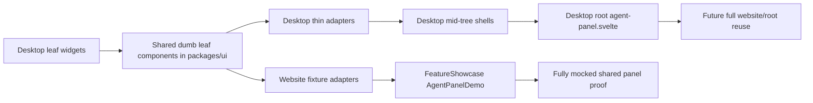

# refactor: Leaf-first shared agent panel extraction

## Overview

Shift the agent-panel extraction strategy from root-first replacement to a leaf-first migration. Extract the smallest runtime-neutral desktop panel widgets into `packages/ui` as dumb components, replace desktop usage with thin adapters, and progressively move upward until the website can render a fully mocked agent panel through the same shared component stack the desktop uses.

The current production homepage shell in `packages/website/src/routes/+page.svelte` should stay intact during this plan. The existing `FeatureShowcase` agent tab becomes the safe integration host for the fully mocked shared panel while the production homepage composition remains stable.

## Problem Frame

The reset requirements were right about the target end state, but the recent execution path mixed together three separate goals:

1. extract desktop-owned panel presentation into `packages/ui`
2. replace the website homepage showcase
3. prove that the website can render a fully mocked panel

That coupling made review harder and let homepage drift obscure whether the panel extraction itself was actually improving. The new plan separates those concerns. The homepage remains on the production `FeatureShowcase`, while the extraction effort focuses on building a trustworthy shared panel stack from the bottom of the desktop tree upward.

This also resolves a practical migration problem from the origin document: the desktop panel is still a monolith with many runtime-bound seams. A leaf-first plan reduces rewrite risk by extracting components only when their visual contract is already understood and mockable.

## Requirements Trace

- R1. Extract shared presentational UI from the real desktop panel, not from a website-first redesign `(see origin: docs/brainstorms/2026-04-10-agent-panel-ui-extraction-reset-requirements.md)`.
- R2. Keep shared UI dumb: explicit props, callbacks, and snippets only; no desktop stores, ACP orchestration, or Tauri APIs in `packages/ui`.
- R3. Preserve desktop ownership of runtime behavior: virtualization, thread-follow, permissions flow, browser/terminal integrations, and side effects remain desktop-owned.
- R4. Decompose the desktop panel into runtime-neutral presentational children and thin desktop adapters before attempting another full-root website swap `(see origin: docs/brainstorms/2026-04-10-agent-panel-ui-extraction-reset-requirements.md)`.
- R5. Provide a fully mocked website-visible agent panel using the same extracted components the desktop uses, but do so inside the existing production homepage shell first.
- R6. Keep the current production homepage composition stable until the mocked shared panel stack is ready end-to-end.

## Scope Boundaries

- In scope: panel-local leaf widgets, panel support widgets, mid-tree panel shells, and the website `AgentPanelDemo` host used inside `FeatureShowcase`.
- In scope: shared extraction of presentational review/status/composer-adjacent widgets when they can be driven by explicit fixture data.
- Out of scope for this plan: changing the homepage route away from the current production `FeatureShowcase`.
- Out of scope for early units: desktop-only runtime ownership such as thread-follow control, virtualized list container behavior, worktree orchestration, Tauri opener behavior, and ACP side effects.
- Deferred until the panel shell is otherwise stable: any change that would require the website to implement real ACP behavior instead of fixture-driven rendering.

## Context & Research

### Relevant Code and Patterns

- `packages/desktop/src/lib/acp/components/agent-panel/components/agent-panel.svelte` is still the real desktop composition root and the source of truth for subtree ownership.
- `packages/desktop/src/lib/acp/components/agent-panel/components/agent-panel-content.svelte` already shows the approved seam: desktop owns the list container and runtime state selection, while presentational rows can stay shared.
- `packages/desktop/src/lib/acp/components/agent-panel/components/virtualized-entry-list.svelte` confirms the conversation seam stays desktop-owned for virtualization and thread-follow.
- `packages/website/src/lib/components/feature-showcase.svelte` is the correct short-term host for a mocked shared panel because it already isolates the agent panel showcase from the broader homepage shell.
- `packages/website/src/lib/components/agent-panel-demo.svelte` and `packages/website/src/lib/components/agent-panel-demo-scene.ts` are the natural fixture-driven website adapter layer for the extraction.
- Existing desktop leaf candidates with minimal downstream imports are:
  - `packages/desktop/src/lib/acp/components/agent-panel/components/scroll-to-bottom-button.svelte`
  - `packages/desktop/src/lib/acp/components/agent-panel/components/agent-error-card.svelte`
  - `packages/desktop/src/lib/acp/components/agent-panel/components/agent-install-card.svelte`
  - `packages/desktop/src/lib/acp/components/agent-panel/components/worktree-setup-card.svelte`
- Existing panel support widgets already composed as standalone components and therefore good near-term extraction targets are:
  - `packages/desktop/src/lib/acp/components/modified-files/modified-files-header.svelte`
  - `packages/desktop/src/lib/acp/components/pr-status-card/pr-status-card.svelte`
  - `packages/desktop/src/lib/acp/components/plan-header.svelte`
  - `packages/desktop/src/lib/acp/components/queue-card-strip.svelte`
  - `packages/desktop/src/lib/acp/components/todo-header.svelte`
  - `packages/desktop/src/lib/acp/components/tool-calls/permission-bar.svelte`

### Institutional Learnings

- `docs/solutions/logic-errors/thinking-indicator-scroll-handoff-2026-04-07.md` reinforces that the virtualized conversation container, reveal targeting, and resize-follow logic must remain desktop-owned.
- The earlier reset requirements document already identified leaf-first extraction as a planning concern; this plan turns that requirement into the primary sequencing strategy.

### External References

- None. The codebase has enough local context for this refactor, and the main challenge is ownership and sequencing rather than framework uncertainty.

## Key Technical Decisions

- **Homepage stability first**: keep `packages/website/src/routes/+page.svelte` on the production `FeatureShowcase` until the mocked shared panel is complete enough to swap intentionally.
- **Use `FeatureShowcase` as the migration harness**: evolve `packages/website/src/lib/components/agent-panel-demo.svelte` into the fully mocked shared panel host instead of rewriting the homepage shell during extraction.
- **Leaf-first ordering**: extract standalone panel widgets first, then support widgets, then mid-tree shells, and only then the root panel composition.
- **Adapters stay local**: desktop wrappers remain responsible for translating stores, Tauri actions, worktree state, and ACP state into shared props; website wrappers remain responsible for fixture data only.
- **Conversation container stays desktop-owned**: the website may mock conversation entries through shared row/state components, but the desktop retains `virtualized-entry-list.svelte` and the thread-follow controller.

## Open Questions

### Resolved During Planning

- **Should the homepage be replaced again now?** No. The production homepage should remain stable while the extraction proceeds inside the existing `FeatureShowcase` harness.
- **What is the safe proof target for the extraction?** A fully mocked `AgentPanelDemo` rendered inside `FeatureShowcase`, using the same shared presentational components as desktop.
- **What is the correct migration order?** Start from runtime-neutral leaves, then move to panel support widgets, then shell-level containers, then the root panel composition.

### Deferred to Implementation

- **Which extracted leaf names should remain identical versus be normalized inside `packages/ui`?** Decide while implementing each unit, but preserve desktop recognizability unless a rename materially clarifies ownership.
- **Should `AgentPanelScene` remain the website demo host or be replaced by the shared root after shell extraction completes?** Keep the scene host only as long as it reduces migration risk; remove it once the extracted root is ready to drive the same mocked states.

## High-Level Technical Design

> *This illustrates the intended approach and is directional guidance for review, not implementation specification. The implementing agent should treat it as context, not code to reproduce.*

## Extraction Inventory

| Tier | Components | Migration posture |
|---|---|---|
| Tier 0: existing shared primitives | `AgentPanel`, `AgentPanelHeader`, `AgentPanelConversationEntry`, `AgentPanelComposer`, `AgentPanelStatusStrip`, `AgentPanelReviewCard`, `AgentPanelFooterChrome` | Keep and build on them |
| Tier 1: leaf desktop widgets | `scroll-to-bottom-button.svelte`, `agent-error-card.svelte`, `agent-install-card.svelte`, `worktree-setup-card.svelte` | Extract first |
| Tier 2: panel support widgets | `modified-files-header.svelte`, `pr-status-card.svelte`, `plan-header.svelte`, `queue-card-strip.svelte`, `todo-header.svelte`, `permission-bar.svelte` | Extract after Tier 1 |
| Tier 3: mid-tree shells | `agent-panel-footer.svelte`, `agent-panel-content.svelte`, `agent-panel-header.svelte` | Extract once leaf contracts stabilize |
| Tier 4: runtime-owned containers | `virtualized-entry-list.svelte`, review/browser/terminal/attached-file shells | Keep desktop-owned; expose only presentational children |
| Tier 5: root composition | `agent-panel.svelte` | Final extraction target |

## Implementation Units

- [ ] **Unit 1: Extract panel-local leaf widgets into shared UI**

**Goal:** Move the smallest runtime-neutral panel widgets into `packages/ui` so both desktop and website can render them from explicit props.

**Requirements:** R1, R2, R4, R5

**Dependencies:** None

**Files:**
- Create: `packages/ui/src/components/agent-panel/scroll-to-bottom-button.svelte`
- Create: `packages/ui/src/components/agent-panel/agent-error-card.svelte`
- Create: `packages/ui/src/components/agent-panel/agent-install-card.svelte`
- Create: `packages/ui/src/components/agent-panel/worktree-setup-card.svelte`
- Modify: `packages/ui/src/components/agent-panel/index.ts`
- Modify: `packages/ui/src/index.ts`
- Modify: `packages/desktop/src/lib/acp/components/agent-panel/components/scroll-to-bottom-button.svelte`
- Modify: `packages/desktop/src/lib/acp/components/agent-panel/components/agent-error-card.svelte`
- Modify: `packages/desktop/src/lib/acp/components/agent-panel/components/agent-install-card.svelte`
- Modify: `packages/desktop/src/lib/acp/components/agent-panel/components/worktree-setup-card.svelte`
- Test: `packages/desktop/src/lib/acp/components/agent-panel/components/__tests__/agent-error-card.svelte.vitest.ts`
- Test: `packages/desktop/src/lib/acp/components/agent-panel/components/__tests__/agent-install-card.svelte.vitest.ts`
- Test: `packages/ui/src/components/agent-panel/__tests__/agent-panel-leaf-widgets.test.ts`

**Approach:**
- Extract only the visual surface and local interaction affordances of each widget.
- Keep worktree actions, install callbacks, navigation/openers, and any runtime branching in desktop wrappers.
- Normalize widget props so the website can drive them from fixtures without desktop state objects.

**Execution note:** Start with characterization coverage for each current desktop widget before replacing its internal markup with a shared component.

**Patterns to follow:**
- `packages/desktop/src/lib/acp/components/agent-panel/components/agent-error-card.svelte`
- `packages/desktop/src/lib/acp/components/agent-panel/components/agent-install-card.svelte`

**Test scenarios:**
- Happy path — each extracted widget renders the same title, body text, iconography, and visible actions as the current desktop version.
- Edge case — optional description/details blocks collapse cleanly when omitted.
- Error path — disabled/unavailable action states remain visually distinct without desktop imports leaking into shared code.
- Integration — desktop wrappers still fire the existing callbacks while the website can render the same components from static fixture props.

**Verification:**
- Desktop widgets become thin adapters over shared presentational components.
- Website fixtures can render each extracted widget independently.

- [ ] **Unit 2: Extract panel support widgets that sit above the composer**

**Goal:** Share the standalone status/review/task widgets that make the panel legible before extracting larger shells.

**Requirements:** R1, R2, R5

**Dependencies:** Unit 1

**Files:**
- Create: `packages/ui/src/components/agent-panel/modified-files-header.svelte`
- Create: `packages/ui/src/components/agent-panel/pr-status-card.svelte`
- Create: `packages/ui/src/components/agent-panel/plan-header.svelte`
- Create: `packages/ui/src/components/agent-panel/queue-card-strip.svelte`
- Create: `packages/ui/src/components/agent-panel/todo-header.svelte`
- Create: `packages/ui/src/components/agent-panel/permission-bar.svelte`
- Modify: `packages/ui/src/components/agent-panel/index.ts`
- Modify: `packages/ui/src/index.ts`
- Modify: `packages/desktop/src/lib/acp/components/modified-files/modified-files-header.svelte`
- Modify: `packages/desktop/src/lib/acp/components/pr-status-card/pr-status-card.svelte`
- Modify: `packages/desktop/src/lib/acp/components/plan-header.svelte`
- Modify: `packages/desktop/src/lib/acp/components/queue-card-strip.svelte`
- Modify: `packages/desktop/src/lib/acp/components/todo-header.svelte`
- Modify: `packages/desktop/src/lib/acp/components/tool-calls/permission-bar.svelte`
- Modify: `packages/website/src/lib/components/agent-panel-demo.svelte`
- Modify: `packages/website/src/lib/components/agent-panel-demo-scene.ts`
- Test: `packages/ui/src/components/agent-panel/__tests__/agent-panel-support-widgets.test.ts`
- Test: `packages/website/src/lib/components/agent-panel-demo.test.ts`

**Approach:**
- Treat each support widget as a standalone presentational extraction with explicit data models, not as hidden children of the root panel.
- Rewire the website `AgentPanelDemo` harness to use the extracted widgets as they become available so mockability grows incrementally.
- Keep any PR generation, permission resolution, or store-derived task state in the desktop adapters.

**Patterns to follow:**
- `packages/desktop/src/lib/acp/components/pr-status-card/pr-status-card.svelte`
- `packages/website/src/lib/components/agent-panel-demo.svelte`

**Test scenarios:**
- Happy path — each widget renders the intended review/status/task summary from explicit props in both desktop and website hosts.
- Edge case — empty/zero states render intentionally instead of collapsing into missing UI.
- Error path — unavailable actions or missing callback hooks do not crash shared rendering.
- Integration — `AgentPanelDemo` can render the extracted widgets from fixtures without importing desktop-only modules.

**Verification:**
- The website demo can show status/review context using shared components, not desktop-only markup.

- [ ] **Unit 3: Extract footer and lower-panel chrome**

**Goal:** Move the lower panel chrome into shared UI so desktop and website can render the same footer/composer-adjacent framing.

**Requirements:** R1, R2, R5

**Dependencies:** Unit 1, Unit 2

**Files:**
- Modify: `packages/ui/src/components/agent-panel/agent-panel-footer-chrome.svelte`
- Create: `packages/ui/src/components/agent-panel/agent-panel-footer.svelte`
- Modify: `packages/desktop/src/lib/acp/components/agent-panel/components/agent-panel-footer.svelte`
- Modify: `packages/desktop/src/lib/acp/components/agent-panel/components/agent-panel.svelte`
- Modify: `packages/website/src/lib/components/agent-panel-demo.svelte`
- Test: `packages/desktop/src/lib/acp/components/agent-panel/components/__tests__/agent-panel-footer.svelte.vitest.ts`
- Test: `packages/ui/src/components/agent-panel/__tests__/agent-panel-footer.test.ts`

**Approach:**
- Keep footer actions and browser/terminal toggle effects desktop-owned, but share the footer structure, spacing, borders, and button placement.
- Decide whether resize-edge affordance stays deferred until root extraction or can be represented as a passive shared visual gutter.
- Reuse the website demo host to prove the lower chrome can render without desktop runtime state.

**Patterns to follow:**
- `packages/ui/src/components/agent-panel/agent-panel-footer-chrome.svelte`
- `packages/desktop/src/lib/acp/components/agent-panel/components/agent-panel-footer.svelte`

**Test scenarios:**
- Happy path — footer renders the same chrome, action placements, and border treatment in desktop and website.
- Edge case — absent browser/terminal controls do not break spacing or footer alignment.
- Integration — desktop action callbacks continue to trigger the existing runtime behavior while website fixtures render passive controls.

**Verification:**
- The lower panel chrome is visually shared and fixture-driven on the website.

- [ ] **Unit 4: Extract the header and content shells while keeping runtime containers local**

**Goal:** Share the desktop panel’s visible header/content structure while preserving desktop ownership of runtime-heavy containers.

**Requirements:** R1, R2, R3, R4, R6

**Dependencies:** Unit 1, Unit 2, Unit 3

**Files:**
- Modify: `packages/ui/src/components/agent-panel/agent-panel-header.svelte`
- Create: `packages/ui/src/components/agent-panel/agent-panel-content-shell.svelte`
- Modify: `packages/desktop/src/lib/acp/components/agent-panel/components/agent-panel-header.svelte`
- Modify: `packages/desktop/src/lib/acp/components/agent-panel/components/agent-panel-content.svelte`
- Modify: `packages/desktop/src/lib/acp/components/agent-panel/components/agent-panel.svelte`
- Modify: `packages/website/src/lib/components/agent-panel-demo.svelte`
- Modify: `packages/website/src/lib/components/agent-panel-demo-scene.ts`
- Test: `packages/desktop/src/lib/acp/components/agent-panel/components/__tests__/agent-panel-header.project-style.svelte.vitest.ts`
- Test: `packages/desktop/src/lib/acp/components/agent-panel/components/__tests__/agent-panel-content.svelte.vitest.ts`
- Test: `packages/ui/src/components/agent-panel/__tests__/agent-panel-content-shell.test.ts`

**Approach:**
- Keep `virtualized-entry-list.svelte`, thread-follow, and real session state selection in desktop.
- Extract the surrounding content shell, empty/ready states, and header framing into shared presentational surfaces.
- Let the website demo inject fixture conversations through the same shared shell, without attempting to mimic desktop virtualization.

**Execution note:** Use characterization coverage before changing shell composition; this unit touches the highest-blast-radius visible structure before the root.

**Patterns to follow:**
- `packages/desktop/src/lib/acp/components/agent-panel/components/agent-panel-content.svelte`
- `packages/desktop/src/lib/acp/components/agent-panel/components/virtualized-entry-list.svelte`

**Test scenarios:**
- Happy path — active conversation states render through the shared header/content shell with the same framing as desktop.
- Edge case — ready, empty, and pending-project states still render the correct content branch.
- Error path — connection/worktree/setup/error branches still select the correct visual shell without leaking desktop runtime code into shared components.
- Integration — desktop continues to use the real virtualized container while the website demo drives the same shell with fixture entries.

**Verification:**
- Desktop header/content wrappers become adapters over shared shells instead of owning the presentational structure directly.

- [ ] **Unit 5: Extract optional panel panes and drawers as shared presentational surfaces**

**Goal:** Share the visible review, terminal, browser, and attached-file pane presentation where it is safe, without moving their runtime integrations.

**Requirements:** R1, R2, R3, R5

**Dependencies:** Unit 4

**Files:**
- Create: `packages/ui/src/components/agent-panel/agent-panel-review-content.svelte`
- Create: `packages/ui/src/components/agent-panel/agent-panel-terminal-drawer.svelte`
- Create: `packages/ui/src/components/agent-panel/agent-attached-file-pane.svelte`
- Create: `packages/ui/src/components/agent-panel/browser-panel.svelte`
- Modify: `packages/desktop/src/lib/acp/components/agent-panel/components/agent-panel-review-content.svelte`
- Modify: `packages/desktop/src/lib/acp/components/agent-panel/components/agent-panel-terminal-drawer.svelte`
- Modify: `packages/desktop/src/lib/acp/components/main-app-view/components/content/agent-attached-file-pane.svelte`
- Modify: `packages/desktop/src/lib/acp/components/browser-panel/index.ts`
- Modify: `packages/website/src/lib/components/agent-panel-demo.svelte`
- Modify: `packages/website/src/lib/components/agent-panel-demo-scene.ts`
- Test: `packages/ui/src/components/agent-panel/__tests__/agent-panel-optional-surfaces.test.ts`
- Test: `packages/website/src/lib/components/agent-panel-demo.test.ts`

**Approach:**
- Split these surfaces into shared visual shells plus desktop-owned adapters for file opening, browser control, terminal lifecycle, and diff/review actions.
- Add fixture states to the website demo host only once the corresponding shared surface can render credibly without runtime side effects.
- Keep complex behavior hidden or passive in the website host unless the presentational shell is complete enough to be legible.

**Patterns to follow:**
- `packages/desktop/src/lib/acp/components/agent-panel/components/agent-panel-review-content.svelte`
- `packages/desktop/src/lib/acp/components/main-app-view/components/content/agent-attached-file-pane.svelte`

**Test scenarios:**
- Happy path — each optional surface renders the same visible structure from explicit props in both desktop and website hosts.
- Edge case — closed/empty/no-selection states render intentionally instead of leaving broken panes.
- Error path — runtime-only actions can be disabled or omitted in website fixtures without crashing the shared shell.
- Integration — desktop adapters still wire file opening, browser navigation, and review actions to their existing stores/plugins.

**Verification:**
- The website demo can render the panel with optional panes visible using extracted shared components only.

- [ ] **Unit 6: Recompose the desktop root and website demo around the same shared panel tree**

**Goal:** Finish the migration by making the desktop root and the website demo consume the same extracted component tree end-to-end.

**Requirements:** R1, R2, R3, R5, R6

**Dependencies:** Unit 1, Unit 2, Unit 3, Unit 4, Unit 5

**Files:**
- Modify: `packages/desktop/src/lib/acp/components/agent-panel/components/agent-panel.svelte`
- Modify: `packages/desktop/src/lib/acp/components/agent-panel/components/index.ts`
- Modify: `packages/website/src/lib/components/feature-showcase.svelte`
- Modify: `packages/website/src/lib/components/agent-panel-demo.svelte`
- Modify: `packages/website/src/lib/components/agent-panel-demo-scene.ts`
- Test: `packages/website/src/lib/components/agent-panel-demo.test.ts`
- Test: `packages/ui/src/components/agent-panel/__tests__/agent-panel-integration.test.ts`
- Test: `packages/desktop/src/lib/acp/components/agent-panel/components/agent-panel-layout.test.ts`

**Approach:**
- Treat `agent-panel.svelte` as the final assembly pass after all lower-level surfaces are shared.
- Remove remaining desktop-owned presentational duplication in favor of thin adapters around shared components.
- Make `AgentPanelDemo` the proof artifact: a fully mocked website panel rendered with the same shared tree the desktop root now uses.
- Keep the homepage shell unchanged in this unit; only the `FeatureShowcase` agent tab should reflect the completed mock.

**Patterns to follow:**
- `packages/desktop/src/lib/acp/components/agent-panel/components/agent-panel.svelte`
- `packages/website/src/lib/components/feature-showcase.svelte`

**Test scenarios:**
- Happy path — the desktop root and website demo both render the same shared panel tree for active conversation, status/review context, and composer-ready states.
- Edge case — optional panes and empty/ready/error states can be toggled independently in the website fixture host.
- Error path — website fixtures with omitted callbacks or disabled controls still render a complete panel without runtime errors.
- Integration — desktop adapters continue to own runtime behaviors while the website host remains pure fixture data.

**Verification:**
- The website can display a fully mocked agent panel inside `FeatureShowcase` using the same shared components as desktop.
- Remaining differences between desktop and website are limited to runtime capability, not presentational implementation.

## System-Wide Impact

- **Interaction graph:** Desktop stores, Tauri plugins, worktree flows, browser/terminal integrations, and review actions continue to feed desktop adapters; website fixtures feed the same shared UI with static data.
- **Error propagation:** Shared UI should surface visual error states only; operational failures remain desktop-owned and are translated into explicit props.
- **State lifecycle risks:** Partial extraction can leave desktop and website on different component generations. Units should not advance upward until lower-tier widgets are actually reused in both places.
- **API surface parity:** Shared component prop contracts become the reviewable parity surface between desktop and website.
- **Integration coverage:** `FeatureShowcase` plus `AgentPanelDemo` is the cross-package harness that proves mockability before any future homepage swap.
- **Unchanged invariants:** Virtualization, thread-follow, ACP execution, store mutations, and Tauri side effects remain outside `packages/ui`.

## Risks & Dependencies

| Risk | Mitigation |
|------|------------|
| Extracting too much shell too early recreates the earlier drift | Enforce the leaf-first tier order and keep the homepage shell unchanged during this plan |
| Shared types drift away from desktop reality again | Require every new shared component to replace a real desktop consumer before expanding website usage |
| Website demo becomes a second authoring surface | Restrict website work to fixture adapters and `FeatureShowcase` hosting, not parallel presentational implementations |
| Runtime-owned containers leak into `packages/ui` | Preserve explicit adapter seams and keep virtualization/browser/terminal/worktree behavior desktop-owned |

## Documentation / Operational Notes

- Update the current session plan to note that the next extraction phase is leaf-first and homepage-stable.
- Treat `FeatureShowcase` screenshots as the parity artifact for this phase instead of using the full homepage hero as the proof target.

## Sources & References

- **Origin document:** `docs/brainstorms/2026-04-10-agent-panel-ui-extraction-reset-requirements.md`
- Existing plan: `docs/plans/2026-04-10-001-refactor-desktop-shared-agent-panel-plan.md`
- Desktop root: `packages/desktop/src/lib/acp/components/agent-panel/components/agent-panel.svelte`
- Website harness: `packages/website/src/lib/components/feature-showcase.svelte`
- Website demo host: `packages/website/src/lib/components/agent-panel-demo.svelte`
- Learning: `docs/solutions/logic-errors/thinking-indicator-scroll-handoff-2026-04-07.md`
