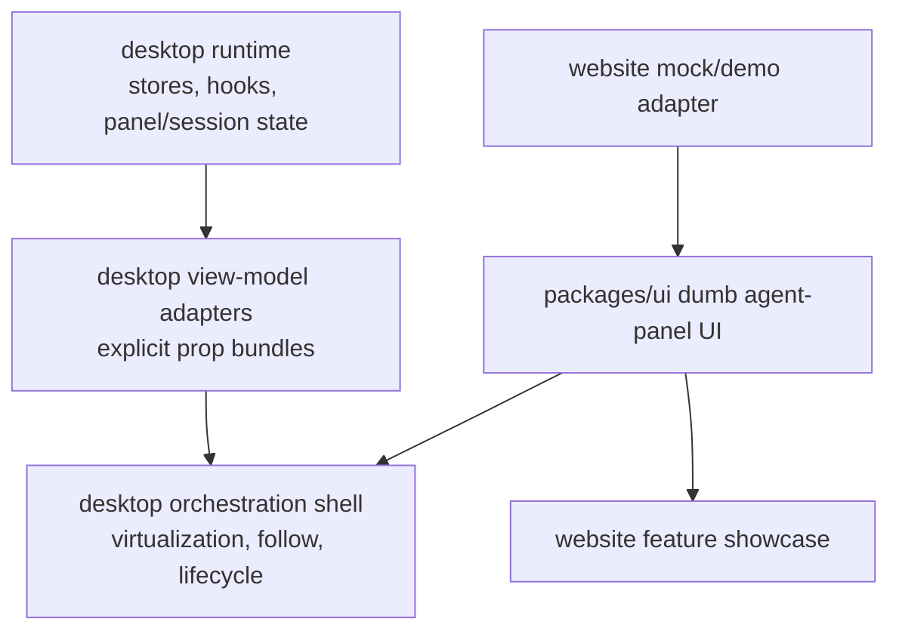
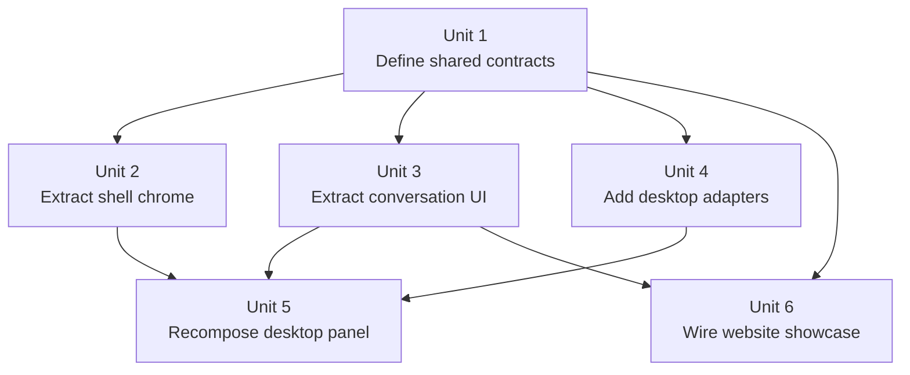

# refactor: Extract the full dumb agent-panel UI into packages/ui

## Overview

Extract the full agent-panel UI surface from `packages/desktop` into `packages/ui`, make those components dumb, and keep `packages/desktop` as the orchestration layer that adapts runtime/session state into explicit presentational props. The website main page then becomes a straightforward consumer of the same shared UI, not a special-case extraction target.

## Problem Frame

The current agent panel is split across two architectures:

1. `packages/ui` already owns some presentational agent-panel primitives such as `AgentPanelHeader`, `AgentPanelLayout`, and tool-row components.
2. `packages/desktop` still owns a large amount of agent-panel UI directly: header chrome, footer chrome, install/error/worktree cards, virtualized content composition, and the top-level shell exports in `packages/desktop/src/lib/acp/components/agent-panel/components/`.

That split makes the website goal awkward. Showing the agent panel on the website main page should not require a second website-only demo model or a narrow homepage-only scene wrapper. The real architectural need is broader: the full agent-panel UI should be extracted into `packages/ui` and made dumb so both desktop and website can consume the same component system.

The main design question is how to carry data across that boundary. Given the explicit goal of making the extracted UI dumb and reusable, the package boundary should be **prop-driven**, not context-driven. Desktop can still use local context internally for runtime orchestration if needed, but shared `packages/ui` components must receive explicit prop bundles and callbacks rather than reaching into stores, session context, or app-specific helpers.

## Requirements Trace

- R1. All agent-panel UI components that are presentational in nature must move from `packages/desktop` to `packages/ui`.
- R2. Extracted UI components must be dumb: no Tauri APIs, no stores, no session context lookups, no runtime ownership, and no app-specific side effects inside `packages/ui`.
- R3. `packages/desktop` must remain the owner of runtime concerns: `SessionStore`, `PanelStore`, session context, virtualization, question/permission handling, worktree orchestration, provider-backed interactions, and panel lifecycle.
- R4. The package boundary must be explicit-prop based. Cross-package context for runtime data is out of scope. If context exists at all, it must stay inside desktop orchestration or remain purely presentational inside `packages/ui`.
- R5. Desktop must gain an adapter/view-model layer that translates runtime/session/tool-call state into shared UI props.
- R6. The extraction must cover the full agent-panel UI surface, not just the homepage subset: shell chrome, conversation rows, tool-call rendering UI, status/empty/error/install/setup states, and footer/composer-adjacent UI chrome.
- R7. The website main page must consume the extracted shared UI for its agent-panel showcase rather than relying on a website-only implementation path.
- R8. The migration must stay incremental and reversible: desktop keeps its orchestration container while swapping presentational pieces underneath it.

## Scope Boundaries

- Do not move desktop stores, state machines, hooks, or app-specific logic into `packages/ui`.
- Do not move virtualization ownership into `packages/ui` in this pass; desktop may keep the virtualized list/container while rendering shared dumb rows/components inside it.
- Do not force every generic panel primitive in the app into this migration; the focus is the agent-panel UI surface and the minimum shared shell pieces it depends on.
- Do not build website runtime behavior. The website remains mock/demo driven.
- Do not solve every future panel abstraction problem in the same change. This plan is about extracting the agent-panel UI cleanly, not redesigning all ACP shells.

## Context & Research

### Relevant Code and Patterns

- `packages/desktop/src/lib/acp/components/agent-panel/components/index.ts` still exports desktop-owned UI components such as `AgentPanel`, `AgentPanelContent`, `AgentPanelHeader`, and `AgentPanelResizeEdge`.
- `packages/desktop/src/lib/acp/components/agent-panel/components/agent-panel-header.svelte` already composes shared `@acepe/ui/agent-panel` pieces with desktop-only actions and tooltips, which is a strong sign the header should become a dumb shared UI component fed by desktop props/callbacks.
- `packages/desktop/src/lib/acp/components/agent-panel/components/agent-panel-footer.svelte` is still desktop-owned even though most of it is chrome and action wiring; it should become a shared dumb footer shell with explicit callbacks/flags.
- `packages/desktop/src/lib/acp/components/agent-panel/components/agent-install-card.svelte`, `agent-error-card.svelte`, and `worktree-setup-card.svelte` are clearly presentational status cards that belong in `packages/ui`.
- `packages/desktop/src/lib/acp/components/agent-panel/components/virtualized-entry-list.svelte` proves that desktop still owns runtime-heavy concerns such as virtualization, session context, and follow/scroll behavior. That is the right place to stop the extraction boundary.
- `packages/desktop/src/lib/acp/components/tool-calls/tool-definition-registry.ts` and `convert-task-children.ts` already translate runtime tool data into shared `AgentToolEntry`-shaped display models. That is the correct pattern to generalize into a broader agent-panel view-model adapter layer.
- `packages/ui/src/components/agent-panel/types.ts` already defines a presentational data model (`AnyAgentEntry`, `AgentToolEntry`, etc.), so the extraction should expand this contract instead of inventing a second one.
- `packages/website/src/lib/components/feature-showcase.svelte` is the real homepage host for the website showcase, and `packages/website/src/lib/components/agent-panel-demo.svelte` is the current consumer path that should switch to the extracted shared UI.

### Institutional Learnings

- `docs/solutions/logic-errors/kanban-live-session-panel-sync-2026-04-02.md` reinforces the broader rule that new surfaces should project from canonical state instead of growing a second runtime truth. For this migration, that means desktop adapts real runtime state into dumb shared props rather than moving runtime ownership into `packages/ui`.
- `docs/solutions/best-practices/provider-owned-policy-and-identity-not-ui-projections-2026-04-09.md` reinforces the same separation at a higher level: shared UI must not infer or own provider/runtime policy.
- `docs/solutions/logic-errors/thinking-indicator-scroll-handoff-2026-04-07.md` is a reminder that the live desktop thread surface has non-trivial scroll/follow behavior. That is a strong reason to keep virtualization/follow logic in desktop and extract only the row and shell presentation.

### External References

- None. The needed architecture precedent is already in this repo.

## Key Technical Decisions

| Decision | Rationale |
|---|---|
| Use explicit prop bundles at the package boundary | Props make dumbness enforceable. They make the shared contract auditable and keep runtime ownership out of `packages/ui`. |
| Keep context out of the shared-runtime boundary | Cross-package context would blur the ownership line and make the extracted UI less reusable. |
| Allow desktop-local orchestration wrappers to assemble large prop objects | This avoids brittle prop drilling at every intermediate desktop layer without violating the prop-driven boundary into `packages/ui`. |
| Keep virtualization and thread-follow logic in desktop | Those behaviors are runtime-heavy, already tricky, and not required for the website consumer. |
| Extract full agent-panel UI surface incrementally | Desktop should keep a stable orchestration shell while shared presentational pieces move under it one slice at a time. |
| Make the website a downstream consumer, not the primary architecture driver | The website is a forcing function, but the real durable outcome is a dumb shared agent-panel UI system. |

## Chosen Data-Flow Approach

Use a **prop-driven boundary with view-model adapters**:

- Desktop builds explicit view models for header, content rows, footer chrome, empty/error/install/setup states, and any other extracted UI slice.
- Shared `packages/ui` components accept those props plus event callbacks.
- Desktop orchestration components may still use local helper functions or local context internally to avoid repetitive wiring, but they must terminate in explicit props before crossing into `packages/ui`.
- Do **not** use shared context as the primary data flow for extracted UI. That would make the components less obviously dumb and harder to consume from the website.

This is the best fit for the stated goal: make the extracted UI dumb, inspectable, and reusable.

## High-Level Technical Design

The migration line is:

- **Desktop runtime stays here:** stores, hooks, state machines, virtualization, orchestration.
- **Shared UI moves here:** presentational shells, cards, row renderers, header/footer chrome, and reusable agent-panel scenes/components.
- **Website consumption stays simple:** mock data -> shared UI.

## Implementation Dependency Graph

## Implementation Units

### [ ] Unit 1: Define the shared dumb contract and extraction boundary

**Goal**

Create the explicit prop-driven contract for the extracted agent-panel UI and lock where runtime ownership stops.

**Requirements**

- R1-R6, R8

**Dependencies**

- None

**Files**

- Modify: `packages/ui/src/components/agent-panel/types.ts`
- Add: `packages/ui/src/components/agent-panel/agent-panel-shell-types.ts`
- Modify: `packages/ui/src/components/agent-panel/index.ts`
- Modify: `packages/ui/src/index.ts`
- Add: `packages/desktop/src/lib/acp/components/agent-panel/view-models/agent-panel-header-vm.ts`
- Add: `packages/desktop/src/lib/acp/components/agent-panel/view-models/agent-panel-footer-vm.ts`
- Add: `packages/desktop/src/lib/acp/components/agent-panel/view-models/agent-panel-state-cards-vm.ts`
- Test: `packages/desktop/src/lib/acp/components/agent-panel/__tests__/agent-panel-view-model-contract.test.ts`

**Approach**

- Define shared prop types for the extracted UI slices instead of letting desktop components pass raw runtime objects directly.
- Make the boundary explicit in prose and in types: allowed shared props are display data, booleans, labels, lists, and callbacks; forbidden inputs are stores, Tauri handles, session contexts, provider metadata, and runtime-only entities.
- Start with the highest-value prop bundles: header VM, footer VM, state-card VM, and conversation-entry VM.
- Use desktop-side tests to prove the contract can be populated from real runtime sources without importing those sources into `packages/ui`.

**Patterns to follow**

- `packages/desktop/src/lib/acp/components/tool-calls/tool-definition-registry.ts`
- `packages/desktop/src/lib/acp/components/tool-calls/tool-call-task/logic/convert-task-children.ts`
- `packages/ui/src/components/agent-panel/types.ts`

**Test scenarios**

- Happy path — desktop can build complete shared header/footer/state-card prop bundles from live panel/session state.
- Edge case — forbidden runtime-only shapes are not required by the shared contract.
- Integration — tool-call/task-child adapter outputs fit the shared conversation entry contract.
- Integration — the contract is explicit enough that a website demo can consume it without desktop imports.

**Verification**

- There is a stable, test-backed prop contract for all extracted agent-panel UI slices before component migration starts.

### [ ] Unit 2: Extract shell chrome and state cards into `packages/ui`

**Goal**

Move the non-runtime shell chrome and status-card UI from desktop into dumb shared components.

**Requirements**

- R1-R4, R6, R8

**Dependencies**

- Unit 1

**Files**

- Add: `packages/ui/src/components/agent-panel/agent-panel-shell.svelte`
- Add: `packages/ui/src/components/agent-panel/agent-panel-header-actions.svelte`
- Add: `packages/ui/src/components/agent-panel/agent-panel-footer-bar.svelte`
- Add: `packages/ui/src/components/agent-panel/agent-install-card.svelte`
- Add: `packages/ui/src/components/agent-panel/agent-error-card.svelte`
- Add: `packages/ui/src/components/agent-panel/worktree-setup-card.svelte`
- Modify: `packages/ui/src/components/agent-panel/index.ts`
- Modify: `packages/desktop/src/lib/acp/components/agent-panel/components/agent-panel-header.svelte`
- Modify: `packages/desktop/src/lib/acp/components/agent-panel/components/agent-panel-footer.svelte`
- Modify: `packages/desktop/src/lib/acp/components/agent-panel/components/agent-install-card.svelte`
- Modify: `packages/desktop/src/lib/acp/components/agent-panel/components/agent-error-card.svelte`
- Modify: `packages/desktop/src/lib/acp/components/agent-panel/components/worktree-setup-card.svelte`
- Test: `packages/desktop/src/lib/acp/components/agent-panel/__tests__/agent-panel-shell-ui.test.ts`

**Approach**

- Extract the presentational shell pieces first because they are the clearest wins and easiest to keep dumb.
- Convert the current desktop components into orchestration wrappers or delete them if the callsites can point directly at `@acepe/ui`.
- Keep action ownership in desktop by passing explicit callback props into the shared UI.
- Preserve current visual behavior while removing app-specific imports from the shared implementation.

**Patterns to follow**

- `packages/desktop/src/lib/acp/components/agent-panel/components/agent-panel-header.svelte`
- `packages/desktop/src/lib/acp/components/agent-panel/components/agent-panel-footer.svelte`
- `packages/ui/src/components/agent-panel/agent-panel-header.svelte`

**Test scenarios**

- Happy path — shared shell chrome renders the same visible controls/actions when fed desktop props.
- Edge case — worktree confirm/setup/error/install states render correctly without store access in `packages/ui`.
- Integration — desktop wrappers contain orchestration only and pass fully shaped props to shared UI.

**Verification**

- Header/footer/state-card UI is shared and dumb; desktop owns only the callback wiring and state derivation.

### [ ] Unit 3: Extract conversation row UI and message presentation into `packages/ui`

**Goal**

Move the conversation-facing agent-panel UI into shared dumb components while keeping desktop virtualization and runtime orchestration local.

**Requirements**

- R1-R6, R8

**Dependencies**

- Unit 1

**Files**

- Add: `packages/ui/src/components/agent-panel/agent-panel-conversation.svelte`
- Add: `packages/ui/src/components/agent-panel/agent-panel-entry-row.svelte`
- Modify: `packages/ui/src/components/agent-panel/agent-panel-layout.svelte`
- Modify: `packages/ui/src/components/agent-panel/index.ts`
- Modify: `packages/desktop/src/lib/acp/components/agent-panel/components/agent-panel-content.svelte`
- Modify: `packages/desktop/src/lib/acp/components/agent-panel/components/virtualized-entry-list.svelte`
- Test: `packages/desktop/src/lib/acp/components/agent-panel/components/__tests__/virtualized-entry-list-shared-ui.test.ts`
- Test: `packages/website/src/lib/components/agent-panel-demo.test.ts`

**Approach**

- Keep `VirtualizedEntryList` in desktop, but replace its per-row presentational rendering with shared dumb row/message/tool components.
- Expand the shared conversation UI so it can render the full desktop-presentational surface from explicit entry props.
- If some assistant/tool-call subcomponents are already shared, reuse them; where desktop still owns presentational row wrappers, move those too.
- Preserve optimistic pending-entry behavior and trailing thinking UI by adapting desktop state into shared entry props rather than moving the state logic.

**Patterns to follow**

- `packages/desktop/src/lib/acp/components/agent-panel/components/virtualized-entry-list.svelte`
- `packages/desktop/src/lib/acp/components/messages/assistant-message.svelte`
- `packages/ui/src/components/agent-panel/agent-panel-layout.svelte`

**Test scenarios**

- Happy path — a desktop virtualized thread renders through shared row/message/tool UI.
- Edge case — optimistic pending entry plus trailing thinking state still render correctly.
- Edge case — task children and tool-call status UI render correctly from adapted entry props.
- Integration — the website demo consumes the same shared conversation UI without desktop imports.

**Verification**

- Desktop and website both render the same extracted conversation UI, while desktop still owns virtualization and follow behavior.

### [ ] Unit 4: Add the desktop orchestration/adaptation layer

**Goal**

Make desktop explicitly responsible for adapting runtime state into shared UI props and composing the extracted UI.

**Requirements**

- R2-R5, R8

**Dependencies**

- Units 1-3

**Files**

- Add: `packages/desktop/src/lib/acp/components/agent-panel/view-models/build-agent-panel-view-model.ts`
- Add: `packages/desktop/src/lib/acp/components/agent-panel/view-models/build-agent-panel-conversation-vm.ts`
- Modify: `packages/desktop/src/lib/acp/components/agent-panel/components/agent-panel.svelte`
- Modify: `packages/desktop/src/lib/acp/components/agent-panel/components/index.ts`
- Test: `packages/desktop/src/lib/acp/components/agent-panel/__tests__/build-agent-panel-view-model.test.ts`

**Approach**

- Introduce a small set of desktop adapter builders that gather session/panel/runtime state and emit the prop bundles consumed by shared UI.
- Keep the top-level desktop `AgentPanel` as the orchestration container for now.
- Remove direct store/runtime coupling from any remaining desktop-presentational components by replacing them with shared UI plus adapted props.
- Use this layer to avoid broad prop drilling through every intermediate runtime component.

**Patterns to follow**

- `packages/desktop/src/lib/acp/components/tool-calls/tool-definition-registry.ts`
- `packages/desktop/src/lib/acp/components/agent-panel/components/agent-panel.svelte`

**Test scenarios**

- Happy path — full panel view models can be built from an active session/panel.
- Edge case — empty, error, install, and setup states all produce valid shared props.
- Integration — `AgentPanel` reads runtime state once, then hands off rendering to shared dumb UI.

**Verification**

- Desktop orchestration is explicit and auditable, and shared UI no longer reaches into runtime ownership.

### [ ] Unit 5: Recompose the desktop panel around shared dumb UI

**Goal**

Land the actual desktop migration by swapping the current desktop-owned UI surface to the extracted shared components.

**Requirements**

- R1-R6, R8

**Dependencies**

- Units 2-4

**Files**

- Modify: `packages/desktop/src/lib/acp/components/agent-panel/components/agent-panel.svelte`
- Modify: `packages/desktop/src/lib/acp/components/agent-panel/components/agent-panel-content.svelte`
- Modify: `packages/desktop/src/lib/acp/components/agent-panel/components/index.ts`
- Test: `packages/desktop/src/lib/acp/components/agent-panel/__tests__/agent-panel-component.test.ts`
- Test: `packages/desktop/src/lib/acp/components/agent-panel/components/__tests__/agent-panel-content.svelte.vitest.ts`

**Approach**

- Replace the remaining desktop-owned UI composition with the extracted shared pieces while preserving current runtime behavior.
- Keep non-agent-panel generic shell mechanics in desktop unless they naturally belong to an existing shared primitive.
- Make the migration reversible by keeping changes localized to the panel composition layer and its new view-model builders.

**Patterns to follow**

- `packages/desktop/src/lib/acp/components/agent-panel/components/agent-panel.svelte`
- `packages/desktop/src/lib/acp/components/agent-panel/components/agent-panel-content.svelte`

**Test scenarios**

- Happy path — the desktop panel renders and behaves the same after switching to shared dumb UI.
- Edge case — fullscreen, browser sidebar, terminal drawer, and worktree-related states still work through desktop orchestration.
- Integration — extracted shared components receive explicit props rather than reading desktop runtime directly.

**Verification**

- The desktop agent panel remains behaviorally intact while its UI surface is now shared and dumb.

### [ ] Unit 6: Wire the website main page to the extracted shared UI

**Goal**

Make the website main page consume the extracted shared agent-panel UI as a simple downstream consumer.

**Requirements**

- R1, R4, R7

**Dependencies**

- Units 1-3

**Files**

- Modify: `packages/website/src/lib/components/agent-panel-demo.svelte`
- Add: `packages/website/src/lib/components/agent-panel-demo-script.ts`
- Modify: `packages/website/src/lib/components/feature-showcase.svelte`
- Test: `packages/website/src/lib/components/feature-showcase.test.ts`

**Approach**

- Rewrite `agent-panel-demo.svelte` to consume the extracted shared UI only.
- Keep website concerns local: mock data, theme-aware asset paths, timing, and replay behavior.
- Render the migrated demo in `feature-showcase.svelte`, which is the real main-page surface.
- Keep website cutover reversible by bounding it to the showcase feature entry/render path.

**Patterns to follow**

- `packages/website/src/lib/components/landing-kanban-demo.svelte`
- `packages/website/src/lib/components/feature-showcase.svelte`

**Test scenarios**

- Happy path — the website showcase renders the extracted shared agent-panel UI.
- Edge case — replay/timed reveal still works after the extraction.
- Integration — website imports only shared dumb UI and local demo data, never desktop runtime helpers.

**Verification**

- The website main page demonstrates the extracted shared agent-panel UI through the same component system desktop now uses.

## System-Wide Impact

| Surface | Before | After |
|---|---|---|
| Desktop agent panel | Mix of runtime + UI ownership in `packages/desktop` | Runtime/orchestration in desktop, UI in shared dumb components |
| Shared UI package | Partial agent-panel primitives only | Full dumb agent-panel UI system |
| Website main page | Special-case consumer of a narrower website demo | Straightforward consumer of extracted shared UI |

## Risks & Dependencies

| Risk | Mitigation |
|------|------------|
| Extraction scope balloons into a full ACP shell rewrite | Keep the boundary explicit: agent-panel UI only, desktop orchestration stays put. |
| Shared UI accidentally absorbs runtime semantics | Enforce the prop-driven contract in Unit 1 and test desktop-side adapters against it. |
| Desktop behavior regresses during UI migration | Keep virtualization and orchestration in desktop; move only presentational slices. |
| Website ends up on a separate implementation path anyway | Make `agent-panel-demo.svelte` consume only shared extracted UI and validate that in tests. |
| Prop drilling becomes unmanageable | Use desktop-side view-model builders/prop bundles so explicit props do not imply repetitive manual threading. |

## Open Questions

### Resolved During Planning

- **Context or props at the shared boundary?** Props. That is the clearest way to keep extracted UI dumb and reusable.
- **Is this only a homepage scene extraction?** No. The homepage is a consumer of a broader full agent-panel UI extraction.
- **Should virtualization move into `packages/ui`?** No. Desktop keeps it.

### Deferred to Implementation

- **Exactly how to slice the conversation VM types** across assistant, tool-call, and synthetic thinking/optimistic rows without over-expanding the shared type surface.
- **Whether a small amount of internal presentational context remains useful inside `packages/ui`** for things like icon-base configuration after the public boundary is already prop-driven.

## Sources & References

- Related code: `packages/desktop/src/lib/acp/components/agent-panel/components/agent-panel.svelte`
- Related code: `packages/desktop/src/lib/acp/components/agent-panel/components/agent-panel-header.svelte`
- Related code: `packages/desktop/src/lib/acp/components/agent-panel/components/agent-panel-footer.svelte`
- Related code: `packages/desktop/src/lib/acp/components/agent-panel/components/agent-install-card.svelte`
- Related code: `packages/desktop/src/lib/acp/components/agent-panel/components/agent-error-card.svelte`
- Related code: `packages/desktop/src/lib/acp/components/agent-panel/components/worktree-setup-card.svelte`
- Related code: `packages/desktop/src/lib/acp/components/agent-panel/components/virtualized-entry-list.svelte`
- Related code: `packages/desktop/src/lib/acp/components/tool-calls/tool-definition-registry.ts`
- Related code: `packages/ui/src/components/agent-panel/types.ts`
- Related code: `packages/website/src/lib/components/feature-showcase.svelte`
- Related code: `packages/website/src/lib/components/agent-panel-demo.svelte`
- Institutional learning: [docs/solutions/logic-errors/kanban-live-session-panel-sync-2026-04-02.md](docs/solutions/logic-errors/kanban-live-session-panel-sync-2026-04-02.md)
- Institutional learning: [docs/solutions/best-practices/provider-owned-policy-and-identity-not-ui-projections-2026-04-09.md](docs/solutions/best-practices/provider-owned-policy-and-identity-not-ui-projections-2026-04-09.md)
- Institutional learning: [docs/solutions/logic-errors/thinking-indicator-scroll-handoff-2026-04-07.md](docs/solutions/logic-errors/thinking-indicator-scroll-handoff-2026-04-07.md)
