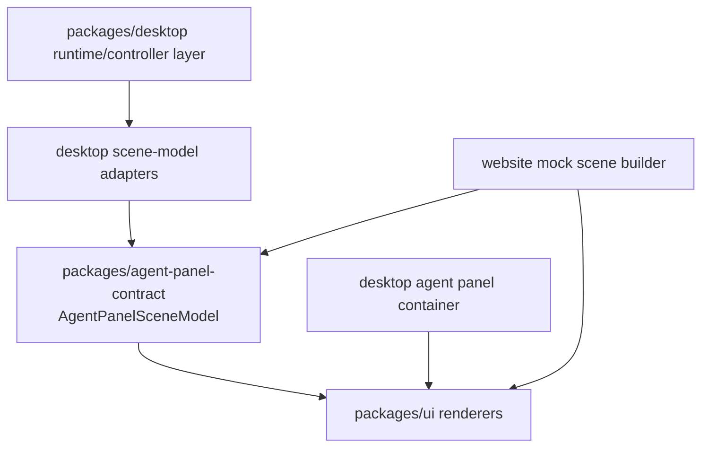
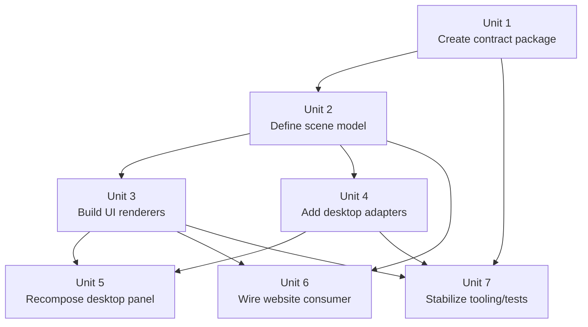

# refactor: Introduce scene-model architecture for the agent panel

## Overview

Adopt a three-layer architecture for the agent panel:

1. **Runtime/controller layer** in `packages/desktop`
2. **Shared scene-model contract layer** in a new workspace package
3. **Pure renderer layer** in `packages/ui`

This is the cleanest end-state for making the agent panel reusable across desktop and website without leaking runtime behavior into shared UI. The website becomes a downstream consumer of the same scene model and renderers, while desktop remains the owner of stores, side effects, virtualization, and orchestration.

## Problem Frame

The current system mixes three concerns:

- desktop runtime ownership
- presentational rendering
- cross-surface reuse

That is why the current “extract dumb UI into `packages/ui`” direction feels correct but still incomplete. If `packages/ui` owns both all rendering and the only shared contract, the boundary stays workable but not maximally clean. The cleanest architecture introduces an explicit middle layer: a stable **scene model** that describes the full agent-panel surface as renderable state.

### Desired Layer Split

| Layer | Owns | Must not own |
|---|---|---|
| `packages/desktop` | stores, ACP state, provider/runtime logic, virtualization, thread-follow, permissions, worktrees, composer behavior, side effects | shared presentational contracts |
| `packages/agent-panel-contract` | `AgentPanelSceneModel`, region models, action contracts, renderable state vocabulary | Svelte components, stores, Tauri, side effects |
| `packages/ui` | pure scene renderers and leaf components for the scene model | runtime state, store access, provider logic |

This architecture is “god mode” because the UI boundary stops being “a lot of props across a lot of files” and becomes **one canonical render contract**.

## Requirements Trace

- R1. The final architecture must separate runtime control, shared UI contract, and rendering into three distinct layers.
- R2. A new shared workspace package must own the agent-panel scene model and related renderable contracts.
- R3. `packages/ui` must render the agent panel from the scene model, not from desktop store types or desktop-only view-state objects.
- R4. `packages/desktop` must remain the only owner of runtime/stateful behavior: stores, session context, virtualization, side effects, provider policy, permissions, worktrees, and panel lifecycle.
- R5. The architecture must support the full panel surface, not just conversation rows: header, composer, modified-files header, PR card, todo/permission/plan UI, status cards, and panel-local chrome.
- R6. The architecture must support website consumption through mocked scene models without importing desktop runtime helpers.
- R7. Migration must be incremental: desktop can keep orchestration containers while replacing renderers underneath them.
- R8. The scene model must be explicit enough to prevent shared-context creep across package boundaries.

## Success Metrics

- The desktop panel keeps runtime ownership while rendering through shared scene contracts and shared renderers.
- At least one desktop-produced scene model and one website mock scene both render through the same `packages/ui` scene-renderer entry points.
- Core workflows remain intact through the migration: sending a message, following long conversations, handling permissions, and rendering review/worktree states.
- New agent-panel regions are added once in the contract + renderer layers instead of being redefined independently in desktop and website consumers.

## Scope Boundaries

- Do not move desktop runtime/state machines into the new contract package.
- Do not move Tauri APIs, stores, or provider-specific logic out of desktop.
- Do not force browser panel, terminal panel, or unrelated ACP surfaces into the same scene model unless they are necessary as embedded regions of the agent panel.
- Do not require the website to run real ACP flows.
- Do not make this plan a generalized “scene model for the whole app” effort; it is specifically for the agent panel.

## Context & Research

### Relevant Code and Patterns

- `packages/desktop/src/lib/acp/components/agent-panel/components/agent-panel.svelte` is the current mixed-responsibility container. It imports runtime stores, panel logic, UI surfaces, composer UI, PR UI, modified-files UI, plan/todo/permission UI, and status cards.
- `packages/desktop/src/lib/acp/components/agent-panel/components/agent-panel-header.svelte` and `agent-panel-footer.svelte` already prove that some presentation is partially shared while orchestration remains desktop-local.
- `packages/desktop/src/lib/acp/components/agent-panel/components/virtualized-entry-list.svelte` confirms that virtualization and thread-follow are runtime-heavy and should stay in desktop.
- `packages/desktop/src/lib/acp/components/tool-calls/tool-definition-registry.ts` and `tool-call-task/logic/convert-task-children.ts` already follow the right pattern: runtime data is translated into shared display-shaped data before rendering.
- `packages/ui/src/components/agent-panel/types.ts` is a useful seed, but it is currently too renderer-local to serve as the sole architectural contract for the full panel surface.
- Root workspace resolution is `packages/*`, which currently yields `packages/desktop`, `packages/ui`, `packages/website`, and `packages/changelog`; root scripts also reference `packages/acps/claude` outside that workspace set. Introducing `packages/agent-panel-contract` is therefore a new workspace-level architectural move, and validation needs to account for both workspace and non-workspace script touchpoints.

### Institutional Learnings

- `docs/solutions/best-practices/provider-owned-policy-and-identity-not-ui-projections-2026-04-09.md` strongly supports keeping runtime/provider policy out of shared UI and shared projections.
- `docs/solutions/logic-errors/kanban-live-session-panel-sync-2026-04-02.md` reinforces that cross-surface reuse works best when multiple surfaces project from a canonical model instead of inventing parallel truth.
- `docs/solutions/logic-errors/thinking-indicator-scroll-handoff-2026-04-07.md` reinforces that desktop still needs to own thread-follow and virtualized rendering behavior even if the visible rows become shared.

### External References

- None. This plan is driven by internal architecture needs and codebase shape.

## Key Technical Decisions

| Decision | Rationale |
|---|---|
| Introduce `packages/agent-panel-contract` as a new workspace | The scene model deserves its own non-UI, non-runtime home. |
| Use `AgentPanelSceneModel` as the canonical render contract | One model is cleaner than dozens of cross-package prop seams. |
| Keep runtime adapters in desktop | Desktop knows the stores and side effects; the contract package should stay pure. |
| Keep renderers in `packages/ui` | UI package remains the only shared rendering layer. |
| Keep virtualization in desktop and feed it scene rows | Virtualization is runtime behavior, not shared UI. |
| Model actions as typed action ids in the contract plus explicit callback maps from consumers | Resolves the interaction seam early and keeps the renderer contract dumb, explicit, and mockable. |
| Keep `@acepe/ui/agent-panel` as the stable public barrel during migration | Existing consumers already import that subpath, so the refactor should extend it rather than create an ad hoc compatibility layer. |
| Treat website as a secondary validation consumer, not the primary architecture driver | The request requires website main-page rendering, but desktop runtime remains the authoritative source for the panel contract. |

## Surface Ownership Map

| Surface / region | Target owner | Notes |
|---|---|---|
| Panel shell chrome, header, footer, empty/error/setup/install states | `packages/ui` renderers + `packages/agent-panel-contract` models | Shared visual regions with no runtime ownership. |
| Conversation row rendering | `packages/ui` renderers + `packages/agent-panel-contract` row models | Shared row presentation. |
| Conversation virtualization, scroll-follow, thread-follow, viewport management | `packages/desktop` | Stays desktop-only; it renders shared rows but owns the list controller. |
| Composer UI, attach-file affordances, submit affordances | `packages/ui` renderers + `packages/agent-panel-contract` models | Desktop supplies callback maps and controlled values. |
| PR card, modified-files header, queue strip, todo header, permission bar, plan header/sidebar, status cards | `packages/ui` renderers + `packages/agent-panel-contract` models | Explicitly in scope for the shared scene. |
| Browser panel, terminal panel, and other non-panel ACP surfaces | remain in their current domains unless embedded by reference | Not forced into this migration unless the panel only needs to host them. |
| Attached-file pane visual presentation | `packages/ui` if it is panel-local chrome; desktop remains owner of attachment state | Keep visual reuse separate from attachment/runtime policy. |

## Alternative Approaches Considered

| Approach | Why not chosen |
|---|---|
| Keep everything prop-driven directly from desktop into `packages/ui` with no middle package | Safer migration, but not the cleanest architecture; too much coupling through ad hoc prop bundles. |
| Use shared Svelte context across packages | Violates the “dumb shared UI” goal and obscures ownership boundaries. |
| Move more runtime behavior into shared packages | Would blur provider/runtime responsibility and weaken desktop ownership. |

## Open Questions

### Resolved During Planning

- **Context or props at the package boundary?** Neither as the primary architecture. The canonical boundary is a scene model package; renderers then use normal local props internally.
- **Should the contract live in `packages/ui`?** No. The cleanest split is a separate non-UI workspace.
- **Should virtualization move?** No. Desktop keeps it.
- **How are interactions modeled?** The contract defines typed action ids per region, and each consumer passes an explicit callback map that binds those ids to runtime behavior.

### Deferred to Implementation

- Exact scene-model naming and file splitting inside `packages/agent-panel-contract`
- How far to push scene-model reuse into adjacent surfaces after the main panel is stable

## High-Level Technical Design

> *This illustrates the intended approach and is directional guidance for review, not implementation specification. The implementing agent should treat it as context, not code to reproduce.*

The intended flow is:

- runtime state becomes a scene model in desktop
- scene model is the only thing shared across runtime and renderer packages
- `packages/ui` renders the scene model
- desktop and website both consume the same renderers

### Virtualization and session-context seam

The desktop boundary is:

- `virtualized-entry-list.svelte` stays in `packages/desktop`
- it stops owning row presentation details
- it receives scene-model row data and renders shared row/entry components from `packages/ui`
- `useSessionContext`, scroll-follow, and viewport state stay above the renderer seam in desktop containers
- the row contract must stay render-focused: stable row ids, ordering semantics, render kind, expansion state projection, and only the minimum viewport hints needed for virtualization

This keeps the list controller runtime-local while still extracting the visible conversation UI.

## Implementation Dependency Graph

## Implementation Units

### [ ] Unit 1: Create the shared contract workspace

**Goal:** Introduce a new workspace package for the scene-model contract.

**Requirements:** R1-R3, R8

**Dependencies:** None

**Files:**
- Create: `packages/agent-panel-contract/package.json`
- Create: `packages/agent-panel-contract/tsconfig.json`
- Create: `packages/agent-panel-contract/src/index.ts`
- Create: `packages/agent-panel-contract/src/index.test.ts`
- Modify: `package.json`
- Modify: `packages/desktop/package.json`
- Modify: `packages/website/package.json`
- Modify: `packages/ui/package.json`
- Test: `packages/agent-panel-contract/src/index.test.ts`

**Approach:**
- Add a new workspace package named `@acepe/agent-panel-contract`.
- Keep it TypeScript-only and dependency-light.
- Wire it into desktop, website, and UI as a shared dependency.
- Update repo-level scripts only as needed so the new package participates in checks/tests.

**Patterns to follow:**
- `packages/ui/package.json`
- `packages/desktop/package.json`

**Test scenarios:**
- Happy path — desktop, website, and UI packages can import the new contract package through workspace resolution.
- Integration — repo scripts and package manifests recognize the new workspace without breaking existing package resolution.

**Verification:**
- The repo has a dedicated shared package for non-UI, non-runtime agent-panel contracts.

### [ ] Unit 2: Define `AgentPanelSceneModel` and region contracts

**Goal:** Create the canonical render model for the full agent-panel surface.

**Requirements:** R1-R6, R8

**Dependencies:** Unit 1

**Files:**
- Create: `packages/agent-panel-contract/src/agent-panel-scene-model.ts`
- Create: `packages/agent-panel-contract/src/agent-panel-conversation-model.ts`
- Create: `packages/agent-panel-contract/src/agent-panel-composer-model.ts`
- Create: `packages/agent-panel-contract/src/agent-panel-sidebar-model.ts`
- Create: `packages/agent-panel-contract/src/agent-panel-action-contracts.ts`
- Modify: `packages/agent-panel-contract/src/index.ts`
- Test: `packages/desktop/src/lib/acp/components/agent-panel/__tests__/agent-panel-scene-model-contract.test.ts`

**Approach:**
- Define a top-level `AgentPanelSceneModel` with nested regions for header, conversation, composer, state cards, review/PR/modified-files strips, and optional side regions.
- Define action ownership in the contract up front: region models expose typed action ids and consumers provide explicit callback maps keyed by those ids.
- Reuse existing shared entry shapes where they are good enough; expand them only when needed for the full panel scene.
- Keep all types serializable and mockable so website fixtures stay easy to build.
- Add a scene-model fixture builder or test fixture shape early so both desktop and website can prove compatibility against the same contract vocabulary.
- Build a parity inventory from the current desktop panel states and regions, and use that inventory as the completeness checklist for Units 2-5.

**Patterns to follow:**
- `packages/ui/src/components/agent-panel/types.ts`
- `packages/desktop/src/lib/acp/components/tool-calls/tool-definition-registry.ts`

**Test scenarios:**
- Happy path — a complete desktop panel can be described by the scene model without raw store types.
- Edge case — empty, connecting, error, install, setup, and review-heavy states can all be represented.
- Integration — conversation/task/tool-call models support nested task children and thinking/optimistic states.
- Integration — the contract parity inventory covers the current desktop panel regions and low-frequency states before renderer migration begins.

**Verification:**
- The full visible agent-panel surface is expressible as one shared scene model.

### [ ] Unit 3: Build pure scene renderers in `packages/ui`

**Goal:** Make `packages/ui` render the full panel from the scene model.

**Requirements:** R1-R3, R5-R6

**Dependencies:** Unit 2

**Files:**
- Modify: `packages/ui/src/components/agent-panel/index.ts`
- Add: `packages/ui/src/components/agent-panel-scene/agent-panel-scene.svelte`
- Add: `packages/ui/src/components/agent-panel-scene/agent-panel-scene-header.svelte`
- Add: `packages/ui/src/components/agent-panel-scene/agent-panel-scene-conversation.svelte`
- Add: `packages/ui/src/components/agent-panel-scene/agent-panel-scene-composer.svelte`
- Add: `packages/ui/src/components/agent-panel-scene/agent-panel-scene-sidebar.svelte`
- Add: `packages/ui/src/components/agent-panel-scene/agent-panel-scene-status-strip.svelte`
- Add: `packages/ui/src/components/agent-panel-scene/agent-panel-scene-review-card.svelte`
- Add: `packages/ui/src/components/agent-panel-scene/index.ts`
- Add: `packages/ui/src/components/agent-panel-scene/agent-panel-scene.test.ts`
- Modify: `packages/ui/src/index.ts`
- Test: `packages/ui/src/components/agent-panel-scene/agent-panel-scene.test.ts`
- Test: `packages/desktop/src/lib/acp/components/agent-panel/__tests__/agent-panel-scene-renderer.test.ts`

**Approach:**
- Build a new scene-renderer family in `packages/ui` that consumes `AgentPanelSceneModel`.
- Move the currently desktop-owned presentational pieces under these scene renderers or wrap the existing shared primitives where reuse is clean.
- Extend the existing `@acepe/ui/agent-panel` barrel so current consumers keep a stable import path while the new scene-renderer entries land.
- Keep renderer inputs restricted to scene model data plus explicit event bindings/callback props.
- Split conversation responsibilities cleanly: `packages/ui` owns entry and region renderers, while desktop owns viewport virtualization and session-context lookup.
- Do not let renderers import desktop-only utilities, stores, or Svelte contexts for runtime data.

**Patterns to follow:**
- `packages/ui/src/components/agent-panel/*`
- `packages/ui/src/components/kanban/kanban-scene-board.svelte`

**Test scenarios:**
- Happy path — renderers display header, conversation, composer, PR/review, and status-card regions from one scene model.
- Edge case — hidden/omitted regions degrade cleanly when a scene model leaves them out.
- Integration — the same renderer works for a desktop-adapted scene without requiring store/session-context imports.
- Integration — the existing `@acepe/ui/agent-panel` barrel exports the new scene-renderer surface without breaking current tool/message consumers.

**Verification:**
- `packages/ui` renders the full panel surface from the scene model without runtime imports.

### [ ] Unit 4: Build desktop scene-model adapters

**Goal:** Translate desktop runtime state into `AgentPanelSceneModel`.

**Requirements:** R2-R5, R7-R8

**Dependencies:** Unit 2

**Files:**
- Add: `packages/desktop/src/lib/acp/components/agent-panel/scene/build-agent-panel-scene-model.ts`
- Add: `packages/desktop/src/lib/acp/components/agent-panel/scene/build-agent-panel-conversation-scene.ts`
- Add: `packages/desktop/src/lib/acp/components/agent-panel/scene/build-agent-panel-composer-scene.ts`
- Add: `packages/desktop/src/lib/acp/components/agent-panel/scene/build-agent-panel-status-scenes.ts`
- Add: `packages/desktop/src/lib/acp/components/agent-panel/scene/build-agent-panel-action-map.ts`
- Test: `packages/desktop/src/lib/acp/components/agent-panel/__tests__/build-agent-panel-scene-model.test.ts`

**Approach:**
- Centralize scene-model construction in desktop instead of scattering it across render components.
- Adapt existing tool-call/display helpers into the scene-model builders rather than duplicating translation logic.
- Build the explicit callback map that binds contract action ids to desktop runtime handlers.
- Keep virtualization-specific data and callbacks outside the shared contract except where needed as row/viewport instructions, and define those instructions narrowly so runtime-shaped row objects do not leak across the boundary.

**Patterns to follow:**
- `packages/desktop/src/lib/acp/components/tool-calls/tool-definition-registry.ts`
- `packages/desktop/src/lib/acp/components/tool-calls/tool-call-task/logic/convert-task-children.ts`

**Test scenarios:**
- Happy path — active sessions produce complete scene models.
- Edge case — optimistic first-send, pending permissions, review mode, worktree setup, and PR generation states produce correct regions.
- Integration — adapters consume runtime state and emit pure contract types only.

**Verification:**
- Desktop has one explicit adapter layer from runtime to scene model.

### [ ] Unit 5: Recompose desktop around runtime containers + scene renderers

**Goal:** Make the desktop panel a controller shell that hosts runtime-only containers and shared scene renderers.

**Requirements:** R1, R4-R5, R7-R8

**Dependencies:** Units 3-4

**Files:**
- Modify: `packages/desktop/src/lib/acp/components/agent-panel/components/agent-panel.svelte`
- Modify: `packages/desktop/src/lib/acp/components/agent-panel/components/agent-panel-content.svelte`
- Modify: `packages/desktop/src/lib/acp/components/agent-panel/components/virtualized-entry-list.svelte`
- Modify: `packages/desktop/src/lib/acp/components/agent-panel/components/index.ts`
- Modify: `packages/desktop/src/lib/acp/components/agent-panel/components/agent-panel-header.svelte`
- Modify: `packages/desktop/src/lib/acp/components/agent-panel/components/agent-panel-footer.svelte`
- Test: `packages/desktop/src/lib/acp/components/agent-panel/__tests__/agent-panel-component.test.ts`
- Test: `packages/desktop/src/lib/acp/components/agent-panel/components/__tests__/agent-panel-content.svelte.vitest.ts`

**Approach:**
- Keep desktop’s top-level panel shell, lifecycle, and virtualization.
- Replace direct presentational composition with scene renderers fed by scene-model builders.
- Remove direct `useSessionContext`-driven presentation decisions from shared-facing render paths; keep them in the controller/container layer.
- Let desktop host any remaining runtime-only containers needed to bridge virtualization, thread-follow, and side effects.

**Patterns to follow:**
- `packages/desktop/src/lib/acp/components/agent-panel/components/agent-panel.svelte`
- `packages/desktop/src/lib/acp/components/agent-panel/components/virtualized-entry-list.svelte`

**Test scenarios:**
- Happy path — desktop panel behavior remains intact after moving rendering to scene renderers.
- Edge case — fullscreen, browser drawer, terminal drawer, review state, and worktree close flows still behave correctly.
- Integration — runtime-only components do not leak store ownership into shared renderers.

**Verification:**
- Desktop becomes a controller shell over shared scene renderers rather than a mixed runtime/UI monolith.
- Core workflows still work through the shared seam: sending a message, following long conversations, handling permissions, and rendering review/worktree states.

### [ ] Unit 6: Wire the website as a mocked scene consumer

**Goal:** Make the website render the same scene/renderers through mocked scene models across the current agent-panel demo consumers.

**Requirements:** R6-R7

**Dependencies:** Units 2-3

**Files:**
- Modify: `packages/website/src/lib/components/agent-panel-demo.svelte`
- Add: `packages/website/src/lib/components/agent-panel-demo-scene.ts`
- Modify: `packages/website/src/lib/components/feature-showcase.svelte`
- Modify: `packages/website/src/lib/components/homepage-features.svelte`
- Modify: `packages/website/src/lib/components/main-app-view-demo.svelte`
- Test: `packages/website/src/lib/components/feature-showcase.test.ts`
- Test: `packages/website/src/lib/components/agent-panel-demo.test.ts`

**Approach:**
- Replace the website’s ad hoc demo wiring with mocked `AgentPanelSceneModel` fixtures.
- Keep timing, replay, and theme-aware asset selection local to website.
- Bound this unit to the current website consumers that already embed agent-panel demos instead of expanding into broader route or marketing-surface redesign.
- Validate that website imports only `@acepe/agent-panel-contract` and `@acepe/ui`, never desktop runtime helpers.
- Use website rendering as a secondary validation surface for the architecture because the requested outcome includes main-page reuse, but keep desktop runtime output as the primary truth source for the contract.

**Patterns to follow:**
- `packages/website/src/lib/components/landing-kanban-demo.svelte`
- `packages/website/src/lib/components/agent-panel-demo.svelte`

**Test scenarios:**
- Happy path — website feature showcase renders the shared scene.
- Edge case — replay and timed entry reveals work from mocked scene models.
- Integration — no desktop runtime imports are required to render the website demo.

**Verification:**
- Website is a first-class proof that the architecture is reusable.

### [ ] Unit 7: Stabilize tooling, exports, and migration guardrails

**Goal:** Ensure the new package/layering participates cleanly in tests, typechecks, and exports.

**Requirements:** R1-R8

**Dependencies:** Units 1, 3-4

**Files:**
- Modify: `package.json`
- Modify: `packages/ui/package.json`
- Modify: `packages/desktop/package.json`
- Modify: `packages/website/package.json`
- Add: `packages/agent-panel-contract/README.md`
- Test: `packages/agent-panel-contract/src/index.test.ts`
- Test: `packages/desktop/src/lib/acp/components/agent-panel/__tests__/scene-model-boundary.test.ts`
- Test: `packages/desktop/src/lib/acp/components/agent-panel/__tests__/ui-agent-panel-compatibility.test.ts`

**Approach:**
- Make workspace/test/tooling changes explicit so the new architecture is part of the repo’s normal development flow.
- Document the boundary rules for the contract package and UI package.
- Add package-level smoke tests for the contract package, package-local scene-renderer tests in `packages/ui`, explicit `@acepe/ui/agent-panel` compatibility checks, and at least one guardrail test that fails if desktop store/runtime types begin leaking into shared renderer or contract imports.
- Enforce the boundary with package `exports`, TypeScript project references/path restrictions, and import-boundary lint rules; keep tests as defense-in-depth rather than the only enforcement layer.

**Patterns to follow:**
- `package.json`
- `packages/ui/package.json`

**Test scenarios:**
- Integration — root/workspace scripts still run with the new package present.
- Edge case — import boundary tests catch accidental runtime leakage into shared packages.
- Integration — existing `@acepe/ui/agent-panel` consumers continue to work through the stable barrel while new scene-renderer exports are added to that same public surface.

**Verification:**
- The new architecture is supported by repo tooling and has explicit anti-regression guardrails.

## System-Wide Impact

- **Desktop panel architecture:** shifts from mixed runtime/UI composition to controller + scene-model + renderer layering.
- **Shared package topology:** adds a new workspace package and introduces a stronger separation between contracts and rendering.
- **Website consumption model:** becomes a true architecture proof rather than a one-off demo path.
- **Boundary enforcement:** import/test/tooling guardrails become part of the implementation, not just prose intent.

## Risks & Dependencies

| Risk | Mitigation |
|------|------------|
| New package adds too much migration overhead | Keep it contract-only and introduce it before moving rendering. |
| Scene model becomes bloated or mirrors runtime too closely | Keep it render-focused and serialize only visible/UI-meaningful state. |
| Desktop migration regresses behavior | Keep runtime containers in desktop and migrate renderers incrementally. |
| Website proves only a simplified subset | Explicitly require full-scene renderer compatibility, not just conversation rows. |
| Tooling drift leaves the new package untested | Make script/package updates a dedicated implementation unit. |

## Documentation / Operational Notes

- This plan supersedes the narrower extraction strategy in `docs/plans/2026-04-10-002-refactor-shared-agent-panel-website-scene-plan.md`.
- If implemented, follow-on documentation should explain the three-layer architecture so future panel work does not regress back into mixed ownership.

## Sources & References

- Related code: `packages/desktop/src/lib/acp/components/agent-panel/components/agent-panel.svelte`
- Related code: `packages/desktop/src/lib/acp/components/agent-panel/components/agent-panel-header.svelte`
- Related code: `packages/desktop/src/lib/acp/components/agent-panel/components/virtualized-entry-list.svelte`
- Related code: `packages/desktop/src/lib/acp/components/tool-calls/tool-definition-registry.ts`
- Related code: `packages/ui/src/components/agent-panel/types.ts`
- Related code: `packages/ui/package.json`
- Related code: `packages/desktop/package.json`
- Related code: `packages/website/package.json`
- Superseded plan: [docs/plans/2026-04-10-002-refactor-shared-agent-panel-website-scene-plan.md](docs/plans/2026-04-10-002-refactor-shared-agent-panel-website-scene-plan.md)
- Institutional learning: [docs/solutions/best-practices/provider-owned-policy-and-identity-not-ui-projections-2026-04-09.md](docs/solutions/best-practices/provider-owned-policy-and-identity-not-ui-projections-2026-04-09.md)
- Institutional learning: [docs/solutions/logic-errors/kanban-live-session-panel-sync-2026-04-02.md](docs/solutions/logic-errors/kanban-live-session-panel-sync-2026-04-02.md)
- Institutional learning: [docs/solutions/logic-errors/thinking-indicator-scroll-handoff-2026-04-07.md](docs/solutions/logic-errors/thinking-indicator-scroll-handoff-2026-04-07.md)
