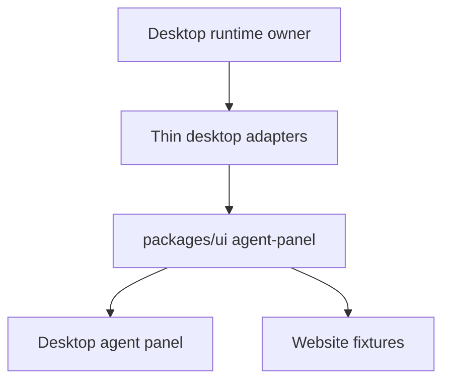
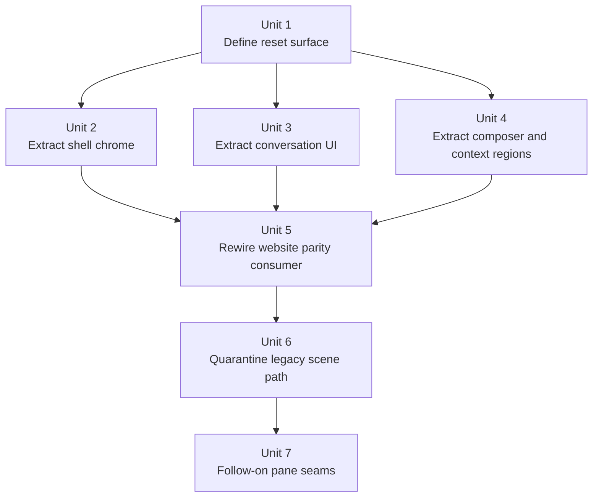

# refactor: Reset agent panel UI extraction around desktop-first shared components

## Overview

Replace the scene-model-first migration with a desktop-first extraction plan that moves the real presentational agent panel UI into `packages/ui`, keeps runtime ownership in `packages/desktop`, and makes the website consume the same shared components through fixtures instead of a parallel scene abstraction.

This plan targets two outcomes:

1. a **trustworthy first shipment** where desktop and website visibly share the same core agent-panel UI
2. a **clean long-term seam** where runtime-heavy panel behavior stays in desktop and shared UI is extracted from real desktop presentation instead of being reimagined

## Problem Frame

The previous migration produced a reusable scene layer, but it missed the product goal. The website now renders a new shared interpretation of the agent panel, while desktop still owns the actual panel presentation. That creates duplication without trustworthy reuse.

The reset requirements in [docs/brainstorms/2026-04-10-agent-panel-ui-extraction-reset-requirements.md](docs/brainstorms/2026-04-10-agent-panel-ui-extraction-reset-requirements.md) make the correction explicit:

- desktop is the baseline reference for this reset
- the shared layer must be extracted from real desktop UI
- the first shipment must name a mandatory shared slice and an explicit defer list
- parity must be measured with a rubric, not by subjective similarity claims

## Requirements Trace

- R1-R4. Extract desktop presentation into `packages/ui`, reuse it across desktop and website, and do not replace hard regions with lookalikes.
- R5-R8. Target the visible panel as the long-term surface while keeping runtime ownership in desktop and keeping shared UI dumb.
- R9-R12. Use a desktop-first migration, name a mandatory first-shipment slice and defer list, define presentational behavior boundaries, and require explicit parity review.
- R13-R15. Preserve fidelity incrementally, define a parity rubric, and ensure the website demonstrates core product moments with the same components.
- R16-R19. Decompose the desktop monolith into runtime-neutral children and thin adapters, keep conversation virtualization in desktop, reduce duplication, and avoid replacing one bloated abstraction with another.

## Scope Boundaries

- Do not keep `@acepe/agent-panel-contract` or `packages/ui/src/components/agent-panel-scene/` as the target architecture simply because they already exist.
- Do not move ACP orchestration, provider policy, session stores, thread-follow, or Tauri integration into `packages/ui`.
- Do not force runtime-bound pane bodies into the first shipment if they cannot be extracted faithfully.
- Do not build a website-specific panel model or visual fallback path separate from the extracted shared components.
- Do not turn this plan into a general design-system overhaul outside the agent panel.

## Context & Research

### Relevant Code and Patterns

- `packages/desktop/src/lib/acp/components/agent-panel/components/agent-panel.svelte` is still the canonical panel container and the clearest inventory of visible regions plus runtime seams.
- `packages/desktop/src/lib/acp/components/agent-panel/components/agent-panel-content.svelte` and `virtualized-entry-list.svelte` already show the correct desktop/runtime split for conversation rendering: list ownership, scroll-follow, reveal behavior, and session wiring stay local to desktop.
- `packages/desktop/src/lib/acp/components/agent-panel/components/agent-panel-footer.svelte` shows that footer chrome and runtime controls are currently mixed together, making it a good extraction seam for slot/callback-based shared UI.
- `packages/ui/src/components/agent-panel/` already contains reusable presentational leaf components for user messages, assistant messages, and many tool-call rows. That library should be extended, not bypassed.
- `packages/ui/src/components/kanban/kanban-scene-board.svelte` and `packages/desktop/src/lib/components/main-app-view/components/content/kanban-view.svelte` show the right cross-surface pattern: desktop/runtime adapters feed shared UI with explicit handlers, and the website consumes matching fixtures.
- `packages/website/src/lib/components/agent-panel-demo.svelte`, `agent-panel-demo-scene.ts`, `feature-showcase.svelte`, and `main-app-view-demo.svelte` are the current website consumers that must be redirected away from the scene-model path.
- `packages/ui/src/components/agent-panel-scene/` and `packages/agent-panel-contract/` represent the failed abstraction seam. They are inputs to cleanup/migration planning, not the architectural destination.

### Institutional Learnings

- `docs/solutions/best-practices/provider-owned-policy-and-identity-not-ui-projections-2026-04-09.md` — shared layers must not infer provider/runtime policy from UI projections; runtime ownership stays explicit and local.
- `docs/solutions/logic-errors/kanban-live-session-panel-sync-2026-04-02.md` — cross-surface reuse works when multiple surfaces project from the same canonical runtime owner, not when each surface invents parallel models.
- `docs/solutions/logic-errors/thinking-indicator-scroll-handoff-2026-04-07.md` — thread-follow, reveal targeting, and virtualization are delicate runtime concerns and must remain above the shared presentation boundary.

### External References

- None. The repo already has strong local patterns for runtime ownership, dumb shared UI, and cross-surface projection, so external research would add little value here.

## Key Technical Decisions

| Decision | Rationale |
|---|---|
| Make `@acepe/ui/agent-panel` the primary shared surface | The reset is about reusing real UI components, not preserving a scene-model-first abstraction. |
| Treat `@acepe/agent-panel-contract` as migration residue, not the target seam | Keeping it as the architectural center would prolong the failed direction. If any part survives, it must shrink into a thin adapter or type shim. |
| Decompose the desktop panel leaf-first | `packages/ui/src/components/agent-panel/` already contains reusable leaves, while `agent-panel.svelte` remains monolithic and runtime-heavy. Extracting from the leaves outward is lower risk than another top-down rewrite. |
| Keep conversation list ownership in desktop | `virtualized-entry-list.svelte` owns virtualization, thread-follow, reveal behavior, and session context; the shared seam should stop at presentational rows and region-local states. |
| Use slot/callback seams for runtime-bound chrome | Footer controls, pane toggles, and sidebar affordances can be shared visually without moving their runtime bodies or orchestration into `packages/ui`. |
| Keep i18n/text selection above the shared UI boundary | `packages/ui` should receive already-resolved labels, copy, and display strings from desktop/website adapters rather than importing Paraglide or app-local localization helpers. |
| Canonical shared panel types live in `@acepe/ui/agent-panel` | Shared presentational props, callback contracts, and public component entry points need one permanent owner. If `@acepe/agent-panel-contract` survives temporarily, it must be a frozen one-way legacy shim with no new exports. |
| Canonical parity fixtures live beside the shared UI | Desktop keeps package-local runtime adapters, but the named Phase 1 parity states should come from shared fixture/preset definitions so website and review artifacts cannot drift through hand-assembled props. |
| Legacy scene-first artifacts are removed, not merely deprecated | The reset is only complete when the old scene-first path is no longer an attractive or supported extension seam. Temporary shims are allowed only to unblock migration and must have an explicit deletion step. |
| Make the first shipment explicit | The mandatory first shared slice should restore trust quickly, while runtime-bound pane bodies move only after the seam is proven. |
| Define parity evidence up front | Phase 1 completion must require named-state fixture coverage plus side-by-side visual review artifacts, so parity is an auditable gate rather than a subjective claim. |
| Use parity review artifacts as a gate | The reset must prove sameness with named states and side-by-side evidence rather than subjective “looks close enough” review. |

## Open Questions

### Resolved During Planning

- **Update the old plan or create a new one?** Create a new plan. The previous plan optimized the wrong seam and is now explicitly superseded.
- **Should external research run?** No. The repo already shows the key architectural patterns and the failure mode is local, not framework-driven.
- **What is the first-shipment shared slice?** Shared shell and header/footer chrome, empty/ready/error/install/setup states, conversation presentational rows/cards, composer presentation, and inline status/review/plan/todo/permission surfaces.
- **What is explicitly deferred from the first shipment?** Runtime-bound pane bodies: embedded browser content, terminal drawer content, attached-file pane body, checkpoint timeline, and full review/detail panes unless a later unit proves a faithful shared shell for them.
- **What parity states must the first shipment prove?** Use the canonical Phase 1 parity matrix below.
- **What is the default disposition of the failed scene-first path?** Remove it from active desktop and website consumers during Phase 1, demote it from all primary barrels, and delete remaining legacy artifacts by the end of this plan. Temporary compatibility shims are allowed only when they unblock in-flight migration and must have a defined deletion step.
- **Who permanently owns the shared panel types and callbacks?** `@acepe/ui/agent-panel` owns the canonical shared presentational types, callback contracts, and public entry points. Any surviving scene-first package becomes a frozen legacy shim and cannot gain new exports.

### Deferred to Implementation

- The final shared prop/type split for sidebar and drawer shells after implementation confirms which pane bodies can stay desktop-owned without visual drift.

## High-Level Technical Design

> *This illustrates the intended approach and is directional guidance for review, not implementation specification. The implementing agent should treat it as context, not code to reproduce.*

The shape of the reset is:

- desktop keeps stores, orchestration, virtualization, and pane-body ownership
- desktop adapters turn runtime state into explicit shared props
- `packages/ui` renders the actual panel presentation
- website fixtures feed those same components directly

## Phased Delivery

### Phase 1 — Trustworthy shared slice

Ship the minimum shared surface that makes the website a credible representation of the product:

- panel shell and header/footer chrome
- `project_selection`, empty/ready/error/install/setup states
- conversation presentation
- composer presentation
- inline status, review, plan, todo, and permission surfaces
- legacy scene-first modules removed from active desktop and website consumers
- primary shared barrels no longer advertise `AgentPanelScene*` as first-class APIs

**Phase 1 stop line:** Units 1-6 below. Unit 7 is explicit follow-on work and is **not** required to call the first shipment complete. However, full completion of this reset plan also requires deleting any temporary legacy shims created during Units 1-6.

### Phase 1 parity matrix

| State | Required in Phase 1 | Notes |
|---|---|---|
| `project_selection` | Yes | Shared shell/state presentation |
| `ready_empty` | Yes | Shared shell/state presentation |
| `error_install_setup` | Yes | Shared shell/state presentation |
| `optimistic_send_thinking` | Yes | Pre-session user message + trailing thinking shimmer |
| `active_streaming_conversation` | Yes | Shared row presentation, desktop-owned follow/reveal |
| `historical_restore` | Yes | Shared row presentation under desktop-owned restore/follow |
| `modified_files_review_context` | Yes | Inline status/review surfaces, not full review pane body |
| `todo_live_completed_paused` | Yes | Shared todo/plan context presentation |
| `plan_collapsed_open_trigger` | Yes | Shared header/trigger state; full sidebar body may remain deferred |
| `browser_toggle_chrome` | Yes | Toggle/shared chrome only; pane body deferred by default |
| `terminal_toggle_available_disabled` | Yes | Toggle/shared chrome only; drawer body deferred by default |

### Phase 2 — Runtime-bound pane seams

After Phase 1 is stable, decide which currently visible pane bodies can gain shared shells without violating runtime ownership:

- browser pane chrome vs embedded browser body
- terminal drawer chrome vs terminal renderer body
- attached-file pane chrome vs file viewer body
- review/detail panes and checkpoint timeline

| Pane family | Phase 1 default | Override condition |
|---|---|---|
| Browser | Shared toggle/chrome only; body deferred | A shared shell can host the existing desktop body without moving browser runtime into `packages/ui` |
| Terminal drawer | Shared toggle/chrome only; body deferred | A shared drawer shell can wrap the existing desktop terminal renderer without changing ownership |
| Attached-file pane | Deferred | A shared shell can wrap the existing pane while keeping file-view runtime local |
| Review/detail pane | Deferred | Inline review context is stable and a shared shell can wrap the body without recreating review logic |
| Checkpoint timeline | Deferred | A panel-local shell can be shared without forcing full takeover behavior into `packages/ui` |

## Implementation Dependency Graph

## Implementation Units

- [ ] **Unit 1: Define the reset surface and shared prop contracts**

**Goal:** Establish the first-shipment shared slice, explicit defer list, parity state matrix, and the shared prop/contracts that `packages/ui/agent-panel` will own.

**Requirements:** R1-R4, R7-R12, R16-R19

**Dependencies:** None

**Files:**
- Modify: `packages/ui/src/components/agent-panel/types.ts`
- Modify: `packages/ui/src/components/agent-panel/index.ts`
- Create: `packages/ui/src/components/agent-panel/parity-fixtures.ts`

**Approach:**
- Define desktop-derived presentational prop shapes in `packages/ui/src/components/agent-panel/types.ts` for the shared shell, conversation rows, composer presentation, and inline status/context regions.
- Establish the canonical Phase 1 parity matrix and defer-list defaults as the review baseline for all downstream units.
- Declare `@acepe/ui/agent-panel` as the permanent owner of shared presentational types and callback contracts; any surviving `@acepe/agent-panel-contract` surface becomes legacy-only and frozen.
- Add shared parity fixture/preset definitions next to the shared UI so website fixtures and review artifacts pull from one canonical state source rather than hand-assembling parity-critical props in multiple packages.
- Redirect planning toward `@acepe/ui/agent-panel` exports instead of `AgentPanelScene`-style entry points.
- Keep labels, tooltips, and other user-facing copy resolved in desktop/website adapters so the shared components stay Paraglide-agnostic.
- Define text and aria-label props for shared shell, state, footer, composer, and context components before markup moves into `packages/ui`.
- Make the defer list explicit in code comments/tests where needed so future work cannot silently reintroduce lookalike panel regions on the website.

**Patterns to follow:**
- `packages/ui/src/components/agent-panel/index.ts`
- `packages/ui/src/components/agent-panel/types.ts`
- `docs/brainstorms/2026-04-10-agent-panel-ui-extraction-reset-requirements.md`

**Test scenarios:**
- Test expectation: none -- this unit establishes shared prop/export boundaries and parity states; behavior coverage lands in downstream feature-bearing units.

**Verification:**
- The shared surface is defined in `@acepe/ui/agent-panel` terms rather than scene-model terms.
- The plan’s first-shipment slice and defer list are reflected in the implementation boundary, not left implicit.

---

- [ ] **Unit 2: Extract shared shell chrome and base panel states**

**Goal:** Move the panel shell, header/footer chrome, and empty/ready/error/install/setup presentation into `packages/ui`, while keeping runtime controls and store ownership in desktop.

**Requirements:** R1-R4, R5-R7, R9-R14, R16, R18-R19

**Dependencies:** Unit 1

**Files:**
- Create: `packages/ui/src/components/agent-panel/agent-panel-shell.svelte`
- Create: `packages/ui/src/components/agent-panel/agent-panel-state-panel.svelte`
- Create: `packages/ui/src/components/agent-panel/agent-panel-footer-chrome.svelte`
- Modify: `packages/ui/src/components/agent-panel/index.ts`
- Modify: `packages/desktop/src/lib/acp/components/agent-panel/components/agent-panel.svelte`
- Modify: `packages/desktop/src/lib/acp/components/agent-panel/components/agent-panel-footer.svelte`
- Modify: `packages/desktop/src/lib/acp/components/agent-panel/components/agent-panel-content.svelte`
- Test: `packages/ui/src/components/agent-panel/__tests__/agent-panel-shell.test.ts`
- Test: `packages/desktop/src/lib/acp/components/agent-panel/components/agent-panel-layout.test.ts`

**Approach:**
- Extract the visual frame and section layout from `agent-panel.svelte` into a dumb shell component with slot/callback seams for runtime controls.
- Keep footer controls visually shared, but pass browser/terminal/worktree/settings actions as explicit callbacks or slots so runtime ownership stays in desktop.
- Move ready/error/install/setup/empty-state presentation into shared components so website and desktop no longer invent separate panel shells.
- Preserve desktop-only pane bodies by rendering them around the shared shell instead of inside `packages/ui`.

**Execution note:** Start with characterization coverage for the current desktop-visible shell states before moving markup across the package boundary.

**Patterns to follow:**
- `packages/ui/src/components/agent-panel/agent-panel-layout.svelte`
- `packages/ui/src/components/agent-panel/agent-panel-header.svelte`
- `packages/desktop/src/lib/acp/components/agent-panel/components/agent-panel-footer.svelte`

**Test scenarios:**
- Happy path: ready state renders the same shell structure and header/footer chrome in desktop and website.
- Happy path: project-selection state renders through the shared shell rather than a website-only placeholder path.
- Happy path: error/install/setup state renders shared panel-state UI without desktop store imports in `packages/ui`.
- Happy path: footer chrome invokes supplied callbacks for browser, terminal, settings, and worktree affordances without owning runtime behavior.
- Edge case: fullscreen vs non-fullscreen shell layout preserves the same shared chrome.
- Edge case: absent project/worktree data and deleted-worktree state hide or disable the same affordances as desktop today.
- Edge case: terminal toggle renders the same enabled vs disabled presentation when effective CWD is present vs missing.
- Integration: desktop wraps the shared shell around existing runtime-owned pane bodies without changing panel activation, focus, or resizing behavior.

**Verification:**
- Desktop and website both render the same shell/header/footer/base states from `packages/ui`.
- Runtime-bound pane bodies remain desktop-owned and functional.

---

- [ ] **Unit 3: Extract conversation presentation while preserving desktop list ownership**

**Goal:** Make conversation rows/cards a shared presentational layer while keeping virtualization, thread-follow, reveal behavior, and session wiring in desktop.

**Requirements:** R1-R4, R5-R7, R9-R14, R16-R18

**Dependencies:** Unit 1

**Files:**
- Create: `packages/ui/src/components/agent-panel/agent-panel-conversation.svelte`
- Modify: `packages/ui/src/components/agent-panel/index.ts`
- Modify: `packages/desktop/src/lib/acp/components/agent-panel/components/virtualized-entry-list.svelte`
- Modify: `packages/desktop/src/lib/acp/components/agent-panel/components/agent-panel-content.svelte`
- Modify: `packages/desktop/src/lib/acp/components/agent-panel/scene/desktop-agent-panel-scene.ts`
- Modify: `packages/website/src/lib/components/agent-panel-demo.svelte`
- Modify: `packages/website/src/lib/components/agent-panel-demo-scene.ts`
- Test: `packages/ui/src/components/agent-panel/__tests__/agent-panel-conversation.test.ts`
- Test: `packages/desktop/src/lib/acp/components/agent-panel/components/__tests__/virtualized-entry-list.svelte.vitest.ts`

**Approach:**
- Promote the existing `packages/ui/src/components/agent-panel/` message/tool-call leaves into a shared conversation renderer that desktop and website can both consume.
- Remove `AgentPanelSceneEntry` from the live desktop path in favor of the extracted conversation renderer, with desktop-specific adapters only where runtime or fidelity still demands them.
- Move `mapVirtualizedDisplayEntryToConversationEntry` and any remaining live conversation mapping out of the scene-first layer or refactor that module into a non-scene adapter so Unit 6 can quarantine the legacy path cleanly.
- Keep `virtualized-entry-list.svelte` as the desktop owner of list container behavior, follow state, reveal targeting, and session-context wiring.
- Replace the website’s scene-model conversation projection with fixture entries that feed the same shared conversation renderer used by desktop.
- Preserve the pre-session optimistic send path in `agent-panel-content.svelte`, where a user message and trailing thinking shimmer render before a session exists.

**Execution note:** Start with failing characterization coverage for desktop-visible conversation states that previously diverged under the scene-model path.

**Patterns to follow:**
- `packages/ui/src/components/agent-panel/agent-user-message.svelte`
- `packages/ui/src/components/agent-panel/agent-assistant-message.svelte`
- `packages/ui/src/components/agent-panel/agent-tool-*.svelte`
- `docs/solutions/logic-errors/thinking-indicator-scroll-handoff-2026-04-07.md`

**Test scenarios:**
- Happy path: user, assistant, thinking, and common tool-call rows render through the shared conversation layer in both desktop and website fixtures.
- Happy path: streaming/thinking state preserves the same visible presentation while desktop keeps reveal/follow ownership.
- Happy path: pre-session optimistic send shows the pending user message and trailing thinking state through the same shared presentation seam.
- Happy path: historical session restore still opens at the bottom and preserves desktop-owned follow behavior around the shared renderer.
- Edge case: edit, read-lints, nested task, and search/fetch/web-search rows preserve desktop fidelity and do not regress to simplified lookalikes.
- Edge case: long conversations and finished sessions continue using desktop virtualization and reveal behavior without importing runtime logic into `packages/ui`.
- Edge case: detached-scroll + new user send still force-reveals correctly without moving reveal/thread-follow logic into the shared renderer.
- Error path: conversation rows still render correctly when tool results or assistant content are incomplete or partially streaming.
- Integration: `virtualized-entry-list.svelte` continues to own auto-follow/detach behavior while wrapping the shared renderer.

**Verification:**
- Desktop no longer depends on the scene-entry renderer for the shared conversation path.
- Website conversation fixtures render the same shared rows/cards as desktop.

---

- [ ] **Unit 4: Extract composer and inline context/status regions**

**Goal:** Move the visible inline panel regions around the conversation into shared dumb components: composer presentation plus modified-files, review, plan, todo, permission, and status surfaces.

**Requirements:** R1-R4, R5-R7, R9-R15, R16, R18-R19

**Dependencies:** Units 1-3

**Files:**
- Create: `packages/ui/src/components/agent-panel/agent-panel-composer.svelte`
- Create: `packages/ui/src/components/agent-panel/agent-panel-status-strip.svelte`
- Create: `packages/ui/src/components/agent-panel/agent-panel-review-card.svelte`
- Create: `packages/ui/src/components/agent-panel/agent-panel-context-stack.svelte`
- Modify: `packages/ui/src/components/agent-panel/index.ts`
- Modify: `packages/desktop/src/lib/acp/components/agent-input/agent-input-ui.svelte`
- Modify: `packages/desktop/src/lib/acp/components/agent-panel/components/agent-panel.svelte`
- Modify: `packages/desktop/src/lib/acp/components/agent-panel/components/agent-panel-content.svelte`
- Modify: `packages/desktop/src/lib/acp/components/modified-files/modified-files-header.svelte`
- Modify: `packages/desktop/src/lib/acp/components/pr-status-card/pr-status-card.svelte`
- Modify: `packages/desktop/src/lib/acp/components/plan-header.svelte`
- Modify: `packages/desktop/src/lib/acp/components/todo-header.svelte`
- Modify: `packages/desktop/src/lib/acp/components/tool-calls/permission-bar.svelte`
- Test: `packages/ui/src/components/agent-panel/__tests__/agent-panel-composer.test.ts`
- Test: `packages/ui/src/components/agent-panel/__tests__/agent-panel-context-stack.test.ts`

**Approach:**
- Extract the visible presentation of the composer and inline context stack into `packages/ui`, leaving desktop to own callbacks, disabled states, draft synchronization, slash/file-picker integrations, and runtime actions.
- Rework current desktop-owned inline components into thin adapters or wrappers over shared dumb components instead of keeping full duplicate markup.
- Split the existing desktop `AgentInput` into shared presentational pieces plus a desktop wrapper rather than pretending the current outer panel component owns the real composer UI.
- Keep bodies or deeper detail panes desktop-owned when the visible shell can be shared separately from runtime-heavy detail content.
- Ensure the first-shipment slice covers the status/review context that makes the website credible as a product representation.

**Execution note:** Implement new shared region components test-first against current desktop visual states.

**Patterns to follow:**
- `packages/desktop/src/lib/acp/components/agent-panel/components/agent-panel.svelte`
- `packages/desktop/src/lib/acp/components/modified-files/modified-files-header.svelte`
- `packages/desktop/src/lib/acp/components/tool-calls/permission-bar.svelte`
- `packages/desktop/src/lib/acp/components/plan-header.svelte`

**Test scenarios:**
- Happy path: composer renders desktop-equivalent draft, submit, and attachment presentation through shared components.
- Happy path: modified-files/review/plan/todo/permission surfaces render the same shared UI in desktop and website fixtures.
- Edge case: disabled, loading, empty, and error states for the composer/context regions render consistently.
- Edge case: todo surfaces preserve live vs completed vs paused presentation and expanded/collapsed affordances.
- Edge case: plan surfaces preserve collapsed-header vs expanded-sidebar trigger states even when the full sidebar body remains deferred.
- Edge case: local interaction states such as hover, focus, selected, expanded/collapsed, and badge counts match desktop styling and affordances.
- Integration: desktop callbacks and controlled props still drive composer send, permission actions, and review/plan toggles without leaking runtime logic into `packages/ui`.

**Verification:**
- Desktop adapters wrap shared composer/context UI instead of owning separate markup.
- The website can demonstrate status/review/context moments using the same components.

---

- [ ] **Unit 5: Rewire the website to the extracted desktop-derived UI and parity matrix**

**Goal:** Replace the website’s scene-model demo path with fixture adapters that feed the same extracted shared components used by desktop, and add Phase 1 parity coverage.

**Requirements:** R1-R5, R8-R15, R18

**Dependencies:** Units 2-4

**Files:**
- Modify: `packages/website/src/lib/components/agent-panel-demo.svelte`
- Modify: `packages/website/src/lib/components/agent-panel-demo-scene.ts`
- Modify: `packages/website/src/lib/components/feature-showcase.svelte`
- Modify: `packages/website/src/lib/components/main-app-view-demo.svelte`
- Test: `packages/website/src/lib/components/agent-panel-demo.test.ts`
- Test: `packages/website/src/lib/components/feature-showcase.test.ts`

**Approach:**
- Replace the current scene-model website demo builder with fixture adapters that produce the same presentational props desktop adapters feed into `@acepe/ui/agent-panel`.
- Make the website fixture set cover the agreed Phase 1 parity matrix rather than a single happy-path script.
- Build those website fixtures from the shared parity presets introduced in Unit 1 instead of inventing a second package-local assembly path for parity-critical states.
- Keep website behavior mocked, but forbid website-only panel markup or scene-only UI components.
- Treat parity evidence as two artifacts: fixture-based assertions for the canonical Phase 1 states plus side-by-side screenshot review of those same states.
- Ensure the homepage feature showcase and any larger demo compositions still consume the shared panel entry points.

**Patterns to follow:**
- `packages/website/src/lib/components/feature-showcase.svelte`
- `packages/website/src/lib/components/landing-kanban-demo.svelte`
- `docs/solutions/logic-errors/kanban-live-session-panel-sync-2026-04-02.md`

**Test scenarios:**
- Happy path: feature showcase renders the shared agent panel components for active conversation, status/review context, and composer-ready states.
- Happy path: website fixtures render the same component tree/class hooks as the desktop-derived shared UI for the canonical Phase 1 parity matrix, including project-selection, optimistic-send, streaming, and context-heavy states.
- Edge case: phase-1 deferred pane bodies do not render website-specific substitutes; only the explicitly approved shared chrome states (`browser_toggle_chrome`, `terminal_toggle_available_disabled`) appear.
- Error path: website demo still renders shared error/empty states without importing desktop runtime code.
- Integration: homepage consumers keep using the shared panel entry points after the scene-model path is removed.

**Verification:**
- The website no longer depends on `AgentPanelScene` as its primary panel surface.
- The website demo becomes a trustworthy representation of the desktop-derived shared slice.

---

- [ ] **Unit 6: Quarantine the legacy scene-first path after Phase 1**

**Goal:** Remove the scene-first architecture from active desktop and website consumers, then keep any remaining compatibility artifacts clearly legacy until follow-on pane work lands.

**Requirements:** R1-R4, R8-R10, R18-R19

**Dependencies:** Units 1-5

**Files:**
- Modify: `packages/ui/src/index.ts`
- Modify: `packages/ui/src/components/agent-panel/index.ts`
- Modify: `packages/website/package.json`
- Modify: `packages/desktop/package.json`
- Modify: `package.json`
- Modify: `packages/desktop/src/lib/acp/components/agent-panel/scene/desktop-agent-panel-scene.ts`
- Modify: `packages/desktop/src/lib/acp/components/agent-panel/scene/desktop-agent-panel-scene.test.ts`
- Modify: `packages/agent-panel-contract/src/index.ts`
- Test: `packages/agent-panel-contract/src/index.test.ts`
- Test: `packages/ui/src/components/agent-panel-scene/agent-panel-scene.test.ts`

**Approach:**
- Remove the scene-first path from active desktop and website usage.
- Default to keeping `packages/agent-panel-contract` and `packages/ui/src/components/agent-panel-scene/` only as clearly legacy compatibility shims after Phase 1. New panel work must not route through them.
- Remove `AgentPanelScene*` exports from primary `@acepe/ui` barrels. If compatibility is still needed, move them behind a clearly legacy-only subpath rather than leaving them on the canonical shared UI entry points.
- Delete scene-first artifacts immediately when they have no remaining active consumers; do not keep dead compatibility files around once the migration step that needed them is complete.
- Update package/test wiring so the repo validates the new shared surface rather than preserving the old abstraction as a first-class path.
- Document the supersession explicitly so future work does not accidentally rebuild on the failed scene seam.

**Patterns to follow:**
- `packages/ui/src/components/agent-panel/index.ts`
- `packages/ui/src/index.ts`
- `docs/plans/2026-04-10-003-refactor-agent-panel-scene-model-architecture-plan.md`

**Test scenarios:**
- Happy path: desktop and website compile and test against the new shared UI surface without depending on the old scene path.
- Edge case: legacy scene exports either fail loudly or remain clearly marked as compatibility-only rather than primary architecture.
- Integration: package exports and workspace dependencies no longer route new panel work through the scene-first seam.

**Verification:**
- The repo has one clear shared agent-panel UI path.
- The failed architecture no longer appears to be the preferred extension point.
- Any remaining scene-first artifacts are either gone or isolated behind an explicit legacy-only import path with a tracked deletion step.

---

- [ ] **Unit 7: Follow-on runtime-bound pane seams (post-Phase 1 approval)**

**Goal:** Evaluate whether deferred pane families can gain shared chrome or shared shells after the trustworthy first shipment has landed.

**Requirements:** R4-R7, R10-R14, R16-R19

**Dependencies:** Unit 6 plus separate approval to continue beyond the Phase 1 stop line

**Files:**
- Modify: `packages/desktop/src/lib/acp/components/agent-panel/components/agent-panel.svelte`
- Modify: `packages/desktop/src/lib/acp/components/agent-panel/components/agent-panel-footer.svelte`
- Modify: `packages/desktop/src/lib/acp/components/agent-panel/components/agent-panel-terminal-drawer.svelte`
- Modify: `packages/desktop/src/lib/acp/components/agent-panel/components/agent-panel-review-content.svelte`
- Modify: `packages/desktop/src/lib/components/main-app-view/components/content/agent-attached-file-pane.svelte`
- Modify: `packages/desktop/src/lib/acp/components/browser-panel/index.ts`
- Modify: `packages/ui/src/components/agent-panel/index.ts`
- Test: `packages/desktop/src/lib/acp/components/agent-panel/components/agent-panel-footer-order.structure.test.ts`
- Test: `packages/desktop/src/lib/acp/components/agent-panel/components/agent-panel-compose-stack.structure.test.ts`

**Approach:**
- For each deferred pane family, use the default outcome in the Phase 2 table unless implementation proves the stated override condition.
- Do not let runtime-bound pane bodies force a return to the scene-model architecture.
- Keep toggle placement, badges, and shell chrome aligned with shared UI when the body remains desktop-owned.
- Treat this as follow-on work, not part of the first-shipment acceptance path.
- If any temporary legacy shims survived Unit 6 to unblock the Phase 1 shipment, remove them as part of this unit before the overall reset is considered fully complete.

**Patterns to follow:**
- `packages/desktop/src/lib/acp/components/agent-panel/components/agent-panel-footer.svelte`
- `packages/desktop/src/lib/acp/components/agent-panel/components/agent-panel-review-content.svelte`
- `packages/desktop/src/lib/components/main-app-view/components/content/agent-attached-file-pane.svelte`

**Test scenarios:**
- Happy path: any approved shared pane shell preserves the same toggle placement and chrome alignment as Phase 1.
- Edge case: pane families that remain deferred do not reintroduce website substitutes or new scene-first paths.
- Integration: shared chrome and desktop-owned pane bodies compose without changing focus, resize, or fullscreen behavior.

**Verification:**
- Each deferred pane family either remains explicitly deferred or gains a justified shared shell under the override rule.
- Phase 1 parity remains intact while pane follow-on work is explored.
- No temporary legacy scene-first shims remain once the full reset plan is complete.

## System-Wide Impact

- **Interaction graph:** `packages/desktop` panel stores, view-state derivation, and pane toggles will now feed shared UI props rather than shared scene models; `packages/website` fixtures will mirror those props directly.
- **Error propagation:** Runtime failures remain desktop-owned; shared UI only renders explicit error states passed through props/callbacks.
- **State lifecycle risks:** Panel activation, fullscreen state, scroll-follow/detach, pre-session optimistic send, historical session restore, review restore, worktree deletion banners, terminal-availability gating, and runtime pane visibility must remain stable while shell/conversation markup moves.
- **API surface parity:** `@acepe/ui/agent-panel` becomes the public shared surface for agent-panel presentation. Scene-specific exports should no longer be the preferred API.
- **Ownership boundary:** shared presentational types, callback contracts, and parity fixtures now have one canonical owner, preventing a second adapter/model center from surviving beside the shared UI.
- **Integration coverage:** Desktop-vs-website parity must be verified against the canonical Phase 1 parity matrix, not just by unit tests of isolated components.
- **Unchanged invariants:** Desktop remains the owner of ACP orchestration, provider policy, virtualization, session identity, and pane-body runtime behavior.

## Alternative Approaches Considered

| Approach | Why not chosen |
|---|---|
| Keep `AgentPanelScene` and expand it until it matches desktop | This preserves the failed abstraction and keeps desktop and website coupled to a parallel UI model rather than a real extraction. |
| Rewrite the entire panel in `packages/ui` in one pass | Too risky for a runtime-heavy surface; it would likely repeat the same invention-over-extraction mistake. |
| Keep everything in desktop and accept website divergence | Solves nothing: the website remains untrustworthy and the repo keeps duplicate presentation logic. |

## Risks & Dependencies

| Risk | Mitigation |
|------|------------|
| The first-shipment slice silently shrinks under implementation pressure | Make the mandatory slice and defer list explicit in plan units, tests, and review artifacts. |
| Virtualization/thread-follow regresses while conversation markup moves | Keep list ownership in desktop and add characterization coverage before changing the renderer seam. |
| Runtime-bound pane bodies drag orchestration into `packages/ui` | Use slot/callback/shared-chrome seams and defer pane bodies when the seam is not clean. |
| The old scene-first path remains the de facto architecture | Demote it from primary barrels in Phase 1, delete unused artifacts immediately, and require final shim removal before plan completion. |
| Website parity becomes subjective | Use named parity states and side-by-side review evidence as a gating artifact. |

## Documentation / Operational Notes

- Update architectural documentation and code comments that currently point contributors toward the scene-model path.
- Preserve the explicit defer list in documentation until Phase 2 work lands, so reviewers know which visible regions are intentionally desktop-only.
- When legacy scene-first artifacts are deleted, update any onboarding or architecture notes that still imply `AgentPanelScene*` or `@acepe/agent-panel-contract` are recommended extension points.

## Sources & References

- **Origin document:** [docs/brainstorms/2026-04-10-agent-panel-ui-extraction-reset-requirements.md](docs/brainstorms/2026-04-10-agent-panel-ui-extraction-reset-requirements.md)
- Related plan: [docs/plans/2026-04-10-003-refactor-agent-panel-scene-model-architecture-plan.md](docs/plans/2026-04-10-003-refactor-agent-panel-scene-model-architecture-plan.md)
- Related code: `packages/desktop/src/lib/acp/components/agent-panel/components/agent-panel.svelte`
- Related code: `packages/desktop/src/lib/acp/components/agent-panel/components/virtualized-entry-list.svelte`
- Related code: `packages/ui/src/components/agent-panel/index.ts`
- Related code: `packages/ui/src/components/kanban/kanban-scene-board.svelte`
- Related code: `packages/desktop/src/lib/components/main-app-view/components/content/kanban-view.svelte`
- Related code: `packages/website/src/lib/components/agent-panel-demo.svelte`
- Institutional learning: [docs/solutions/best-practices/provider-owned-policy-and-identity-not-ui-projections-2026-04-09.md](docs/solutions/best-practices/provider-owned-policy-and-identity-not-ui-projections-2026-04-09.md)
- Institutional learning: [docs/solutions/logic-errors/kanban-live-session-panel-sync-2026-04-02.md](docs/solutions/logic-errors/kanban-live-session-panel-sync-2026-04-02.md)
- Institutional learning: [docs/solutions/logic-errors/thinking-indicator-scroll-handoff-2026-04-07.md](docs/solutions/logic-errors/thinking-indicator-scroll-handoff-2026-04-07.md)
