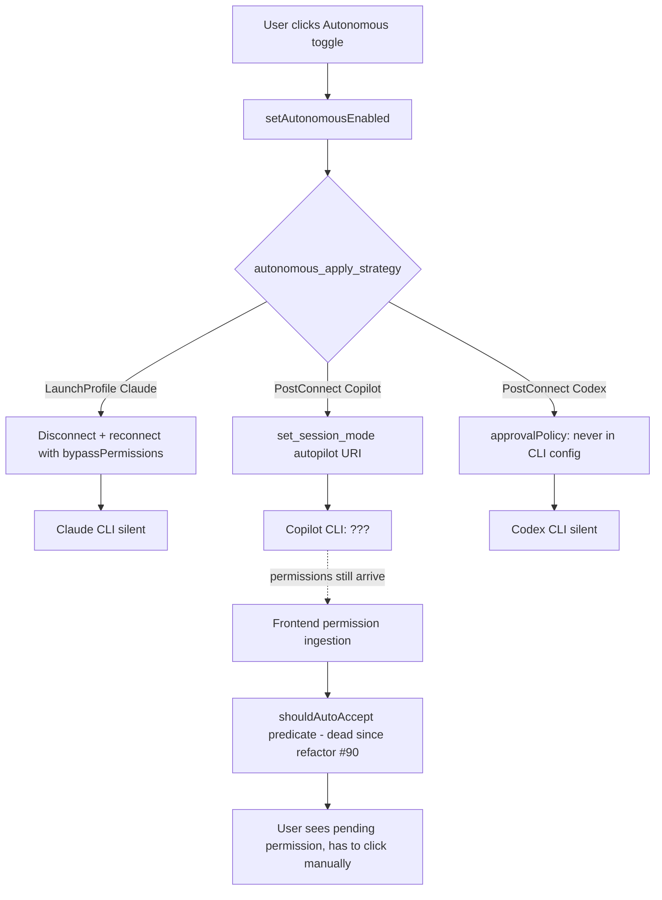
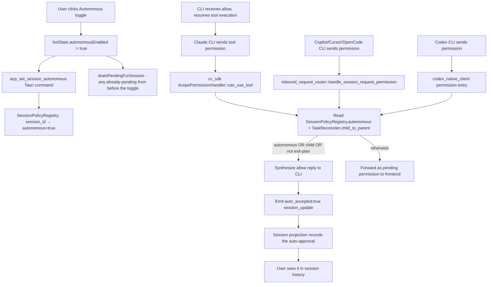
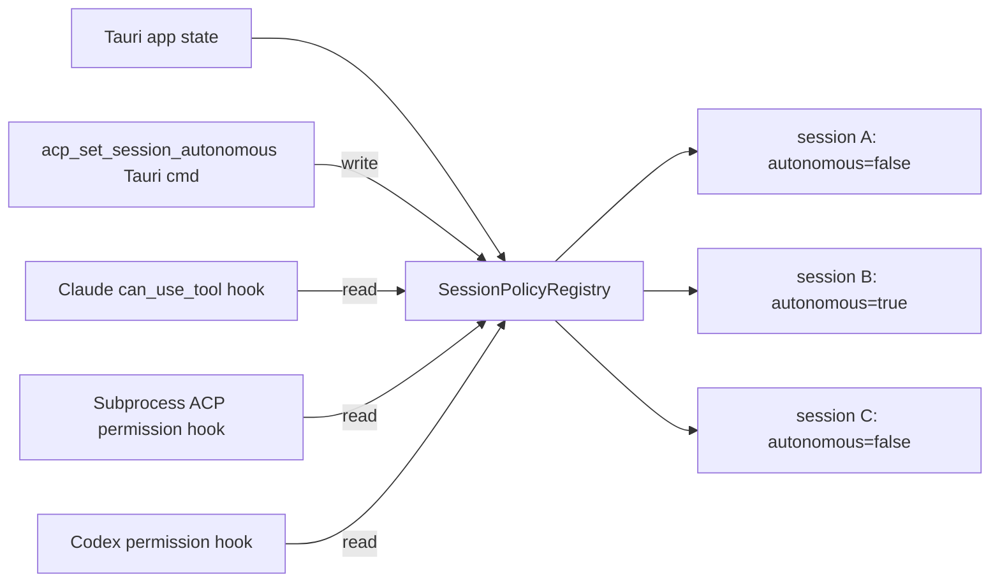

# refactor: Move autonomous mode enforcement to a Rust-side policy hook

## Overview

Today "autonomous mode" is implemented five different ways across five providers, owned by two different layers. Claude Code launches the CLI with `bypassPermissions`. Codex writes `approvalPolicy: "never"` into the CLI config. Copilot sends an autopilot URI via `session/set_mode` and hopes for the best. Cursor and OpenCode don't support autonomous at all. A separate, silently-dead frontend auto-accept predicate was the supposed backstop for the non-launch-flag providers.

This refactor replaces all of that with one mechanism: **Rust-side auto-accept at the point where the CLI's permission request first crosses into Acepe.** When the user toggles autonomous, a shared `SessionPolicy` flips in Rust. The next permission request — regardless of provider — hits a hook at the top of its provider-specific entry point, checks the policy, and short-circuits with a synthesized `allow` reply before any frontend forwarding happens. The CLI is always launched in its default (prompt-asking) mode. Provider-specific "native bypass" paths are deleted.

**Why Rust-side and not frontend-side.** An earlier draft of this plan put the policy hook in the Svelte `PermissionStore`. That would have worked but paid an IPC roundtrip per tool call (CLI → Rust → frontend event → frontend policy check → Tauri command → Rust → CLI reply). The right layer is Rust — the decision belongs next to the transport boundary, not three layers out. The IPC cost question disappears entirely because there is no IPC.

The immediate trigger is that two separate bugs we shipped fixes for on 2026-04-11 were structurally enabled by the old split: Claude's launch-flag seed was clobbered by a resume-safe reset, and Copilot's auto-accept predicate had been dead code for three days after refactor #90. Both *bug shapes* become structurally prevented under the new architecture: (a) there is no `pending_mode_id` / launch-profile path left to clobber, and (b) the policy hook sits at the provider's Rust entry point with no frontend callback to orphan. A sufficiently aggressive future refactor could still break things in new ways — the invariant is *harder to break*, not metaphysically impossible.

## Problem Frame

`autonomous_apply_strategy` is a provider-level enum with two variants (`LaunchProfile`, `PostConnect`) that trigger completely disjoint enforcement paths. The `LaunchProfile` path bakes autonomous into the CLI launch, which means toggling autonomous mid-session requires a full disconnect/reconnect with a new launch profile — and during the debugging session on 2026-04-11 we found Claude's reconnect was silently dropping the seed. The `PostConnect` path relied on `session/set_mode` with a provider-specific URI and a frontend auto-accept fallback, where the fallback had become dead code after refactor #90 (`1ae1ebcc8`) moved permission ingestion to `InteractionStore.applyProjectionInteraction`, bypassing `PermissionStore.add()` where `shouldAutoAccept` lived.

Each bug was individually patchable, but the pattern is structural: intent and mechanism are owned by different modules with no single point of enforcement, and every provider addition has to remember to wire up autonomous correctly across five files. The next refactor of any adjacent area is likely to break autonomous again in a new and creative way.

See origin: `docs/brainstorms/2026-04-11-permission-autonomy-architecture-brainstorm.md` for the full architectural reflection.

## Requirements Trace

- R1. Enabling autonomous on Claude, Codex, Copilot, Cursor, and OpenCode must go through one conceptual policy (Rust `SessionPolicy.autonomous`) with provider-specific hook sites that all consult it. *(origin: Success Criteria 1)*
- R2. Toggling autonomous on or off mid-session must not disconnect the CLI or require a reconnect. *(origin: Success Criteria 2)*
- R3. A permission request arriving from any provider's CLI must go through the Rust policy hook before being forwarded to the frontend. When autonomous is on, the hook short-circuits with a synthesized allow reply and emits an `auto_accepted: true` display event instead of a pending-permission event. *(origin: Success Criteria 3)*
- R4. The Claude launch-flag seed bug shape (`pending_mode_id` clobbered by resume-safe reset) and the Copilot dead-auto-accept bug shape (policy hook orphaned by a refactor) must be structurally prevented by deleting the mechanisms that enable them — not merely patched. *(origin: Success Criteria 3)*
- R5. Adding a new provider must not require touching `autonomous_apply_strategy`, `map_execution_profile_mode_id`, or any reconnect-on-toggle logic. Adding a hook site in the new provider's permission entry point is the only autonomous-related step. *(origin: Success Criteria 4)*
- R6. Cursor and OpenCode gain full autonomous support as a side effect of the unification. This intentionally reverses the original autonomous-session-toggle scoping (R17-R19) that disabled the toggle for unsupported agents. The product decision is that autonomous is an Acepe-level policy applicable to every agent, not a provider capability. *(origin: Key Decisions)*
- R7. Auto-accepted permissions must emit a display event that lands in the session projection so the user can see what was auto-approved in the session history. The payload carries `auto_accepted: true` but does not carry a "reason" (child vs autonomous) — the distinction does not matter at display time. *(origin: user decision during planning)*
- R8. Child tool calls (spawned by a parent Task or sub-agent invocation) must continue to be auto-accepted regardless of the autonomous toggle. The Rust hook consults `TaskReconciler.child_to_parent` (Claude, OpenCode) or the projection registry (Copilot, Cursor, Codex) to detect this. *(origin: preserves existing child-session semantics)*
- R9. Exit-plan permissions must continue to be exempt from auto-accept — even when autonomous is on. The hook gates on `isExitPlanPermission`-equivalent logic in Rust. *(origin: Scope — unchanged invariants)*
- R10. `setAutonomousEnabled` on the frontend simplifies to: update `hotState.autonomousEnabled` optimistically, call a new `acp_set_session_autonomous(session_id, enabled)` Tauri command to sync Rust state, call `drainPendingForSession` if enabling. No reconnect, no `applyExecutionProfile`, no `setExecutionProfile` API. *(origin: R2 + Key Decisions)*
- R11. One Rust integration test per provider hook site must verify "autonomous policy on + incoming permission request = synthesized allow + `auto_accepted: true` display event + no pending-permission display event." *(origin: Success Criteria 5)*
- R12. All existing `packages/desktop/src/lib/acp/store/` tests (527+) must continue to pass. Rust test suite (`cargo test -p acepe --lib`) must pass. *(origin: Success Criteria 6)*
- R13. `cargo clippy -p acepe --lib` must stay clean. *(origin: Success Criteria 7)*

## Scope Boundaries

- No changes to the autonomous toggle UX — button, tooltip, disabled-state logic, per-session lifetime, red/muted visual treatment. All preserved.
- No changes to `session/set_mode` for non-autonomous mode switching (plan ↔ build stays as-is).
- **No opt-in "skip permission roundtrip at the CLI level" power-user setting.** This was explicitly considered during planning and rejected: the refactor intentionally accepts the "one-way door" of removing CLI-level bypass, because introducing day-one always-on CLI-bypass would be a slippery slope toward re-creating the per-provider plumbing we're trying to delete. Autonomous is Acepe-side policy, and every agent goes through the same roundtrip. Per-tool-call IPC cost over local Tauri is one roundtrip per tool call (not per byte), which is negligible relative to LLM latency.
- No changes to permission categories, reply handlers, or exit-plan handling.
- No changes to `drainPendingForSession` behavior (already drains pending on toggle-on).
- No new audit logging beyond what falls out of the `auto_accepted: true` display event naturally landing in the session projection.
- No `PermissionStore` / `InteractionStore` facade collapse in this plan. It was a load-bearing part of an earlier draft when the hook was frontend-side; with the hook moved to Rust, the collapse is demoted to "optional cleanup" and tracked as a follow-up, not a blocker.

## Context & Research

### Rust permission entry points (hook sites)

**Claude Code — cc-sdk `can_use_tool` callback:**
- `packages/desktop/src-tauri/src/acp/client/cc_sdk_client.rs:398-672` — `AcepePermissionHandler::can_use_tool`. The hook goes at the top of this function, after the `AskUserQuestion` branch (which stays as-is) and after `tool_call_id` resolution, before `bridge.register_tool(...)` and the UI emission.
- `cc_sdk_client.rs:874-879` — `task_reconciler: Arc<std::sync::Mutex<TaskReconciler>>` is already held by `ClaudeCcSdkClient` and is accessible from the handler struct (reachable through `bridge` or added as a direct field).

**Copilot / Cursor / OpenCode — subprocess ACP inbound router:**
- `packages/desktop/src-tauri/src/acp/inbound_request_router/permission_handlers.rs:19-177` — `handle_session_request_permission`. The hook goes at the top of this function, after `parse_params` and the early-return on bad input, before `forward_legacy_event: true` is returned to the caller.
- The handler currently sets `parent_tool_use_id: None` on the forwarded tool call (`permission_handlers.rs:105`). Parent info for these providers can be looked up in the projection registry at hook time.

**Codex — codex_native_client:**
- `packages/desktop/src-tauri/src/acp/client/codex_native_client.rs` — Codex has its own permission entry point; exact location to confirm in implementation. Same hook pattern.

### Session policy state

Rust does not currently track "this session is in autonomous mode." It will be added:
- **New file or new module:** `packages/desktop/src-tauri/src/acp/session_policy.rs` (tentative). Holds a `SessionPolicyRegistry` keyed by session id, each entry containing at minimum `autonomous: AtomicBool`.
- **Registration:** the registry is a Tauri managed state (`app.state::<Arc<SessionPolicyRegistry>>()`). Created at startup alongside `SessionRegistry` and `ProjectionRegistry`.
- **Write path:** new Tauri command `acp_set_session_autonomous(session_id, enabled)` updates the flag. No CLI communication, no reconnect, no downstream effects beyond the atomic store.
- **Read path:** each provider-specific permission hook reads the atomic from its session id.
- **Cleanup:** entry removed when session is destroyed (mirror existing `SessionRegistry` lifecycle).

### Child / parent tool call detection

**Claude Code and OpenCode:** `packages/desktop/src-tauri/src/acp/task_reconciler.rs:52-72` — `TaskReconciler.child_to_parent: HashMap<String, String>`. Populated by the existing reconciler as stream events arrive. At the permission hook point in `cc_sdk_client::can_use_tool`, the tool_call_id resolved from `ToolCallIdTracker.take_for_input` can be looked up in the reconciler's `child_to_parent` map. If present → child tool call → auto-accept regardless of session autonomous state.

**Copilot / Cursor / Codex:** `packages/desktop/src-tauri/src/acp/projections/mod.rs:46` — `parent_tool_call_id: Option<String>` on projection entries. Populated per-provider during session update processing. At the subprocess ACP hook in `handle_session_request_permission`, the tool_call_id from the JSON-RPC `toolCall.toolCallId` field can be looked up in the projection registry. If the corresponding entry has `parent_tool_call_id: Some(...)` → child tool call → auto-accept.

**Note on session-level `parentId`:** the `SessionCold.parent_id` field in `session_jsonl/types.rs:34` exists but is commented "OpenCode only" and is set to `None` by all production producers we checked. The frontend's `sessionMetadata.parentId` check in `main-app-view.svelte:490-502` is essentially dead in production. This plan replaces it with the per-tool-call parent detection described above, which is more accurate and works for every provider.

### Relevant code (frontend-side plumbing that simplifies or deletes)

**Frontend autonomous path (simplifies dramatically):**
- `packages/desktop/src/lib/acp/store/services/session-connection-manager.ts:145-167` — `applyExecutionProfile` and `shouldReconnectForAutonomous`. Both deleted.
- `packages/desktop/src/lib/acp/store/services/session-connection-manager.ts:1180-1290` — `setAutonomousEnabled`. Simplifies to: optimistic hotState flip, call new `acp_set_session_autonomous` Tauri command, drain pending on enable. No reconnect, no execution-profile backend call.
- `packages/desktop/src/lib/acp/store/services/session-connection-manager.ts:456-534` — the `initialAutonomousEnabled` handling in `newSession`. Simplifies to a direct hotState set + Tauri command call.
- `packages/desktop/src/lib/acp/store/services/session-connection-manager.ts:676-695` — `launchExecutionProfile` resolution in the reconnect path. Deleted.
- `packages/desktop/src/lib/acp/store/services/session-connection-manager.ts:824-886` — post-reconnect `applyExecutionProfile` fallback. Deleted.
- `packages/desktop/src/lib/acp/store/api.ts:85-90, 313-320` — `setExecutionProfile` API. Deleted.
- `packages/desktop/src/lib/utils/tauri-client/acp.ts:11-14, 60-70` — `ExecutionProfileRequest` type and `setExecutionProfile` wrapper. Deleted. Replaced with a new `setSessionAutonomous` wrapper calling the new Tauri command.
- `packages/desktop/src/lib/services/acp-types.ts:206-281` — `AutonomousApplyStrategy` TS type and `autonomousApplyStrategy` field. Deleted.
- `packages/desktop/src/lib/services/acp-provider-metadata.ts:14-101` — per-provider `autonomousApplyStrategy` field. Deleted.
- `packages/desktop/src/lib/services/command-names.ts:6, 46` — `set_execution_profile` command name. Deleted. `set_session_autonomous` added.

**Frontend permission auto-accept machinery (deleted — Rust owns it now):**
- `packages/desktop/src/lib/acp/store/permission-store.svelte.ts:56-224` — `shouldAutoAccept` field, `setAutoAccept` method, `tryAutoAccept` helper, `maybeAutoAcceptPending` method, and the auto-accept branch inside `add()`. All deleted.
- `packages/desktop/src/lib/components/main-app-view.svelte:341-379, 906-922` — the `maybeAutoAcceptPending` call sites we added on 2026-04-11 and the `setAutoAccept` configuration at lines 490-502. All deleted.
- The associated tests in `packages/desktop/src/lib/acp/store/__tests__/permission-store.vitest.ts` that cover `setAutoAccept`/`tryAutoAccept`/`maybeAutoAcceptPending`. Deleted.

**Backend autonomous plumbing (deleted):**
- `packages/desktop/src-tauri/src/acp/provider.rs:159-167` — `AutonomousApplyStrategy` enum.
- `packages/desktop/src-tauri/src/acp/provider.rs:182` — `autonomous_apply_strategy` field on `FrontendProviderProjection`.
- `packages/desktop/src-tauri/src/acp/provider.rs:326` — `map_execution_profile_mode_id` trait method default.
- `packages/desktop/src-tauri/src/acp/provider.rs:88-98` — `SessionLifecyclePolicy.requires_post_connect_execution_profile_reset` field.
- `packages/desktop/src-tauri/src/acp/parsers/provider_capabilities.rs:106-111, 146, 174, 202, 230, 258` — per-provider `autonomous_apply_strategy` and `requires_post_connect_execution_profile_reset` values.
- `packages/desktop/src-tauri/src/acp/providers/claude_code.rs:120-137` — `map_execution_profile_mode_id` override (the `&["build"]` in `autonomous_supported_mode_ids` stays).
- `packages/desktop/src-tauri/src/acp/providers/copilot.rs:31-36, 187-201` — `COPILOT_MODE_AUTOPILOT_URI` / `LEGACY_COPILOT_MODE_AUTOPILOT_URI` constants and `map_execution_profile_mode_id` override.
- `packages/desktop/src-tauri/src/acp/providers/codex.rs:92-109` — `autonomous_supported_mode_ids` (falls back to default) and `map_execution_profile_mode_id` override.
- `packages/desktop/src-tauri/src/acp/client/codex_native_config.rs:17, 62-66, 74-79, 276-283, 301-313, 717-738` — `CODEX_BUILD_FULL_ACCESS_MODE_ID` constant, `CodexExecutionProfile::FullAccess` variant, `CodexSandboxPolicy::DangerFullAccess` variant, and the autonomous-build resolution path.
- `packages/desktop/src-tauri/src/acp/client/cc_sdk_client.rs:949-951, 2258-2314, 2359-2382` — `reset_pending_mode_for_safe_resume`, the conditional reset inside `resume_session`, and the deferred-options rebuild inside `set_session_mode`. All three of the 2026-04-11 bug fixes revert to their pre-bug state.
- `packages/desktop/src-tauri/src/acp/commands/client_ops.rs:119-140, 142-236` — `seed_client_launch_mode` helper, `force_new_client` parameter, `launch_mode_id` parameter.
- `packages/desktop/src-tauri/src/acp/commands/session_commands.rs:13-143, 457-522` — `resolve_launch_execution_profile_mode_id`, `reset_resumed_session_execution_profile`, `resume_path_needs_post_connect_execution_profile_reset`, and the execution-profile branches of `acp_resume_session`.
- `packages/desktop/src-tauri/src/acp/commands/interaction_commands.rs:71-143` — `acp_set_execution_profile` Tauri command.
- `packages/desktop/src-tauri/src/lib.rs:43, 1032` — command registration for `acp_set_execution_profile`.

### Institutional Learnings

- `docs/solutions/best-practices/provider-owned-policy-and-identity-not-ui-projections-2026-04-09.md` — "Shared runtime/UI code should consume explicit provider-owned contracts instead of inferring provider behavior from presentation data or local heuristics." Relevant in the inverse direction: `autonomous_apply_strategy` is a provider-owned contract that enables the wrong thing. The new model inverts this: **autonomous is not a provider contract**. Every provider contributes one hook site; the policy itself is Acepe-owned.
- `docs/solutions/integration-issues/copilot-permission-prompts-stream-closed-2026-04-09.md` — "Parse loosely at provider boundaries and normalize strictly into Acepe-owned contracts." Relevant because the Rust hook sits exactly at the provider boundary where parsing happens, so normalization and policy enforcement live at the same layer.

### External References

None. This is pure internal refactor with all patterns established in-repo.

## Key Technical Decisions

| Decision | Rationale |
|---|---|
| Autonomous becomes a Rust-side policy enforced at each provider's permission entry point. The frontend only owns the UI toggle and the Tauri command that syncs state. | Single enforcement mechanism, closest to the CLI boundary. No IPC roundtrip for auto-accepted permissions. Structurally prevents both 2026-04-11 bug shapes. |
| Provider-specific CLI launch flags (Claude `bypassPermissions`, Codex `approvalPolicy: "never"`, Copilot autopilot URI) are deleted outright, not kept as vestigial. | Preserving vestigial types is exactly the drift the refactor is trying to fight. The one-way-door nature of this deletion is explicitly accepted (see below). |
| The "opt-in CLI-level bypass for throughput" power-user setting is **out of scope** and **explicitly not a day-one feature**. This is a one-way door. | Introducing always-on CLI-bypass from day one would re-create most of the per-provider plumbing this refactor is deleting ("steep slide back toward the old architecture"). Every agent goes through the Rust hook. IPC cost is one roundtrip per tool call, dwarfed by LLM latency. If a future user observes measurable cost, re-introducing an opt-in bypass is a non-trivial but bounded follow-up. |
| Session policy lives in a new `SessionPolicyRegistry` managed state, not grafted onto `SessionRegistry`. | `SessionRegistry` owns client lifecycle and transport; session policy is pure data with no lifecycle coupling. Separating them keeps each small and avoids lock contention between "create a session" and "read autonomous state on every tool call." |
| The Rust hook emits a display event (session_update) with an `auto_accepted: true` flag for every auto-approved permission, so the user can see what happened in the session history. No separate "reason" field — the distinction between "autonomous-live" and "child tool call" does not matter at display time. | Answers the audit-log concern for free by routing through the existing projection-registry pipeline. Keeps the payload minimal. |
| Child tool call detection: use `TaskReconciler.child_to_parent` for cc-sdk and OpenCode (reconciler already populated, O(1) lookup). Use `ProjectionRegistry` tool-call lookup for subprocess ACP and Codex. | Both are already Rust-side and already populated per provider. No new tracking infrastructure needed. |
| Exit-plan exemption stays. The Rust hook explicitly does not auto-accept plan-approval permissions, mirroring the existing `isExitPlanPermission` frontend check. | Preserves the invariant. Plan approvals are a different semantic category that users must approve manually even in autonomous mode. |
| Cursor and OpenCode gain full autonomous support as a side effect. This reverses the original autonomous-session-toggle R17-R19 scoping. | Explicit product decision during planning: "we don't want to rely on the agent for implementing or not implementing autonomous modes; we want to do it in Acepe." The toggle becomes available for every supported agent. |
| Frontend `PermissionStore` / `InteractionStore` facade collapse is **out of scope** for this plan. | With the policy hook moved to Rust, the facade split is no longer a correctness risk — just a tidiness issue. Noted as follow-up, not blocker. |
| Phased delivery: Phase 1 adds the Rust hook and new policy state while the old plumbing still exists. Phase 2 deletes the old plumbing. Phase 3 extends support and adds integration tests. | Phase 1 is additive and safe (the new hook only fires when autonomous is on, and initially the old Claude/Codex launch-flag paths still trigger first). Phase 2 removes the now-redundant old plumbing. Phase 3 flips Cursor/OpenCode and adds coverage. |
| `setAutonomousEnabled` drops its reconnect path; the new Tauri command `acp_set_session_autonomous` is a tiny state update with no CLI communication. | Toggling autonomous mid-session becomes instantaneous. No more race windows, no more disconnect/reconnect, no more launch-profile seed logic. |

## Open Questions

### Resolved During Planning

- **Where does the policy hook sit?** — Rust, at each provider's permission entry point (`cc_sdk_client::AcepePermissionHandler::can_use_tool` for Claude, `inbound_request_router::permission_handlers::handle_session_request_permission` for Copilot/Cursor/OpenCode, Codex-native equivalent for Codex).
- **Is the IPC roundtrip cost a concern?** — No. The hook short-circuits Rust-side, so there is no IPC for auto-accepted permissions. Manual permissions still pay the roundtrip, but that's the same cost as today.
- **Is this a one-way door?** — Yes, and it is explicitly accepted. Re-adding CLI-level bypass would require re-creating most of the deleted plumbing. The product decision is that this tradeoff is acceptable because autonomous is Acepe-side policy.
- **Do Cursor and OpenCode need special handling?** — No. They use the same subprocess ACP inbound router as Copilot. Flipping `autonomous_supported_mode_ids` to include them is a one-line change; they get autonomous support "for free" via the same hook site.
- **How is child tool call auto-accept preserved?** — The hook consults `TaskReconciler.child_to_parent` for Claude/OpenCode and the projection registry for the others. Both are already Rust-side and already populated per provider.
- **What does the display event for auto-accepted permissions carry?** — `auto_accepted: true` on the permission session update. No "reason" distinction. The user decided this explicitly during planning.
- **Is `CodexExecutionProfile::FullAccess` safe to delete?** — Yes, verified. Single non-test producer (`resolve_codex_execution_profile_mode_id` triggered by `CODEX_BUILD_FULL_ACCESS_MODE_ID`). `CodexSandboxPolicy::DangerFullAccess` has a single producer (the `FullAccess` match arm). Clean cut. `CodexExecutionProfile` collapses to a single `Standard` variant and can be removed entirely.
- **Do `seed_client_launch_mode`, `force_new_client`, and `launch_mode_id` have any non-autonomous callers?** — Verified none. All three exist solely to carry autonomous launch profiles.
- **Does `commands/tests.rs` have autonomous coverage that must be preserved?** — No. The `forced replacement resume` test (around lines 690-712) and its `MockClientState::launch_mode_ids` tracker are deleted as part of Unit 2.1.
- **Store collapse — which direction?** — Deferred. Not part of this plan. Moved to follow-up.

### Deferred to Implementation

- Exact placement of `SessionPolicyRegistry` (new module vs added to an existing session-management module). Implementation-time decision.
- Exact method name for the hook check — `session_policy.is_autonomous(session_id)`, `session_policy.should_auto_accept(session_id, tool_call_id)`, or similar. Implementation-time naming.
- Whether the hook's child-tool-call check is a shared helper function or inlined at each hook site. If the three hook sites share the same lookup logic, extract it; otherwise inline.
- Exact shape of the `auto_accepted` display event — whether it's a new `SessionUpdate` variant, a flag on the existing `PermissionRequest` variant, or a brand-new kind like `AutoAcceptedPermission`. Implementation-time decision based on what produces the simplest frontend rendering update.
- Whether `drainPendingForSession` still needs to run after the Rust hook is in place. If any permission is already in the frontend's pending map at the moment the user toggles autonomous on, the Rust hook can't retroactively auto-accept it — so the frontend drain path still makes sense. But if the new Tauri command runs fast enough that no new permission can arrive in the gap, drain might become a no-op. Implementation-time observation.
- Codex-native exact hook site and the right moment to consult the policy. Needs a read of `codex_native_client.rs` permission flow during implementation.
- Whether the `auto_accepted: true` flag persists through DB storage of the projection, or is a transient event that disappears on restart. For audit purposes it should persist. Implementation-time decision tied to the display-event shape.

## High-Level Technical Design

> *This illustrates the intended approach and is directional guidance for review, not implementation specification. The implementing agent should treat it as context, not code to reproduce.*

**Before** — autonomous enforcement fans out across five providers and three layers, with frontend auto-accept as a silently-broken fallback:

**After** — Rust-side policy at each provider's permission entry point, one shared session policy:

**Session policy state layout** — a thin, atomic, lock-free registry keyed by session id:

**Key invariant:** every permission request from every provider passes through a Rust hook before any frontend forwarding. The hook reads the shared `SessionPolicyRegistry` and a provider-specific parent lookup. There is no production code path that forwards a permission to the frontend without going through the hook.

## Implementation Units

### Phase 1 — Add Rust session policy + hook sites (additive, no deletions)

This phase adds the new enforcement path alongside the existing per-provider plumbing. Old paths continue to work unchanged. The new hook only fires when `SessionPolicyRegistry.autonomous(session_id)` returns true, which only happens after a frontend toggle with the new Tauri command. Because the old plumbing still handles Claude (launch flag) and Codex (native config) on their own, Phase 1 ships the new mechanism for Copilot/Cursor/OpenCode immediately and layers it defensively under Claude/Codex. Phase 2 then deletes the old paths.

- [ ] **Unit 1.1: Add `SessionPolicyRegistry` state + `acp_set_session_autonomous` Tauri command + frontend wiring**

**Goal:** Introduce a Rust-side shared state for session autonomous mode, a Tauri command to update it, and frontend wiring that calls the command when the user toggles autonomous. Frontend `setAutonomousEnabled` gains the command call but keeps its existing reconnect path (which Phase 2 will remove).

**Requirements:** R10 (partial — the command and state; the reconnect deletion happens in Phase 2)

**Dependencies:** None — foundational.

**Files:**
- Create: `packages/desktop/src-tauri/src/acp/session_policy.rs` (new module containing `SessionPolicyRegistry` struct, atomic read/write methods, and lifecycle hooks for session creation/destruction)
- Modify: `packages/desktop/src-tauri/src/lib.rs` (register the new state with `app.manage(Arc::new(SessionPolicyRegistry::new()))`; add `acp_set_session_autonomous` to the Tauri command list)
- Create or Modify: `packages/desktop/src-tauri/src/acp/commands/session_commands.rs` (new Tauri command `acp_set_session_autonomous(app, session_id, enabled)` that updates the registry; lifecycle cleanup when session is destroyed mirrors `SessionRegistry` cleanup)
- Modify: `packages/desktop/src-tauri/src/bindings/command-values.ts` (regenerated specta binding, includes the new command)
- Modify: `packages/desktop/src/lib/utils/tauri-client/acp.ts` (add `setSessionAutonomous(sessionId, enabled)` wrapper)
- Modify: `packages/desktop/src/lib/services/command-names.ts` (add `set_session_autonomous` to the command name registry)
- Modify: `packages/desktop/src/lib/acp/store/api.ts` (add `setSessionAutonomous` export that calls the wrapper)
- Modify: `packages/desktop/src/lib/acp/store/services/session-connection-manager.ts` (inside `setAutonomousEnabled`, add a call to `api.setSessionAutonomous(sessionId, enabled)` before the existing reconnect/applyExecutionProfile logic; this path coexists with the old logic for now)
- Test: `packages/desktop/src-tauri/src/acp/session_policy.rs` (unit tests for the registry — insert, update, read, remove, concurrent access)
- Test: `packages/desktop/src-tauri/src/acp/commands/session_commands.rs` or the existing commands test file (test for `acp_set_session_autonomous` happy path and session-not-found path)
- Test: `packages/desktop/src/lib/acp/store/services/session-connection-manager.test.ts` (update existing autonomous tests to assert the new Tauri command is called; keep the existing reconnect assertions for now since Phase 2 removes them)

**Approach:**
- `SessionPolicyRegistry` is a thin wrapper around `DashMap<String, Arc<SessionPolicy>>` or `RwLock<HashMap<String, SessionPolicy>>` with atomic-bool fields inside each policy. Choice of primitive is implementation-time; the requirement is cheap O(1) read from the permission hook and no contention between reads and writes.
- `SessionPolicy { autonomous: AtomicBool }` is the initial shape. If future policy fields are added (e.g., per-permission-category rules), they join this struct.
- `acp_set_session_autonomous` is idempotent — calling it multiple times with the same value is a no-op. No error if the session doesn't exist yet (the policy is created lazily on first read or first write).
- Lifecycle: when `SessionRegistry::destroy_session` runs (or equivalent), also remove the entry from `SessionPolicyRegistry`. Do not leak policy entries for destroyed sessions.
- Frontend `setSessionAutonomous` is a thin `ResultAsync<void, AppError>` wrapper using the existing `invokeAsync` pattern.
- Inside `setAutonomousEnabled`, add the new Tauri command call as the first backend step (before any reconnect logic). If the command fails, roll back `hotState.autonomousEnabled` just like today's backend-failure rollback.

**Patterns to follow:**
- `SessionRegistry` at `packages/desktop/src-tauri/src/acp/session_registry.rs` for the Tauri managed state pattern.
- `acp_set_mode` Tauri command in `interaction_commands.rs` for the command signature shape.
- `api.setMode` / `tauriClient.acp.setMode` frontend pattern for the wrapper.
- `ResultAsync.fromPromise` pattern used throughout the ACP store.

**Test scenarios:**
- **Happy path:** `registry.set_autonomous("session-1", true)` → `registry.is_autonomous("session-1")` returns `true`.
- **Happy path:** `acp_set_session_autonomous` Tauri command updates the registry and returns `Ok(())`.
- **Happy path:** Frontend `setAutonomousEnabled(sessionId, true)` calls `api.setSessionAutonomous(sessionId, true)` exactly once and flips `hotState.autonomousEnabled`.
- **Edge case:** Calling `registry.is_autonomous("session-does-not-exist")` returns `false` (default). No error.
- **Edge case:** Calling `set_autonomous` before the session is registered — policy is created lazily.
- **Edge case:** Concurrent reads from multiple threads while writes happen — atomics/RwLock guarantee safety.
- **Lifecycle:** Destroying a session removes its entry from the registry.
- **Regression:** All existing `session-connection-manager.test.ts` autonomous tests still pass (the new Tauri call is additive).

**Verification:**
- `cargo test -p acepe --lib 'session_policy'` passes.
- `cargo clippy -p acepe --lib` clean.
- `bun run check` clean.
- `bun test ./src/lib/acp/store/services/__tests__/session-connection-manager.test.ts` passes.

---

- [ ] **Unit 1.2: Add Rust hook at Claude's `can_use_tool` entry point**

**Goal:** Check `SessionPolicyRegistry.autonomous(session_id)` and `TaskReconciler.child_to_parent` at the top of `cc_sdk_client::AcepePermissionHandler::can_use_tool`. If autonomous is on or the tool call is a child of a parent Task, and the permission is not an exit-plan approval, synthesize `PermissionResult::Allow(...)` immediately and emit an `auto_accepted: true` display event instead of a pending-permission event. Skip the register-and-wait dance.

**Requirements:** R1, R3, R7, R8, R9

**Dependencies:** Unit 1.1 (needs `SessionPolicyRegistry`).

**Files:**
- Modify: `packages/desktop/src-tauri/src/acp/client/cc_sdk_client.rs` (inject `SessionPolicyRegistry` reference into `ClaudeCcSdkClient` and propagate it into `AcepePermissionHandler`; add the policy check + child-tool-call lookup at the top of `can_use_tool`)
- Modify: `packages/desktop/src-tauri/src/acp/session_update/types/tool_calls.rs` or equivalent (add `auto_accepted: bool` flag to the permission session update variant — implementation-time decision whether this is a new flag on the existing variant or a new variant)
- Test: `packages/desktop/src-tauri/src/acp/client/cc_sdk_client.rs` (existing test module — add tests for the autonomous short-circuit and the child-tool-call short-circuit)

**Approach:**
- `AcepePermissionHandler` gains a `session_policy: Arc<SessionPolicyRegistry>` field, populated at handler construction time from the enclosing client.
- At the top of `can_use_tool`, after `tool_call_id` is resolved via `tool_call_tracker.take_for_input`:
  1. Branch out `AskUserQuestion` and exit-plan cases as-is. They do not auto-accept.
  2. Check `self.session_policy.is_autonomous(&self.session_id)`.
  3. Check `self.task_reconciler.lock().child_to_parent.contains_key(&tool_call_id)`.
  4. If either is true (and the permission is not exit-plan): emit a session update marked `auto_accepted: true`, return `PermissionResult::Allow(AllowedBehavior::Once)` (or equivalent). No `bridge.register_tool`, no `rx.await`.
- The display event still goes through `self.dispatcher.enqueue(...)` so the frontend sees it via the existing session-update pipeline.
- Exit-plan detection in Rust: check `tool_name` against the known plan tool names (implementation-time — grep for how the frontend's `isExitPlanPermission` determines this; there's likely a Rust equivalent already in the parser layer).

**Execution note:** Start with a failing test that sets `session_policy.set_autonomous("session-1", true)` and calls `handler.can_use_tool(...)` with a regular tool name. The test asserts the result is `Allow` and that the bridge did not register a tool. Then shape the implementation to make the test pass. This is the single most important test for the refactor.

**Patterns to follow:**
- Existing `AcepePermissionHandler` structure for handler field injection and dispatcher usage.
- `tool_call_tracker.take_for_input` pattern for tool_call_id resolution.
- `dispatcher.enqueue(AcpUiEvent::session_update(...))` for display events.
- `PermissionResult::Allow` and `PermissionResult::Deny` construction from `cc_sdk` types.

**Test scenarios:**
- **Happy path — autonomous:** `session_policy.set_autonomous("session-1", true)`. Handler receives `can_use_tool("Bash", {command: "ls"}, ...)`. Returns `Allow`. No pending-permission session update emitted. An `auto_accepted: true` display event is emitted on the dispatcher.
- **Happy path — child tool call:** `session_policy.set_autonomous("session-1", false)` but `task_reconciler.child_to_parent.insert("toolu_child", "toolu_parent")`. Handler receives `can_use_tool` for `"toolu_child"`. Returns `Allow`. `auto_accepted: true` display event emitted.
- **Happy path — neither condition:** `session_policy` is false, tool_call_id is not in reconciler. Handler falls through to the existing register-and-wait path. Pending-permission session update emitted as today.
- **Edge case — exit plan under autonomous:** `session_policy` is true, but the tool is `ExitPlanMode`. Handler does NOT auto-accept; falls through to existing path. Pending-permission emitted.
- **Edge case — `AskUserQuestion` under autonomous:** `session_policy` is true, tool is `AskUserQuestion`. Handler does NOT auto-accept; existing AskUserQuestion branch handles it. Question session update emitted.
- **Edge case — tool_call_id not tracked:** `tool_call_tracker.take_for_input` returns `None` (miss). Handler falls through to existing synthetic-ID path. Autonomous check still fires using session_id alone.
- **Integration:** Combine the session update stream to verify that the `auto_accepted: true` event arrives on the dispatcher and no pending-permission event does.

**Verification:**
- `cargo test -p acepe --lib 'cc_sdk_client::tests::can_use_tool'` passes.
- Manual: Toggle autonomous on a dev Claude session, send a prompt that triggers a Bash call. Observe the session history shows an auto-approved permission card, not a pending one. No click required. (The old launch-profile path still exists in Phase 1, so this test validates the new hook fires correctly and the launch-profile path no longer matters — but be aware that today's Claude still launches with `bypassPermissions` and won't send a permission at all. To validate Phase 1's Claude hook, temporarily disable the launch-profile path or test against a Phase 2 build.)
- `cargo clippy -p acepe --lib` clean.

---

- [ ] **Unit 1.3: Add Rust hook at subprocess ACP inbound router (Copilot / Cursor / OpenCode)**

**Goal:** Check `SessionPolicyRegistry.autonomous(session_id)` and projection-registry child-tool-call lookup at the top of `inbound_request_router::permission_handlers::handle_session_request_permission`. If autonomous or child (and not exit-plan), synthesize a JSON-RPC `allow` response, skip the frontend forwarding, and emit an `auto_accepted: true` display event. If not, forward to the frontend as today.

**Requirements:** R1, R3, R6, R7, R8, R9

**Dependencies:** Unit 1.1 (needs `SessionPolicyRegistry`).

**Files:**
- Modify: `packages/desktop/src-tauri/src/acp/inbound_request_router/permission_handlers.rs` (inject `SessionPolicyRegistry` and `ProjectionRegistry` access into the handler; add the policy check + projection child lookup; short-circuit the JSON-RPC response path)
- Modify: `packages/desktop/src-tauri/src/acp/inbound_request_router/mod.rs` (thread the new state through the router's dispatch function)
- Test: `packages/desktop/src-tauri/src/acp/inbound_request_router/permission_handlers.rs` tests (add autonomous and child-tool-call scenarios)

**Approach:**
- `handle_session_request_permission` currently returns an `InboundRoutingDecision` enum (`ForwardToUi`, etc.). Add a new `SynthesizeAutoAcceptReply { auto_accepted_update: SessionUpdate }` variant (or reuse `ForwardToUi` with flag — decide at implementation time based on what produces the cleaner downstream change).
- The JSON-RPC reply-synthesis path lives in `permission_handlers` or the router's `respond_inbound_request` layer. When the hook short-circuits, the router must emit both the synthesized reply (back to the CLI) and the `auto_accepted: true` display event (to the frontend).
- Child tool call detection: given the incoming `toolCall.toolCallId` from the JSON-RPC payload, query the projection registry for that session's current projection, find the matching tool call entry, check its `parent_tool_call_id`. If present → child → auto-accept.
- Exit-plan detection: check the permission's tool name and normalized arguments against the exit-plan signal (implementation-time — reuse whatever Rust code the parsers use to classify plan approvals).

**Patterns to follow:**
- Existing `InboundRoutingDecision` pattern and the `ForwardToUi` path.
- `respond_inbound_request_with_registry` in `session_commands.rs` or similar for the JSON-RPC reply synthesis pattern.
- `projection_registry.session_projection(&session_id)` to fetch the current projection snapshot.

**Test scenarios:**
- **Happy path — autonomous (Copilot-shaped):** Session policy set to autonomous. Inbound `session/request_permission` arrives with a Copilot-shaped payload. Handler returns a short-circuit decision carrying a synthesized `allow` reply. No `ForwardToUi` decision is produced. An `auto_accepted: true` display event is emitted.
- **Happy path — autonomous (Cursor-shaped):** Same as above with Cursor payload shape.
- **Happy path — autonomous (OpenCode-shaped):** Same with OpenCode payload shape.
- **Happy path — child tool call:** Session policy is false. Incoming permission references a `tool_call_id` whose projection entry has `parent_tool_call_id: Some(...)`. Handler returns the short-circuit decision.
- **Happy path — neither condition:** Session policy is false, tool_call_id is not a child. Handler returns `ForwardToUi` as today.
- **Edge case — projection miss:** `tool_call_id` is not in the projection (race between permission arrival and projection update). Falls through to the session-level autonomous check. If autonomous, short-circuit anyway. If not, `ForwardToUi`.
- **Edge case — exit-plan permission under autonomous:** The permission is a plan approval. Handler does NOT short-circuit; `ForwardToUi` is returned with the plan-approval routing.
- **Error path — policy registry read fails (shouldn't happen under atomic reads, but defensive):** Falls through to `ForwardToUi`. Auto-accept never fires on error.

**Verification:**
- `cargo test -p acepe --lib 'inbound_request_router::permission_handlers'` passes.
- Manual: Toggle autonomous on a dev Copilot session, send a prompt that triggers a permission request. Observe auto-approval in session history without a manual click.
- `cargo clippy -p acepe --lib` clean.

---

- [ ] **Unit 1.4: Add Rust hook at Codex native client permission entry**

**Goal:** Same pattern as Unit 1.2 and 1.3, applied to Codex's native permission path. Consult `SessionPolicyRegistry.autonomous` and the appropriate parent lookup at the Codex entry point.

**Requirements:** R1, R3, R7, R8, R9

**Dependencies:** Unit 1.1.

**Files:**
- Modify: `packages/desktop/src-tauri/src/acp/client/codex_native_client.rs` (find the permission entry point; add the policy check and short-circuit)
- Modify: related event/dispatch code if Codex has its own display-event pipeline
- Test: `packages/desktop/src-tauri/src/acp/client/codex_native_client.rs` tests (add autonomous scenario)

**Approach:**
- First, read `codex_native_client.rs` end-to-end to find where Codex's CLI-originated permission requests enter Rust. The exact hook site is an implementation-time discovery — it may be a trait method, a message handler, or an event loop branch.
- Apply the same pattern: read session policy, check child tool call via projection or Codex-specific state, emit display event, synthesize reply.
- If Codex doesn't currently expose a permission-request event at all (because it always runs in `approvalPolicy: "never"` today), the hook site is wherever the policy is consumed — and the refactor's behavior change happens when Phase 2 flips Codex to default mode.

**Execution note:** Start with a code-read pass to find the Codex permission entry point before writing tests. If no clear entry point exists, this unit may merge into Unit 2.1 (delete `CodexExecutionProfile::FullAccess` path) because the permission flow only becomes observable after the old approval-policy override is removed.

**Patterns to follow:**
- Unit 1.2 and Unit 1.3 approach — session_policy read, parent lookup, short-circuit reply, display event.

**Test scenarios:**
- Same shape as Unit 1.2/1.3. Enumerate specific cases after the code-read discovery determines the exact entry point.

**Verification:**
- `cargo test -p acepe --lib 'codex_native_client'` passes.
- `cargo clippy -p acepe --lib` clean.

---

- [ ] **Unit 1.5: Frontend session-projection rendering for `auto_accepted: true` permissions**

**Goal:** When a session update arrives with `auto_accepted: true`, the frontend projects it into session history as an auto-approved permission entry instead of routing it through the pending-permission path. The existing permission-card UI renders it with a "auto-approved" visual cue instead of the approve/deny buttons.

**Requirements:** R3, R7

**Dependencies:** Unit 1.2 / 1.3 / 1.4 (need the display event shape first).

**Files:**
- Modify: `packages/desktop/src/lib/acp/store/interaction-store.svelte.ts` (in `applyPermissionInteraction`, skip the `upsertPendingPermission` path when the payload carries `auto_accepted: true`; instead, write to a new map or an entry-log for display)
- Modify: or `packages/desktop/src/lib/acp/store/session-event-service.svelte.ts` case `"permissionRequest"` to handle the `auto_accepted: true` branch
- Modify: `packages/desktop/src/lib/services/acp-types.ts` (add the `auto_accepted: boolean` field to the PermissionData TS type — generated from Rust via specta)
- Modify: `packages/desktop/src/lib/acp/components/tool-calls/permission-bar.svelte` or equivalent permission rendering component (render an "auto-approved" state with no action buttons)
- Test: `packages/desktop/src/lib/acp/store/__tests__/permission-store.vitest.ts` or a new file (assert that an `auto_accepted: true` permission does not enter the pending map)
- Test: the permission-bar component contract test (assert the rendered variant for the auto-accepted state)

**Approach:**
- The `auto_accepted` flag flows through the existing session-update pipeline. Only the downstream render differs.
- If the display event uses a new `SessionUpdate::PermissionAutoAccepted` variant, add the handler to `session-event-service.svelte.ts`. If it reuses the existing `PermissionRequest` variant with a flag, add a branch in `applyPermissionInteraction`.
- The auto-accepted entry is informational, not actionable. It joins the session projection as a historical record. No reply handler, no interaction state, no pending-map entry.
- Do not reuse the current pending permission display chrome. Add a distinct visual state to avoid confusing "this was auto-approved" with "you can still approve/deny it."

**Execution note:** Work backward from the UI — mock an `auto_accepted: true` session update in a component test, assert the render, then trace back to wire the store/projection path. This keeps the display contract honest.

**Patterns to follow:**
- Existing `applyProjectionInteraction` dispatch in `InteractionStore` for adding new interaction types.
- Existing `permission-bar.svelte` rendering for the non-auto case.

**Test scenarios:**
- **Happy path:** `auto_accepted: true` permission arrives via session update. `interactionStore.permissionsPending` is untouched. The session entry log shows an auto-approved entry.
- **Happy path:** The permission-bar component, given an auto-accepted entry, renders the "auto-approved" badge and no action buttons.
- **Happy path:** A regular pending permission arrives (`auto_accepted: false` or absent). Behavior matches today — enters pending map, shows approve/deny buttons.
- **Edge case:** A mix of auto-accepted and regular permissions in the same session. Each renders correctly; the pending count reflects only the regular ones.
- **Regression:** All existing `interaction-store` permission tests still pass.

**Verification:**
- `bun test ./src/lib/acp/store/` passes.
- `bun test ./src/lib/acp/components/tool-calls/` passes.
- `bun run check` clean.
- Manual: Dev session with autonomous on, send a tool-call prompt, observe auto-approved rendering in the session panel.

---

### Phase 2 — Delete the old provider-specific autonomous plumbing

With Phase 1 shipped and the Rust hook fully functional, the old plumbing becomes redundant. This phase deletes it in one sweep.

- [ ] **Unit 2.1: Delete backend autonomous plumbing (provider trait, Tauri command, per-provider native paths)**

**Goal:** Remove `AutonomousApplyStrategy`, `map_execution_profile_mode_id`, `acp_set_execution_profile`, `seed_client_launch_mode`, `reset_pending_mode_for_safe_resume`, the two 2026-04-11 conditional-reset/deferred-options-rebuild fixes in `cc_sdk_client.rs`, Codex's `FullAccess` / `DangerFullAccess` / `CODEX_BUILD_FULL_ACCESS_MODE_ID`, Copilot's autopilot URIs, and `requires_post_connect_execution_profile_reset`. Claude and Codex CLIs now launch in their default (prompt-asking) modes and go through the Unit 1.2 and 1.4 hooks instead.

**Requirements:** R1, R2, R4, R5

**Dependencies:** Phase 1 complete.

**Files:**
- Modify: `packages/desktop/src-tauri/src/acp/provider.rs` (delete `AutonomousApplyStrategy` enum, `autonomous_apply_strategy` field on `FrontendProviderProjection`, `map_execution_profile_mode_id` trait method, `requires_post_connect_execution_profile_reset` on `SessionLifecyclePolicy`)
- Modify: `packages/desktop/src-tauri/src/acp/parsers/provider_capabilities.rs` (delete the deleted fields from all per-provider entries; delete `CLAUDE_LIFECYCLE_POLICY` and `DEFAULT_LIFECYCLE_POLICY` if they become trivial; update tests)
- Modify: `packages/desktop/src-tauri/src/acp/parsers/tests/future_provider_composition.rs`
- Modify: `packages/desktop/src-tauri/src/acp/commands/tests.rs` (delete `requires_post_connect_execution_profile_reset` assertion; delete `AutonomousApplyStrategy` import; delete the `forced replacement resume` test around lines 690-712 and the `MockClientState::launch_mode_ids` field)
- Modify: `packages/desktop/src-tauri/src/acp/commands/interaction_commands.rs` (delete `acp_set_execution_profile`)
- Modify: `packages/desktop/src-tauri/src/acp/commands/session_commands.rs` (delete `resolve_launch_execution_profile_mode_id`, `reset_resumed_session_execution_profile`, `resume_path_needs_post_connect_execution_profile_reset`; simplify `acp_resume_session` to drop the launch-profile branches)
- Modify: `packages/desktop/src-tauri/src/acp/commands/client_ops.rs` (delete `seed_client_launch_mode`, `force_new_client`, `launch_mode_id` from `resume_or_create_session_client`)
- Modify: `packages/desktop/src-tauri/src/acp/commands/mod.rs` (remove `acp_set_execution_profile` re-export if present)
- Modify: `packages/desktop/src-tauri/src/lib.rs` (remove `acp_set_execution_profile` from the Tauri command list at lines 43, 1032)
- Modify: `packages/desktop/src-tauri/src/acp/client/cc_sdk_client.rs` (delete `reset_pending_mode_for_safe_resume` method; delete the conditional-reset call in `resume_session` added on 2026-04-11; delete the deferred-options rebuild in `set_session_mode` added on 2026-04-11; delete the two 2026-04-11 tests `resume_session_preserves_seeded_launch_mode_on_fresh_client` and `set_session_mode_rebuilds_pending_options_on_deferred_connection`)
- Modify: `packages/desktop/src-tauri/src/acp/providers/claude_code.rs` (delete `map_execution_profile_mode_id` override; `autonomous_supported_mode_ids` stays for now, Unit 3.1 owns its cleanup)
- Modify: `packages/desktop/src-tauri/src/acp/providers/copilot.rs` (delete `COPILOT_MODE_AUTOPILOT_URI` and `LEGACY_COPILOT_MODE_AUTOPILOT_URI` constants; delete `map_execution_profile_mode_id` override; the parser's legacy-autopilot normalization stays for backward compat on any live sessions)
- Modify: `packages/desktop/src-tauri/src/acp/providers/codex.rs` (delete `map_execution_profile_mode_id` override and `CODEX_BUILD_FULL_ACCESS_MODE_ID` import; `autonomous_supported_mode_ids` override stays for Unit 3.1)
- Modify: `packages/desktop/src-tauri/src/acp/client/codex_native_config.rs` (delete `CODEX_BUILD_FULL_ACCESS_MODE_ID` constant, `CodexExecutionProfile::FullAccess` variant, `CodexSandboxPolicy::DangerFullAccess` variant, the `FullAccess` match arm at line 279-282, the `FullAccess` resolution in `resolve_codex_execution_profile_mode_id`, and the two autonomous tests at lines 717-738; `CodexExecutionProfile` collapses to a single-variant enum — implementation-time decision whether to remove the enum entirely)
- Modify: `packages/desktop/src-tauri/src/session_jsonl/export_types.rs` (delete `AutonomousApplyStrategy` export and `autonomousApplyStrategy` field)
- Regenerate: `packages/desktop/src-tauri/src/bindings/command-values.ts` (specta auto-generated; regeneration happens when the Tauri command list changes on next `cargo build` or explicit binding export — do not hand-edit)

**Approach:**
- Delete in dependency order: Tauri command first (no frontend caller after Unit 2.2), then provider trait methods, then per-provider overrides, then client-side plumbing.
- `cc_sdk_client.rs::resume_session` returns to its pre-2026-04-11 state — no conditional reset, no deferred-options rebuild in `set_session_mode`.
- `client_ops::resume_or_create_session_client` loses `force_new_client` and `launch_mode_id` parameters; the function simplifies to "reuse existing client if one exists, otherwise create and resume."
- `session_commands::acp_resume_session` simplifies to: resolve target, validate cwd, resume or create client, bind provider session id. No launch-profile plumbing.

**Patterns to follow:**
- `rust-tauri` conventions from `.agent-guides/rust-tauri.md`.
- Clippy-clean deletions: remove now-unused imports after deleting call sites.

**Test scenarios:**
- **Regression:** `cargo test -p acepe --lib` passes at the same count minus the deleted tests.
- **Regression:** `cargo test -p acepe --lib 'cc_sdk_client::tests'` passes at the same count minus the two 2026-04-11 tests.
- **Regression:** `cargo test -p acepe --lib 'codex_native_config::tests'` passes at the same count minus the two autonomous tests.
- **Grep sweep:** Zero hits across `packages/desktop/src-tauri/src/**` for: `AutonomousApplyStrategy`, `map_execution_profile_mode_id`, `seed_client_launch_mode`, `reset_pending_mode_for_safe_resume`, `resolve_launch_execution_profile_mode_id`, `reset_resumed_session_execution_profile`, `requires_post_connect_execution_profile_reset`, `acp_set_execution_profile`, `CODEX_BUILD_FULL_ACCESS_MODE_ID`, `COPILOT_MODE_AUTOPILOT_URI`, `force_new_client`, `launch_mode_id`.
- **Integration:** A resumed Claude session launches with default permission mode, sends a tool-call, the Unit 1.2 hook catches it, auto-accepts (if autonomous), emits display event.

**Verification:**
- `cargo test -p acepe --lib` passes.
- `cargo clippy -p acepe --lib` clean.
- `bun run check` clean.
- Grep sweep clean.

---

- [ ] **Unit 2.2: Delete frontend autonomous plumbing (reconnect path, auto-accept predicate, legacy API)**

**Goal:** Simplify `setAutonomousEnabled` to its minimal shape. Delete `shouldReconnectForAutonomous`, `applyExecutionProfile`, the `launchExecutionProfile` branch in `connectSession`, the post-reconnect `applyExecutionProfile` fallback, the `initialAutonomousEnabled` backend-call handling in `newSession`. Delete `api.setExecutionProfile`, `tauriClient.acp.setExecutionProfile`, `ExecutionProfileRequest`, `CMD.acp.set_execution_profile`. Delete `shouldAutoAccept`, `setAutoAccept`, `tryAutoAccept`, `maybeAutoAcceptPending` from `PermissionStore` — the Rust hook owns auto-accept now. Delete the frontend `main-app-view.svelte` `setAutoAccept` config and the `maybeAutoAcceptPending` call sites. Delete the `AutonomousApplyStrategy` TypeScript type and the `autonomousApplyStrategy` field from `ProviderMetadataProjection`.

**Requirements:** R2, R10, R12

**Dependencies:** Unit 2.1 (backend callers are gone) and Phase 1 complete (Rust hook is in place).

**Files:**
- Modify: `packages/desktop/src/lib/acp/store/services/session-connection-manager.ts` (simplify `setAutonomousEnabled` to: optimistic hotState flip, call `api.setSessionAutonomous`, drain pending on enable, handle disconnected case, no reconnect. Delete `applyExecutionProfile`, `shouldReconnectForAutonomous`, the `launchExecutionProfile` branch in `connectSession`, the post-reconnect `applyExecutionProfile` fallback, the `applyInitialAutonomous` block in `newSession`.)
- Modify: `packages/desktop/src/lib/acp/store/services/session-connection-manager.test.ts` (rewrite autonomous test block: delete reconnect-path tests, delete `setExecutionProfile` assertions, add tests for the simplified path)
- Modify: `packages/desktop/src/lib/acp/store/api.ts` (delete `setExecutionProfile`)
- Modify: `packages/desktop/src/lib/utils/tauri-client/acp.ts` (delete `setExecutionProfile` wrapper and `ExecutionProfileRequest` type)
- Modify: `packages/desktop/src/lib/services/command-names.ts` (delete `set_execution_profile`)
- Modify: `packages/desktop/src/lib/services/acp-types.ts` (delete `AutonomousApplyStrategy` type and `autonomousApplyStrategy` field from `ProviderMetadataProjection`)
- Modify: `packages/desktop/src/lib/services/acp-provider-metadata.ts` (delete per-provider `autonomousApplyStrategy` fields)
- Modify: `packages/desktop/src/lib/components/settings-page/sections/agents-models-section.logic.test.ts` (remove fixture field)
- Modify: `packages/desktop/src/lib/skills/store/preconnection-agent-skills-store.vitest.ts` (same)
- Modify: `packages/desktop/src/lib/acp/components/__tests__/model-selector-logic.test.ts` (same)
- Modify: `packages/desktop/src/lib/acp/store/permission-store.svelte.ts` (delete `shouldAutoAccept` field, `setAutoAccept` method, `tryAutoAccept` helper, `maybeAutoAcceptPending` method, the auto-accept branch inside `add()`)
- Modify: `packages/desktop/src/lib/acp/store/__tests__/permission-store.vitest.ts` (delete all tests under the `auto-accept` describe block; keep the others)
- Modify: `packages/desktop/src/lib/components/main-app-view.svelte` (delete the `setAutoAccept` config around lines 490-502; delete the `maybeAutoAcceptPending` call inside the session-update hydration callback at 341-379; delete the same call inside the inbound-request hydration callback at 906-922)

**Approach:**
- `setAutonomousEnabled` final shape: look up session, check transition state, update `hotState.autonomousEnabled` optimistically, call `api.setSessionAutonomous(sessionId, enabled)`, on success drain pending if enabling, on failure roll back the hotState and surface the error via `mapErr`. No reconnect, no `applyExecutionProfile`.
- `newSession`'s `initialAutonomousEnabled` handling: flip `hotState.autonomousEnabled` and call `api.setSessionAutonomous` once the session id is known. No post-connect `applyExecutionProfile`.
- `connectSession`'s `launchExecutionProfile` parameter is no longer passed by any caller; delete the parameter and the related branches.
- Delete the `auto-accept` describe block in `permission-store.vitest.ts` wholesale. The auto-accept behavior is tested in Rust now.
- After the deletions, grep-check that `autonomousApplyStrategy` and `setExecutionProfile` have zero production hits in `packages/desktop/src/**`.

**Patterns to follow:**
- Existing `ResultAsync` flow for optimistic hot-state updates with rollback.

**Test scenarios:**
- **Happy path:** Enabling autonomous on a connected session flips `hotState.autonomousEnabled`, calls `api.setSessionAutonomous(sessionId, true)`, drains pending, returns success.
- **Happy path:** Disabling autonomous flips the flag, calls `api.setSessionAutonomous(sessionId, false)`, does NOT drain, returns success.
- **Happy path:** Enabling on a disconnected session updates `hotState.autonomousEnabled = true`, calls `api.setSessionAutonomous`, returns success without draining.
- **Happy path:** Creating a new session with `initialAutonomousEnabled: true` lands with `hotState.autonomousEnabled = true` and `api.setSessionAutonomous(newSessionId, true)` called once.
- **Edge case:** `api.setSessionAutonomous` fails. Hot-state is rolled back to the previous value. Error is surfaced.
- **Edge case:** Transition-in-flight rejection still works if that state remains (implementation-time decision whether to keep `autonomousTransition`).
- **Regression:** All non-autonomous tests in `session-connection-manager.test.ts` still pass.
- **Regression:** All non-auto-accept tests in `permission-store.vitest.ts` still pass.

**Verification:**
- `bun test ./src/lib/acp/store/` passes.
- `bun run check` clean.
- `grep -r "setExecutionProfile\|autonomousApplyStrategy\|maybeAutoAcceptPending\|setAutoAccept" packages/desktop/src/` returns zero production hits.

---

### Phase 3 — Expand support and add integration coverage

- [ ] **Unit 3.1: Flip `autonomous_supported_mode_ids` default to cover all providers**

**Goal:** Change the provider trait default from `&[]` to `&["build"]`. Delete per-provider overrides that now match the default (Claude, Copilot, Codex). Cursor and OpenCode gain autonomous support as a side effect.

**Requirements:** R5, R6

**Dependencies:** Unit 2.1 (the trait method and struct fields have been cleaned up).

**Files:**
- Modify: `packages/desktop/src-tauri/src/acp/provider.rs` (default returns `&["build"]`)
- Modify: `packages/desktop/src-tauri/src/acp/providers/claude_code.rs` (delete the override since it matches the default)
- Modify: `packages/desktop/src-tauri/src/acp/providers/copilot.rs` (same)
- Modify: `packages/desktop/src-tauri/src/acp/providers/codex.rs` (same)
- Test: `packages/desktop/src-tauri/src/acp/providers/cursor.rs` (add test: `cursor_provider.autonomous_supported_mode_ids() == &["build"]`)
- Test: `packages/desktop/src-tauri/src/acp/providers/opencode.rs` (add test: `opencode_provider.autonomous_supported_mode_ids() == &["build"]`)
- Modify: `packages/desktop/src-tauri/src/acp/registry.rs` tests (update snapshots that assert per-provider autonomous support lists)

**Approach:** Straightforward. After the Phase 2 deletions, all providers read from the default; flipping the default and deleting the overrides is the entire change.

**Patterns to follow:** Existing provider trait default pattern.

**Test scenarios:**
- **Happy path:** Cursor provider reports `autonomous_supported_mode_ids() == &["build"]`.
- **Happy path:** OpenCode provider reports the same.
- **Happy path:** Claude, Copilot, Codex still report `&["build"]` (via default now).
- **Integration:** The frontend agent store projection for Cursor and OpenCode now carries `autonomous_supported_mode_ids: ["build"]`. The autonomous toggle becomes enabled in the UI for both. Manual check in the dev app.

**Verification:**
- `cargo test -p acepe --lib 'acp::providers'` passes.
- `cargo test -p acepe --lib 'acp::registry'` passes.
- `bun run check` clean.
- Manual: Cursor and OpenCode sessions in the dev app show an enabled Autonomous toggle.

---

- [ ] **Unit 3.2: Per-provider integration tests for the Rust hook**

**Goal:** One integration-style test per provider hook site (Claude, Copilot/Cursor/OpenCode, Codex) that verifies: session policy set to autonomous → incoming permission request → synthesized `allow` reply + `auto_accepted: true` display event + no pending-permission display event.

**Requirements:** R1, R11

**Dependencies:** Unit 1.2, 1.3, 1.4, and Unit 2.1 (old paths deleted so the new hook is the only path).

**Files:**
- Modify: `packages/desktop/src-tauri/src/acp/client/cc_sdk_client.rs` existing test module (add Claude integration test if not covered by Unit 1.2's unit tests)
- Modify: `packages/desktop/src-tauri/src/acp/inbound_request_router/permission_handlers.rs` existing test module (add Copilot/Cursor/OpenCode integration tests — one per payload shape)
- Modify: `packages/desktop/src-tauri/src/acp/client/codex_native_client.rs` existing test module (add Codex integration test)
- Create if needed: a shared test helper for constructing a `SessionPolicyRegistry` with known autonomous state for test scenarios

**Approach:**
- Each test constructs a handler with a `SessionPolicyRegistry` set to autonomous, feeds a representative permission request through the hook, and asserts:
  1. The hook returns a short-circuit reply (Allow for cc-sdk, synthesized JSON-RPC allow for subprocess ACP, Codex equivalent).
  2. The dispatched display event contains `auto_accepted: true`.
  3. No pending-permission display event is dispatched.
  4. The permission bridge (for cc-sdk) was not invoked with `register_tool`.
- Also include a negative test per provider: policy set to false, hook falls through to the existing forwarding path.

**Execution note:** Start with the Claude test (the simplest, since Unit 1.2 already establishes the pattern). Then write the subprocess test parameterized over Copilot/Cursor/OpenCode payload shapes. Codex last.

**Patterns to follow:**
- Existing `cc_sdk_client.rs` test patterns for `AcepePermissionHandler` (mock handler construction at line 4281+).
- Existing `inbound_request_router` test patterns for `handle_session_request_permission`.

**Test scenarios:**
- **Claude autonomous happy path:** as described above.
- **Claude negative:** policy false, hook forwards.
- **Copilot autonomous happy path.**
- **Cursor autonomous happy path.**
- **OpenCode autonomous happy path.**
- **Subprocess ACP negative:** policy false, hook forwards.
- **Codex autonomous happy path.**
- **Codex negative.**
- **Child tool call auto-accept** (at least one provider, probably Claude via `TaskReconciler.child_to_parent`).
- **Exit-plan exemption** (at least one provider): policy is autonomous, incoming permission is `ExitPlanMode`, hook does NOT short-circuit, normal forwarding happens.

**Verification:**
- `cargo test -p acepe --lib` passes with the new tests added.
- `bun run check` clean.

---

- [ ] **Unit 3.3: Solutions documentation**

**Goal:** Write a learnings entry in `docs/solutions/` that captures the new architecture, the two bugs it replaces, and the load-bearing invariant.

**Requirements:** R4 (structurally-prevented bug shapes claim)

**Dependencies:** Units 1.1 through 3.2 complete.

**Files:**
- Create: `docs/solutions/best-practices/autonomous-mode-as-rust-side-policy-hook-2026-04-11.md`

**Approach:**
- Follow the YAML frontmatter convention used in existing `docs/solutions/` entries.
- Document: the old architecture (`AutonomousApplyStrategy` enum, per-provider enforcement), the two 2026-04-11 bugs and how each was a symptom of the same structural drift, the new model (Rust hook at each provider's permission entry point, shared `SessionPolicyRegistry`), the load-bearing invariant ("every permission request from every provider passes through a Rust hook before any frontend forwarding"), and a pointer to the hook sites as the authoritative code reference.
- Note explicitly that CLI-level bypass was removed as a one-way door and that re-introducing it would require substantial re-plumbing. This is important context for anyone tempted to add it back for throughput reasons.
- Note that autonomous is no longer a provider capability but an Acepe-side policy, and explain the consequence: Cursor and OpenCode gained support as a side effect, reversing the original R17-R19 scoping.

**Patterns to follow:**
- `docs/solutions/best-practices/provider-owned-policy-and-identity-not-ui-projections-2026-04-09.md` for tone.
- `docs/solutions/integration-issues/copilot-permission-prompts-stream-closed-2026-04-09.md` for the "symptoms / root cause / resolution / prevention" template.

**Test scenarios:** Test expectation: none — documentation-only.

**Verification:** File exists at the target path with valid YAML frontmatter.

---

## System-Wide Impact

- **Interaction graph:** Permission handling changes from "CLI → Rust client → Tauri event → frontend store → frontend predicate → Tauri command → Rust client → CLI" to "CLI → Rust hook → (policy check) → [short-circuit reply OR forward to frontend]". Three new hook sites in Rust, one new Tauri command, one new managed state registry. Fewer layers, tighter coupling to the transport boundary.
- **Error propagation:** `setAutonomousEnabled`'s error path now comes from the new Tauri command instead of `setExecutionProfile`. Same rollback pattern. The Rust hook's failure modes are read-only on the registry — effectively infallible for atomics.
- **State lifecycle risks:** The new `SessionPolicyRegistry` must be cleaned up when a session is destroyed, mirroring `SessionRegistry` cleanup. Failure to clean up is a minor memory leak, not a correctness issue.
- **API surface parity:** `acp_set_execution_profile` is deleted and replaced by `acp_set_session_autonomous`. Any external caller (there are none today) would break at the command-registration layer.
- **Integration coverage:** Phase 3's per-provider integration tests become the new coverage floor. Replaces scattered unit-level assertions in the old plumbing.
- **Unchanged invariants:** The autonomous toggle UX, the per-session lifetime + reset-on-reopen, exit-plan exemption, child auto-accept, `drainPendingForSession` semantics, all non-autonomous mode switching (plan ↔ build), and every existing tool-permission classification are all preserved.
- **Cross-boundary effect on Cursor/OpenCode:** These providers gain a new user-visible capability (the autonomous toggle). This is an intentional product decision documented in R6 and the Key Decisions.

## Risks & Dependencies

| Risk | Mitigation |
|------|------------|
| Codex-native permission entry point is not cleanly visible from the current code. The plan assumes a hook site exists; if Codex's permission path is tightly coupled to the `approvalPolicy: "never"` config today, the hook site only becomes observable after Unit 2.1 removes the override. | Unit 1.4 has an explicit "code-read pass to find the permission entry point" as its first step. If the entry point is only visible post-Unit-2.1, sequencing Unit 1.4 after Unit 2.1 is a small plan tweak; raise it during implementation. |
| Child tool call auto-accept via `TaskReconciler.child_to_parent` only works once the reconciler has observed the parent→child mapping. If the permission arrives before the parent tool call is fully reconciled, the lookup misses. | This is a stream-ordering concern. `ToolCallIdTracker.take_for_input` already handles similar races. Implementers should check whether the reconciler's `child_to_parent` is populated eagerly (on parent tool call appearance) or lazily (on child appearance); if the latter, the check may race for the first child permission of a session. Fall back to "forward to frontend" in the race window — it's a best-effort optimization, not a correctness path. |
| ~~Codex `FullAccess` / `DangerFullAccess` might have non-autonomous callers.~~ **Resolved during planning.** Verified single producer for both; clean cut. | No mitigation needed. |
| The two 2026-04-11 frontend fixes (`maybeAutoAcceptPending` + the backend `cc_sdk_client.rs` conditional-reset and deferred-options-rebuild) are deleted in Phase 2. If Phase 2 is deferred, those fixes must stay in place — Phase 1 adds the new hook but does not replace them yet. | Phase 1 and Phase 2 must ship together for full deletion to be safe. If Phase 1 ships alone, leave the Phase 1 Rust hook as a parallel mechanism until Phase 2 lands. |
| `commands/tests.rs::forced replacement resume` test asserts the launch-mode seeding path — deleting it loses the integration coverage of `force_new_client`. | Integration coverage migrates to Unit 3.2's per-provider hook tests. The deleted test's value was specifically the launch-mode path, which no longer exists. |
| Cursor and OpenCode gain autonomous support without a security audit of what permissions they request. | This is an explicit product decision (see Key Decisions and R6). The "one enforcement point" property means any pathological permission category is handled uniformly — the same exit-plan exemption and child-tool-call gating apply. If a specific Cursor or OpenCode permission category needs special handling, it's added in the exemption list on the Rust hook, not in a provider-specific code path. |
| `auto_accepted: true` display event needs a rendering change in the frontend; if Unit 1.5 is under-scoped, the user may see confusing rendering for auto-approved permissions (e.g., they still show approve/deny buttons that no-op). | Unit 1.5 has explicit test scenarios for the auto-approved visual state. Manual dev-session validation is part of the verification. |
| Tests in `session-connection-manager.test.ts` with ~30+ `autonomousApplyStrategy` fixture references and ~10 `setExecutionProfile` expectations need coordinated updates. | Unit 2.2 explicitly lists this test file as the heavy update; no mitigation beyond "expect a large but mechanical diff." |

## Phased Delivery

### Phase 1 — Add the new path (Units 1.1, 1.2, 1.3, 1.4, 1.5)

Adds `SessionPolicyRegistry`, the Tauri command, the frontend wiring, the three Rust hook sites, and the frontend display-event rendering. Old plumbing (launch profiles, `shouldAutoAccept`) is still in place. The new hook fires whenever autonomous is on; for Copilot/Cursor/OpenCode that's immediately the enforcement mechanism, for Claude and Codex it runs defensively alongside the old path (Claude's bypass flag still suppresses permissions at the CLI, so the new hook is inert until Phase 2; Codex is similar). Ships as one PR or as a tightly-linked sequence.

### Phase 2 — Delete the old path (Units 2.1, 2.2)

Removes `AutonomousApplyStrategy`, `map_execution_profile_mode_id`, `acp_set_execution_profile`, `seed_client_launch_mode`, `CODEX_BUILD_FULL_ACCESS_MODE_ID`, `COPILOT_MODE_AUTOPILOT_URI`, frontend `shouldAutoAccept`, frontend reconnect path, and `setExecutionProfile`. Claude and Codex now actually use the Phase 1 hook. User-visible: toggling autonomous is instant, no reconnect. Ships after Phase 1 is verified in production.

### Phase 3 — Expand and document (Units 3.1, 3.2, 3.3)

Flips `autonomous_supported_mode_ids` default, opens autonomous to Cursor and OpenCode, adds per-provider integration tests, writes solutions doc. Can ship alongside Phase 2 or as a fast follow-up.

## Documentation / Operational Notes

- `docs/brainstorms/2026-03-31-autonomous-session-toggle-requirements.md` R17-R19 (the "disabled for unsupported agents" scoping) are explicitly reversed by this refactor. The reversal is intentional and captured in R6. No update to the original brainstorm needed, but the new solutions doc (Unit 3.3) should reference it and explain the reversal.
- `CLAUDE.md` and the autonomous UX are unchanged. No updates required there.
- CHANGELOG entry for the release that contains this refactor: "Autonomous mode now works identically across all supported agents. Toggling on or off is instantaneous and no longer triggers a session reconnect. Cursor and OpenCode gain autonomous support. The CLI-level bypass optimization for Claude and Codex has been removed — every permission request now routes through Acepe, which auto-approves when autonomous is on. IPC cost is negligible (one roundtrip per tool call)."
- No migration required. Sessions live at deploy time continue running; on next launch they use the new default permission mode and go through the Phase 1 hook.

## Sources & References

- **Origin document:** [docs/brainstorms/2026-04-11-permission-autonomy-architecture-brainstorm.md](../brainstorms/2026-04-11-permission-autonomy-architecture-brainstorm.md)
- **Prior autonomous requirements:** [docs/brainstorms/2026-03-31-autonomous-session-toggle-requirements.md](../brainstorms/2026-03-31-autonomous-session-toggle-requirements.md)
- **Related institutional learnings:**
  - `docs/solutions/best-practices/provider-owned-policy-and-identity-not-ui-projections-2026-04-09.md`
  - `docs/solutions/integration-issues/copilot-permission-prompts-stream-closed-2026-04-09.md`
- **Related commits:**
  - `1ae1ebcc8` — refactor #90, introduced the `PermissionStore`/`InteractionStore` facade split that orphaned `shouldAutoAccept`.
  - `29ea1c1e8` — `feat(acp): enable autonomous mode before first send`, the `initialAutonomousEnabled` handling simplified by Unit 2.2.
  - `b666b6d7d` — added `reset_pending_mode_for_safe_resume`, whose deletion is part of Unit 2.1.
  - `1c3259cdf` — `feat(acp): add Copilot sessions and autonomous profiles`, introduced `COPILOT_MODE_AUTOPILOT_URI` and `AutonomousApplyStrategy` (both deleted).
- **Related code (unchanged, referenced for context):**
  - `packages/desktop/src/lib/acp/components/agent-input/components/autonomous-toggle-button.svelte`
  - `packages/desktop/src/lib/acp/components/agent-input/logic/autonomous-support.ts`
  - `packages/desktop/src-tauri/src/acp/task_reconciler.rs`
