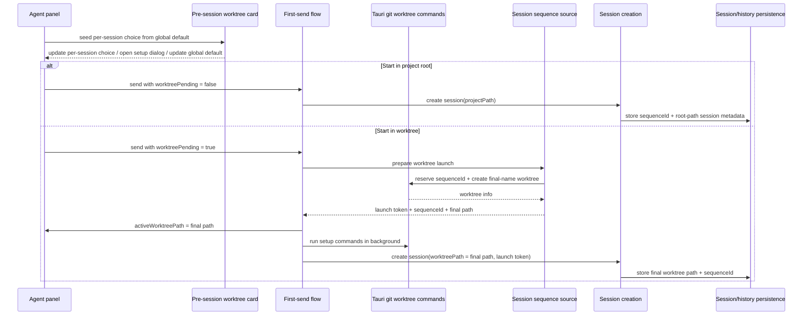

# feat: redesign pre-session worktree setup workflow

## Overview

Move fresh-session worktree setup out of the footer toggle and into a non-blocking pre-session card in the agent panel. The card becomes the canonical place to decide whether the next session starts in a worktree, inspect the global auto-worktree default, and edit project setup commands. The footer becomes display-only. On the backend/runtime side, Acepe should reserve or allocate the next project-scoped `sequenceId` before worktree creation so it can create the final deterministic worktree/branch name once, up front, and then start the session directly inside that final path.

## Problem Frame

The current worktree workflow is split across a footer control, localStorage-backed per-panel toggles, project settings, and the first-send path. That split hides a session-defining decision and makes the empty-state workflow hard to understand or review. The revised architecture direction keeps the card non-blocking and the auto-worktree preference global, but replaces the previous rename-after-creation fallback with a cleaner rule: use the DB-backed project sequence as the source of truth before launch, derive the final worktree identity once, and create the worktree directly with its durable name.

## Requirements Trace

- R1-R5: Fresh agent panels expose a compact, non-blocking pre-session worktree card that clearly shows whether first send will use a worktree or the project root.
- R6-R8: The card exposes the existing global auto-worktree default without collapsing it into the per-session choice.
- R9-R12: Setup command editing stays in the panel flow and continues to drive post-create worktree setup execution.
- R13-R15: The footer becomes a current-context display, not the primary setup control for fresh sessions.
- R16-R19: First-send behavior uses panel-owned pre-session state as the source of truth, while existing sessions keep their current worktree behavior.
- R20-R24: Acepe-created worktrees/branches derive their final deterministic name from timestamp, project slug, and a DB-backed project `sequenceId` before worktree creation, with safe collision handling and preserved Acepe branch semantics.

## Scope Boundaries

- No new per-project auto-worktree preference; the auto-worktree switch remains a global user default.
- No modal gate or forced decision before the composer becomes usable.
- No new storage model for setup commands; reuse the existing project-level worktree config.
- No retroactive rename of historical worktrees that already exist.
- No change to existing-session remove/rename semantics beyond making the footer display-only and creating new worktrees with final names from the start.

## Context & Research

### Relevant Code and Patterns

- `packages/desktop/src/lib/acp/components/agent-panel/components/agent-panel.svelte` already has the right non-blocking insertion seam via the `preComposer` stack and already owns `handleWorktreeCreated` / `handleWorktreeRenamed`, which update session state and persisted history.
- `packages/desktop/src/lib/acp/components/agent-input/agent-input-ui.svelte` currently performs the first-send worktree creation and background setup run before message send.
- `packages/desktop/src-tauri/src/db/repository.rs` already computes the next per-project `sequence_id` in the repository layer, which is the right backend-owned source for final-name-first launch orchestration.
- `packages/desktop/src/lib/acp/components/worktree-toggle/worktree-storage.ts` and `packages/desktop/src/lib/acp/components/agent-panel/logic/worktree-pending.ts` implement the current global-default + per-panel-localStorage pending logic that this feature replaces for agent panels.
- `packages/desktop/src/lib/acp/components/agent-panel/components/setup-scripts-dialog.svelte` and `packages/desktop/src/lib/components/settings-page/sections/worktrees/setup-commands-editor.svelte` already provide the setup-command editing flow the new card should reuse.
- `packages/desktop/src-tauri/src/acp/commands/session_commands.rs` already persists session metadata and can assign `sequence_id` early for worktree sessions, proving the backend owns this identity correctly.
- `packages/desktop/src-tauri/src/git/worktree.rs` remains the right home for deterministic naming and worktree creation rules.

### Institutional Learnings

- `docs/solutions/logic-errors/worktree-session-restore-2026-03-27.md`: worktree identity must be persisted and restored at the earliest boundary rather than repaired later by scans. The plan therefore prefers final-name-first creation over temporary-path rename flows.
- `docs/solutions/logic-errors/operation-interaction-association-2026-04-07.md`: one canonical owner should hold the lifecycle decision. The plan therefore moves fresh-session worktree choice into panel-owned state and treats the card/footer as projections.
- `docs/solutions/logic-errors/kanban-live-session-panel-sync-2026-04-02.md`: avoid parallel UI state machines. The plan keeps the pre-session card on the real panel/session model rather than inventing a separate setup-only container.
- `docs/solutions/best-practices/provider-owned-policy-and-identity-not-ui-projections-2026-04-09.md`: policy and identity should travel as typed metadata, not inferred from presentation. The plan therefore models worktree choice and rename state explicitly.

## Key Technical Decisions

- **Use panel-owned pre-session state, not localStorage, as the fresh-session source of truth.** Seed the choice once from the current global default when the fresh panel is created, then let the panel own the current-session decision independently. This satisfies the requirement to distinguish global default from per-session choice and avoids overwrite races when the global toggle changes after the panel is open.
- **Persist unsent launch choice across workspace restore.** Because worktree-vs-root is a session-defining pre-send choice, restoring a fresh panel should restore that choice with the draft instead of silently reseeding from the current global default.
- **Implement the new setup surface as shared presentational UI in `packages/ui` with desktop wiring in `packages/desktop`.** This follows Acepe's agent-panel MVC split and keeps Tauri/store concerns out of shared UI.
- **Keep setup-command editing dialog-based.** Reusing `setup-scripts-dialog.svelte` keeps the card compact, preserves the existing project-level config model, and avoids creating a second inline editing surface in the panel.
- **Use strict scope hierarchy in the card.** The pending-session choice is the primary control; the global default and project setup commands are secondary grouped actions with explicit scope labels.
- **Show footer status only for real session context.** Fresh unsent panels should not render a “current worktree” status widget. Once a session exists, the footer should show either the active worktree or an explicit project-root state.
- **Treat explicit worktree choice as authoritative for first send.** If the user chose to start in a worktree and creation fails, Acepe should not silently fall back to a root-path session. The draft stays intact, the card remains visible, and the user can retry after the inline/toast error.
- **Make recovery explicit when worktree launch fails.** The failure state should offer a primary retry action and a secondary explicit “start in project root” action; non-blocking must not mean silent fallback.
- **Allocate final session identity before worktree creation.** The backend should provide the next project-scoped `sequenceId` before first-send worktree creation so the final deterministic basename exists before the worktree is created.
- **Adopt a final-name-first naming scheme.** Final names should use the sortable format `<utc-timestamp>-<project-slug>-s<sequenceId>` and branches should remain `acepe/<basename>`. If the target already exists, append a numeric suffix (`-2`, `-3`, ...`) while keeping the same prefix structure.
- **Keep launch orchestration backend-owned where identity matters.** Sequence allocation and final worktree naming should not be inferred in the UI; the frontend edits launch intent and the backend executes it.
- **Use a launch-preparation backend command, not two loosely coupled frontend calls.** The clean boundary is one backend step that reserves the next project sequence and creates the final-name worktree, returning a launch token plus worktree identity that session creation can consume.

## Open Questions

### Resolved During Planning

- **Should the card be a new shared component or a recomposed desktop-only widget?** Use a new shared presentational component in `packages/ui`, then wire it from desktop.
- **What should own the fresh-session worktree decision?** Panel-owned pre-session state, seeded once from the global default and then independent from it.
- **Should setup-command editing be inline or dialog-based?** Keep the existing dialog flow and launch it from the card.
- **What should the final naming format be?** Use `<utc-timestamp>-<project-slug>-s<sequenceId>` for the final basename and `acepe/<basename>` for the branch.
- **What should the footer show for non-worktree sessions?** For existing sessions without a worktree, show an explicit project-root state; for fresh unsent panels, show no worktree status widget yet.
- **Should Acepe rename worktrees after session creation?** No. Allocate the next project sequence from the DB before worktree creation and create the final name up front.
- **How should sequence allocation reach the frontend?** Through a backend launch-preparation command that returns a launch token plus final worktree info rather than through raw frontend `MAX + 1` style inference.
- **Should pre-session worktree choice survive restore?** Yes. Restore the unsent launch choice with the draft instead of reseeding from the current global default.
- **How should worktree-launch failure recover?** Keep the draft and selected mode, show inline card failure state, and offer `Retry worktree` plus explicit `Start in project root`.

### Deferred to Implementation
- None. Planning resolves the architectural forks needed before implementation.

## High-Level Technical Design

> *This illustrates the intended approach and is directional guidance for review, not implementation specification. The implementing agent should treat it as context, not code to reproduce.*

## Implementation Units

- [ ] **Unit 1: Replace footer/localStorage pending logic with panel-owned pre-session worktree state**

**Goal:** Make fresh-session worktree choice a canonical panel-owned decision instead of a footer-driven localStorage override.

**Requirements:** R3-R8, R16-R19

**Dependencies:** None

**Files:**
- Modify: `packages/desktop/src/lib/acp/store/types.ts`
- Modify: `packages/desktop/src/lib/acp/store/panel-store.svelte.ts`
- Modify: `packages/desktop/src/lib/acp/store/workspace-store.svelte.ts`
- Modify: `packages/desktop/src/lib/acp/components/agent-panel/components/agent-panel.svelte`
- Modify: `packages/desktop/src/lib/acp/components/agent-panel/logic/worktree-pending.ts`
- Modify: `packages/desktop/src/lib/acp/components/worktree-toggle/worktree-storage.ts`
- Test: `packages/desktop/src/lib/acp/components/agent-panel/logic/__tests__/worktree-pending.test.ts`
- Test: `packages/desktop/src/lib/acp/components/worktree-toggle/__tests__/worktree-storage.test.ts`
- Test: `packages/desktop/src/lib/acp/store/__tests__/workspace-panels-persistence.test.ts`

**Approach:**
- Add explicit fresh-session worktree state to panel-owned hot state rather than deriving it from footer storage each time.
- Seed that state once from the global default for fresh agent panels, then treat later card/footer rendering as a projection of the panel state.
- Remove agent-panel dependence on per-panel localStorage so the global toggle can remain global without mutating a user's explicit current-panel choice.
- Persist the unsent launch choice with the rest of fresh-panel restore state so app restart does not silently change the intended first-send workspace mode.
- Keep existing-session worktree identity unchanged; once a session has a real `worktreePath`, the fresh-session pending state no longer applies.

**Execution note:** Start with failing logic tests that prove a fresh panel keeps its explicit worktree choice even if the global default changes after the panel is already open.

**Patterns to follow:**
- `packages/desktop/src/lib/acp/components/agent-panel/logic/worktree-pending.ts`
- `docs/solutions/logic-errors/operation-interaction-association-2026-04-07.md`

**Test scenarios:**
- Happy path — a fresh panel seeded from global default `true` resolves to `useWorktree = true` until the user changes it.
- Happy path — a fresh panel seeded from global default `false` resolves to `useWorktree = false`.
- Edge case — toggling the global default after the panel has been opened does not overwrite an explicit per-session choice already made in the card.
- Edge case — existing sessions with a real `worktreePath` never re-enter fresh-session pending mode.
- Integration — workspace restore round-trips the unsent launch choice alongside the draft instead of silently reseeding it.

**Verification:**
- Fresh-panel worktree choice is stable, canonical, and no longer depends on footer localStorage state.

- [ ] **Unit 2: Add the shared pre-session worktree configuration card and desktop wiring**

**Goal:** Render a compact, non-blocking card in the panel body that owns the pre-session setup affordances.

**Requirements:** R1-R12

**Dependencies:** Unit 1

**Files:**
- Create: `packages/ui/src/components/agent-panel/pre-session-worktree-card.svelte`
- Create: `packages/ui/src/components/agent-panel/__tests__/pre-session-worktree-card.svelte.vitest.ts`
- Modify: `packages/ui/src/components/agent-panel/index.ts`
- Create: `packages/desktop/src/lib/acp/components/agent-panel/components/pre-session-worktree-card.svelte`
- Modify: `packages/desktop/src/lib/acp/components/agent-panel/components/agent-panel.svelte`
- Modify: `packages/desktop/src/lib/acp/components/agent-panel/components/setup-scripts-dialog.svelte`
- Test: `packages/desktop/src/lib/acp/components/agent-panel/components/__tests__/agent-panel-content.svelte.vitest.ts`

**Approach:**
- Build a reusable presentational card in `packages/ui` that accepts the current per-session choice, the global-default state, worktree/setup labels, and callbacks.
- Keep setup-command editing dialog-based by launching the existing `setup-scripts-dialog.svelte` from the new card rather than embedding the command editor inline.
- Show the card only for fresh panels with no existing session, and place it in the current `preComposer` stack so the composer remains immediately available below it.
- Distinguish the per-session choice from the global default in copy and interaction affordances so the user can understand which toggle affects only this session versus future defaults.
- Give the card an explicit hierarchy: primary row for `This session starts in ...`, secondary row for `Default for future sessions`, and a separate project-scoped setup-command affordance.

**Patterns to follow:**
- `packages/desktop/src/lib/acp/components/agent-panel/components/agent-panel.svelte`
- `packages/desktop/src/lib/acp/components/modified-files/modified-files-header.svelte`
- `packages/desktop/src/lib/acp/components/agent-panel/components/setup-scripts-dialog.svelte`

**Test scenarios:**
- Happy path — a fresh panel with no session renders the card above the composer and below any existing inline error/status cards.
- Happy path — clicking the per-session worktree control updates the card state without affecting the global default label until the dedicated global toggle is used.
- Happy path — opening setup command editing from the card launches the existing project-scoped dialog.
- Edge case — panels with an existing session or existing `worktreePath` do not render the pre-session card.
- Edge case — the card's visual hierarchy makes session-only, global, and project-scoped actions distinguishable in one compact surface.
- Integration — the desktop wrapper passes project path, worktree choice, and global-default callbacks into the shared UI component without leaking Tauri/store logic into `packages/ui`.

**Verification:**
- Fresh panels show a single clear in-panel setup surface, and all card interactions route back into canonical desktop state.

- [ ] **Unit 3: Replace the footer control with display-only worktree status**

**Goal:** Make the footer a passive display of current worktree context rather than the fresh-session setup owner.

**Requirements:** R13-R15, R19

**Dependencies:** Unit 1, Unit 2

**Files:**
- Create: `packages/ui/src/components/agent-panel/worktree-status-display.svelte`
- Create: `packages/ui/src/components/agent-panel/__tests__/worktree-status-display.svelte.vitest.ts`
- Modify: `packages/ui/src/components/agent-panel/index.ts`
- Modify: `packages/desktop/src/lib/acp/components/agent-panel/components/agent-panel.svelte`
- Modify: `packages/desktop/src/lib/acp/components/worktree-toggle/worktree-toggle-control.svelte`
- Test: `packages/desktop/src/lib/acp/components/worktree-toggle/__tests__/worktree-toggle-control.vitest.ts`

**Approach:**
- Replace the panel footer's current `WorktreeToggleControl` usage with a display-oriented component that reports either the active worktree identity or an explicit project-root state.
- Keep manual rename/remove behavior for existing sessions available through the current session surfaces that already operate on real worktrees; only the fresh-session configuration responsibility moves out of the footer.
- Reduce `worktree-toggle-control.svelte` to the behavior still needed outside the fresh-panel footer path, or retire footer-specific behavior from it if no longer used there.
- Do not render worktree status in the left footer slot for a fresh unsent panel, because there is no current session workspace context yet.

**Patterns to follow:**
- `packages/ui/src/components/agent-panel/agent-panel-footer.svelte`
- `packages/desktop/src/lib/acp/components/agent-panel/components/agent-panel.svelte`

**Test scenarios:**
- Happy path — a worktree-backed session footer shows the active worktree name/path in display-only form.
- Happy path — a root-path session footer shows the explicit project-root state.
- Edge case — fresh panels before first send show no worktree status widget in the footer.
- Integration — the footer display updates when `handleWorktreeCreated` or `handleWorktreeRenamed` changes the active worktree path.

**Verification:**
- The footer reflects current session context and no longer participates in deciding first-send worktree behavior.

- [ ] **Unit 4: Rewire first-send workflow to honor explicit pre-session worktree choice**

**Goal:** Make first-send behavior depend on the new panel-owned card state, including a non-silent failure path when explicit worktree creation fails.

**Requirements:** R3-R5, R11-R12, R16-R19

**Dependencies:** Unit 1, Unit 2

**Files:**
- Modify: `packages/desktop/src/lib/acp/components/agent-panel/components/agent-panel.svelte`
- Modify: `packages/desktop/src/lib/acp/components/agent-input/agent-input-ui.svelte`
- Modify: `packages/desktop/src/lib/acp/components/agent-panel/logic/worktree-setup-events.ts`
- Modify: `packages/desktop/src/lib/acp/components/agent-input/logic/first-send-recovery.ts`
- Test: `packages/desktop/src/lib/acp/components/agent-panel/logic/__tests__/worktree-setup-events.test.ts`
- Test: `packages/desktop/src/lib/acp/components/agent-input/logic/__tests__/first-send-worktree-flow.test.ts`

**Approach:**
- Pass the panel-owned per-session choice into `AgentInput` instead of the old footer-derived `worktreePending` flow.
- Preserve the current root-path path for users who explicitly choose not to use a worktree.
- For explicit worktree sends, keep the create-then-send order but stop silently falling back to root session creation when worktree creation fails. Instead, keep the draft intact, surface the failure through the inline/setup card path plus toast, and let the user retry.
- Keep setup-command execution backgrounded after final-name worktree creation, with the setup event state still feeding the inline setup card.
- Make the card's failure state the recovery surface: retain the selected mode, show inline error details, and offer `Retry worktree` and explicit `Start in project root`.

**Execution note:** Start with a failing characterization test that proves current worktree-create failure silently continues into a root-path send, then change the behavior to preserve the explicit worktree choice.

**Patterns to follow:**
- `packages/desktop/src/lib/acp/components/agent-input/agent-input-ui.svelte`
- `packages/desktop/src/lib/acp/components/agent-input/logic/first-send-recovery.ts`
- `packages/desktop/src/lib/acp/components/agent-panel/logic/worktree-setup-events.ts`

**Test scenarios:**
- Happy path — choosing project root creates the session with no worktree creation call.
- Happy path — choosing worktree creates the final deterministic worktree, launches setup, and creates the session against that final worktree path.
- Error path — if explicit worktree creation fails, session creation is not attempted, the draft remains available, and the panel continues to show retryable worktree setup state.
- Error path — after worktree-launch failure, the card offers explicit recovery actions and does not force the user to infer whether pressing Send retries automatically.
- Error path — if setup commands fail after worktree creation, the session still continues in the worktree, but the setup state surfaces the failure without reverting the session to root mode.
- Integration — retrying after a worktree-create failure uses the same draft and explicit worktree choice rather than resetting to global default or root mode.

**Verification:**
- First-send behavior matches the visible card choice exactly, including failure behavior.

- [ ] **Unit 5: Add backend support for prelaunch sequence allocation and deterministic final worktree names**

**Goal:** Extend the Rust/backend launch path so it can prepare a worktree session launch atomically: reserve sequence identity, create the final deterministic worktree, and return a launch token the later session creation step can consume.

**Requirements:** R20-R24

**Dependencies:** None

**Files:**
- Modify: `packages/desktop/src-tauri/src/git/worktree.rs`
- Modify: `packages/desktop/src-tauri/src/db/repository.rs`
- Modify: `packages/desktop/src-tauri/src/acp/commands/session_commands.rs`
- Modify: `packages/desktop/src/lib/utils/tauri-client/git.ts`
- Test: `packages/desktop/src-tauri/src/git/worktree.rs`
- Test: `packages/desktop/src-tauri/src/acp/commands/tests.rs`
- Test: `packages/desktop/src-tauri/src/db/repository_test.rs`

**Approach:**
- Add a backend-owned launch-preparation command that reserves the next project-scoped `sequenceId`, derives the final basename, creates the worktree, and returns `{ launchToken, sequenceId, worktreeInfo }`.
- Add helper logic that formats the final basename from UTC timestamp + sanitized project slug + `s<sequenceId>`.
- Keep `acepe/<basename>` as the branch namespace so Acepe-owned worktrees remain recognizable to rename/remove/origin-detection flows.
- Ensure sanitization and collision handling are explicit so project names with spaces or punctuation still produce valid worktree directory names and git branch names.
- Persist the reservation strongly enough that the later session-creation step can consume the same identity rather than recalculating it.

**Patterns to follow:**
- `packages/desktop/src-tauri/src/git/worktree.rs`
- Existing `next_sequence_id_for_project` semantics in `packages/desktop/src-tauri/src/db/repository.rs`
- Existing early metadata persistence behavior in `packages/desktop/src-tauri/src/acp/commands/session_commands.rs`

**Test scenarios:**
- Happy path — preparing a worktree launch returns a launch token, the correct next project sequence, and final worktree info for that project.
- Happy path — formatting a final basename with timestamp, project slug, and sequence ID yields the expected deterministic result.
- Edge case — project names with spaces, underscores, or punctuation are sanitized into a stable slug.
- Edge case — if the target final basename already exists, the naming helper adds a numeric suffix while preserving the base format.
- Integration — created Acepe worktrees still keep the branch in the `acepe/` namespace and keep branch/directory names aligned.
- Integration — retries and abandoned launches follow an explicit reservation contract rather than recalculating a different identity.

**Verification:**
- Backend sequence allocation and naming rules are deterministic, safe, and compatible with existing Acepe worktree management semantics.

- [ ] **Unit 6: Thread preallocated sequence identity through first-send creation and persistence**

**Goal:** Use the launch token and preallocated project sequence consistently across worktree creation, session creation, and persistence so the session launches directly into its final worktree identity.

**Requirements:** R12, R16-R24

**Dependencies:** Unit 4, Unit 5

**Files:**
- Modify: `packages/desktop/src/lib/acp/components/agent-input/state/agent-input-state.svelte.ts`
- Modify: `packages/desktop/src/lib/acp/components/agent-panel/components/agent-panel.svelte`
- Modify: `packages/desktop/src/lib/acp/store/services/session-connection-manager.ts`
- Modify: `packages/desktop/src/lib/acp/store/workspace-store.svelte.ts`
- Modify: `packages/desktop/src/lib/acp/store/session-store.svelte.ts`
- Test: `packages/desktop/src/lib/acp/store/services/session-connection-manager.test.ts`
- Test: `packages/desktop/src/lib/acp/store/__tests__/workspace-panels-persistence.test.ts`
- Test: `packages/desktop/src/lib/acp/store/__tests__/workspace-sidebar-state-persistence.test.ts`

**Approach:**
- Thread the launch token and reserved `sequenceId` through the first-send orchestration so the worktree path, session metadata, and persisted workspace identity all agree before the runtime starts.
- Ensure session creation persists the same final worktree path the worktree was created with; there should be no temporary-path identity to repair later.
- Keep failure handling simple: if sequence allocation or final-name worktree creation fails, session creation must not proceed in root mode by accident.
- Reuse the same reservation on retry until the user abandons that prepared launch, so the planned worktree identity does not churn across repeated attempts.

**Execution note:** Start with failing integration-oriented tests that prove a worktree-backed session persists and restores the same final path it was launched with.

**Patterns to follow:**
- `packages/desktop/src/lib/acp/store/services/session-connection-manager.ts`
- `docs/solutions/logic-errors/worktree-session-restore-2026-03-27.md`
- `packages/desktop/src-tauri/src/acp/commands/session_commands.rs`

**Test scenarios:**
- Happy path — a worktree-backed session launches using the final deterministic worktree path from the start, and persistence stores that same path.
- Edge case — when setup is skipped because no setup commands exist, the same final-path launch still works.
- Error path — if sequence allocation or final-name worktree creation fails, session creation does not proceed and no inconsistent root-path session is created.
- Error path — if a prepared launch fails before session creation finishes, retry reuses the same launch token/identity instead of silently burning another sequence number.
- Integration — app restore/sidebar persistence reopen the session using the same final worktree path that was used at launch.
- Integration — existing sessions and historical worktrees do not get re-created or renamed by the new logic.

**Verification:**
- Worktree-backed sessions launch directly into their final durable identity without temporary-path repair logic.

## System-Wide Impact

- **Interaction graph:** The change crosses panel hot state, shared `packages/ui` agent-panel components, first-send orchestration in `AgentInput`, session creation in `session-connection-manager.ts`, workspace/session persistence, and Tauri git worktree commands.
- **Error propagation:** Explicit worktree-create failure should remain a first-send/setup error, not a silent root-path fallback. Final-name creation or sequence-allocation failure should not create a partial root-path session accidentally.
- **State lifecycle risks:** The highest-risk states are (1) fresh-panel choice drift between global default and per-session choice, (2) allocated sequence identity diverging from launch identity, and (3) failure after launch preparation leaving an unclear retry or abandonment rule.
- **API surface parity:** Footer display, restore paths, sidebar identity, and git-action surfaces all consume worktree identity; final-name-first launch must keep them aligned from the start.
- **Integration coverage:** Unit tests alone are insufficient for sequence allocation and final-path launch. The plan therefore includes integration-style coverage around repository allocation, startup persistence, and restore.
- **Unchanged invariants:** Existing sessions keep their current behavior; setup commands remain project-scoped; Acepe-owned worktrees stay under the `acepe/` branch namespace; historical worktrees are not renamed retroactively.

## Risks & Dependencies

| Risk | Mitigation |
|------|------------|
| Global default changes overwrite a fresh panel's explicit choice | Seed once from the global default, then keep a separate panel-owned current-session value |
| Explicit worktree choice still falls back silently to root mode on create failure | Add characterization-first coverage, then block session creation on worktree-create failure for that flow |
| Sequence allocation in UI drifts from DB reality | Keep allocation backend-owned and expose it through a launch-preparation command rather than computing `MAX + 1` in the frontend |
| Reserved sequence IDs can be lost or skipped if launch fails mid-flight | Use a durable launch token / reservation contract and reuse it on retry instead of recomputing identity on each attempt |
| Final worktree path can still drift from persisted session identity | Persist the final path at creation time and add restore-focused regression coverage |

## Documentation / Operational Notes

- The settings page remains the canonical long-form home for worktree setup commands and the global default, but the panel card becomes the in-context setup surface for fresh sessions.
- If implementation discovers a hidden provider/runtime constraint on launch-token or final-path-first session startup, document that constraint in `docs/solutions/` after execution because it materially affects future worktree features.

## Sources & References

- **Origin document:** `docs/brainstorms/2026-04-12-worktree-session-setup-requirements.md`
- Related code: `packages/desktop/src/lib/acp/components/agent-panel/components/agent-panel.svelte`
- Related code: `packages/desktop/src/lib/acp/components/agent-input/agent-input-ui.svelte`
- Related code: `packages/desktop/src/lib/acp/store/services/session-connection-manager.ts`
- Related code: `packages/desktop/src-tauri/src/acp/commands/session_commands.rs`
- Related code: `packages/desktop/src-tauri/src/db/repository.rs`
- Related code: `packages/desktop/src-tauri/src/git/worktree.rs`
- Institutional learning: `docs/solutions/logic-errors/worktree-session-restore-2026-03-27.md`
- Institutional learning: `docs/solutions/logic-errors/operation-interaction-association-2026-04-07.md`
- Institutional learning: `docs/solutions/logic-errors/kanban-live-session-panel-sync-2026-04-02.md`
- Institutional learning: `docs/solutions/best-practices/provider-owned-policy-and-identity-not-ui-projections-2026-04-09.md`
