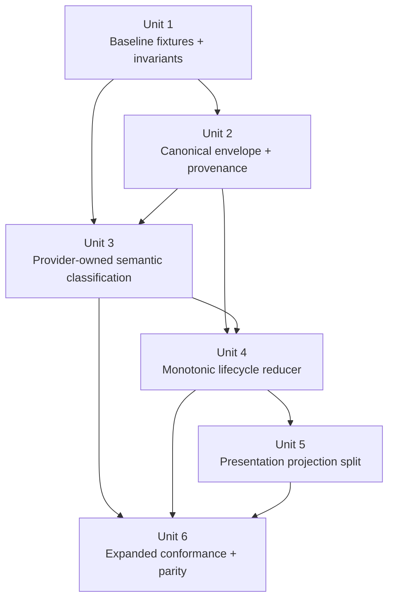

# refactor: Canonicalize ACP tool-event pipeline

## Overview

Refactor the ACP tool-event pipeline so provider transport payloads are normalized once into a provenance-aware canonical model, semantic classification becomes an explicit adapter concern, and UI rendering consumes a presentation projection instead of inferring behavior directly from raw payload shape.

This plan intentionally targets the tool-event pipeline first: classification, provenance, lifecycle reduction, and UI projection. It does not attempt the larger edit-payload overhaul in the same change set.

The first implementation pass is intentionally bridge-first: add the canonical envelope and projection layers alongside the existing `ToolCallData` consumers, migrate shared pipeline readers onto the new path, then remove legacy fallback reads only after parity tests pass. It is not a repo-wide in-place rewrite.

## Problem Frame

The current ACP pipeline allows provider-specific payload shape to leak past the adapter boundary. `build_tool_call_from_raw(...)` classifies events by mixing explicit provider hints, generic payload heuristics, title fallbacks, and later UI routing assumptions. The same logical operation can simultaneously exist as raw transport data, typed arguments, progressive arguments, content blocks, and result payloads. That makes the system workable but fragile: small provider payload changes can silently alter semantic kind and therefore UI behavior.

The immediate incident was a Copilot tool call shaped like `{ description, query }` being normalized into `ToolKind::Task`, which caused ordinary tool activity to render as subagent task UI. The local fix reduced the symptom by reprioritizing heuristics, but the architecture still lets incidental fields participate in domain meaning. We want a provider-agnostic runtime model where:

- raw payload is preserved for debugging, not product behavior
- semantic classification is explicit and provenance-aware
- lifecycle updates monotonically enrich a single canonical operation record
- UI routing depends on a display projection, not on transport-era ambiguity

## Requirements Trace

- R1. Provider transport events must be normalized into one canonical tool-event model before frontend rendering or downstream store logic consumes them.
- R2. Canonical events must preserve source provenance: provider, provider tool name, provider-declared kind, classification source, and raw transport payload.
- R3. Semantic classification must favor explicit provider signals and adapter-owned rules over generic shape heuristics.
- R4. UI rendering must consume a dedicated presentation/display projection instead of directly routing on canonical semantic kind alone.
- R5. Lifecycle updates (`toolCall`, `toolCallUpdate`, replay, streaming enrichment) must merge into one monotonic operation record with explicit enrichment rules.
- R6. Raw payload must remain available for debugging and fixture coverage, but product behavior must not depend on it as a runtime fallback.
- R7. Provider conformance coverage must fail when provider payload drift changes canonical meaning or UI projection unexpectedly.
- R8. Replay and live events must reuse the same canonicalization pipeline after provider-specific transport decoding.

## Scope Boundaries

- No full `EditDelta` overhaul in this plan; edit canonicalization beyond the current tool-event boundary is deferred.
- No redesign of the agent panel or kanban visual language.
- No migration of historical stored sessions beyond what is required for compatibility with the new canonical model.
- No attempt to collapse all ACP interaction types (permissions, questions, plans) into the same architecture in this iteration unless they already pass through the tool-event pipeline.
- No new renderer types, visual redesign, or scene-layer cleanup beyond what is required to route existing UI surfaces through one presentation projection.
- No simultaneous provider-by-provider semantic rewrite across the whole stack; the first pass covers Copilot plus the shared fallback path and preserves existing explicit-signal behavior for other providers.

### Deferred to Separate Tasks

- Full edit-operation canonicalization (`rawInput`, `arguments`, `streamingArguments`, `content`, and `result` collapsed into a first-class edit delta model).
- Replay/history storage compaction once the canonical operation model is stable.
- Cross-agent analytics and debugging UI for provenance inspection.

## Context & Research

### Relevant Code and Patterns

- `packages/desktop/src-tauri/src/acp/session_update/tool_calls.rs` currently centralizes raw tool call construction and is the natural ingress point for a canonical tool-event envelope.
- `packages/desktop/src-tauri/src/acp/tool_classification.rs` currently mixes provider hints with generic serialized-argument heuristics; this is the main architectural pressure point exposed by the Copilot bug.
- `packages/desktop/src-tauri/src/acp/parsers/shared_chat.rs` and provider parsers such as `packages/desktop/src-tauri/src/acp/parsers/copilot_parser.rs` already act as adapter seams and should become the owners of provider-specific semantic upgrades.
- `packages/desktop/src/lib/services/converted-session-types.ts` and `packages/desktop/src/lib/acp/types/tool-call.ts` define the shared Rust/TypeScript contract; these are the boundary types the rest of the app reads.
- `packages/desktop/src/lib/acp/store/services/tool-call-manager.svelte.ts` is already the lifecycle merger for tool-call entries and should evolve into the single canonical reducer instead of accumulating ad hoc reconciliation rules.
- `packages/desktop/src/lib/acp/components/tool-calls/tool-definition-registry.ts` currently routes UI components directly from canonical kind; this is where semantic kind and presentation kind are still coupled.

### Institutional Learnings

- `docs/solutions/logic-errors/kanban-live-session-panel-sync-2026-04-02.md` reinforces the architecture rule that product surfaces should read canonical state with preserved provenance rather than projecting directly from lower-level transport artifacts.

### External References

- None used. The repository already contains the relevant architectural context and the immediate problem is internal pipeline design, not framework behavior.

## Key Technical Decisions

| Decision | Rationale |
|---|---|
| Introduce a canonical tool-event envelope with provenance fields | Separates provider transport truth from semantic and presentation layers, making classification explainable and debuggable. |
| Split semantic kind from display variant | Prevents UI routing from depending on transport-era ambiguity and allows different surfaces to present the same semantic event differently without mutating domain meaning. |
| Move task/question/todo/skill promotion toward provider adapters | Adapter-owned rules are easier to reason about than global payload-shape heuristics and better match real provider contracts. |
| Finalize semantic kind at the canonical envelope boundary | Providers should surface evidence while explicit metadata is still available, but there must be one authoritative place where canonical semantic kind is committed. |
| Make the frontend reducer monotonic | A single operation record with additive enrichment is less fragile than parallel shape fallbacks across `rawInput`, `arguments`, updates, and result payloads. |
| Use a bridge-first migration around `ToolCallData` | An additive wrapper/bridge keeps Specta and consumer churn bounded while the reducer and presentation split move over in sequence. |
| Merge operations by session-scoped tool-call identity only | The reducer must key by the provider-issued tool call ID within the session, with explicit aliasing only when replay decoding can prove identity; no best-effort fuzzy matching. |
| Require one authoritative presentation builder | All UI surfaces should consume one display projection builder so semantic kind and renderer selection cannot drift independently across components. |
| Use real provider fixtures from logs for conformance tests | The failure mode came from observed payload shape drift, so the architecture needs fixture-backed regression coverage instead of only synthetic unit cases. |

## Open Questions

### Resolved During Planning

- **What scope should this plan target first?** Tool-event pipeline architecture first, not the entire operation/edit model. This is the narrowest slice that removes the current class of classification and rendering ambiguity while creating a stable base for a later edit canonicalization plan.
- **Should the first pass be Copilot-specific or generalized?** Generalized pipeline with Copilot-derived regression fixtures. The bug surfaced in Copilot, but the architectural smell is cross-provider.
- **Should the migration wrap `ToolCallData` or rewrite it in place?** Start with a wrapper/bridge around the existing `ToolCallData` shape so the canonical envelope lands additively, then collapse in place only after the reducer and presentation layers have migrated and legacy fallback reads are unreferenced.
- **Should raw payload stay in the runtime model?** Yes, but only as provenance/debug data. Runtime behavior and UI routing should not fall back to it.

### Deferred to Implementation

- **Exact naming of the new canonical types** (`ToolEvent`, `ToolOperation`, `ToolSemantics`, `ToolPresentation`, etc.) should be finalized once the concrete Rust/TypeScript type boundaries are edited together.
- **How much fixture data to snapshot per provider** should be tuned during implementation to balance coverage and maintenance burden.

## High-Level Technical Design

> *This illustrates the intended approach and is directional guidance for review, not implementation specification. The implementing agent should treat it as context, not code to reproduce.*

```text
provider event
  -> provider adapter parse
  -> provider evidence capture
  -> canonical tool-event envelope (raw + provenance + finalized semantic kind)
  -> lifecycle reducer merges updates into one operation record
  -> presentation projection derives display variant
  -> UI renders rows/cards from projection only

                raw provider payload
                         |
                         v
      +-------------------------------------------+
      | Canonical Tool Event Envelope             |
      |-------------------------------------------|
      | provider                                  |
      | providerToolName                          |
      | providerDeclaredKind                      |
      | rawArguments / rawResult                  |
      | explicit provenance + classificationSource|
      | finalized semantic kind                   |
      +-------------------+-----------------------+
                          |
                          v
      +-------------------------------------------+
      | Canonical Operation Reducer               |
      |-------------------------------------------|
      | started/pending/streaming/completed       |
      | typed semantics                           |
      | progressive enrichment                    |
      | no UI concerns                            |
      +-------------------+-----------------------+
                          |
                          v
      +-------------------------------------------+
      | Presentation Projection                   |
      |-------------------------------------------|
      | authoritative buildToolPresentation()     |
      | displayVariant: row/task/todo/question    |
      | title/subtitle/result snippets            |
      | surface-specific rendering metadata       |
      +-------------------+-----------------------+
                          |
                          v
                      UI surfaces
```

## Implementation Units



- [ ] **Unit 1: Capture baseline provider fixtures and pipeline invariants**

**Goal:** Lock the current failure class into executable regressions before changing canonicalization, so later units have a stable red/green baseline.

**Requirements:** R3, R7, R8

**Dependencies:** None

**Files:**
- Create: `packages/desktop/src-tauri/tests/fixtures/provider-tool-events/copilot-description-query.json`
- Create: `packages/desktop/src-tauri/tests/fixtures/provider-tool-events/copilot-subagent-task.json`
- Create: `packages/desktop/src-tauri/tests/fixtures/provider-tool-events/shared-explicit-task.json`
- Create: `packages/desktop/src-tauri/tests/provider_tool_event_baseline.rs`
- Test: `packages/desktop/src-tauri/tests/provider_tool_event_baseline.rs`

**Approach:**
- Capture one fixture for the observed Copilot ambiguity, one explicit Copilot subagent fixture, and one shared-path explicit-task fixture so the first-pass scope has a minimum provider matrix.
- Assert current desired invariants up front: descriptive non-task tools must stay non-task, explicit subagent/task tools must stay task, and replay/live decoding must converge on the same canonicalization entry point once later units land.
- Keep this baseline narrowly scoped to the ambiguity classes the refactor is intended to fix, not a broad fixture corpus.

**Patterns to follow:**
- Existing parser and replay tests already use observed transport payloads; this unit formalizes that pattern into stable fixture files.

**Test scenarios:**
- Happy path: the Copilot `{ description, query }` fixture is expected to remain non-task after the refactor.
- Happy path: the explicit Copilot subagent fixture is expected to remain task-shaped after the refactor.
- Edge case: the shared explicit-task fixture proves the generic path still respects strong task signals.
- Integration: fixture loading and assertion plumbing are reusable by later conformance tests instead of duplicating payload literals.

**Verification:**
- The refactor starts with failing or proving fixture-backed invariants that later units can carry forward unchanged.

- [ ] **Unit 2: Introduce canonical tool-event envelope and provenance metadata**

**Goal:** Create a shared Rust/TypeScript event model that preserves provider transport truth and classification provenance before downstream reducers or UI consume it.

**Requirements:** R1, R2, R6

**Dependencies:** Unit 1

**Files:**
- Modify: `packages/desktop/src-tauri/src/acp/session_update/types/tool_calls.rs`
- Modify: `packages/desktop/src-tauri/src/acp/session_update/tool_calls.rs`
- Modify: `packages/desktop/src/lib/services/converted-session-types.ts`
- Modify: `packages/desktop/src/lib/acp/types/tool-call.ts`
- Modify: `packages/desktop/src/lib/acp/types/operation.ts`
- Test: `packages/desktop/src-tauri/src/acp/session_update/tests.rs`

**Approach:**
- Extend the canonical tool-call/event payload with explicit provenance fields such as provider identity, provider tool name, provider-declared kind, and classification source/reason.
- Preserve raw transport payloads as debug-facing fields instead of allowing them to implicitly drive semantic or UI behavior.
- Keep the initial migration additive behind a bridge type around the existing `ToolCallData` shape so existing call sites can migrate incrementally rather than forcing a repo-wide rewrite in one step.

**Patterns to follow:**
- The Rust-to-TypeScript type boundary already flows through Specta-generated structures in `packages/desktop/src/lib/services/converted-session-types.ts`.
- The provenance lesson in `docs/solutions/logic-errors/kanban-live-session-panel-sync-2026-04-02.md` should guide the model: store the origin signal instead of reconstructing it later.

**Test scenarios:**
- Happy path: parsing a provider tool call preserves provider name, canonical kind, and raw payload simultaneously.
- Happy path: replayed serialized events expose the same provenance fields as live events.
- Edge case: a tool call with unknown provider kind still produces a valid canonical envelope with `other` semantics and intact provenance.
- Error path: malformed provenance-related fields do not crash canonical event construction; the event falls back to explicit `other` semantics with raw payload retained.
- Integration: a Rust-generated canonical event serializes through Specta and is readable from TypeScript without losing provenance fields.

**Verification:**
- A live or replayed tool event can be inspected end-to-end without needing to infer which provider field originally determined its meaning.

- [ ] **Unit 3: Make semantic classification provider-owned and explicit**

**Goal:** Move task/todo/question/skill/search/read promotion rules toward provider adapters and reduce generic argument-shape inference to a weak fallback.

**Requirements:** R2, R3, R6

**Dependencies:** Unit 1, Unit 2

**Files:**
- Modify: `packages/desktop/src-tauri/src/acp/tool_classification.rs`
- Modify: `packages/desktop/src-tauri/src/acp/parsers/shared_chat.rs`
- Modify: `packages/desktop/src-tauri/src/acp/parsers/copilot_parser.rs`
- Test: `packages/desktop/src-tauri/src/acp/session_update/tests.rs`
- Test: `packages/desktop/src-tauri/src/acp/tool_classification.rs`

**Approach:**
- Capture provider-specific semantic evidence in the relevant parser/adapter path while explicit tool names, event names, and provider metadata are still available.
- Finalize canonical semantic classification at the canonical envelope boundary from that captured evidence, using generic serialized-argument inference only as a named weak fallback when no stronger provider or typed-argument signal exists.
- In the first pass, narrow provider-specific rollout to Copilot and the shared fallback path while preserving existing explicit-signal behavior for other providers.
- Emit classification source/reason fields so later debugging can answer “why is this a task?” without re-reading heuristic order.

**Execution note:** Start with failing regression coverage for the observed Copilot shapes and explicit subagent/task payloads in the nearest existing Rust test files; once Units 4 and 5 stabilize the pipeline, promote those same payloads into the shared fixture set in Unit 6 for cross-boundary conformance coverage.

**Patterns to follow:**
- Existing parser seams in `packages/desktop/src-tauri/src/acp/parsers/*.rs` already decide provider-specific typing; this unit should reinforce that boundary rather than create another shared heuristic layer.

**Test scenarios:**
- Happy path: a Copilot subagent payload with explicit task/subagent signals still classifies as `task`.
- Happy path: explicit question/todo/skill provider payloads classify correctly without depending on title fallbacks.
- Edge case: a payload with both `description` and a stronger search/execute/read signal resolves to the stronger semantic kind and records the source rule.
- Error path: unknown tool names with ambiguous payloads remain `other` instead of being over-promoted.
- Integration: provider parser output and generic classifier output agree on canonical kind for the same known provider fixture.

**Verification:**
- Semantic kind becomes explainable from explicit provider evidence or a clearly named fallback rule, not from incidental field order alone.

- [ ] **Unit 4: Collapse tool lifecycle updates into one monotonic operation reducer**

**Goal:** Replace parallel fallback paths with a single lifecycle reducer that incrementally enriches one canonical operation record from start, streaming, update, replay, and completion events.

**Requirements:** R1, R5, R6

**Dependencies:** Unit 2, Unit 3

**Files:**
- Modify: `packages/desktop/src/lib/acp/store/services/tool-call-manager.svelte.ts`
- Modify: `packages/desktop/src/lib/acp/store/session-event-service.svelte.ts`
- Modify: `packages/desktop/src/lib/acp/types/tool-call.ts`
- Modify: `packages/desktop/src/lib/acp/types/operation.ts`
- Test: `packages/desktop/src/lib/acp/store/services/__tests__/tool-call-manager.test.ts`
- Test: `packages/desktop/src/lib/acp/store/__tests__/tool-call-event-flow.test.ts`

**Approach:**
- Merge operation records by session-scoped provider tool-call ID, with explicit aliasing only when replay decoding can prove that two IDs refer to the same underlying operation.
- Define monotonic merge rules for lifecycle fields: provenance and source identity are set once, typed semantics can be enriched but not implicitly replaced by weaker information, and streaming data upgrades operation state rather than existing as a parallel fallback shape.
- Reduce ad hoc promotion logic in the store layer so question/todo/task upgrades are explicit transitions tied to canonical semantics rather than to raw payload presence.
- Ensure replayed history and live streaming reuse the same canonicalization and reducer semantics after transport decoding, with one operation record shape feeding downstream projections.

**Patterns to follow:**
- `packages/desktop/src/lib/acp/store/services/tool-call-manager.svelte.ts` already centralizes lifecycle mutation; this unit should strengthen that into the single source of truth rather than create another reducer.

**Test scenarios:**
- Happy path: a pending tool call followed by streaming updates and a completion update yields one canonical operation record with monotonic enrichment.
- Happy path: replayed history of the same tool call produces the same final operation shape as the live stream.
- Edge case: late-arriving weaker updates do not overwrite stronger previously established semantics or provenance.
- Error path: failed tool updates preserve provenance and partial lifecycle state while exposing failure reason cleanly.
- Integration: question/todo/task-specific enrichments still surface correctly through the reducer without relying on raw payload scanning in consumers.

**Verification:**
- Store consumers can read one stable operation record per tool call without branching across parallel fallback fields to reconstruct meaning.

- [ ] **Unit 5: Separate semantic kind from presentation projection**

**Goal:** Route UI components from a dedicated projection layer so semantic kind and renderer choice are no longer the same concern.

**Requirements:** R4, R5, R6

**Dependencies:** Unit 4

**Files:**
- Modify: `packages/desktop/src/lib/acp/components/tool-calls/tool-definition-registry.ts`
- Modify: `packages/desktop/src/lib/acp/components/tool-calls/resolve-tool-operation.ts`
- Modify: `packages/desktop/src/lib/acp/components/activity-entry/activity-entry-projection.ts`
- Modify: `packages/desktop/src/lib/acp/components/agent-panel/scene/desktop-agent-panel-scene.ts`
- Modify: `packages/desktop/src/lib/acp/registry/tool-kind-ui-registry.ts`
- Create: `packages/desktop/src/lib/acp/components/tool-calls/tool-presentation.ts`
- Test: `packages/desktop/src/lib/acp/components/tool-calls/__tests__/tool-definition-registry.test.ts`
- Test: `packages/desktop/src/lib/acp/components/agent-panel/scene/desktop-agent-panel-scene.test.ts`
- Test: `packages/desktop/src/lib/acp/components/activity-entry/__tests__/activity-entry-projection.test.ts`

**Approach:**
- Introduce one authoritative `buildToolPresentation(...)` projection derived from canonical operation data and provenance-aware semantics rather than using `toolCall.kind` as the direct renderer route key.
- Keep existing UI components where possible, but make that projection layer responsible for deciding whether an event renders as a task card, generic tool row, question block, todo block, or browser/read/search variant.
- Preserve semantic kind for domain logic and analytics while allowing presentation to evolve independently.
- Limit this unit to routing parity through existing components; do not introduce new renderer types, scene-layer refactors, or visual redesign.

**Patterns to follow:**
- The existing split between store state and scene projection in `packages/desktop/src/lib/acp/components/agent-panel/scene/desktop-agent-panel-scene.ts` is the right layering model; this unit should extend that pattern to tool-call display routing.

**Test scenarios:**
- Happy path: explicit subagent/task operations still project to task-card UI.
- Happy path: ordinary tool calls with descriptive metadata project to normal tool rows, not task UI.
- Edge case: ambiguous `other` operations project to a stable fallback renderer without mutating semantic kind.
- Error path: failed operations preserve their error presentation regardless of display variant.
- Integration: agent panel, activity entries, and compact tool display all agree on the same presentation variant for the same canonical operation.

**Verification:**
- Renderer choice can change without redefining canonical semantic kind, and UI bugs caused by semantic overreach are isolated to one projection layer.

- [ ] **Unit 6: Expand fixture-backed conformance and live/replay parity coverage**

**Goal:** Lock the architecture against provider payload drift by testing canonicalization and presentation against real observed provider events.

**Requirements:** R2, R5, R7, R8

**Dependencies:** Unit 3, Unit 4, Unit 5

**Files:**
- Modify: `packages/desktop/src-tauri/tests/provider_tool_event_baseline.rs`
- Modify: `packages/desktop/src-tauri/src/copilot_history/parser.rs`
- Modify: `packages/desktop/src/lib/acp/store/__tests__/tool-call-event-flow.test.ts`
- Modify: `packages/desktop/src/lib/acp/components/tool-calls/__tests__/build-agent-tool-entry.test.ts`
- Test: `packages/desktop/src-tauri/tests/provider_tool_event_baseline.rs`

**Approach:**
- Expand the baseline fixture set into cross-boundary conformance coverage, but keep the matrix narrow: Copilot ambiguity fixtures plus at least one shared explicit-task path that proves the generic pipeline still respects strong task signals.
- Assert canonical semantics, provenance fields, and display projection expectations against those fixtures so provider shape drift fails tests before it reaches the product.
- Cover both Rust canonicalization and TypeScript projection so regressions cannot hide at the boundary between backend normalization and frontend rendering.
- Define migration safety narrowly as live/replay parity plus Rust/TypeScript contract parity; do not treat storage migration, replay compaction, or cross-provider corpus expansion as completion criteria for this unit.

**Patterns to follow:**
- Existing replay and parser tests in `packages/desktop/src-tauri/src/copilot_history/parser.rs` and `packages/desktop/src-tauri/src/acp/session_update/tests.rs` already exercise observed transport payloads; this unit should extend that approach with dedicated provider fixtures.

**Test scenarios:**
- Happy path: the Copilot `{ description, query }` fixture canonicalizes as a non-task semantic kind and projects to a non-task display variant.
- Happy path: the Copilot subagent fixture canonicalizes as `task` with preserved provenance and projects to task UI.
- Edge case: replay and live variants of the same provider payload resolve identically.
- Error path: a fixture missing optional metadata still produces deterministic canonical and presentation outputs.
- Integration: a fixture-driven Rust canonicalization test and a frontend projection test agree on the final expected semantic kind and display variant.

**Verification:**
- Real provider examples become part of the architectural contract, and drift in provider payload shape causes focused test failures instead of silent UI changes.

## System-Wide Impact

- **Interaction graph:** provider parsers -> `session_update` canonicalization -> store reducer -> projection layer -> tool-call UI surfaces.
- **Error propagation:** classification or provenance failures should degrade to explicit `other` semantics and fallback presentation instead of over-promoting to a stronger semantic kind.
- **State lifecycle risks:** partial migration can leave replayed sessions and live sessions disagreeing on semantic or display state if the reducer and projection layers are upgraded out of order.
- **API surface parity:** agent panel, activity feed, compact tool summaries, and history replay must all consume the same canonical semantics and presentation projection.
- **Integration coverage:** parity between live provider updates, replayed session updates, and Specta-generated TS contracts is critical; unit tests alone are insufficient.
- **Unchanged invariants:** existing explicit task, question, todo, skill, browser, read, edit, and execute behaviors should remain intact when providers already emit strong signals for those meanings.

## Risks & Dependencies

| Risk | Mitigation |
|------|------------|
| Canonical type changes create broad compile churn across Rust/TypeScript boundaries | Keep Unit 2 additive first behind the bridge type, migrate call sites incrementally, and validate with focused Rust + TS tests before deleting legacy fields. |
| Provider adapters diverge in behavior during migration | Centralize provenance metadata and conformance fixtures so adapter-specific rules remain observable and comparable. |
| Presentation split creates temporary mismatch between semantic kind and renderer selection | Land Unit 5 only after the monotonic reducer in Unit 4 is stable, and add cross-surface projection tests in the same change set. |
| Replay/history paths preserve old assumptions and bypass the new model | Include replay-focused fixture coverage and explicitly touch `packages/desktop/src-tauri/src/copilot_history/parser.rs` in Unit 6. |
| The narrower pipeline-first scope leaves edit canonicalization debt behind | Record the edit-model overhaul explicitly as a follow-on task so the new pipeline is treated as a foundation, not the final state. |

## Documentation / Operational Notes

- Add a follow-up solution doc in `docs/solutions/` after implementation if the final rollout surfaces stable architecture guidance worth preserving.
- Keep provider fixtures small and curated so they remain readable in review and easy to update when provider contracts evolve intentionally.
- If the canonical envelope introduces new debug metadata to the UI or logs, ensure those surfaces remain developer-facing and do not clutter normal user presentation.

## Sources & References

- Related code: `packages/desktop/src-tauri/src/acp/session_update/tool_calls.rs`
- Related code: `packages/desktop/src-tauri/src/acp/tool_classification.rs`
- Related code: `packages/desktop/src/lib/acp/store/services/tool-call-manager.svelte.ts`
- Related code: `packages/desktop/src/lib/acp/components/tool-calls/tool-definition-registry.ts`
- Institutional learning: `docs/solutions/logic-errors/kanban-live-session-panel-sync-2026-04-02.md`
