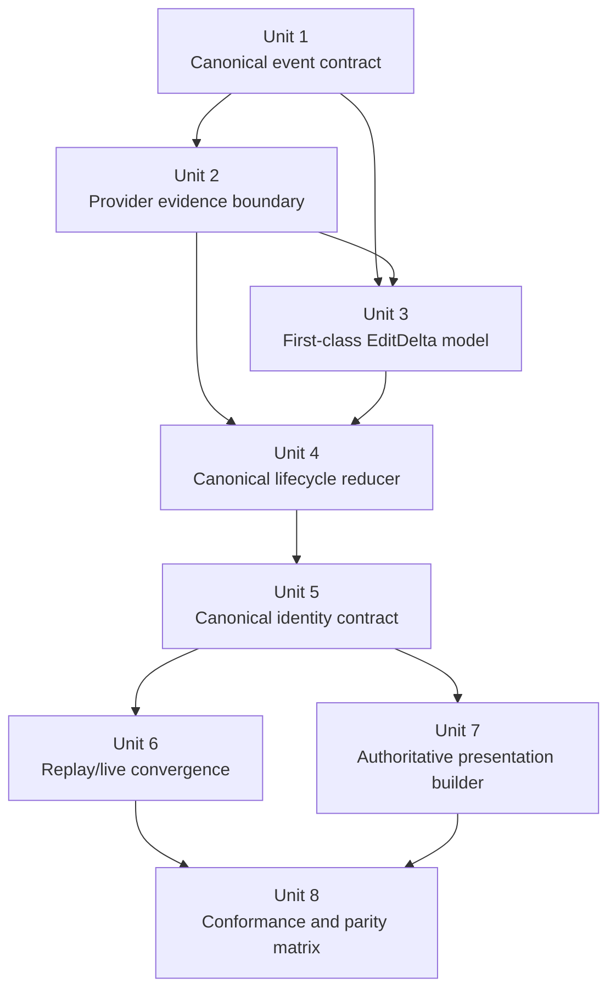

# refactor: God-clean canonical operation model

## Overview

Replace the current ACP tool/event pipeline with a single end-state operation architecture: provider transport is normalized once at the adapter edge, edits become first-class deltas instead of parallel payload shapes, live and replay events flow through the same canonicalization path, and every UI surface consumes one projection built from canonical runtime state rather than reconstructing meaning from transport artifacts.

This plan defines the fully cleaned-up architecture and should be executed directly as the replacement design, not treated as a bridge target or staged-transition document.

## Problem Frame

Acepe already has the right instinct in several areas: provider adapters exist, `OperationStore` exists, and the product has repeatedly learned that one runtime owner with many projections is healthier than many surfaces scanning transport state independently. But the current tool/event model still leaks transport ambiguity across the boundary:

- semantic kind can still be influenced by incidental payload shape
- edit data can exist in parallel shapes (`rawInput`, typed `arguments`, `progressiveArguments`, `content`, `result`, `rawOutput`)
- live and replay paths are not yet obviously the same canonicalization pipeline
- UI routing still depends too directly on semantic/tool kind
- raw transport payload remains too available as a behavioral fallback

That makes the system workable but brittle. A provider payload drift can still change behavior without a crisp type failure, and an implementer still has to understand too many parallel shapes to reason about correctness.

The god-clean target is:

1. one canonical operation model after adapter parsing
2. one first-class edit delta model
3. one monotonic lifecycle reducer
4. one canonical read owner for runtime semantics
5. one presentation builder for all UI surfaces
6. raw payload preserved only as provenance/debug context

## Requirements Trace

- R1. Provider transport must be parsed once into a canonical event contract before store or UI logic consumes it.
- R2. Canonical events must preserve provenance: provider, provider tool name, provider-declared kind, transport identity, and classification source.
- R3. Semantic classification must be finalized from explicit provider evidence first and weak heuristics only as named fallback.
- R4. Edit-bearing operations must normalize into one first-class `EditDelta` model instead of parallel representations spread across arguments, content, and results.
- R5. Tool lifecycle state must reduce into one monotonic canonical operation record keyed by session and transport identity.
- R6. Live streams and replay/history decoding must reuse the same canonicalization and lifecycle reduction path after transport decoding.
- R7. UI surfaces must consume a shared presentation projection instead of independently routing or reconstructing behavior from tool payloads.
- R8. Raw payload must remain available for diagnostics, fixture conformance, and provenance inspection, but not as a runtime product fallback.
- R9. The architecture must be fixture-testable across provider payloads so transport drift fails focused conformance tests.
- R10. When canonicalization cannot fully recover semantics, the runtime must preserve a structured degraded state with a degradation reason instead of silently collapsing actionable data into opaque `other`.

## Scope Boundaries

- No redesign of the visual styling or interaction model of the agent panel, kanban, or transcript surfaces.
- No in-plan implementation of unrelated provider/runtime refactors outside operation/event modeling.
- No attempt to collapse every non-tool ACP concept into the same type hierarchy unless it materially interacts with the operation model.
- No storage compaction or transcript archival redesign beyond what is necessary to make replay consume the canonical path.

### Deferred to Separate Tasks

- Dedicated provenance/debug UI beyond what is needed for engineering inspection
- Broader product analytics over canonical operations
- Storage compaction and transcript archival optimization once the end-state model is stable

## Context & Research

### Relevant Code and Patterns

- `packages/desktop/src-tauri/src/acp/session_update/tool_calls.rs` currently constructs `ToolCallData` directly from raw transport, which is the main boundary that should instead emit canonical operation events.
- `packages/desktop/src-tauri/src/acp/tool_classification.rs` and shared/parser helpers still centralize generic heuristics that are stronger than they should be for an end-state architecture.
- `packages/desktop/src/lib/services/converted-session-types.ts` exposes the current Rust-to-TS contract, including the payload-shape explosion around `rawInput`, `result`, `rawOutput`, `content`, and `streamingArguments`.
- `packages/desktop/src/lib/acp/store/services/tool-call-manager.svelte.ts` is the current lifecycle mutation adapter, but it still merges parallel shapes into `ToolCall` instead of reducing canonical operation events into a single domain record.
- `packages/desktop/src/lib/acp/store/operation-store.svelte.ts` already establishes the right read-model pattern: one canonical owner for execution state keyed by session + tool call.
- `packages/desktop/src/lib/acp/components/tool-calls/tool-definition-registry.ts` shows where renderer routing still depends on semantic/tool kind more directly than the end-state architecture should allow.

### Institutional Learnings

- `docs/solutions/best-practices/provider-owned-policy-and-identity-not-ui-projections-2026-04-09.md` establishes the rule that provider identity and policy must travel as typed contracts, not be reconstructed from projections or labels.
- `docs/solutions/logic-errors/operation-interaction-association-2026-04-07.md` establishes the pattern that runtime ownership should live in a canonical store layer while projections remain read-only consumers.
- `docs/solutions/logic-errors/kanban-live-session-panel-sync-2026-04-02.md` reinforces the same lesson: one runtime owner, many projections.

### External References

- None used. The repository already contains enough architectural guidance for this planning problem.

## Key Technical Decisions

| Decision | Rationale |
|---|---|
| Introduce a canonical `OperationEvent` boundary after provider parsing | Prevents transport-specific payload shapes from leaking directly into domain/runtime state. |
| Split provider evidence capture from final semantic classification | Adapters should capture explicit evidence while metadata is still present, but one canonical stage must finalize semantic meaning. |
| Introduce first-class `EditDelta` variants | Edit semantics are too important to remain scattered across raw input, arguments, content, and results. |
| Make `OperationStore` the canonical runtime read owner | The repo already learned that projection consumers should not reconstruct semantics from transcript artifacts. |
| Keep raw transport payload as provenance only | Preserves debuggability without letting product behavior depend on parallel fallback shapes. |
| Replay must re-enter the provider adapter boundary after transport decoding | This is the cleanest way to ensure live and replay share one semantic path instead of converging only after provider-specific meaning has already diverged. |
| Degraded canonical state must be explicit and structured | Failing closed should preserve salvageable parsed fragments plus a degradation reason so behavior is safe without becoming opaque. |
| Make replay and live share one canonicalization path | Avoids “same behavior, different pipeline” drift and makes conformance tests meaningful. |
| Route UI from an authoritative presentation builder | Semantic kind and display choice should not drift independently across transcript, queue, kanban, and agent panel surfaces. |

## Open Questions

### Resolved During Planning

- **Should this plan describe the transition or the end state?** The end state, executed directly as the replacement architecture.
- **Should edit canonicalization be part of the god-clean plan?** Yes. The payload-shape explosion around edits is one of the core reasons the current model is not clean.
- **Should replay/history be included?** Yes. A god-clean model is incomplete if replay and live use meaningfully different canonicalization paths.
- **Should UI projection stay separate from semantic kind?** Yes. Semantic kind is domain meaning; presentation is a read-side concern.
- **What replay seam is the target architecture choosing?** Replay transport should decode into provider transport envelopes and then re-enter the same provider adapter boundary used by live events before canonical operation-event creation.
- **What fixture floor is required before old-path deletion?** For every provider adapter touched by this refactor, require at least one semantic-classification fixture and one edit/degraded-state fixture before deleting old `ToolCall`-era behavior for that provider family.

### Deferred to Implementation

- Exact final type names for `OperationEvent`, `OperationState`, `EditDelta`, and `ToolPresentation`
- Exact naming and layout of the degraded canonical-state variant and its projection metadata
- Exact naming of the removal boundary for old `ToolCall`-era helpers that become obsolete once canonical operation state is in place

## Alternative Approaches Considered

| Approach | Why not chosen |
|---|---|
| Keep patching heuristics in the current `ToolCallData` model | Low short-term cost, but preserves the payload-shape explosion and keeps semantics vulnerable to transport drift. |
| Only split semantic kind from display kind | Helpful, but insufficient; edit payload ambiguity and live/replay divergence would remain. |
| Only canonicalize edits and leave operation lifecycle as-is | Fixes one symptom cluster but leaves too much semantic reconstruction in store and UI layers. |
| Full big-bang rewrite with no bridge path | Conceptually pure but unnecessarily risky in this codebase; the transition should be staged even if the target is fully clean. |

## Success Metrics

- The same provider event yields the same canonical operation meaning in live and replay paths.
- The same canonical operation yields the same presentation outcome across transcript, queue, kanban, agent panel, and interaction-association consumers.
- Edit rendering reads `EditDelta` or degraded canonical state only; it does not branch across raw transport fallbacks.
- A provider payload drift fails fixture-backed conformance tests before it changes runtime behavior.
- Implementers can explain any operation’s semantic kind from provider evidence, explicit fallback rules, or a structured degradation reason.

## High-Level Technical Design

> *This illustrates the intended approach and is directional guidance for review, not implementation specification. The implementing agent should treat it as context, not code to reproduce.*

```text
provider transport
  -> provider transport decode
  -> provider evidence capture
  -> canonical OperationEvent
  -> canonical lifecycle reducer
  -> OperationStore
  -> derived association / presentation consumers
  -> buildToolPresentation()
  -> transcript / queue / kanban / agent panel

transport-only data never crosses the adapter boundary except as provenance.
```

```text
                          ┌──────────────────────┐
                          │ Provider transport   │
                          │ Copilot / Claude /   │
                          │ Cursor / Codex / ... │
                          └──────────┬───────────┘
                                     │
                                     v
                   ┌──────────────────────────────────┐
                   │ Provider adapter                  │
                   │----------------------------------│
                   │ decode transport envelope         │
                   │ capture provider evidence         │
                   │ preserve raw payload as provenance│
                    └──────────┬───────────────────────┘
                              │
                              v
                   ┌──────────────────────────────────┐
                   │ Canonical OperationEvent          │
                   │----------------------------------│
                   │ provider / providerToolName       │
                   │ providerDeclaredKind              │
                   │ semanticKind + source             │
                   │ EditDelta | Command | Query | ... │
                   │ raw payload (debug only)          │
                   └──────────┬───────────────────────┘
                              │
                              v
                   ┌──────────────────────────────────┐
                   │ Canonical lifecycle reducer       │
                   │----------------------------------│
                   │ pending / streaming / completed   │
                   │ monotonic enrichment              │
                   │ no UI concerns                    │
                   └──────────┬───────────────────────┘
                              v
                   ┌──────────────────────────────────┐
                   │ OperationStore                    │
                   │----------------------------------│
                   │ single owner of operation meaning │
                   │ lifecycle state + typed payload   │
                   └──────────┬──────────────┬────────┘
                              │              │
                              │              v
                              │   ┌──────────────────────────┐
                              │   │ operation associations    │
                              │   │ permission/question/plan  │
                              │   │ derived from operation    │
                              │   └──────────┬───────────────┘
                              │              │
                              └──────────┬───┘
                                         v
                         ┌─────────────────────────────┐
                         │ buildToolPresentation()     │
                         │-----------------------------│
                         │ displayVariant              │
                         │ title/subtitle/result       │
                         │ renderer metadata           │
                         └──────────┬──────────────────┘
                                    v
         transcript / queue / kanban / agent panel / interaction consumers
```

## Implementation Units



- [ ] **Unit 1: Introduce the canonical operation-event contract**

**Goal:** Define the post-adapter event model that becomes the only runtime input to lifecycle reduction and downstream projections.

**Requirements:** R1, R2, R3, R8

**Dependencies:** None

**Files:**
- Modify: `packages/desktop/src-tauri/src/acp/session_update/types/tool_calls.rs`
- Modify: `packages/desktop/src-tauri/src/acp/session_update/tool_calls.rs`
- Modify: `packages/desktop/src-tauri/src/session_jsonl/export_types.rs`
- Modify: `packages/desktop/src/lib/acp/types/tool-call.ts`
- Modify: `packages/desktop/src/lib/acp/types/operation.ts`
- Test: `packages/desktop/src-tauri/src/acp/session_update/tests.rs`

**Approach:**
- Introduce a canonical `OperationEvent`-style payload that contains provenance, explicit semantic classification source, and one typed domain payload slot rather than multiple parallel transport-era fallbacks.
- Preserve raw arguments/results as provenance/debug fields but keep them clearly secondary to the canonical typed event content.
- Define a degraded canonical-state variant that preserves salvageable parsed fragments plus a degradation reason when canonicalization cannot fully recover semantics safely.
- Define the event boundary so all later lifecycle stages can consume the same contract whether the source is live transport or replay decoding.
- Update the Specta export path rather than treating `converted-session-types.ts` as a hand-edited source file.

**Patterns to follow:**
- The Specta-generated Rust-to-TypeScript contract in `packages/desktop/src/lib/services/converted-session-types.ts`
- The provider-owned contract rule in `docs/solutions/best-practices/provider-owned-policy-and-identity-not-ui-projections-2026-04-09.md`

**Test scenarios:**
- Happy path: a live provider tool event serializes into one canonical event with provenance and semantic source intact.
- Happy path: replay decoding yields the same canonical event shape as a live event of the same meaning.
- Edge case: unknown provider kinds remain explicit `other` semantics without losing transport provenance.
- Error path: malformed raw payload degrades to a structured degraded canonical state with inspectable fragments and a degradation reason.
- Integration: TypeScript can consume the canonical event contract without consulting raw fallback fields.

**Verification:**
- The rest of the runtime can consume one canonical event type without needing to inspect raw transport shapes to understand meaning.

- [ ] **Unit 2: Move provider evidence capture to adapter edges**

**Goal:** Ensure provider adapters capture explicit evidence for semantic meaning before generic shared logic runs.

**Requirements:** R2, R3, R8

**Dependencies:** Unit 1

**Files:**
- Modify: `packages/desktop/src-tauri/src/acp/parsers/copilot_parser.rs`
- Modify: `packages/desktop/src-tauri/src/acp/parsers/claude_code_parser.rs`
- Modify: `packages/desktop/src-tauri/src/acp/parsers/codex_parser.rs`
- Modify: `packages/desktop/src-tauri/src/acp/parsers/cursor_parser.rs`
- Modify: `packages/desktop/src-tauri/src/acp/parsers/opencode_parser.rs`
- Modify: `packages/desktop/src-tauri/src/acp/parsers/shared_chat.rs`
- Modify: `packages/desktop/src-tauri/src/acp/tool_classification.rs`
- Test: `packages/desktop/src-tauri/src/acp/session_update/tests.rs`
- Test: `packages/desktop/src-tauri/src/acp/tool_classification.rs`

**Approach:**
- Have provider adapters surface explicit semantic evidence such as provider event type, provider tool name, provider-declared kind, and explicit task/question/todo signals.
- Finalize canonical semantic kind once from that evidence, with shared heuristics allowed only as a named weak fallback when stronger evidence is absent.
- Remove generic classifier responsibilities that are really adapter-specific and keep shared fallback logic intentionally narrow.

**Execution note:** Start with failing regression coverage from real observed provider payloads before shifting classification responsibility.

**Patterns to follow:**
- Provider-owned contract guidance in `docs/solutions/best-practices/provider-owned-policy-and-identity-not-ui-projections-2026-04-09.md`

**Test scenarios:**
- Happy path: explicit Copilot subagent/task payloads still classify as task.
- Happy path: explicit question/todo/skill payloads classify correctly from provider evidence.
- Edge case: a payload with descriptive fields plus stronger search/execute/read signals resolves to the stronger semantic kind.
- Error path: ambiguous payloads without strong evidence fail closed to degraded canonical state or explicit `other`, with the degradation reason recorded.
- Integration: provider adapters and shared fallback rules produce one stable canonical semantic kind for the same fixture.

**Verification:**
- Semantic meaning becomes explainable from explicit provider evidence or a clearly named fallback path, not from incidental field order.

- [ ] **Unit 3: Introduce first-class `EditDelta` variants**

**Goal:** Collapse edit semantics into one explicit domain model so edit behavior no longer depends on where the provider happened to encode it.

**Requirements:** R1, R4, R8

**Dependencies:** Unit 1, Unit 2

**Files:**
- Modify: `packages/desktop/src-tauri/src/acp/parsers/arguments.rs`
- Modify: `packages/desktop/src-tauri/src/acp/parsers/edit_normalizers/codex.rs`
- Modify: `packages/desktop/src-tauri/src/acp/parsers/edit_normalizers/cursor.rs`
- Modify: `packages/desktop/src-tauri/src/acp/parsers/edit_normalizers/opencode.rs`
- Modify: `packages/desktop/src-tauri/src/acp/parsers/edit_normalizers/shared_chat.rs`
- Modify: `packages/desktop/src-tauri/src/acp/session_update/types/tool_calls.rs`
- Modify: `packages/desktop/src-tauri/src/acp/session_update/tool_calls.rs`
- Modify: `packages/desktop/src-tauri/src/session_jsonl/export_types.rs`
- Modify: `packages/desktop/src/lib/acp/types/tool-call.ts`
- Test: `packages/desktop/src-tauri/src/acp/session_update/tests.rs`
- Test: `packages/desktop/src/lib/acp/components/tool-calls/__tests__/build-agent-tool-entry.test.ts`

**Approach:**
- Introduce an explicit `EditDelta` model with variants such as text replacement, create/overwrite, move, delete, and patch text.
- Normalize all edit-bearing provider payloads into that model at the canonical event boundary, even if the provider originally reported data in arguments, patch content, content blocks, or result payloads.
- Make edit rendering and diff projection consume `EditDelta` only, with raw payload remaining diagnostic context.

**Patterns to follow:**
- The repo already treats canonical store ownership as preferable to projection-time reconstruction; apply the same rule to edit semantics.

**Test scenarios:**
- Happy path: a normal edit with old/new text becomes a text-replacement delta.
- Happy path: a create/overwrite event becomes a create delta even when the provider only supplied final content.
- Edge case: a move/rename with content changes becomes a move-aware delta without losing origin path.
- Error path: partial/ambiguous edit payloads stay inspectable through degraded canonical state rather than fabricating an incorrect diff.
- Integration: UI diff/projection consumers can render edit state from `EditDelta` without reading raw payload fallbacks.

**Verification:**
- Edit behavior becomes independent of whether the provider encoded the change in arguments, content, or result payloads.

- [ ] **Unit 4: Replace `ToolCall` reconciliation with a monotonic canonical lifecycle reducer**

**Goal:** Make the runtime reduce canonical operation events into one authoritative operation record instead of merging parallel shapes on `ToolCall`.

**Requirements:** R5, R6, R8

**Dependencies:** Unit 1, Unit 2, Unit 3

**Files:**
- Modify: `packages/desktop/src/lib/acp/store/services/tool-call-manager.svelte.ts`
- Modify: `packages/desktop/src/lib/acp/store/operation-store.svelte.ts`
- Modify: `packages/desktop/src/lib/acp/store/operation-association.ts`
- Modify: `packages/desktop/src/lib/acp/store/permission-store.svelte.ts`
- Modify: `packages/desktop/src/lib/acp/store/question-store.svelte.ts`
- Modify: `packages/desktop/src/lib/acp/store/session-event-service.svelte.ts`
- Modify: `packages/desktop/src/lib/acp/types/operation.ts`
- Test: `packages/desktop/src/lib/acp/store/services/__tests__/tool-call-manager.test.ts`
- Test: `packages/desktop/src/lib/acp/store/__tests__/operation-association.test.ts`
- Test: `packages/desktop/src/lib/acp/store/__tests__/permission-store.vitest.ts`
- Test: `packages/desktop/src/lib/acp/store/__tests__/question-store.vitest.ts`
- Test: `packages/desktop/src/lib/acp/store/__tests__/operation-store.vitest.ts`
- Test: `packages/desktop/src/lib/acp/store/__tests__/tool-call-event-flow.test.ts`

**Approach:**
- Reduce operations by session-scoped transport identity only, with explicit aliasing only when replay decoding can prove identity equivalence.
- Treat the reducer as monotonic: stronger semantic facts and typed payloads can enrich state, but weaker transport-era data cannot silently overwrite them.
- Move runtime ownership for operation semantics decisively into `OperationStore`, leaving transcript/tool-call entries as mutation/reconciliation adapters rather than the read-side truth.
- Keep permission/question/plan-approval association as derived consumers of canonical operation state instead of peer semantic owners.

**Patterns to follow:**
- `docs/solutions/logic-errors/operation-interaction-association-2026-04-07.md`
- Existing `OperationStore` session+tool-call identity model

**Test scenarios:**
- Happy path: pending -> streaming -> completed events reduce into one canonical operation record.
- Happy path: parent/child task relationships survive reduction without requiring UI-time reconstruction.
- Edge case: late weaker updates do not overwrite stronger canonical state.
- Error path: failed operations preserve provenance, semantic kind, and failure reason in one operation record.
- Integration: operation-aware consumers stop reading semantic fallbacks directly from transcript/tool-call entries.
- Integration: permission/question association consumers resolve from canonical operation state rather than raw tool payload matching.

**Verification:**
- One canonical operation record exists per logical operation, and consumers can read it without branching across fallback fields.

- [ ] **Unit 5: Define the canonical identity contract**

**Goal:** Define how the system proves logical operation identity so the canonical model can replace old paths cleanly and unambiguously.

**Requirements:** R5, R6, R7, R9, R10

**Dependencies:** Unit 1, Unit 4

**Files:**
- Modify: `packages/desktop/src/lib/acp/store/operation-store.svelte.ts`
- Modify: `packages/desktop/src/lib/acp/store/operation-association.ts`
- Modify: `packages/desktop/src/lib/acp/store/session-event-service.svelte.ts`
- Test: `packages/desktop/src/lib/acp/store/__tests__/operation-store.vitest.ts`
- Test: `packages/desktop/src/lib/acp/store/__tests__/operation-association.test.ts`
- Test: `packages/desktop/src/lib/acp/store/__tests__/tool-call-event-flow.test.ts`

**Approach:**
- Define the canonical identity contract: required identity fields, aliasing rules, and the proof needed to equate replay and live operations when transport identifiers differ.
- Define deletion criteria for old `ToolCall`-era identity helpers so the canonical identity contract becomes the only runtime owner.

**Patterns to follow:**
- `docs/solutions/logic-errors/operation-interaction-association-2026-04-07.md`

**Test scenarios:**
- Happy path: stable transport identity yields one canonical operation record across updates.
- Edge case: replay/live identity aliasing only occurs when the proof contract is satisfied.
- Error path: unstable or missing transport identifiers do not silently merge unrelated operations.
- Integration: all operation consumers resolve identity from the canonical contract rather than ad hoc legacy matching.

**Verification:**
- The canonical identity contract is sufficient to remove old matching paths rather than preserving them in parallel.

- [ ] **Unit 6: Make replay and live share the same canonicalization pipeline**

**Goal:** Eliminate the “same meaning, different path” drift between history replay and live transport handling.

**Requirements:** R1, R6, R9

**Dependencies:** Unit 1, Unit 2, Unit 4, Unit 5

**Files:**
- Modify: `packages/desktop/src-tauri/src/copilot_history/parser.rs`
- Modify: `packages/desktop/src-tauri/src/cursor_history/parser.rs`
- Modify: `packages/desktop/src-tauri/src/codex_history/parser.rs`
- Modify: `packages/desktop/src-tauri/src/opencode_history/parser.rs`
- Modify: `packages/desktop/src-tauri/src/session_converter/codex.rs`
- Modify: `packages/desktop/src-tauri/src/session_converter/cursor.rs`
- Modify: `packages/desktop/src-tauri/src/session_converter/mod.rs`
- Modify: `packages/desktop/src-tauri/src/session_converter/opencode.rs`
- Modify: `packages/desktop/src-tauri/src/session_jsonl/types.rs`
- Modify: `packages/desktop/src/lib/acp/store/session-event-service.svelte.ts`
- Test: `packages/desktop/src-tauri/src/copilot_history/parser.rs`
- Test: `packages/desktop/src-tauri/src/cursor_history/test_integration.rs`
- Test: `packages/desktop/src-tauri/tests/history_integration_test.rs`

**Approach:**
- Decode replay/history transport into provider transport envelopes and re-enter the same provider adapter boundary used by live sessions before canonical operation-event creation.
- Remove replay-only semantic shortcuts where possible so conformance tests actually prove parity.
- Make parity observable in tests: same provider fixture, same canonical events, same operation record, same presentation output.

**Patterns to follow:**
- The repo already values provider-owned identity and canonical operation ownership; replay should consume those same seams.

**Test scenarios:**
- Happy path: a replayed Copilot session yields the same canonical operation state as the equivalent live stream.
- Happy path: replayed edit operations produce the same `EditDelta` forms as live events.
- Edge case: partial replay metadata still degrades to explicit fallback semantics without diverging from live behavior rules.
- Error path: replay decode failures fail clearly without silently inventing semantics.
- Integration: history reopening drives the same downstream projections as a live session.

**Verification:**
- Replay no longer has a parallel semantic pipeline that can drift from live behavior.

- [ ] **Unit 7: Introduce one authoritative presentation builder**

**Goal:** Make every UI surface consume one read-side presentation projection rather than routing independently from semantic/tool fields.

**Requirements:** R7, R8

**Dependencies:** Unit 4, Unit 5, Unit 6

**Files:**
- Create: `packages/desktop/src/lib/acp/components/tool-calls/tool-presentation.ts`
- Modify: `packages/desktop/src/lib/acp/components/tool-calls/tool-definition-registry.ts`
- Modify: `packages/desktop/src/lib/acp/components/tool-calls/resolve-tool-operation.ts`
- Modify: `packages/desktop/src/lib/acp/components/activity-entry/activity-entry-projection.ts`
- Modify: `packages/desktop/src/lib/acp/components/agent-panel/scene/desktop-agent-panel-scene.ts`
- Modify: `packages/desktop/src/lib/acp/components/tool-calls/permission-visibility.ts`
- Modify: `packages/desktop/src/lib/acp/components/queue/queue-item-display.ts`
- Modify: `packages/desktop/src/lib/acp/registry/tool-kind-ui-registry.ts`
- Test: `packages/desktop/src/lib/acp/components/tool-calls/__tests__/tool-definition-registry.test.ts`
- Test: `packages/desktop/src/lib/acp/components/agent-panel/scene/desktop-agent-panel-scene.test.ts`
- Test: `packages/desktop/src/lib/acp/components/activity-entry/__tests__/activity-entry-projection.test.ts`

**Approach:**
- Introduce one authoritative `buildToolPresentation(...)` or equivalent projection from canonical operation state.
- Keep semantic kind and presentation separate: semantic kind remains domain meaning; presentation decides task card vs row vs question/todo/diff/browser UI.
- Limit this unit to routing and projection parity through existing components; visual redesign is out of scope.

**Patterns to follow:**
- The repo’s repeated “one runtime owner, many projections” lesson

**Test scenarios:**
- Happy path: explicit task operations still render task-card UI.
- Happy path: descriptive non-task operations render as ordinary tool rows.
- Edge case: ambiguous `other` operations fall back to stable generic presentation without mutating semantic meaning.
- Error path: failed operations preserve error presentation across all surfaces.
- Integration: transcript, queue, kanban, agent panel, and interaction-association consumers agree on presentation and visibility for the same canonical operation.

**Verification:**
- UI routing becomes a single read-side concern instead of a distributed semantic reconstruction problem.

- [ ] **Unit 8: Add provider conformance, edit parity, and projection parity fixtures**

**Goal:** Lock the end-state architecture against provider drift with real fixture-backed tests across canonicalization, lifecycle reduction, and UI projection.

**Requirements:** R4, R6, R7, R9

**Dependencies:** Unit 2, Unit 3, Unit 4, Unit 5, Unit 6, Unit 7

**Files:**
- Create: `packages/desktop/src-tauri/tests/fixtures/provider-tool-events/claude-code-semantic-kind.json`
- Create: `packages/desktop/src-tauri/tests/fixtures/provider-tool-events/claude-code-edit-degraded.json`
- Create: `packages/desktop/src-tauri/tests/fixtures/provider-tool-events/copilot-description-query.json`
- Create: `packages/desktop/src-tauri/tests/fixtures/provider-tool-events/copilot-subagent-task.json`
- Create: `packages/desktop/src-tauri/tests/fixtures/provider-tool-events/cursor-semantic-kind.json`
- Create: `packages/desktop/src-tauri/tests/fixtures/provider-tool-events/cursor-edit-patch.json`
- Create: `packages/desktop/src-tauri/tests/fixtures/provider-tool-events/codex-semantic-kind.json`
- Create: `packages/desktop/src-tauri/tests/fixtures/provider-tool-events/codex-edit-patch.json`
- Create: `packages/desktop/src-tauri/tests/fixtures/provider-tool-events/opencode-semantic-kind.json`
- Create: `packages/desktop/src-tauri/tests/fixtures/provider-tool-events/opencode-edit-patch.json`
- Create: `packages/desktop/src-tauri/tests/provider_operation_conformance.rs`
- Modify: `packages/desktop/src/lib/acp/store/__tests__/tool-call-event-flow.test.ts`
- Modify: `packages/desktop/src/lib/acp/components/tool-calls/__tests__/build-agent-tool-entry.test.ts`
- Modify: `packages/desktop/src/lib/acp/store/__tests__/operation-association.test.ts`
- Test: `packages/desktop/src-tauri/tests/provider_operation_conformance.rs`

**Approach:**
- Land a minimal baseline fixture slice before semantic-classification changes, then grow it into a provider-wide conformance matrix as later units land.
- Require at least one semantic-classification fixture and one edit/degraded-state fixture for each provider adapter touched by this refactor before deleting old provider-specific fallback behavior.
- Assert canonical event shape, operation-state reduction, edit delta normalization, and UI presentation parity against those fixtures.
- Treat raw payload as evidence in the fixtures, but assert behavior only from canonical/runtime and presentation contracts.

**Patterns to follow:**
- Existing observed-payload regression tests and the repo’s preference for canonical runtime owners over transport-time reconstruction.

**Test scenarios:**
- Happy path: the Copilot `{ description, query }` fixture canonicalizes as non-task and projects to non-task UI.
- Happy path: explicit subagent/task fixtures canonicalize as task and project to task UI.
- Happy path: edit fixtures normalize into explicit `EditDelta` variants and render correctly.
- Happy path: each touched provider family has both semantic-kind and edit/degraded-state fixture coverage before old parser-era fallbacks are deleted.
- Edge case: replay and live variants of the same fixture converge on the same canonical operation and presentation.
- Error path: malformed fixtures degrade to explicit fallback semantics instead of silently drifting behavior.

**Verification:**
- Provider payload drift becomes a focused test failure in canonicalization, reduction, or projection rather than a silent product regression.

## System-Wide Impact

- **Interaction graph:** provider adapters -> canonical event boundary -> lifecycle reducer -> `OperationStore` -> derived associations and authoritative presentation builder -> transcript, queue, kanban, agent panel, permission/question consumers.
- **Error propagation:** adapter decode failures and canonicalization ambiguities must fail closed to explicit degraded canonical state or explicit fallback semantics rather than inventing stronger meaning.
- **State lifecycle risks:** partial replacement work can leave canonical operation state and old `ToolCall` consumers diverged if deletion boundaries are not handled coherently.
- **API surface parity:** transcript, queue, kanban, agent panel, permission/question associations, and replay loaders all depend on the same canonical operation meaning.
- **Integration coverage:** unit tests are insufficient; cross-boundary fixture parity is required across Rust canonicalization, TS reduction, and TS presentation.
- **Unchanged invariants:** existing explicit task/question/todo/skill behavior must remain intact when provider evidence is already strong and unambiguous.

## Risks & Dependencies

| Risk | Likelihood | Impact | Mitigation |
|------|------------|--------|------------|
| Full end-state scope is too large for one delivery step | High | High | Keep execution sequencing sharp by landing complete replacement seams, not parallel accommodation layers. |
| Edit canonicalization exposes more provider variance than expected | Medium | High | Start with explicit `EditDelta` variants that fail closed and grow coverage from observed fixtures. |
| Legacy `ToolCallData` assumptions remain hidden in read consumers | High | Medium | Migrate read owners deliberately to `OperationStore` and presentation builder; use parity tests to catch stragglers. |
| Replay/live parity is harder than expected | Medium | High | Require shared canonicalization path after transport decoding and fixture-test parity explicitly. |
| Canonical contracts create broad TS/Rust churn | High | Medium | Sequence work so canonical event boundary and operation reducer land before broad presentation replacement. |

## Phased Delivery

### Phase 1
- Land the baseline ambiguity and provider-regression fixtures before semantic reclassification work.
- Land the canonical event boundary and provider evidence capture.
- Define first-class edit deltas.

### Phase 2
- Replace lifecycle reconciliation with canonical operation reduction.
- Converge replay and live on the same path.
- Define the canonical identity contract and remove old identity/matching paths.

### Phase 3
- Move all UI surfaces to the authoritative presentation builder.
- Lock behavior with provider/edit/parity fixtures and delete obsolete parser-era fallback paths.

## Documentation / Operational Notes

- After implementation, write a solution doc capturing the architectural rule set: provider evidence at the edge, canonical event boundary, canonical operation owner, presentation-only projections.
- Keep fixture payloads curated and tied to real observed drift classes rather than building an unbounded provider corpus.
- Delete obsolete `ToolCall`-era and parser-era fallback paths as soon as the canonical replacement seam is verified, rather than preserving parallel accommodation layers.

## Sources & References

- Related code: `packages/desktop/src-tauri/src/acp/session_update/tool_calls.rs`
- Related code: `packages/desktop/src/lib/acp/store/operation-store.svelte.ts`
- Related code: `packages/desktop/src/lib/acp/store/services/tool-call-manager.svelte.ts`
- Institutional learning: `docs/solutions/best-practices/provider-owned-policy-and-identity-not-ui-projections-2026-04-09.md`
- Institutional learning: `docs/solutions/logic-errors/operation-interaction-association-2026-04-07.md`
- Institutional learning: `docs/solutions/logic-errors/kanban-live-session-panel-sync-2026-04-02.md`
