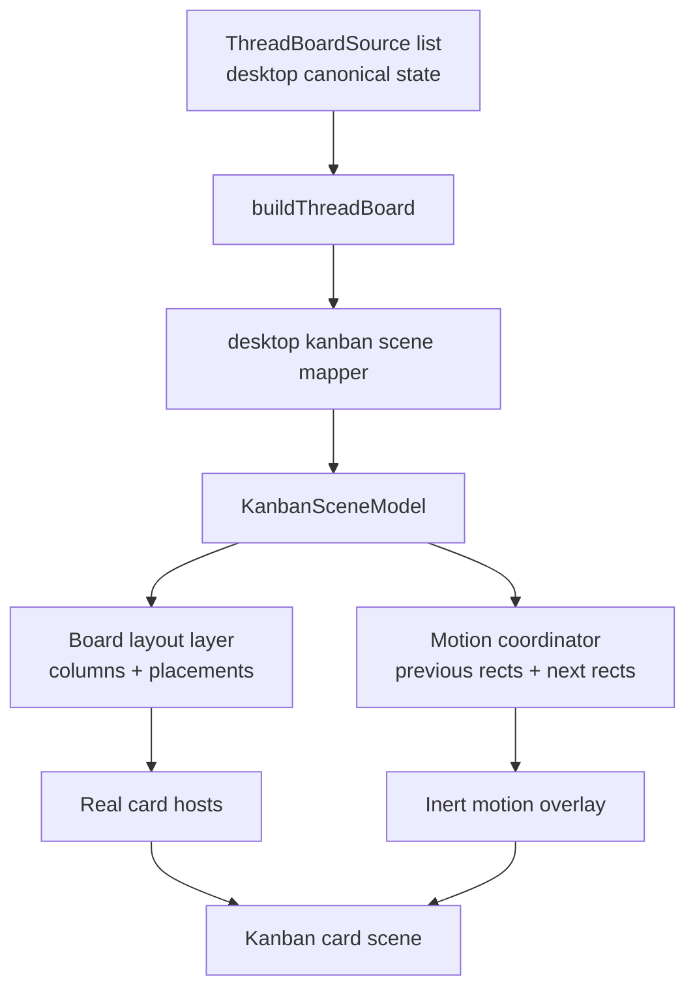
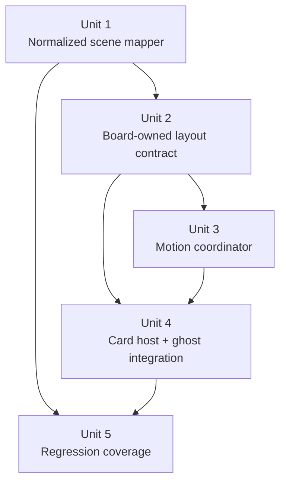

# Kanban Board-Level Motion Architecture

## Overview

Refactor the kanban board so cross-column card motion is a first-class board capability instead of an accidental side effect of per-column keyed lists. The clean version keeps panel-backed thread state and status classification exactly where they already belong, but replaces grouped-list rendering with a normalized scene model plus a board-owned motion layer that can animate cards smoothly between columns.

## Problem Frame

The current kanban architecture is clean for static rendering but not for motion. `buildThreadBoard(...)` classifies canonical thread state into status groups, and the UI renders each column as its own keyed list. When a session changes status, Svelte sees a removal from one list and an insertion into another, so the card teleports. Adding CSS transitions or per-column `animate:flip` would treat the symptom, not the shape of the problem.

The user request is specifically about smooth “fly to the new column” motion. The architectural goal is broader: motion should be owned at the board layer, while columns remain presentational and thread state remains canonical in desktop stores. This must preserve the existing panel-backed thread model from the kanban requirements and the `kanban-live-session-panel-sync` solution doc, rather than reintroducing a second runtime truth in the name of animation.

This plan intentionally keeps the broader refactor scope rather than collapsing to a smaller motion patch. That choice is justified only because the current kanban surface already mixes grouped column rendering, optimistic pre-session cards, footer/menu assembly, and public `@acepe/ui` scene types in the same seam. A narrower change would still need to answer cross-column geometry, optimistic-card behavior, and shared-scene API drift, which would likely reappear as ad hoc exceptions instead of one coherent board contract.

## Requirements Trace

- R1. Preserve the existing panel-backed thread model from the kanban requirements: status derivation, pending input, dialog opening, and inline actions must continue to read canonical desktop state rather than a kanban-only runtime.
- R2. Keep the board layout and column order semantics from the origin requirements: stable visible columns, empty-column support, horizontal overflow, and column-local vertical scroll.
- R3. Cards that change status must animate as a board-level move between their old and new column placements instead of visually teleporting.
- R4. Motion architecture must not duplicate card business logic or create a separate “fake card” rendering path that can drift from the real card UI.
- R5. Motion must be optional/respect reduced-motion expectations and must not interfere with click, menu, footer, dialog, or inline permission/question behavior.
- R6. The UI package should own presentational scene and motion concerns; desktop should own canonical state mapping and session/thread orchestration.
- R7. Tests should prove board-model and motion behavior without depending on brittle string-matching for specific Svelte markup layout.

### Origin Requirement Coverage

| Plan requirement | Origin requirements covered | Notes |
|---|---|---|
| R1 | R1-R5, R31-R40 | Preserves the panel-backed thread model, shared-thread truth, and dialog/inline interaction behavior |
| R2 | R10-R14 | Preserves stable board layout, empty columns, horizontal overflow, and column scroll behavior |
| R3 | New motion requirement layered onto R10-R14, R31-R34 | Adds the requested cross-column travel behavior without changing status ownership |
| R4 | R39-R40 | Keeps one real card surface and avoids kanban-only business logic drift |
| R5 | R29-R34 plus accessibility expectations implied by the shared thread surface | Protects inline controls and safe motion behavior during live interaction |
| R6 | R39-R41 | Keeps desktop wiring in `packages/desktop` and scene/motion rendering in `@acepe/ui` |
| R7 | Supports all preserved origin requirements by making the refactor reviewable and regression-safe | Test scope is implementation-facing, not a new product requirement |

## Scope Boundaries

- No drag-and-drop or user-authored status assignment.
- No change to thread status classification semantics beyond what is needed to expose stable placement metadata for motion.
- No change to the full-thread dialog, panel lifecycle, or attention queue product behavior.
- No kanban-only thread store, cache, or status registry.
- No attempt to standardize animation architecture outside kanban in this change.

### Deferred to Separate Tasks

- Website/demo-specific motion polish beyond keeping the shared `@acepe/ui` board renderable: follow-up if the marketing demo needs motion-specific tuning.
- Any broader animation system standardization across non-kanban surfaces: separate architecture task.

## Context & Research

### Relevant Code and Patterns

- `packages/desktop/src/lib/acp/store/thread-board/build-thread-board.ts` currently produces grouped status buckets and should remain the canonical status classifier.
- `packages/desktop/src/lib/acp/store/thread-board/thread-board-item.ts` already defines the canonical thread item shape; this is the right place to extend stable placement metadata if needed.
- `packages/ui/src/components/kanban/kanban-board.svelte` and `kanban-column.svelte` currently render per-column keyed lists; this is the rendering shape that causes teleportation.
- `packages/ui/src/components/kanban/kanban-scene-board.svelte` already acts as a scene-layer adapter; it is the natural place to shift from grouped rendering to a normalized board scene contract.
- `packages/desktop/src/lib/acp/components/agent-panel/scene/desktop-agent-panel-scene.ts` is the local pattern to emulate: desktop maps rich app state into a UI-scene model, and `@acepe/ui` renders that model without owning application truth.
- `packages/desktop/src/lib/components/main-app-view/components/content/kanban-view.svelte` currently mixes grouped board derivation, optimistic pre-session cards, footer/menu assembly, and scene-card mapping in one place; the refactor should split those seams without dropping optimistic or footer-driven behavior.
- `packages/website/src/lib/components/landing-kanban-demo.svelte` consumes `KanbanSceneBoard` and exported kanban scene types from `@acepe/ui`, so any public scene contract change needs a same-change migration or compatibility layer.

### Institutional Learnings

- `docs/solutions/logic-errors/kanban-live-session-panel-sync-2026-04-02.md` documents the key invariant: kanban must project from real panel-backed thread state, not a second runtime model. Motion must remain a presentation concern layered on top of that truth.

### External References

- Svelte animate docs: `animate:` only handles reordering inside one keyed each block, not cross-list moves.
- Svelte transition docs: crossfade/custom transitions are the right primitive when coordinating movement across removal/insertion boundaries.

## Key Technical Decisions

| Decision | Choice | Rationale |
|---|---|---|
| Board model shape | Introduce a normalized kanban scene model with separate `columns`, `cards`, and `placements` | Lets the board own lifecycle and motion while keeping card data canonical and deduplicated |
| Mapping boundary | Build the normalized scene in desktop from a richer kanban view input, not `ThreadBoardItem` alone | Keeps application/state knowledge out of `@acepe/ui` while preserving optimistic cards, footer state, and menu behavior |
| Motion ownership | Add a board-level motion coordinator in `@acepe/ui` that tracks rects and animates moves | Cross-column moves are a board concern, not a column concern |
| Placement identity | The normalized scene must emit stable placement records with `cardId`, `columnId`, `index`, and a deterministic `orderKey` derived from the current board ordering rules | Motion diffing needs an explicit identity contract so reorder noise does not masquerade as a true move |
| Reduced-motion policy | In reduced-motion mode, skip spatial fly animations and update placement immediately, with at most a minimal opacity settle on the destination card | Makes accessibility behavior reviewable and prevents implementation drift on the main motion safeguard |
| Motion visibility policy | Run full travel animation only when both source and destination rects are meaningfully visible inside the board viewport; otherwise fall back to immediate placement or a clipped settle | Prevents confusing offscreen or cross-scroll travel paths on a horizontally scrollable, vertically scrolled board |
| Motion timing policy | Use a restrained timing window and retargeting rules: short duration, one active overlay per card, cancel/re-target on repeated status changes | Keeps the board readable under rapid status churn instead of stacking flashy motion |
| Overlay coordinate root | Measure and animate in board-container coordinates, not raw viewport coordinates; board or column scrolling during a move cancels the in-flight overlay and recomputes/snap-settles from fresh geometry | Keeps the ghost attached to the real board instead of drifting when the user scrolls during live churn |
| Card rendering reuse | Render real cards from one snippet/component and use motion clones/overlays only as inert visual shells | Prevents business logic drift between “real” and “animated” cards |
| Accessibility policy | Respect reduced motion and keep ghost layers non-interactive/`aria-hidden` | Preserves usability and avoids duplicate focus/interaction surfaces |
| Test posture | Prefer pure model tests plus focused motion-behavior tests over source-string structure assertions | Supports refactorability and validates the actual contract |

## Open Questions

### Resolved During Planning

- Should motion state live in desktop or UI? UI. Desktop should emit a stable scene model; `@acepe/ui` should interpret that model and animate presentation changes.
- Should columns keep owning card lifecycle? No. Columns should expose slots/anchors and board-owned layout metadata, but board-level code should own cross-column card movement.
- Should the implementation rely on plain `animate:flip`? No. Svelte’s animation primitive is insufficient for destroy/create across separate keyed lists.

### Deferred to Implementation

- Whether the ghost overlay is best implemented as a dedicated Svelte component or a small motion store plus inline layer: defer to implementation once test seams are clearer.

## High-Level Technical Design

> *This illustrates the intended approach and is directional guidance for review, not implementation specification. The implementing agent should treat it as context, not code to reproduce.*

On each scene update, the board keeps a registry of rendered card anchors by card id. When a card’s placement changes, the board captures the previous rect, waits for the new layout, measures the destination rect, and animates an inert overlay from old to new while the destination card settles into place. The scene model remains canonical; motion is derived from the delta between successive scene snapshots.

The motion layer follows explicit UX guardrails:
- Placement diffing uses explicit placement records emitted by the scene (`cardId`, `columnId`, `index`, `orderKey`) so motion only runs for real placement changes.
- Reduced-motion mode disables spatial travel and uses immediate placement with at most a minimal opacity settle.
- Full travel motion runs only when both source and destination are meaningfully visible inside the board viewport; offscreen or heavily clipped moves snap or use a clipped settle instead.
- Motion remains restrained: short duration, one active overlay per card, and re-target/cancel semantics when a card changes status again before the prior move completes.
- Overlay geometry is rooted to the board container; if the board or a column scrolls while a move is in flight, the overlay is cancelled and recomputed or snap-settled from fresh geometry rather than drifting against stale viewport rects.

## Implementation Units

- [ ] **Unit 1: Normalize the kanban scene contract**

**Goal:** Replace grouped-list rendering as the primary UI contract with a normalized scene model that separates card data from placement data.

**Requirements:** R1, R4, R6, R7

**Dependencies:** None

**Files:**
- Create: `packages/desktop/src/lib/components/main-app-view/components/content/desktop-kanban-scene.ts`
- Create: `packages/desktop/src/lib/components/main-app-view/components/content/desktop-kanban-scene.test.ts`
- Modify: `packages/ui/src/components/kanban/kanban-scene-types.ts`
- Modify: `packages/ui/src/components/kanban/index.ts`
- Modify: `packages/desktop/src/lib/components/main-app-view/components/content/kanban-view.svelte`
- Modify: `packages/website/src/lib/components/landing-kanban-demo.svelte`

**Approach:**
- Introduce a UI-scene type that exposes:
  - `columns`: stable column metadata
  - `cards`: card data keyed by id
  - `placements`: stable placement records with `cardId`, `columnId`, `index`, and deterministic `orderKey`
- Build that scene in desktop from a richer kanban input model that combines canonical `ThreadBoardItem` status data with the additional desktop-only state already assembled in `kanban-view.svelte` for:
  - optimistic pre-session/worktree cards in the working column
  - footer state (question, permission, plan approval)
  - menu/close affordances and dialog routing
- Preserve all existing scene-card affordances (`footer`, `menuActions`, `showCloseAction`, `hideBody`, `flushFooter`) while moving grouping concerns out of the rendering layer.
- Decide explicitly whether optimistic cards participate in the normalized placement/motion model or remain a non-animated exception path, and document that rule in the mapper contract.

**Execution note:** Characterization-first. Lock the current semantic scene output before changing markup-heavy rendering.

**Patterns to follow:**
- `packages/desktop/src/lib/acp/components/agent-panel/scene/desktop-agent-panel-scene.ts`
- `packages/desktop/src/lib/acp/store/thread-board/build-thread-board.ts`

**Test scenarios:**
- Happy path — the mapper emits the same card content and per-column ordering as the current grouped board for a representative set of thread statuses.
- Happy path — the mapper preserves optimistic pre-session cards ahead of session-backed cards in the working column with stable ids and placement metadata.
- Edge case — unchanged `orderKey` / placement identity does not produce false move work when unrelated scene fields update.
- Edge case — empty columns still exist in the scene even when they have no placements.
- Integration — pending question/permission and close/menu affordances survive the mapper extraction unchanged.
- Integration — the website demo either migrates to the new scene contract or continues working through an explicit compatibility layer.

**Verification:**
- Desktop can render the same kanban content using a normalized scene model without adding a second runtime truth.
- Website/demo consumers still render against the exported `@acepe/ui` kanban API after the scene-contract refactor.

- [ ] **Unit 2: Make the board own layout and column lifecycle**

**Goal:** Refactor `@acepe/ui` kanban rendering so columns become presentational shells/anchors and the board becomes the owner of card layout lifecycle.

**Requirements:** R2, R3, R4, R6

**Dependencies:** Unit 1

**Files:**
- Modify: `packages/ui/src/components/kanban/kanban-board.svelte`
- Modify: `packages/ui/src/components/kanban/kanban-column.svelte`
- Modify: `packages/ui/src/components/kanban/kanban-scene-board.svelte`
- Create: `packages/ui/src/components/kanban/kanban-board-card-host.svelte`
- Create: `packages/ui/src/components/kanban/kanban-board-layout.ts`

**Approach:**
- Convert columns into stable visual shells that expose a content container/anchor for a given column id.
- Render cards through a board-level placement pass rather than nested per-column keyed `each` blocks that own mount/unmount semantics.
- Keep `KanbanSceneBoard` as the adapter that turns scene cards into `KanbanCard` snippets, but move placement/render orchestration below it.

**Technical design:** *(optional -- pseudo-code or diagram when the unit's approach is non-obvious. Directional guidance, not implementation specification.)*
- Column shell: header + scroll container + anchor registry
- Card host: receives `cardId`, placement, renderer, and motion-state flags
- Layout helper: derives per-column ordered placement lists without making columns the source of card lifecycle truth

**Patterns to follow:**
- Existing scene/view split in `kanban-scene-board.svelte`
- Dumb-presentational component rule for `packages/ui`

**Test scenarios:**
- Happy path — board renders each card once in its destination placement and preserves empty-column hints/counts.
- Edge case — narrow-width overflow and column scroll containers still behave as before.
- Integration — clicking a card and interacting with inline footers still route through the same callbacks.

**Verification:**
- `@acepe/ui` board rendering no longer depends on per-column keyed lists for card lifecycle.

- [ ] **Unit 3: Add a board-level motion coordinator**

**Goal:** Introduce a reusable motion layer that animates cross-column moves by comparing successive placements and DOM rects.

**Requirements:** R3, R5, R6, R7

**Dependencies:** Unit 2

**Files:**
- Create: `packages/ui/src/components/kanban/kanban-board-motion.ts`
- Create: `packages/ui/src/components/kanban/kanban-board-motion-overlay.svelte`
- Create: `packages/ui/src/components/kanban/__tests__/kanban-board-motion.test.ts`
- Modify: `packages/ui/src/components/kanban/kanban-board.svelte`

**Approach:**
- Track previous and current placement snapshots keyed by card id.
- Maintain a DOM anchor registry for rendered card hosts and column containers, all measured in board-container coordinates.
- On placement change:
  - capture the prior rect
  - wait for the next frame/layout
  - measure the destination rect
  - animate an inert overlay from origin to destination
- In reduced-motion mode, skip spatial travel and update placement immediately, allowing only a minimal destination opacity settle if needed for continuity.
- Only run full travel motion when both origin and destination are meaningfully visible inside the board viewport; otherwise snap or use a clipped settle inside the board bounds.
- Constrain motion to a short duration/easing family, allow at most one active overlay per card, and cancel/re-target when repeated status changes occur mid-flight.
- Cancel and recompute or snap-settle in-flight overlays when board-level or column-level scrolling invalidates the current geometry.

**Execution note:** Keep the motion planner as pure as possible so most of the logic is unit-testable without brittle DOM orchestration.

**Patterns to follow:**
- Existing `requestAnimationFrame` usage patterns in `packages/ui`
- `getBoundingClientRect()`-based overlay positioning patterns in other UI components
- Existing `packages/ui` convention of colocated helpers as `.ts` files and component tests under `__tests__/`

**Test scenarios:**
- Happy path — moving a card from `working` to `needs_review` produces one move animation with the correct origin/destination ids.
- Edge case — reordered cards within the same column do not create a cross-column ghost unless the placement semantics actually changed.
- Edge case — reduced-motion mode skips spatial movement and uses immediate placement with at most a minimal opacity settle.
- Edge case — when source or destination is offscreen or clipped by board scrolling, the board falls back to snap/clipped-settle behavior instead of flying across unrelated content.
- Edge case — repeated status changes cancel or retarget the prior overlay instead of stacking multiple flights for the same card.
- Edge case — scrolling the board or a column during a move cancels/recomputes the overlay from fresh board-container geometry.
- Error path — a missing rect/anchor falls back to immediate placement without leaving stale overlay state behind.

**Verification:**
- Cross-column moves can be animated from old rect to new rect without introducing UI-owned thread state.
- Reduced-motion and offscreen/rapid-churn fallback behavior are explicit, testable parts of the motion contract.

- [ ] **Unit 4: Integrate motion with the real card surface**

**Goal:** Ensure the board animates real card content cleanly without duplicating business logic or creating double-interactive UI.

**Requirements:** R4, R5, R6

**Dependencies:** Units 2, 3

**Files:**
- Modify: `packages/ui/src/components/kanban/kanban-card.svelte`
- Modify: `packages/ui/src/components/kanban/kanban-scene-board.svelte`
- Modify: `packages/ui/src/components/kanban/kanban-board-card-host.svelte`

**Approach:**
- Reuse the same card snippet/component for both normal placement rendering and inert motion shells.
- Add an explicit non-interactive/ghost presentation mode rather than branching card business logic into separate components.
- Ensure only the destination/live card owns focus, events, menus, and inline footer controls; overlays must be `aria-hidden` and non-hit-testable.
- Preserve focus continuity: passive moves must never steal focus, and if the focused card/control moves, the implementation should keep focus on the destination live surface's equivalent interactive element when possible, otherwise keep focus stable and announce the state change rather than dropping focus unexpectedly.

**Patterns to follow:**
- Existing `KanbanCard` prop-based presentation
- `@acepe/ui` scene components that separate render props from app wiring

**Test scenarios:**
- Happy path — real card callbacks still fire after a move.
- Edge case — overlay cards are non-clickable and excluded from accessibility interaction.
- Edge case — a keyboard-focused control inside a moving card keeps or cleanly restores focus on the destination live card without focus theft.
- Integration — permission/question footers and menu affordances remain available exactly once per card.

**Verification:**
- Motion reuses the canonical card render path without double-binding UI behavior.

- [ ] **Unit 5: Replace brittle structure assertions with behavior-focused regression coverage**

**Goal:** Update kanban tests so they validate scene contracts and motion behavior rather than exact source text layout.

**Requirements:** R1, R2, R5, R7

**Dependencies:** Units 1, 3, 4

**Files:**
- Modify: `packages/desktop/src/lib/acp/store/thread-board/__tests__/build-thread-board.test.ts`
- Create: `packages/desktop/src/lib/components/main-app-view/components/content/kanban-view.test.ts`
- Create: `packages/ui/src/components/kanban/__tests__/kanban-scene-board.test.ts`

**Approach:**
- Keep or add pure mapper tests in desktop for normalized scene output.
- Add or replace desktop kanban view tests at the real checked-in path instead of referencing a non-existent `kanban-view.svelte.vitest.ts`.
- Add focused UI tests in `@acepe/ui` for:
  - stable columns and placements
  - move-animation planning
  - ghost/non-ghost interaction boundaries
  - reduced-motion fallback behavior
  - offscreen/clipped motion fallback behavior
  - focus continuity across passive card moves
- Remove assertions that are only verifying literal source strings that this refactor must legitimately change.

**Execution note:** Preserve any tests that still encode real product invariants; only replace tests whose sole value is structural freeze-drying.

**Patterns to follow:**
- Existing thread-board classification tests
- Any current scene-model tests in `packages/desktop/src/lib/acp/components/agent-panel/scene`

**Test scenarios:**
- Happy path — a status transition changes placement and triggers a move plan.
- Edge case — unchanged placement does not create motion work.
- Edge case — reduced-motion mode and offscreen moves produce the documented non-flight fallback behavior.
- Integration — a focused inline control remains stable when its parent card changes status.
- Integration — opening a moved card still opens the full thread dialog with the same panel id.

**Verification:**
- The refactor is protected by tests that describe behavior and contracts instead of incidental markup.

## System-Wide Impact

- **Interaction graph:** `buildThreadBoard(...)` still classifies canonical thread state; a new desktop kanban-scene mapper converts that into a normalized scene; `KanbanSceneBoard` passes card renderers into a board-owned layout/motion layer; `KanbanCard` remains the presentational card shell.
- **Error propagation:** Motion-layer failures should degrade to immediate placement rather than breaking board rendering or swallowing desktop/session errors.
- **State lifecycle risks:** Rect snapshots and overlay state must be cleaned up after every move to avoid stale ghosts during rapid status churn.
- **API surface parity:** Any public kanban scene types exported from `@acepe/ui` will change; desktop and any website demo consumers must move to the normalized scene contract.
- **Integration coverage:** Cross-column moves, reduced motion, inline footer interactivity, and dialog opening need explicit coverage because unit tests on the mapper alone will not prove them.
- **Unchanged invariants:** Thread status classification, panel-backed thread truth, inline question/permission handling, and dialog-open behavior remain unchanged by this plan.

## Risks & Dependencies

| Risk | Mitigation |
|------|------------|
| Normalizing the scene accidentally creates a second thread truth | Keep status/source derivation in desktop from `ThreadBoardItem` and make UI scene types presentation-only |
| Motion overlays duplicate interactions or focusable content | Add explicit ghost/inert rendering mode and UI tests for `aria-hidden` + pointer-event suppression |
| DOM measurement causes jank during rapid board churn | Scope measurements to affected cards, prefer CSS/web-animation transitions, and clean up overlays aggressively |
| Motion becomes distracting under rapid churn or scrolling | Constrain duration, retarget instead of stacking, and fall back when moves are offscreen or clipped |
| Focus is lost during passive status changes | Add an explicit focus continuity contract and interaction coverage for moving cards |
| Existing kanban tests block refactor due to markup string assertions | Replace brittle tests with mapper and behavior-focused UI coverage as part of the same change |
| Reduced-motion expectations are missed | Make motion policy explicit in the board coordinator and cover it in tests |

## Documentation / Operational Notes

- Update any future kanban architecture notes to describe the normalized scene/motion split so later contributors do not reintroduce per-column lifecycle ownership.
- If implementation adds exported UI types/files, keep `packages/ui/src/components/kanban/index.ts` as the single public barrel.

## Alternative Approaches Considered

- **Per-column `animate:flip` only:** Rejected because Svelte animations do not cover destroy/create across separate keyed lists.
- **Desktop-owned motion orchestration inside `kanban-view.svelte`:** Rejected because it would mix app-state wiring with presentational motion concerns and make `@acepe/ui` less reusable.
- **CSS-only enter/exit transitions on `KanbanCard`:** Rejected because the card still lacks origin/destination geometry, so the move would read as fade-out/fade-in rather than true spatial travel.

## Success Metrics

- Cards moving between statuses visibly travel from their prior column position to their new one instead of teleporting.
- Users can track status changes without losing context about which card moved where, even when the board updates live.
- Kanban continues to open the same full thread dialog and inline controls with no regression in state fidelity.
- Motion stays restrained enough that a busy board remains scannable rather than distracting, with reduced-motion and offscreen fallbacks behaving predictably.
- Tests validate placement and motion behavior without pinning exact source code layout.

## Sources & References

- **Origin document:** [docs/brainstorms/2026-03-31-kanban-view-requirements.md](../brainstorms/2026-03-31-kanban-view-requirements.md)
- **Institutional learning:** [docs/solutions/logic-errors/kanban-live-session-panel-sync-2026-04-02.md](../solutions/logic-errors/kanban-live-session-panel-sync-2026-04-02.md)
- Related code: `packages/desktop/src/lib/acp/store/thread-board/build-thread-board.ts`
- Related code: `packages/ui/src/components/kanban/kanban-board.svelte`
- Related code: `packages/ui/src/components/kanban/kanban-scene-board.svelte`
- External docs: <https://svelte.dev/docs/svelte/animate>
- External docs: <https://svelte.dev/docs/svelte/transition>
