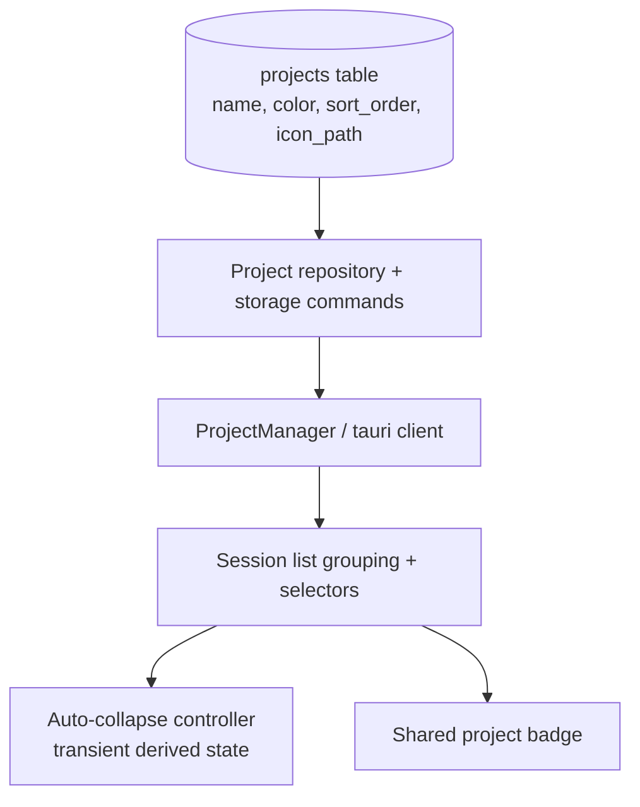

# feat: Improve sidebar project management

## Overview

Improve the left-side project list so it scales cleanly as users add more projects. The change adds automatic collapse when the sidebar cannot show expanded project chrome responsibly, drag-to-reorder for project groups, preserved project name casing, and configurable per-project icons with a shared fallback badge.

## Problem Frame

The current sidebar keeps every project group expanded until the user manually collapses it. When there are enough projects, the equal-height layout squeezes the branch/footer area into an unusable state instead of collapsing lower-priority groups. The project list also has two identity issues: project names are normalized into title case instead of preserving the repository’s actual casing, and the app-wide project badge uses only the first letter, which stops being useful once several projects share an initial.

The requested behavior is:

- automatically collapse project containers when there is not enough height to show branch content
- recalculate that behavior on window resize and when the project list grows
- allow users to drag projects into a custom order
- preserve project name casing instead of converting names to title case
- let users assign project icons, similar to Superset-style project identities

## Requirements Trace

- R1. Expanded project groups must automatically collapse when the available sidebar height cannot show their branch/footer content without truncation.
- R2. The auto-collapse behavior must react to viewport changes and project list changes, including newly added projects.
- R3. Users must be able to drag projects into a custom order, and that order must persist across reloads.
- R4. Project names must preserve their real casing instead of being rewritten to title case.
- R5. Users must be able to assign a custom project icon, clear it, and see it rendered anywhere the app currently shows the project letter badge.
- R6. Existing behavior that depends on project collapse persistence, project color, session grouping, and fallback badges must continue to work.

## Scope Boundaries

- No cloud sync or cross-machine upload for project icons; icons remain local filesystem selections.
- Persist the user-selected local icon file path only; copying icons into app-managed storage is out of scope for this work.
- No project renaming workflow beyond restoring the correct name casing from the existing project path.
- No changes to session ordering inside a project; drag reorder applies to projects, not sessions.
- No new sidebar virtualization work in this scope.

## Context & Research

### Relevant Code and Patterns

- `packages/desktop/src/lib/acp/components/session-list/session-list-ui.svelte` already owns manual collapse state, equal-height expanded layout, git footer rendering, and project header interactions.
- `packages/desktop/src/lib/acp/components/session-list/session-list-logic.ts` seeds and sorts project groups from `recentProjects`, so persisted project ordering should flow through the existing grouping layer instead of adding sidebar-only order state.
- `packages/desktop/src/lib/acp/logic/project-manager.svelte.ts`, `packages/desktop/src/lib/acp/logic/project-client.ts`, `packages/desktop/src/lib/utils/tauri-client/projects.ts`, and `packages/desktop/src-tauri/src/storage/commands/projects.rs` form the existing project metadata pipeline.
- `packages/desktop/src-tauri/src/db/repository.rs`, `packages/desktop/src-tauri/src/db/entities/project.rs`, and `packages/desktop/src-tauri/src/db/migrations/m20250101_000005_create_projects.rs` show that project metadata already lives in the `projects` table and is the right place for persistent ordering and icon state.
- `packages/ui/src/components/project-letter-badge/project-letter-badge.svelte` is the shared badge surface already reused by project header, selector, tab, queue, git panel, and terminal header components.
- `packages/desktop/src/lib/acp/components/artefact/image-artefact-preview.svelte` shows the existing desktop pattern for rendering local image paths via `convertFileSrc`.
- `packages/desktop/src/lib/acp/components/project-header-overflow-menu.svelte` and `packages/desktop/src/lib/acp/components/project-settings-menu.svelte` already expose per-project settings entry points and are the right extension points for icon management.
- `packages/desktop/src/lib/components/main-app-view/logic/main-app-view-state.svelte.ts` and `packages/desktop/src/lib/acp/store/workspace-store.svelte.ts` already persist manual collapsed project paths per workspace.

### Institutional Learnings

- No directly relevant `docs/solutions/` entry exists for project metadata or sidebar auto-collapse, so the plan should stay anchored to existing repo patterns instead of importing generic UI abstractions.

### External References

- None. The repo already has clear local patterns for persistence, image rendering, and shared badge reuse.

## Key Technical Decisions

- **Persist project ordering and icon choice in the `projects` table**: ordering and icon identity are project metadata, not workspace view state. This keeps selectors, tab badges, and the left sidebar in sync instead of splitting state across stores.
- **Keep auto-collapse transient and separate from manual collapse persistence**: manual collapse remains user-owned workspace state, while auto-collapse is derived from current height constraints. Temporary auto-collapses must not overwrite the persisted `collapsedProjectPaths`.
- **Define auto-collapse from measured expanded chrome, not equal-share math**: the minimum expanded height is the measured header, a minimum content viewport, and the current footer chrome for that project's active mode. The same rule should drive layout policy, tests, and verification.
- **Auto-collapse must follow a stable priority order**: protect the currently active/interacted-with project first, then keep remaining expanded projects in persisted sort order, collapsing from the bottom and re-expanding in that same order as space returns.
- **Use native drag-and-drop with a keyboard fallback for project reordering**: the repo has no existing sortable dependency, and this interaction is bounded to one vertical list. Native drag handling avoids adding a new library, while keyboard move up/down actions keep the reorder feature accessible.
- **Preserve exact project names from the path basename**: project names should be stored and displayed verbatim. Existing normalized names should be repaired from the stored path basename so current users see the fix immediately.
- **Evolve the shared project badge instead of creating sidebar-only icon logic**: custom icons need to appear anywhere `ProjectLetterBadge` currently appears, so the shared UI component should accept icon metadata and keep the letter badge as its fallback.

## Open Questions

### Resolved During Planning

- **Should auto-collapse state be persisted?** No. Persisting it would turn a temporary height constraint into sticky user state.
- **Where should drag order live?** In project metadata (`projects.sort_order`), because selectors and sidebar groups derive from the same project list.
- **How should icons be sourced?** From a local image file path selected through a native file picker, rendered via `convertFileSrc`, with a clear action that returns the badge to the letter fallback.
- **What baseline should existing project order preserve on rollout?** The first `sort_order` backfill should mirror the current sidebar order (`created_at` descending), so the migration does not reshuffle existing projects.
- **How should existing normalized names be corrected?** Backfill `projects.name` from the path basename during migration so existing imports regain their real casing without requiring re-import.

### Deferred to Implementation

- **Exact drag affordance styling**: whether the whole header is draggable or a dedicated grip is clearer should be finalized while implementing the interaction in the existing header layout.

## High-Level Technical Design

> *This illustrates the intended approach and is directional guidance for review, not implementation specification. The implementing agent should treat it as context, not code to reproduce.*

## Implementation Units

- [ ] **Unit 1: Extend persisted project metadata**

**Goal:** Add the persistent fields and commands needed to support project ordering, custom icons, and exact-case names.

**Requirements:** R3, R4, R5, R6

**Dependencies:** None

**Files:**
- Create: `packages/desktop/src-tauri/src/db/migrations/m20260413_000001_add_project_order_and_icon_fields.rs`
- Modify: `packages/desktop/src-tauri/src/db/migrations/mod.rs`
- Modify: `packages/desktop/src-tauri/src/db/entities/project.rs`
- Modify: `packages/desktop/src-tauri/src/db/repository.rs`
- Modify: `packages/desktop/src-tauri/src/storage/commands/projects.rs`
- Modify: `packages/desktop/src-tauri/src/lib.rs`
- Modify: `packages/desktop/src/lib/utils/tauri-client/types.ts`
- Modify: `packages/desktop/src/lib/utils/tauri-client/commands.ts`
- Modify: `packages/desktop/src/lib/utils/tauri-client/projects.ts`
- Modify: `packages/desktop/src/lib/acp/logic/project-client.ts`
- Modify: `packages/desktop/src/lib/acp/logic/project-manager.svelte.ts`
- Test: `packages/desktop/src-tauri/src/storage/commands/projects.rs`

**Approach:**
- Add `sort_order` and nullable `icon_path` to the `projects` table.
- Backfill `sort_order` from the current sidebar order (`created_at` descending) and backfill `name` from the path basename to repair existing title-cased imports.
- Extend project DTOs and repository methods so reads and writes carry the new metadata.
- Add backend commands for updating icon metadata and project ordering in a single persisted transaction.

**Patterns to follow:**
- `packages/desktop/src-tauri/src/storage/commands/projects.rs`
- `packages/desktop/src/lib/acp/logic/project-client.ts`

**Test scenarios:**
- Happy path — migrating an existing projects table assigns stable `sort_order` values that preserve the pre-existing sidebar order (`created_at` descending) and leaves color data intact.
- Happy path — updating project order for three projects persists the submitted order and `get_projects` returns them in that order.
- Happy path — setting `icon_path` for a project persists the new value and clearing it returns `null`.
- Edge case — importing an already-known project updates metadata without duplicating the row.
- Edge case — a legacy project whose stored name is title-cased is backfilled to the raw basename from `path`.
- Error path — updating order with an unknown project path fails instead of silently dropping the request.

**Verification:**
- Project reads expose exact-case names plus optional icon and order metadata, and repeated app loads preserve the same ordering and icon configuration.

- [ ] **Unit 2: Add automatic collapse policy to the sidebar project list**

**Goal:** Make the session-list project groups automatically collapse under height pressure without fighting manual collapse state.

**Requirements:** R1, R2, R6

**Dependencies:** Unit 1

**Files:**
- Create: `packages/desktop/src/lib/acp/components/session-list/project-layout-policy.ts`
- Modify: `packages/desktop/src/lib/acp/components/session-list/session-list-logic.ts`
- Modify: `packages/desktop/src/lib/acp/components/session-list/session-list-ui.svelte`
- Modify: `packages/desktop/src/lib/acp/components/session-list/session-list.svelte`
- Modify: `packages/desktop/src/lib/components/main-app-view/logic/main-app-view-state.svelte.ts`
- Test: `packages/desktop/src/lib/acp/components/session-list/project-layout-policy.test.ts`
- Test: `packages/desktop/src/lib/acp/store/__tests__/workspace-sidebar-state-persistence.test.ts`

**Approach:**
- Extract a pure layout policy that computes which projects stay expanded after combining manual collapse with current height constraints.
- Define the minimum expanded height from measured header chrome, a minimum content viewport, and the current footer chrome for the active view mode, then use that same calculation in both runtime policy and tests.
- Measure the sidebar list container and recompute transient auto-collapsed paths on resize, project-list changes, and view-mode changes that alter expanded height needs.
- Collapse in a deterministic order: keep the active/interacted-with project open first, then preserve remaining expanded projects in persisted sort order, trimming from the bottom as space runs out and restoring in the same order when space returns.
- Keep the existing workspace persistence contract for manual collapse only; auto-collapsed state is derived and never written into `collapsedProjectPaths`.

**Execution note:** Start with a failing policy test that proves the current equal-share layout leaves too many projects expanded when the minimum expanded chrome cannot fit.

**Patterns to follow:**
- `packages/desktop/src/lib/acp/components/session-list/session-list-ui.svelte`
- `packages/desktop/src/lib/components/main-app-view/logic/main-app-view-state.svelte.ts`

**Test scenarios:**
- Happy path — when the container can fit all expanded project groups at the minimum expanded height, no auto-collapse is applied.
- Happy path — when the container cannot fit all expanded groups, lower-priority groups collapse until the remaining expanded groups have enough height to show header, content area, and git footer.
- Happy path — resizing the window taller re-expands auto-collapsed groups when space becomes available and preserves manual collapses.
- Edge case — adding a new project while the sidebar is already full auto-collapses an existing group instead of crushing all groups equally.
- Edge case — switching a project between sessions and files view recalculates height needs without corrupting manual collapse state.
- Integration — restoring workspace state with an empty `collapsedProjectPaths` array still restores no manual collapses while auto-collapse remains computed from current height.

**Verification:**
- The sidebar never renders expanded project groups below the minimum usable expanded height, and automatic expansion/collapse remains stable during resize and project-list changes.

- [ ] **Unit 3: Add persisted reorder behavior across project consumers**

**Goal:** Let users reorder projects reliably across the sidebar and every project-ordered consumer.

**Requirements:** R3, R6

**Dependencies:** Unit 1, Unit 2

**Files:**
- Modify: `packages/desktop/src/lib/acp/components/session-list/session-list-logic.ts`
- Modify: `packages/desktop/src/lib/acp/components/session-list/session-list-ui.svelte`
- Modify: `packages/desktop/src/lib/acp/components/project-selection-panel.svelte`
- Modify: `packages/desktop/src/lib/acp/store/tab-bar-utils.ts`
- Modify: `packages/desktop/src/lib/acp/store/tab-bar-store.svelte.ts`
- Modify: `packages/desktop/src/lib/components/main-app-view.svelte`
- Test: `packages/desktop/src/lib/acp/components/session-list/project-layout-policy.test.ts`
- Test: `packages/desktop/src/lib/acp/store/tab-bar-utils.test.ts`

**Approach:**
- Add native drag events to the project list header shell so sidebar order updates immediately and persists through `ProjectManager`.
- Provide a keyboard-accessible fallback to move the focused project up or down, with focus retention and screen-reader status feedback.
- Replace project-created-at ordering in session groups and tab grouping with persisted `sort_order` so the sidebar, project chooser, and tab bar stay aligned after reorder.
- Revert optimistic reorder state if persistence fails, using existing explicit error surfacing patterns.

**Execution note:** Implement reorder test-first with one failing case for persisted sidebar reorder and one for tab-group order parity.

**Patterns to follow:**
- `packages/desktop/src/lib/acp/store/tab-bar-utils.ts`
- `packages/desktop/src/lib/components/main-app-view.svelte`

**Test scenarios:**
- Happy path — dragging project A below project B updates render order immediately and persists the new order.
- Happy path — keyboard move-up and move-down actions reorder the focused project and preserve focus on the moved project.
- Happy path — tab groups and the project-selection panel reflect the same persisted order after a reorder.
- Edge case — reordering while the active project is auto-protected does not clear that protection or corrupt collapse state.
- Error path — if reorder persistence fails, the UI returns to the previous order and surfaces the failure via existing error handling instead of silently diverging from the backend.
- Integration — after a full reload, sidebar groups, selectors, and tab groups share the same project order.

**Verification:**
- A project reordered in the sidebar appears in the same position everywhere project order matters, including after reload.

- [ ] **Unit 4: Replace title-cased project display with shared project identity rendering**

**Goal:** Show project names verbatim and propagate custom project icons through the shared badge surface across desktop UI.

**Requirements:** R4, R5, R6

**Dependencies:** Unit 1

**Files:**
- Modify: `packages/ui/src/components/project-letter-badge/project-letter-badge.svelte`
- Modify: `packages/ui/src/index.ts`
- Modify: `packages/desktop/src/lib/acp/components/project-card.svelte`
- Modify: `packages/desktop/src/lib/acp/components/project-header.svelte`
- Modify: `packages/desktop/src/lib/acp/components/project-selector.svelte`
- Modify: `packages/desktop/src/lib/acp/components/panel-tabs.svelte`
- Modify: `packages/desktop/src/lib/acp/components/tab-bar/tab-bar-tab.svelte`
- Modify: `packages/desktop/src/lib/acp/components/queue/queue-item.svelte`
- Modify: `packages/desktop/src/lib/acp/components/git-panel/git-panel.svelte`
- Modify: `packages/desktop/src/lib/acp/components/file-explorer-modal/file-explorer-results-list.svelte`
- Modify: `packages/desktop/src/lib/acp/components/advanced-command-palette/palette-item.svelte`
- Modify: `packages/desktop/src/lib/acp/components/terminal-panel/terminal-panel-header.svelte`
- Modify: `packages/desktop/src/lib/acp/components/project-selection-panel.svelte`
- Modify: `packages/desktop/src/lib/acp/utils/string-formatting.ts`
- Modify: `packages/desktop/src/lib/acp/utils/project-utils.ts`
- Test: `packages/ui/src/components/project-letter-badge/project-letter-badge.test.ts`

**Approach:**
- Evolve the shared badge component so it can render either a custom icon image or the existing color-backed letter badge fallback.
- Thread optional `iconPath` metadata through project-derived helpers used by tab, queue, selector, and command-palette surfaces.
- Stop using `capitalizeName` for project names and reserve that formatter for agent/model labels only.
- Keep fallback visuals consistent when no custom icon is set or when the icon cannot load.
- Define shared presentation constraints for custom project icons: square crop within the existing badge footprint, size tokens per surface, project-name-based accessible labeling, and letter-badge fallback on load failure.

**Patterns to follow:**
- `packages/ui/src/components/project-letter-badge/project-letter-badge.svelte`
- `packages/desktop/src/lib/acp/components/artefact/image-artefact-preview.svelte`

**Test scenarios:**
- Happy path — a project with `iconPath` renders the configured image badge in project card, header, selector, and tab surfaces.
- Happy path — a project without `iconPath` still renders the existing letter badge.
- Happy path — project names such as `Superset`, `mySDK`, and `server-API` display without forced title casing.
- Edge case — when the configured icon file fails to load, the badge falls back to the letter variant instead of rendering a broken image.
- Integration — project-derived helper maps continue to provide color fallbacks for surfaces that only know project path at render time.

**Verification:**
- Project identity is visually distinct across the app, and no project surface rewrites the stored name casing.

- [ ] **Unit 5: Extend project settings UI for icon selection and clearing**

**Goal:** Let users manage project icons from existing project menus without creating a separate settings flow.

**Requirements:** R5, R6

**Dependencies:** Unit 1, Unit 4

**Files:**
- Modify: `packages/desktop/src/lib/acp/components/project-header-overflow-menu.svelte`
- Modify: `packages/desktop/src/lib/acp/components/project-settings-menu.svelte`
- Modify: `packages/desktop/messages/*.json`
- Create: `packages/desktop/src/lib/acp/components/project-header-overflow-menu.svelte.vitest.ts`
- Create: `packages/desktop/src/lib/acp/components/project-settings-menu.svelte.vitest.ts`

**Approach:**
- Add menu actions to choose an image file and clear the current icon from the existing project settings affordances.
- Reuse native file-picker patterns from Tauri commands so desktop settings stay consistent with other filesystem selections.
- Update maintained locale source files for the new icon-management labels, then regenerate the Paraglide output as part of implementation instead of editing generated files directly.
- Show the current icon state in the menu without forcing users into a separate modal.

**Patterns to follow:**
- `packages/desktop/src/lib/acp/components/project-header-overflow-menu.svelte`
- `packages/desktop/src-tauri/src/sql_studio/commands/connections.rs`

**Test scenarios:**
- Happy path — selecting an image file from the project menu updates the project badge immediately.
- Happy path — clearing a project icon from the menu returns every surface to the letter fallback.
- Edge case — cancelling the icon picker leaves project state unchanged.
- Error path — a failed icon update does not leave the menu showing a successful state.
- Integration — translated labels exist in the maintained desktop locale source files and the settings-menu tests cover choose, clear, cancel, and failure states at the actual menu seam.

**Verification:**
- Users can assign and remove project icons from existing project controls without leaving the sidebar flow.

## System-Wide Impact

- **Interaction graph:** Project metadata now affects persistence, session grouping, selector lists, tab badges, queue items, git surfaces, and terminal headers.
- **Error propagation:** Reorder and icon updates should flow through existing `ProjectClient` / `ProjectManager` result handling so persistence failures remain explicit.
- **State lifecycle risks:** Manual collapse state, transient auto-collapse state, and persisted project ordering must stay separate to avoid sticky UI regressions.
- **API surface parity:** Every desktop surface that consumes `ProjectLetterBadge` or project display names must accept the enriched project metadata so icons and exact names do not appear only in the sidebar.
- **Integration coverage:** Reorder persistence plus shared badge propagation should be covered across both the sidebar session list and a second consumer such as the project selector or tab bar.
- **Unchanged invariants:** Project color selection, project removal, session grouping by `projectPath`, and workspace-level collapse persistence remain intact; the new behavior layers on top of those contracts rather than replacing them.

## Risks & Dependencies

| Risk | Mitigation |
|------|------------|
| Auto-collapse fights user intent and feels unstable | Keep manual collapse persisted separately and derive auto-collapse from a deterministic layout policy with stable priority ordering |
| Shared badge changes miss secondary consumers | Use `ProjectLetterBadge` as the single extension point and enumerate all current consumers in the implementation unit |
| Drag reorder diverges from persisted order on failure | Persist order through one backend call and revert optimistic UI ordering if the write fails |
| Local icon files move or disappear | Keep letter fallback behavior and clear menu affordance so broken image paths do not strand the UI |

## Documentation / Operational Notes

- Update changelog copy if the implementation lands user-visible sidebar improvements in the release notes flow.
- No rollout flag is required; this is local desktop UI/state behavior.

## Sources & References

- Related code: `packages/desktop/src/lib/acp/components/session-list/session-list-ui.svelte`
- Related code: `packages/desktop/src/lib/acp/logic/project-manager.svelte.ts`
- Related code: `packages/ui/src/components/project-letter-badge/project-letter-badge.svelte`
