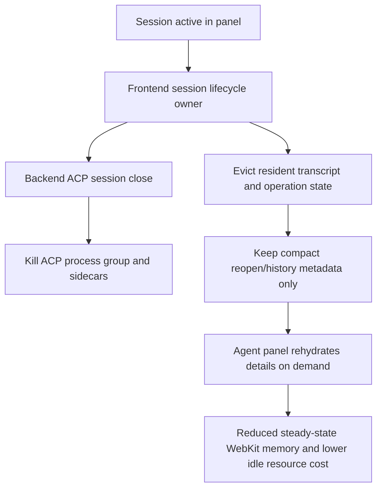
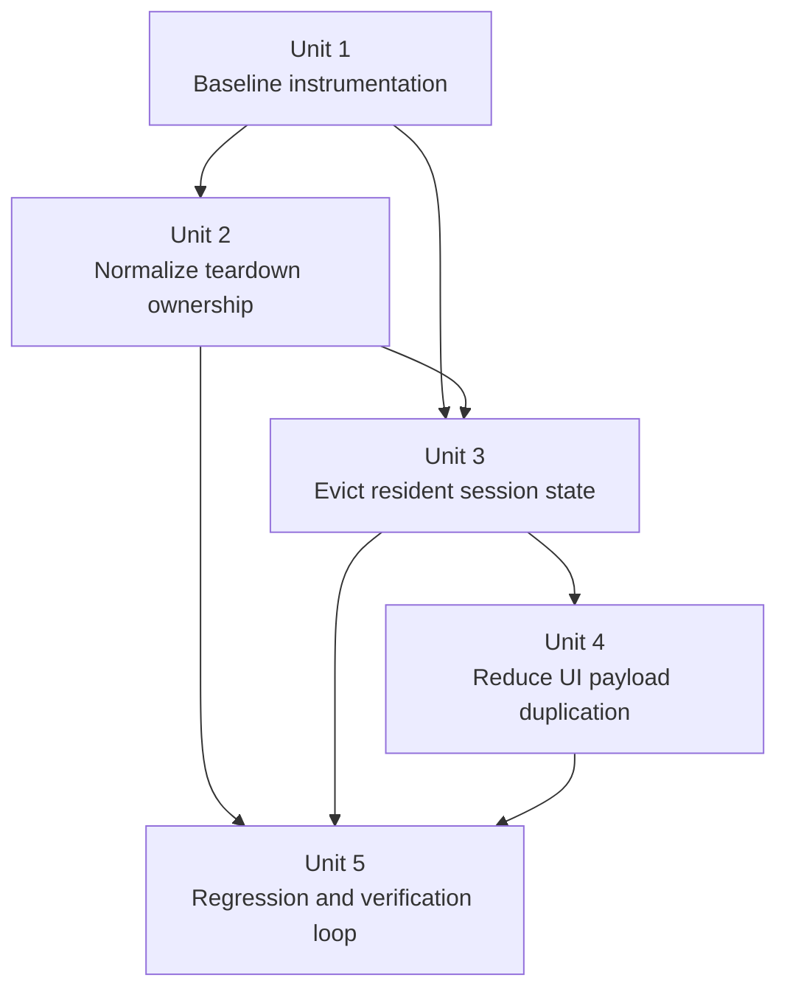
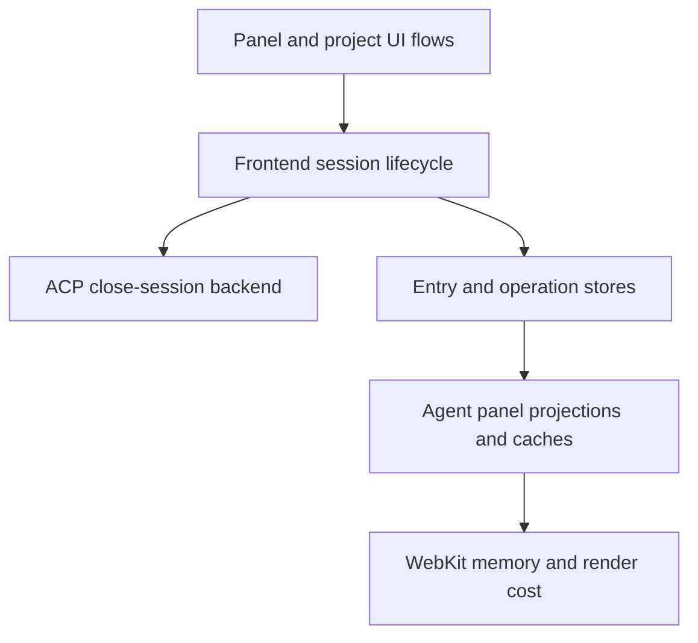

# fix: Systematically remediate Acepe session resource leaks

## Overview

Acepe is showing resource pressure from two coupled failure modes: the frontend/WebKit side keeps too much session and tool-call state resident, and some session/panel removal paths leave ACP agent subprocess trees running long after the user-facing panel is gone. The investigation that motivated this plan was captured against the shipped **4.13 release build** (`2026.4.13`), not a local dev-only snapshot. The follow-up codepath analysis, however, was performed against the current `main` branch, which may already be ahead of 4.13. This plan therefore treats the identified retention and teardown seams as the best current explanation of the release symptoms, but not as proof that 4.13 shipped with exactly the same implementation at every seam. The plan is to make resource release measurable, converge all teardown paths on one lifecycle, evict transcript-heavy state when a session is no longer active, and stop the agent-panel rendering stack from duplicating large payloads unnecessarily.

This is a resource-remediation plan, not a virtualization rewrite or a transcript-product redesign. The goal is to reduce steady-state memory, CPU, and energy cost for long-lived Acepe usage while preserving transcript fidelity, live-session behavior, and session recovery semantics.

| Surface | Current symptom | Planned direction |
|---|---|---|
| ACP subprocess lifecycle | Old `copilot --acp --stdio` and MCP sidecars remain alive | Normalize every close/remove flow through backend session close |
| Session/transcript retention | Closed or disconnected sessions can keep full entries/tool payloads resident | Add explicit eviction policy and compact post-close state |
| Agent panel render path | Large tool payloads and rich rows are eagerly re-derived/stringified | Shift heavy details to on-demand expansion and cap caches |

## Problem Frame

The current machine-level investigation showed Acepe contributing materially to system pressure rather than merely coexisting with it. These observations were taken from the **Acepe 4.13 release** (`2026.4.13`). During live inspection, the native `acepe` process sat around a ~691 MB physical footprint while its WebKit WebContent process reached ~7.1 GB physical footprint with ~5.6-7.0 GB swapped. The Acepe subtree outside WebKit also held roughly ~3.4 GB RSS across agent/runtime subprocesses. Separately, the live process tree showed around 20 active `copilot --acp --stdio` processes plus many MCP sidecars still attached to the Acepe tree.

Repo research on current `main` aligned with those symptoms, but it must be read carefully because `main` is ahead of the observed release. On `main`, `packages/desktop/src/lib/acp/store/session-entry-store.svelte.ts` retains full `SessionEntry[]` arrays per session in a global `SvelteMap`. `packages/desktop/src/lib/acp/store/operation-store.svelte.ts` duplicates substantial tool-call payload state in a second global store. `packages/desktop/src/lib/acp/components/agent-panel/scene/desktop-agent-panel-scene.ts` eagerly derives large strings and detail blobs from tool outputs for rendering. On the lifecycle side, backend ACP clients have a strong explicit stop path, but several frontend panel/session removal paths bypass `disconnectSession()` and therefore likely never reach backend `acp_close_session`. These are the primary implementation hypotheses for the 4.13 behavior until release-aligned verification proves which seams were actually present in that shipped build.

No directly matching requirements document exists in `docs/brainstorms/`. This plan is based on the current user request plus the live investigation. The finished-session performance work in `docs/brainstorms/2026-04-09-finished-session-scroll-performance-requirements.md` and `docs/plans/2026-04-09-002-fix-finished-session-scroll-performance-plan.md` is treated as adjacent prior art for the WebKit/frontend half of the problem, not as the origin document for this broader resource-leak effort.

## Requirements Trace

- R1. Acepe must have one reproducible resource-debugging path for memory, CPU, and energy so the team can compare before/after behavior on the same session shapes, including release-aligned reproduction when current `main` has drifted from the observed shipped version.
- R2. Closing, removing, or disconnecting a session must reliably stop the corresponding ACP subprocess tree and sidecars.
- R3. Session-close and session-remove flows must not leave unbounded transcript or tool-operation state resident in frontend memory unless the session is explicitly still active.
- R4. The agent-panel rendering path must avoid eager duplication of large payloads such as tool results, command output, and serialized detail blobs.
- R5. Resource fixes must preserve transcript readability, tool inspection value, and live-session behavior such as follow/reveal, reconnect, and recovery.
- R6. The implementation must include regression coverage and a repeatable verification loop that proves resource release rather than relying on anecdotal improvement.

## Scope Boundaries

- This plan targets Acepe session/resource lifecycle inside the desktop app; it does not attempt to reduce unrelated memory pressure from other apps or local tooling.
- This plan does not redesign transcript persistence, history scanning, or the product contract for reading old sessions beyond what is required for safe eviction and on-demand inspection.
- This plan does not replace the virtualization stack or reopen the broader thread-follow architecture. If teardown, eviction, and duplication fixes still leave unacceptable resource pressure, the next step is a separate architecture plan rather than scope expansion inside this one.
- This plan does not broaden into provider-specific behavior changes beyond what is needed to ensure provider subprocesses obey the same teardown contract.

### Deferred to Separate Tasks

- If resource pressure remains high after teardown, eviction, and payload-duplication fixes land, a separate architecture pass may revisit heavy finished-session row rendering and virtualization strategy.

## Context & Research

### Relevant Code and Patterns

- `packages/desktop/src/lib/acp/store/session-entry-store.svelte.ts`
  - Global owner of resident `SessionEntry[]`, preloaded-session tracking, and explicit `clearEntries(sessionId)` cleanup.
- `packages/desktop/src/lib/acp/store/operation-store.svelte.ts`
  - Canonical tool-operation projection that currently stores `arguments`, `progressiveArguments`, `result`, child relationships, and metadata for every tool call.
- `packages/desktop/src/lib/acp/store/services/session-repository.ts`
  - Preloads full session details from disk and preserves preloaded sessions across history loads.
- `packages/desktop/src/lib/acp/store/services/session-connection-manager.ts`
  - Frontend session connect/disconnect seam; currently delegates backend close through `api.closeSession(...)`.
- `packages/desktop/src/lib/components/main-app-view/logic/managers/panel-handler.ts`
  - Intended panel-close cleanup seam; already disconnects some agent sessions before removing the panel.
- `packages/desktop/src/lib/acp/store/panel-store.svelte.ts`
  - Low-level panel close path that currently removes panel hot state but does not disconnect the session itself.
- `packages/desktop/src/lib/components/main-app-view/components/sidebar/app-sidebar.svelte`
  - Project-removal path currently closes panels and removes sessions directly.
- `packages/desktop/src/lib/components/main-app-view/components/content/kanban-view.svelte`
  - Contains direct `panelStore.closePanel(...)` calls that bypass the higher-level cleanup handler.
- `packages/desktop/src/lib/acp/components/agent-panel/scene/desktop-agent-panel-scene.ts`
  - Eagerly maps session entries into render models, including `JSON.stringify(...)`, ANSI stripping, search-result expansion, and recursive child mapping.
- `packages/ui/src/lib/markdown/create-renderer.ts`
  - Shared markdown renderer/cache seam relevant to large settled transcripts.
- `packages/desktop/src-tauri/src/acp/client/lifecycle.rs`
  - Backend subprocess spawn/stop seam; on Unix it creates a process group and kills the group on stop.
- `packages/desktop/src-tauri/src/acp/commands/session_commands.rs`
  - `acp_close_session` removes the client from the session registry and invokes `client.stop()`.

### Institutional Learnings

- `docs/plans/2026-04-09-002-fix-finished-session-scroll-performance-plan.md`
  - Adjacent prior art: the team already identified the finished-session conversation surface as a meaningful performance hotspot and chose bounded fixes before architectural rewrites.
- `docs/solutions/logic-errors/thinking-indicator-scroll-handoff-2026-04-07.md`
  - Live-thread follow/reveal semantics are fragile and should be treated as protected behavior while changing the agent panel.
- `docs/solutions/best-practices/svelte5-unconditional-snippet-props-2026-04-12.md`
  - Reinforces keeping UI-layer changes aligned with current Svelte patterns rather than introducing brittle conditional wiring.

### External References

- None. The repo already contains strong local evidence for the lifecycle, retention, and rendering seams this work touches, so planning proceeds without external research.

## Key Technical Decisions

- **Treat this as one coordinated resource program, not separate bug tickets.** The live symptoms span process lifetime, resident state retention, and frontend duplication; addressing only one layer risks hiding the others.
- **Make teardown authoritative before optimizing rendering.** Subprocesses and global resident stores must reliably release on close/remove/disconnect so measurement reflects the current active workload instead of historical leftovers.
- **Define an explicit lifecycle contract before changing teardown behavior.** Ordinary panel close, project/session remove, worktree-invalidated teardown, visible disconnect, and explicit background ownership are not interchangeable and must not be left to implementation-time interpretation.
- **Define an explicit post-close data contract for sessions.** Inactive sessions retain only compact metadata needed for history and confident reopen: session identity, title, timestamps, project/agent/worktree linkage, source path, latest-turn preview text, entry count, and lightweight state badges such as error/question/PR/worktree flags. Full transcript entries, full tool arguments/results, and render caches are rehydrated on explicit reopen rather than kept resident indefinitely.
- **Move heavyweight tool details to demand-driven rendering.** The transcript surface should preserve inspection value without eagerly materializing full JSON/string/ANSI payloads for every visible or historical entry.
- **Keep live-session behavior stable while changing retention.** Reconnect, resume, follow/reveal, and transcript persistence are preserved invariants; the plan changes what remains resident in memory, not what is persisted on disk or shown after explicit reopen.
- **Use profiling fixtures and teardown instrumentation as gating evidence.** Memory, CPU, and energy improvements must be provable on a stable reproduction path before the work is considered complete.
- **Prove the backend kill path before assuming caller convergence is sufficient.** After Unit 1 instrumentation lands, implementation must verify that the canonical close path actually reclaims the entire ACP subprocess tree and sidecars; if it does not, backend teardown reliability remains in scope for this plan.

### Lifecycle contract

| User/system action | Backend ACP session | Resident transcript/tool state | Expected UX outcome |
|---|---|---|---|
| Close ordinary visible agent panel | Close the ACP session | Evict full transcript/tool state after close completes; keep compact cold metadata | Session disappears from active workspace but remains confidently reopenable from history |
| Remove project/session from workspace state | Close the ACP session | Evict resident state and remove active-workspace ownership; persisted history remains unless separately deleted | No active workspace surface remains; history/reopen still possible through persisted data |
| Worktree invalidation/removal for a live session | Close the ACP session | Evict resident state after teardown; retain compact metadata plus worktree-deleted signal | User does not keep a broken live session pointed at a missing directory |
| Disconnect a still-visible session | Close the ACP session | Keep enough visible transcript state for the current panel; do **not** force immediate blank-panel eviction while the session is still on screen | User can inspect the disconnected transcript and explicitly reconnect or close it |
| Session with explicit background ownership | May stay alive without a visible panel **only** when the owning workflow intentionally declares background execution | Resident state follows the owning workflow contract, not ordinary panel-close rules | Long-running workflows remain trustworthy without reclassifying leaks as “intentional background work” |
| Explicit reopen/reconnect/resume | Start or resume ACP session as needed | Rehydrate full transcript/tool state through repository/load seams | Supported reopen/recovery behavior remains intact |

## Open Questions

### Resolved During Planning

- **Is there a directly matching requirements document to use as the origin?** No. The plan proceeds from the user request and current investigation, with the 2026-04-09 finished-session performance work used only as related context.
- **What plan depth fits this work?** Deep. The work crosses frontend stores, UI rendering, panel lifecycle, and backend ACP session management.
- **Should planning start with frontend rendering optimizations or lifecycle cleanup?** Lifecycle cleanup first. Without reliable teardown and eviction, frontend profiles are polluted by stale resident state and orphaned subprocess trees.
- **Does the backend already have a credible kill path for ACP subprocesses?** Yes. The evidence points more strongly to frontend paths that fail to invoke backend close than to a missing backend kill primitive.
- **What metrics count as the canonical resource baseline?** Use one vocabulary throughout the work: memory footprint, steady-state CPU, process/subprocess count, and Activity Monitor / `top` power as the energy proxy. “Idle cost” in verification means those same settled-session CPU/power/process metrics after the transcript and sidecars have quiesced.
- **What must remain immediately inspectable after eviction?** History and inactive-session surfaces must still show title, latest-turn preview, entry count, and state badges, while full transcript rows and tool detail become explicit-reopen behavior rather than silently resident memory.
- **What summary must remain visible for heavy tool rows in the default panel state?** The non-expanded row must still show tool identity, status, and the primary short discriminator for that tool (for example command, URL, query/path, or result count/first-line preview), plus an explicit indication that more detail is available.
- **How should `autoCreated` or hidden background sessions behave?** They are in scope for teardown normalization. A session may outlive its visible panel only when an explicit owning workflow declares background execution; absent that owner, panel disappearance must not leave the ACP session alive.
- **What is the durable benchmark artifact?** Create and use a sanitized transcript fixture for resource verification at `packages/desktop/src/lib/acp/components/agent-panel/components/__fixtures__/session-resource-benchmark.json` so repeated before/after measurements use the same content, while keeping the original baseline notes explicitly tied to the 4.13 release build that exposed the issue.

### Deferred to Implementation

- Whether tool-operation duplication should be reduced by storing smaller projections in `OperationStore`, by evicting aggressively on close, or by both.
- Which markdown/tool-output caches need size-aware limits versus lifecycle-triggered resets once the baseline instrumentation is in place.

## High-Level Technical Design

> *This illustrates the intended approach and is directional guidance for review, not implementation specification. The implementing agent should treat it as context, not code to reproduce.*

## Implementation Units

- [ ] **Unit 1: Add reproducible resource baselines and teardown observability**

**Goal:** Make memory, CPU, energy, and teardown behavior measurable on a stable reproduction path before changing lifecycle semantics.

**Requirements:** R1, R6

**Dependencies:** None

**Files:**
- Create: `packages/desktop/src/lib/acp/components/agent-panel/components/__fixtures__/session-resource-benchmark.json`
- Modify: `packages/desktop/src-tauri/src/acp/commands/session_commands.rs`
- Modify: `packages/desktop/src-tauri/src/acp/session_registry.rs`
- Modify: `packages/desktop/src/lib/acp/store/services/session-connection-manager.ts`
- Modify: `packages/desktop/src/lib/components/main-app-view/logic/managers/panel-handler.ts`
- Modify: `packages/desktop/src/lib/components/main-app-view/components/sidebar/app-sidebar.svelte`
- Modify: `packages/desktop/src/lib/components/main-app-view/components/content/kanban-view.svelte`
- Modify: `packages/desktop/src/lib/acp/store/services/session-connection-manager.test.ts`
- Modify: `packages/desktop/src-tauri/src/acp/commands/tests.rs`
- Test: `packages/desktop/src/lib/components/main-app-view/components/content/kanban-view.test.ts`
- Test: `packages/desktop/src/lib/acp/store/services/session-connection-manager.test.ts`
- Test: `packages/desktop/src-tauri/src/acp/commands/tests.rs`

**Approach:**
- Add bounded lifecycle instrumentation around session close/remove paths so the app can prove when a frontend disconnect request was issued, which UI entry point initiated it, when the backend removed a session client, and whether teardown completed.
- Keep the instrumentation scoped to resource diagnosis and verification rather than introducing permanent noisy logging everywhere.
- Define one canonical manual reproduction path for a memory-heavy transcript and one canonical teardown path so subsequent units can compare before/after behavior on the same conditions.
- Use this unit to falsify the current assumption about backend teardown: the implementation must prove that the canonical close path kills the full subprocess tree before the plan can treat caller convergence as sufficient.

**Execution note:** Start with characterization coverage for disconnect/close sequencing before changing teardown semantics.

**Patterns to follow:**
- `packages/desktop/src/lib/acp/store/services/session-connection-manager.ts`
- `packages/desktop/src-tauri/src/acp/commands/session_commands.rs`
- `packages/desktop/src-tauri/src/acp/commands/tests.rs`

**Test scenarios:**
- Happy path — a normal frontend disconnect request issues a backend close for the current ACP session ID exactly once.
- Happy path — project removal, kanban close, and panel-handler close each emit distinguishable teardown evidence tied to the same backend close contract.
- Happy path — backend close removes the session from the registry and invokes the client stop path.
- Edge case — disconnecting a session with no active ACP session ID leaves local state consistent without pretending teardown happened.
- Error path — backend close failure is surfaced to diagnostics without wedging the frontend session state in a pseudo-connected state.
- Integration — a recorded close/remove flow produces enough lifecycle evidence to distinguish “frontend never asked to close” from “backend failed to stop”.

**Verification:**
- The team can run one stable reproduction and one stable close/remove flow and observe, in a bounded way, whether teardown and resource release happened.

- [ ] **Unit 2: Normalize session and panel teardown ownership**

**Goal:** Ensure every user-facing path that removes, closes, or abandons an agent session converges on one teardown contract that closes the backend ACP session.

**Requirements:** R2, R5, R6

**Dependencies:** Unit 1

**Files:**
- Modify: `packages/desktop/src/lib/components/main-app-view/logic/managers/panel-handler.ts`
- Modify: `packages/desktop/src/lib/acp/store/panel-store.svelte.ts`
- Modify: `packages/desktop/src/lib/components/main-app-view/components/sidebar/app-sidebar.svelte`
- Modify: `packages/desktop/src/lib/components/main-app-view/components/content/kanban-view.svelte`
- Modify: `packages/desktop/src/lib/acp/components/agent-panel/logic/worktree-removal.ts`
- Modify: `packages/desktop/src/lib/acp/store/services/session-repository.ts`
- Modify: `packages/desktop/src/lib/acp/store/session-store.svelte.ts`
- Modify: `packages/desktop/src/lib/acp/store/services/session-connection-manager.ts`
- Test: `packages/desktop/src/lib/acp/store/services/session-connection-manager.test.ts`
- Test: `packages/desktop/src/lib/acp/store/__tests__/panel-store-workspace-panels.vitest.ts`
- Test: `packages/desktop/src/lib/components/main-app-view/components/content/kanban-view.test.ts`
- Test: `packages/desktop/src/lib/acp/components/agent-panel/logic/worktree-removal.test.ts`

**Approach:**
- Eliminate direct session/panel removal paths that bypass `disconnectSession()` or equivalent teardown coordination.
- Apply the lifecycle contract table above directly: ordinary panel disappearance tears down the ACP session, while only explicit background ownership may keep a hidden session alive.
- Make one teardown owner authoritative for both ACP close and dependent cleanup, including panel-associated connection actors, queue/projection cleanup, and any session-scoped stores that currently rely on scattered removal hooks.
- Keep backend close idempotent from the frontend’s perspective so converging more paths onto it does not create duplicate-close fragility.

**Patterns to follow:**
- `packages/desktop/src/lib/components/main-app-view/logic/managers/panel-handler.ts`
- `packages/desktop/src/lib/acp/store/services/session-connection-manager.ts`
- `packages/desktop/src-tauri/src/acp/commands/session_commands.rs`

**Test scenarios:**
- Happy path — closing an agent panel through the main panel handler disconnects the session and triggers backend close.
- Happy path — removing a project with active sessions closes each session through the same teardown contract instead of only removing frontend state.
- Happy path — worktree-removal or worktree-invalidation teardown routes through the same backend close contract as ordinary panel close.
- Edge case — closing a kanban/new-session flow panel that never established a session does not attempt backend close.
- Edge case — auto-created or background-owned sessions only remain alive when the explicit background owner is present; otherwise panel disappearance tears them down.
- Error path — if backend close fails, the UI still leaves the panel/session in a coherent state and exposes diagnostic evidence.
- Integration — all known close/remove entry points end up issuing the same disconnect/close sequence instead of mixing direct store mutation with lifecycle-aware teardown.

**Verification:**
- No panel/session removal path can remove the visible session while leaving the corresponding ACP subprocess tree alive by omission.

- [ ] **Unit 3: Evict resident transcript and operation state when sessions become inactive**

**Goal:** Release memory-heavy `SessionEntry` and `Operation` state after session close/remove/disconnect while preserving enough cold metadata for history, reopen, and recovery workflows.

**Requirements:** R1, R3, R5, R6

**Dependencies:** Units 1-2

**Files:**
- Modify: `packages/desktop/src/lib/acp/store/session-entry-store.svelte.ts`
- Modify: `packages/desktop/src/lib/acp/store/operation-store.svelte.ts`
- Modify: `packages/desktop/src/lib/acp/store/services/session-repository.ts`
- Modify: `packages/desktop/src/lib/acp/store/session-store.svelte.ts`
- Modify: `packages/desktop/src/lib/acp/store/services/tool-call-manager.svelte.ts`
- Test: `packages/desktop/src/lib/acp/store/__tests__/session-entry-store-streaming.vitest.ts`
- Test: `packages/desktop/src/lib/acp/store/__tests__/operation-store.vitest.ts`
- Test: `packages/desktop/src/lib/acp/store/services/__tests__/session-repository-preload-details.test.ts`

**Approach:**
- Define an explicit eviction boundary for inactive sessions so full transcript arrays and full tool-operation projections are not treated as permanent app-lifetime state.
- Preserve the compact cold-session contract defined above and stop assuming that “preloaded once” means “keep forever”.
- Treat eviction eligibility as lifecycle-state-specific: closed/removed/worktree-invalidated sessions are eligible for full eviction after teardown, while still-visible disconnected sessions keep enough resident transcript state to remain inspectable until the user closes or removes them.
- Keep eviction rules aligned with teardown ownership so resource release happens automatically after the session lifecycle transitions, not as a manual cleanup afterthought.
- Avoid broad silent fallbacks; if a view needs data after eviction, it should rehydrate through the existing repository/loading seams.
- Include startup-restored and history-scan-merged sessions in the protected behavior set so eviction does not only work for the simple reopen path.

**Execution note:** Add characterization coverage around preloaded-session reload and reconnect behavior before tightening eviction semantics.

**Patterns to follow:**
- `packages/desktop/src/lib/acp/store/session-entry-store.svelte.ts`
- `packages/desktop/src/lib/acp/store/services/session-repository.ts`
- `packages/desktop/src/lib/acp/store/operation-store.svelte.ts`

**Test scenarios:**
- Happy path — disconnecting or removing a session clears resident entries and operations for that session.
- Happy path — reopening a previously evicted historical session reloads its transcript from persisted storage with the expected title and entry content.
- Happy path — a startup-restored or scan-merged session still reloads correctly after eviction rather than assuming resident preloaded state.
- Edge case — a preloaded session whose source path changes still reloads correctly after eviction instead of reusing stale resident data.
- Edge case — a still-visible disconnected session remains inspectable until the user closes or removes it, instead of blanking immediately.
- Edge case — clearing one session does not disturb resident entries or operations for other active sessions.
- Error path — failed transcript reload after eviction surfaces as a normal load error rather than silently pretending the evicted data is still available.
- Integration — panel close/remove plus session eviction leaves history lists and reopen behavior intact while reclaiming resident state.

**Verification:**
- Inactive sessions no longer keep full transcript and tool payload state resident by default, and explicit reopen/hydration still works through supported store flows.

- [ ] **Unit 4: Reduce eager payload duplication and cache pressure in the agent-panel render path**

**Goal:** Cut frontend/WebKit memory growth from repeated serialization, duplicate derived models, and heavyweight caches while preserving on-demand inspection.

**Requirements:** R1, R4, R5, R6

**Dependencies:** Unit 3

**Files:**
- Modify: `packages/desktop/src/lib/acp/components/agent-panel/scene/desktop-agent-panel-scene.ts`
- Modify: `packages/desktop/src/lib/acp/components/agent-panel/logic/virtualized-entry-display.ts`
- Modify: `packages/desktop/src/lib/acp/components/agent-panel/components/virtualized-entry-list.svelte`
- Modify: `packages/desktop/src/lib/acp/components/agent-panel/components/agent-panel.svelte`
- Modify: `packages/desktop/src/lib/acp/logic/todo-state-manager.svelte.ts`
- Modify: `packages/ui/src/lib/markdown/create-renderer.ts`
- Modify: `packages/ui/src/components/markdown/markdown-display.svelte`
- Test: `packages/desktop/src/lib/acp/components/agent-panel/scene/desktop-agent-panel-scene.test.ts`
- Test: `packages/desktop/src/lib/acp/components/agent-panel/components/__tests__/virtualized-entry-list.svelte.vitest.ts`
- Test: `packages/desktop/src/lib/acp/store/__tests__/question-selectors.test.ts`

**Approach:**
- Stop eagerly materializing full detail strings for tool entries when only summary state is needed for the default view; shift heavyweight detail blobs to explicit expansion or demand-driven formatting.
- Tighten derived data paths that repeatedly copy transcript chunks, stringify payloads, or build caches from entire entry objects.
- Cap or reset shared render caches when transcript size or lifecycle boundaries make unbounded reuse more expensive than helpful.
- Preserve transcript readability and detailed inspection, but make the expensive representation opt-in rather than the base rendering cost.
- Keep this unit bounded to render-stage duplication and cache pressure in the named seams; it must not turn into a broader conversation-architecture or interaction-model rewrite.

**Patterns to follow:**
- `packages/desktop/src/lib/acp/components/agent-panel/scene/desktop-agent-panel-scene.ts`
- `packages/desktop/src/lib/acp/components/agent-panel/components/virtualized-entry-list.svelte`
- `packages/ui/src/lib/markdown/create-renderer.ts`

**Test scenarios:**
- Happy path — default tool-call rows render summary information without eagerly serializing the entire tool payload.
- Happy path — expanding a tool detail view still exposes the full payload when the user explicitly asks for it.
- Happy path — default rows for execute, fetch/search, and large-output tools retain the minimum visible signals promised in the plan (identity, status, primary discriminator, and explicit “more detail available” cue).
- Edge case — large stdout/stderr or fetch/search results do not create duplicate strings during ordinary transcript rendering.
- Edge case — markdown/cache behavior remains correct when a large session is opened, closed, and reopened after eviction.
- Error path — malformed or unusually large tool payloads still render a safe summary/inspection affordance without crashing the panel.
- Integration — if a detail view or reopened transcript needs rehydration after eviction/cache reset, the UI distinguishes loading, loaded, and failed states without ambiguous blank expansions or lost scroll context.
- Integration — long settled transcripts remain readable and inspectable while the baseline rendering path keeps significantly less derived detail resident.

**Verification:**
- The default agent-panel render path keeps materially less duplicated payload state in JS/WebKit while preserving explicit inspection behavior.

- [ ] **Unit 5: Lock the fixes in with resource-regression coverage and benchmark comparison**

**Goal:** Prove the combined lifecycle, eviction, and rendering changes improve steady-state resource behavior without regressing live-session workflows.

**Requirements:** R1, R2, R3, R4, R5, R6

**Dependencies:** Units 1-4

**Files:**
- Modify: `packages/desktop/src/lib/acp/components/agent-panel/components/__fixtures__/session-resource-benchmark.json`
- Modify: `packages/desktop/src/lib/acp/store/services/session-connection-manager.test.ts`
- Modify: `packages/desktop/src/lib/acp/store/__tests__/session-entry-store-streaming.vitest.ts`
- Modify: `packages/desktop/src/lib/acp/components/agent-panel/scene/desktop-agent-panel-scene.test.ts`
- Modify: `packages/desktop/src-tauri/src/acp/commands/tests.rs`
- Test: `packages/desktop/src/lib/acp/store/services/session-connection-manager.test.ts`
- Test: `packages/desktop/src/lib/acp/store/__tests__/session-entry-store-streaming.vitest.ts`
- Test: `packages/desktop/src/lib/acp/components/agent-panel/scene/desktop-agent-panel-scene.test.ts`
- Test: `packages/desktop/src-tauri/src/acp/commands/tests.rs`

**Approach:**
- Extend automated coverage to protect the teardown/eviction/rehydration invariants added in earlier units.
- Use the canonical reproduction path from Unit 1 to compare before/after steady-state memory, process count, and idle cost after repeated open/close/reopen flows.
- Use the checked-in benchmark fixture as the durable verification artifact so future reviewers can repeat the same transcript-heavy path instead of depending on one-off local transcripts.
- Treat residual high resource usage as evidence for the next architecture pass rather than silently broadening this fix beyond the planned seams.

**Patterns to follow:**
- Existing ACP lifecycle tests in `packages/desktop/src-tauri/src/acp/commands/tests.rs`
- Existing store and panel tests under `packages/desktop/src/lib/acp/store/__tests__/`

**Test scenarios:**
- Happy path — repeated open/close/reopen cycles do not monotonically grow live ACP subprocess count.
- Happy path — repeated preload/disconnect/reopen cycles do not leave stale entries or operations resident across iterations.
- Happy path — repeated close/remove flows show lower settled-session CPU/power samples than the pre-fix baseline on the canonical fixture.
- Edge case — reconnecting a previously evicted session restores expected live behavior without breaking follow/reveal semantics.
- Edge case — startup-restored sessions and history-scan-merged sessions continue to recover correctly after eviction across app restarts.
- Error path — failed close or failed rehydrate paths remain observable and do not strand the session in an inconsistent partially-evicted state.
- Integration — a representative long session still supports transcript inspection after eviction/reopen while using less steady-state memory than the baseline path.

**Verification:**
- The team can demonstrate, on the same reproduction path, that Acepe releases subprocesses and resident transcript state after lifecycle transitions and no longer accumulates the same steady-state memory/energy cost over repeated use.

## System-Wide Impact

- **Interaction graph:** Project removal, panel close, kanban session flows, session repository updates, and backend ACP close all interact in this change. The plan must make one lifecycle owner authoritative so these surfaces do not diverge.
- **Lifecycle contract:** Ordinary visible panel closure tears down the ACP session; only explicit background ownership may keep a hidden session alive. Visible disconnected sessions remain inspectable until the user closes or removes them.
- **Error propagation:** Close failures must be observable at the frontend lifecycle seam; eviction failures or reload failures must surface through the existing load/reconnect paths instead of silently leaving stale in-memory state.
- **State lifecycle risks:** The main risks are partial teardown (backend still running, frontend cleared), partial eviction (entries cleared, operations kept), and stale cached projections after rehydrate.
- **API surface parity:** All session-removal entry points in the desktop app must obey the same contract, regardless of whether they originate in the workspace panel handler, sidebar/project management, kanban flows, or worktree cleanup.
- **Integration coverage:** Unit tests alone are insufficient unless they cover end-to-end open/close/reopen flows across frontend lifecycle, backend close, and subsequent rehydrate.
- **Unchanged invariants:** Persisted transcript history, explicit reopen/reconnect behavior, and live-thread follow/reveal semantics remain unchanged. The plan changes when data stays resident in memory, not what Acepe stores on disk or displays after a supported reload.

## Risks & Dependencies

| Risk | Mitigation |
|------|------------|
| Over-eager eviction breaks reopen or reconnect UX | Add characterization tests before tightening eviction and require all evicted sessions to rehydrate through existing repository seams |
| Some close/remove path still bypasses lifecycle cleanup | Centralize teardown ownership and cover each known entry point with targeted tests |
| Reducing payload duplication hides tool detail users still need | Preserve explicit on-demand inspection affordances and verify detail expansion on large payloads |
| Resource gains are hard to prove because measurement changes with each run | Use one canonical reproduction path and teardown flow established in Unit 1 |
| Fixes improve memory but regress live-session follow/recovery behavior | Keep lifecycle/resource changes away from follow semantics and include reconnect/live behavior scenarios in the regression suite |

## Documentation / Operational Notes

- The implementing work should capture the canonical reproduction path and the before/after resource comparison in the PR description so future regressions have a known benchmark.
- If bounded lifecycle instrumentation is kept after the fix, it should remain low-noise and explicitly scoped to resource diagnosis rather than becoming a permanent logging firehose.
- If this work reveals that finished-session rendering still dominates WebKit memory after teardown and eviction are correct, open a separate architecture plan instead of extending this one implicitly.

## Sources & References

- Related prior plan: `docs/plans/2026-04-09-002-fix-finished-session-scroll-performance-plan.md`
- Related requirements: `docs/brainstorms/2026-04-09-finished-session-scroll-performance-requirements.md`
- Related learning: `docs/solutions/logic-errors/thinking-indicator-scroll-handoff-2026-04-07.md`
- Related code: `packages/desktop/src/lib/acp/store/session-entry-store.svelte.ts`
- Related code: `packages/desktop/src/lib/acp/store/operation-store.svelte.ts`
- Related code: `packages/desktop/src-tauri/src/acp/client/lifecycle.rs`
