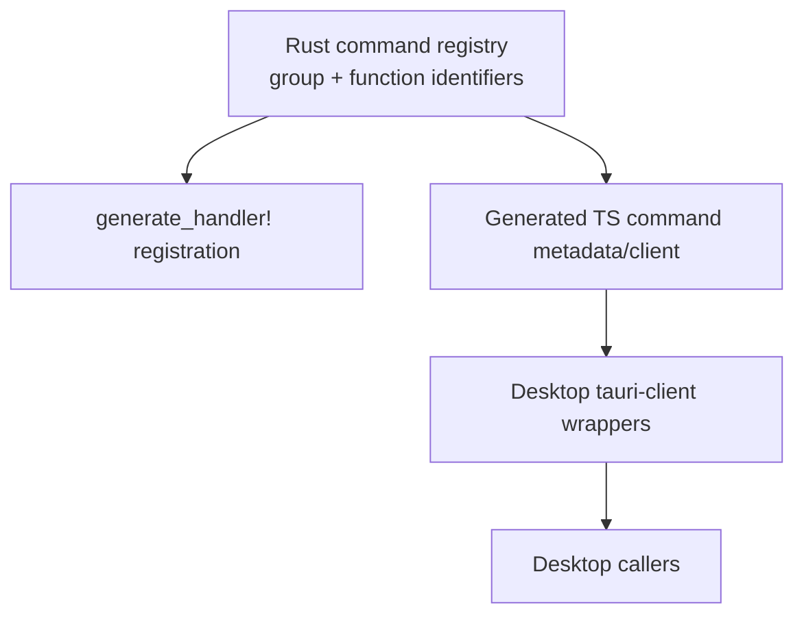

# refactor: Single-source Tauri command surface

## Overview

Replace the current split Tauri command architecture with a single Rust-owned command registry that drives backend handler registration, generated frontend command metadata, and the desktop invoke client surface. The goal is to make it impossible for the frontend to expose a callable command that the backend forgot to register, while also removing handwritten command strings from app code.

## Problem Frame

The current desktop command surface is defined in multiple places:

- Rust command name constants in `packages/desktop/src-tauri/src/commands/names.rs`
- Tauri handler registration in `packages/desktop/src-tauri/src/lib.rs`
- handwritten frontend command maps in `packages/desktop/src/lib/utils/tauri-client/commands.ts`
- direct string-based `invoke(...)` calls across desktop code

That split already caused a real runtime bug: project commands were added to the frontend surface but not registered in `generate_handler!`, so they compiled and shipped as callable names but failed at runtime. The recent local fix reduced drift for one command group, but the architecture is still fundamentally split. The end state should make Rust the single source of truth for the static Tauri command surface and make frontend callers consume generated client functions instead of string identifiers.

## Requirements Trace

- R1. A command group's membership and command names must be declared once in Rust.
- R2. Backend handler registration and generated frontend command metadata must derive from the same declaration.
- R3. Desktop app code must stop depending on handwritten Tauri command string literals for static Rust-owned commands.
- R4. The generated frontend surface must remain compatible with existing Rust command names and argument shapes.
- R5. The regeneration workflow must be explicit and follow the existing "generate, do not hand-edit generated files" repo pattern.
- R6. Dynamic/non-Rust command surfaces (for example plugin namespaces or ACP dynamic RPC prefixes) must remain explicit rather than being incorrectly forced into the static registry.

## Scope Boundaries

- This refactor does **not** rename existing Tauri commands.
- This refactor does **not** change command semantics, payload shapes, or authorization behavior.
- This refactor does **not** attempt to fold plugin command namespaces such as notification plugin commands into the Rust registry.
- This refactor does **not** solve every stringly-typed runtime call in the product; it targets the static Rust-owned Tauri command surface first.

### Deferred to Separate Tasks

- Full end-to-end argument/result type generation from Rust command functions: if the repo later adopts stable `tauri_specta` command export tooling, that can replace the thin generated client layer without changing the registry shape.

## Context & Research

### Relevant Code and Patterns

- `packages/desktop/src-tauri/src/commands/names.rs` is the current Rust source for generated command-name bindings.
- `packages/desktop/src-tauri/src/lib.rs` owns the real `tauri::generate_handler!` registration list.
- `packages/desktop/src/lib/services/command-names.ts` is the generated frontend command-name artifact consumed by desktop code.
- `packages/desktop/src/lib/utils/tauri-commands.ts` is the current generic invoke wrapper and generated-command export surface.
- `packages/desktop/src/lib/utils/tauri-client/commands.ts` is the handwritten bridge that re-groups generated names and manual string fallbacks.
- `packages/desktop/src/lib/utils/tauri-client/*.ts` and a handful of services/components call `invoke(...)` directly or indirectly today.

### Institutional Learnings

- `docs/superpowers/plans/2026-03-25-claude-provider-session-id.md` already captures the important generation rule: generated frontend contract files should be updated by the actual export workflow rather than hand-editing generated artifacts.

### External References

- None. Local code and current repo constraints are sufficient for this refactor.

## Key Technical Decisions

- **Rust remains the single source of truth.** The canonical declaration lives in `src-tauri`, not in generated TypeScript or handwritten frontend maps.
- **Registry first, generation second.** Introduce a registry declaration that can feed both `generate_handler!` and generated frontend command metadata, instead of trying to infer one side from the other after the fact.
- **Generated frontend client, not just generated strings.** The generated TypeScript client should expose only canonical backend-owned registry groups; higher-level ergonomics stay in handwritten wrapper modules so the generator does not create a second grouping source of truth.
- **Incremental migration by seam.** Domain wrappers under `packages/desktop/src/lib/utils/tauri-client/` and shared services move first; only after those consumers are migrated should the legacy command-map layer be removed.
- **Keep dynamic command surfaces explicit.** Plugin commands and dynamic ACP-prefixed RPC names stay outside the static registry so the architecture remains honest about what is and is not compile-time known.
- **Do not depend on dormant `tauri_specta` command export plumbing for this refactor.** The repo already has a commented note that `tauri_specta` command export is not currently viable, so this plan builds on the working `specta` export path already used for command-name generation.
- **Freeze the generated client shape up front.** The generated TypeScript surface should expose canonical grouped command descriptors, each with a stable `name` field and a thin `invoke(args)` helper layered on `packages/desktop/src/lib/utils/tauri-client/invoke.ts`; wrapper modules may continue to supply richer result aliases until full Rust-driven arg/result generation exists.
- **Reserve ergonomic regrouping for wrappers only.** Consumer-facing concepts such as `projects` remain handwritten wrapper APIs built on canonical generated groups like storage, rather than additional generated projections.
- **Handler registration must have exactly one static entrypoint.** `packages/desktop/src-tauri/src/lib.rs` should delegate the static `invoke_handler(...)` construction to one registry-owned macro/function, eliminating ad hoc append points for registry-backed commands.
- **Non-registry exceptions need a machine-readable allowlist.** Plugin/dynamic command exceptions should live in one checked-in allowlist artifact that both the migration sweep and the audit check consume.
- **The allowlist is not a second registry.** Each allowlist entry must declare a plugin namespace or dynamic-pattern rationale, and validation must fail if an allowlisted command matches any canonical Rust registry export.

## Open Questions

### Resolved During Planning

- **Should this refactor use `tauri_specta` directly?** No. The repo currently documents `tauri_specta` import issues in `packages/desktop/src-tauri/src/commands/mod.rs`, so the plan should preserve the existing custom `specta` export path rather than introducing a new brittle dependency in the critical path.
- **Should the first pass cover only one command group?** No. The architectural fix should cover the full static Rust-owned command surface so the project does not keep two registration models in parallel.
- **What generated client shape should downstream migration units target?** A grouped generated command-descriptor surface with stable `name` and thin `invoke(args)` helpers, so Units 3-4 migrate against a fixed interface instead of discovering the API shape mid-refactor.
- **Where does the generated client import its low-level invoke seam from?** `packages/desktop/src/lib/utils/tauri-client/invoke.ts` remains the low-level invoke implementation, while `packages/desktop/src/lib/utils/tauri-commands.ts` becomes a public re-export barrel for generated command artifacts and approved helper types.
- **How are non-registry exceptions captured during migration?** Create the machine-readable allowlist before the app-caller sweep in Unit 4, then make Unit 5 enforce that already-frozen boundary.

### Deferred to Implementation

- **How much legacy `invoke(...)` remains after migration** for dynamic/plugin commands: implementation should confirm the precise residual surface once the static registry migration is complete.

## High-Level Technical Design

> *This illustrates the intended approach and is directional guidance for review, not implementation specification. The implementing agent should treat it as context, not code to reproduce.*

The important shift is that `lib.rs` and the generated TypeScript bindings stop maintaining their own command lists. They both consume the registry declaration.

## Phased Delivery

### Phase 1

- Land the Rust registry, generated TypeScript command client, and wrapper-level migration for all registry-backed domains.
- Preserve narrowly documented exceptions for plugin-only and dynamic command surfaces.

### Phase 2

- Sweep remaining direct static `invoke("...")` callsites in app code.
- Remove legacy compatibility helpers and add regression checks that prevent stale generated artifacts or raw static command strings from reappearing.

## Implementation Units

- [ ] **Unit 1: Introduce a canonical Rust command registry**

**Goal:** Establish one Rust-owned declaration for static Tauri command groups and their member functions.

**Requirements:** R1, R2, R6

**Dependencies:** None

**Files:**
- Create: `packages/desktop/src-tauri/src/commands/registry.rs`
- Modify: `packages/desktop/src-tauri/src/commands/mod.rs`
- Modify: `packages/desktop/src-tauri/src/commands/names.rs`
- Modify: `packages/desktop/src-tauri/src/lib.rs`
- Test: `packages/desktop/src-tauri/src/commands/names.rs`

**Approach:**
- Move the command-group membership declarations out of ad hoc constant structs and into a registry/module-level macro layer that can be reused from multiple Rust consumers.
- Define an explicit closed inventory for the canonical static Rust-owned command families currently represented across `generate_handler!` and frontend wrappers: ACP/session control, file-system ACP helpers, session history/loading/plans/scanning/projects, cursor/OpenCode history, storage/settings/thread-list utility commands, file-index/content commands, voice commands, git/worktree/panel commands, terminal commands, checkpoint commands, skills/library commands, SQL Studio commands, GitHub commands, browser-webview commands, and locale/window utility commands.
- Keep consumer-facing concepts such as `projects`, `settings`, and `shell` in handwritten wrapper modules; the registry and generated client should expose canonical backend-owned groupings only.
- Make `commands/names.rs` derive its exported command-value structs from the registry instead of manually duplicating command membership.
- Make `lib.rs` delegate its static `invoke_handler(...)` construction to exactly one registry-owned macro/function, so registry-backed handlers cannot be appended elsewhere by hand inside `lib.rs`.

**Patterns to follow:**
- `packages/desktop/src-tauri/src/commands/names.rs` for existing `specta` export shape
- `packages/desktop/src-tauri/src/lib.rs` for current command import and registration conventions

**Test scenarios:**
- Integration: adding a command to a registry group makes it appear in both generated command bindings and handler registration without a second handwritten edit.
- Edge case: dynamic/plugin-only commands remain outside the registry and are not accidentally pulled into static command generation.
- Error path: if a command is removed from the registry, the generated frontend surface loses it as well instead of silently preserving stale names.

**Verification:**
- The static command groups are defined once in Rust and both command export and handler registration compile against that shared declaration.
- Registry-backed handlers are registered through one registry-owned expansion point in `lib.rs`, not through multiple manual append paths.

- [ ] **Unit 2: Generate a frontend command client surface from the registry**

**Goal:** Replace "generated names + handwritten regrouping" with a generated frontend surface that desktop code can call without writing raw Rust command strings.

**Requirements:** R2, R3, R4, R5

**Dependencies:** Unit 1

**Files:**
- Modify: `packages/desktop/src-tauri/src/commands/names.rs`
- Modify: `packages/desktop/src/lib/services/command-names.ts`
- Create: `packages/desktop/src/lib/services/tauri-command-client.ts`
- Modify: `packages/desktop/src/lib/utils/tauri-client/invoke.ts`
- Modify: `packages/desktop/src/lib/utils/tauri-commands.ts`
- Test: `packages/desktop/src/lib/utils/tauri-client/acp.test.ts`

**Approach:**
- Extend the existing `export_command_values` Rust-side export seam in `packages/desktop/src-tauri/src/commands/names.rs` so it emits both the command-name metadata and a thin grouped client surface for Rust-owned static commands, rather than introducing a second unrelated generator.
- Keep the generated client focused on command invocation identity; argument/result typing can remain wrapper-owned where the current repo does not yet generate those contracts.
- Refactor `tauri-commands.ts` into a public re-export barrel while `packages/desktop/src/lib/utils/tauri-client/invoke.ts` stays the dedicated low-level invoke seam consumed by generated output.
- Make freshness enforceable by turning the export seam into the authoritative regeneration path for both generated files and by adding the initial validation step here, so stale committed generated artifacts already fail once the generated client lands.

**Patterns to follow:**
- `packages/desktop/src/lib/utils/tauri-commands.ts` for the current shared invoke seam
- Generated artifact pattern already used by `packages/desktop/src/lib/services/command-names.ts`

**Test scenarios:**
- Happy path: generated client exposes grouped accessors for every registry-backed command group and uses the exported Rust command values.
- Integration: calling a generated project command routes to the same Rust command name that `generate_handler!` registered.
- Edge case: regeneration updates the generated client when a command is added or removed from the registry without manual TS edits.

**Verification:**
- Frontend command identity for registry-backed commands is entirely generated from Rust-owned data.
- Regeneration of both `command-names.ts` and `tauri-command-client.ts` is driven by one named Rust-side export seam, and stale generated artifacts fail validation.

- [ ] **Unit 3: Migrate desktop wrapper modules off handwritten command maps**

**Goal:** Make domain wrapper modules consume the generated client surface instead of `CMD`/raw command strings.

**Requirements:** R3, R4

**Dependencies:** Unit 2

**Files:**
- Modify: `packages/desktop/src/lib/utils/tauri-client/acp.ts`
- Modify: `packages/desktop/src/lib/utils/tauri-client/browser-webview.ts`
- Modify: `packages/desktop/src/lib/utils/tauri-client/checkpoint.ts`
- Modify: `packages/desktop/src/lib/utils/tauri-client/file-index.ts`
- Modify: `packages/desktop/src/lib/utils/tauri-client/fs.ts`
- Modify: `packages/desktop/src/lib/utils/tauri-client/git.ts`
- Modify: `packages/desktop/src/lib/utils/tauri-client/history.ts`
- Modify: `packages/desktop/src/lib/utils/tauri-client/notifications.ts`
- Modify: `packages/desktop/src/lib/utils/tauri-client/projects.ts`
- Modify: `packages/desktop/src/lib/utils/tauri-client/session-review-state.ts`
- Modify: `packages/desktop/src/lib/utils/tauri-client/settings.ts`
- Modify: `packages/desktop/src/lib/utils/tauri-client/shell.ts`
- Modify: `packages/desktop/src/lib/utils/tauri-client/skills.ts`
- Modify: `packages/desktop/src/lib/utils/tauri-client/sql-studio.ts`
- Modify: `packages/desktop/src/lib/utils/tauri-client/terminal.ts`
- Modify: `packages/desktop/src/lib/utils/tauri-client/voice.ts`
- Modify: `packages/desktop/src/lib/utils/tauri-client/workspace.ts`
- Modify: `packages/desktop/src/lib/utils/window-activation.ts`
- Modify: `packages/desktop/src/lib/utils/tauri-client/commands.ts`
- Test: `packages/desktop/src/lib/utils/tauri-client/acp.test.ts`

**Approach:**
- Update wrapper modules to import generated grouped command accessors/functions instead of the handwritten regrouping map.
- Collapse `tauri-client/commands.ts` into either a compatibility re-export layer or remove it once no registry-backed callers need it.
- Keep plugin-only command surfaces explicit where generation is not appropriate; `notifications.ts` remains an intentional plugin-only exception and should be narrowed/documented as such rather than being pulled into the Rust registry.
- Use a migration inventory at the start of this unit to confirm every registry-backed wrapper (`acp`, `browser-webview`, `checkpoint`, `file-index`, `fs`, `git`, `history`, `projects`, `session-review-state`, `settings`, `shell`, `skills`, `sql-studio`, `terminal`, `voice`, `workspace`, `window`) is covered exactly once.

**Patterns to follow:**
- Existing per-domain wrapper layout under `packages/desktop/src/lib/utils/tauri-client/`

**Test scenarios:**
- Happy path: each migrated wrapper still invokes the same backend command identity as before.
- Integration: project wrapper methods use generated project command accessors and no longer depend on manually duplicated strings.
- Error path: wrappers for plugin/dynamic commands remain callable and explicit rather than being broken by the registry migration.

**Verification:**
- Registry-backed wrapper modules no longer depend on handwritten command identity maps.
- Any wrapper left outside the generated client surface is explicitly documented as a plugin or dynamic exception.

- [ ] **Unit 4: Remove direct static-command string invocation from app code**

**Goal:** Eliminate direct `invoke("...")` usage for static Rust-owned commands in shared services and desktop components.

**Requirements:** R3, R4

**Dependencies:** Unit 3

**Files:**
- Create: `packages/desktop/src/lib/utils/tauri-client/non-registry-command-allowlist.ts`
- Modify: `packages/desktop/src/lib/services/settings.svelte.ts`
- Modify: `packages/desktop/src/lib/services/thread-list-settings.ts`
- Modify: `packages/desktop/src/lib/services/zoom.svelte.ts`
- Modify: `packages/desktop/src/lib/i18n/locale.ts`
- Modify: `packages/desktop/src/lib/i18n/store.svelte.ts`
- Modify: `packages/desktop/src/lib/acp/services/github-service.ts`
- Modify: `packages/desktop/src/lib/acp/services/file-content-cache.svelte.ts`
- Modify: `packages/desktop/src/lib/acp/logic/command-palette/recent-items-store.svelte.ts`
- Modify: `packages/desktop/src/lib/acp/logic/command-palette/providers/files-provider.ts`
- Modify: `packages/desktop/src/lib/components/main-app-view/logic/managers/initialization-manager.ts`
- Modify: `packages/desktop/src/lib/components/theme/theme-provider.svelte`
- Modify: `packages/desktop/src/lib/acp/components/terminal-panel/terminal-panel.svelte`
- Modify: `packages/desktop/src/lib/acp/components/agent-panel/components/agent-panel-terminal-drawer.svelte`
- Modify: `packages/desktop/src/lib/acp/components/file-list/file-list.svelte`
- Modify: `packages/desktop/src/lib/acp/components/agent-input/state/agent-input-state.svelte.ts`
- Test: `packages/desktop/src/lib/utils/tauri-client/acp.test.ts`

**Approach:**
- Freeze the direct-call migration inventory to the file list above, which reflects the current repo snapshot for static `invoke("...")` usage in app code.
- Create `non-registry-command-allowlist.ts` at the start of the unit and record every approved plugin/dynamic exception there before migrating app callers.
- Replace static Rust-owned `invoke("command_name", ...)` callsites with generated client or domain-wrapper methods.
- Leave dynamic/plugin commands explicit using the allowlist artifact created in this unit.
- Treat this as the migration step that removes known direct static command strings from app code; the enforcing regression guard lands in Unit 5 once the migration is complete.
- If implementation uncovers additional direct static callsites outside this frozen inventory, record them as follow-up work unless they block correctness for the affected flow.

**Execution note:** Start with characterization coverage for one or two representative direct-call services before sweeping the rest, so the migration preserves current call shapes.

**Patterns to follow:**
- Existing wrapper indirection under `packages/desktop/src/lib/utils/tauri-client/`

**Test scenarios:**
- Happy path: settings/theme/i18n callers still load and save the same values through generated wrapper paths.
- Integration: representative component/service callsites route through wrapper/generated client seams instead of direct string-based `invoke`.
- Edge case: command calls with camelCase argument mapping continue to send the same argument object shape after migration.

**Verification:**
- Every inventory-listed static Rust-backed invocation in app code is routed through generated or wrapper-owned interfaces rather than raw string literals.
- The exception boundary is frozen in `non-registry-command-allowlist.ts` before the unit closes, so Unit 5 can enforce the same boundary mechanically.

- [ ] **Unit 5: Remove legacy drift paths and lock the architecture with regression coverage**

**Goal:** Delete obsolete duplicate surfaces and add tests/docs that enforce the single-source model.

**Requirements:** R1, R2, R3, R5

**Dependencies:** Units 1-4

**Files:**
- Modify: `packages/desktop/src/lib/utils/tauri-commands.ts`
- Modify: `packages/desktop/src/lib/utils/tauri-client/commands.ts`
- Create: `packages/desktop/scripts/check-static-tauri-invokes.ts`
- Modify: `packages/desktop/src-tauri/src/commands/mod.rs`
- Modify: `packages/desktop/src-tauri/src/commands/names.rs`
- Modify: `packages/desktop/src/lib/services/command-names.ts`
- Modify: `packages/desktop/src/lib/services/tauri-command-client.ts`
- Test: `packages/desktop/src/lib/utils/tauri-client/acp.test.ts`
- Test: `packages/desktop/src/lib/utils/tauri-client/invoke.test.ts`
- Test: `packages/desktop/src-tauri/src/commands/names.rs`

**Approach:**
- Remove compatibility layers that still invite manual command-name edits once all registry-backed consumers are migrated.
- Add regression checks that specifically protect against "frontend command exported, backend handler missing" drift.
- Keep the freshness check added in Unit 2 as a permanent regression that fails when the generated TypeScript artifacts differ from the output of the authoritative Rust export seam.
- Add an AST-based audit script at `packages/desktop/scripts/check-static-tauri-invokes.ts` that parses both `.ts` and `.svelte` callsites, forbids direct string-based invocation of registry-backed commands outside generated artifacts and `packages/desktop/src/lib/utils/tauri-client/invoke.ts`, and allows non-registry commands only when declared in `packages/desktop/src/lib/utils/tauri-client/non-registry-command-allowlist.ts`.
- Explicitly avoid structural source-string contract tests for this guard; enforcement should come from the audit script wired into the desktop test/check workflow.
- Add a Rust-side regression that proves the registry-owned handler-construction entrypoint and exported command membership stay synchronized, so static handler registration cannot quietly fork away from the registry module.
- Update developer-facing generation notes so future command additions follow the registry/edit-once workflow.

**Patterns to follow:**
- Existing generated-file guidance in `docs/superpowers/plans/2026-03-25-claude-provider-session-id.md`

**Test scenarios:**
- Integration: a registry-backed project command exists in exported TS metadata and in the handler registration path after regeneration.
- Error path: a manually added string-only command entry is no longer possible in the legacy wrapper layer because that layer has been removed or narrowed to dynamic/plugin-only commands.
- Edge case: plugin-only command surfaces remain outside the registry and are clearly documented as intentional exceptions.
- Error path: stale generated `command-names.ts` or `tauri-command-client.ts` output fails the freshness check.
- Error path: raw direct invocation of a registry-backed command outside the approved seams fails the regression test.
- Error path: an exception added outside `non-registry-command-allowlist.ts` fails the audit even if a wrapper comment tries to justify it.

**Verification:**
- The old duplicate string registry is gone or reduced to explicit non-Rust exceptions, and drift between exported command names and handler registration is blocked by tests and structure.

## System-Wide Impact

- **Interaction graph:** `src-tauri` command declarations, generated TS artifacts, wrapper modules, and direct service/component callers all participate in this refactor.
- **Error propagation:** command mismatches should fail at generation/compile time or through focused regression tests instead of surfacing as runtime "command not found" errors.
- **State lifecycle risks:** stale generated artifacts could preserve the old architecture if regeneration is skipped; the plan should make regeneration part of the authoritative workflow.
- **State lifecycle risks:** stale generated artifacts must fail validation, not just rely on contributor discipline, or the old drift path remains open.
- **API surface parity:** every static Rust-owned command group exported to TypeScript must also be registered to Tauri from the same source declaration.
- **Integration coverage:** wrapper tests and command-generation tests must verify the registry-backed surfaces stay synchronized across Rust and TS boundaries.
- **Unchanged invariants:** command names and payload shapes remain stable; this refactor changes how the system declares and consumes commands, not what those commands do.

## Risks & Dependencies

| Risk | Mitigation |
|------|------------|
| The refactor creates a large migration surface across many direct `invoke(...)` callers | Sequence the work through wrapper migration first, then sweep direct callers with characterization coverage |
| Generated artifacts drift because developers forget regeneration | Make the registry-backed export workflow the documented source of truth and fail validation when committed generated artifacts are stale |
| Dynamic/plugin commands get incorrectly forced into the static registry | Keep explicit scope boundaries and preserve a clear escape hatch for non-Rust-owned command surfaces |
| A partial migration leaves two equally valid invocation styles in app code | Finish by deleting or sharply narrowing legacy command-map helpers so the architecture converges cleanly |

## Documentation / Operational Notes

- Update the command-generation note near `packages/desktop/src/lib/services/command-names.ts` and `packages/desktop/src/lib/utils/tauri-commands.ts` so future contributors know the registry is authoritative.
- The implementing agent should regenerate exported command artifacts through the existing Rust-side `export_command_values` workflow rather than hand-editing generated TypeScript files.

## Sources & References

- Related code: `packages/desktop/src-tauri/src/commands/names.rs`
- Related code: `packages/desktop/src-tauri/src/lib.rs`
- Related code: `packages/desktop/src/lib/utils/tauri-commands.ts`
- Related code: `packages/desktop/src/lib/utils/tauri-client/commands.ts`
- Related doc: `docs/superpowers/plans/2026-03-25-claude-provider-session-id.md`
- Related PRs/issues: `flazouh/acepe#106`
