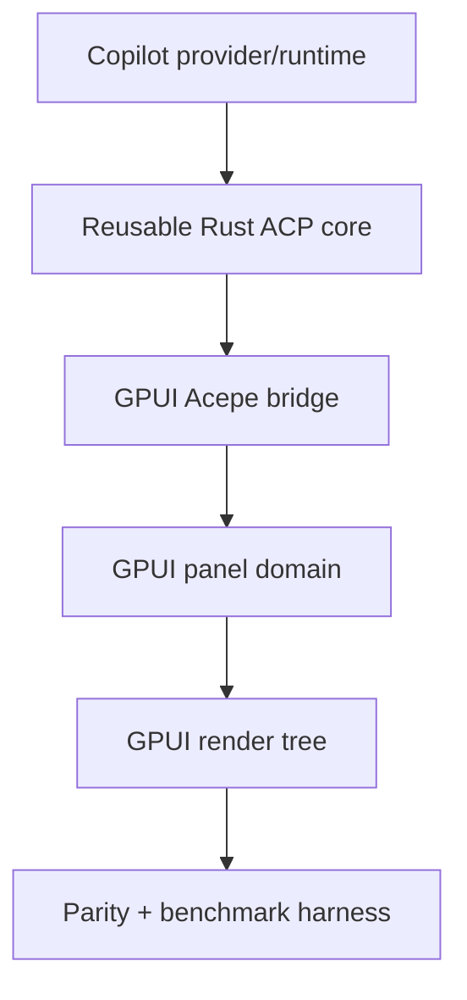
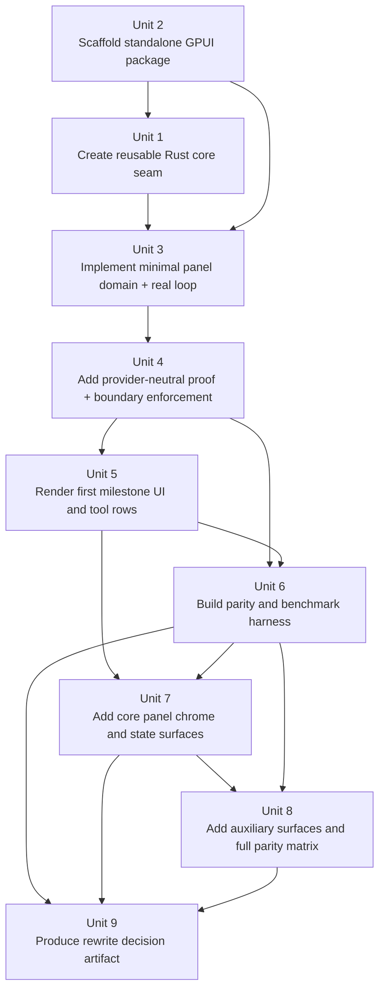

# feat: Build GPUI agent panel POC package

## Overview

Build a new in-repo Rust/GPUI sibling package that proves Acepe can render and run the agent panel outside the current Tauri/Svelte desktop shell while preserving provider-neutral architecture and reusing only pure logic, shared contracts, and adapter seams. The plan starts with a narrow but real first milestone — a standalone GPUI app with a content panel and text composer that can send a real Copilot-backed message, stream the response, and render live tool-call rows — then grows that slice into a parity-grade panel and benchmarkable rewrite probe.

This is not a bridge-heavy “Rust renders, TypeScript thinks” spike. The long-term shape is a Rust-owned GPUI panel, a Rust-owned provider-neutral panel domain, and adapters at the edge for reused Acepe runtime logic. The current desktop panel remains the design and behavior source of truth, but its Svelte component seams are not preserved as the target architecture.

Success on this panel POC is necessary but not sufficient evidence for broader rewrite planning. The final artifact should prove whether the hardest panel surface is credible in GPUI and make the remaining non-panel decision inputs explicit rather than collapsing them into an automatic product decision.

## Problem Frame

The origin requirements document establishes that the POC must answer a real rewrite-feasibility question rather than produce a generic GPUI demo (see origin: `docs/brainstorms/2026-04-13-gpui-agent-panel-poc-requirements.md`). Acepe’s current agent panel is the hardest desktop surface: long-lived session rendering, streaming output, tool-call inspection, composer/send flow, and provider-integrated runtime behavior all converge there. If GPUI cannot handle this surface cleanly, a broader rewrite is not credible.

At the same time, the POC must not accidentally preserve the wrong architecture. Existing institutional learnings already show that provider policy must stay in typed provider-owned contracts, scroll/follow behavior must keep one authoritative owner, and shared UI must not infer runtime policy from projections or presentation state. The plan therefore has to balance three truths:

1. the rendered panel should remain the same product surface,
2. the new package should depend only on pure/shared logic and reusable adapters,
3. the GPUI package should grow toward the architecture we would actually want to keep if the POC succeeds.

## Requirements Trace

- R1-R5. Reproduce the full visible panel eventually, but keep early work bounded to a sibling package plus the minimum supporting bridges.
- R6-R10. Treat the current desktop panel as the exact design/interaction source of truth and lock parity around named states rather than a single screenshot.
- R11-R16. Preserve provider-neutral architecture and prove it with an explicit panel-layer acceptance check.
- R17-R21. Use real Copilot-backed flows and avoid mocked substitutes for the core send/stream/tool lifecycle.
- R22-R29. Deliver the first executable milestone as a standalone content panel + composer with real send/stream behavior and constrained first-cut UX.
- R30-R36. Produce convincing benchmark evidence and a rewrite-readiness artifact rather than a hand-wavy qualitative conclusion.

## Scope Boundaries

- This plan targets a new sibling GPUI package and the minimum shared Rust extraction or bridging required to feed it.
- This plan does not replace `packages/desktop` as the shipping app during the POC.
- This plan does not preserve the current Svelte component decomposition as an architectural constraint.
- This plan does not require a second provider to work end-to-end during this phase.
- This plan does not require persistence, multi-session management, or full panel chrome in the first milestone.

### Deferred to Separate Tasks

- Full app-shell rewrite beyond the agent panel and its minimum supporting bridges.
- Broader provider rollout after Copilot-backed panel parity is credible.
- Session persistence, multi-session management, and non-panel desktop workflows in the GPUI app.

## Context & Research

### Relevant Code and Patterns

- `packages/desktop/src/lib/acp/components/agent-panel/components/agent-panel.svelte`
  - Canonical visible panel inventory and the clearest map of which surfaces are panel-local versus runtime-bound.
- `packages/desktop/src/lib/acp/components/agent-panel/scene/desktop-agent-panel-scene.ts`
  - Best current pure mapping seam from session/tool data into panel-facing models.
- `packages/desktop/src/lib/acp/store/api.ts`
  - Current frontend runtime boundary for session creation, resume, prompt send, stop, and projection fetch.
- `packages/desktop/src/lib/acp/store/session-event-service.svelte.ts`
  - Existing streaming/event lifecycle seam for assistant chunks, tool calls, permission/questions, and turn completion.
- `packages/desktop/src-tauri/src/acp/providers/copilot.rs`
  - Current Copilot provider seam, auth flow, mode mapping, session defaults, preconnection commands, and provider-owned replay behavior.
- `packages/desktop/src-tauri/src/acp/parsers/`
  - Existing Rust parser family for converting provider events into Acepe session updates.
- `packages/desktop/src/lib/acp/components/agent-panel/components/agent-panel-content.svelte`
  - Current thread container seam between panel shell and conversation rendering.
- `packages/desktop/src/lib/acp/components/agent-panel/components/virtualized-entry-list.svelte`
  - Canonical current behavior for long thread rendering, scroll callbacks, and virtualized row wiring.
- `packages/desktop/src/lib/acp/components/agent-panel/logic/thread-follow-controller.svelte.ts`
  - Current authoritative follow/reveal logic that should remain a reference, not be re-invented casually.
- `packages/desktop/src/lib/acp/components/agent-panel/logic/virtualized-entry-display.ts`
  - Stable thread keying and message/tool/thinking row display identity logic.
- `packages/desktop/src/lib/acp/components/agent-panel/scene/desktop-agent-panel-scene.test.ts`
  - Existing characterization coverage for panel-facing scene mapping.
- `packages/desktop/src/lib/acp/store/services/session-connection-manager.test.ts`
  - Existing runtime tests around connect/reconnect, provider metadata, and available-command hydration.

### Institutional Learnings

- `docs/solutions/best-practices/provider-owned-policy-and-identity-not-ui-projections-2026-04-09.md`
  - Provider policy, replay identity, and preconnection behavior must come from explicit provider metadata/contracts, not UI projections or labels.
- `docs/solutions/logic-errors/thinking-indicator-scroll-handoff-2026-04-07.md`
  - Reveal targeting and resize-follow targeting must stay separate; synthetic rows complicate scroll ownership.
- `docs/plans/2026-04-10-004-refactor-agent-panel-ui-extraction-reset-plan.md`
  - Use the real desktop panel as the baseline reference, extract leaf-first, and require parity artifacts rather than “looks similar” review.
- `docs/plans/2026-04-09-002-fix-finished-session-scroll-performance-plan.md`
  - Treat long transcript rendering as a localized performance contract with a fixed replay fixture, not an excuse to reopen architecture blindly.

### External References

- GPUI overview and patterns: `https://www.gpui.rs/`
- GPUI ownership/data-flow guidance: `https://zed.dev/blog/gpui-ownership`
- Zed architecture notes for GPUI usage context: `https://www.mintlify.com/zed-industries/zed/contributing/architecture`

Key external takeaways used here:
- GPUI is Rust-only, main-thread UI owned by one `Application`/`App`.
- State is best modeled as Rust-owned entities/models with explicit ownership rather than UI-local mutable islands.
- A GPUI app can keep background runtime tasks and provider adapters off the main thread while preserving one authoritative UI owner.

## Key Technical Decisions

| Decision | Rationale |
|---|---|
| Create a new sibling package at `packages/gpui-agent-panel-poc/` | Keeps the POC in-repo, slow-buildable, and isolated from the shipping desktop app while still enabling real reuse. |
| Introduce a small reusable Rust seam for pure ACP/provider logic instead of depending on desktop UI/runtime internals directly | The new package may reuse pure logic, shared contracts, and adapters, but should not couple itself to `packages/desktop` controller code, Svelte stores, window lifecycles, or desktop-only shell concerns. |
| Make the GPUI package Rust-owned end-to-end for the panel slice | Avoids the dead-end architecture where GPUI only paints a UI over TypeScript-owned panel logic. The bridge may carry raw provider/session events and command intents, but it may not carry precomputed panel state. |
| Use current Acepe thread/session shapes only as ingress compatibility contracts | Minimizes speculative redesign in the first milestone while still forcing an anti-corruption mapping into a GPUI-owned panel domain instead of leaking desktop or Copilot-shaped types into rendering. |
| Treat the first milestone as a narrow real loop, not a fake panel shell | A standalone content panel + composer with real send/stream/tool behavior proves the runtime seam faster than reproducing all chrome up front. |
| Add a package-local runtime host inside the GPUI package | The standalone app needs an explicit non-Tauri owner for auth bootstrap, session attach/start, command dispatch, cancellation, and event fan-out. That host should wrap `acp-core-rs` and any Tauri-replacement wrappers rather than leaving lifecycle ownership implicit. |
| Preserve provider neutrality with explicit proof artifacts | A single-provider POC can still be structurally agent-neutral if the ingress contracts, bridge outputs, panel domain, and dependency boundaries all make Copilot leaks testable through boundary tests and forbidden-dependency checks. |
| Invest in reusable parity/benchmark tooling only where it directly helps this POC | The requirements explicitly allow repo-grade validation tooling, but it must serve the panel proof rather than become a disconnected infrastructure project. No generalized validation-only layer should land before the real send/stream/tool loop works through production seams. |

## Open Questions

### Resolved During Planning

- **What plan depth fits this work?** Deep. The work spans a new Rust package, a reusable extraction seam, a real provider/runtime loop, parity validation, and a broader rewrite-readiness decision.
- **Should the GPUI package be standalone or hosted inside the current desktop app?** Standalone sibling package.
- **What is the first executable milestone?** A fixed-size standalone GPUI panel with only a content area and text composer, supporting an ephemeral multi-turn session, optimistic user messages, live assistant streaming, live tool-call rows, no auto-scroll, and simple error handling.
- **Should the POC preserve current Svelte component seams?** No. The rendered UI and visible behavior are authoritative; GPUI gets a fresh internal decomposition.
- **How strict should the performance decision bar be?** The benchmark protocol must be fixed, but the final pass/fail remains a human judgment over strong evidence rather than a single numeric threshold.

### Deferred to Implementation

- Which current Rust ACP/provider modules can move verbatim into a reusable crate and which need thin wrappers because they still assume Tauri-owned state like `AppHandle`.
- Which part of current thread-follow behavior must be mirrored in the first parity-capable GPUI scroll model versus deferred until after the minimal loop works.

## Locked Parity and Benchmark Protocol

The parity and benchmark contract is fixed at plan time so Unit 6 implements a committed protocol rather than choosing favorable evidence paths after seeing results.

| Protocol item | Locked rule |
|---|---|
| Desktop reference | Freeze one desktop reference revision before Unit 6 begins and record that revision in validation artifacts. |
| Theme and environment | Run desktop and GPUI captures under the same locked theme, display scale, and font configuration for all parity evidence. |
| First-milestone viewport | Use the single fixed viewport recorded in `packages/gpui-agent-panel-poc/fixtures/first_milestone_viewport.json`. |
| Parity state corpus | Drive named parity states from one canonical fixture corpus that maps directly to requirements inventory and parity matrices. |
| Capture method | Use fixture-driven captures for named parity states, plus live app captures for the first-milestone real loop, loaded-session proof, and benchmark scenarios. |
| Interaction evidence | Record executable interaction checks alongside screenshot/state artifacts for send/stop, tool-row inspect/expand, focus/selection, panel-local open/close, and scroll/follow where that behavior is in scope. |
| Benchmark scenarios | Keep one locked scenario list for first-milestone live streaming, loaded-session rendering, dense auxiliary-surface layout, and long finished-session review. |
| Benchmark metrics | Record the same metric set for both implementations: first-paint time, incremental update latency during streaming, long-session scroll/update latency in scoped scenarios, and peak memory during each scenario run. |
| Benchmark execution | Run 1 warm-up pass and 5 measured passes per scenario for both GPUI and desktop reference; report raw runs and median values only, with no per-surface custom rules. |
| Comparator output | Emit one comparator format that records reference revision, fixture id, viewport, capture path, interaction checks, and diff outcome for every reviewed state. |
| Negative controls | Include at least one intentionally drifted reference/control case so the harness must prove it can fail. |

## Output Structure

    packages/
      gpui-agent-panel-poc/
        Cargo.toml
        src/
          main.rs
          app/
            mod.rs
            window.rs
          panel/
            mod.rs
            domain/
              mod.rs
              thread.rs
              tool_calls.rs
              composer.rs
              contracts.rs
            integration/
              mod.rs
              runtime_host.rs
              acepe_bridge.rs
              copilot_runtime.rs
            render/
              mod.rs
              panel_root.rs
              content_panel.rs
              composer.rs
              thread_rows.rs
              tool_call_rows.rs
              header.rs
              footer.rs
              checkpoints.rs
              precomposer.rs
              review.rs
              plan.rs
              browser.rs
              terminal.rs
              attachments.rs
          validation/
            mod.rs
            parity/
              mod.rs
            benchmark/
              mod.rs
        fixtures/
          first_milestone_viewport.json
        tests/
          first_milestone_roundtrip.rs
          existing_session_load.rs
          runtime_host_bootstrap.rs
          provider_neutral_contract.rs
          provider_neutral_ingress_contract.rs
          forbidden_dependencies.rs
          parity_fixture_contract.rs
          benchmark_harness_contract.rs
          core_panel_parity_states.rs
          full_panel_parity_states.rs
        validation/
          parity_matrix.json
          README.md
          rewrite-readiness-report.md
      acp-core-rs/
        Cargo.toml
        runtime-compatibility-inventory.json
        src/
          lib.rs
          provider/
          parser/
          session/
          replay/
        tests/
          current_thread_shape_characterization.rs
          copilot_provider_contract.rs

## High-Level Technical Design

> *This illustrates the intended approach and is directional guidance for review, not implementation specification. The implementing agent should treat it as context, not code to reproduce.*

The intended execution shape is:

- reusable Rust ACP/provider logic sits below both the current desktop crate and the GPUI POC package,
- a package-local runtime host in the GPUI app owns auth/bootstrap, session attach/start, command dispatch, cancellation, and event delivery above that shared core,
- the GPUI package owns panel state and rendering in Rust,
- a thin bridge converts raw runtime/session/provider events into a provider-neutral panel domain,
- the parity and benchmark harness consume the same GPUI render/domain seams rather than inventing separate validation-only models.

## Phased Delivery

These phases describe the proof progression for the POC, not a strict implementation order. Execution order is governed by the dependency graph and implementation units below.

### Phase 1 — Real minimal loop

Ship the first executable milestone:

- standalone GPUI app in a sibling package
- fixed-size window
- content panel + text composer only
- optimistic user messages
- real Copilot-backed send
- streamed assistant output
- live tool-call rows using current visible relationship
- simple waiting treatment and simple error treatment

### Phase 2 — Architectural hardening

Stabilize the shape we would actually keep if the POC succeeds:

- reusable Rust ACP/provider seam
- provider-neutral panel domain
- explicit forbidden-dependency / panel contract proof
- characterization tests around current session/thread shapes

### Phase 3 — Full panel parity

Layer the rest of the visible panel back in:

- header/chrome
- footer/worktree controls
- plan/review/status surfaces
- attached-file, terminal, browser, and checkpoint surfaces
- parity-state fixtures and screenshot review flow

### Phase 4 — Rewrite decision evidence

Run the locked benchmark scenarios and produce the rewrite-readiness artifact:

- parity evidence
- benchmark evidence
- explicit unresolved non-panel risks
- decision inputs for or against broader rewrite planning

## Implementation Dependency Graph

## Parity Coverage Matrix

| Requirement state family | Owning units | Evidence |
|---|---|---|
| First-milestone live loop | Units 3, 5 | real roundtrip test, fixed-size screenshot pair, live tool-row behavior test |
| Existing-session attach and render | Units 3, 6, 9 | real loaded-session test, live app capture, benchmark artifact |
| Historical reading + streaming parity | Units 6-8 | shared parity fixtures, comparator output, state-by-state review artifact |
| Inspection and context surfaces | Units 7-8 | named fixture coverage and per-surface parity tests |
| Auxiliary surfaces | Unit 8 | auxiliary-surface state tests and screenshot comparisons |
| Rewrite-readiness conclusion | Units 4, 9 | benchmark artifact, provider-neutral proof artifact, unresolved-risk list, decision-input report |

## Interaction Parity Matrix

| Interaction family | Owning units | Evidence |
|---|---|---|
| Send and stop state | Units 3, 5 | live loop tests, comparator interaction record |
| Tool-row inspect/expand behavior | Units 5, 8 | executable interaction checks plus parity captures |
| Focus and selection behavior | Units 5, 8 | interaction checks tied to named parity states |
| Panel-local open/close and auxiliary toggles | Units 7-8 | state transition tests plus parity captures |
| Scroll/follow behavior in scoped states | Units 6-8 | scoped interaction checks and comparator output |

## Implementation Units

- [ ] **Unit 1: Create a reusable Rust ACP/provider seam for the GPUI package**

**Goal:** Extract or wrap the pure Rust ACP/provider/session parsing surface the GPUI package needs so the new package can reuse real Copilot-facing logic without depending on desktop UI internals.

**Requirements:** R11-R16, R17-R21, R30-R36

**Dependencies:** Unit 2

**Files:**
- Create: `packages/acp-core-rs/Cargo.toml`
- Create: `packages/acp-core-rs/runtime-compatibility-inventory.json`
- Create: `packages/acp-core-rs/src/lib.rs`
- Create: `packages/acp-core-rs/src/provider/mod.rs`
- Create: `packages/acp-core-rs/src/parser/mod.rs`
- Create: `packages/acp-core-rs/src/session/mod.rs`
- Create: `packages/acp-core-rs/src/replay/mod.rs`
- Modify: `packages/desktop/src-tauri/Cargo.toml`
- Modify: `packages/desktop/src-tauri/src/acp/providers/copilot.rs`
- Modify: `packages/desktop/src-tauri/src/acp/parsers/mod.rs`
- Create: `packages/acp-core-rs/tests/current_thread_shape_characterization.rs`
- Test: `packages/acp-core-rs/tests/copilot_provider_contract.rs`
- Test: `packages/desktop/src-tauri/tests/acp_core_integration.rs`

**Approach:**
- Carve out the minimum pure Rust seam the GPUI package needs: provider-neutral session updates, Copilot provider behavior, and parser/replay logic that do not require desktop UI ownership.
- Prefer moving or re-exporting existing pure code over inventing a second runtime implementation.
- Keep Tauri-owned state, window lifecycle, and desktop-only command plumbing above this seam.
- Record a runtime-compatibility inventory before Unit 3 begins: every current dependency on Tauri-owned state, the acceptable wrapper boundary for each one, and an explicit bailout rule if the extraction would require moving desktop controller or shell concerns into shared core.
- Cap this unit at the minimum extraction the GPUI runtime host needs for the real loop; anything not required by Units 2-3 stays in the desktop crate.
- Treat this as a bounded extraction for reuse, not a general-purpose rewrite of all desktop Rust modules.

**Execution note:** Start with characterization coverage around the extracted provider/session contracts before broadening the reusable surface. Unit 3 may not begin until `packages/acp-core-rs/runtime-compatibility-inventory.json` exists and records the bailout decision.

**Patterns to follow:**
- `packages/desktop/src-tauri/src/acp/providers/copilot.rs`
- `packages/desktop/src-tauri/src/acp/parsers/`
- `docs/solutions/best-practices/provider-owned-policy-and-identity-not-ui-projections-2026-04-09.md`

**Test scenarios:**
- Happy path — the extracted seam exposes the same Copilot auth/mode/replay behavior that the desktop crate currently uses.
- Happy path — the characterization corpus captures the current session/thread update shapes the GPUI package will receive through the seam.
- Edge case — provider-owned replay identity remains distinct from local Acepe session identity where current code requires it.
- Error path — missing Copilot auth still surfaces a provider-auth error through the extracted seam rather than being silently swallowed.
- Integration — the current desktop crate can consume the extracted seam without changing visible Copilot behavior.

**Verification:**
- A new Rust package can depend on a real ACP/provider seam from this repo without importing desktop UI/controller modules, `packages/acp-core-rs/runtime-compatibility-inventory.json` shows no hidden desktop-shell dependency and records the extraction decision, and existing desktop behavior remains intact.

- [ ] **Unit 2: Scaffold the standalone GPUI package and fixed-size application shell**

**Goal:** Create the new sibling package and boot a standalone GPUI application with a stable window and top-level app/domain ownership model.

**Requirements:** R5, R11-R16, R22-R29

**Dependencies:** None

**Files:**
- Create: `packages/gpui-agent-panel-poc/Cargo.toml`
- Create: `packages/gpui-agent-panel-poc/src/main.rs`
- Create: `packages/gpui-agent-panel-poc/src/app/mod.rs`
- Create: `packages/gpui-agent-panel-poc/src/app/window.rs`
- Create: `packages/gpui-agent-panel-poc/src/panel/mod.rs`
- Create: `packages/gpui-agent-panel-poc/src/panel/integration/runtime_host.rs`
- Create: `packages/gpui-agent-panel-poc/fixtures/first_milestone_viewport.json`
- Test: `packages/gpui-agent-panel-poc/tests/app_boot_smoke.rs`
- Test: `packages/gpui-agent-panel-poc/tests/runtime_host_bootstrap.rs`

**Approach:**
- Keep one GPUI application/window owner on the main thread and isolate background runtime work behind message-passing into the panel domain.
- Create a package-local runtime host that owns auth bootstrap, session attach/start, command dispatch, cancellation, and event fan-out for the standalone app.
- Use a single known-good window size for the first milestone and record that viewport explicitly in-repo so later screenshot/parity artifacts are comparable.
- Boot straight into the minimal panel surface rather than inventing startup navigation or shell chrome.
- Keep package boundaries obvious so future parity work can add surfaces without revisiting app ownership.

**Patterns to follow:**
- `packages/desktop/src-tauri/Cargo.toml`
- `packages/desktop/src/lib/acp/store/api.ts`
- GPUI ownership/data-flow guidance from `https://zed.dev/blog/gpui-ownership`

**Test scenarios:**
- Happy path — the GPUI app boots into the minimal content+composer layout with no desktop/Tauri shell dependency.
- Happy path — the runtime host can bootstrap auth/context and expose start/attach/cancel operations without a Tauri-owned app shell.
- Edge case — the window initializes with the fixed first-milestone dimensions and does not require responsive layout logic yet.
- Error path — startup failure from missing required runtime configuration is surfaced clearly rather than crashing without context.

**Verification:**
- The repo contains a runnable standalone GPUI package with a stable app/window root and explicit runtime host ready to host the panel domain and runtime bridge.

- [ ] **Unit 3: Build the Rust panel domain and real Copilot session loop**

**Goal:** Implement the first milestone’s provider-neutral panel domain and connect it to a real Copilot-backed ephemeral session loop.

**Requirements:** R11-R21, R22-R29

**Dependencies:** Units 1-2

**Files:**
- Create: `packages/gpui-agent-panel-poc/src/panel/domain/mod.rs`
- Create: `packages/gpui-agent-panel-poc/src/panel/domain/thread.rs`
- Create: `packages/gpui-agent-panel-poc/src/panel/domain/tool_calls.rs`
- Create: `packages/gpui-agent-panel-poc/src/panel/domain/composer.rs`
- Create: `packages/gpui-agent-panel-poc/src/panel/domain/contracts.rs`
- Create: `packages/gpui-agent-panel-poc/src/panel/integration/mod.rs`
- Create: `packages/gpui-agent-panel-poc/src/panel/integration/acepe_bridge.rs`
- Create: `packages/gpui-agent-panel-poc/src/panel/integration/copilot_runtime.rs`
- Test: `packages/gpui-agent-panel-poc/tests/first_milestone_roundtrip.rs`
- Test: `packages/gpui-agent-panel-poc/tests/existing_session_load.rs`
- Test: `packages/gpui-agent-panel-poc/tests/thread_domain_streaming.rs`
- Test: `packages/gpui-agent-panel-poc/tests/current_thread_shape_characterization.rs`

**Approach:**
- Use the current Acepe session/thread shapes as the initial contract where possible so the minimal loop does not require a speculative message-model redesign.
- Treat those current shapes as ingress-only compatibility contracts: the bridge must map them into a GPUI-owned panel domain before rendering.
- Model one ephemeral session with unlimited turns until restart.
- On submit, append the optimistic user row immediately, disable submit while streaming, start the Copilot turn, and feed assistant/tool updates into the Rust-owned thread state.
- Prove the same bridge can also attach to and render an existing real Copilot-backed session so the POC does not rely only on new-session happy paths.
- Keep waiting behavior simple: show the first-milestone “planning next move” treatment before the first assistant tokens appear.
- Keep failure behavior simple: surface an explicit panel error and failed tool rows without reproducing all current desktop recovery chrome.
- Freeze provider-neutral ingress and bridge-output contracts here so later UI work cannot smuggle Copilot-shaped state across the boundary.

**Execution note:** Implement new panel-domain behavior test-first; the minimal real loop is the highest-risk architectural seam in the first phase.

**Patterns to follow:**
- `packages/desktop/src/lib/acp/store/api.ts`
- `packages/desktop/src/lib/acp/store/session-event-service.svelte.ts`
- `packages/desktop/src/lib/acp/components/agent-panel/scene/desktop-agent-panel-scene.ts`

**Test scenarios:**
- Happy path — submitting a prompt creates an optimistic user row, starts a real Copilot turn, and streams assistant output into the thread.
- Happy path — multiple turns work in one ephemeral session until restart.
- Happy path — the GPUI panel can attach to and render an existing real Copilot-backed session through the same runtime seam.
- Happy path — the provider-neutral panel contracts are fixed before the UI layer depends on them.
- Happy path — ingress contracts and bridge outputs remain provider-neutral even when driven by real Copilot runtime events.
- Edge case — tool-call rows appear live as each tool starts and update as status changes.
- Edge case — submit remains disabled while a turn is streaming and re-enables when the turn completes.
- Error path — a failed request surfaces a simple panel error without corrupting the existing thread history.
- Error path — a failed tool call renders a failed tool row while preserving the rest of the thread.
- Integration — the bridge consumes real Copilot-backed session/runtime events through the reused repo seam rather than a mock transport.

**Verification:**
- The standalone GPUI package can send a real Copilot-backed prompt, stream a reply, attach to a real existing Copilot-backed session, and maintain a coherent multi-turn thread using Rust-owned state.

- [ ] **Unit 4: Add provider-neutral proof and dependency-boundary enforcement**

**Goal:** Make the single-provider POC structurally testable as agent-neutral across ingress contracts, bridge outputs, and panel-domain boundaries before first-slice UI parity expands.

**Requirements:** R11-R16, R30-R36

**Dependencies:** Unit 3

**Files:**
- Create: `packages/gpui-agent-panel-poc/tests/provider_neutral_contract.rs`
- Create: `packages/gpui-agent-panel-poc/tests/provider_neutral_ingress_contract.rs`
- Create: `packages/gpui-agent-panel-poc/tests/forbidden_dependencies.rs`
- Modify: `packages/gpui-agent-panel-poc/src/panel/integration/acepe_bridge.rs`

**Approach:**
- Enforce the provider-neutral contracts frozen in Unit 3 rather than defining them late.
- Add proof artifacts that can fail if ingress contracts, bridge outputs, or panel-domain modules depend on Copilot-specific concepts outside the adapter boundary.
- Use explicit forbidden-dependency coverage or equivalent contract assertions so the architecture claim is reviewable before UI parity work expands.
- Keep this proof focused on the panel path; it is not a fake second-provider implementation.

**Patterns to follow:**
- `docs/solutions/best-practices/provider-owned-policy-and-identity-not-ui-projections-2026-04-09.md`
- `packages/desktop/src/lib/services/acp-provider-metadata.ts`

**Test scenarios:**
- Happy path — ingress contracts and bridge outputs remain provider-neutral while accepting real session/thread/tool updates from Copilot-backed runtime events.
- Edge case — provider-specific metadata needed for Copilot behavior stays inside the adapter seam rather than leaking into bridge or panel-domain types.
- Error path — forbidden dependency coverage fails if GPUI integration/domain modules import Copilot-specific implementation details directly.
- Integration — swapping the bridge implementation shape without changing panel-domain or ingress contract types remains possible in principle.

**Verification:**
- The POC has an explicit, failing-if-broken artifact showing that ingress contracts, bridge outputs, and the panel layer stayed provider-neutral despite only Copilot being wired end-to-end.

- [ ] **Unit 5: Render the first-milestone thread, composer, and near-real tool-call rows**

**Goal:** Make the first milestone look and behave like a bounded, evidence-checked Acepe slice rather than a generic GPUI chat window.

**Requirements:** R6-R10, R22-R29

**Dependencies:** Units 3-4

**Files:**
- Create: `packages/gpui-agent-panel-poc/src/panel/render/mod.rs`
- Create: `packages/gpui-agent-panel-poc/src/panel/render/panel_root.rs`
- Create: `packages/gpui-agent-panel-poc/src/panel/render/content_panel.rs`
- Create: `packages/gpui-agent-panel-poc/src/panel/render/composer.rs`
- Create: `packages/gpui-agent-panel-poc/src/panel/render/thread_rows.rs`
- Create: `packages/gpui-agent-panel-poc/src/panel/render/tool_call_rows.rs`
- Test: `packages/gpui-agent-panel-poc/tests/thread_rendering_contract.rs`
- Test: `packages/gpui-agent-panel-poc/tests/tool_call_row_behavior.rs`

**Approach:**
- Recreate the Acepe visual language for the minimal slice: colors, spacing, rounding, thread structure, and visible tool-row relationship.
- Keep the first slice limited to content area + composer; no header, footer, or auto-scroll behavior yet.
- Preserve the current visible relationship between assistant rows and tool-call rows.
- Omit markdown rendering for this milestone, but shape rows so later parity work can layer richer formatting without a structural rewrite.
- Validate Unit 5 against the recorded first-milestone viewport, the locked comparator output, and the scoped interaction matrix rather than subjective visual comparison alone.
- Make first-slice acceptance evidence-based: fixed viewport match, tool-row relationship match, waiting-state behavior match, and no-auto-scroll behavior in the in-scope states.

**Patterns to follow:**
- `packages/desktop/src/lib/acp/components/agent-panel/components/agent-panel-content.svelte`
- `packages/desktop/src/lib/acp/components/agent-panel/components/virtualized-entry-list.svelte`
- `packages/ui/src/components/agent-panel/`
- `docs/plans/2026-04-10-004-refactor-agent-panel-ui-extraction-reset-plan.md`

**Test scenarios:**
- Happy path — the minimal GPUI content panel and composer match the Acepe slice at the chosen first-milestone size under the locked comparator protocol.
- Happy path — live tool-call rows appear inline with the same visible relationship Acepe uses today.
- Edge case — the waiting treatment appears before the first assistant tokens and disappears when real content arrives.
- Edge case — no auto-scroll behavior occurs while the thread is streaming.
- Error path — failed tool-call rows and simple panel errors remain visually legible without collapsing the thread.
- Integration — the render tree reflects domain changes incrementally during a live streamed turn rather than only on completion.

**Verification:**
- The first milestone clears an evidence-based acceptance bar for the in-scope Acepe slice instead of relying on “recognizable” or “close enough” review.

- [ ] **Unit 6: Build reusable parity fixtures and benchmark harnesses**

**Goal:** Create the reusable validation scaffolding needed to compare the GPUI panel to the current desktop panel and collect rewrite-decision evidence.

**Requirements:** R6-R10, R30-R36

**Dependencies:** Units 4-5

**Files:**
- Create: `packages/gpui-agent-panel-poc/src/validation/mod.rs`
- Create: `packages/gpui-agent-panel-poc/src/validation/parity/mod.rs`
- Create: `packages/gpui-agent-panel-poc/src/validation/benchmark/mod.rs`
- Create: `packages/gpui-agent-panel-poc/tests/parity_fixture_contract.rs`
- Create: `packages/gpui-agent-panel-poc/tests/benchmark_harness_contract.rs`
- Create: `packages/gpui-agent-panel-poc/fixtures/`
- Modify: `packages/desktop/src/lib/test/test-agent-panel-view.svelte`

**Approach:**
 - Lock named parity states and benchmark scenarios into one canonical fixture corpus and one comparator output format consumed by both the GPUI package and the current desktop reference path.
- Build only the reusable validation infrastructure that directly serves this POC and likely future GPUI validation work.
- Capture both parity evidence and performance/resource evidence through one coherent validation story instead of ad hoc reviewer judgment.
- Preserve the user’s role as the final benchmark judge by producing strong, inspectable evidence rather than a single numeric verdict.
- Freeze the desktop reference revision and add at least one negative-control check so the harness cannot silently certify self-generated drift as parity.

**Patterns to follow:**
- `docs/plans/2026-04-10-004-refactor-agent-panel-ui-extraction-reset-plan.md`
- `docs/plans/2026-04-09-002-fix-finished-session-scroll-performance-plan.md`

**Test scenarios:**
- Happy path — parity fixtures can drive the named panel states without hand-assembled ad hoc props or state mutations.
- Happy path — the benchmark harness can run the locked scenario set and emit comparable artifacts for GPUI and current desktop references.
- Edge case — auxiliary surface states and long finished-session states can be represented without mutating the benchmark contract per run.
- Error path — missing required fixture fields or unsupported state combinations fail fast instead of silently producing partial evidence.
- Integration — the same fixture/harness definitions are usable by both the GPUI package and the current desktop validation path where intended.

**Verification:**
- The repo has a reusable parity/benchmark validation seam that can support the final rewrite-readiness review without depending on manually reconstructed states.

- [ ] **Unit 7: Add core panel chrome and state surfaces**

**Goal:** Add the core panel chrome and primary state surfaces beyond the first milestone so the GPUI package reaches the main visual structure of the current desktop panel.

**Requirements:** R1-R10, R17-R21, R30-R33

**Dependencies:** Units 5-6

**Files:**
- Modify: `packages/gpui-agent-panel-poc/src/panel/render/panel_root.rs`
- Create: `packages/gpui-agent-panel-poc/src/panel/render/header.rs`
- Create: `packages/gpui-agent-panel-poc/src/panel/render/footer.rs`
- Create: `packages/gpui-agent-panel-poc/src/panel/render/checkpoints.rs`
- Create: `packages/gpui-agent-panel-poc/src/panel/render/precomposer.rs`
- Test: `packages/gpui-agent-panel-poc/tests/core_panel_parity_states.rs`

**Approach:**
- Layer surfaces back in according to the requirements inventory and parity states rather than whichever panel regions seem easiest.
- Preserve the fresh GPUI decomposition while matching the rendered UI and user-visible interaction model.
- Reuse the same panel domain and validation fixtures rather than introducing feature-specific local state pockets.
- Keep the first-milestone slice working throughout; this unit expands the panel rather than replacing it with a second implementation.
- Focus this unit on the panel shell, primary content regions, checkpoints/pre-composer cards, and state transitions that define the main reading/composing experience.

**Patterns to follow:**
- `packages/desktop/src/lib/acp/components/agent-panel/components/agent-panel.svelte`
- `docs/brainstorms/2026-04-13-gpui-agent-panel-poc-requirements.md`

**Test scenarios:**
- Happy path — each core named parity state from the requirements document is renderable and reviewable in the GPUI package.
- Edge case — pre-composer and checkpoint-style surfaces can appear in the expected panel regions without breaking thread rendering.
- Error path — error/install/reconnect/worktree-related states remain visually coherent when layered alongside the richer panel chrome.
- Integration — the full panel still consumes the same provider-neutral domain and bridge rather than bypassing them for later-added surfaces.

**Verification:**
- The GPUI package can render the core visible panel inventory required by the POC and can be compared state-by-state against the current desktop panel.

- [ ] **Unit 8: Add auxiliary surfaces and full parity matrix**

**Goal:** Add the remaining auxiliary surfaces and complete the parity matrix so the GPUI package covers the full visible panel inventory required by the POC.

**Requirements:** R1-R10, R17-R21, R30-R36

**Dependencies:** Units 6-7

**Files:**
- Modify: `packages/gpui-agent-panel-poc/src/panel/render/panel_root.rs`
- Create: `packages/gpui-agent-panel-poc/src/panel/render/review.rs`
- Create: `packages/gpui-agent-panel-poc/src/panel/render/plan.rs`
- Create: `packages/gpui-agent-panel-poc/src/panel/render/browser.rs`
- Create: `packages/gpui-agent-panel-poc/src/panel/render/terminal.rs`
- Create: `packages/gpui-agent-panel-poc/src/panel/render/attachments.rs`
- Create: `packages/gpui-agent-panel-poc/validation/parity_matrix.json`
- Test: `packages/gpui-agent-panel-poc/tests/full_panel_parity_states.rs`
- Test: `packages/gpui-agent-panel-poc/tests/auxiliary_surface_states.rs`

**Approach:**
- Finish the auxiliary panel regions after the core shell is stable so debugging stays localized and parity failures are attributable.
- Use the parity matrix as the explicit checklist tying requirements inventory to fixture coverage, screenshot coverage, and comparison output.
- Keep auxiliary surfaces on the same provider-neutral panel domain instead of inventing feature-local models or adapters.

**Patterns to follow:**
- `packages/desktop/src/lib/acp/components/agent-panel/components/agent-panel.svelte`
- `docs/brainstorms/2026-04-13-gpui-agent-panel-poc-requirements.md`

**Test scenarios:**
- Happy path — browser, terminal, review, plan, and attachment-related states render in the expected panel regions and map cleanly to named parity fixtures.
- Edge case — dense combinations of thread history plus auxiliary surfaces still preserve layout hierarchy and visible status cues.
- Error path — incomplete matrix coverage or missing fixture evidence fails parity review rather than being silently omitted.
- Integration — the parity matrix references the same fixture corpus and comparator outputs introduced in Unit 6.

**Verification:**
- The GPUI package covers the full visible panel inventory required by the POC, and every required surface is explicitly accounted for in the parity matrix.

- [ ] **Unit 9: Produce the rewrite decision artifact**

**Goal:** Turn the parity results, benchmark evidence, and remaining risks into a durable decision-ready artifact for whether broader GPUI rewrite planning should start.

**Requirements:** R30-R36

**Dependencies:** Units 6-8

**Files:**
- Create: `packages/gpui-agent-panel-poc/validation/rewrite-readiness-report.md`
- Create: `packages/gpui-agent-panel-poc/tests/rewrite_readiness_review.rs`
- Create: `packages/gpui-agent-panel-poc/validation/README.md`

**Approach:**
- Summarize parity outcomes, benchmark outcomes, provider-neutral proof, and explicit unresolved non-panel risks in one durable report at `packages/gpui-agent-panel-poc/validation/rewrite-readiness-report.md`.
- Keep the report grounded in locked fixture/harness outputs rather than subjective prose alone.
- Separate the conclusions into: panel-proof verdict, unresolved non-panel risks, and explicit decision inputs for broader rewrite planning.
- Allow the report to recommend next steps, but do not treat panel success as an automatic whole-product rewrite decision.

**Patterns to follow:**
- `docs/plans/2026-04-09-002-fix-finished-session-scroll-performance-plan.md`
- `docs/plans/2026-04-10-004-refactor-agent-panel-ui-extraction-reset-plan.md`

**Test scenarios:**
- Happy path — the validation outputs can be summarized into a rewrite-readiness report without inventing new evidence categories after implementation.
- Edge case — unresolved non-panel risks remain explicitly listed even when the panel POC succeeds strongly.
- Error path — incomplete parity coverage or incomplete benchmark evidence prevents a rewrite-positive artifact from being produced.
- Integration — the decision artifact references the same parity fixtures, benchmark harness outputs, and provider-neutral proof from earlier units.

**Verification:**
- Reviewers can decide whether the panel POC is rewrite-credible, and what additional non-panel decisions remain, from one evidence-backed artifact without re-running discovery work or reinterpreting the POC ad hoc.

## System-Wide Impact

- **Interaction graph:** current Copilot provider/runtime code, ACP parser/session update flow, the new GPUI panel domain, the current desktop reference panel, and the parity/benchmark harness all intersect.
- **Runtime ownership:** the standalone GPUI package now has an explicit runtime host for auth/bootstrap, session attach/start, cancellation, and event delivery instead of relying on an implicit Tauri-era owner.
- **Boundary hardening:** the shared Rust seam now explicitly stops below desktop controller/shell ownership, while the GPUI bridge stops at raw events and command intents rather than precomputed UI state.
- **Error propagation:** provider/auth/runtime failures should surface through the Rust bridge into explicit panel/domain error states, not crash the GPUI app or silently disappear.
- **State lifecycle risks:** optimistic user rows, live tool-call rows, and streamed assistant chunks create partial-state windows that the Rust panel domain must own coherently.
- **Ingress compatibility only:** current Acepe session/thread/tool shapes remain valid only at the bridge boundary; parity work depends on maintaining a clean anti-corruption mapping into the GPUI-owned panel contracts.
- **Reference integrity:** parity review depends on a frozen desktop reference revision, fixed viewport artifact, named fixture corpus, and comparator outputs that can catch drift rather than re-blessing it.
- **Integration coverage:** unit tests alone will not prove the real Copilot roundtrip, live tool-call timing, backpressure/cancellation handling, or parity/benchmark evidence quality; each of those needs cross-layer validation.
- **Unchanged invariants:** `packages/desktop` remains the shipping product surface during this POC, provider policy stays behind typed provider-owned seams, and no second provider is required to work end-to-end in this phase.

## Risk Analysis & Mitigation

| Risk | Likelihood | Impact | Mitigation |
|------|-----------|--------|------------|
| Extracting reusable Rust ACP/provider code broadens into a generic runtime refactor | Medium | High | Keep Unit 1 scoped to the minimum seam the GPUI package needs, require the runtime-compatibility inventory, and bail out if the extraction would pull desktop controller or shell ownership into shared core. |
| The first milestone becomes a dead-end mini chat app instead of the foundation for the real panel | Medium | High | Keep the first slice on the same panel domain, thread relationship, and validation path that later full-panel parity will reuse. |
| Single-provider success still hides Copilot-shaped assumptions | Medium | High | Freeze provider-neutral panel contracts in Unit 3, then enforce them with forbidden-dependency and bridge-boundary tests in Unit 4 before first-slice UI parity expands. |
| Scroll/follow behavior becomes a rabbit hole too early | High | Medium | Keep no auto-scroll in the first milestone and use current desktop follow logic as a later parity reference, not a day-one requirement. |
| Reusable parity/benchmark tooling becomes its own project | Medium | Medium | Only build reusable validation pieces that directly serve this POC’s locked parity states and benchmark scenarios. |
| Pixel-parity expectations stall delivery before the runtime loop is proven | Medium | High | Sequence real loop first, then parity surfaces, while keeping the current desktop panel as the strict reference throughout. |
| High-frequency streaming or tool-call bursts overwhelm the GPUI panel domain | Medium | High | Exercise burst fixtures and real streaming flows before full parity signoff, and keep the bridge/event model explicit enough to reason about buffering and cancellation behavior. |
| Desktop reference drift invalidates parity evidence mid-project | Medium | High | Freeze the desktop reference revision and comparator format in Unit 6, and fail review when parity evidence is produced against an unpinned or mutated reference. |
| Cancellation, restart, or failed tool rows behave differently between the live loop and parity fixtures | Medium | Medium | Include negative-control fixture coverage for failed/incomplete states and require the same bridge/domain path for both live runs and screenshot fixtures. |

## Documentation / Operational Notes

- Add package-local development notes for the new GPUI package once the scaffold exists so future work can launch and validate it without rediscovery.
- Capture the locked parity contract and benchmark protocol beside the validation harness once those units land.
- Keep the final rewrite-readiness artifact explicit about remaining non-panel risks rather than implying full-app proof.

## Sources & References

- **Origin document:** `docs/brainstorms/2026-04-13-gpui-agent-panel-poc-requirements.md`
- Related code:
  - `packages/desktop/src/lib/acp/components/agent-panel/components/agent-panel.svelte`
  - `packages/desktop/src/lib/acp/components/agent-panel/scene/desktop-agent-panel-scene.ts`
  - `packages/desktop/src/lib/acp/store/api.ts`
  - `packages/desktop/src/lib/acp/store/session-event-service.svelte.ts`
  - `packages/desktop/src-tauri/src/acp/providers/copilot.rs`
- Related plans and learnings:
  - `docs/plans/2026-04-10-004-refactor-agent-panel-ui-extraction-reset-plan.md`
  - `docs/plans/2026-04-09-002-fix-finished-session-scroll-performance-plan.md`
  - `docs/solutions/best-practices/provider-owned-policy-and-identity-not-ui-projections-2026-04-09.md`
  - `docs/solutions/logic-errors/thinking-indicator-scroll-handoff-2026-04-07.md`
- External docs:
  - `https://www.gpui.rs/`
  - `https://zed.dev/blog/gpui-ownership`
  - `https://www.mintlify.com/zed-industries/zed/contributing/architecture`
