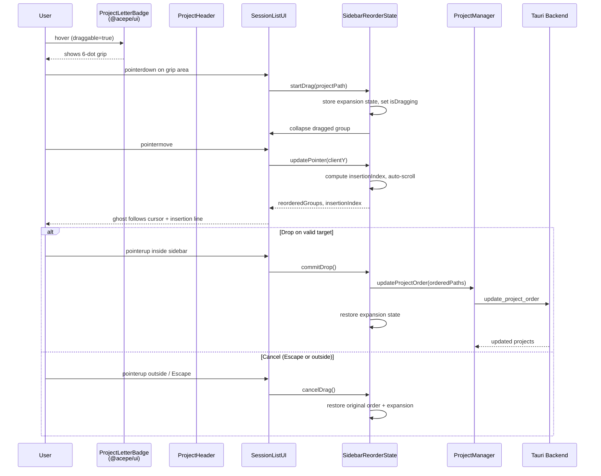

# feat: Drag-to-reorder projects in the sidebar

## Overview

Add drag-to-reorder and context-menu reorder to the project sidebar. Users hover a project's letter badge to reveal a 6-dot grip, drag to reorder, and the new order persists across restarts via the existing `updateProjectOrder` backend path. A context-menu Move Up/Down fallback ensures keyboard-only users can reorder too.

## Problem Frame

The sidebar sorts projects by creation time, which stops matching how people prioritize work as the list grows. A community user requested drag-to-reorder in issue #97. The backend already supports persisted ordering (`ProjectRepository::reorder`, `updateProjectOrder`), but the frontend ignores `sortOrder` and provides no UI to trigger reorder.

(see origin: `docs/brainstorms/2026-04-14-project-sidebar-reorder-requirements.md`)

## Requirements Trace

- R1. Hovering a project's letter badge transforms it into a 6-dot grip icon
- R2. Grip icon appears on hover only — at rest the badge displays its normal appearance
- R3. Pressing and dragging the grip initiates a reorder drag
- R4. Grabbing collapses the project group to badge-only height; prior expansion state restores on drop/cancel
- R5. Semi-transparent ghost of the collapsed badge follows the cursor
- R6. Insertion line between projects indicates the drop target
- R7. Releasing over a valid insertion target commits the new order; releasing outside the sidebar or pressing Escape cancels
- R8. Reordered position persists across restarts
- R9. Auto-scroll near sidebar edges during drag
- R10. Optimistic UI with silent rollback on persistence failure
- R11. Context menu Move Up / Move Down as keyboard-only fallback

## Scope Boundaries

- Sidebar project list only — pickers, kanban, and other project surfaces are not in scope
- No edit mode or toggle — hover-to-reveal grip keeps reorder always available
- Discoverability hints (tooltips, onboarding) deferred — context-menu provides secondary discovery; hover-only grip is a known tradeoff accepted for V1

### Accessibility

- Move Up/Move Down available in the project context menu, which is keyboard-accessible via the existing bits-ui `ContextMenu` (right-click or Shift+F10)
- After a move operation, an ARIA live region announces "Moved {project name} to position {N} of {M}" so screen-reader users get confirmation
- Focus returns to the moved project's context menu trigger after reorder for consecutive keyboard moves

### Deferred to Separate Tasks

- Touch/mobile drag (Tauri desktop-only for now)
- Cross-sidebar-section drag (e.g., between pinned/unpinned groups, if added later)

## Context & Research

### Relevant Code and Patterns

**Backend (complete, no changes needed):**
- `packages/desktop/src-tauri/src/db/repository.rs:261-298` — `ProjectRepository::reorder()` accepts full ordered path array, sets `sort_order`
- `packages/desktop/src-tauri/src/storage/commands/projects.rs:294-308` — `update_project_order` Tauri command
- `packages/desktop/src/lib/utils/tauri-client/projects.ts:41-43` — JS invoke wrapper
- `packages/desktop/src/lib/acp/logic/project-client.ts:131-135` — `updateProjectOrder()` returns mapped `Project[]`
- `packages/desktop/src/lib/acp/logic/project-manager.svelte.ts:284-287` — `updateProjectOrder()` updates `this.projects`
- Backend `get_all()` already orders by `SortOrder ASC, CreatedAt DESC` (repository.rs:199-205)

**Frontend sort (needs change):**
- `packages/desktop/src/lib/acp/components/session-list/session-list-logic.ts:35-44` — `createLoadingSessionGroups()` sorts by `createdAt` desc
- `packages/desktop/src/lib/acp/components/session-list/session-list-logic.ts:447-488` — `createSessionGroups()` sorts by `createdAt` desc via `projectCreatedAtMap`
- The `Project` type already has `sortOrder` (project-manager.svelte.ts:17, project-client.ts:50)

**Sidebar rendering:**
- `session-list.svelte:141-149` — derives `sessionGroups` from `logic.createSessionGroups()`
- `session-list-ui.svelte:1013` — iterates `sessionGroups` with `{#each sessionGroups as group}`
- `session-list-ui.svelte:152-158` — `collapsedProjects` SvelteSet + `expandedProjects` derived Set
- `session-list-ui.svelte:254-264` — `toggleProject()` manages collapse state

**Badge component:**
- `packages/ui/src/components/project-letter-badge/project-letter-badge.svelte` — props: `name`, `color`, `iconSrc?`, `size?`, `fontSize?`, `sequenceId?`, `showLetter?`, `class?`
- No `draggable` or grip-related prop exists — must be added

**Project header:**
- `packages/desktop/src/lib/acp/components/project-header.svelte` — renders badge, display name, caret; `expanded` prop controls visual state
- Click handler lives in parent (`session-list-ui.svelte:1027-1041`), not in header itself

**Context menu pattern:**
- `session-list-ui.svelte:976-989` — `ContextMenu.Root > Trigger > Content > Item` from bits-ui
- Existing items: Change icon, Reset icon

**Pointer event pattern (precedent):**
- `packages/desktop/src/lib/acp/components/resize-handle.svelte:11-36` — uses `onpointerdown`, `pointermove`, `pointerup` for resize dragging

**Existing tests:**
- `packages/desktop/src/lib/acp/components/session-list/__tests__/session-list-logic.test.ts` — tests `createDisplayItems`, `createSessionGroups`, etc.
- `packages/desktop/src-tauri/src/db/repository_test.rs:111` — `project_repository_reorders_projects_and_persists_icon_path`

### Institutional Learnings

- **Single source of truth for order** — desktop/store owns canonical sidebar order; `@acepe/ui` components stay presentational and emit callbacks (see `docs/solutions/logic-errors/kanban-live-session-panel-sync-2026-04-02.md`)
- **Unconditional snippet props** — if snippets are used for drag overlays, define `{#snippet}` unconditionally with conditions inside the body (see `docs/solutions/best-practices/svelte5-unconditional-snippet-props-2026-04-12.md`)
- **Separate visual tracking from model state** — drag preview/highlight state must be separate from persisted order source. Don't overload one "current target" for all behaviors (see `docs/solutions/logic-errors/thinking-indicator-scroll-handoff-2026-04-07.md`)
- **No split-brain state** — sidebar UI must not maintain an independent reordered model while the store owns another. Project order from the real backing store
- **Complex logic in `.svelte.ts` state classes** — reorder hit-testing, auto-scroll, and commit/cancel belong in a state class, not inline in the template
- **No `$effect` for drag state** — use event handlers + parent-owned state instead
- **DOM event props** — use `onclick`, `onpointerdown` etc., not `on:` directives
- **No spread syntax** — explicitly enumerate properties

## Key Technical Decisions

- **Pointer events over HTML5 Drag API**: The resize-handle already uses pointer events. HTML5 drag has poor cross-platform feel in Tauri (ghost image rendering varies, no fine cursor control). Pointer events give full control over ghost rendering and insertion line positioning.

- **Sort by `sortOrder` from Project model**: The `Project` type already carries `sortOrder` from the backend. Instead of maintaining a separate `projectCreatedAtMap` for sorting, sort `sessionGroups` by `sortOrder` directly (falling back to `createdAt` desc for equal values). This is simpler and automatically respects backend-persisted order.

- **Badge grip as a prop, not CSS-only**: Adding a `draggable` prop to `project-letter-badge` is cleaner than a CSS-only hover swap because: (a) the desktop controller decides when grip is available, (b) other surfaces that render badges (pickers, kanban) won't accidentally get grip behavior, (c) it follows the established presentational-component pattern where behavior is opt-in via props.

- **Reorder state as a `.svelte.ts` class**: Following the codebase pattern (`SessionListState`, `ProjectManager`), drag state lives in a dedicated class with rune-based reactive properties. The class manages drag lifecycle, insertion index, auto-scroll, and collapse/restore — keeping the template clean.

- **Optimistic reorder with rollback**: On drop, update the local `sessionGroups` order immediately (via reordering the `projects` array in ProjectManager), then persist. If persistence fails, restore the previous array. The user sees instant feedback in the common case.

## Open Questions

### Resolved During Planning

- **Drag implementation approach**: Pointer events with a portal overlay (consistent with resize-handle pattern, better Tauri cross-platform feel). See Key Technical Decisions.
- **Badge structural changes for grip**: Prop-based (`draggable` boolean). On hover when true, CSS swaps letter for 6-dot grip SVG. Minimal structural change.
- **Collapse/expand animation on grab**: Instant collapse (no transition) — drag should feel immediate. Re-expand on drop/cancel uses a CSS height transition (~200ms ease-out) on the project group container; `prefers-reduced-motion` skips the transition. Same animation for both drop and cancel.
- **Where does reorder state live**: New `SidebarReorderState` class in `session-list/sidebar-reorder-state.svelte.ts`, instantiated by `session-list-ui.svelte`.
- **How does the sorted project order propagate**: `createSessionGroups` and `createLoadingSessionGroups` will accept a `projectSortOrderMap` (or use the project's `sortOrder` directly) to sort groups by persisted order instead of creation time.

### Deferred to Implementation

- Exact auto-scroll speed curve and edge detection threshold — tune during implementation
- Exact grip icon SVG — 6-dot pattern, implementation chooses the asset

## High-Level Technical Design

> *This illustrates the intended approach and is directional guidance for review, not implementation specification. The implementing agent should treat it as context, not code to reproduce.*

## Implementation Units

- [ ] **Unit 1: Sort sidebar groups by persisted sortOrder**

  **Goal:** Make the sidebar respect the backend's persisted project order instead of sorting by creation time.

  **Requirements:** R8 (foundation — reorder must be visible)

  **Dependencies:** None

  **Files:**
  - Modify: `packages/desktop/src/lib/acp/components/session-list/session-list-logic.ts`
  - Modify: `packages/desktop/src/lib/acp/components/session-list/session-list.svelte` (pass sortOrder data)
  - Test: `packages/desktop/src/lib/acp/components/session-list/__tests__/session-list-logic.test.ts`

  **Approach:**
  - Add a `projectSortOrderMap: Map<string, number>` parameter to `createSessionGroups()` alongside the existing `projectCreatedAtMap`
  - Change the sort comparator to sort by `sortOrder ASC` with `createdAt DESC` as tiebreaker (matching backend behavior)
  - Update `createLoadingSessionGroups()` similarly — sort by `sortOrder` from the `Project` objects it already receives
  - In `session-list.svelte`, derive `projectSortOrderMap` from `recentProjects` and pass it through

  **Patterns to follow:**
  - Existing `projectCreatedAtMap` derivation in `session-list.svelte:123`
  - Existing sort comparator structure in `session-list-logic.ts:483-487`

  **Test scenarios:**
  - Happy path: Three projects with sortOrder 2, 0, 1 → groups appear in order 0, 1, 2
  - Happy path: Loading state respects sortOrder, not createdAt
  - Edge case: Projects with undefined sortOrder treated as `Infinity` (sort to end), falling back to createdAt desc
  - Edge case: All projects have same sortOrder → fall back to createdAt desc (preserves current behavior for un-reordered workspaces)

  **Verification:**
  - `bun test` passes with new sort tests
  - `bun run check` passes

- [ ] **Unit 2: Add grip hover state to project-letter-badge**

  **Goal:** When `draggable` is true, hovering the badge swaps the letter/icon for a 6-dot grip icon, signaling the project is draggable.

  **Requirements:** R1, R2

  **Dependencies:** None (can be done in parallel with Unit 1)

  **Files:**
  - Modify: `packages/ui/src/components/project-letter-badge/project-letter-badge.svelte`

  **Approach:**
  - Add `draggable?: boolean` prop (default `false`)
  - When `draggable` is true, add a grip overlay element (6-dot SVG or CSS grid of dots) that is hidden by default and shown via CSS `:hover` on the badge wrapper
  - On hover, hide the letter/icon content and show the grip via a non-layout-shifting crossfade (opacity transition, ~150ms ease, with `prefers-reduced-motion` fallback to instant swap); on un-hover, restore
  - The grip element should use `cursor: grab` to signal draggability
  - The existing badge structure (`` wrapper → badge `
` → letter/image) stays intact; the grip is a sibling or overlay that toggles visibility
  - Keep the component fully presentational — no drag event handling here

  **Patterns to follow:**
  - Existing hover transitions in `project-header.svelte:59` (`hover:bg-background/70 transition-colors`)
  - Tailwind utility classes for conditional visibility (`group-hover:opacity-100 opacity-0`)

  **Test scenarios:**
  - Happy path: Badge with `draggable={true}` renders a grip element that is hidden at rest
  - Happy path: Badge with `draggable={false}` (default) renders no grip element at all
  - Edge case: Badge with `iconSrc` (custom icon, not letter) — grip still appears on hover, replacing the icon
  - Edge case: Badge with `sequenceId` — grip replaces the letter but sequence pill remains visible

  **Verification:**
  - Component renders correctly in `@acepe/ui` (visible in website package with mock data)
  - `bun run check` passes in both `packages/ui` and `packages/desktop`

- [ ] **Unit 3: Create SidebarReorderState class**

  **Goal:** Encapsulate all drag-to-reorder state and logic in a reactive state class: drag lifecycle, insertion index computation, auto-collapse/restore, auto-scroll, and reorder commitment.

  **Requirements:** R3, R4, R5, R6, R7, R9, R10

  **Dependencies:** Unit 1 (needs sortOrder-based ordering to compute correct ordered arrays)

  **Files:**
  - Create: `packages/desktop/src/lib/acp/components/session-list/sidebar-reorder-state.svelte.ts`
  - Create: `packages/desktop/src/lib/acp/components/session-list/__tests__/sidebar-reorder-state.test.ts`

  **Approach:**
  - Class with `$state` runes: `isDragging`, `draggedProjectPath`, `insertionIndex`, `ghostY`, `autoScrollDirection`
  - `startDrag(projectPath, groupElements, collapsedProjects)`: records which project is being dragged, snapshots current expansion state of that project, signals the caller to collapse it
  - `updatePointer(clientY, containerRect, groupRects)`: computes which gap the pointer is over (insertion index), determines auto-scroll direction if near edges
  - `commitDrop(currentGroups): string[]`: computes the full ordered array of project paths with the dragged item in its new position. Returns the array for the caller to pass to `updateProjectOrder`
  - `cancelDrag()`: resets all drag state, signals caller to restore expansion
  - `preCollapsedPaths`: set of project paths that were expanded before drag started (for R4 restore)
  - Insertion index computation: based on pointer Y position relative to group element midpoints, excluding the dragged project from the candidate gap list (or adjusting the index when the source is before the target) to avoid off-by-one errors on downward moves
  - The class does NOT call `updateProjectOrder` itself — it returns the ordered array and the caller (session-list-ui) handles persistence. This keeps the class testable without mocking Tauri

  **Execution note:** Start with a failing test for the core insertion-index computation, then build outward.

  **Patterns to follow:**
  - `SessionListState` class in `session-list-state.svelte.ts` for reactive state class pattern
  - `ProjectManager` class for `$state` rune usage in classes

  **Test scenarios:**
  - Happy path: `startDrag` sets `isDragging` to true, records `draggedProjectPath`
  - Happy path: `updatePointer` with Y between group 1 and group 2 → `insertionIndex` = 1
  - Happy path: `commitDrop` with 3 groups, dragged from index 0 to insertion 2 → returns `[path1, path2, path0]`
  - Happy path: `cancelDrag` resets `isDragging`, clears `draggedProjectPath`
  - Edge case: Drag to same position → `commitDrop` returns original order (caller can skip persistence)
  - Edge case: `updatePointer` above first group → `insertionIndex` = 0
  - Edge case: `updatePointer` below last group → `insertionIndex` = lastIndex
  - Edge case: Single project → `commitDrop` returns single-element array (no-op)
  - Integration: `startDrag` records pre-drag expansion state; after `commitDrop`/`cancelDrag`, `preCollapsedPaths` is available for caller to restore

  **Verification:**
  - All unit tests pass
  - `bun run check` passes

- [ ] **Unit 4: Wire drag interaction into sidebar UI**

  **Goal:** Connect the reorder state class to the sidebar template: pointer event handlers on project headers, ghost overlay rendering, insertion line indicator, Escape-to-cancel, and auto-scroll.

  **Requirements:** R3, R4, R5, R6, R7, R9

  **Dependencies:** Unit 2 (badge grip), Unit 3 (reorder state class)

  **Files:**
  - Modify: `packages/desktop/src/lib/acp/components/session-list/session-list-ui.svelte`
  - Modify: `packages/desktop/src/lib/acp/components/project-header.svelte` (pass `draggable` to badge, forward pointer events)
  - Modify: `packages/desktop/src/lib/acp/components/session-list/session-list.svelte` (thread `onReorderProjects` callback)

  **Approach:**
  - Instantiate `SidebarReorderState` in `session-list-ui.svelte`
  - On `pointerdown` on the badge/grip area of a project header:
    - Call `reorderState.startDrag(projectPath, ...)`
    - Collapse the dragged project group (add to `collapsedProjects`)
    - Set pointer capture on the sidebar container
  - On `pointermove` (while dragging):
    - Call `reorderState.updatePointer(e.clientY, ...)`
    - Position the ghost overlay at `reorderState.ghostY`
    - Show insertion line at the computed gap
    - Trigger auto-scroll if near edges
  - On `pointerup` (while dragging):
    - Check pointer coordinates against the live sidebar container rect to determine commit vs cancel (pointer capture means pointerup always fires on the capture element regardless of pointer position)
    - If coordinates are inside sidebar and over a valid insertion target: `reorderState.commitDrop(sessionGroups)` → call `onReorderProjects(orderedPaths)`
    - If coordinates are outside sidebar: `reorderState.cancelDrag()` → restore expansion
  - On `keydown` Escape (while dragging): `reorderState.cancelDrag()`
  - Ghost overlay: a fixed-position `
` containing a `ProjectLetterBadge` clone of the dragged project, at ~50% opacity, following the pointer Y
  - Insertion line: a horizontal bar (`2px height, accent color`) positioned between project group elements at the insertion index
  - During drag, suppress the normal click-to-expand behavior on project headers
  - Pass `draggable={true}` to `ProjectLetterBadge` inside `ProjectHeader` for all project headers (always available)

  **Patterns to follow:**
  - `resize-handle.svelte` pointer event pattern (pointerdown → set capture → pointermove → pointerup → release)
  - `collapsedProjects` SvelteSet for managing collapse state
  - Existing `ProjectHeader` / `ProjectLetterBadge` rendering in `session-list-ui.svelte:1027-1074`

  **Test scenarios:**
  - Happy path: Pointer down on grip → drag starts, project collapses to badge-only
  - Happy path: Ghost follows cursor vertically during drag
  - Happy path: Insertion line appears between correct project groups as pointer moves
  - Happy path: Pointer up inside sidebar → order commits, expansion restores
  - Happy path: Escape key during drag → cancels, restores original order and expansion
  - Happy path: Pointer up outside sidebar → cancels drag
  - Happy path: Auto-scroll triggers when dragging near top/bottom edges of sidebar
  - Edge case: Click on project header (no drag) still toggles expand/collapse normally
  - Integration: Full drag flow — grip down → move across groups → drop → `onReorderProjects` called with correct order

  **Verification:**
  - Drag-to-reorder works visually in the running app
  - Normal sidebar click behavior unaffected
  - `bun run check` passes

- [ ] **Unit 5: Persist reorder and handle optimistic rollback**

  **Goal:** Wire the `onReorderProjects` callback from the sidebar to `ProjectManager.updateProjectOrder`, with optimistic update and rollback on failure.

  **Requirements:** R7, R8, R10

  **Dependencies:** Unit 4 (provides the `onReorderProjects` callback)

  **Files:**
  - Modify: `packages/desktop/src/lib/components/main-app-view/components/sidebar/app-sidebar.svelte` (thread callback to SessionList, wire ProjectManager call)

  **Approach:**
  - Add `onReorderProjects?: (orderedPaths: string[]) => void` prop to `SessionList` and `SessionListUI`
  - In `app-sidebar.svelte`, pass an `onReorderProjects` handler that calls `projectManager.updateProjectOrder(orderedPaths)`
  - `updateProjectOrder` already updates `this.projects` on success (project-manager.svelte.ts:284-287)
  - For optimistic behavior: before calling the backend, apply the new order to `projectManager.projects` immediately by rewriting each project's `sortOrder` to match the drop position. Snapshot the pre-reorder projects array first. If persistence fails, restore the snapshot. This ensures the sidebar (which sorts by `sortOrder` after Unit 1) reflects the new order instantly
  - Reorders are serialized: while a reorder is in flight, subsequent drag-drop or Move Up/Down operations are blocked (the grip/context-menu items become inert until the pending reorder resolves). This avoids rollback-overwrites-newer-success race conditions without adding complexity
  - Since `updateProjectOrder` uses `ResultAsync`, chain `.mapErr()` to handle rollback
  - If the backend returns a different order than requested, adopt the backend's order as canonical (backend is source of truth). Update local `projects` to match the returned order rather than treating mismatch as failure
  - The sidebar re-derives `sessionGroups` reactively when `projectManager.projects` changes, so no manual UI update needed

  **Patterns to follow:**
  - Existing callback threading: `onRemoveProject`, `onChangeProjectIcon` flow through `app-sidebar.svelte` → `session-list.svelte` → `session-list-ui.svelte`

  **Test scenarios:**
  - Happy path: Reorder 3 projects → `updateProjectOrder` called with correct 3-element array → projects update reactively
  - Error path: Backend persistence fails → projects array reverts to pre-reorder order
  - Edge case: Reorder to same position → no backend call (short-circuit when order unchanged)
  - Edge case: Rapid reorder attempt while one is in flight → second attempt is no-op (serialization guard)
  - Edge case: Backend returns different order than requested → UI adopts backend order

  **Verification:**
  - Reorder persists across app restart
  - Failed persistence rolls back visually
  - `bun run check` passes

- [ ] **Unit 6: Context menu Move Up / Move Down**

  **Goal:** Add Move Up and Move Down actions to the project context menu as a keyboard-accessible alternative to drag-to-reorder.

  **Requirements:** R11

  **Dependencies:** Unit 1 (sort by sortOrder), Unit 5 (persistence wiring)

  **Files:**
  - Modify: `packages/desktop/src/lib/acp/components/session-list/session-list-ui.svelte` (add context menu items)

  **Approach:**
  - In the existing `<ContextMenu.Content>` for each project group, add two items: "Move Up" and "Move Down"
  - Compute whether each action is available: first project disables Move Up, last project disables Move Down
  - On click: compute the new ordered array by swapping the project with its neighbor in the current `sessionGroups` order, then call `onReorderProjects(orderedPaths)`
  - Use existing Phosphor icons (e.g., `ArrowUp`, `ArrowDown` — already imported in session-list-ui.svelte)
  - Add i18n keys for the menu item labels (import via `$lib/messages.js` alias; source file is `packages/desktop/src/lib/messages.ts` / Paraglide pipeline)
  - After a Move Up/Down completes and the list re-renders, focus should return to the moved project's context menu trigger in its new position so keyboard users can perform consecutive moves without renavigating
  - Add an ARIA live region (`aria-live="polite"`) in the sidebar that announces "Moved {project name} to position {N} of {M}" after any reorder (drag or context menu). This provides screen-reader feedback for non-visual users

  **Patterns to follow:**
  - Existing context menu items in `session-list-ui.svelte:976-988` (icon + label pattern)
  - i18n keys in `packages/desktop/src/lib/messages.js` (Paraglide)

  **Test scenarios:**
  - Happy path: Move Down on first project → swaps with second, persists
  - Happy path: Move Up on last project → swaps with second-to-last, persists
  - Edge case: First project → Move Up item is disabled/hidden
  - Edge case: Last project → Move Down item is disabled/hidden
  - Edge case: Single project → both items disabled/hidden

  **Verification:**
  - Context menu shows Move Up/Down for projects
  - Reorder via context menu persists across restart
  - `bun run check` passes

## System-Wide Impact

- **Interaction graph:** Pointer events on the project header (drag) must not conflict with the existing click-to-expand handler or the context menu trigger. During drag, click-to-expand is suppressed. The `ContextMenu.Trigger` wraps the header — drag interaction starts on the badge grip specifically, not the full header, to avoid conflict.
- **Error propagation:** `updateProjectOrder` returns `ResultAsync` — errors are handled via `.mapErr()` rollback. No toast or user notification on failure (R10: silent rollback).
- **State lifecycle risks:** Optimistic update creates a brief window where local state diverges from backend. If the app crashes during this window, the backend has the old order and the next load is consistent. No partial-write risk.
- **API surface parity:** The reorder backend API is unchanged. No other surfaces (kanban, pickers) are affected.
- **Integration coverage:** The full flow (pointer down → drag → drop → persist → restart → same order) should be verified end-to-end. Unit tests cover the state machine; manual testing covers the visual interaction.
- **Unchanged invariants:** Session list filtering, session display within groups, file tree view, project creation/deletion, and agent strip behavior are unaffected. The only change to existing rendering is the sort order of groups.

## Risks & Dependencies

| Risk | Mitigation |
|------|------------|
| Pointer capture conflicts with context menu | Drag starts only on badge grip area; context menu trigger wraps the full header. Pointer capture is released before context menu can open. |
| Collapse/expand flicker during drag | Collapse is instant (no transition); restore on drop/cancel uses a ~200ms ease-out CSS height transition with reduced-motion fallback. SidebarReorderState snapshots expansion state. |
| `sessionGroups` derivation re-fires during drag | The drag ghost and insertion line use state from `SidebarReorderState`, not re-derived `sessionGroups`. Groups only re-derive on actual commit. |
| Auto-scroll interferes with insertion index | Auto-scroll updates container scroll position; `updatePointer` uses `clientY` relative to viewport, not scroll-dependent coordinates. |

## Sources & References

- **Origin document:** [docs/brainstorms/2026-04-14-project-sidebar-reorder-requirements.md](docs/brainstorms/2026-04-14-project-sidebar-reorder-requirements.md)
- Related issue: #97
- Related code: `ProjectRepository::reorder` (repository.rs:261), `updateProjectOrder` (project-manager.svelte.ts:284)
- Related test: `project_repository_reorders_projects_and_persists_icon_path` (repository_test.rs:111)
- Institutional learning: `docs/solutions/logic-errors/kanban-live-session-panel-sync-2026-04-02.md` (single source of truth for state)
- Institutional learning: `docs/solutions/logic-errors/thinking-indicator-scroll-handoff-2026-04-07.md` (separate visual tracking from model)
