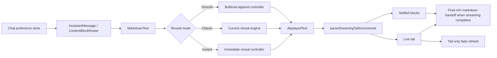

# feat: Add selectable streaming animation modes

## Overview

Add a persisted chat preference that lets users choose how assistant messages animate while streaming: `Smooth`, `Classic`, or `Instant`. The implementation should keep upstream chunk ingestion unchanged, introduce a mode-aware reveal boundary inside desktop message rendering, and make `Smooth` the default with buffered append plus a tail-only fade.

## Problem Frame

Acepe's current streaming message presentation is a single hardcoded reveal style that feels less polished than the smooth append behavior users expect from premium chat products. We need a better default without removing the current behavior for users who prefer it, and we need the choice to persist cleanly in the desktop app's existing settings system (see origin: `docs/brainstorms/2026-04-14-streaming-animation-modes-requirements.md`).

## Requirements Trace

- R1. Expose exactly three streaming animation modes: `Smooth`, `Classic`, and `Instant`.
- R2. Default to `Smooth` when no explicit preference has been saved.
- R3. Apply the selected mode consistently to assistant message streaming in the agent panel.
- R4. Implement `Smooth` as buffered append rather than character-by-character reveal.
- R5. Limit `Smooth` motion treatment to the newly appended tail.
- R6. Preserve the current reveal behavior as `Classic`.
- R7. Render immediately in `Instant`.
- R8. Place the control in the Chat settings section.
- R9. Persist the selected mode across app restarts.
- R10. Make the options understandable in the settings UI without trial-and-error.

## Scope Boundaries

- No reduced-motion-specific behavior is included in this change.
- No provider-side or Rust-side streaming transport changes are included.
- No per-session or per-panel animation overrides are included.
- No redesign of non-message loading animations is included.

## Context & Research

### Relevant Code and Patterns

- `packages/desktop/src/lib/acp/components/messages/markdown-text.svelte` owns reveal orchestration, incremental streaming-tail parsing, settled/live rendering, and the handoff from streaming to final markdown.
- `packages/desktop/src/lib/acp/components/messages/logic/create-streaming-reveal.svelte.ts` and `packages/desktop/src/lib/acp/components/messages/logic/streaming-reveal-engine.ts` are the current hardcoded Classic reveal path and the natural abstraction seam for introducing multiple reveal modes.
- `packages/desktop/src/lib/acp/components/messages/logic/parse-streaming-tail.ts` already provides the stable settled/live split needed for Smooth tail-only rendering.
- `packages/desktop/src/lib/acp/components/messages/logic/streaming-tail-refresh.ts` is the existing hook for live-tail visual refresh and should be adapted rather than bypassed.
- `packages/desktop/src/lib/acp/components/messages/assistant-message.svelte` ensures only the last assistant text group is treated as streaming; the plan should preserve that invariant.
- `packages/desktop/src/lib/acp/components/agent-panel/components/virtualized-entry-list.svelte` limits streaming behavior to the active tail entry and supplies `revealMessageKey` for remount/reseed behavior.
- `packages/desktop/src/lib/acp/store/chat-preferences-store.svelte.ts` is the existing chat preference persistence pattern to extend.
- `packages/desktop/src/lib/services/converted-session-types.ts` holds the `UserSettingKey` union that must include any new persisted setting key.
- `packages/desktop/src/lib/components/settings-page/sections/chat-section.svelte` is the intended settings surface.
- `packages/desktop/src/lib/components/settings-page/sections/voice-section.svelte` shows the existing radio-group pattern for a mutually exclusive setting with custom row styling.
- `packages/desktop/src/lib/messages.ts` is the localization surface for settings labels, descriptions, and option copy.

### Institutional Learnings

- `docs/solutions/logic-errors/thinking-indicator-scroll-handoff-2026-04-07.md` — keep resize-follow and reveal-target semantics separate; new animation behavior must not destabilize scroll-follow for the active streaming row.
- `docs/solutions/logic-errors/operation-interaction-association-2026-04-07.md` — source streaming state from canonical controller/store logic rather than per-component heuristics.
- `docs/solutions/best-practices/provider-owned-policy-and-identity-not-ui-projections-2026-04-09.md` — do not couple animation policy to provider-specific display projections; treat animation mode as a UI preference applied to normalized stream state.
- `.agent-guides/svelte.md` and `AGENTS.md` — preserve Svelte 5 patterns, keep behavior changes test-first, and avoid pushing app logic into reusable UI packages.

### External References

- None. The codebase already has strong local patterns for streaming state, settings persistence, and settings UI.

## Key Technical Decisions

- **Reveal strategy boundary lives in desktop message rendering:** keep upstream session aggregation and `AssistantMessage` group selection unchanged; switch behavior inside `markdown-text.svelte` and message logic helpers so all modes share the same streaming entry selection and final markdown handoff.
- **Persist the mode as a chat preference:** extend `ChatPreferencesStore` rather than creating a second preference store so the setting lives with other conversation-display defaults.
- **Reuse the existing `streaming_animation` persisted key:** treat the Rust enum and generated TypeScript union as the storage source of truth, and map any legacy stored values into the new three-mode model during preference initialization instead of inventing a parallel key.
- **Use a radio-group style control in Chat settings:** the existing small trailing-toggle `SettingsControlCard` pattern is not a good fit for three explanatory options; mirror the voice-model single-select pattern inside the Chat section instead.
- **Model behavior through a mode-aware reveal controller contract:** `Classic` uses the existing reveal engine, `Instant` returns the full source immediately, and `Smooth` uses a buffered append scheduler that reveals stable text batches and exposes the current displayed text through the same contract.
- **Keep `Smooth` compatible with incremental tail parsing:** only the displayed-text producer changes by mode; settled/live section parsing and stable keys remain the shared rendering path so markdown stability and final rich-render handoff stay consistent across modes.
- **Tail fade is applied to append deltas, not the whole live section:** adapt the live-tail refresh path so new appended content gets a subtle refresh while already displayed content and settled blocks remain visually stable.
- **Mode changes apply to newly started streamed assistant entries:** if the user changes the setting while an assistant entry is already streaming, that in-flight entry continues with its current controller and the new mode takes effect on the next streamed assistant entry. This keeps scope bounded and aligns with the current UI's streaming boundary.
- **Both streamed thought text and streamed reply text follow the selected mode:** `markdown-text.svelte` is the shared streaming surface for both, so the setting should apply consistently anywhere the current reveal path appears in the assistant message UI.
- **Capture the mode at streamed-entry start, then pass it down:** latch the selected animation mode when an assistant entry becomes the active streamed item, then pass that entry-scoped mode through the text-rendering path so cold-start preference hydration and mid-stream settings changes cannot mutate an in-flight reveal.
- **Store latched mode in streamed-entry continuity state, not component instance state:** virtualization and remounts can recreate `AssistantMessage`, so the captured mode must be keyed by the same streamed-entry identity already used for reveal continuity and survive component remount until that entry completes or is replaced.
- **Preference hydration is a startup prerequisite for latching:** initialize chat preferences before the session UI begins latching streamed-entry animation modes so persisted `Classic` or `Instant` users do not receive a mismatched first stream after relaunch.

## Open Questions

### Resolved During Planning

- **Where should the reveal strategy boundary live?** In desktop message rendering: `markdown-text.svelte` should select a mode-aware reveal controller while keeping upstream session/chunk handling unchanged.
- **What settings control fits best?** A radio-group style control in `packages/desktop/src/lib/components/settings-page/sections/chat-section.svelte`, following the single-select row pattern already used in `voice-section.svelte`.
- **How should Smooth batch streaming?** Use a short buffered append cadence tuned for visual smoothness without noticeable lag: first visible text should appear within one short buffer window, active streaming should flush on a steady small interval rather than per grapheme, active batches should stay bounded to avoid bursty jumps, and completion should drain the remaining backlog immediately once streaming ends.
- **How should the tail-only fade be introduced?** By extending the existing live-tail refresh behavior so appended text segments trigger a subtle fade treatment without reanimating settled content or the entire live section.
- **What should Classic mean after the refactor?** Classic remains the current typing-style incremental reveal path: no buffering, no tail-only fade treatment, and the same completion handoff semantics that exist today.
- **How should the settings choices be presented?** Order the options as `Smooth`, `Classic`, `Instant` with short explanatory copy: Smooth = buffered, calmer append; Classic = current typing-style reveal; Instant = immediate, no animation.
- **What happens if streaming starts before preferences are ready?** Treat chat preference hydration as a startup prerequisite for new streamed-entry mode latching rather than inventing a one-off fallback mode.

### Deferred to Implementation

- Exact numeric buffer cadence and maximum append batch thresholds for `Smooth`; the plan fixes the UX envelope, but implementation should tune final constants against the existing frontend chunk cadence.
- Whether the tail-only fade is best expressed by a wrapper span strategy, an action-driven class toggle, or a small render-segment helper inside `markdown-text.svelte`; the plan fixes the behavior, not the exact DOM micro-shape.

## High-Level Technical Design

> *This illustrates the intended approach and is directional guidance for review, not implementation specification. The implementing agent should treat it as context, not code to reproduce.*

## Implementation Units

- [ ] **Unit 1: Add persisted streaming animation preference and settings UI**

**Goal:** Introduce a chat preference for the three streaming modes, default it to `Smooth`, and expose it clearly in the Chat settings section.

**Requirements:** R1, R2, R8, R9, R10

**Dependencies:** None

**Files:**
- Modify: `packages/desktop/src/lib/acp/store/chat-preferences-store.svelte.ts`
- Modify: `packages/desktop/src/lib/components/main-app-view.svelte`
- Modify: `packages/desktop/src/lib/components/settings-page/sections/chat-section.svelte`
- Modify: `packages/desktop/src/lib/messages.ts`
- Create: `packages/desktop/src/lib/acp/types/streaming-animation-mode.ts`
- Test: `packages/desktop/src/lib/acp/store/__tests__/chat-preferences-store.vitest.ts`
- Test: `packages/desktop/src/lib/components/settings-page/sections/chat-section.svelte.vitest.ts`

**Approach:**
- Introduce a shared mode type/constants module in the ACP type layer so persistence, settings, and rendering use one exact three-mode source of truth.
- Extend `ChatPreferencesStore` with the mode value and optimistic persistence using the existing `streaming_animation` setting key.
- Map legacy stored values on initialization (`typewriter` -> `Classic`, `none` -> `Instant`, `fade`/`glow` -> `Smooth`, unknown values -> `Smooth`) so existing installs converge cleanly on the new model.
- Initialize chat preferences during app bootstrap before session rendering relies on the mode so the first streamed response after launch uses the persisted preference instead of a temporary fallback.
- Replace the simple trailing-toggle control for this setting with a radio-group style presentation inside the Chat settings section so each option can carry explanatory copy in the order `Smooth`, `Classic`, `Instant`.
- Keep the default behavior in the store rather than encoding defaults ad hoc in rendering components.

**Patterns to follow:**
- `packages/desktop/src/lib/acp/store/chat-preferences-store.svelte.ts`
- `packages/desktop/src/lib/acp/store/plan-preference-store.svelte.ts`
- `packages/desktop/src/lib/components/settings-page/sections/voice-section.svelte`

**Test scenarios:**
- Happy path — with no saved value, store initialization exposes `Smooth` as the default mode.
- Happy path — when the user selects `Classic`, the store updates immediately and persists the new value through `tauriClient.settings.set`.
- Happy path — when the user selects `Instant`, the Chat settings control reflects that selection and the other modes are unselected.
- Happy path — the Chat settings control presents the options in the order `Smooth`, `Classic`, `Instant`, and each option includes copy that distinguishes buffered append, current typing-style reveal, and no animation.
- Edge case — legacy stored values are mapped into the new three-mode model on initialization without crashing or leaving the store unset.
- Integration — app startup hydrates the chat preference before the first streamed assistant entry is eligible to latch its entry-scoped mode.
- Error path — if settings persistence fails, the UI state remains updated while a warning path is exercised consistently with existing preference-store behavior.
- Integration — a previously saved mode round-trips through `initialize()` and renders the correct selected option in the Chat settings section.

**Verification:**
- The Chat settings section presents all three options with descriptive labels, and the selected value is restored on reload with `Smooth` as the fallback.

- [ ] **Unit 2: Introduce a mode-aware reveal controller contract**

**Goal:** Replace the single hardcoded reveal implementation with a shared controller interface that can support `Smooth`, `Classic`, and `Instant` without changing upstream streaming data flow.

**Requirements:** R1, R2, R3, R4, R6, R7

**Dependencies:** Unit 1

**Files:**
- Modify: `packages/desktop/src/lib/acp/components/messages/logic/create-streaming-reveal.svelte.ts`
- Modify: `packages/desktop/src/lib/acp/components/messages/logic/streaming-reveal-engine.ts`
- Create: `packages/desktop/src/lib/acp/components/messages/logic/create-streaming-reveal-controller.svelte.ts`
- Create: `packages/desktop/src/lib/acp/components/messages/logic/create-smooth-streaming-reveal.svelte.ts`
- Test: `packages/desktop/src/lib/acp/components/messages/logic/__tests__/create-streaming-reveal-controller.test.ts`
- Test: `packages/desktop/src/lib/acp/components/messages/logic/__tests__/create-smooth-streaming-reveal.test.ts`
- Test: `packages/desktop/src/lib/acp/components/messages/logic/__tests__/create-streaming-reveal.test.ts`
- Test: `packages/desktop/src/lib/acp/components/messages/logic/__tests__/streaming-reveal-engine.test.ts`

**Approach:**
- Preserve the existing Classic implementation behind a shared controller contract instead of inlining mode checks throughout `markdown-text.svelte`.
- Add an Instant implementation that surfaces the full source immediately while still participating in the same lifecycle API.
- Add a Smooth implementation that buffers append-only source growth into small scheduled batches, preserving append stability and exposing the currently displayed text through the same contract.
- Keep remount-safe seeding and lifecycle methods (`setState`, `reset`, `destroy`, active-state reporting) consistent across modes so message rendering logic does not branch on engine internals.
- Make scheduled work generation-scoped so stale RAF or timeout callbacks cannot append after a reset, destroy, completion, or remount.
- Tie reveal continuity to a stream-generation-aware identity instead of a bare stable key so seeding cannot leak across replaced or completed streams.

**Execution note:** Start with failing logic-layer tests for the new controller modes and transitions before replacing the current single-engine wiring.

**Patterns to follow:**
- `packages/desktop/src/lib/acp/components/messages/logic/create-streaming-reveal.svelte.ts`
- `packages/desktop/src/lib/acp/components/messages/logic/streaming-reveal-engine.ts`

**Test scenarios:**
- Happy path — Classic mode preserves the current frame-by-frame reveal progression for append-only streaming text.
- Happy path — Instant mode exposes the full source text immediately while `isStreaming` remains true.
- Happy path — Smooth mode reveals appended text in buffered batches rather than grapheme-by-grapheme slices.
- Edge case — reset, destroy, completion, and remount all cancel stale scheduled Smooth work so old batches cannot append after lifecycle changes.
- Edge case — remounting with the same `revealKey` during an active stream does not visibly restart the reveal path.
- Error path — non-append source replacement falls back to the mode's reset semantics without leaving stale backlog state behind.
- Integration — when streaming flips from active to complete, all three modes converge on a fully revealed source and report inactive state consistently.

**Verification:**
- A single reveal-controller API can drive all three modes, and existing Classic behavior remains covered by regression tests.

- [ ] **Unit 3: Wire mode-aware rendering and tail-only fade into markdown streaming**

**Goal:** Apply the selected mode inside `markdown-text.svelte`, keep settled/live section behavior stable, and implement Smooth tail-only fade without disturbing final markdown rendering.

**Requirements:** R3, R4, R5, R6, R7

**Dependencies:** Unit 2

**Files:**
- Modify: `packages/desktop/src/lib/acp/components/messages/markdown-text.svelte`
- Modify: `packages/desktop/src/lib/acp/components/messages/content-block-router.svelte`
- Modify: `packages/desktop/src/lib/acp/components/messages/acp-block-types/text-block.svelte`
- Modify: `packages/desktop/src/lib/acp/components/messages/logic/streaming-tail-refresh.ts`
- Modify: `packages/desktop/src/lib/acp/components/messages/assistant-message.svelte`
- Test: `packages/desktop/src/lib/acp/components/messages/markdown-text.svelte.vitest.ts`
- Test: `packages/desktop/src/lib/acp/components/messages/assistant-message.svelte.vitest.ts`
- Test: `packages/desktop/src/lib/acp/components/messages/logic/__tests__/streaming-tail-refresh.vitest.ts`

**Approach:**
- Latch the selected animation mode in streamed-entry continuity state when an assistant entry becomes the active streamed item, using the already-hydrated chat preference; pass the entry-scoped value through `assistant-message.svelte`, `content-block-router.svelte`, and `text-block.svelte` into `markdown-text.svelte`.
- Keep `parseStreamingTailIncremental()` as the shared path for streaming markup stability so settled sections remain stable across append-only growth for all modes.
- Adapt live-tail refresh behavior so Smooth can animate only newly appended tail content instead of refreshing the entire live section.
- Preserve the existing streaming-to-final-render handoff: while a mode is still actively revealing, stay on the streaming-tail path; once inactive, allow the final markdown rendering, repo context, and badge mounting path to run as it does today.
- Guard the final rich-render swap by the latest text/context generation so stale async completions cannot replace newer content after trailing chunks or context changes.
- Keep reveal seeding, latched mode, and continuity state aligned to the same streamed-entry identity so remounts preserve the current live entry but completed or replaced streams clear cleanly.

**Execution note:** Add characterization coverage around the current Classic streaming behavior before refactoring `markdown-text.svelte` so the plan preserves the intended settled/live semantics.

**Patterns to follow:**
- `packages/desktop/src/lib/acp/components/messages/markdown-text.svelte`
- `packages/desktop/src/lib/acp/components/messages/logic/parse-streaming-tail.ts`
- `packages/desktop/src/lib/acp/components/messages/logic/streaming-tail-refresh.ts`

**Test scenarios:**
- Happy path — in Smooth mode, appended text appears in buffered chunks and only the newest tail content receives the fade treatment.
- Happy path — in Classic mode, current settled/live markdown behavior remains unchanged, including open fenced code handling.
- Happy path — in Instant mode, the full live tail text is visible immediately while final rich markdown still waits until streaming completes.
- Edge case — settled sections keep the same DOM identity and keys while append-only content expands the live tail.
- Edge case — when the revealed text currently has no live section, rendering stays visually stable and does not create a phantom animation target.
- Edge case — an in-flight streamed assistant entry keeps its latched mode even if the user changes the global preference before that entry finishes streaming.
- Edge case — a cold-start or restored session uses the hydrated persisted preference when the first streamed assistant entry latches its mode, rather than defaulting incorrectly.
- Integration — when streaming completes, final markdown rendering replaces the streaming-tail view once the active reveal backlog drains.
- Integration — streamed thought text and streamed reply text both honor the selected mode because they share the same `markdown-text.svelte` reveal seam.

**Verification:**
- The selected mode changes only the live streaming presentation, not which entry streams, not settled-block stability, and not final markdown rendering behavior.

- [ ] **Unit 4: Preserve end-to-end streaming and follow behavior across mode changes**

**Goal:** Add regression coverage for the interaction between the new animation modes, active-stream targeting, remount behavior, and thread-follow mechanics.

**Requirements:** R2, R3, R4, R5, R6, R7, R9

**Dependencies:** Units 1-3

**Files:**
- Modify: `packages/desktop/src/lib/acp/components/agent-panel/components/__tests__/virtualized-entry-list.svelte.vitest.ts`
- Modify: `packages/desktop/src/lib/acp/components/messages/markdown-text.svelte.vitest.ts`
- Modify: `packages/desktop/src/lib/acp/components/messages/assistant-message.svelte.vitest.ts`

**Approach:**
- Add integration-focused regression coverage for the path that marks only the last assistant entry and last text group as streaming.
- Protect remount and seeded reveal behavior so virtualization or session-view churn does not restart Smooth or Classic mid-stream.
- Cover the handoff from active streaming to completed rendering so `Instant` does not accidentally bypass the final render contract and `Smooth` does not thrash scroll-follow with excessive live-row churn.
- Bound preference-application scope: changing the setting during an active streamed assistant entry should not mutate that entry's reveal mode, but newly started streamed entries should honor the updated preference.
- Keep tests scoped to meaningful user-visible behavior rather than implementation details of internal scheduler timing.

**Patterns to follow:**
- `packages/desktop/src/lib/acp/components/agent-panel/components/__tests__/virtualized-entry-list.svelte.vitest.ts`
- `packages/desktop/src/lib/acp/store/__tests__/session-event-service-streaming.vitest.ts`
- `docs/solutions/logic-errors/thinking-indicator-scroll-handoff-2026-04-07.md`

**Test scenarios:**
- Happy path — only the newest visible assistant entry receives live streaming mode behavior while earlier entries stay static.
- Edge case — virtualization remount with a stable reveal key does not replay Classic or Smooth from the beginning.
- Edge case — changing the animation preference during an active stream leaves the in-flight streamed entry stable and applies the new mode to the next streamed entry.
- Edge case — if trailing assistant chunks arrive after stream completion, the selected mode still converges on the correct final rendered content.
- Integration — the active streaming row continues to drive reveal/follow behavior while settled history remains untouched.
- Integration — switching between Smooth, Classic, and Instant does not change which entries the UI considers streaming or which row drives thread-follow behavior.

**Verification:**
- Mode selection is proven not to change upstream stream targeting or downstream thread-follow correctness.

## System-Wide Impact

- **Interaction graph:** `ChatPreferencesStore` feeds the selected mode into message rendering; `AssistantMessage` and `VirtualizedEntryList` continue deciding which streamed assistant entry/group is live; `markdown-text.svelte` and message logic helpers decide how that live text is revealed.
- **Error propagation:** preference persistence failures should follow existing optimistic-store warning behavior; rendering-mode failures should degrade to a stable revealed text path rather than blocking message visibility; stale async final-render completions must be rejected if they no longer match the latest text/context generation.
- **State lifecycle risks:** remount/reseed behavior, generation-safe cancellation of scheduled Smooth work, bounded preference-application timing, and trailing post-complete chunks are the main lifecycle hazards; the plan keeps one shared reveal lifecycle contract to reduce divergence between modes.
- **API surface parity:** only desktop message rendering and desktop settings should change; upstream provider/session APIs and non-message animations remain unchanged.
- **Integration coverage:** verification must cover virtualized message lists, live tail rendering, completion handoff, and persisted preference restore together, not just isolated unit logic.
- **Unchanged invariants:** only the last assistant entry and the last text subgroup inside it remain eligible for streaming behavior; settled markdown sections remain stable once parsed; final rich markdown rendering still occurs after streaming reveal finishes.

## Risks & Dependencies

| Risk | Mitigation |
|------|------------|
| Smooth buffering introduces noticeable lag | Keep buffering bounded and verify behavior with logic and rendering tests focused on prompt visibility rather than raw frame counts |
| Tail-only fade reanimates too much content | Adapt the existing live-tail refresh mechanism so only appended tail deltas trigger animation |
| Legacy `streaming_animation` values conflict with the new three-mode model | Map old values into `Smooth` / `Classic` / `Instant` during preference initialization and cover the mapping in store tests |
| Virtualization/remount breaks reveal continuity | Preserve `revealKey` seeding behavior and cover remount scenarios in message and list tests |
| Instant mode bypasses final markdown handoff | Keep `Instant` inside the same streaming/render lifecycle instead of short-circuiting directly to final HTML |

## Documentation / Operational Notes

- Add settings copy in `packages/desktop/src/lib/messages.ts` describing the three modes clearly.
- No separate user-facing documentation or rollout controls are required for this change.

## Sources & References

- **Origin document:** `docs/brainstorms/2026-04-14-streaming-animation-modes-requirements.md`
- Related code: `packages/desktop/src/lib/acp/components/messages/markdown-text.svelte`
- Related code: `packages/desktop/src/lib/acp/components/messages/logic/create-streaming-reveal.svelte.ts`
- Related code: `packages/desktop/src/lib/acp/components/messages/logic/parse-streaming-tail.ts`
- Related code: `packages/desktop/src/lib/acp/store/chat-preferences-store.svelte.ts`
- Related learnings: `docs/solutions/logic-errors/thinking-indicator-scroll-handoff-2026-04-07.md`
- Related learnings: `docs/solutions/logic-errors/operation-interaction-association-2026-04-07.md`
