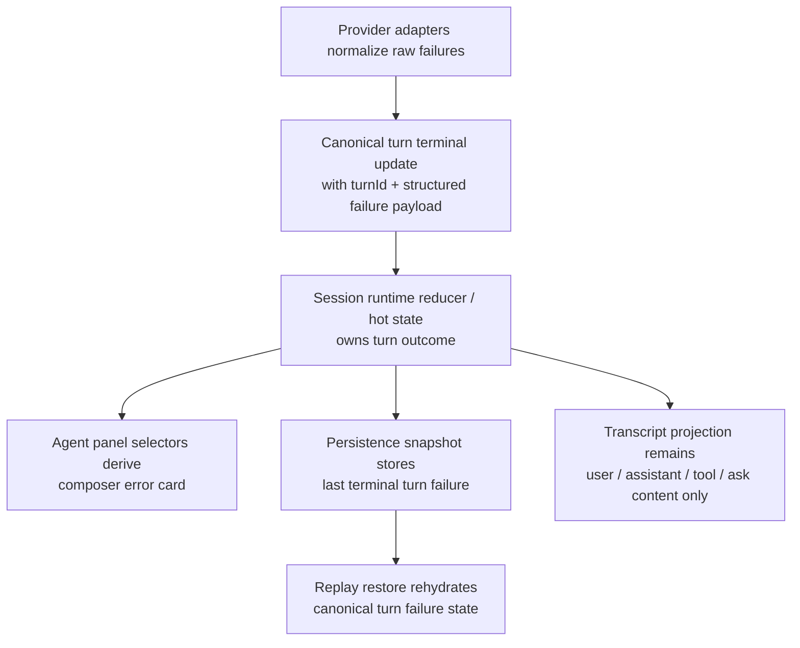

# refactor: Canonicalize turn failure state

## Overview

Turn failures currently have split ownership across backend `turnError` updates, frontend `turnState`, `connectionError`, and inline `SessionEntry { type: "error" }` transcript rows. That split forces UI heuristics, duplicate suppression, and replay-specific exceptions just to show one composer-level error card.

This refactor makes failed-turn state a canonical turn projection instead of transcript content. Live and replayed sessions should both restore the same structured failure outcome, and the agent panel should render the composer error card from that outcome alone.

## Problem Frame

Acepe already treats tool operations, interactions, and panel surfaces as projections with clear ownership. Turn failure is an outlier: the same failed turn can emit multiple provider-shaped error events, the frontend currently appends transcript error rows for each one, and the panel then tries to infer the "real" active error by inspecting the last transcript entry. That is why the current fix needed suppression logic and still leaked duplicate inline messages for Codex-native `transport` + `process` failures.

The clean end state is one canonical failed-turn record per turn, with transcript rows reserved for conversation content. This plan deliberately scopes to the turn-failure lane rather than attempting the full canonical runtime journal migration in one step.

## Requirements Trace

- R1. A failed turn must produce exactly one canonical failure outcome per turn, even when the provider emits duplicate failure signals.
- R2. The composer error card must read from canonical turn state rather than transcript tail heuristics.
- R3. Live failed turns must not append transcript `error` rows that duplicate the composer error card.
- R4. Replay and persistence must restore the same structured failure semantics (`message`, `kind`, `code`, `source`) for the new canonical snapshot without relying on transcript error entries, while legacy `StoredEntry::Error` logs restore the best available compatible semantics with documented limits.
- R5. Late chunks, late `turnComplete`, and duplicate `turnError` events must not overwrite or reopen a terminal failed turn.
- R6. Recoverable versus fatal turn failure semantics must remain distinct from session/transport connection failures.

## Scope Boundaries

- Do not rewrite the full ACP runtime event model, operation journal, or interaction projections in this slice.
- Do not redesign the visual appearance of the composer error card or conversation rows.
- Do not change provider retry policies or rate-limit messaging copy beyond normalization needed for canonical failure state.

### Deferred to Separate Tasks

- Full migration from transport-shaped session updates to the broader canonical runtime journal described in `docs/plans/2026-04-07-005-refactor-canonical-agent-runtime-journal-plan.md`.
- Broader queue/kanban/status-surface cleanup beyond the failure-state parity needed for this refactor.

## Context & Research

### Relevant Code and Patterns

- `packages/desktop/src-tauri/src/acp/session_update/types/interaction.rs` defines `TurnErrorKind`, `TurnErrorSource`, and `TurnErrorInfo`, which should remain the canonical structured failure payload.
- `packages/desktop/src-tauri/src/acp/client_errors.rs`, `packages/desktop/src-tauri/src/acp/client/codex_native_events.rs`, `packages/desktop/src-tauri/src/acp/client/forge_protocol.rs`, `packages/desktop/src-tauri/src/acp/client/cc_sdk_client.rs`, and `packages/desktop/src-tauri/src/acp/opencode/sse/conversion.rs` already normalize provider-specific failures at the adapter edge.
- `packages/desktop/src/lib/acp/store/services/session-messaging-service.ts` currently appends transcript `error` entries inside `handleTurnError`, making transcript content the accidental owner of failed-turn UI.
- `packages/desktop/src/lib/acp/components/agent-panel/components/agent-panel.svelte` and `packages/desktop/src/lib/acp/components/agent-panel/logic/connection-ui.ts` currently infer active turn failure by pairing `turnState === "error"` with the last transcript entry.
- `packages/desktop/src-tauri/src/copilot_history/mod.rs` and `packages/desktop/src-tauri/src/session_jsonl/types.rs` currently persist turn failure as `StoredEntry::Error`, which ties replay restoration to transcript representation.

### Institutional Learnings

- `docs/solutions/logic-errors/operation-interaction-association-2026-04-07.md` reinforces the recurring Acepe fix pattern: canonical ownership should live below the UI boundary, with multiple surfaces projecting from one source of truth.
- `docs/solutions/best-practices/provider-owned-policy-and-identity-not-ui-projections-2026-04-09.md` argues for explicit provider/canonical identity contracts instead of UI heuristics.
- `docs/plans/2026-04-07-005-refactor-canonical-agent-runtime-journal-plan.md` already defines the desired direction: `TurnFailed` as canonical turn-lifecycle state, separate from transcript projection.
- `docs/plans/2026-04-13-002-fix-copilot-restart-replay-plan.md` reinforces that replay and live ingress should normalize at one seam, not through transcript-specific compatibility hacks.

### External References

- None. The codebase already has strong local patterns for adapter normalization and projection-owned UI state.

## Key Technical Decisions

- **Introduce explicit turn-failure projection state in the session runtime:** the frontend should store structured failed-turn data directly in session hot/runtime state rather than reconstructing it from transcript entries.
- **Add explicit turn identity to terminal turn updates:** `turnError` and `turnComplete` should carry a turn-scoped identifier so duplicate terminal events are idempotent and late terminal events cannot be misattributed to the next send.
- **Keep transcript rows content-only for live sessions:** new live turn failures should no longer create `SessionEntry { type: "error" }` rows; the composer card becomes the single active failed-turn surface.
- **Persist canonical failed-turn snapshot separately from transcript history:** stored sessions should capture a nullable failed-turn snapshot for the most recent terminal failed turn, keyed by `turnId` and cleared when a later turn starts or completes successfully, with a compatibility reader for legacy `StoredEntry::Error` history.
- **Reserve `connectionError` for connection/session failures:** turn failures continue to use structured turn-failure state so queue/projection surfaces can distinguish "agent failed this turn" from "session transport failed."
- **Treat the first terminal failure for a turn as authoritative:** later same-turn duplicate `turnError` events must never create a second failed-turn surface or overwrite populated canonical fields; they may only backfill missing structured fields on the existing canonical record.

## Open Questions

### Resolved During Planning

- **Should duplicate suppression happen in the UI or below it?** Below the UI. The store/reducer layer should treat terminal turn outcomes as idempotent and surface only one canonical failed-turn record.
- **Should this refactor rely on local transcript ordering instead of turn identity?** No. The clean contract is an explicit turn-scoped identity on terminal updates so duplicate and late events can be handled deterministically.
- **Should persisted failure keep provider detail like `source`?** Yes. Replay needs the same structured semantics as live state, so persistence should keep `message`, `kind`, `code`, and `source`.
- **What clears persisted failed-turn state?** The canonical failed-turn snapshot is nullable and represents only the most recent terminal failed turn; a later turn start or successful turn completion clears it so stale failures do not resurrect on reload.
- **How should same-turn duplicate failures merge?** The first terminal failure for a turn owns canonical content, while later duplicates for the same `turnId` may only enrich missing fields and must never overwrite populated content or mint a second failed-turn surface.

### Deferred to Implementation

- **Exact field names for the canonical turn projection:** the plan defines ownership and semantics, while implementation can choose the precise store/type names that best fit the existing session runtime model.
- **Whether legacy `StoredEntry::Error` is migrated in place or read via compatibility synthesis:** implementation can choose the lowest-risk compatibility path as long as replayed semantics match the new canonical state and the legacy source-loss limit is explicit.

## High-Level Technical Design

> *This illustrates the intended approach and is directional guidance for review, not implementation specification. The implementing agent should treat it as context, not code to reproduce.*

## Implementation Units

- [ ] **Unit 1: Add canonical turn terminal identity to the backend contract**

**Goal:** Extend the turn terminal session-update contract so failed/completed turns are identified canonically and carry the structured failure payload needed by live and replayed consumers.

**Requirements:** R1, R4, R5, R6

**Dependencies:** None

**Files:**
- Modify: `packages/desktop/src-tauri/src/acp/session_update/types/interaction.rs`
- Modify: `packages/desktop/src-tauri/src/acp/client_errors.rs`
- Modify: `packages/desktop/src-tauri/src/acp/client_loop.rs`
- Modify: `packages/desktop/src-tauri/src/acp/client/codex_native_events.rs`
- Modify: `packages/desktop/src-tauri/src/acp/client/forge_protocol.rs`
- Modify: `packages/desktop/src-tauri/src/acp/client/cc_sdk_client.rs`
- Modify: `packages/desktop/src-tauri/src/acp/opencode/sse/conversion.rs`
- Modify: `packages/desktop/src-tauri/src/acp/client_updates/mod.rs`
- Modify: `packages/desktop/src-tauri/src/session_jsonl/export_types.rs`
- Regenerate: `packages/desktop/src/lib/services/converted-session-types.ts`
- Test: `packages/desktop/src-tauri/src/acp/opencode/sse/tests.rs`
- Test: `packages/desktop/src-tauri/src/acp/client/forge_protocol.rs` (inline terminal-update tests)
- Test: `packages/desktop/src-tauri/src/acp/client/codex_native_events.rs` (inline terminal-update tests)
- Test: `packages/desktop/src-tauri/src/acp/client/cc_sdk_client.rs` (inline terminal-update tests)
- Test: `packages/desktop/src-tauri/src/acp/client_updates/mod.rs` (inline terminal update serialization tests)

**Approach:**
- Introduce a turn-scoped identifier on terminal turn updates (`turnError`, `turnComplete`, and any compatibility terminal event shape that must share the same lifecycle identity).
- Keep provider quirks at adapter edges by deriving canonical terminal payloads in Rust before events cross into the desktop contract.
- Preserve existing `TurnErrorKind` / `TurnErrorSource` semantics while expanding the contract enough for downstream idempotence and persistence.

**Execution note:** Start with failing Rust/session-update tests that prove duplicate terminal events for one turn share identity and serialize to the generated TypeScript contract.

**Patterns to follow:**
- `packages/desktop/src-tauri/src/acp/session_update/types/interaction.rs`
- `docs/plans/2026-04-07-005-refactor-canonical-agent-runtime-journal-plan.md`

**Test scenarios:**
- Happy path — a provider-emitted turn failure serializes as one structured terminal update containing turn identity plus `message`, `kind`, `code`, and `source`.
- Error path — Codex-native `transport` and `process` failures for the same failed turn resolve to terminal updates with the same turn identity instead of unrelated transcript artifacts.
- Edge case — a stale terminal event from the prior turn cannot collide with the next turn because terminal updates are keyed by explicit `turnId`.
- Integration — generated `packages/desktop/src/lib/services/converted-session-types.ts` includes the new terminal identity field so frontend consumers can compile against the canonical contract.

**Verification:**
- The Rust/TypeScript session-update boundary exposes a stable turn terminal identity and structured failure payload without relying on transcript error entries.

- [ ] **Unit 2: Make the session runtime own canonical failed-turn state**

**Goal:** Replace transcript-owned failed-turn UI state with a reducer/store-owned canonical turn-failure projection that is idempotent per turn and terminal-state aware.

**Requirements:** R1, R2, R5, R6

**Dependencies:** Unit 1

**Files:**
- Modify: `packages/desktop/src/lib/acp/store/types.ts`
- Modify: `packages/desktop/src/lib/acp/types/turn-error.ts`
- Modify: `packages/desktop/src/lib/acp/store/services/session-messaging-service.ts`
- Modify: `packages/desktop/src/lib/acp/store/session-event-service.svelte.ts`
- Modify: `packages/desktop/src/lib/acp/store/session-store.svelte.ts`
- Modify: `packages/desktop/src/lib/acp/store/services/interfaces/connection-manager.ts`
- Modify: `packages/desktop/src/lib/acp/store/session-connection-service.svelte.ts`
- Modify: `packages/desktop/src/lib/acp/logic/session-machine.ts`
- Test: `packages/desktop/src/lib/acp/store/services/__tests__/session-messaging-service-stream-lifecycle.test.ts`
- Test: `packages/desktop/src/lib/acp/store/__tests__/session-event-service-streaming.vitest.ts`
- Test: `packages/desktop/src/lib/acp/store/services/session-connection-manager.test.ts`
- Test: `packages/desktop/src/lib/acp/logic/__tests__/session-machine.test.ts`

**Approach:**
- Add explicit canonical failed-turn data to session runtime state, keyed by the current or most recent turn identity rather than transcript tail.
- Make `handleTurnError`, `handleStreamComplete`, interruption, and subsequent sends transition terminal turn state idempotently instead of overwriting each other opportunistically.
- Ensure duplicate `turnError` for the same turn preserves a single canonical failure record, allows only non-destructive backfill of missing structured fields, and prevents late terminal/chunk events from reopening a failed or interrupted turn.

**Execution note:** Add failing lifecycle tests first for duplicate `turnError`, `turnError -> turnComplete`, and interruption followed by late terminal events.

**Patterns to follow:**
- `packages/desktop/src/lib/acp/store/services/session-messaging-service.ts`
- `packages/desktop/src/lib/acp/logic/session-machine.ts`

**Test scenarios:**
- Happy path — one recoverable `turnError` records canonical failure state, keeps `connectionError` clear, and leaves the session ready for the next send.
- Edge case — duplicate `turnError` events for the same turn preserve one canonical failure record, backfill only missing structured fields, and fire one downstream terminal transition.
- Edge case — `turnError` followed by late `turnComplete` for the same turn leaves the turn failed.
- Edge case — user interruption followed by late `turnComplete` or late `turnError` leaves the turn interrupted.
- Error path — fatal turn failure sets the correct session status without collapsing into transport/session `connectionError`.
- Integration — starting the next send clears only the active failed-turn state for the prior terminal turn and starts a new turn identity cleanly.
- Integration — a late terminal event from the previous turn arriving after the next send is ignored rather than binding to the new active turn.

**Verification:**
- Session runtime state alone is sufficient to determine the active failed-turn card and terminal outcome, without reading transcript entries.

- [ ] **Unit 3: Persist and restore canonical turn failure state**

**Goal:** Move session persistence and replay from transcript-owned error entries to explicit canonical failed-turn state while keeping legacy history readable and replay authority explicit.

**Requirements:** R3, R4, R5

**Dependencies:** Unit 1, Unit 2

**Files:**
- Modify: `packages/desktop/src-tauri/src/copilot_history/mod.rs`
- Modify: `packages/desktop/src-tauri/src/session_jsonl/types.rs`
- Modify: `packages/desktop/src-tauri/src/session_jsonl/export_types.rs`
- Modify: `packages/desktop/src/lib/acp/converters/stored-entry-converter.ts`
- Modify: `packages/desktop/src/lib/acp/converters/stored-entry-converter.test.ts`
- Modify: `packages/desktop/src/lib/acp/store/services/session-connection-manager.ts`
- Modify: `packages/desktop/src/lib/acp/store/services/session-projection-hydrator.ts`
- Modify: `packages/desktop/src/lib/acp/store/services/__tests__/session-repository-preload-details.test.ts`
- Modify: `packages/desktop/src/lib/acp/store/services/__tests__/session-repository-startup-sessions.test.ts`
- Test: `packages/desktop/src/lib/acp/store/services/__tests__/session-projection-hydrator.test.ts`
- Test: `packages/desktop/src-tauri/src/session_jsonl/export_types.rs` (inline stored-schema export tests)

**Approach:**
- Extend the stored session model to persist the canonical failed-turn snapshot outside the transcript entry list, including `turnId` so preload and replay can dedupe against the same canonical owner.
- Rehydrate canonical failed-turn state through the session projection hydration path so persisted snapshot data is authoritative for restored sessions; replayed terminal events must either enrich the same `turnId` or no-op, not recreate the state from transcript heuristics.
- Keep a compatibility read path for legacy `StoredEntry::Error` data, synthesizing canonical failure state from the best available legacy fields while documenting that legacy logs cannot recover missing `source` detail.

**Patterns to follow:**
- `packages/desktop/src-tauri/src/session_jsonl/types.rs`
- `packages/desktop/src/lib/acp/store/services/session-connection-manager.ts`
- `packages/desktop/src/lib/acp/store/services/session-projection-hydrator.ts`
- `docs/plans/2026-04-13-002-fix-copilot-restart-replay-plan.md`

**Test scenarios:**
- Happy path — a newly persisted failed session restores canonical failure state with `message`, `kind`, `code`, and `source` intact.
- Edge case — a persisted failed session with no transcript error entry still restores the composer error card correctly after preload.
- Edge case — a legacy stored session containing `StoredEntry::Error` rehydrates canonical failure state without duplicating transcript rows, with the documented legacy limit that missing `source` cannot be recovered.
- Edge case — a mixed history containing both legacy error rows and the new canonical failed-turn snapshot prefers the canonical snapshot as replay authority for the same `turnId`.
- Integration — preload/replay does not emit duplicate failed-turn UI when canonical persisted state and replayed terminal updates both describe the same failed turn.
- Integration — messy legacy duplicate error-row histories restore one canonical failed-turn snapshot instead of replaying multiple active error surfaces.

**Verification:**
- Session restore/replay reconstructs failed-turn state from canonical persistence, with legacy error-entry logs remaining readable during migration.

- [ ] **Unit 4: Cut the agent panel over to canonical turn failure state**

**Goal:** Make the agent panel and transcript surfaces consume canonical failed-turn state directly, removing live transcript error-row ownership and the visibility filter that hides duplicates after the fact.

**Requirements:** R2, R3, R6

**Dependencies:** Unit 2, Unit 3

**Files:**
- Modify: `packages/desktop/src/lib/acp/components/agent-panel/components/agent-panel.svelte`
- Modify: `packages/desktop/src/lib/acp/components/agent-panel/logic/connection-ui.ts`
- Modify: `packages/desktop/src/lib/acp/logic/__tests__/panel-visibility.test.ts`
- Modify: `packages/desktop/src/lib/acp/components/messages/error-message.svelte`
- Modify: `packages/desktop/src/lib/acp/application/dto/session-entry.ts`
- Modify: `packages/desktop/src/lib/acp/components/agent-panel/logic/index.ts`
- Delete: `packages/desktop/src/lib/acp/components/agent-panel/logic/visible-session-entries.ts`
- Delete: `packages/desktop/src/lib/acp/components/agent-panel/logic/__tests__/visible-session-entries.test.ts`
- Test: `packages/desktop/src/lib/acp/components/agent-panel/logic/__tests__/connection-ui.test.ts`
- Test: `packages/desktop/src/lib/acp/components/agent-panel/scene/desktop-agent-panel-scene.test.ts`

**Approach:**
- Read composer-card state from canonical turn failure data instead of `sessionEntries.at(-1)`.
- Stop adding new live transcript `error` entries from the runtime pipeline, then remove the agent-panel-specific visibility filter that existed only to hide those live duplicates.
- Keep compatibility rendering for legacy/historical stored error rows only if the compatibility restore path intentionally preserves them as historical content during migration.

**Patterns to follow:**
- `packages/desktop/src/lib/acp/components/agent-panel/logic/connection-ui.ts`
- `docs/solutions/logic-errors/operation-interaction-association-2026-04-07.md`

**Test scenarios:**
- Happy path — a failed turn with no transcript error row still renders the composer error card with the correct title, summary, and details.
- Edge case — conversation content remains visible alongside the composer error card after failure, without any extra inline `Error` row.
- Edge case — a restored legacy historical error entry can still render as historical content if the compatibility path intentionally preserves it.
- Integration — panel visibility logic still selects the correct error-only versus conversation-plus-card layout when a failed turn occurs before any assistant content.

**Verification:**
- The agent panel renders failed-turn UX from canonical runtime state and no longer needs transcript-tail suppression logic for live sessions.

- [ ] **Unit 5: Align downstream projections and clean up compatibility seams**

**Goal:** Remove obsolete live error-entry plumbing and ensure downstream surfaces classify failed turns consistently once canonical failure state owns the feature.

**Requirements:** R1, R2, R3, R5, R6

**Dependencies:** Unit 3, Unit 4

**Files:**
- Modify: `packages/desktop/src/lib/acp/store/session-work-projection.ts`
- Modify: `packages/desktop/src/lib/acp/types/error-message.ts`
- Modify: `packages/desktop/src/lib/acp/components/agent-panel/logic/index.ts`
- Modify: `packages/desktop/src/lib/acp/store/services/__tests__/session-repository-refresh-source-path.test.ts`
- Modify: `packages/desktop/src/lib/acp/store/services/__tests__/session-repository-placeholder-title.test.ts`
- Modify: `packages/desktop/src/lib/acp/store/services/__tests__/session-messaging-service-send-message.test.ts`
- Modify: `packages/desktop/src/lib/acp/store/services/session-connection-manager.test.ts`
- Test: `packages/desktop/src/lib/acp/logic/__tests__/panel-visibility.test.ts`

**Approach:**
- Remove or narrow now-obsolete `ErrorMessage` / `SessionEntry.type === "error"` responsibilities so live runtime code no longer depends on transcript-owned turn failure.
- Update downstream projections that distinguish session failure from turn failure to read the canonical failed-turn state instead of transcript entries or `connectionError` shortcuts.
- Leave only the minimum legacy compatibility surface needed to read older stored sessions until a later cleanup can fully retire it.

**Patterns to follow:**
- `packages/desktop/src/lib/acp/store/session-work-projection.ts`
- `docs/plans/2026-04-12-001-refactor-session-work-status-plan.md`

**Test scenarios:**
- Happy path — downstream work/status projections classify a recoverable failed turn without labeling the session as disconnected or transport-failed.
- Edge case — fatal failed turn and true connection failure still remain distinguishable in panel/status surfaces.
- Integration — repository/session preload helpers and send-message flows operate correctly after live error entries are removed from the normal runtime path.
- Integration — downstream projections continue to classify restored legacy failed sessions correctly even when the legacy transcript rows do not include `source`.

**Verification:**
- Remaining runtime surfaces read one canonical failed-turn owner, and any transcript `error` handling is compatibility-only rather than part of the live architecture.

## System-Wide Impact

- **Interaction graph:** provider adapters emit canonical terminal updates; session event routing forwards them into store-owned turn-failure state; preload treats the persisted canonical failed-turn snapshot as authoritative for restored sessions; agent-panel selectors render the composer card from that state; transcript projection remains content-only for live turns.
- **Error propagation:** transport/session failures continue through `connectionError`, while turn-scoped provider failures normalize into canonical failed-turn state and never need transcript error rows to become visible.
- **State lifecycle risks:** duplicate terminal events, late chunks after failure, stale terminal events after the next send, and preload/replay double-application are the main regression risks; turn identity plus idempotent reducer/store transitions must neutralize them.
- **API surface parity:** generated session-update types, Rust persistence schema, TypeScript store contracts, and panel selectors must all agree on the canonical failed-turn shape.
- **Integration coverage:** provider duplicate failures, interrupted turns, stale terminal events after a new send, preloaded failed sessions, mixed old/new persistence, and messy legacy history import all require cross-layer tests because unit tests alone will not prove the semantics.
- **Unchanged invariants:** user, assistant, tool-call, and ask transcript rows remain transcript-owned content surfaces; this refactor changes failed-turn ownership, not the rest of the transcript model.

## Risks & Dependencies

| Risk | Mitigation |
|------|------------|
| Adding turn identity to terminal updates could ripple across multiple providers and generated contracts | Scope the new identity to terminal turn lifecycle events, keep adapter normalization at the edge, and update generated types/tests in the same unit |
| Replay compatibility could regress for stored sessions with legacy `StoredEntry::Error` data | Keep a compatibility reader that synthesizes canonical failure state from legacy entries until the old format can be retired, and document that legacy rows cannot recover missing `source` data |
| Removing live transcript error rows could break surfaces that quietly depended on them | Inventory and update downstream projections in Unit 5, with explicit regression coverage for panel visibility and session-work projection |
| Late chunk or terminal events may still reopen state if only some paths honor the new rules | Add lifecycle tests before implementation and enforce idempotent terminal-state guards in one canonical store/service seam |
| Persisted canonical failure and replayed terminal updates could fight for authority on restore | Make the persisted canonical failed-turn snapshot authoritative for preload and require replay dedupe by `turnId` when the same terminal event arrives again |

## Documentation / Operational Notes

- If implementation lands meaningful architectural guidance beyond this plan, capture the new ownership rule in `docs/solutions/` so future UI/state work does not regress into transcript-owned failure state.
- No rollout flag is expected; this should ship as a contract-consistent refactor with compatibility support for legacy stored sessions.

## Sources & References

- Related plan: `docs/plans/2026-04-07-005-refactor-canonical-agent-runtime-journal-plan.md`
- Related plan: `docs/plans/2026-04-13-002-fix-copilot-restart-replay-plan.md`
- Related plan: `docs/plans/2026-04-12-001-refactor-session-work-status-plan.md`
- Related code: `packages/desktop/src-tauri/src/acp/session_update/types/interaction.rs`
- Related code: `packages/desktop/src/lib/acp/store/services/session-messaging-service.ts`
- Related code: `packages/desktop/src/lib/acp/components/agent-panel/components/agent-panel.svelte`
- Related code: `packages/desktop/src-tauri/src/copilot_history/mod.rs`
