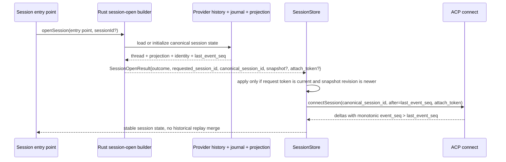
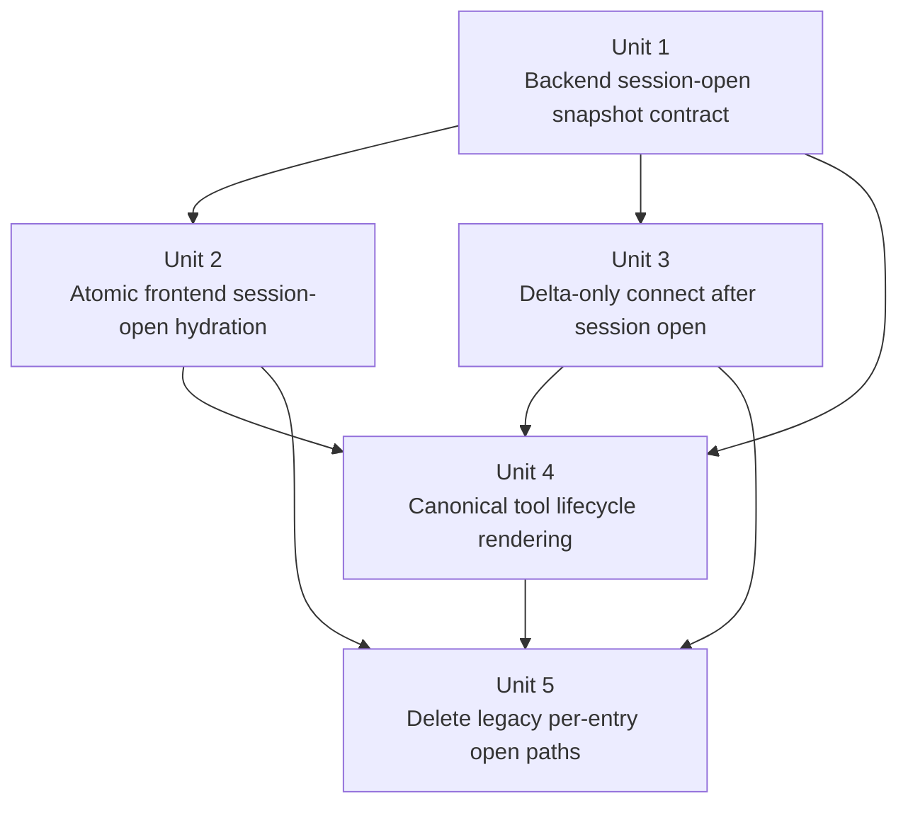

# refactor: Unified session snapshot protocol and reconnect

## Overview

Replace special-case session-open composition with one backend-authored session-open result and post-snapshot live deltas. Fresh session creation, manual persisted-session open, and restored-session reopen should all hydrate the frontend from the same snapshot-plus-delta contract.

## Problem Frame

The async resume requirements document correctly moved `acp_resume_session` toward fire-and-forget lifecycle handling, but Acepe still opens sessions through different frontend contracts depending on how the session becomes active. Persisted-session reopen is where the bug is visible today, but the deeper problem is architectural: the frontend should not have one model for restore, another for manual open, and another for fresh session creation.

Unifying all three entry points in one plan is justified because the cost of multiple session-open contracts is already visible in product behavior and maintenance burden:

- users lose trust when reopened sessions reshape after connect or surface ghost tool rows;
- maintainers have to debug restore/manual-open/fresh-session behavior through different codepaths that should represent the same session concept;
- keeping fresh session creation on a separate protocol would preserve two session-open architectures and make the next replay/identity bug more likely, not less.

Today a restored panel can receive:

| Surface | Current role | Failure mode |
|---|---|---|
| `SessionRepository.preloadSessionDetails()` | Loads ordered thread entries from provider history | Creates a thread timeline independently of projection state |
| `SessionProjectionHydrator.hydrateSession()` | Loads operations/interactions from backend projection | Hydrates a second source of truth beside transcript entries |
| `SessionConnectionManager.connectSession()` + `SessionEventService` | Reconnects ACP and replays updates | Forces the frontend to interpret historical replay, dedupe, and placeholder semantics |

The visible symptom is restart-only ghost tool rows such as repeated `Tool` cards in the agent panel. The deeper architectural issue is that the frontend still has to understand replay history and source-merging semantics instead of consuming one canonical session model at open time and then processing only live deltas.

For this plan, use these terms consistently:

- **Session open** — any path that makes a session active in the UI: fresh session creation, manual persisted-session open, or restored-session reopen.
- **SessionOpenSnapshot** — the backend-authored payload that fully describes canonical session state at open time.
- **SessionOpenResult** — the canonical backend result envelope for any open attempt:
  - `outcome: found | missing | error`
  - `requested_session_id`
  - `canonical_session_id` when resolution succeeds
  - `resolution: canonical | alias` when `found`
  - `snapshot: SessionOpenSnapshot` when `found`
  - `attach_token` when `found`
  - `error` payload when `error`
- **Session delta** — a live update whose `event_seq` is greater than the snapshot revision.
- **Restored session** — a persisted session reopened automatically during workspace/panel restore.
- **Manual persisted-session open** — a persisted session the user opens explicitly after the app is already running.
- **Fresh session** — a newly created session such as `acp_new_session`.

## Requirements Trace

- R1. All session entry points (`acp_new_session`, manual persisted-session open, restored-session reopen) use one backend-owned `SessionOpenResult` contract plus live deltas.
- R2. The frontend hydrates session state from one authoritative snapshot, not separate transcript preload, projection hydration, and reconnect replay streams.
- R3. The session-open snapshot carries canonical `last_event_seq`; reconnect attaches only deltas with `event_seq > last_event_seq`.
- R4. Provider-owned replay identity remains backend-owned and keyed by provider history identity where required (see origin: `docs/brainstorms/2026-04-12-async-session-resume-requirements.md`).
- R5. Tool rows in the agent panel originate from canonical session state; update-only events mutate existing rows and must not create anonymous cards.
- R6. Session open preserves pending interactions, worktree/session identity, and session content on first render, with explicit `found`, `missing`, and `error` outcomes instead of partial fallback behavior.
- R7. The frontend removes session-open-only replay suppression and placeholder heuristics; create/open/restore follow the same snapshot-plus-delta model.
- R8. A reopened session presents a stable thread on first render instead of reshaping later as historical replay arrives.

## User-Visible Success Criteria

- Restored and manually opened sessions render canonical thread content, pending interactions, and worktree identity on first render.
- The first rendered snapshot is canonically correct, not merely stable after connect: thread entries, operations, and interactions match the backend's proven journal/projection cutoff with no ghost rows already present in the snapshot itself.
- After connect begins, the visible thread shape stays stable; live deltas may append or mutate canonical state, but they do not replay history or restructure already-rendered content.
- During the snapshot-to-`connectionComplete` window, canonical persisted state renders immediately while live-only turn metadata remains in the existing binding/reconnecting lifecycle until connect finishes.
- A `missing` result produces an explicit unavailable-session state and skips hydrate/connect; it does not silently clear the panel or fall back to partial data.
- An `error` result produces a retryable load-failure state that is distinct from `missing`.
- For `missing`, the panel remains open in an unavailable-session state with a clear explanation and a close/dismiss action; it does not present retry as if the content might still exist.
- For `error`, the panel remains open in a load-failure state with retry plus close/dismiss actions.
- Fresh session creation uses the same contract with an empty or initial snapshot and a snapshot boundary equal to the proven persisted cutoff (`last_event_seq = 0` only when no seed journal event exists yet), without adding an extra bootstrap-only open path, slowing first render, or adding a second round trip beyond the creation result itself.

## Scope Boundaries

- No redesign of the visual agent panel shell, cards, or scene layout. Explicit unavailable-session, load-failure, and existing binding/reconnecting lifecycle states inside the current shell are in scope; new scene layouts or card systems are not.
- No change to the underlying SSE transport.
- No separate rollout/coexistence architecture; this plan describes the clean replacement path with old per-entry session-open composition removed.
- In scope is the shared session-open protocol for fresh session creation, manual persisted-session open, and restored-session reopen. Implementation priority remains persisted-session reopen because that is where the current user-visible bug manifests.
- Fresh session creation remains in scope because the shared hydrator/protocol is the only clean way to avoid preserving a second session-open architecture. Within this plan it delivers architectural consistency only - the same `SessionOpenResult` contract with an empty or initial snapshot and a proved cutoff. No user-visible UX changes for fresh session creation are in scope here.

### Deferred to Separate Tasks

- Fresh-session UX cleanup beyond emitting and consuming the same session-open snapshot contract.
- Progress-stage UX for resume/connect (`spawning`, `rehydrating`, `binding`) beyond the existing connection lifecycle.

## Context & Research

### Relevant Code and Patterns

- `packages/desktop/src/lib/components/main-app-view/logic/managers/initialization-manager.ts` currently restores panels by calling `loadSessionById()` and then `reconnectRestoredPanelSession()`, which chains preload, projection hydration, reconnect, and a second hydration pass.
- `packages/desktop/src/lib/components/main-app-view/logic/managers/session-handler.ts` uses a different open path for fresh sessions and explicit session open, so session-open semantics already diverge by entry point.
- `packages/desktop/src/lib/acp/store/services/session-repository.ts` builds ordered thread entries from `ConvertedSession.entries` and stores them independently from projection state.
- `packages/desktop/src/lib/acp/store/services/session-projection-hydrator.ts` separately loads `SessionProjectionSnapshot` and replaces only session/operation/interaction projections.
- `packages/desktop/src/lib/acp/store/session-event-service.svelte.ts` contains replay suppression, duplicate fingerprints, and orphan tool-update guards — evidence that replay semantics are still leaking into frontend state management.
- `packages/desktop/src-tauri/src/acp/projections/mod.rs` already defines the backend-owned operation and interaction model and tracks `SessionSnapshot.last_event_seq`, which is the cleanest existing monotonic revision spine for snapshot-plus-delta session open.
- `packages/desktop/src-tauri/src/acp/session_journal.rs` persists `SessionJournalEvent.event_seq`, which can anchor delta ordering and snapshot correctness.
- `packages/desktop/src-tauri/src/history/commands/session_loading.rs` already routes provider-owned history loading through `history_session_id`, which is the correct identity boundary for provider replay.

### Institutional Learnings

- `docs/solutions/best-practices/provider-owned-policy-and-identity-not-ui-projections-2026-04-09.md` — shared code should consume provider-owned lifecycle and replay contracts directly, not infer them from UI-facing projection data.
- `docs/solutions/logic-errors/worktree-session-restore-2026-03-27.md` — restart bugs should be fixed at the earliest restore boundary rather than relying on later scan/repair passes.
- `docs/solutions/best-practices/autonomous-mode-as-rust-side-policy-hook-2026-04-11.md` — once projection hydration becomes authoritative, the frontend should render projection state rather than re-enforcing policy or lifecycle semantics.

### External References

- None. The repo already has sufficient local architecture and recent internal learnings to ground this plan.

## Key Technical Decisions

| Decision | Rationale |
|---|---|
| Introduce a backend-owned `SessionOpenResult` envelope whose `found` branch carries `SessionOpenSnapshot` with ordered thread entries, canonical projection state, session identity metadata, and `last_event_seq`. | One session-open result for create/open/restore removes the transcript/projection/replay merge that currently leaks into the frontend while making `found | missing | error` explicit. |
| Use canonical `last_event_seq`, backed by journal `event_seq`, as the single session-open and reconnect boundary. | Snapshot assembly and live-delta attachment must share one monotonic revision or the system can still drop or duplicate events during open. |
| Make both persisted-session loading and `acp_new_session` produce the same `SessionOpenResult` shape. | Fresh/open/restore should differ in data, not in protocol. |
| Replace per-source preload/projection hydration with one atomic frontend session-open hydrate guarded by revision monotonicity. | The agent panel should receive one coherent thread model, and slower older hydrations must not overwrite newer state. |
| Make `toolCallUpdate` mutation-only in the frontend. | Tool rows should be created only by the `found` snapshot or by a live `toolCall` create event; update-only events should never invent placeholders. |
| Represent absent persisted content as an explicit `missing` session-open outcome, while storage/transport failures remain `error`. | Missing content and load failure have different UI and control-flow consequences; the contract should make that distinction explicit. |
| Include both requested and canonical session identifiers in `SessionOpenResult`. | Restore/open flows already rely on alias-to-canonical remapping before validation; the new contract must preserve that identity resolution instead of deleting it accidentally. |
| Carry monotonic `event_seq` through delivered live deltas and enforce in-order buffered flush. | Delta-only connect is not sufficient unless the frontend can prove ordering and ignore stale or duplicate deltas after snapshot hydration. |
| Make snapshot handoff to live attach atomic from the client’s perspective. | The backend must not leave a gap where events emitted after snapshot assembly can be missed before delta delivery begins. |
| Treat `missing` as authoritative absence, not transient uncertainty. | `missing` should be emitted only after the same canonical/history-backed lookup used by snapshot assembly proves the session is absent; storage, startup, materialization, or transport faults remain `error`. |
| Bind attach-token reservations to explicit abandonment triggers and a short TTL. | Reservation buffers must not leak if a client never attaches; successful attach, superseding open, shutdown, or timeout must retire them deterministically. |
| Keep one generic frontend monotonicity guard after replay-suppression deletion. | Rejecting `event_seq <= last_applied_event_seq` is transport correctness, not replay interpretation, and provides a narrow safety net while backend provider parity is enforced. |
| Surface the snapshot/live-state split honestly during reopen. | Canonical persisted state can render immediately, but live-only model/tool metadata should remain in the existing binding lifecycle until `connectionComplete`. |
| Make journal `event_seq` the only frontend-visible ordering contract. | Provider adapters may keep provider-specific replay identity internally, but any delivered delta must map onto the journal-backed monotonic sequence before the frontend sees it. |

## Planning Decisions and Deferred Questions

### Resolved During Planning

- **Where should provider-owned replay identity remain authoritative?** In Rust, keyed by `history_session_id`, matching the existing provider-owned history path in `packages/desktop/src-tauri/src/history/commands/session_loading.rs`.
- **Should fresh session creation use the same contract as manual open and restore?** Yes. `acp_new_session` should emit the same session-open snapshot shape, even when the initial thread is empty.
- **What is the session-open revision boundary?** Use `SessionSnapshot.last_event_seq` as the canonical snapshot revision and treat journal `event_seq` as the underlying monotonic source for reconnect and ordering. Provider-specific replay sequence numbers do not cross the frontend boundary.
- **What revision does a brand-new session start at?** `last_event_seq = 0` only until the first persisted journal event exists. If session creation persists an initial event before the open result is returned, the result must carry that proved cutoff instead of forcing `0`.
- **Should the clean architecture keep frontend replay suppression for restored sessions?** No. Session-open code should stop relying on historical replay entirely, making replay suppression branches unnecessary for correctness.
- **Should restored-session identity repair continue to depend on later scans?** No. The session-open snapshot must carry the same identity context (`sourcePath`, `worktreePath`, provider history identity) that the session had before restart.
- **How should missing persisted content be represented?** As an explicit `missing` session-open outcome only when the canonical/history-backed lookup proves the session is absent; startup races, storage faults, materialization failures, and other uncertain states must surface as `error`.
- **Which frontend owners handle session-open outcomes?** `initialization-manager.ts` and `session-handler.ts` own session-open attempts; they consume `SessionOpenResult`, route only `found` to the hydrator, and surface `missing`/`error` through explicit lifecycle state without hydrating or connecting.
- **How are stale async open completions rejected?** Each open attempt carries a frontend-generated request token; results are ignored if the panel/session target has changed before completion.
- **How is the open/connect boundary kept gap-free?** A `found` result includes a backend-issued attach token (or equivalent reservation) that guarantees delivery of all deltas with `event_seq > last_event_seq`; the backend buffers those deltas until the client attaches. That reservation and ordered pre-attach delta buffer live in `packages/desktop/src-tauri/src/acp/event_hub.rs`; Unit 1 introduces the reservation/buffer primitives there and Unit 3 wires connect-time claim/flush through the same hub.
- **How long can an attach-token reservation live?** It is single-use and expires on successful attach, superseding open attempt, app shutdown, or 30 seconds of inactivity. Expired or abandoned reservations discard their buffered deltas and force a fresh open.
- **How is canonical-id rewrite ordered before hydrate/connect bookkeeping?** `session-open-hydrator.ts` serializes one open-attempt chain per panel so canonical-id rewrite, revision comparison, request-token/open-epoch registration, and connect handoff always run in that order.
- **How is the snapshot/live-state split communicated during reopen?** The canonical snapshot renders immediately, but the panel remains in the existing binding/reconnecting lifecycle until `connectionComplete` so live-only model/tool metadata is not presented as complete too early.
- **What hot-state metadata belongs in `SessionOpenResult` vs arriving after connect?** `SessionOpenResult` carries only persisted session state: thread entries, canonical operations/interactions, session identity, and `last_event_seq`. Live-turn hot-state (current model configuration, active turn modes, session capabilities) is not persisted between sessions and arrives after `connectionComplete`, as it does today. The snapshot must not attempt to describe live-turn state.
- **Where does the session-open hydrator live?** In a dedicated `session-open-hydrator.ts` service, as listed in New Files and Unit 2. The `session-store.svelte.ts` alternative is not chosen.

### Deferred to Implementation

*(No open decisions — all judgment calls resolved during planning.)*

## New Files

These are the expected net-new files. The implementation units below remain authoritative for the full modify/create/test surface.

```text
packages/desktop/src-tauri/src/acp/
  session_open_snapshot/
    mod.rs

packages/desktop/src/lib/acp/store/services/
  session-open-hydrator.ts
```

## Alternative Approaches Considered

| Approach | Why not chosen |
|---|---|
| Add more replay suppression heuristics in `SessionEventService` | Preserves a multi-authority session-open flow and keeps historical replay interpretation in the frontend. |
| Keep transcript preload, but teach reconnect to skip duplicates better | Still requires frontend dedupe, placeholder rules, and order-sensitive repair behavior. |
| Keep fresh sessions on a different contract and only clean up persisted-session reopen | Fixes the symptom locally but preserves multiple session-open architectures. |

## High-Level Technical Design

> *This illustrates the intended approach and is directional guidance for review, not implementation specification. The implementing agent should treat it as context, not code to reproduce.*



> *Note: the `Store->>Live` arrow is an abstraction — `initialization-manager.ts` and `session-handler.ts` are the actual owners that drive both the hydrate and connect steps after receiving `SessionOpenResult` (see Lifecycle Ownership in System-Wide Impact).*

## Implementation Units



- [ ] **Unit 1: Define the backend session-open result contract**

**Goal:** Create one Rust-owned `SessionOpenResult` contract that fully describes canonical session state, identity resolution, and attach-ready open outcomes for any session entry point before live connect begins.

**Requirements:** R1, R3, R4, R6

**Dependencies:** None

**Files:**
- Create: `packages/desktop/src-tauri/src/acp/session_open_snapshot/mod.rs`
- Modify: `packages/desktop/src-tauri/src/history/commands/session_loading.rs`
- Modify: `packages/desktop/src-tauri/src/acp/commands/session_commands.rs`
- Modify: `packages/desktop/src-tauri/src/acp/event_hub.rs`
- Modify: `packages/desktop/src-tauri/src/acp/session_journal.rs`
- Modify: `packages/desktop/src-tauri/src/acp/projections/mod.rs`
- Modify: `packages/desktop/src-tauri/src/acp/mod.rs`
- Modify: `packages/desktop/src-tauri/src/db/repository.rs`
- Modify: `packages/desktop/src/lib/services/acp-types.ts`
- Test: `packages/desktop/src-tauri/src/acp/commands/session_commands.rs`
- Test: `packages/desktop/src-tauri/src/db/repository_test.rs`

**Approach:**
- Compose provider-owned persisted thread loading and canonical projection loading into a single `SessionOpenResult` contract instead of returning transcript and projection state through separate APIs.
- Use `SessionSnapshot.last_event_seq` as the canonical snapshot revision and derive reconnect ordering from journal `event_seq`; only journal-backed monotonic `event_seq` crosses the frontend boundary.
- Assemble ordered thread entries, canonical operations/interactions, and identity metadata from one proven journal cutoff keyed to the returned `last_event_seq`; if any source cannot be proven consistent with that same cutoff, return `error`.
- Require provider-owned replay/loading adapters to resolve onto that same journal cutoff before returning `found`; if an adapter cannot prove the mapping between provider-side replay state and journal-backed `event_seq`, return `error` rather than emitting a mixed contract.
- Include `requested_session_id`, `canonical_session_id`, alias-vs-canonical resolution, ordered thread entries, session identity/metadata, canonical operations/interactions, and an explicit `found | missing | error` outcome in the same contract.
- For fresh session creation, emit a `found` result with `last_event_seq = 0` only when no seed journal event exists yet; if creation persists an initial event before open completes, return the proven persisted cutoff instead.
- When no stored projection snapshot exists, rebuild canonical state and compute the snapshot revision from the persisted journal boundary; if the journal/projection boundary cannot be proven, return `error`.
- Include a backend-issued `attach_token` (or equivalent reservation) in `found` results so delta delivery after `last_event_seq` is guaranteed without a client-visible gap.
- Extend `acp/event_hub.rs` from broadcast-only fanout to also own token-scoped pre-attach reservations: when a `found` result is built, register `attach_token -> {canonical_session_id, last_event_seq, open-attempt epoch, ordered delta buffer}` and append only deltas for that session with `event_seq > last_event_seq`.
- Define `attach_token` as single-use and bound to `canonical_session_id + last_event_seq + open-attempt epoch`; superseded or reused tokens are rejected and their buffered deltas discarded.
- Retire reservations deterministically on successful attach, superseding open attempt, app shutdown, or 30 seconds of inactivity so abandoned opens cannot leak buffered deltas indefinitely.
- Arm the reservation before any post-open journal event for that session can publish into `event_hub.rs`; if that ordering cannot be proven for a codepath, return `error` instead of relying on best-effort buffering.
- Make Unit 1 the owner of reservation creation and buffering primitives, while Unit 3 consumes that reservation via connect-time claim/flush instead of inventing a second buffering path elsewhere in the backend.
- Reuse the existing provider-owned replay lookup discipline (`history_session_id`) rather than inventing a frontend-side merge contract.

**Patterns to follow:**
- `packages/desktop/src-tauri/src/acp/session_journal.rs`
- `packages/desktop/src-tauri/src/acp/projections/mod.rs`
- `packages/desktop/src-tauri/src/history/commands/session_loading.rs`

**Test scenarios:**
- Happy path: loading a restored Copilot session returns one `found` result containing ordered thread entries plus matching canonical operations/interactions.
- Happy path: `acp_new_session` returns the same `SessionOpenResult` shape with empty or initial thread state and a proved initial cutoff (`0` only when no seed journal event exists yet).
- Happy path: a provider-owned replay session resolves persisted content by `history_session_id`, not the Acepe-local session id.
- Happy path: an alias-keyed open request returns both requested and canonical session identifiers so callers can rewrite panel/session references before validation.
- Happy path: a `found` result returns an `attach_token` that guarantees delivery of all deltas with `event_seq > last_event_seq`.
- Edge case: a fresh session that persists an initial journal event before open completes returns that event's proved `last_event_seq` instead of forcing `0`.
- Edge case: if provider history changes during snapshot assembly, the returned snapshot either includes the event consistently across thread and projection state or excludes it consistently everywhere; mixed-cutoff assembly returns `error`.
- Edge case: when journal rows exist but no stored projection snapshot exists, the rebuilt snapshot returns stable operations/interactions and a revision equal to the proven max persisted `event_seq`.
- Edge case: abandoning an unused `attach_token` expires the reservation buffer after the TTL and prevents later reuse.
- Integration: a delta emitted concurrently with snapshot assembly is either included consistently in the returned snapshot or buffered behind the returned reservation; it is never lost or delivered twice.
- Integration: an event emitted after snapshot assembly but before client attach is captured in the `event_hub.rs` reservation buffer and remains available for ordered flush via that token.
- Edge case: missing persisted content returns an explicit `missing` outcome rather than partial data or a reconnect attempt.
- Error path: when persisted history cannot be loaded, the backend returns `error`, not partial data.
- Integration: a worktree-backed session snapshot preserves `sourcePath` and `worktreePath` together with thread/projection state.

**Verification:**
- One backend contract can fully describe fresh session create, manual open, and restored reopen without requiring a second frontend projection fetch before render.

- [ ] **Unit 2: Replace per-source preload with atomic session-open hydration**

**Goal:** Make the new session-open hydrator the sole frontend open path and hydrate any `found` session-open snapshot through one transaction that replaces thread entries and projection state together.

**Requirements:** R1, R2, R6, R7, R8

**Dependencies:** Unit 1

**Files:**
- Create: `packages/desktop/src/lib/acp/store/services/session-open-hydrator.ts`
- Modify: `packages/desktop/src/lib/acp/store/session-store.svelte.ts`
- Modify: `packages/desktop/src/lib/utils/tauri-client/acp.ts`
- Modify: `packages/desktop/src/lib/services/converted-session-types.ts`
- Modify: `packages/desktop/src/lib/components/main-app-view.svelte`
- Modify: `packages/desktop/src/lib/components/main-app-view/logic/managers/initialization-manager.ts`
- Modify: `packages/desktop/src/lib/components/main-app-view/logic/managers/session-handler.ts`
- Modify: `packages/desktop/src/lib/components/main-app-view/logic/session-preload-connect.ts`
- Test: `packages/desktop/src/lib/acp/store/services/__tests__/session-open-hydrator.test.ts`
- Test: `packages/desktop/src/lib/components/main-app-view/tests/initialization-manager.test.ts`
- Test: `packages/desktop/src/lib/components/main-app-view/tests/session-handler.test.ts`

**Approach:**
- Introduce a dedicated session-open hydrator that applies thread entries, session metadata, operations, and interactions in one store-level replacement.
- Guard hydration by revision monotonicity so an older slower snapshot cannot overwrite newer state for the same session.
- Add a request token per session-open attempt so stale async completions cannot overwrite a panel that has been closed, retargeted, or retried.
- Assign `initialization-manager.ts` and `session-handler.ts` as the owners of `SessionOpenResult` routing:
  - `found` -> hydrate then connect
  - `missing` -> explicit unavailable-session lifecycle state, no hydrate/connect
  - `error` -> explicit retryable load-failure state, no hydrate/connect
- Assign `main-app-view.svelte` as the UI owner for `missing`/`error` panel affordances: a `missing` result renders an unavailable-session state with a clear explanation and a close/dismiss action (no retry); an `error` result renders a load-failure state with retry and close/dismiss actions.
- Treat `missing` as terminal only after authoritative absence is proven by the backend contract; any startup race, unresolved materialization, or storage fault must remain `error`.
- On `found`, process the open attempt through one serialized per-panel chain in `session-open-hydrator.ts`: rewrite panel/store/session identity to `canonical_session_id`, run revision comparison, register request token/open epoch, hydrate, then hand off to connect in that order.
- While waiting for `connectionComplete`, render the canonical snapshot immediately but keep the existing binding/reconnecting lifecycle visible so live-only model/tool metadata is not shown as complete too early.
- Route fresh session create, manual persisted-session open, and restored-session reopen through the same hydrator API.
- Switch all frontend session-open entry points to the new hydrator in this unit; legacy preload/projection services stop being entry paths here and remain only as removable implementation leftovers until Unit 5.
- At the moment of cutover, add fail-fast guards or deprecation notices to the legacy entry functions (`loadSessionById()`, `session-projection-hydrator.ts` entry points, `session-preload-connect.ts` entry functions) so any inadvertent post-cutover invocation is immediately visible as a contract violation; Unit 5 performs the physical deletion.

**Execution note:** Start with characterization coverage around restored-session reopen and fresh/manual session open so the replacement path proves that one hydrate call now owns state assembly.

**Patterns to follow:**
- `packages/desktop/src/lib/acp/store/services/session-repository.ts`
- `packages/desktop/src/lib/acp/store/services/session-projection-hydrator.ts`

**Test scenarios:**
- Happy path: hydrating a session-open snapshot creates one coherent session state visible through `getEntries()`, hot state, and interaction lookups immediately.
- Edge case: rehydrating the same snapshot revision does not duplicate thread entries or operations.
- Edge case: hydrating an older snapshot revision after a newer one is ignored and cannot overwrite state.
- Edge case: a stale open attempt completion is ignored after the user closes the panel, retries the open, or retargets the panel to a different session.
- Edge case: a snapshot without pending turn inputs still preserves answered/resolved interactions.
- Edge case: a snapshot with pending permission or question interactions makes those interactions immediately actionable on first render without requiring reconnect to complete.
- Edge case: a `found` snapshot renders canonical persisted state immediately while live-only hot state remains in the existing binding/reconnecting lifecycle until `connectionComplete`.
- Error path: snapshot hydrate failure leaves no half-open session in the store.
- Error path: `missing` and `error` outcomes update lifecycle/UI state without invoking hydrate/connect.
- Error path: a panel opened to a `missing` session shows an unavailable-session state with a close/dismiss action and no retry option.
- Error path: a panel opened to an `error` session shows a load-failure state with retry and close/dismiss actions; the retry action triggers a new open attempt with a new request token.
- Integration: once Unit 2 lands, create/open/restore no longer enter through legacy preload/projection entry paths.
- Integration: fresh session create, restored panel open, and manual persisted-session open all route through the same session-open hydrator API.

**Verification:**
- Sessions enter the store through one session-open hydration path instead of separate preload and projection APIs.
- Reopened sessions render stable canonical thread state on first render instead of reshaping later as historical replay arrives.
- The new session-open hydrator is the only frontend entry path for create/open/restore.

- [ ] **Unit 3: Make connect deliver only post-snapshot live deltas**

**Goal:** Ensure that any opened session connects from `last_event_seq` and never replays historical events into the same frontend reducer that already hydrated the authoritative snapshot.

**Requirements:** R1, R3, R4, R7, R8

**Dependencies:** Unit 1

**Files:**
- Modify: `packages/desktop/src-tauri/src/acp/client/session_lifecycle.rs`
- Modify: `packages/desktop/src-tauri/src/acp/commands/session_commands.rs`
- Modify: `packages/desktop/src-tauri/src/acp/client_loop.rs`
- Modify: `packages/desktop/src-tauri/src/acp/event_hub.rs`
- Modify: `packages/desktop/src/lib/acp/store/services/session-connection-manager.ts`
- Modify: `packages/desktop/src/lib/acp/store/session-event-service.svelte.ts`
- Modify: `packages/desktop/src/lib/components/main-app-view/logic/managers/initialization-manager.ts`
- Modify: `packages/desktop/src/lib/components/main-app-view/logic/managers/session-handler.ts`
- Modify: `packages/desktop/src/lib/components/main-app-view/logic/session-preload-connect.ts`
- Test: `packages/desktop/src/lib/acp/store/services/session-connection-manager.test.ts`
- Test: `packages/desktop/src/lib/acp/store/__tests__/session-event-service-streaming.vitest.ts`
- Test: `packages/desktop/src/lib/components/main-app-view/tests/initialization-manager.test.ts`

**Approach:**
- Extend the connect contract so any hydrated session attaches from `last_event_seq`.
- Keep provider-specific replay filtering in Rust/backend adapters; deletion of frontend replay suppression is gated on provider parity coverage for all supported providers, and the frontend only consumes deltas with monotonic `event_seq > last_event_seq`.
- Remove the assumption that session connect may legitimately replay historical tool and assistant events through `SessionEventService`.
- Keep buffering only for true live events that arrive during connection establishment, not for historical replay catch-up.
- Claim the `attach_token` reservation through `event_hub.rs` before the live subscription handoff: flush the reserved deltas in `event_seq` order, then continue from the same hub's live fanout so the backend has one authoritative gap-free delivery path.
- Require buffered deltas to flush in `event_seq` order and track `last_applied_event_seq` on the frontend so stale or duplicate deltas are ignored after hydration. This monotonicity check is the only surviving frontend safety guard after replay-suppression deletion.
- Bind buffered delta queues and flushes to the same request token / open attempt epoch as the session-open result; discard superseded buffers on retry, close, or panel retarget before any flush begins.
- If claiming the reservation fails because the token expired, was already consumed, or no longer matches the open attempt epoch, fail the connect path explicitly and force a fresh session-open attempt instead of falling back to historical replay.
- Rekey transient session-scoped frontend state from `requested_session_id` to `canonical_session_id` before attach/flush when alias resolution occurs, covering connection bookkeeping and pending delta buffers only.
- Delete replay-suppression branches, duplicate fingerprints, and orphan-update guards from `session-event-service.svelte.ts` in this unit; they are not live-delta semantics and must not survive to be rekeyed or migrated to the new architecture.

**Patterns to follow:**
- `docs/brainstorms/2026-04-12-async-session-resume-requirements.md`
- `packages/desktop/src/lib/acp/store/services/session-connection-manager.ts`
- `packages/desktop/src/lib/components/main-app-view/logic/managers/initialization-manager.ts`

**Test scenarios:**
- Happy path: a restored session connects after snapshot hydration without receiving historical tool or assistant events through the live reducer.
- Happy path: a fresh session connects after its initial session-open snapshot without a separate bootstrap-only reducer path.
- Edge case: connect when no events occurred after the snapshot revision leaves the hydrated thread unchanged.
- Edge case: a duplicated or stale live delta with `event_seq <= last_applied_event_seq` is ignored without mutating the hydrated session state.
- Error path: stale or invalid revision state fails explicitly through the connection lifecycle instead of silently replaying old events.
- Error path: claiming an expired or already-consumed `attach_token` fails explicitly and requires a fresh open instead of replay fallback.
- Integration: live events created after the snapshot revision buffer and flush in `event_seq` order once `connectionComplete` fires.
- Integration: a delta emitted after `SessionOpenResult` returns but before attach is delivered exactly once by claiming the `event_hub.rs` reservation, then continuing through the live subscription without a gap or duplicate flush.
- Integration: two deltas buffered during connect and a third arriving during flush still apply in monotonic `event_seq` order.
- Integration: retry, panel close, or panel retarget discards buffered deltas from the superseded open attempt before any flush can mutate the newer session state.

**Verification:**
- Session connect stops being a second history-loading path and becomes live-delta attachment only.
- Reconnect preserves first-render thread stability by delivering only post-snapshot deltas instead of reshaping already-rendered history.

- [ ] **Unit 4: Make reopen tool lifecycle rendering canonical and mutation-only**

**Goal:** Guarantee that reopened tool rows in the thread and agent panel are created from canonical tool state, never from update-only replay fragments.

**Requirements:** R5, R7

**Dependencies:** Units 1-3

**Files:**
- Modify: `packages/desktop/src/lib/acp/store/services/tool-call-manager.svelte.ts`
- Modify: `packages/desktop/src/lib/acp/store/session-entry-store.svelte.ts`
- Modify: `packages/desktop/src/lib/acp/store/session-event-service.svelte.ts`
- Test: `packages/desktop/src/lib/acp/store/services/__tests__/tool-call-manager.test.ts`
- Test: `packages/desktop/src/lib/acp/store/__tests__/session-event-service-streaming.vitest.ts`

**Approach:**

**Scope boundary:** This unit changes only how reopen/startup canonical tool state reaches the renderer. Live-turn tool lifecycle behavior (new turns, active tool execution, streaming updates during an active turn) is out of scope; existing live-turn behavior is preserved as regression coverage only.

- Restrict frontend tool-row creation to canonical session-open snapshot entries and live `toolCall` create events.
- Treat `toolCallUpdate` as mutation-only; if an update arrives without an existing canonical tool row or a prior live `toolCall` create event, ignore it for rendering and emit `captureEvent("session_contract_violation", { source: "orphan_tool_call_update", sessionId, eventSeq })` through `packages/desktop/src/lib/analytics.ts` instead of inventing a placeholder card.
- Keep the fix at the canonical state layer; the scene should render corrected canonical tool data rather than add presentation-specific restart heuristics.
- Do not broaden this unit into general live-turn tool lifecycle redesign; only preserve existing live `toolCall -> toolCallUpdate` behavior as regression coverage while fixing reopen/startup invariants.

**Execution note:** Add characterization coverage for the current restart ghost-card failure before removing the placeholder-creation fallback.

**Patterns to follow:**
- `packages/desktop/src/lib/acp/store/services/tool-call-manager.svelte.ts`
- `packages/desktop/src/lib/analytics.ts`

**Test scenarios:**
- Happy path: a restored session with completed execute/read/search tools renders stable named cards after restart.
- Edge case: an orphan `toolCallUpdate` received while idle is ignored for rendering, emits `session_contract_violation` telemetry through `captureEvent(...)`, and does not create a visible card.
- Error path: update-only terminal replay cannot produce a generic placeholder tool row in the thread.
- Integration: a session-open snapshot that already contains a pending tool row can reconnect and apply only a post-snapshot `toolCallUpdate` terminal delta after `connectionComplete`; the existing row mutates in place without creating placeholders, duplicates, or dropped completion state in the thread or agent panel.
- Regression: existing live `toolCall` followed by `toolCallUpdate` during an active turn still mutates the existing tool row correctly without introducing new live-turn semantics in this unit.

**Verification:**
- The agent panel and thread cannot show reopen-created anonymous tool cards.

- [ ] **Unit 5: Delete legacy per-entry session-open composition paths**

**Goal:** Remove the old multi-authority session-open leftovers after Unit 2 has already cut over create/open/restore to the new entry path, leaving one explicit snapshot-plus-delta architecture in place.

**Requirements:** R1, R2, R4, R6, R7, R8

**Dependencies:** Units 2, 3, 4

**Files:**
- Modify: `packages/desktop/src/lib/components/main-app-view/logic/managers/initialization-manager.ts`
- Modify: `packages/desktop/src/lib/components/main-app-view/logic/session-preload-connect.ts`
- Modify: `packages/desktop/src/lib/components/main-app-view/logic/managers/session-handler.ts`
- Modify: `packages/desktop/src/lib/components/main-app-view.svelte`
- Modify: `packages/desktop/src/lib/acp/store/session-event-service.svelte.ts`
- Modify: `packages/desktop/src/lib/acp/store/services/session-projection-hydrator.ts`
- Modify: `packages/desktop/src/lib/acp/store/services/session-repository.ts`
- Test: `packages/desktop/src/lib/components/main-app-view/tests/initialization-manager.test.ts`
- Test: `packages/desktop/src/lib/components/main-app-view/tests/session-preload-connect.test.ts`
- Test: `packages/desktop/src/lib/components/main-app-view/tests/session-handler.test.ts`
- Test: `packages/desktop/src/lib/acp/store/__tests__/session-event-service-streaming.vitest.ts`

**Approach:**
 - Confirm the Unit 2 cutover is complete: create/open/restore already enter through one `SessionOpenResult` handling path followed by hydrate-on-`found` and live attach.
 - Preserve and internalize alias remapping by treating `requested_session_id -> canonical_session_id` resolution as part of `SessionOpenResult`, not as a side map owned only by legacy startup loading.
 - Delete replay suppression branches, fingerprint heuristics, and comments that exist solely to reconcile historical replay into already-preloaded state. Unit 3 removes the structural live-delta logic branches; Unit 5 removes any surviving compatibility stubs, dead cleanup paths, and reconciliation comments left behind after the cutover is proven.
 - Remove compatibility-only preload/projection branches that became dead once Unit 2 made the new hydrator the sole entry path.
 - Preserve the early-boundary identity lesson from the worktree restore fix: sessions must carry canonical identity and content at the first open boundary, not via later repair.

**Patterns to follow:**
- `docs/solutions/logic-errors/worktree-session-restore-2026-03-27.md`
- `docs/solutions/best-practices/provider-owned-policy-and-identity-not-ui-projections-2026-04-09.md`

**Test scenarios:**
- Happy path: restored panels hydrate and reconnect without invoking separate transcript-preload and projection-hydrate passes.
- Happy path: manual persisted-session open and fresh session create use the same session-open snapshot contract as restored panels.
- Edge case: multiple sessions open independently without cross-session replay suppression or state bleed.
- Edge case: a restored panel keyed by provider alias is rewritten to the canonical Acepe session ID before validation and connect.
- Error path: missing persisted session content results in an explicit `missing` session-open outcome, not ghost entries or later repair behavior.
- Integration: a restarted worktree session retains worktree identity and canonical thread state before any sidebar scan runs.
- Integration: a reopened session presents stable thread state on first render instead of reshaping after connect.

**Verification:**
- Create/open/restore all use one session-open snapshot and one live delta contract, with old preload/hydrate/replay composition removed.

## System-Wide Impact

- **Interaction graph:** fresh session create, manual persisted-session open, restored-session reopen, session-open snapshot loading, session store hydration, live ACP connect, and agent-panel rendering now share one canonical session-open contract.
- **Error propagation:** session-open `missing` must stop before live connect begins; session-open `error` and connect failures must surface through explicit lifecycle state rather than mutating the hydrated thread with fallback replay.
- **State lifecycle risks:** stale snapshot revisions, partial session-open hydration, orphan interactions, and worktree identity drift are the main failure domains this design must close.
- **API surface parity:** create/open/restore should use the same contract so Acepe does not preserve multiple session-open architectures.
- **Integration coverage:** restart of a Copilot session with completed tools, restart of a worktree-backed session, restart with pending permission/question state, and fresh session create are the critical cross-layer scenarios.
- **Lifecycle ownership:** `initialization-manager.ts` and `session-handler.ts` own session-open attempts, request-token invalidation, and `found | missing | error` routing before store hydration and connect begin.
- **Unchanged invariants:** live turn streaming, the agent-panel view layer, and provider-owned replay identity remain intact; the plan changes how session state reaches the frontend, not the visual scene contract or provider identity model.

## Risks & Dependencies

| Risk | Mitigation |
|------|------------|
| Session-open snapshot grows into an ad hoc duplicate of multiple existing backend types | Keep the DTO explicitly session-open-scoped and compose from existing `ConvertedSession` + projection models instead of inventing a third semantic model. |
| Revision mistakes could drop legitimate live updates after connect | Base the connect boundary on `last_event_seq` / journal `event_seq` with targeted reconnection tests that cover "no new events", "one new event", and "buffered during connect" cases. |
| Provider-owned loaders may still diverge from the shared session-open shape | Make provider-owned loaders and `acp_new_session` feed the same snapshot builder and validate with provider-specific persisted-session tests plus fresh-session tests. |
| Abandoned attach reservations could leak buffered deltas or permit stale attaches | Make event-hub reservations single-use with explicit retirement on attach, superseding open, shutdown, or 30 seconds of inactivity. |
| Deleting replay suppression before backend provider parity is proven could reintroduce duplicates | Gate deletion on provider parity tests and keep only the generic `event_seq <= last_applied_event_seq` monotonicity guard in the frontend. |
| Misclassifying a transient load problem as `missing` could remove a valid recovery path | Reserve `missing` for authoritative absence only; all uncertain startup/storage/materialization faults stay `error` and remain retryable. |
| Deleting replay suppression too early could regress active-turn duplicate handling | Restrict the cleanup to session-open semantics and keep only live-turn duplicate handling that is still justified by transport behavior. |
| Slow or stale async open completions could overwrite the wrong panel | Bind every open attempt to a request token and ignore completions that no longer match the panel's current requested session. |

## Documentation / Operational Notes

- Update architecture comments in the session-open and connect files so they describe one snapshot-plus-delta protocol instead of replay suppression.
- Capture the final implementation learning in `docs/solutions/` because this change replaces a recurring class of session-open bugs, not just one symptom.

## Sources & References

- **Origin document:** `docs/brainstorms/2026-04-12-async-session-resume-requirements.md`
- **Institutional learning:** `docs/solutions/best-practices/provider-owned-policy-and-identity-not-ui-projections-2026-04-09.md`
- **Institutional learning:** `docs/solutions/logic-errors/worktree-session-restore-2026-03-27.md`
- Related code: `packages/desktop/src/lib/components/main-app-view/logic/managers/initialization-manager.ts`
- Related code: `packages/desktop/src/lib/components/main-app-view/logic/managers/session-handler.ts`
- Related code: `packages/desktop/src/lib/acp/store/session-event-service.svelte.ts`
- Related code: `packages/desktop/src-tauri/src/acp/session_journal.rs`
- Related code: `packages/desktop/src-tauri/src/acp/projections/mod.rs`
