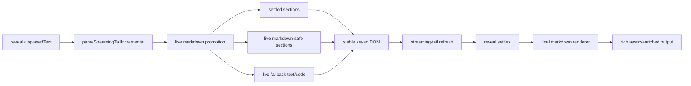

# feat: Add progressive markdown during streaming reveal

## Overview

Add a narrow live-markdown path to streamed assistant messages so already revealed content gains useful markdown structure before the stream settles, while preserving the current reveal controllers, keeping final rich markdown as the authoritative end state, and preventing whole-block flicker or end-of-stream pop-in.

## Problem Frame

Acepe currently renders most streamed assistant content as plain text until reveal settles, then reshapes it into final markdown late in the interaction. That makes answers harder to scan while they are arriving and weakens perceived responsiveness. The requirements document established a hybrid model: show basic markdown progressively during reveal, but keep enriched or heavier rendering deferred to the settled final state (see origin: `docs/brainstorms/2026-04-15-streaming-markdown-during-reveal-requirements.md`).

## Requirements Trace

- R1. Show basic markdown structure while text is still streaming.
- R2. Support a bounded live subset: paragraphs, headings, lists, blockquotes, inline emphasis, inline code, links, and fenced code blocks when safe.
- R3. Prefer stable partial presentation over aggressive reshaping.
- R4. Limit live markdown to already revealed content and preserve the active reveal path.
- R5. Keep one cross-mode live-markdown rule set for smooth/classic/instant without redesigning mode semantics.
- R6. Prevent repeated flicker, re-fade, or re-animation on already visible content.
- R7. Keep the live-to-final handoff continuous, with no abrupt text/tool-block pop-in.
- R8. Preserve the existing full final markdown renderer as the settled end state.
- R9. Keep heavier, async, and enriched markdown deferred until the settled final state.
- R10. Prevent final-only rendering from reclassifying already visible block boundaries for the bounded live-supported subset; unsupported final-only regions may only transition within their own region at settle.
- R11. Fall back to stable live plain text/code when a construct is not yet safe to promote.
- R12. Avoid material stream responsiveness regressions on long answers and degrade gracefully when live formatting gets too expensive.

## Scope Boundaries

- No provider-side chunking changes, session-event changes, or Rust-side streaming changes.
- No new user setting, override, or rollout-specific UX in the product surface.
- No general-purpose incremental markdown engine and no renderer-architecture rewrite.
- No live support for tables, task lists, images, HTML blocks, footnotes, mermaid, badges, or other enriched final-only features in this phase.
- No changes to the existing final markdown renderer's authority over settled output.

## Context & Research

### Relevant Code and Patterns

- `packages/desktop/src/lib/acp/components/messages/markdown-text.svelte` owns reveal state, incremental tail parsing, streaming/live section rendering, and the final markdown handoff. This is the primary implementation seam.
- `packages/desktop/src/lib/acp/components/messages/logic/parse-streaming-tail.ts` already maintains the stable settled/live split and append-only reparsing model. The plan should extend this seam rather than bypass it.
- `packages/desktop/src/lib/acp/components/messages/assistant-message.svelte` hides trailing non-text blocks until the last streaming text reveal is visually inactive; that invariant must remain intact.
- `packages/desktop/src/lib/acp/components/messages/logic/streaming-tail-refresh.ts` already avoids restarting smooth/classic animation on unchanged live sections and should remain the only section-level refresh hook.
- `packages/desktop/src/lib/acp/utils/markdown-renderer.ts` is the authoritative final markdown renderer and must remain unchanged in role: live markdown stays sync-only and cheaper than the settled path.
- `packages/desktop/src/lib/acp/components/messages/markdown-text.svelte.vitest.ts`, `packages/desktop/src/lib/acp/components/messages/assistant-message.svelte.vitest.ts`, `packages/desktop/src/lib/acp/components/messages/logic/__tests__/parse-streaming-tail.vitest.ts`, and `packages/desktop/src/lib/acp/components/messages/logic/__tests__/streaming-tail-refresh.vitest.ts` already cover the fragile seams this work must preserve.

### Institutional Learnings

- `docs/solutions/logic-errors/thinking-indicator-scroll-handoff-2026-04-07.md` — keep reveal ownership and growth-tracking ownership separate; do not let live rendering changes destabilize the active row's follow behavior.
- `docs/solutions/best-practices/provider-owned-policy-and-identity-not-ui-projections-2026-04-09.md` — keep policy attached to canonical stream state, not UI projections; live markdown must derive from `reveal.displayedText`, not from unrevealed source text.
- `docs/solutions/integration-issues/copilot-permission-prompts-stream-closed-2026-04-09.md` — fragile streaming flows need contract tests across boundaries, not just unit tests at one layer.
- `AGENTS.md` — behavior changes in this area should be test-first, and the plan must preserve the existing reviewed-plan -> work workflow.

### External References

- None. The current repo already has strong local patterns for reveal state, streaming handoff, and markdown ownership.

## Key Technical Decisions

- **Keep the final renderer authoritative:** `packages/desktop/src/lib/acp/utils/markdown-renderer.ts` remains the only rich/enriched markdown path. Live rendering is a bounded augmentation inside `packages/desktop/src/lib/acp/components/messages/markdown-text.svelte`, not a replacement.
- **Promote only revealed content:** live markdown may act only on `reveal.displayedText`; unrevealed source text cannot influence on-screen structure ahead of the reveal boundary.
- **Preserve the settled-prefix model:** once a section becomes settled, it is keyed and treated as stable. Tail promotion may convert the current live region into additional settled sections, but already visible settled sections cannot be repartitioned later.
- **Support a bounded live subset:** headings, paragraphs, blockquotes, list items, closed inline emphasis/code/link spans, and fenced code blocks are in scope for live promotion. Unsupported or ambiguous constructs remain live plain text/code until the settled final render.
- **Require safe promotion before styling:** incomplete or ambiguous constructs stay in fallback presentation until the parser can promote them without forcing a large reflow of earlier visible content.
- **Define safe-link eligibility by the existing link policy:** a link is live-promotable only when the markdown link is fully closed and its href resolves to the same safe external-link policy already enforced in `packages/desktop/src/lib/acp/components/messages/markdown-text.svelte` (`http` / `https`). Partial links or other schemes remain plain text until final render.
- **Keep live-link interaction read-first:** live-promoted links remain visually non-interactive during reveal (no pointer cursor, no tab stop, no activation). Real anchor interaction begins only once reveal is inactive.
- **Keep one rule set across smooth/classic/instant:** mode selection still controls reveal pacing only. Progressive markdown applies after reveal, not as a separate per-mode feature.
- **Prefer helper extraction over inflating `markdown-text.svelte`:** the parser/promotion contract and live-render eligibility logic should live in dedicated message logic helpers so tests can prove the behavior without routing everything through the component.
- **Treat responsiveness as a first-class fallback rule:** `render-live-markdown.ts` should measure sync formatting cost per section update through an injectable timing seam. If the same live-tail lineage exceeds an 8 ms budget on two consecutive updates, that lineage stops accepting new promotions until settle. Already visible promoted structure remains frozen in place; only newly arriving tail content for that lineage stays on plain text/code fallback. Tests should use a stubbed timing source to prove breach counting, reset, lineage handoff, and settle behavior deterministically.
- **Budget tracking follows live-tail lineage, not DOM replacement:** the downgrade streak carries forward only while append-only growth stays within the same active live-tail lineage. When that live tail promotes into settled content and a new live successor begins, the new successor starts with a fresh budget counter.
- **Section keys must stay unique within each parse result:** tail growth may replace the last live section or promote it into settled/live successors, but one parse result cannot emit duplicate keyed sections.
- **Constrain final-only reshapes:** advanced constructs that remain final-only may appear only through the settled final-render branch. The live path must fall back instead of surfacing final-only placeholder/block output during reveal, and the settle transition must remain visually continuous for the rest of the message even though the renderer branch swaps under the hood.
- **Keep accessibility semantics conservative during reveal:** during active reveal, the streaming message remains one stable accessible text representation with no extra live announcements and no interactive link focus targets. The final settled render becomes the authoritative semantic upgrade and should replace the reveal-time representation without forcing focus changes or duplicate announcements.
- **Treat followed-stream continuity as a hard UX invariant:** progressive promotion must not introduce a visible jump in followed streams. If the message subtree alone cannot preserve that behavior, the fix extends to `packages/desktop/src/lib/acp/components/messages/message-wrapper.svelte` and `packages/desktop/src/lib/acp/components/agent-panel/components/virtualized-entry-list.svelte`.

## Open Questions

### Resolved During Planning

- **Which constructs are live-supported in phase one?** Paragraphs, headings, blockquotes, list items, closed inline emphasis, closed inline code, safe links, and fenced code blocks. Advanced constructs remain final-only.
- **What is the live/final boundary?** Live markdown runs only on already revealed content and only through a sync-safe path. Final rich rendering still owns async work, badge mounting, repo-context enrichment, and advanced markdown.
- **What counts as safe promotion?** A construct can promote only when doing so does not require a broad restyle of already visible content. Otherwise, the region stays plain live text/code until more structure arrives or the stream settles.
- **How should mode behavior remain consistent?** Live markdown never reveals unrevealed text, never restarts animation on already visible text, and never changes smooth/classic/instant pacing semantics.
- **How should section identity work?** Settled sections keep stable keys, and the live tail may be replaced or repartitioned only at the active tail boundary with unique keys in the new parse result.
- **When may the responsiveness downgrade trigger?** After two consecutive live updates for the same region exceed an 8 ms sync-formatting budget. The downgrade is region-local and lasts only until settle; representative mixed developer-answer streams should remain on the progressive path.
- **What counts as a safe live link?** Only a fully closed markdown link whose href resolves to the existing safe external-link policy (`http` / `https`). Partial or disallowed links stay plain text until final render.
- **How should live links behave while streaming?** They render in a visibly disabled link state: text remains readable as link-like content, but there is no pointer cursor, tab stop, or activation until the settled final renderer takes over.
- **How should assistive-tech semantics behave during reveal?** Reveal-time content stays a single stable accessible text representation, and the final settled render provides the semantic upgrade without duplicate announcements or forced focus movement.

### Deferred to Implementation

- The exact helper names and file-local API shapes inside the message logic layer.
- Whether live fenced-code rendering should reuse the current open-fence shell directly or share a thinner helper with the final code-block renderer, as long as final-only enrichment stays deferred.

## High-Level Technical Design

> *This illustrates the intended approach and is directional guidance for review, not implementation specification. The implementing agent should treat it as context, not code to reproduce.*

| Live region state | Streaming presentation | Deferred to final render |
|---|---|---|
| Stable paragraph / heading / blockquote / list item | Sync live markdown | Badge mounting, repo-context enrichment |
| Closed inline emphasis / inline code / safe link span | Sync live markdown inside the active revealed region | Async-only or enriched inline transforms |
| Open or ambiguous inline markers | Plain live text fallback | Final markdown interpretation |
| Open fenced block | Live code shell | Syntax highlighting and enriched block actions |
| Unsupported advanced construct | Plain live text/code fallback | Full final markdown behavior |

## Implementation Units

- [ ] **Unit 1: Define the progressive tail section contract**

**Goal:** Extend the streaming-tail logic so the live region can distinguish safe live-markdown segments from plain-text/code fallback while preserving stable section identity and append-only reparsing.

**Requirements:** R2, R3, R4, R10, R11

**Dependencies:** None

**Files:**
- Modify: `packages/desktop/src/lib/acp/components/messages/logic/parse-streaming-tail.ts`
- Create: `packages/desktop/src/lib/acp/components/messages/logic/live-markdown-promotion.ts`
- Test: `packages/desktop/src/lib/acp/components/messages/logic/__tests__/parse-streaming-tail.vitest.ts`
- Test: `packages/desktop/src/lib/acp/components/messages/logic/__tests__/live-markdown-promotion.vitest.ts`

**Approach:**
- Keep `parseStreamingTailIncremental()` as the append-only entry point, but extend the section model so the tail can emit distinct section states for settled markdown, live markdown-safe content, live code, and live plain-text fallback.
- Encode promotion rules in a dedicated helper so the component layer consumes a simple contract instead of re-deriving parser heuristics inline.
- Make safe-promotion rules explicit for the in-scope live subset and keep ambiguous/unsupported constructs on the fallback path.
- Guarantee that one parse result cannot emit duplicate keys and that promotion only changes the active tail boundary, not earlier settled sections.
- Keep this helper coarse-grained and phase-bounded: it may classify only the enumerated live subset and delimiter-complete spans needed for reveal-time promotion. It must not grow into a reusable markdown AST, a general-purpose incremental parser, or support advanced constructs outside this phase.

**Execution note:** Start by repairing or rebaselining the existing `packages/desktop/src/lib/acp/components/messages/logic/__tests__/parse-streaming-tail.vitest.ts` characterization suite, then add failing logic tests for the new promotion and key-stability contract before changing implementation.

**Patterns to follow:**
- `packages/desktop/src/lib/acp/components/messages/logic/parse-streaming-tail.ts`
- `packages/desktop/src/lib/acp/components/messages/logic/__tests__/parse-streaming-tail.vitest.ts`

**Test scenarios:**
- Happy path — `# Title\n\nBody` produces a settled heading section and a live body section that can later promote without changing the heading key.
- Happy path — append-only growth of a list item or blockquote keeps the same live section key until a delimiter promotes it into settled content.
- Happy path — a closed inline emphasis/code/link span becomes live-markdown-safe inside the active revealed region when the link href resolves to the allowed external-link policy.
- Edge case — an open emphasis marker, partial link, or unfinished list marker stays on the plain-text fallback path until enough structure arrives.
- Edge case — a closed markdown link with a disallowed or unparseable href remains fallback text until final render.
- Edge case — an open fenced code block stays `live-code`, then promotes cleanly when the closing fence arrives.
- Edge case — unsupported constructs such as tables or HTML blocks remain fallback content and do not cause broad repartitioning of earlier visible sections.
- Edge case — task-list syntax such as `- [ ]` or `- [x]` remains fallback content and does not quietly promote through the live list-item path.
- Error path — non-append replacement reparses from scratch without duplicating section keys or leaking stale settled/live sections.
- Integration — when tail growth creates a new block boundary, the previous live tail promotes into settled content and a single new live tail is emitted with unique keys.

**Verification:**
- The parser and promotion helper can describe the bounded live subset with unique section keys and a stable settled-prefix contract.

- [ ] **Unit 2: Render live markdown inside `markdown-text.svelte` without changing the final renderer**

**Goal:** Replace plain live-text rendering with bounded sync live markdown for safe sections while preserving the existing final rich markdown handoff and fallback behavior.

**Requirements:** R1, R3, R4, R8, R9, R10, R11, R12

**Dependencies:** Unit 1

**Files:**
- Modify: `packages/desktop/src/lib/acp/components/messages/markdown-text.svelte`
- Create: `packages/desktop/src/lib/acp/components/messages/logic/render-live-markdown.ts`
- Test: `packages/desktop/src/lib/acp/components/messages/markdown-text.svelte.vitest.ts`
- Test: `packages/desktop/src/lib/acp/components/messages/logic/__tests__/render-live-markdown.vitest.ts`

**Approach:**
- Keep the current `visibleHtml`/async/final-render branch unchanged for the settled end state.
- During `isRenderingReveal`, render both settled and live sections only through the bounded live contract: safe sections may use sync live markdown, while any section that would surface final-only placeholder/block output stays on plain text/code fallback until the normal settled final-render branch runs.
- Ensure live markdown never mounts badges, requests repo context, or invokes async rendering while reveal is active.
- Keep `render-live-markdown.ts` intentionally small: it may only map the bounded live subset to minimal escaped presentational output for already-classified sections. It must not duplicate `packages/desktop/src/lib/acp/utils/markdown-renderer.ts`, add enrichment behavior, or widen sanitization policy beyond escaping raw text, treating raw HTML as fallback text, and honoring the existing safe-link scheme allowlist.
- Introduce a narrow responsiveness fallback so an over-budget section freezes its already promoted structure, stops accepting new promotions for the remaining live tail, and resumes normal rendering only when the message reaches the settled final path.
- Preserve copy/select affordances for visible code/text regions even while final-only enrichments remain deferred.
- Keep reveal-time links in a visibly disabled state: readable as links, but no activation, no pointer cursor, and no tab stop while the message is still revealing.

**Execution note:** Implement this test-first from the component and helper seams: prove the live/final split and fallback behavior before changing the render branch.

**Patterns to follow:**
- `packages/desktop/src/lib/acp/components/messages/markdown-text.svelte`
- `packages/desktop/src/lib/acp/utils/markdown-renderer.ts`

**Test scenarios:**
- Happy path — a heading and following paragraph gain live markdown structure before streaming ends.
- Happy path — a closed inline emphasis/code/link span renders as markdown within the live region while the rest of the unrevealed source remains hidden.
- Happy path — a long open fenced block renders through the live code shell until settle, then final markdown takes over.
- Happy path — a mixed developer-answer stream (summary paragraph -> bullet list -> inline code/link -> fenced code -> trailing tool block) stays progressively scannable without losing the continuous handoff.
- Edge case — ambiguous inline markers remain visible as plain text until they can promote safely.
- Edge case — unsupported constructs remain readable fallback text/code during streaming and only gain final formatting after settle.
- Edge case — raw HTML text, malformed tags, or a `javascript:`/other disallowed link target remain escaped fallback text in the live path.
- Error path — if the live helper cannot render a region cheaply enough, the region freezes already promoted structure, keeps new tail content on plain text/code fallback, and leaves the rest of the message untouched.
- Error path — if the live helper cannot safely classify a region, only that region downgrades to plain text/code while the rest of the message keeps rendering.
- Integration — repo-context lookups, badge mounting, and async markdown rendering still do not start until reveal ends.
- Integration — when streaming finishes, the message transitions to the final markdown renderer without a large block-boundary reshape.
- Integration — visible live text/code remains selectable and copyable before and after the live-to-final renderer handoff, and reveal-time links stay in the disabled visual state until settle.

**Verification:**
- `markdown-text.svelte` shows live markdown for the bounded subset while the final markdown renderer remains the only settled rich-render path.

- [ ] **Unit 3: Preserve reveal activity, tail refresh, and trailing-block handoff**

**Goal:** Keep the existing no-flicker and no-trailing-pop-in guarantees while live markdown promotions occur inside the active text reveal.

**Requirements:** R4, R5, R6, R7, R10, R12

**Dependencies:** Unit 2

**Files:**
- Modify: `packages/desktop/src/lib/acp/components/messages/assistant-message.svelte`
- Modify: `packages/desktop/src/lib/acp/components/messages/logic/streaming-tail-refresh.ts`
- Test: `packages/desktop/src/lib/acp/components/messages/assistant-message.svelte.vitest.ts`
- Test: `packages/desktop/src/lib/acp/components/messages/logic/__tests__/streaming-tail-refresh.vitest.ts`

**Approach:**
- Keep `assistant-message.svelte` as the owner of trailing non-text block gating, with `markdown-text.svelte` continuing to report reveal activity upward.
- Ensure live-markdown promotions do not incorrectly report reveal completion early and do not expose trailing blocks before the text handoff is visually complete.
- Continue using `streaming-tail-refresh.ts` as the only section refresh hook, and keep its job scoped to the actively changing live region so already visible content is not reanimated.
- Preserve the existing mode-latched reveal controllers and treat live markdown as post-reveal formatting within the visible region, not a second reveal engine.
- Treat `packages/desktop/src/lib/acp/components/messages/content-block-router.svelte` and `packages/desktop/src/lib/acp/components/messages/acp-block-types/text-block.svelte` as unchanged by default. Touch them only if a failing test proves the current ownership boundary cannot satisfy the handoff contract, and record that deviation during implementation.
- If follow/scroll-anchor regressions surface, extend the fix at the actual owner seam in `packages/desktop/src/lib/acp/components/messages/message-wrapper.svelte` and `packages/desktop/src/lib/acp/components/agent-panel/components/virtualized-entry-list.svelte` rather than weakening the continuity contract at the message subtree.

**Execution note:** Start with failing integration-style component tests for the previously broken handoff cases before changing the parent/child coordination code.

**Patterns to follow:**
- `packages/desktop/src/lib/acp/components/messages/assistant-message.svelte`
- `packages/desktop/src/lib/acp/components/messages/logic/streaming-tail-refresh.ts`
- `packages/desktop/src/lib/acp/components/messages/acp-block-types/text-block.svelte`

**Test scenarios:**
- Happy path — trailing non-text blocks remain hidden while the last text group is still revealing live markdown.
- Happy path — live markdown promotion inside smooth/classic/instant does not change the reveal pacing or restart animation on prior content.
- Edge case — promoting a live tail into newly settled sections does not cause the existing settled prefix to flicker or remount.
- Edge case — a remount with the same `revealKey` preserves the current reveal mode and does not replay already visible sections.
- Error path — a stream interruption or non-append replacement does not leave `onRevealActivityChange` stuck in the wrong state.
- Integration — stream completion with trailing tool blocks still waits for the last text reveal to go inactive before showing those blocks.
- Integration — live markdown promotions inside the message subtree do not introduce extra height churn or repeated refreshes that destabilize the active row's follow anchor; if they do, the fix extends to `packages/desktop/src/lib/acp/components/messages/message-wrapper.svelte` and `packages/desktop/src/lib/acp/components/agent-panel/components/virtualized-entry-list.svelte`.

**Verification:**
- Live markdown promotions do not regress the recently fixed flicker and text/tool-call handoff behavior.

- [ ] **Unit 4: Lock the bounded behavior with cross-layer regression coverage**

**Goal:** Add enough coverage around the bounded live subset, final-only deferrals, and long-response behavior that future streaming changes cannot silently reintroduce raw-burst, pop-in, or performance regressions.

**Requirements:** R1, R2, R5, R7, R8, R9, R11, R12

**Dependencies:** Units 1-3

**Files:**
- Modify: `packages/desktop/src/lib/acp/components/messages/markdown-text.svelte.vitest.ts`
- Modify: `packages/desktop/src/lib/acp/components/messages/assistant-message.svelte.vitest.ts`
- Modify: `packages/desktop/src/lib/acp/components/messages/logic/__tests__/parse-streaming-tail.vitest.ts`
- Modify: `packages/desktop/src/lib/acp/components/messages/logic/__tests__/streaming-tail-refresh.vitest.ts`
- Modify: `packages/desktop/src/lib/acp/components/messages/logic/__tests__/create-smooth-streaming-reveal.test.ts`
- Modify: `packages/desktop/src/lib/acp/components/agent-panel/components/__tests__/virtualized-entry-list.svelte.vitest.ts`

**Approach:**
- Expand tests around representative live constructs instead of trying to exhaustively prove all markdown grammar combinations.
- Keep long-response coverage focused on the contract that matters here: no async/enriched final work during reveal, no large late reshape, and no visible lag-inducing bursts from the live path.
- Add regression coverage around section-key stability so future parser refactors cannot reintroduce duplicate or unstable identities.
- Treat this unit as the hardening pass that validates the bounded design chosen in the earlier units, not as a reason to widen scope into advanced constructs.

**Patterns to follow:**
- `packages/desktop/src/lib/acp/components/messages/markdown-text.svelte.vitest.ts`
- `packages/desktop/src/lib/acp/components/messages/assistant-message.svelte.vitest.ts`
- `packages/desktop/src/lib/acp/components/messages/logic/__tests__/create-smooth-streaming-reveal.test.ts`

**Test scenarios:**
- Happy path — representative heading, list, blockquote, and fenced-code streams gain structure progressively across smooth/classic/instant.
- Edge case — partially closed inline markdown, unsupported advanced constructs, and mixed-content transitions stay stable until safe or final-only.
- Edge case — large responses still defer async markdown, repo-context work, and final-only enrichments until settle.
- Edge case — final-only constructs in mixed responses may restyle only within their own region at settle and must not cause supported live-markdown regions to visibly pop or flicker.
- Error path — a parser/promotion change cannot emit duplicate section keys for one render state.
- Error path — the final markdown renderer can still fall back to plain text if settled rendering fails, without regressing the live-path contract.
- Integration — end-of-stream handoff with trailing non-text blocks remains continuous after progressive live markdown is introduced.
- Integration — workflow-level streams that mix prose, bullets, inline code/link spans, fenced code, and trailing tool output remain readable and followable from first reveal through settle.
- Integration — the over-budget timing seam is deterministic in tests: one budget breach does not freeze promotion, two consecutive breaches freeze only that live-tail lineage, an in-budget update resets the streak, a new live successor starts with a fresh counter, and settle clears the frozen state.
- Integration — if live-markdown updates change message height during a followed stream, `packages/desktop/src/lib/acp/components/messages/message-wrapper.svelte` and `packages/desktop/src/lib/acp/components/agent-panel/components/virtualized-entry-list.svelte` retain the active-row follow anchor without visible jump.

**Verification:**
- The bounded live-markdown contract is enforced by cross-layer tests rather than by convention alone.

## System-Wide Impact

- **Interaction graph:** `assistant-message.svelte` -> `content-block-router.svelte` -> `acp-block-types/text-block.svelte` -> `markdown-text.svelte` remains the only text-render path; `streaming-tail-refresh.ts` stays the only per-section animation hook; `markdown-renderer.ts` stays the settled final renderer.
- **Error propagation:** parser/promotion failures should degrade to stable live plain text/code for the affected region rather than fail the whole message render. Final-render failures should keep the existing plain-text fallback behavior.
- **State lifecycle risks:** section key churn, early reveal-inactive signals, remount continuity, and stale tail-partition state are the highest-risk regressions.
- **API surface parity:** smooth/classic/instant remain feature-parity modes for reveal pacing only; no new settings or cross-surface behavior toggles are introduced.
- **Integration coverage:** parser behavior, component rendering, reveal activity propagation, and trailing block gating all need tests because no single layer can prove the full contract.
- **Unchanged invariants:** final markdown still owns async rendering, repo-context enrichment, badge mounting, and advanced constructs; unrevealed text still never appears on screen; trailing non-text blocks still wait for the last text reveal to settle.

## Risks & Dependencies

### Dependency summary

- Unit 2 depends on Unit 1 defining unique keyed section states and safe-promotion rules.
- Unit 3 depends on Unit 2 preserving the current reveal-activity and final-handoff boundary inside `packages/desktop/src/lib/acp/components/messages/markdown-text.svelte`.
- Unit 4 depends on the earlier units being landed narrowly enough that regression coverage can lock the chosen contract instead of reverse-engineering it.

| Risk | Mitigation |
|------|------------|
| Live promotion reparitions previously visible content and causes flicker | Keep promotion limited to the active tail boundary and lock settled-prefix behavior with parser/component tests |
| Progressive formatting accidentally bypasses reveal pacing | Run live markdown only on `reveal.displayedText` and preserve existing mode-latched reveal controllers |
| Final-only enrichments leak into the live path and cause jank | Keep live rendering sync-only and explicitly test that async markdown, repo-context lookups, and badge mounting remain deferred |
| Tail promotions expose trailing tool blocks too early | Preserve `onRevealActivityChange` ownership and add assistant-message regression tests for end-of-stream handoff |
| Parser refactors create unstable or duplicate keys | Make unique-key behavior an explicit planning decision and enforce it in logic tests |

## Documentation / Operational Notes

- No user-facing docs or new settings copy are required beyond the existing behavior descriptions already shipped for animation modes.
- No rollout or migration work is required because this change stays within the desktop streaming/rendering path.

## Sources & References

- **Origin document:** `docs/brainstorms/2026-04-15-streaming-markdown-during-reveal-requirements.md`
- Related code: `packages/desktop/src/lib/acp/components/messages/markdown-text.svelte`
- Related code: `packages/desktop/src/lib/acp/components/messages/assistant-message.svelte`
- Related code: `packages/desktop/src/lib/acp/components/messages/logic/parse-streaming-tail.ts`
- Related code: `packages/desktop/src/lib/acp/utils/markdown-renderer.ts`
- Related learning: `docs/solutions/logic-errors/thinking-indicator-scroll-handoff-2026-04-07.md`
- Related learning: `docs/solutions/best-practices/provider-owned-policy-and-identity-not-ui-projections-2026-04-09.md`
