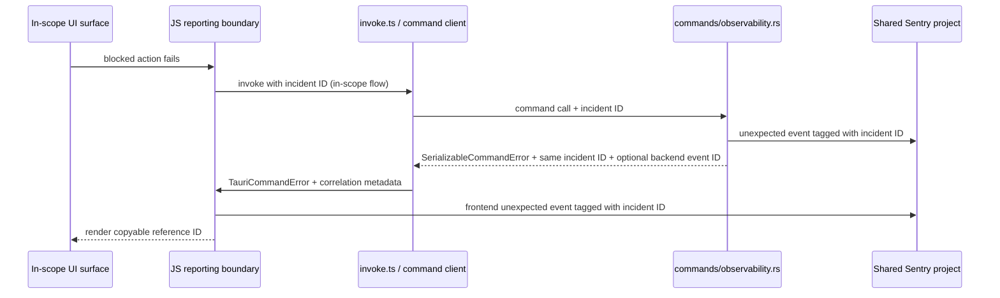

# feat: Unified unexpected error reporting

## Overview

Build a single unexpected-failure reporting path for Acepe's desktop app so JS and Rust failures land in the same Sentry project, share one incident-scoped reference ID, and expose that ID on the three in-scope blocked-user surfaces: the global error boundary, project import/open failures, and the agent panel error card.

## Problem Frame

Acepe already initializes Sentry in both runtimes, but the current system is structurally incomplete. JS command failures are reported through `packages/desktop/src/lib/utils/tauri-client/invoke.ts` with a local `invoke-N` counter, Rust command failures often serialize as plain strings or create unrelated backend UUIDs in `packages/desktop/src-tauri/src/commands/observability.rs`, and blocked users still see vague errors without a durable reference ID. The origin requirements document defines the product contract for this release: unexpected-only reporting, shared cross-layer correlation, exact surface scope, privacy-safe opt-out behavior, and no issue-creation flow in this release (see origin: `docs/brainstorms/2026-04-16-unified-unexpected-error-reporting-requirements.md`).

## Requirements Trace

- R1-R5. Automatically report unexpected JS/Rust failures, preserve expected-failure silence, and keep crash-style fallback capture.
- R6-R9. Carry one incident-scoped reference ID across in-scope JS->Rust flows, keep JS/Rust events in one Sentry project, and support best-available crash IDs when full operation context is gone.
- R10-R13. Limit user-facing rollout to the exact in-scope surfaces and require visible/copyable reference IDs only on those surfaces.
- R14-R17. Preserve privacy-first telemetry behavior, use incident-scoped random IDs, honor the shared analytics opt-out preference, and still show best-effort local IDs when telemetry is unavailable.
- R18. Avoid duplicate-event floods by suppressing repeated identical failures within one app session.

## Scope Boundaries

- Not introducing GitHub issue creation or any other user-report submission flow in this release.
- Not adding user-facing reference IDs outside the global error boundary, blocked project import/open surfaces, and the agent panel error card.
- Not migrating every Tauri command in the repo to the structured observability contract unless that command is required by one of the in-scope surfaces.
- Not changing the success-path UX for project import, project open, or agent-panel recovery actions beyond the new reference-ID affordance.

### Deferred to Separate Tasks

- Broader rollout of reference-ID UX to additional toast-only or inline error surfaces after the three in-scope surfaces prove out.
- Reintroducing a structured issue-report flow once the telemetry and reference-ID contract is stable.

## Context & Research

### Relevant Code and Patterns

- `packages/desktop/src/lib/analytics.ts` already provides `captureException` and `captureCommandFailure`, skips `expected` command failures, and respects the persisted analytics preference via `beforeSend`.
- `packages/desktop/src/lib/utils/tauri-client/invoke.ts` already parses `SerializableCommandError` and carries `backendCorrelationId` / `backendEventId`, but its `invoke-N` counter is JS-local and not a user-meaningful incident ID.
- `packages/desktop/src-tauri/src/commands/observability.rs` already defines the structured Rust error contract (`SerializableCommandError`, `expected_acp_command_result`, `unexpected_command_result`), but generates a new backend UUID instead of preserving an inbound operation ID.
- `packages/desktop/src-tauri/src/analytics.rs` already gates Sentry on the shared analytics preference and installs the tracing layer, so the plan should extend this behavior rather than replace it.
- `packages/desktop/src/lib/components/error-boundary.svelte` already captures `window.error` and `window.unhandledrejection`, and already has copy affordances that can be repurposed for reference IDs.
- `packages/desktop/src/lib/components/main-app-view/logic/managers/project-handler.ts`, `packages/desktop/src/lib/acp/components/welcome-screen/welcome-screen.svelte`, and `packages/desktop/src/lib/components/main-app-view/errors/main-app-view-error.ts` show the current project import/open path: success is modeled, failures become generic app errors or toasts.
- `packages/desktop/src/lib/components/main-app-view/components/content/empty-states.svelte` renders the main empty-state entry point and is a plausible host for the blocked import/open error surface.
- `packages/ui/src/components/agent-panel/agent-error-card.svelte`, `packages/desktop/src/lib/acp/components/agent-panel/components/agent-error-card.svelte`, and `packages/desktop/src/lib/acp/components/agent-panel/components/agent-panel.svelte` show the existing agent error-card pattern and the issue-centric callback that this release will retire.
- `packages/desktop/src/lib/acp/components/agent-panel/scene/desktop-agent-panel-scene.ts` still maps the header-level `createIssueReport` action and must stay consistent with any error-card-level removal.

### Institutional Learnings

- `docs/solutions/best-practices/telemetry-integration-tauri-svelte-privacy-first-2026-04-14.md` is directly applicable: dual-layer opt-out must stay synchronized, `beforeSend` must check opt-out dynamically, and telemetry helpers must never crash the app.

### External References

- None. Local code and institutional learnings are strong enough for this plan, so external research is unnecessary for the initial release scope.

## Key Technical Decisions

- **Extend the existing structured error contract instead of inventing a second one.** `SerializableCommandError` / `TauriCommandError` already bridge Rust and JS; the plan should deepen that contract with a shared reference ID rather than create a parallel telemetry envelope.
- **Make the reference ID the primary user-visible incident handle.** Sentry event IDs remain useful implementation metadata, but the product-facing identifier should be an incident-scoped ID that survives the full correlated JS/Rust failure path.
- **Keep the user-facing rollout exact.** The shared plumbing can improve telemetry under the hood, but only the three named surfaces get reference-ID UI in this release.
- **Treat opt-out and telemetry outages as local-reference-ID mode, not silent failure.** Users should still get a copyable incident handle even when Sentry cannot be searched.
- **Adapt, not replace, the existing UI surfaces.** The error boundary, blocked project-import paths, and agent error card should gain reference-ID affordances while preserving their existing recovery actions and layout roles.

## Open Questions

### Resolved During Planning

- **Should planning rely on external research?** No. Current repo patterns and the telemetry solution doc are sufficient.
- **Should the release keep or expand issue creation?** No. The release stops at reporting, correlation, and reference IDs.
- **Should the in-scope surface list stay open-ended?** No. The release uses the exact surface set from the origin requirements.

### Deferred to Implementation

- **Exact reference-ID transport shape:** whether the shared ID is threaded through generated command args, a command envelope, or a thin wrapper helper should be decided while editing the actual invoke/command plumbing.
- **ACP reclassification policy:** which `SerializableAcpError` variants remain expected versus become unexpected needs an implementation-time audit against current ACP behavior.
- **Dedup fingerprint details:** the concrete fingerprint fields and suppression window should be chosen while touching the telemetry code and tests, not guessed in the plan.

## High-Level Technical Design

> *This illustrates the intended approach and is directional guidance for review, not implementation specification. The implementing agent should treat it as context, not code to reproduce.*

### Failure-ID strategy

| Failure path | Primary ID source | Searchable in Sentry? | User-visible note |
|---|---|---|---|
| In-scope JS -> Rust unexpected command failure | Shared incident ID created before the invoke path and preserved through the serialized command error | Yes, when telemetry is enabled | Normal reference ID |
| Global JS crash / unhandled rejection | Best-available crash/event ID created at capture time | Yes, when telemetry is enabled | Crash/global reference ID |
| Telemetry disabled or unavailable | Locally generated incident ID | No | Local-only reference ID |

### Interaction sketch

## Implementation Units

- [ ] **Unit 1: Standardize the shared reference-ID and JS reporting contract**

**Goal:** Replace the JS-local invoke counter with an incident-scoped reference-ID contract that the frontend reporting boundary can use consistently across in-scope flows.

**Requirements:** R1-R9, R14-R18

**Dependencies:** None

**Files:**
- Modify: `packages/desktop/src/lib/utils/tauri-client/invoke.ts`
- Modify: `packages/desktop/src/lib/utils/tauri-client/serializable-command-error.schema.ts`
- Modify: `packages/desktop/src/lib/analytics.ts`
- Test: `packages/desktop/src/lib/utils/tauri-client/invoke.test.ts`
- Test: `packages/desktop/src/lib/analytics.test.ts`

**Approach:**
- Replace `invoke-N` as the meaningful incident handle with an incident-scoped reference ID generated at the centralized JS reporting boundary for in-scope command flows.
- Keep `backendEventId` as auxiliary metadata; do not use it as the only user-facing identifier.
- Make `captureCommandFailure` operate on the shared classification rule from the requirements instead of ad hoc command-level choices.
- Preserve the current behavior that expected failures do not emit frontend telemetry.
- Keep all new JS capture paths behind the existing dynamic `beforeSend` opt-out gate in `analytics.ts`; do not add new init-time-baked privacy checks.

**Patterns to follow:**
- `packages/desktop/src/lib/utils/tauri-client/invoke.ts` — current `TauriCommandError` parsing and capture hook
- `packages/desktop/src/lib/analytics.ts` — centralized telemetry capture and classification skip for expected failures

**Test scenarios:**
- Happy path — an unexpected structured command failure preserves the same reference ID through invoke parsing, `captureCommandFailure`, and the resulting frontend error object.
- Happy path — an unexpected command failure continues to attach `backendEventId` as supplemental metadata without replacing the shared reference ID.
- Error path — an `expected` command failure still bypasses `captureCommandFailure`.
- Error path — a malformed or non-structured invoke rejection falls back to a local unexpected error path with a best-available reference ID instead of dropping telemetry metadata entirely.
- Error path — toggling analytics off after initialization suppresses subsequent JS capture calls while preserving the local reference-ID path.
- Integration — when analytics is disabled, frontend telemetry capture is skipped but the local reference-ID path remains available for downstream UI surfaces.

**Verification:**
- The frontend invoke/reporting layer produces one consistent reference ID per in-scope incident and no longer treats the local debug counter as the incident handle.

- [ ] **Unit 2: Carry correlated unexpected errors through Rust command observability**

**Goal:** Make Rust-side unexpected command reporting preserve the shared reference ID, respect opt-out, and support in-scope project/ACP command paths without relying on manual capture sites.

**Requirements:** R1-R9, R14-R18

**Dependencies:** Unit 1

**Files:**
- Modify: `packages/desktop/src-tauri/src/commands/observability.rs`
- Modify: `packages/desktop/src-tauri/src/analytics.rs`
- Modify: `packages/desktop/src-tauri/src/storage/commands/projects.rs`
- Modify: `packages/desktop/src-tauri/src/acp/commands/session_commands.rs`
- Test: `packages/desktop/src-tauri/src/commands/observability.rs`
- Test: `packages/desktop/src-tauri/src/acp/commands/session_commands.rs`

**Approach:**
- Extend the Rust observability contract so in-scope unexpected command failures can preserve an inbound incident ID instead of always generating a fresh backend UUID.
- Keep `unexpected_command_result` as the default pattern for string-based unexpected command failures and use it to normalize project import/open command behavior.
- Add a reclassification seam for ACP/session errors so protocol/runtime impossibilities can become unexpected without turning routine user-correctable ACP failures into Sentry noise.
- Preserve the existing analytics-opt-out gate in `analytics.rs` for both direct capture and tracing-layer capture.

**Patterns to follow:**
- `packages/desktop/src-tauri/src/commands/observability.rs` — existing structured command-error envelope and Sentry tagging
- `packages/desktop/src-tauri/src/git/operations.rs` — current `unexpected_command_result` usage pattern
- `packages/desktop/src-tauri/src/analytics.rs` — dynamic opt-out gating with `before_send` / `before_breadcrumb`

**Test scenarios:**
- Happy path — an unexpected project import failure returns a structured `SerializableCommandError` containing the same incident ID that the frontend originated.
- Happy path — an unexpected ACP/session failure that is classified as abnormal emits backend telemetry and returns a structured error the frontend can correlate.
- Edge case — an expected ACP/session error (for example, known not-found or user-correctable state) stays classified as expected and does not emit a backend Sentry event.
- Error path — with analytics opted out, Rust returns structured diagnostics but omits backend Sentry event IDs and emits no telemetry.
- Integration — Rust tagging includes the shared incident ID and command metadata so the same ID can be searched across both runtimes.

**Verification:**
- In-scope Rust command failures return structured, correlated unexpected errors and honor the same analytics opt-out rule as the frontend.

- [ ] **Unit 3: Add best-available reference IDs to the global error boundary**

**Goal:** Ensure the global application error boundary shows a copyable reference ID for unhandled JS failures and clearly differentiates searchable Sentry-backed IDs from local-only fallback IDs.

**Requirements:** R2, R5, R8-R12, R17

**Dependencies:** Unit 1

**Files:**
- Modify: `packages/desktop/src/lib/components/error-boundary.svelte`
- Modify: `packages/desktop/src/lib/analytics.ts`
- Create: `packages/desktop/src/lib/components/error-boundary.svelte.vitest.ts`

**Approach:**
- Extend the error-boundary state to carry reference-ID/searchability metadata alongside the current `Error`.
- Reuse the existing copy affordance pattern, but prioritize copying the reference ID instead of only raw stack text or fix prompts.
- Preserve current benign-error filtering (such as ResizeObserver loop noise).
- Keep the fallback path explicit: if the boundary cannot recover an operation-scoped ID, it shows a best-available crash/global ID and labels it appropriately.
- Keep telemetry capture inside the boundary behind a safety-guarded wrapper so a Sentry failure cannot recursively re-trigger the boundary.

**Execution note:** Start with a failing component test for the new boundary state before reshaping the Svelte UI.

**Patterns to follow:**
- `packages/desktop/src/lib/components/error-boundary.svelte` — current capture and copy behavior
- `packages/desktop/src/lib/analytics.ts` — centralized telemetry helper pattern

**Test scenarios:**
- Happy path — a captured global JS error renders a visible reference ID and a one-click copy action.
- Happy path — an unhandled rejection renders a reference ID and preserves the existing reload/dismiss actions.
- Edge case — benign ResizeObserver loop errors remain ignored and do not trigger the boundary UI.
- Error path — when telemetry is disabled or unavailable, the boundary still renders a local-only reference ID and does not imply Sentry searchability.
- Integration — copying the reference ID works independently of copying the full error text.

**Verification:**
- The global error boundary never leaves a blocked user with only a raw stack trace; it always exposes the appropriate reference-ID state for that incident.

- [ ] **Unit 4: Replace toast-only blocked project import/open failures with reference-ID UX**

**Goal:** Convert blocked project import/open failures from generic toast strings into in-scope user-facing error surfaces that display and copy the reference ID while preserving current success behavior and user-cancel semantics.

**Requirements:** R6-R13, R17

**Dependencies:** Units 1-2

**Files:**
- Modify: `packages/desktop/src/lib/components/main-app-view/errors/main-app-view-error.ts`
- Modify: `packages/desktop/src/lib/components/main-app-view/logic/managers/project-handler.ts`
- Modify: `packages/desktop/src/lib/acp/components/welcome-screen/welcome-screen.svelte`
- Modify: `packages/desktop/src/lib/components/main-app-view/components/content/empty-states.svelte`
- Test: `packages/desktop/src/lib/components/main-app-view/tests/project-handler.test.ts`

**Approach:**
- Extend the project-operation error shape so blocked project failures can carry the reference ID and searchability metadata produced by the centralized reporting boundary.
- Replace the current toast-only experience on blocked import/open paths with a dedicated in-context surface that shows the reference ID and copy affordance. If a new reusable UI surface is required, keep it presentational in `packages/ui` and let `welcome-screen.svelte` / `empty-states.svelte` act as desktop controllers.
- Preserve the existing “user canceled the picker” path as a non-error outcome with no telemetry.
- Keep project-import success behavior unchanged.

**Patterns to follow:**
- `packages/desktop/src/lib/components/main-app-view/errors/main-app-view-error.ts` — typed main-app-view error hierarchy
- `packages/desktop/src/lib/components/main-app-view/logic/managers/project-handler.ts` — current ResultAsync-based error mapping
- `packages/desktop/src/lib/acp/components/welcome-screen/welcome-screen.svelte` — current onboarding import flow

**Test scenarios:**
- Happy path — a blocked project import/open failure renders a reference ID that can be copied from the in-context error surface.
- Happy path — a successful import/open flow remains unchanged and still triggers the current success behavior.
- Edge case — canceling the file picker remains a successful no-op with no reference ID.
- Error path — an expected project validation failure remains product feedback and does not grow a user-facing reference ID.
- Error path — with telemetry off, a blocked import/open surface still shows a local-only reference ID.
- Integration — the project error object preserves the same reference ID that came from the JS/Rust telemetry path.

**Verification:**
- Project import/open failures stop being generic toasts and become traceable, copyable blocked-user incidents.

- [ ] **Unit 5: Adapt the agent panel error card to the reference-ID model**

**Goal:** Remove the issue-centric affordance from the existing agent error card and replace it with a reference-ID-centric surface that still supports retry/dismiss recovery.

**Requirements:** R10-R13, R17

**Dependencies:** Units 1-2

**Files:**
- Modify: `packages/ui/src/components/agent-panel/agent-error-card.svelte`
- Modify: `packages/desktop/src/lib/acp/components/agent-panel/components/agent-error-card.svelte`
- Modify: `packages/desktop/src/lib/acp/components/agent-panel/components/agent-panel.svelte`
- Modify: `packages/desktop/src/lib/acp/components/agent-panel/scene/desktop-agent-panel-scene.ts`
- Modify: `packages/desktop/src/lib/acp/components/agent-panel/types/agent-panel-props.ts`
- Test: `packages/desktop/src/lib/acp/components/agent-panel/components/__tests__/agent-error-card.svelte.vitest.ts`

**Approach:**
- Keep the presentational card in `packages/ui` and move the new reference-ID display/copy contract through props, consistent with the agent panel MVC split.
- Remove the `Create issue` action from the desktop controller flow for this release and replace it with reference-ID metadata/copy behavior.
- Preserve retry/dismiss behavior so the card remains a recoverable agent-failure surface, not a dead end.
- Thread incident metadata from the agent panel controller into the card without teaching the UI package about Sentry or app-specific stores.
- Keep the scene/controller prop contract explicit: retire the issue-report callback path and replace it with reference-ID props/copy callbacks so the scene model, desktop wrapper, and shared UI stay aligned.

**Patterns to follow:**
- `packages/ui/src/components/agent-panel/agent-error-card.svelte` — presentational UI contract
- `packages/desktop/src/lib/acp/components/agent-panel/components/agent-panel.svelte` — current desktop controller and issue-draft callback
- `packages/desktop/src/lib/acp/components/agent-panel/components/__tests__/agent-error-card.svelte.vitest.ts` — current action-focused card test

**Test scenarios:**
- Happy path — an unexpected agent error renders a reference ID and copy affordance while preserving retry and dismiss actions.
- Edge case — the card remains renderable when only a local-only reference ID is available.
- Error path — expected/non-reportable agent failures do not incorrectly show Sentry-backed messaging.
- Integration — removing the create-issue callback does not break the surrounding agent-panel controller contract.

**Verification:**
- The agent panel error card becomes a reference-ID surface aligned with the rest of the release, while keeping its current recovery actions intact.

## System-Wide Impact

- **Interaction graph:** `invoke.ts` and `analytics.ts` become the centralized JS reporting boundary; `commands/observability.rs` and `analytics.rs` become the correlated Rust path; `error-boundary.svelte`, project import/open flows, and the agent panel consume the resulting reference-ID metadata.
- **Error propagation:** Structured unexpected command errors should cross the Tauri boundary with one shared incident ID. Global JS crashes and telemetry-disabled flows should degrade to best-available local IDs without pretending they are searchable in Sentry.
- **State lifecycle risks:** Retrying an operation must create a new incident ID when it is a new failure, while deduplicating repeated identical failures within one app session to avoid quota/noise spikes.
- **API surface parity:** Any in-scope command path that participates in blocked project import/open or agent-session failures must use the same structured error contract so the UI does not split into multiple incident-ID formats.
- **Integration coverage:** The critical cross-layer scenarios are telemetry on/off, expected vs unexpected classification, global crash fallback, repeated identical failures, and the exact three in-scope UI surfaces.
- **Unchanged invariants:** Successful project import/open flows, ordinary expected validation/cancellation UX, and out-of-scope toast-only surfaces should keep their current product behavior.

## Risks & Dependencies

| Risk | Mitigation |
|------|------------|
| ACP/session errors are currently broadly treated as expected, which can hide real abnormal failures | Reclassify only the clearly abnormal ACP/runtime variants in Unit 2 and keep the audit narrow to the in-scope agent surface |
| Reference-ID threading across JS and Rust could sprawl beyond the exact release scope | Restrict transport work to flows reachable from the three in-scope surfaces and keep out-of-scope commands on their current behavior |
| Duplicate Sentry events from both runtimes can bury the signal | Add the explicit dedup/suppression work in Unit 1 + Unit 2 and verify it with session-scoped repeat-failure tests |
| JS and Rust may accidentally point at different Sentry projects | Include release/config verification that `VITE_SENTRY_DSN` and `SENTRY_DSN` resolve to the same project before shipping |

## Documentation / Operational Notes

- Release verification should explicitly confirm that `VITE_SENTRY_DSN` and `SENTRY_DSN` are aligned to the same Sentry project.
- QA should exercise all three in-scope surfaces with telemetry enabled and disabled to confirm reference-ID/searchability messaging stays accurate.
- If the agent error card stops offering issue creation, any tests, copy, or docs that still refer to that action should be updated in the same implementation branch.

## Sources & References

- **Origin document:** `docs/brainstorms/2026-04-16-unified-unexpected-error-reporting-requirements.md`
- Related code: `packages/desktop/src/lib/analytics.ts`
- Related code: `packages/desktop/src/lib/utils/tauri-client/invoke.ts`
- Related code: `packages/desktop/src-tauri/src/commands/observability.rs`
- Related code: `packages/desktop/src-tauri/src/analytics.rs`
- Related code: `packages/desktop/src/lib/components/error-boundary.svelte`
- Related code: `packages/desktop/src/lib/components/main-app-view/logic/managers/project-handler.ts`
- Related code: `packages/desktop/src/lib/acp/components/welcome-screen/welcome-screen.svelte`
- Related code: `packages/ui/src/components/agent-panel/agent-error-card.svelte`
- Institutional learning: `docs/solutions/best-practices/telemetry-integration-tauri-svelte-privacy-first-2026-04-14.md`
