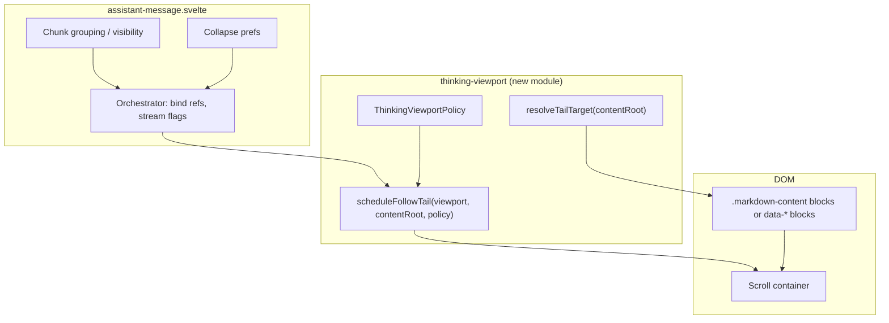

# refactor: Thinking stream viewport policy extraction

## Overview

The assistant **thinking** stream is rendered inside `packages/desktop/src/lib/acp/components/messages/assistant-message.svelte` with **viewport geometry** (max visible lines, line-height), **CSS scroll snap** on markdown blocks, **ResizeObserver** + `requestAnimationFrame` follow behavior, and **DOM queries** (e.g. last `.markdown-content > *`) to pin the streaming tail. That works but **couples** chunk grouping, collapse prefs, markdown rendering assumptions, and scroll physics in one component.

This plan extracts a **testable viewport policy** and a **narrow DOM contract** so `assistant-message` coordinates data and layout without owning scroll algorithm details.

## Problem Frame

- **Maintainability:** Scroll follow, snap, and line-box constraints are intertwined with message chunk logic and **fat inline logic inside** Svelte — thin **`$effect` wiring** for lifecycle is fine; the problem is **untested scroll math and DOM queries** living in the component.
- **Testability:** Behavior is not verified without mounting the full assistant pipeline.
- **Contract clarity:** The scroller depends on **markdown output shape** (`.markdown-content > *`) without an explicit, versioned seam.
- **Related prior art:** Thread-level thinking-indicator scroll handoff is documented in `docs/solutions/logic-errors/thinking-indicator-scroll-handoff-2026-04-07.md` — this plan stays scoped to the **inline thinking box** inside `assistant-message`, not virtualized thread follow.

## Requirements Trace

- R1. **No UX regression** for streaming thinking: tail stays visible while content grows; collapse / header behavior unchanged unless explicitly in scope.
- R2. **Block-level snap** and **line-height budget** (visible line cap) remain **configurable from one place** (single policy object or module constants consumed by CSS variables and JS).
- R3. **Scroll follow policy** is **unit-testable** in isolation (pure functions or DOM-agnostic inputs where feasible).
- R4. **`@acepe/ui`** remains **presentational** — no Tauri or session stores in extracted modules; desktop owns orchestration.
- R5. **Explicit contract** for “what counts as a scroll snap / follow tail block” — documented selectors + **fixture HTML assertions** in tests (avoid noisy full-page snapshots unless a single blessed location is agreed).

## Scope Boundaries

### Desktop vs `@acepe/ui`

- **`MarkdownText`** for assistant messages lives under **desktop** (`packages/desktop/src/lib/acp/components/messages/markdown-text.svelte`), not `@acepe/ui`. Unit 3 contract work targets **desktop** markdown output unless a future shared primitive is introduced.
- **R4** is **not** violated by additive attributes or tests in desktop message code. **`@acepe/ui`** markdown components stay presentational and are **not** in the thinking scrollport path for this refactor unless explicitly extended later.

### In scope / out of scope

- **In scope:** Desktop `assistant-message` thinking region; new small module(s) under `packages/desktop/src/lib/acp/components/messages/` (or `messages/logic/`); focused unit tests; optional `docs/solutions/` entry after `ce:work`.
- **Out of scope:** Replacing `MarkdownText` / markdown pipeline; per-line DOM splitting for sub-line snap; virtualized thread / `VirtualizedEntryList` reveal targets (see origin learning doc above); changing `AgentToolThinking` API unless a thin prop pass-through is required for layout ids.
- **Additive DOM markers:** Unit 3 may add `data-*` (or similar) on existing markdown output — **not** a pipeline swap; wholesale renderer or plugin changes remain out of scope.

### Non-goals

- Unifying types or controllers with thread-level thinking-indicator handoff (`VirtualizedEntryList` / reveal target) — see `docs/solutions/logic-errors/thinking-indicator-scroll-handoff-2026-04-07.md` for that system only.
- New user preferences or settings for thinking viewport geometry.
- Performance SLAs beyond “no intentional regression” and standard manual smoke.
- **Website behavioral parity** with desktop streaming physics unless the website later shares the same code path (today: verify **API/props stability** and unchanged mocks; website may not exercise tail-follow).
- Cross-browser certification beyond **manual smoke** on Chromium plus **one** of Firefox or Safari for snap + `scrollIntoView` (see Verification).

## Context & Research

### Relevant Code and Patterns

- `packages/desktop/src/lib/acp/components/messages/assistant-message.svelte` — thinking scroll, snap CSS, `$effect` wiring, `thinkingContainerRef` / `thinkingContentRef`.
- `packages/desktop/src/lib/acp/components/messages/markdown-text.svelte` — renders `.markdown-content`; any **`data-*` contract** for blocks would be added or documented here (or in shared markdown wrapper used by text blocks).
- `packages/ui/src/components/agent-panel/agent-tool-thinking.svelte` — header/collapse chrome only.
- `packages/desktop/src/lib/acp/components/messages/acp-block-types/text-block.svelte` — routes to `MarkdownText`.
- Tests: `bun:test` elsewhere under `packages/desktop` for patterns.

### Institutional Learnings

- `docs/solutions/logic-errors/thinking-indicator-scroll-handoff-2026-04-07.md` — distinguishes **reveal target** vs **resize-follow target** for the **trailing** thinking row; informs caution when mixing “follow” concepts — inline thinking box should not reuse thread controller types.

### External References

- None required — local scroll/snap patterns and MDN-level semantics are sufficient.

## Key Technical Decisions

- **Decision — Extract policy before reshaping UI:** Move scroll math and “which element to scroll into view” into a **pure or DOM-light module** first; only then thin `assistant-message` effects to call it. *Rationale:* avoids a big-bang rewrite that breaks streaming.

- **Decision — Single `ThinkingViewportPolicy` record:** Fields such as `visibleLineCount`, `lineHeightRem`, `snap: "block-proximity" | "none"`, `followMode: "last-block-end"` map to CSS variables on the scroller and parameters for the follow routine. *Rationale:* one source of truth (R2).

- **Decision — Contract for blocks:** Prefer **stable `data-thinking-scroll-block` (or similar) on block-level nodes** emitted by the markdown container *if* ad-hoc `.markdown-content > *` proves brittle across markdown plugins; minimum is **documented selector + test**. *Rationale:* explicit seam (R5).

- **Decision — Test strategy:** Unit-test **pure helpers** (e.g. resolving target element from a mock `root`, computing whether to schedule follow); avoid structural tests that `readFileSync` source. *Rationale:* matches repo CE testing guidance.

## Open Questions

### Resolved During Planning

- **Q:** Should snap apply during programmatic follow-only, or also for user wheel gestures? **A:** Keep **`proximity`** snap as today — does not fight `scrollIntoView` as much as `mandatory`.

### Deferred to Implementation

- **`data-*` placement:** N/A for shared `@acepe/ui` markdown in the current tree — audit **desktop** `markdown-text.svelte` output first. Add hooks there or in desktop-only wrappers; revisit shared UI only if a cross-app primitive is introduced later.

## Scrollport, snap, and lifecycle contracts

> *Directional only — pick one concrete strategy during implementation and document it in module headers.*

- **Scroll targeting:** `scrollIntoView` can scroll **multiple scrollable ancestors** (e.g. thread vs inline thinking box). **Invariant:** tail-follow must adjust **only** the designated thinking overflow container, not the outer thread scroller — prefer **`scrollTop` / `scrollTo` on that element** after measuring the tail target, **or** `scrollIntoView` with explicit verification that no unintended ancestor scrolls (manual + nested-scroll test below).
- **Teardown:** **`dispose` order:** mark disposed → cancel pending RAF → disconnect `ResizeObserver` → clear refs; **`schedule` no-ops after dispose**; guard callbacks against stale refs (match or improve today’s `thinkingContainerRef` checks).
- **ResizeObserver bursts:** One RO round → at most one RAF follow (dedupe); no unbounded `schedule` loops from re-entrancy.
- **Snap + programmatic scroll:** **Proximity** snap may still jitter on wrap/layout shifts — document as known; avoid `scroll-behavior: smooth` on the thinking scroller unless product requires it.
- **User scroll vs tail-follow:** Current product behavior is **stick to tail while streaming** (no “user scrolled up → pause follow” in scope). If that ever exists, call it out in a follow-up; this refactor **preserves** existing behavior.

## High-Level Technical Design

> *This illustrates the intended approach and is directional guidance for review, not implementation specification. The implementing agent should treat it as context, not code to reproduce.*

**Data flow:** `assistant-message` passes **container + content root + streaming boolean + collapsed** into a small API; the module schedules RAF and attaches `ResizeObserver` **or** returns disposer callbacks — exact API left to implementation to avoid over-specifying.

### Edit ordering (minimize churn)

All units that touch `assistant-message.svelte` should land in dependency order: **Unit 1 → Unit 2 → Unit 4**. Do not parallelize edits to that file across branches without coordination.

### Unit 3 selector audit gate (before optional `data-*`)

Before adding attributes, skim: plugin output for `markdown-text`, multiple `.markdown-content` roots in one thinking view, and non-text blocks (e.g. embedded cards). Document findings in the PR or `thinking-viewport-follow.ts` header.

## Implementation Units

- [x] **Unit 1: Define `ThinkingViewportPolicy` and shared constants**

**Goal:** One typed policy object (or const factory) describing line budget, snap mode, and follow mode; used to set CSS variables and JS behavior.

**Requirements:** R2, R4

**Dependencies:** None

**Files:**
- Create: `packages/desktop/src/lib/acp/components/messages/logic/thinking-viewport-policy.ts` (name adjustable)
- Modify: `packages/desktop/src/lib/acp/components/messages/assistant-message.svelte` (consume policy for `--thinking-*` vars)
- Test: `packages/desktop/src/lib/acp/components/messages/logic/__tests__/thinking-viewport-policy.test.ts`

**Approach:**
- Map existing magic numbers (`--thinking-visible-lines`, `--thinking-line-height`) into the policy; `assistant-message` applies them to the scroll container class or `style` binding.

**Test scenarios:**
- **Happy path:** Policy default yields expected numeric line cap and rem string used for line-height.
- **Edge case:** Invalid or boundary `visibleLineCount` (e.g. 1) still produces coherent CSS variable values.

**Verification:** Policy module imports without Svelte; tests pass; `assistant-message` still renders thinking box with same visual budget as before.

---

- [x] **Unit 2: Extract tail resolution and scroll follow helpers**

**Goal:** Move `scrollThinkingToBottom` / `scheduleThinkingFollow` logic into a testable module; centralize selector strategy (`resolveTailTarget`).

**Requirements:** R3, R5

**Dependencies:** **None** for pure `resolveTailTarget` / `scrollTailIntoView` helpers. **`createThinkingViewportFollow`** may read **policy** only if timing thresholds or line-height-derived values are needed; otherwise land Unit 2’s pure extraction **without** waiting on Unit 1 unless follow wiring requires policy.

**Files:**
- Create: `packages/desktop/src/lib/acp/components/messages/logic/thinking-viewport-follow.ts` (or split follow vs resolve)
- Modify: `packages/desktop/src/lib/acp/components/messages/assistant-message.svelte` (delegate to module)
- Test: `packages/desktop/src/lib/acp/components/messages/logic/__tests__/thinking-viewport-follow.test.ts`

**Approach:**
- **`resolveTailTarget(root)`:** returns last block element using agreed contract (selector or `data-*`).
- **`scrollTailIntoView(target, container)`:** wraps `scrollIntoView({ block: "end", behavior: "instant" })` with guards.
- **`createThinkingViewportFollow(options)`:** returns `{ schedule, dispose }` managing RAF dedupe + `ResizeObserver` on content root — mirrors current effect behavior.

**Execution note:** `packages/desktop` already includes **`@happy-dom/global-registrator`** — use **Happy DOM** (or the project’s existing test DOM pattern) for `resolveTailTarget` / DOM fixtures unless a simpler **minimal `document` fragment** test is sufficient. **Do not** add structural tests that read source files.

**Test matrix (minimum):**

| API | Happy path | Edge / failure |
|-----|------------|----------------|
| `resolveTailTarget` | Last `.markdown-content > *` across multiple roots | Empty root; no markdown — fallback |
| `scrollTailIntoView` / scroll helper | Invokes scroll on intended scrollport only | Missing or detached nodes — no throw |
| `createThinkingViewportFollow` | RO + RAF dedupe | `dispose` cancels RAF + RO; `schedule` no-op after dispose; re-entrancy safe |

**Test scenarios:**
- **Happy path:** Root with two `.markdown-content` sections and multiple children — last block is selected.
- **Edge case:** Empty content root — no throw; fallback to max `scrollTop` behavior.
- **Edge case:** No `.markdown-content` — fallback to `lastElementChild` path.
- **Integration (light):** Calling `schedule` twice in one frame still results in single RAF (dedupe).
- **Error path:** `dispose` during pending RAF — no second scroll; observer disconnected.
- **Edge case:** `scrollIntoView` / scroll helper when target is `null` — no-op.

**Verification:** `assistant-message` effects shrink to wiring; follow behavior unchanged in manual smoke.

**Optional:** One **characterization test** capturing current tail resolution on a fixed HTML fixture **before** thinning effects (helps catch refactor drift); skip if time-boxed — then rely on manual R1 checklist.

---

- [ ] **Unit 3: Stabilize block contract (optional but recommended)**

**Goal:** If audit shows fragile selectors, add **`data-*` markers** on block outputs used for thinking (desktop-only wrapper or coordinated change in markdown output).

**Requirements:** R5

**Dependencies:** Unit 2

**Files:**
- Modify: `packages/desktop/src/lib/acp/components/messages/markdown-text.svelte` and/or block wrappers — **only if** required; alternatively document selector-only contract in `thinking-viewport-follow.ts` header comment.
- Test: extend `packages/desktop/src/lib/acp/components/messages/logic/__tests__/thinking-viewport-follow.test.ts` for new selector.

**Approach:**
- Prefer **one attribute** on each logical block row (e.g. `data-thinking-scroll-block`) over deep class coupling.

**Test scenarios:**
- **Happy path:** Mock HTML with attributes — resolver returns last attributed block.
- **Edge case:** Mixed legacy DOM without attributes — resolver falls back to previous selector for one release or uses feature-detect.

**Verification:** No change in visual output; resolver tests cover both paths if dual support exists.

---

- [x] **Unit 4: Consolidate scroll-snap CSS with policy**

**Goal:** Move snap rules adjacent to policy documentation; ensure `.thinking-content` (or renamed class) uses only variables from Unit 1.

**Requirements:** R2, R1

**Dependencies:** Unit 1. **Sequencing:** Land **after Unit 2** if Unit 2 renames the scroll container class or moves markup; otherwise Unit 4 can follow Unit 1 once variables exist.

**Files:**
- Modify: `packages/desktop/src/lib/acp/components/messages/assistant-message.svelte` (scoped styles)
- Optionally: small shared CSS fragment or Tailwind plugin — **only if** it reduces duplication without breaking `@acepe/ui` boundaries

**Approach:**
- Keep **scroll-snap** on `.markdown-content > *` as today unless Unit 3 changes the selector target.
- Document interaction: **proximity snap** + **`scrollIntoView` tail** — intentional dual heuristic.

**Test expectation:** none — **styling consolidation**; behavior covered by Units 1–2 and manual verification.

**Verification:** Snap + streaming follow still feel correct; no new scrollbar glitches.

---

- [ ] **Unit 5: Document seam and optional `docs/solutions` entry**

**Goal:** Durable explanation for future contributors: policy module, contract, and relation to thread-level thinking scroll doc.

**Requirements:** R3, R5 (knowledge transfer)

**Dependencies:** Units 1–2 (and 3 if done)

**Files:**
- Create: `docs/solutions/ui/thinking-inline-viewport-policy-2026-04-16.md` (path/category per repo conventions) — **during `ce:compound` or as part of work if user requests doc**

**Approach:**
- YAML frontmatter `module`, `tags`, `problem_type` per `CLAUDE.md`.
- Cross-link `docs/solutions/logic-errors/thinking-indicator-scroll-handoff-2026-04-07.md` with clear scope difference.

**Test expectation:** none — documentation.

**Verification:** Doc is discoverable from `docs/solutions/` index or search.

## Requirements vs verification

| Requirement | Verification |
|-------------|----------------|
| R1 No UX regression | Manual checklist below + `bun run check`; unit tests for extracted helpers |
| R2 Single policy source | Policy module + CSS vars wired from one export; code review |
| R3 Testable follow policy | Tests under `messages/logic/__tests__/` pass |
| R4 UI boundaries | No new logic in `@acepe/ui`; desktop-only DOM contract |
| R5 Explicit contract | Documented selector or `data-*` + resolver tests |

**R1 manual checklist (assign to implementer or reviewer):** (1) Long streaming thinking text — tail stays visible. (2) Toggle thinking collapse header — unchanged. (3) **Nested scroll:** outer thread/panel scrollable — only the **thinking** inner scroller moves during tail-follow. (4) **Unmount / fast navigation** away mid-stream — no console errors; no duplicate observers (spot-check in DevTools). (5) **Resize** split or window while streaming — no runaway RAF. (6) **Browser zoom ≠ 100%** — acceptable layout. (7) **Firefox or Safari** once — snap + tail follow acceptable.

## System-Wide Impact

- **Interaction graph:** Only `assistant-message` and new `messages/logic/*` modules; **desktop** `MarkdownText` touched only if Unit 3 adds attributes.
- **Error propagation:** Follow helpers must **no-op safely** if refs undefined during teardown (match current cancel behavior).
- **State lifecycle risks:** Dispose `ResizeObserver` and cancel RAF on unmount — preserve current cleanup `$effect` behavior; **one** follow-controller instance per thinking mount — **dispose-before-recreate** if reactive inputs change.
- **Website / demos — API vs behavior:** **Props and public component APIs** used by website mocks stay unchanged. **Behavioral parity** with desktop streaming tail-follow is **not** claimed unless the website uses `assistant-message`; verify mocks still render.
- **Unchanged invariants:** `AgentToolThinking` props and agent panel scene model are unchanged unless a pass-through class name is needed.

### Stakeholder / sign-off

- **Engineering:** Implements units + automated tests; runs R1 checklist before merge.
- **Release note:** Optional — internal refactor unless user-visible jitter/regression is observed.
- **`docs/solutions`:** Optional per Unit 5 / `ce:compound`; not a merge blocker unless team policy says otherwise.

## Risks & Dependencies

| Risk | Mitigation |
|------|------------|
| `scrollIntoView` scrolls wrong scrollable ancestor | Prefer `scrollTop` on the thinking container or verified `scrollIntoView`; nested-scroll manual test (R1 checklist) |
| RAF / RO after unmount | Disposal contract above; tests for dispose |
| Duplicate `$effect` / follow controller instances | Document reactive inputs; single mount pairing |
| `scroll-snap` vs programmatic tail jitter | Proximity snap; document known subpixel/wrap cases |
| Cross-engine / zoom | R1 checklist: non-Chromium + zoom |
| Over-engineering Unit 3 | Selector audit gate; skip `data-*` if stable |

## Documentation / Operational Notes

- After implementation, run `bun run check` in `packages/desktop` per repo rules.
- Complete **R1 manual checklist** above.

## Document review (parallel subagent pass, 2026-04-16)

Synthesized findings integrated into this revision:

- **Dependencies:** Unit 2 no longer incorrectly **requires** Unit 1 for pure tail resolution; Happy DOM noted as available in `packages/desktop`.
- **Tests:** Expanded matrix for `dispose`, re-entrancy, and scroll helper; discouraged noisy snapshots in R5.
- **Scope:** Desktop vs `@acepe/ui` clarified; non-goals and additive-DOM vs pipeline swap; website API vs behavior.
- **Scroll / lifecycle:** New section for scrollport invariant, teardown order, user-scroll assumption, RO dedupe.
- **Process:** Edit order **1 → 2 → 4** for `assistant-message.svelte`; Unit 3 audit gate; R1 checklist and stakeholder notes.

**Headless review (2026-04-16):** Scope, traceability, risks, and unit sequencing are sufficient for execution. No blocking contradictions; R4 vs desktop `MarkdownText` is explicit. Optional follow-up: validate `scrollIntoView` vs `scrollTop` choice in manual R1 nested-scroll check.

## Sources & References

- **Origin:** Conversation / architecture review (no dedicated `docs/brainstorms/*-requirements.md` for this refactor).
- Related learning: [thinking-indicator-scroll-handoff-2026-04-07.md](../solutions/logic-errors/thinking-indicator-scroll-handoff-2026-04-07.md) (thread-level; scope differs).
- Related code: `packages/desktop/src/lib/acp/components/messages/assistant-message.svelte`, `packages/ui/src/components/agent-panel/agent-tool-thinking.svelte`
