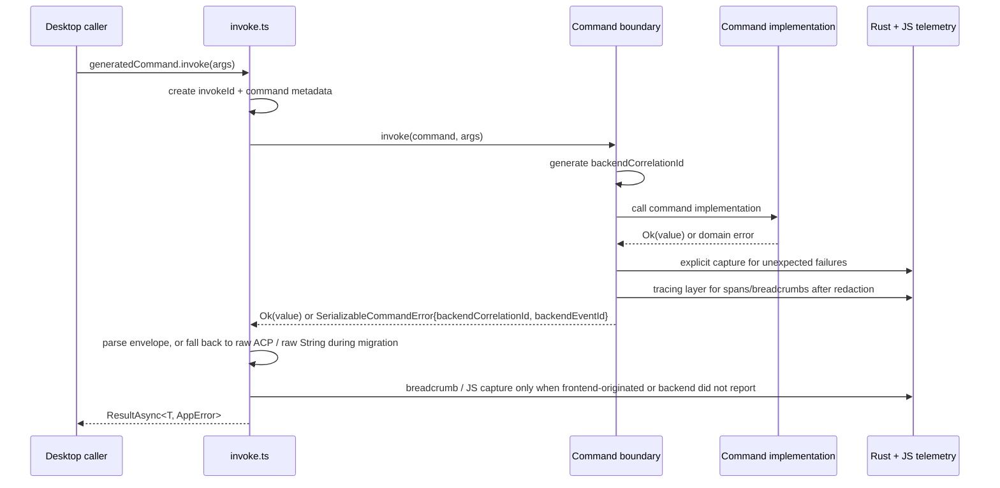

# refactor: Unified command observability contract

## Overview

Unify Acepe's desktop observability around the real seam that matters: the Tauri command boundary. The end state is a single cross-runtime contract where every command failure is serialized as structured metadata instead of a raw string, unexpected backend failures are captured explicitly at the boundary to return a synchronous `backendEventId`, existing `tracing::error!` calls flow into Sentry through the tracing integration after a PII audit/redaction pass, and the frontend invoke layer records local invoke IDs while consuming backend-generated correlation metadata without rebuilding the existing JS telemetry client.

## Problem Frame

Acepe already has pieces of a telemetry story, but they stop at different seams:

- `packages/desktop/src-tauri/src/analytics.rs` initializes Rust Sentry but only documents explicit `capture_error()` usage; there are no current call sites.
- `packages/desktop/src/lib/analytics.ts` already initializes frontend Sentry and PostHog with privacy-aware opt-out behavior, but it does not own the Tauri command contract.
- `packages/desktop/src/lib/utils/tauri-client/invoke.ts` is the universal invoke choke point, but it currently receives raw backend failures, preserves ACP's structured error payloads only opportunistically, and wraps everything else as generic `AgentError`.
- ACP already has a serializable Rust error enum in `packages/desktop/src-tauri/src/acp/error.rs`, but most non-ACP command groups still return `Result<T, String>` at the command boundary.

That split produces the current failure mode: better Rust error handling yields fewer panics, so backend failures disappear from Sentry unless a command author manually remembers to report them. Meanwhile the frontend loses structure at the boundary and can only re-wrap opaque strings. The architectural fix is to make command-boundary observability automatic and shared, not optional and per-command.

## Requirements Trace

- R1. Every error that crosses the static Tauri command boundary must serialize through one shared command error contract instead of ad hoc `String` values.
- R2. Backend reporting for unexpected command failures must happen automatically at the boundary layer, not by asking command authors to call Sentry helpers manually.
- R3. Rust `tracing` output must be connected to Sentry so existing `tracing::error!` and command-scoped spans become useful observability signals.
- R4. The frontend invoke seam must record a per-command local invoke ID, preserve structured backend error metadata, accept backend-generated correlation IDs and event IDs, and enrich JS-side telemetry with command context.
- R5. Existing frontend Sentry initialization, analytics opt-out semantics, and ACP-specific typed error payloads must remain compatible.
- R6. The contract must distinguish expected/user-actionable failures from unexpected/backend-actionable failures so reporting volume, grouping, and user messaging stay intentional.
- R7. Success payloads, command names, and current domain argument shapes must remain stable for existing callers; observability metadata should be generated at command entrypoints rather than injected into every command payload.

## Scope Boundaries

- This refactor does **not** redesign PostHog, product analytics events, or desktop opt-out UX; it stays focused on command-boundary error observability.
- This refactor does **not** rename Tauri commands or change successful response shapes.
- This refactor does **not** require every internal helper to stop returning `String` or `anyhow::Error` immediately; deeper helpers may keep their current types while the command boundary normalizes them.
- This refactor does **not** add a second frontend telemetry stack; it extends `packages/desktop/src/lib/analytics.ts`.
- This refactor does **not** introduce distributed tracing outside the desktop app or a new external telemetry vendor.

### Deferred to Separate Tasks

- Broader cleanup of internal helper error types that never cross the command boundary may follow once the shared contract lands.
- Product work that surfaces backend event IDs or support bundles directly in the UI can build on this contract later if desired.

## Context & Research

### Relevant Code and Patterns

- `packages/desktop/src-tauri/src/analytics.rs` owns Rust Sentry initialization today and is the natural home for Sentry-layer configuration.
- `packages/desktop/src-tauri/src/lib.rs` initializes `tracing_subscriber` and is where the Sentry tracing layer must be registered.
- `packages/desktop/src-tauri/src/commands/registry.rs` is the canonical inventory of registered static commands and should drive migration coverage, but it is a compile-time registration macro rather than a runtime interception point.
- `packages/desktop/src-tauri/src/acp/error.rs` is the current best local precedent for serializable Rust-side command errors.
- `packages/desktop/src/lib/utils/tauri-client/invoke.ts` is the frontend choke point for every generated command and therefore the correct place to inject correlation metadata and normalize returned command errors.
- `packages/desktop/src/lib/analytics.ts` already owns frontend Sentry capture, opt-out gating, and test coverage for JS-side telemetry behavior.
- `packages/desktop/src/lib/acp/errors/deserialize-acp-error.ts` and related schemas show how backend domain payloads are currently mapped back into typed frontend errors.
- Representative non-ACP command groups such as `packages/desktop/src-tauri/src/git/operations.rs`, `packages/desktop/src-tauri/src/file_index/commands.rs`, `packages/desktop/src-tauri/src/storage/commands/projects.rs`, and `packages/desktop/src-tauri/src/voice/commands.rs` still return raw `String` errors at the Tauri edge.
- `packages/desktop/src-tauri/Cargo.toml` currently enables `sentry` without the `tracing` feature, so the plan must call out that prerequisite explicitly.
- `packages/desktop/src-tauri/src/lib.rs` initializes the tracing subscriber before `analytics::init()` resolves the persisted analytics opt-out preference, which means the Sentry tracing layer must be composed into the one-time subscriber initialization rather than bolted on later.

### Institutional Learnings

- `docs/solutions/best-practices/telemetry-integration-tauri-svelte-privacy-first-2026-04-14.md` documents the existing privacy contract: JS and Rust telemetry must share opt-out behavior, Sentry `beforeSend` must check runtime state, and telemetry must never recurse into crash-on-crash loops.

### External References

- Sentry's Rust tracing guide confirms that `sentry::integrations::tracing::layer()` can turn error-level `tracing` events into Sentry events and lower-severity logs into breadcrumbs, which directly matches Acepe's existing `tracing` usage.

## Key Technical Decisions

- **Use one top-level serializable command error envelope for all Tauri commands.** The new Rust-side contract should carry command name, classification (`expected` vs `unexpected`), a backend-generated correlation ID, a user-safe message, optional domain payloads, and strictly redacted diagnostic metadata. *Rationale:* the frontend needs one parser and the backend needs one reporting seam, even when domain payloads differ.
- **Preserve ACP's structured payloads inside the new envelope instead of replacing them.** ACP already has a durable serializable error taxonomy; the new contract should wrap or adapt it so typed ACP consumers stay typed while the cross-runtime metadata becomes uniform.
- **Treat command entrypoint return types as the real backend seam.** Tauri v2 does not provide invoke middleware for wrapping results after dispatch, so the automatic behavior must live in shared command-entry helpers and a common `CommandResult<T>`/conversion pattern at each `#[tauri::command]` boundary. *Rationale:* this is the feasible path that still keeps capture/classification logic centralized and out of domain bodies.
- **Report only backend-owned unexpected failures from the Rust boundary.** Expected failures (validation, missing resources, user-actionable domain errors) should serialize with classification metadata but should not automatically create Sentry events. *Rationale:* this keeps Sentry actionable and avoids punishing normal control flow.
- **Use explicit boundary capture for unexpected command failures and the tracing layer for ambient observability.** Unexpected command failures should be reported with an explicit boundary helper so the code gets a synchronous `backendEventId` to return in the envelope, while `sentry`'s tracing integration supplies breadcrumbs, spans, and ambient secondary events. *Rationale:* tracing alone does not hand back an event ID for de-duplication.
- **Generate local invoke IDs in the frontend and backend correlation IDs in Rust.** `invoke.ts` should create a frontend-local `invokeId` for pending-invoke debugging and JS breadcrumbs, while the Rust command boundary generates the `backendCorrelationId` returned in the response envelope. *Rationale:* Tauri's command argument deserialization does not provide a transparent side-channel for a frontend-supplied reserved field to reach Rust without signature churn.
- **Keep the frontend telemetry module as the only JS Sentry client.** `packages/desktop/src/lib/analytics.ts` already owns initialization, opt-out, and guardrails; command observability should add richer capture helpers there rather than creating another command-specific Sentry module.
- **Always register the Sentry tracing layer inside the one global subscriber init path and gate sending dynamically.** `lib.rs` has one-time debug and release subscriber chains; both should include the Sentry layer before `.init()`, while a shared opt-out flag and `before_send`/event-filter behavior suppress external emission when analytics are disabled. *Rationale:* subscriber composition cannot happen after startup, but opt-out still needs to work after init.
- **Audit and redact before expanding telemetry scope to third-party Sentry.** Existing `tracing::error!`/selected `warn!` fields, ACP subprocess payloads, and backend diagnostic metadata must be audited/redacted before they become externally reportable, and JS telemetry helpers must never forward `argsStr` or raw domain payloads. *Rationale:* this refactor changes a trust boundary, not just a logging implementation.
- **Use the command registry as migration inventory, not runtime middleware.** Because `packages/desktop/src-tauri/src/commands/registry.rs` is the static inventory of registered commands, migration and regression checks should follow registry groups rather than ad hoc file-by-file sweeps.
- **Treat the first pass as whole-surface, not ACP-only.** ACP is the best precedent, but the architectural issue exists across the entire registered command surface; leaving non-ACP command groups on raw `String` would preserve two incompatible observability models.

## Open Questions

### Resolved During Planning

- **Does the frontend still need a Sentry client added from scratch?** No. `packages/desktop/src/lib/analytics.ts` already initializes Sentry and should be extended rather than duplicated.
- **Should the first pass cover only ACP commands?** No. The first pass should cover the full static Tauri command surface so Acepe does not keep a split command observability model.
- **Must every lower-level helper stop returning `String` before the refactor is useful?** No. The command boundary may adapt current helper/domain error types into the shared envelope while deeper cleanup remains incremental.
- **Where should command correlation originate?** The frontend should create a local `invokeId` for JS telemetry, while the Rust boundary should create the `backendCorrelationId` returned in the shared envelope.
- **What is the feasible backend boundary mechanism?** Shared entrypoint return types and helper conversions at each `#[tauri::command]` boundary, not a registry or Tauri middleware interception layer.
- **How should startup sequencing handle the Sentry tracing layer?** Register the Sentry tracing layer in both debug and release subscriber chains before `.init()`, and let the later Rust analytics init activate or suppress sending via shared runtime state.

### Deferred to Implementation

- **Exact serde shape for nested ACP/domain payloads:** implementation should confirm the final JSON shape with `serde_json` round-trips so nested tagged enums remain stable for the frontend parser.
- **Which spawned-task sites receive explicit Sentry hub propagation in the first pass:** implementation should verify the highest-value ACP/background task sites and document any global-scope fallback that remains out of scope for the first pass.
- **Whether Rust performance traces stay sampled at `0.1` or are temporarily reduced until the privacy review is complete:** implementation should decide this once the redaction audit is concrete.

## High-Level Technical Design

> *This illustrates the intended approach and is directional guidance for review, not implementation specification. The implementing agent should treat it as context, not code to reproduce.*

The architectural shift is that command observability becomes part of the transport contract. Rust owns classification, backend correlation, explicit reportable captures, and tracing-layer configuration; the frontend owns invoke-local IDs, parsing, compatibility fallbacks, and UI-safe error construction.

## Phased Delivery

### Phase 1 (Units 1-3)

- Land the shared command error envelope, Rust tracing/Sentry integration, frontend invoke compatibility fallbacks, and the PII/redaction safety gates.
- Prove the full round-trip with a synthetic/shared-envelope test before touching production ACP or non-ACP command families.

### Phase 2 (Unit 4)

- Ship the Unit 3 frontend parser and the ACP Rust-side envelope migration in the same release build so ACP error UX never falls back to opaque strings.
- Verify ACP-specific redaction and spawned-task scope propagation at the highest-value sites.

### Phase 3 (Units 5-6)

- Migrate a pilot non-ACP group first, then sweep the remaining registry-backed command families once the pilot contract is stable.
- Finish the whole-surface audit and document the final observability contract.

## Implementation Units

- [ ] **Unit 1: Introduce a shared Rust command observability contract**

**Goal:** Create one serializable backend contract that can represent every command failure with classification, correlation, and optional domain payloads.

**Requirements:** R1, R5, R6, R7

**Dependencies:** None

**Files:**
- Create: `packages/desktop/src-tauri/src/commands/observability.rs`
- Modify: `packages/desktop/src-tauri/src/commands/mod.rs`
- Modify: `packages/desktop/src-tauri/src/acp/error.rs`
- Test: `packages/desktop/src-tauri/src/commands/observability.rs`

**Approach:**
- Define the top-level serializable error envelope plus supporting metadata types (`classification`, `backendCorrelationId`, optional `backendEventId`, optional domain payload discriminator, and redacted diagnostic fields).
- Define the shared `CommandResult<T>` alias plus entrypoint helpers/conversions that command handlers can reuse when moving from `Result<T, String>` or `Result<T, SerializableAcpError>` to the new boundary contract.
- Keep `packages/desktop/src-tauri/src/commands/registry.rs` as the migration inventory only; the real observability seam is the command entrypoint return type, not the registry macro expansion.
- Scope `packages/desktop/src-tauri/src/acp/error.rs` work in this unit to conversions and serde round-trip compatibility with the new envelope; ACP-specific classification/redaction rules land in Unit 4.

**Execution note:** Start with failing Rust unit coverage for classification and serialization behavior before wiring the registry boundary into live command groups.

**Patterns to follow:**
- `packages/desktop/src-tauri/src/acp/error.rs` for serializable domain error design
- `packages/desktop/src-tauri/src/commands/registry.rs` for the canonical static command inventory to audit coverage against

**Test scenarios:**
- Happy path: an expected domain failure serializes with the correct command name, classification, backend correlation ID, and preserved ACP payload.
- Edge case: nested ACP/tagged payloads round-trip through the top-level envelope without breaking serde or losing variant tags.
- Error path: a raw `String` or IO-style failure normalizes to `unexpected` classification with user-safe message plus explicitly redacted diagnostic metadata.
- Integration: a representative command entrypoint using `CommandResult<T>` produces the shared envelope without changing the command's success payload or domain argument shape.

**Verification:**
- One Rust contract can represent command failures across ACP and non-ACP command groups.
- Command-boundary classification is expressed in shared helpers at command entrypoints, not manual Sentry calls scattered through domain bodies.

- [ ] **Unit 2: Connect Rust tracing and backend Sentry to command context**

**Goal:** Make existing Rust logging and unexpected command failures visible in Sentry with command-scoped metadata.

**Requirements:** R2, R3, R6

**Dependencies:** Unit 1

**Files:**
- Modify: `packages/desktop/src-tauri/Cargo.toml`
- Modify: `packages/desktop/src-tauri/src/analytics.rs`
- Modify: `packages/desktop/src-tauri/src/lib.rs`
- Modify: `packages/desktop/src-tauri/src/commands/observability.rs`
- Test: `packages/desktop/src-tauri/src/analytics.rs`

**Approach:**
- Explicitly add the `tracing` feature to the existing `sentry` dependency in `packages/desktop/src-tauri/Cargo.toml`.
- Compose the Sentry tracing layer into **both** the debug and release `tracing_subscriber::registry()` branches in `lib.rs` before `.init()` runs; do not rely on post-init layer insertion.
- Store the Rust analytics opt-out state in shared runtime state (for example an `Arc<AtomicBool>`) so Sentry `before_send` / tracing-layer filtering can suppress events after startup as the preference changes.
- Move Rust-side command reporting concerns into the shared observability boundary so `analytics.rs` becomes configuration plus provider integration rather than a manual helper nobody calls.
- Use explicit boundary capture for unexpected command failures to obtain `backendEventId`, while the tracing layer supplies ambient breadcrumbs/spans and secondary events.
- Audit existing `tracing::error!` / selected `tracing::warn!` call sites and redact fields that would otherwise leak local paths, subprocess strings, or user-controlled content to third-party Sentry.

**Patterns to follow:**
- `packages/desktop/src-tauri/src/lib.rs` for current tracing initialization
- `docs/solutions/best-practices/telemetry-integration-tauri-svelte-privacy-first-2026-04-14.md` for opt-out behavior

**Test scenarios:**
- Happy path: with Sentry configured, an unexpected command failure routes through the explicit backend reporting seam and returns `backendEventId` plus `backendCorrelationId`.
- Edge case: when analytics are opted out before or after startup, later backend captures and tracing-layer emissions are suppressed without breaking local classification/logging.
- Integration: an error-level `tracing` event emitted during a command failure is captured through the Sentry tracing layer in both debug and release subscriber branches.
- Security path: audited/redacted tracing fields and command diagnostics exclude absolute paths / raw subprocess command lines from Sentry-bound payloads.
- Error path: repeated app startup or repeated command execution does not double-initialize Sentry layers or lose the existing local file/console logging behavior.

**Verification:**
- Existing `tracing::error!` calls become part of the Sentry story instead of living only in local logs.
- Backend reporting for unexpected command failures happens automatically from shared infrastructure, while explicit boundary capture remains the source of truth for returned event IDs.

- [ ] **Unit 3: Extend the frontend invoke seam with correlation-aware command telemetry**

**Goal:** Make every frontend command invocation carry correlation metadata, parse the shared backend envelope, and enrich JS telemetry without duplicating backend events.

**Requirements:** R4, R5, R6, R7

**Dependencies:** Unit 1 for implementation; Units 1-2 for end-to-end integration gates

**Files:**
- Create: `packages/desktop/src/lib/utils/tauri-client/serializable-command-error.schema.ts`
- Create: `packages/desktop/src/lib/utils/tauri-client/deserialize-command-error.ts`
- Modify: `packages/desktop/src/lib/utils/tauri-client/invoke.ts`
- Modify: `packages/desktop/src/lib/analytics.ts`
- Modify: `packages/desktop/src/lib/acp/errors/app-error.ts`
- Test: `packages/desktop/src/lib/utils/tauri-client/invoke.test.ts`
- Test: `packages/desktop/src/lib/analytics.test.ts`

**Approach:**
- Generate one local `invokeId` per call in `invoke.ts` for pending-invoke debugging and JS-side breadcrumbs only; do not attempt to smuggle that ID into Rust command payloads.
- Parse the new top-level command envelope before ACP-specific fallback parsing, then fall back in order to raw ACP payloads and raw `String` errors so migration windows stay non-breaking.
- Treat `backendCorrelationId` and `backendEventId` as backend-owned fields returned by the envelope, then map them into typed frontend errors that retain command name, classification, and nested causes/domain payloads.
- Extend `analytics.ts` with command-oriented helper(s) that add only safe telemetry context (`command`, `classification`, `invokeId`, `backendCorrelationId`, `backendEventId`, elapsed timing) and never include `argsStr`, raw command payloads, or redacted-backend diagnostics.
- Gate `window.__PENDING_INVOKES` and `window.__DUMP_INVOKES` behind the existing debug flag (or strip sensitive fields in production) so global JS does not gain production access to in-flight command metadata.
- Add a synthetic round-trip regression gate here: prove the shared envelope parses end-to-end before Unit 4 migrates ACP production files.

**Patterns to follow:**
- `packages/desktop/src/lib/utils/tauri-client/invoke.ts` for the universal invoke wrapper
- `packages/desktop/src/lib/analytics.ts` for existing JS Sentry capture and opt-out safety guards

**Test scenarios:**
- Happy path: a serialized expected backend error becomes a typed frontend error with `invokeId`, `backendCorrelationId`, and preserved cause payload.
- Edge case: a legacy ACP payload returned during migration still deserializes through the ACP fallback instead of breaking callers.
- Edge case: a raw `String` backend error returned during migration still degrades gracefully to the pre-refactor error behavior instead of throwing a parser error.
- Error path: a failure thrown before backend serialization (for example invoke transport failure or parser mismatch) is captured by JS telemetry with command name and local `invokeId`.
- Security path: a command failure with a file-path argument or prompt-like argument does not place `argsStr` or raw payload content into captured Sentry context.
- Integration: an unexpected backend failure with `backendEventId` yields frontend breadcrumbs/tags but does not emit a second Sentry exception event.

**Verification:**
- Frontend callers keep the same generated command API while gaining uniform command metadata on failures.
- JS telemetry becomes command-aware without creating a parallel Sentry initialization path or leaking command arguments.

- [ ] **Unit 4: Adapt ACP to the top-level command envelope without losing typed domain errors**

**Goal:** Carry the new observability contract through the ACP stack while preserving ACP's richer domain-specific error taxonomy.

**Requirements:** R1, R4, R5, R6

**Dependencies:** Units 1-3; Unit 3 parser changes and Unit 4 Rust ACP migration must ship in the same release build

**Files:**
- Modify: `packages/desktop/src-tauri/src/acp/commands/client_ops.rs`
- Modify: `packages/desktop/src-tauri/src/acp/commands/file_commands.rs`
- Modify: `packages/desktop/src-tauri/src/acp/commands/inbound_commands.rs`
- Modify: `packages/desktop/src-tauri/src/acp/commands/install_commands.rs`
- Modify: `packages/desktop/src-tauri/src/acp/commands/interaction_commands.rs`
- Modify: `packages/desktop/src-tauri/src/acp/commands/path_validation.rs`
- Modify: `packages/desktop/src-tauri/src/acp/commands/preconnection_commands.rs`
- Modify: `packages/desktop/src-tauri/src/acp/commands/registry_commands.rs`
- Modify: `packages/desktop/src-tauri/src/acp/commands/session_commands.rs`
- Modify: `packages/desktop/src-tauri/src/acp/error.rs`
- Modify: `packages/desktop/src/lib/acp/errors/deserialize-acp-error.ts`
- Modify: `packages/desktop/src/lib/acp/errors/error-cause-details.ts`
- Test: `packages/desktop/src-tauri/src/acp/commands/tests.rs`
- Test: `packages/desktop/src/lib/utils/tauri-client/invoke.test.ts`
- Test: `packages/desktop/src/lib/acp/errors/__tests__/error-cause-details.test.ts`

**Approach:**
- Update ACP command entry points to return the shared top-level envelope while keeping ACP domain payloads nested and deserializable.
- Preserve the current frontend ability to show ACP cause chains and typed ACP-derived error messages, but make the command-level metadata available to shared invoke/error utilities.
- Classify ACP validation/state errors intentionally: user-actionable session/configuration problems remain `expected`, while transport/protocol/runtime faults that indicate backend bugs or broken integrations become `unexpected`.
- Scope `packages/desktop/src-tauri/src/acp/error.rs` work in this unit to classification/redaction rules for ACP variants (for example `SubprocessSpawnFailed` redaction), building on the conversion support added in Unit 1.
- Apply the Unit 2 hub-propagation helper to the highest-value ACP spawn sites so `tokio::spawn` work triggered by ACP commands does not silently lose command scope.
- Use ACP as the first fully migrated command family because it already exercises the most important typed-error and user-facing failure paths.

**Patterns to follow:**
- Existing ACP serializable error conversions in `packages/desktop/src-tauri/src/acp/error.rs`
- Cause-chain formatting in `packages/desktop/src/lib/acp/errors/error-cause-details.ts`

**Test scenarios:**
- Happy path: an ACP invalid-state or session-not-found error still reaches the frontend as a structured typed cause while now also carrying command metadata plus `backendCorrelationId`.
- Edge case: nested ACP cause chains format correctly when wrapped inside the top-level command envelope.
- Error path: a backend protocol/transport failure in ACP is classified as unexpected, produces backend reporting metadata, and avoids duplicate frontend capture.
- Security path: `SubprocessSpawnFailed` and similar ACP variants exclude absolute paths / raw command lines from Sentry-bound payloads while preserving locally useful diagnostics.
- Integration: representative ACP commands (`acp_new_session`, `acp_resume_session`, `acp_reply_permission`, `acp_list_preconnection_commands`) continue to expose unchanged success payloads while their failures now use the shared envelope.
- Integration: a `tracing::error!` emitted inside a spawned ACP task retains command scope at the selected high-value spawn sites.

**Verification:**
- ACP remains the richest typed error consumer in the app, but now uses the same top-level observability contract as every other command family.
- Existing ACP-focused UI and store code does not regress to raw string failures.

- [ ] **Unit 5: Migrate a pilot non-ACP command group and lock the classification contract**

**Goal:** Prove the shared contract against representative non-ACP families before the whole-surface sweep.

**Requirements:** R1, R2, R6, R7

**Dependencies:** Units 1-4

**Files:**
- Modify: `packages/desktop/src-tauri/src/git/operations.rs`
- Modify: `packages/desktop/src-tauri/src/file_index/commands.rs`
- Modify: `packages/desktop/src-tauri/src/storage/commands/projects.rs`
- Test: `packages/desktop/src-tauri/src/commands/observability.rs`
- Test: `packages/desktop/src/lib/utils/tauri-client/invoke.test.ts`

**Approach:**
- Use `git/operations.rs`, `storage/commands/projects.rs`, and `file_index/commands.rs` as the pilot families because together they exercise subprocess failures, path validation, missing resources, and backend/runtime errors.
- Add characterization coverage first for the current user-visible failure text and then migrate those families to the shared command envelope while preserving success-path behavior.
- Lock the expected/unexpected classification rules and frontend compatibility behavior here before the rest of the sweep begins.
- Treat Unit 5 as the explicit go/no-go gate for Unit 6. If the pilot exposes classification churn or transport surprises, stop and revise the shared helpers before broadening scope.

**Execution note:** Start with failing characterization coverage in `git/operations.rs`; it has the most varied failure modes and is the best canary for classification discipline.

**Patterns to follow:**
- ACP migration from Unit 4 as the finished reference implementation
- Current command entrypoint layout enumerated in `packages/desktop/src-tauri/src/commands/registry.rs`

**Test scenarios:**
- Happy path: pilot non-ACP commands still return unchanged success payloads after signature migration.
- Edge case: user-actionable validation/path failures in git, storage, and file-index commands serialize as `expected` and remain readable to the UI.
- Error path: representative unexpected failures in subprocess/file-system/runtime-heavy commands serialize as `unexpected`, include correlation metadata, and trigger backend reporting.
- Integration: frontend invoke tests covering one ACP and one pilot non-ACP command prove the shared parser handles both payload styles during the mixed rollout window.

**Verification:**
- The pilot command families no longer surface raw `String` errors across the Tauri boundary.
- Classification rules and migration-time parser behavior are stable enough to justify the full sweep.

- [ ] **Unit 6: Sweep the remaining non-ACP command families**

**Goal:** Eliminate raw `Result<T, String>` failures from the rest of the static Tauri command surface and close the split model.

**Requirements:** R1, R2, R6, R7

**Dependencies:** Units 1-5

**Files:**
- Modify: `packages/desktop/src-tauri/src/git/commands.rs`
- Modify: `packages/desktop/src-tauri/src/git/worktree.rs`
- Modify: `packages/desktop/src-tauri/src/checkpoint/commands.rs`
- Modify: `packages/desktop/src-tauri/src/browser_webview.rs`
- Modify: `packages/desktop/src-tauri/src/terminal/commands.rs`
- Modify: `packages/desktop/src-tauri/src/terminal/manager.rs`
- Modify: `packages/desktop/src-tauri/src/storage/commands/settings.rs`
- Modify: `packages/desktop/src-tauri/src/storage/commands/thread_list.rs`
- Modify: `packages/desktop/src-tauri/src/storage/commands/review_state.rs`
- Modify: `packages/desktop/src-tauri/src/storage/commands/reset.rs`
- Modify: `packages/desktop/src-tauri/src/history/commands/projects.rs`
- Modify: `packages/desktop/src-tauri/src/history/commands/scanning.rs`
- Modify: `packages/desktop/src-tauri/src/history/commands/session_loading.rs`
- Modify: `packages/desktop/src-tauri/src/history/commands/plans.rs`
- Modify: `packages/desktop/src-tauri/src/session_jsonl/commands.rs`
- Modify: `packages/desktop/src-tauri/src/cursor_history/commands.rs`
- Modify: `packages/desktop/src-tauri/src/skills/commands.rs`
- Modify: `packages/desktop/src-tauri/src/sql_studio/commands/connections.rs`
- Modify: `packages/desktop/src-tauri/src/voice/commands.rs`
- Modify: `packages/desktop/src-tauri/src/commands/window.rs`
- Modify: `packages/desktop/src-tauri/src/acp/github_commands.rs`
- Modify: `packages/desktop/src-tauri/src/acp/github_issues.rs`
- Test: `packages/desktop/src-tauri/src/commands/observability.rs`
- Test: `packages/desktop/src/lib/utils/tauri-client/invoke.test.ts`

**Approach:**
- Sweep the remaining registry-backed non-ACP command entry points and replace raw `String` boundary failures with the shared command envelope while preserving current user-facing success behavior.
- Audit the sweep against `packages/desktop/src-tauri/src/commands/registry.rs` so no registered command family is accidentally left on the old transport shape.
- Keep the Unit 3 fallback parser in place until this sweep verifies that raw strings no longer cross the Tauri boundary for registry-backed commands.
- Reuse the Unit 5 classification guidance rather than re-deciding expected/unexpected semantics independently in each subsystem.

**Patterns to follow:**
- Unit 5 pilot migration as the reference implementation
- Current command inventory in `packages/desktop/src-tauri/src/commands/registry.rs`

**Test scenarios:**
- Happy path: remaining non-ACP commands still return unchanged success payloads after signature migration.
- Edge case: user-actionable validation/path failures in history, storage, browser-webview, and checkpoint commands serialize as `expected`.
- Error path: representative unexpected failures in terminal, GitHub, and browser-webview command groups serialize as `unexpected`, include backend metadata, and trigger backend reporting.
- Integration: invoke tests prove the raw-string fallback is no longer needed for registry-backed command families after the sweep completes.

**Verification:**
- Registry-backed command families no longer surface raw `String` errors across the Tauri boundary.
- The migration inventory matches the registered command surface instead of a partial subsystem sample.

## System-Wide Impact

- **Interaction graph:** `packages/desktop/src/routes/+layout.svelte` initializes frontend telemetry, generated command clients route through `packages/desktop/src/lib/utils/tauri-client/invoke.ts`, Tauri command entrypoints normalize results through shared `CommandResult<T>` helpers, and backend logging/Sentry initialization live in `packages/desktop/src-tauri/src/lib.rs` plus `packages/desktop/src-tauri/src/analytics.rs`.
- **Error propagation:** command/domain failures normalize into the shared envelope first, then the frontend invoke layer turns them into typed app errors and telemetry breadcrumbs; raw strings remain supported only as an explicit temporary fallback during migration.
- **State lifecycle risks:** duplicate reporting between Rust and JS, dynamic opt-out after subscriber init, tracing-field PII leakage, and async task hub/scope propagation are the main lifecycle hazards.
- **API surface parity:** all static command names and success payloads must stay stable; this plan avoids hidden reserved payload fields and instead generates backend observability metadata at the command boundary.
- **Integration coverage:** Phase 1 needs a synthetic envelope round-trip, Phase 2 needs same-release ACP validation, and Phase 3 needs one pilot plus one sweep-level command from each major namespace so both typed and previously stringly command families prove the same contract.
- **Unchanged invariants:** analytics opt-out behavior, existing frontend Sentry/PostHog initialization, ACP domain semantics, and command-name generation remain intact; this refactor changes failure transport and observability, not product behavior.

## Risks & Dependencies

| Risk | Mitigation |
|------|------------|
| Duplicate Sentry events from backend and frontend for the same failure | Use explicit boundary capture to obtain `backendEventId`, keep tracing integration for ambient signals, and make frontend capture conditional on backend ownership. |
| Sensitive local paths or backend-only diagnostics leaking to users or Sentry | Audit/redact existing tracing call sites, ACP subprocess payloads, and command diagnostics before enabling external reporting; forbid `argsStr` and raw payloads in JS telemetry helpers. |
| Mixed-shape migration regresses error parsing during rollout | Keep explicit fallback parsing for raw ACP and raw `String` errors, ship Unit 3 + Unit 4 together, and require the Unit 5 pilot gate before the full sweep. |
| Startup ordering and runtime opt-out cause the tracing layer to ignore user preference | Register the Sentry tracing layer in both one-time subscriber branches before `.init()`, then gate sending through shared runtime state checked by Sentry filtering hooks. |
| Async background tasks lose command scope after `tokio::spawn` | Add shared hub-propagation helpers, verify them at the highest-value ACP/background task sites, and document any remaining global-scope fallback explicitly. |

## Documentation / Operational Notes

- Reuse existing environment variables (`SENTRY_DSN`, `VITE_SENTRY_DSN`) unless implementation uncovers a concrete mismatch that requires an explicit follow-up.
- After implementation, capture the final command observability pattern in `docs/solutions/` because this will become a reusable dual-runtime telemetry precedent for future Acepe work.
- Manual smoke after implementation should include: analytics opt-out enabled, analytics opt-out toggled after startup, one expected command failure, one unexpected backend failure, one ACP subprocess-style failure with redaction, and a production-mode check that debug invoke globals do not expose in-flight command metadata.

## Sources & References

- Related code: `packages/desktop/src-tauri/src/analytics.rs`
- Related code: `packages/desktop/src-tauri/src/lib.rs`
- Related code: `packages/desktop/src-tauri/src/commands/registry.rs`
- Related code: `packages/desktop/src-tauri/src/acp/error.rs`
- Related code: `packages/desktop/src/lib/utils/tauri-client/invoke.ts`
- Related code: `packages/desktop/src/lib/analytics.ts`
- Institutional learning: `docs/solutions/best-practices/telemetry-integration-tauri-svelte-privacy-first-2026-04-14.md`
- External docs: `https://docs.sentry.io/platforms/rust/guides/tracing/`
