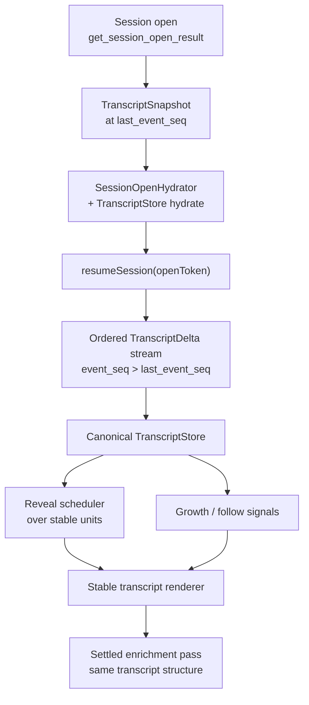
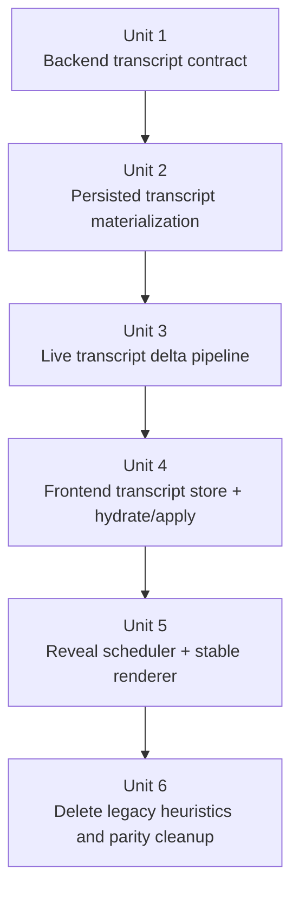
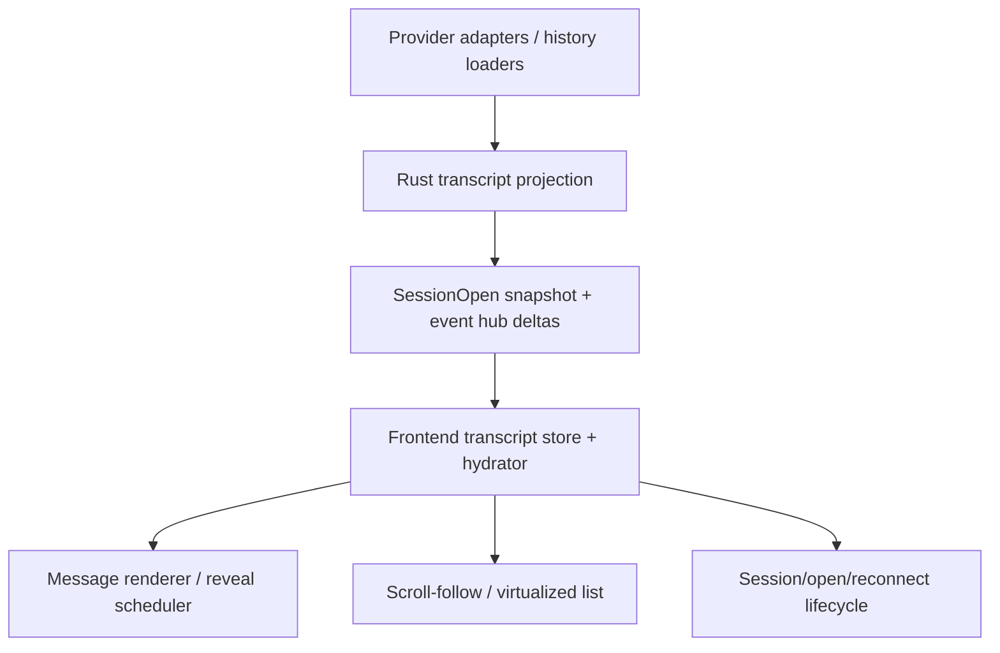

# refactor: Canonical streaming projection architecture

## Overview

Replace the current streaming pipeline with a projection-owned transcript architecture built on top of PR #129's unified session-open contract. Session open should hydrate a canonical transcript snapshot at a proven `last_event_seq`, live connect should deliver only ordered transcript deltas after that cutoff, reveal should pace stable transcript nodes instead of reparsing raw text, and rendering should preserve DOM identity long enough for in-flight fades and scroll-follow behavior to stay coherent.

**Target base:** this plan is defined against the post-merge tree of PR #129 (`refactor/unified-session-open-protocol` / `https://github.com/flazouh/acepe/pull/129`), not the current `main` branch state before that PR lands.

## Problem Frame

PR #129 fixes the session-open side of the architecture: persisted open now hydrates one backend-authored snapshot and connect claims an `openToken` reservation instead of replaying history. That is the correct base contract.

The remaining streaming stack is still architecturally weak because message content does **not** yet follow the same model. The frontend still reconstructs meaning from streamed text by:

1. receiving chunk-shaped updates,
2. appending text into session entries,
3. reparsing the visible tail on every reveal tick,
4. regenerating HTML for the live section,
5. inferring which words are "new" so CSS can fade them.

That creates the exact instability we observed:

- char-paced reveal drives word-based animation, so visible cadence feels bursty;
- re-rendering the live section tears down animation wrappers before their fade can finish;
- markdown structure is rediscovered repeatedly from partial text instead of owned as stable runtime state;
- reconnect/open correctness is improving under PR #129, but transcript streaming still relies on frontend dedupe and reconstruction heuristics rather than one canonical snapshot-plus-delta contract;
- scroll/follow behavior remains exposed to renderer churn instead of reading stable transcript growth.

The god-clean target is to give transcript streaming the same architectural treatment that PR #129 gives session open:

```text
provider transport
  -> backend transcript projection
  -> SessionOpen snapshot at last_event_seq
  -> ordered transcript deltas after that cutoff
  -> frontend transcript store
  -> reveal scheduler over stable nodes
  -> renderer
```

This plan supersedes the architectural direction of:

- `docs/plans/2026-04-15-004-refactor-streaming-word-fade-redesign-plan.md`
- `docs/plans/2026-04-15-002-feat-streaming-markdown-during-reveal-plan.md`

Those plans identified real symptoms, but they still assumed a frontend reconstruction pipeline. This plan replaces that premise with a canonical transcript projection built on PR #129.

## Requirements Trace

- R1. Streaming transcript state must hydrate from one backend-owned snapshot at session open and continue via ordered deltas only.
- R2. Live streaming must stop reparsing the full visible tail from raw text on every reveal update.
- R3. Reveal pacing and animation lifetime must operate on the same unit of visible content so fades can complete smoothly.
- R4. Markdown structure visible during streaming must come from stable transcript/projection state, not repeated inference from regenerated HTML strings.
- R5. Reconnect/open must remain gap-free under PR #129's `last_event_seq` + `openToken` contract, with no replay-shaped transcript heuristics added back in.
- R6. Already visible content must retain stable DOM identity across later streamed updates so it does not re-fade, flicker, or get structurally replaced.
- R7. The final settled message may enrich or finalize transcript presentation, but it must not rely on a late whole-message reshape to become readable.
- R8. The architecture must keep scroll/follow and active-row behavior stable while streamed content grows.
- R9. Tool, interaction, and transcript surfaces must continue following the repo's "one runtime owner, many projections" rule.
- R10. The end state must use one streaming behavior, not preserve legacy animation-mode branching.

## Scope Boundaries

- No provider-side network transport redesign beyond the canonical transcript event boundary needed to support this projection model.
- No redesign of the visual agent panel shell, kanban shell, or panel layout system.
- No coexistence plan that preserves the current text-tail reparse architecture in parallel once the new projection path lands.
- No separate user-facing animation-mode matrix; this architecture targets one canonical streaming behavior.
- No attempt to fold every non-transcript ACP concept into the same plan beyond the seams that transcript correctness actually touches.

### Deferred to Separate Tasks

- Visual polish beyond the canonical architecture baseline, such as per-word stagger tuning or richer settled-state transitions.
- Additional transcript-derived analytics beyond the contract-violation and ordering instrumentation needed to validate the architecture.

## Context & Research

### Relevant Code and Patterns

- `packages/desktop/src-tauri/src/acp/session_open_snapshot/mod.rs` already provides the correct session-open backbone: backend-owned snapshot, proven cutoff, and `openToken` reservation before connect.
- `packages/desktop/src-tauri/src/acp/event_hub.rs` already buffers post-open deltas by reservation token; that is the right delivery seam for transcript deltas too.
- `packages/desktop/src-tauri/src/acp/session_thread_snapshot.rs` and `packages/desktop/src-tauri/src/history/commands/session_loading.rs` show that PR #129 already introduced persisted thread snapshots, but they currently persist `StoredEntry[]` rather than a transcript-native projection.
- `packages/desktop/src/lib/acp/store/services/session-open-hydrator.ts` already enforces monotonic snapshot application by `lastEventSeq`; this is the correct frontend hydration seam to reuse for transcript state.
- `packages/desktop/src/lib/acp/store/session-store.svelte.ts` currently replaces transcript entries from `threadEntries`, but still stores them as converted session entries rather than a transcript projection with stable render identity.
- `packages/desktop/src/lib/acp/store/session-event-service.svelte.ts` still contains replay fingerprinting, chunk dedupe, and pending-event flush behavior tuned for raw session updates rather than projection-owned transcript deltas.
- `packages/desktop/src/lib/acp/components/messages/markdown-text.svelte` and its helper files (`create-streaming-reveal-controller.svelte.ts`, `parse-streaming-tail.ts`, `live-markdown-promotion.ts`, `render-live-markdown.ts`, `wrap-words-for-animation.ts`, `streaming-tail-refresh.ts`) are the current reconstruction pipeline this plan replaces.
- `packages/desktop/src/lib/acp/store/operation-store.svelte.ts` is the local prior-art pattern to follow: one canonical runtime owner, many read-side consumers.

### Institutional Learnings

- `docs/solutions/best-practices/provider-owned-policy-and-identity-not-ui-projections-2026-04-09.md` — provider-owned/runtime-owned semantics must travel as typed contracts, not be reconstructed from UI projections.
- `docs/solutions/logic-errors/operation-interaction-association-2026-04-07.md` — when one surface keeps reconstructing meaning from transport artifacts, the real fix is a canonical store below the UI boundary.
- `docs/solutions/logic-errors/kanban-live-session-panel-sync-2026-04-02.md` — one runtime owner, many projections beats parallel state models.
- `docs/solutions/logic-errors/thinking-indicator-scroll-handoff-2026-04-07.md` — reveal targeting and growth tracking must stay separate so scroll-follow remains stable while content grows.
- `docs/solutions/integration-issues/copilot-permission-prompts-stream-closed-2026-04-09.md` — fragile streaming boundaries need explicit cross-layer contract tests, not only local helper tests.

### External References

- None. PR #129 plus the repo's existing store/projection patterns provide sufficient grounding for this plan.

## Key Technical Decisions

| Decision | Rationale |
|---|---|
| Build on PR #129's `SessionOpenResult` as the non-negotiable open/connect contract. | The clean streaming architecture should reuse the proven `last_event_seq` + `openToken` reservation seam instead of inventing a second session-open model. |
| Replace raw `threadEntries` as the streaming authority with a canonical transcript snapshot/delta contract. | `StoredEntry[]` is a transcript serialization shape, not a stable streaming render model. Streaming needs runtime-owned transcript semantics, not repeated frontend conversion. |
| Make transcript state projection-owned in Rust and store-owned in the frontend. | The repo already converged on "one runtime owner, many projections" for operations and interactions; transcript streaming should follow the same rule. |
| Use a normalized transcript segment graph as the canonical contract, not DOM-ready render nodes. | The backend should own stable transcript semantics (messages, blocks, inline segments, stable IDs, revision boundaries) without coupling the Rust contract to Svelte/UI rendering details. |
| Reveal pacing must consume the same unit that the renderer animates. | The current char-paced reveal + word-based fade mismatch is the direct cause of bursty cadence and torn-down fades. |
| Render stable transcript nodes instead of regenerating HTML strings for the live tail. | Stable node identity is the only reliable way to let in-flight fades complete and preserve already visible content. |
| Keep scroll-follow tied to stable growth signals, not renderer churn. | The scrolling solutions in this repo consistently split "what is visible" from "what is growing"; the new transcript architecture must preserve that separation. |
| Remove legacy streaming-mode compatibility once the canonical reveal path lands. | The user direction is one streaming behavior, and keeping legacy mode plumbing would preserve architectural branches this refactor is meant to delete. |
| Treat final settled rendering as an enrichment pass over the same transcript structure, not a late authoritative reshape from raw text. | Users should not have to wait for the final renderer to discover the message's real shape. |

## Open Questions

### Resolved During Planning

- **What is the architectural base for the new streaming model?** PR #129's unified session-open protocol and reservation-backed live-delta delivery.
- **Should this be a new plan or an edit to the old streaming plans?** A new plan. The old plans are symptom-driven and should be treated as superseded architectural inputs rather than the primary execution document.
- **Where should transcript authority live?** In backend transcript projection state plus a canonical frontend transcript store, not in `markdown-text.svelte` helper heuristics.
- **What transcript schema shape should the contract use?** A normalized transcript segment graph with stable message/block/inline identities and revisioned deltas. The frontend may derive render nodes from that graph, but the Rust contract should not ship DOM-ready render nodes.
- **Should the new architecture keep user-selectable streaming modes?** No. The end state is one canonical streaming behavior.
- **What should happen to raw chunk dedupe and replay fingerprint logic for transcript content?** It should be removed from transcript correctness paths once ordered transcript deltas become authoritative.
- **What happens to `SessionEntryStore` in this refactor?** It remains only as a compatibility shim for adjacent surfaces during this plan; the new `TranscriptStore` is authoritative for transcript correctness and reveal/render behavior.

### Deferred to Implementation

- Exact type and file names for the transcript snapshot, transcript delta, and stable render-node contracts.
- The exact settled-state enrichment boundary for heavy markdown features that should remain final-only.

## Output Structure

```text
packages/desktop/src-tauri/src/acp/
  transcript_projection/
    mod.rs
    snapshot.rs
    delta.rs

packages/desktop/src/lib/acp/store/
  transcript-store.svelte.ts
  services/
    transcript-open-hydrator.ts

packages/desktop/src/lib/acp/components/messages/logic/
  transcript-reveal-scheduler.svelte.ts
  transcript-render-model.ts
```

## High-Level Technical Design

> *This illustrates the intended approach and is directional guidance for review, not implementation specification. The implementing agent should treat it as context, not code to reproduce.*



```text
provider updates
  -> provider/session adapter
  -> transcript projection reducer in Rust
  -> SessionOpen snapshot + live TranscriptDelta
  -> frontend TranscriptStore
  -> reveal scheduler exposes visible node frontier
  -> renderer mounts stable nodes once and updates only the frontier
  -> settled enrichment upgrades nodes without replacing the whole transcript
```

## Alternative Approaches Considered

| Approach | Why not chosen |
|---|---|
| Keep the current frontend tail parser and only tune fade timing/pacing constants. | This treats symptoms while preserving the root mismatch between chunked text reconstruction and stable rendering. |
| Keep raw `threadEntries` at open and build a smarter frontend-only live markdown engine. | It would still leave transcript meaning inferred in the UI instead of owned by the canonical snapshot/delta model PR #129 introduced. |
| Delay the streaming architecture until some later projection refactor after PR #129. | PR #129 already establishes the right session-open seam; delaying would keep the broken transcript architecture alive on top of the new contract. |

## Success Metrics

- Persisted session open and reconnect hydrate a transcript that is already structurally correct on first render, not only after replay or settle.
- Streaming cadence feels smooth because reveal pacing and animation operate on the same stable units.
- During normal streaming, visible content grows at a visually consistent cadence with no perceptible burst/re-fade behavior on already visible content.
- Changing fade duration materially changes perceived motion because the DOM preserves in-flight animated nodes long enough for the fade to complete.
- The frontend no longer needs transcript replay fingerprinting or chunk dedupe heuristics for correctness.
- Scroll-follow behavior remains stable during active streaming and thinking/tool growth.
- Settled enrichment upgrades already visible transcript structure instead of being the first moment a reopened or streaming message becomes readable.

## Implementation Units



- [ ] **Unit 1: Define the canonical transcript snapshot and delta contract**

**Goal:** Replace raw thread-entry authority with a transcript-native snapshot/delta model anchored to PR #129's `last_event_seq` and `openToken` contract.

**Requirements:** R1, R4, R5, R9

**Dependencies:** PR #129 merged; no other unit dependencies

**Files:**
- Modify: `packages/desktop/src-tauri/src/acp/session_open_snapshot/mod.rs`
- Modify: `packages/desktop/src-tauri/src/acp/event_hub.rs`
- Modify: `packages/desktop/src-tauri/src/history/commands/session_loading.rs`
- Modify: `packages/desktop/src/lib/services/acp-types.ts`
- Create: `packages/desktop/src-tauri/src/acp/transcript_projection/mod.rs`
- Create: `packages/desktop/src-tauri/src/acp/transcript_projection/snapshot.rs`
- Create: `packages/desktop/src-tauri/src/acp/transcript_projection/delta.rs`
- Test: `packages/desktop/src-tauri/src/history/commands/session_loading.rs`
- Test: `packages/desktop/src-tauri/src/acp/event_hub.rs`

**Approach:**
- Replace `SessionOpenFound.threadEntries` as the canonical streaming payload with a transcript snapshot contract that carries stable message/block identity plus a projection revision at `last_event_seq`.
- Define the live delta contract so connect-time flush and post-connect delivery use the same transcript projection vocabulary rather than raw chunk-shaped session updates.
- Keep transcript ordering tied to the journal/event-seq boundary already used by PR #129, so transcript delivery does not reintroduce parallel sequencing rules.
- Reserve the contract for transcript semantics only; tool and interaction projections continue using their existing canonical snapshots.

**Execution note:** Start by verifying the merged PR #129 contract matches the assumptions in this plan, then add failing Rust contract tests around snapshot shape, revision monotonicity, and reservation-claim delivery before changing the transcript contract.

**Patterns to follow:**
- `packages/desktop/src-tauri/src/acp/session_open_snapshot/mod.rs`
- `packages/desktop/src-tauri/src/acp/event_hub.rs`

**Test scenarios:**
- Happy path — `get_session_open_result` returns a transcript snapshot whose revision equals the found result's `last_event_seq`.
- Happy path — claiming an `openToken` after new transcript deltas are published flushes only deltas with `event_seq > last_event_seq`.
- Edge case — alias resolution still returns the canonical session ID while hydrating the canonical transcript snapshot.
- Error path — failed transcript snapshot assembly returns `error` and retires the reservation token instead of leaking a partial contract.
- Integration — a persisted open followed immediately by connect produces one coherent transcript with no replay-only duplicate content.

**Verification:**
- Session open exposes one transcript snapshot contract and one ordered delta contract, both anchored to the same `last_event_seq` boundary.

- [ ] **Unit 2: Materialize persisted transcript state as a projection-owned snapshot**

**Goal:** Turn the new persisted thread-snapshot seam introduced by PR #129 into a transcript projection that can serve as the stable open-time source of truth.

**Requirements:** R1, R4, R7, R9

**Dependencies:** Unit 1

**Files:**
- Modify: `packages/desktop/src-tauri/src/acp/session_thread_snapshot.rs`
- Modify: `packages/desktop/src-tauri/src/db/repository.rs`
- Modify: `packages/desktop/src-tauri/src/db/repository_test.rs`
- Create: `packages/desktop/src-tauri/src/db/migrations/m20260416_000002_create_transcript_snapshots.rs`
- Modify: `packages/desktop/src-tauri/src/history/commands/session_loading.rs`
- Modify: `packages/desktop/src-tauri/src/acp/projections/mod.rs`
- Modify: `packages/desktop/src-tauri/src/acp/provider.rs`
- Modify: `packages/desktop/src-tauri/src/acp/providers/claude_code.rs`
- Modify: `packages/desktop/src-tauri/src/acp/providers/copilot.rs`
- Modify: `packages/desktop/src-tauri/src/acp/providers/cursor.rs`
- Modify: `packages/desktop/src-tauri/src/acp/providers/codex.rs`
- Modify: `packages/desktop/src-tauri/src/acp/providers/forge.rs`
- Modify: `packages/desktop/src-tauri/src/acp/providers/opencode.rs`
- Test: `packages/desktop/src-tauri/src/db/repository_test.rs`
- Test: `packages/desktop/src-tauri/src/history/commands/session_loading.rs`

**Approach:**
- Replace persisted `StoredEntry[]` thread snapshots with a transcript snapshot shape that is stable enough for first render and reconnect.
- Keep provider-owned history loading at the adapter boundary, but materialize its result once into the canonical transcript snapshot instead of asking the frontend to reinterpret provider transcript artifacts.
- Provider adapter files are touched only at the seam where persisted transcript/thread content is materialized; no broader provider transport or lifecycle redesign is in scope in this unit.
- Ensure the materialization barrier and persisted-snapshot repository remain compatible with PR #129's session-open assumptions.
- Preserve session title and metadata behaviors already handled by the new persisted thread snapshot path.

**Execution note:** Add characterization coverage for current persisted-open transcript behavior before replacing the snapshot shape so regressions at restore time are obvious.

**Patterns to follow:**
- `packages/desktop/src-tauri/src/history/commands/session_loading.rs`
- `packages/desktop/src-tauri/src/acp/session_thread_snapshot.rs`

**Test scenarios:**
- Happy path — a persisted session with assistant prose, markdown, and tool rows materializes into one transcript snapshot that matches first-render expectations.
- Edge case — sessions with no thread content still materialize as an empty transcript snapshot without breaking open.
- Edge case — provider history aliases still materialize under the canonical local session ID.
- Error path — provider history load failure produces `error` rather than a mixed old/new transcript model.
- Integration — a legacy session without a persisted transcript snapshot is materialized once and subsequently reopens from the canonical snapshot path.

**Verification:**
- Persisted open no longer depends on `StoredEntry[]` being the long-term transcript authority.

- [ ] **Unit 3: Emit live transcript deltas from the runtime projection path**

**Goal:** Make live streaming update transcript projection state directly so reconnect/open/hot streaming all use the same transcript semantics.

**Requirements:** R1, R2, R4, R5, R9

**Dependencies:** Units 1-2

**Files:**
- Modify: `packages/desktop/src-tauri/src/acp/client_loop.rs`
- Modify: `packages/desktop/src-tauri/src/acp/streaming_delta_batcher.rs`
- Modify: `packages/desktop/src-tauri/src/acp/session_update.rs`
- Modify: `packages/desktop/src-tauri/src/acp/session_journal.rs`
- Modify: `packages/desktop/src-tauri/src/acp/projections/mod.rs`
- Test: `packages/desktop/src-tauri/src/acp/streaming_delta_batcher.rs`
- Test: `packages/desktop/src-tauri/src/acp/projections/mod.rs`
- Test: `packages/desktop/src-tauri/src/acp/session_journal.rs`

**Approach:**
- Normalize provider stream updates into transcript deltas that describe stable transcript growth instead of raw chunk appends.
- Keep batching and flush behavior at the backend boundary, but make what gets flushed transcript semantics rather than frontend reconstruction hints.
- `session_update.rs` is modified only at the boundary where raw session updates are routed into the new transcript projection reducer instead of remaining the correctness source for the frontend live-tail pipeline.
- Ensure live transcript deltas update the same transcript projection that session-open snapshot assembly uses, so replay/open/live all share one meaning path.
- Preserve journal ordering and buffering guarantees so no transcript delta can arrive outside the snapshot/delta contract.

**Execution note:** Implement this test-first from the reducer/journal boundary: prove ordered transcript growth, idle flush, and finalization before deleting old raw-chunk assumptions.

**Patterns to follow:**
- `packages/desktop/src-tauri/src/acp/projections/mod.rs`
- `packages/desktop/src-tauri/src/acp/streaming_delta_batcher.rs`

**Test scenarios:**
- Happy path — append-only assistant text produces ordered transcript deltas that advance one live transcript lineage.
- Happy path — markdown block completion finalizes the current transcript unit without replacing earlier visible units.
- Edge case — idle pauses flush the current live transcript frontier without waiting for the next provider chunk.
- Edge case — tool-call boundaries flush any pending transcript delta before the tool row change is emitted.
- Error path — out-of-order or stale delta delivery is rejected by revision checks rather than mutating transcript state incorrectly.
- Integration — the same provider stream yields the same transcript meaning whether consumed live or reopened through session-open snapshot plus later deltas.

**Verification:**
- Transcript growth is emitted as canonical projection deltas rather than raw append-text hints.

- [ ] **Unit 4: Introduce a canonical frontend transcript store and open/delta hydrator**

**Goal:** Give the frontend one canonical owner for transcript state, mirroring the existing operation-store pattern and eliminating transcript correctness heuristics from session event handling.

**Requirements:** R1, R2, R5, R8, R9

**Dependencies:** Units 1-3

**Files:**
- Create: `packages/desktop/src/lib/acp/store/transcript-store.svelte.ts`
- Create: `packages/desktop/src/lib/acp/store/services/transcript-open-hydrator.ts`
- Modify: `packages/desktop/src/lib/acp/store/session-store.svelte.ts`
- Modify: `packages/desktop/src/lib/acp/store/services/session-open-hydrator.ts`
- Modify: `packages/desktop/src/lib/acp/store/session-event-service.svelte.ts`
- Modify: `packages/desktop/src/lib/acp/store/session-entry-store.svelte.ts`
- Test: `packages/desktop/src/lib/acp/store/__tests__/session-store-load-title.vitest.ts`
- Test: `packages/desktop/src/lib/acp/store/services/__tests__/session-open-hydrator.test.ts`
- Test: `packages/desktop/src/lib/acp/store/__tests__/transcript-store.vitest.ts`
- Test: `packages/desktop/src/lib/acp/store/__tests__/session-event-service-streaming.vitest.ts`

**Approach:**
- Create a dedicated transcript store that owns canonical transcript nodes and revision tracking for each session.
- Reuse the `SessionOpenHydrator` monotonic-application pattern so transcript snapshot hydrate and live delta application follow the same current-attempt and revision rules.
- Strip transcript correctness out of replay fingerprinting, chunk dedupe, and pending-event flush heuristics in `session-event-service.svelte.ts`; those paths should only manage transport buffering and lifecycle, not transcript meaning.
- Keep `SessionEntryStore` only as a compatibility shim for adjacent surfaces during this refactor; do not collapse it further in this plan.

**Execution note:** Start with failing store-layer tests that prove snapshot hydrate, stale-delta rejection, and open/connect monotonicity before deleting transcript heuristics.

**Patterns to follow:**
- `packages/desktop/src/lib/acp/store/operation-store.svelte.ts`
- `packages/desktop/src/lib/acp/store/services/session-open-hydrator.ts`

**Test scenarios:**
- Happy path — hydrating a found result populates transcript state once and later deltas append/mutate only the live frontier.
- Happy path — reconnect with `openToken` applies buffered transcript deltas after the snapshot without replay duplication.
- Edge case — stale snapshot hydrate for the same panel/session is ignored when its `lastEventSeq` is older.
- Edge case — transcript deltas for a session whose panel changed targets are ignored by request-token monotonicity guards.
- Error path — unexpected transcript delta shape is surfaced as a contract violation, not silently mapped into a fake transcript row.
- Integration — transcript store, operation store, and interaction store remain consistent after persisted open and after live streaming resumes.

**Verification:**
- The frontend has one canonical transcript owner and no longer depends on transcript replay heuristics for correctness.

- [ ] **Unit 5: Replace the live tail renderer with a reveal scheduler over stable transcript nodes**

**Goal:** Delete the char-paced tail-reparse renderer and replace it with a stable-node reveal scheduler whose pacing unit matches the animated/rendered unit.

**Requirements:** R2, R3, R4, R6, R7, R8, R10

**Dependencies:** Unit 4

**Files:**
- Modify: `packages/desktop/src/lib/acp/components/messages/markdown-text.svelte`
- Create: `packages/desktop/src/lib/acp/components/messages/logic/transcript-reveal-scheduler.svelte.ts`
- Create: `packages/desktop/src/lib/acp/components/messages/logic/transcript-render-model.ts`
- Modify: `packages/ui/src/components/markdown/markdown-prose.css`
- Test: `packages/desktop/src/lib/acp/components/messages/markdown-text.svelte.vitest.ts`
- Test: `packages/desktop/src/lib/acp/components/messages/logic/__tests__/transcript-reveal-scheduler.test.ts`
- Test: `packages/desktop/src/lib/acp/components/agent-panel/components/__tests__/virtualized-entry-list.svelte.vitest.ts`

**Approach:**
- Make reveal scheduling advance stable transcript units instead of slicing raw strings by character count.
- Keep animated nodes mounted long enough for fade lifetimes to complete; later transcript growth should only extend the frontier, not replace older visible nodes.
- Drive markdown presentation from the transcript render model instead of `@html` regeneration of the whole live section.
- Preserve the separation between reveal targeting and resize/growth tracking so thread follow keeps working while transcript units grow.
- Route all rendering through the one canonical reveal path, but leave the remaining type/settings cleanup for Unit 6.
- Limit `markdown-prose.css` changes to streaming-animation utility rules; do not alter settled layout, typography, or non-streaming visual structure in this unit.

**Execution note:** Implement this test-first from visible behavior: prove no re-fade of already visible units, smoother cadence, and stable scroll-follow before removing the old controller.

**Patterns to follow:**
- `packages/desktop/src/lib/acp/components/messages/markdown-text.svelte`
- `docs/solutions/logic-errors/thinking-indicator-scroll-handoff-2026-04-07.md`

**Test scenarios:**
- Happy path — streamed assistant prose reveals in stable units whose fade wrappers stay mounted until the fade completes.
- Happy path — completing markdown structure upgrades only the active frontier instead of replacing already visible content.
- Edge case — long answers continue revealing smoothly during idle flushes and later resumed chunks.
- Edge case — reduced-motion or equivalent no-animation handling still snaps visible content without corrupting transcript state.
- Edge case — thinking/tool rows continue to scroll correctly while the transcript frontier grows.
- Integration — persisted open snapshot plus resumed live deltas render a stable transcript without a late whole-message reshape.

**Verification:**
- The streaming renderer no longer reparses the visible tail from raw text and no longer depends on whole-section HTML replacement for correctness.

- [ ] **Unit 6: Delete legacy transcript heuristics and restore cross-surface parity**

**Goal:** Remove the old reconstruction helpers and ensure all transcript-adjacent surfaces consume the canonical transcript/reveal path consistently.

**Requirements:** R5, R6, R8, R9, R10

**Dependencies:** Units 1-5

**Files:**
- Delete: `packages/desktop/src/lib/acp/components/messages/logic/create-streaming-reveal-controller.svelte.ts`
- Delete: `packages/desktop/src/lib/acp/components/messages/logic/parse-streaming-tail.ts`
- Delete: `packages/desktop/src/lib/acp/components/messages/logic/live-markdown-promotion.ts`
- Delete: `packages/desktop/src/lib/acp/components/messages/logic/render-live-markdown.ts`
- Delete: `packages/desktop/src/lib/acp/components/messages/logic/wrap-words-for-animation.ts`
- Delete: `packages/desktop/src/lib/acp/components/messages/logic/streaming-tail-refresh.ts`
- Modify: `packages/desktop/src/lib/acp/store/chat-preferences-store.svelte.ts`
- Modify: `packages/desktop/src/lib/acp/types/streaming-animation-mode.ts`
- Modify: `packages/desktop/src/lib/components/settings-page/sections/chat-section.svelte`
- Delete: `packages/desktop/src/lib/acp/components/messages/logic/__tests__/create-streaming-reveal-controller.test.ts`
- Test: `packages/desktop/src/lib/components/settings-page/sections/chat-section.svelte.vitest.ts`
- Test: `packages/desktop/src/lib/acp/store/__tests__/chat-preferences-store.vitest.ts`

**Approach:**
- Remove the helper stack whose only job was to reconstruct transcript meaning and animation from raw text.
- Delete the remaining settings/store compatibility plumbing only after Unit 5 is green, including retiring the persisted streaming-animation setting key instead of silently normalizing it forever.
- Rebaseline transcript-facing tests around canonical transcript behavior rather than raw-tail reconstruction assumptions.
- Keep deletions aligned with parity checks across agent panel, transcript, and any transcript-derived surfaces so no secondary UI keeps depending on removed helpers.

**Patterns to follow:**
- `packages/desktop/src/lib/acp/store/operation-store.svelte.ts`
- `docs/solutions/logic-errors/kanban-live-session-panel-sync-2026-04-02.md`

**Test scenarios:**
- Happy path — no UI surface exposes the removed streaming-mode selector or depends on deleted helper files.
- Edge case — persisted settings from old animation modes normalize cleanly into the canonical streaming behavior.
- Integration — transcript presentation remains consistent across restored session open, manual open, and fresh live streaming after old helper deletion.
- Integration — transcript, operation, and interaction surfaces still agree after the cleanup pass.

**Verification:**
- The old reconstruction pipeline is gone, and transcript behavior is owned by the canonical snapshot/delta architecture end-to-end.

## System-Wide Impact



- **Interaction graph:** provider history loaders, Rust transcript projection, event-hub reservation delivery, session-open hydrator, session event service, transcript store, message renderer, and virtualized follow logic all participate in the new contract.
- **Error propagation:** snapshot assembly or transcript materialization failures must surface as session-open `error` outcomes; malformed live transcript deltas must fail as contract violations rather than silently creating fake UI content.
- **State lifecycle risks:** transcript snapshot revision, delta ordering, and reservation claim behavior must stay monotonic; otherwise reconnect can still duplicate or drop visible content.
- **API surface parity:** persisted open, startup restore, manual open, and active streaming must all consume the same transcript contract.
- **Integration coverage:** open -> hydrate -> connect -> reservation flush -> live transcript growth needs explicit cross-layer tests in addition to local reducer/store tests.
- **Unchanged invariants:** PR #129's `SessionOpenResult`, `last_event_seq`, `openToken`, and mutation-only tool updates remain the base invariants; this plan extends them to transcript streaming rather than replacing them.

## Risks & Dependencies

| Risk | Mitigation |
|------|------------|
| PR #129 changes before merge and shifts the session-open contract | Treat PR #129 as a prerequisite and refresh the plan if the merged contract diverges materially from the reviewed branch. |
| Transcript snapshot schema is too thin to support stable render identity | Decide the transcript render model before frontend implementation begins and validate it with snapshot/delta contract tests. |
| Cross-layer rewrite breaks restored-session first render or reconnect ordering | Add contract tests that cover open -> hydrate -> connect -> delta flush end to end, not only unit tests inside one layer. |
| Scroll/follow regressions appear because renderer ownership changes | Preserve explicit growth-target vs reveal-target separation and keep virtualized list tests in scope for the refactor. |
| Deleting mode plumbing too early strands existing user settings or tests | Defer legacy cleanup to the final unit after the canonical reveal path is already functioning. |

## Phased Delivery

### Phase 1
- Backend contract and persisted transcript materialization (Units 1-2)

### Phase 2
- Live transcript deltas and frontend canonical transcript store (Units 3-4)

### Phase 3
- Stable reveal/render path and deletion of legacy helpers (Units 5-6)

## Documentation / Operational Notes

- Treat `docs/plans/2026-04-15-004-refactor-streaming-word-fade-redesign-plan.md` and `docs/plans/2026-04-15-002-feat-streaming-markdown-during-reveal-plan.md` as superseded once implementation starts on this plan.
- Implementation should document the final transcript contract in the relevant ACP/runtime docs or solution doc once the architecture lands, because this refactor changes the durable mental model for streaming.
- The implementation should preserve focused contract-violation analytics where malformed live transcript deltas would otherwise be silently ignored.

## Sources & References

- Related PR: `https://github.com/flazouh/acepe/pull/129`
- Related requirements: `docs/brainstorms/2026-04-14-streaming-animation-modes-requirements.md`
- Related requirements: `docs/brainstorms/2026-04-15-streaming-markdown-during-reveal-requirements.md`
- Superseded plan: `docs/plans/2026-04-15-004-refactor-streaming-word-fade-redesign-plan.md`
- Superseded plan: `docs/plans/2026-04-15-002-feat-streaming-markdown-during-reveal-plan.md`
- Related code: `packages/desktop/src-tauri/src/acp/session_open_snapshot/mod.rs`
- Related code: `packages/desktop/src/lib/acp/store/services/session-open-hydrator.ts`
- Related code: `packages/desktop/src/lib/acp/components/messages/markdown-text.svelte`
