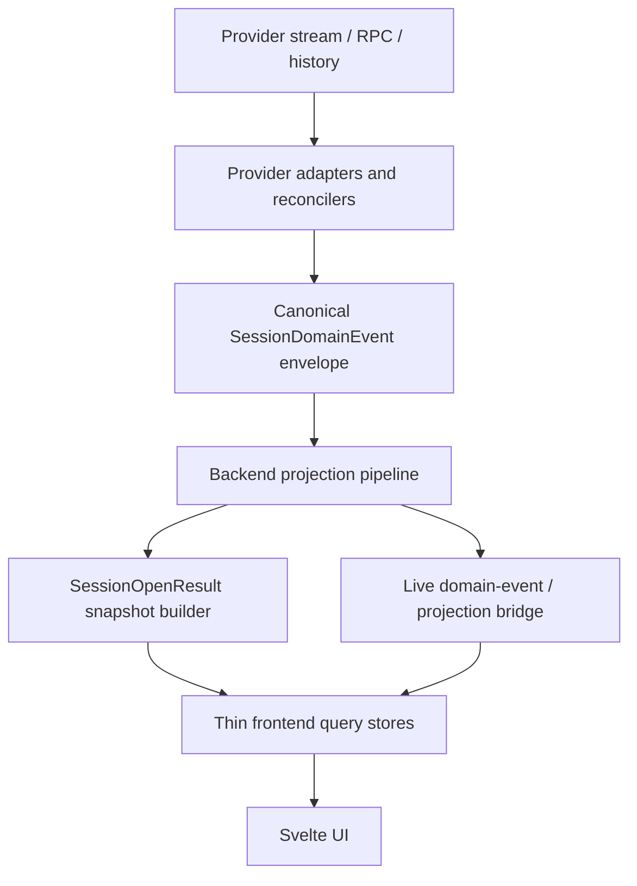
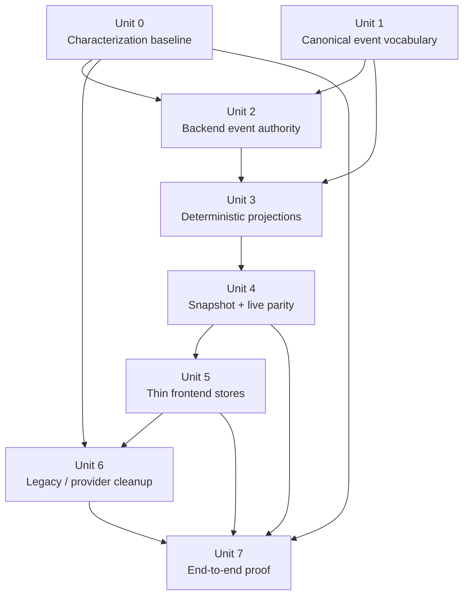

# refactor: canonical live ACP event pipeline

## Overview

Finish the remaining `#143` architecture work by making **one backend-owned canonical live event pipeline** the authority for session execution. Provider adapters should normalize once at the edge, Rust should own semantic sequencing and projections, `SessionOpenResult` and live deltas should share the same domain model and IDs, and the frontend should consume projections instead of repairing protocol behavior.

In short: **normalize once, reduce once, project many times, and keep provider logic at the edge.**

## Problem Frame

The canonical session-open migration is now largely complete: `SessionOpenResult`, `openToken`, provider-owned reconnect policy, and backend-owned snapshot hydration already removed the split-brain open path. But the broader reliability core called out in `#143` is still unfinished.

Acepe still treats live session execution as a cooperation between multiple partially authoritative surfaces:

| Surface | Current role | Why it is not the final architecture |
|---|---|---|
| `packages/desktop/src-tauri/src/acp/ui_event_dispatcher.rs` | Publishes `acp-session-update`, transcript deltas, and a narrow additive `acp-session-domain-event` stream | Domain events exist, but they are not yet the single semantic contract |
| `packages/desktop/src-tauri/src/acp/projections/mod.rs` + `packages/desktop/src-tauri/src/acp/transcript_projection/runtime.rs` | Maintain deterministic read models | They reduce different inputs instead of one shared canonical event envelope |
| `packages/desktop/src/lib/acp/store/session-event-service.svelte.ts` | Owns buffering, lifecycle waiters, permission/question bridging, assistant fallback handling, and live mutation routing | The frontend still understands protocol/business semantics directly |
| `packages/desktop/src/lib/acp/store/session-store.svelte.ts` | Orchestrates sessions, hot state, entries, capabilities, connections, PR cache, and callbacks | Shared store code still owns too much live-session architecture |
| `packages/desktop/src/lib/acp/logic/session-domain-event-subscriber.ts` + `packages/desktop/src/lib/acp/store/services/live-interaction-projection-sync.ts` | Additive domain-event bridge for interaction refresh | This proves the direction, but it is still coexistence rather than final authority |

The recent removal of payload-fingerprint replay hashing improved the situation, but it did **not** finish `#143`. The frontend is still a repair engine for live execution. Until transcript, tool, interaction, runtime, and telemetry state are all derived from one canonical backend event stream, each provider edge case will keep creating local exceptions.

## User-Observable Outcomes

- Reconnecting during an in-progress tool call preserves the same in-progress operation, transcript, and interaction state without duplicate rows or replay artifacts.
- Permission and question prompts survive reopen/reconnect as single canonical interactions that remain answerable exactly once.
- Fresh sessions, restored sessions, and crash-recovered sessions hydrate the same visible state from the same snapshot + event model instead of divergent open-time vs live-time paths.

## Requirements Trace

- R1. Define one canonical live event vocabulary for all ACP session execution semantics.
- R2. Make Rust/backend the authority for canonical live event sequencing, identity, and emission.
- R3. Delete frontend replay-repair logic such as payload fingerprinting and equivalent heuristic recovery paths.
- R4. Build deterministic reducers/projections for transcript, tool execution, permissions, questions, runtime state, and usage/context telemetry from canonical events.
- R5. Separate transport from state: the ACP bridge delivers events; reducers/projections evolve state.
- R6. Keep providers adapter-only: provider quirks end at normalization boundaries and do not leak into shared app logic.
- R7. Unify `SessionOpenResult` snapshot state and live deltas on the same domain model, IDs, and monotonic frontier.
- R8. Make frontend stores thin subscription/query layers over projections rather than business-logic owners.
- R9. Make UI components projection-only: they render derived state and do not contain merge, replay, or reconciliation rules.
- R10. Ensure reopen, reconnect, resume, and late delivery rebuild the same state deterministically from snapshot + event stream.
- R11. Remove legacy parallel open/live authorities such as `ConvertedSession`-driven runtime ownership and duplicate live state paths once the canonical pipeline exists.
- R12. Prove the architecture with end-to-end scenarios covering fresh session, restored session, reconnect during tool execution, permission flow, question flow, and crash/recovery.

## Scope Boundaries

- In scope is the **live ACP execution pipeline** after session open: provider normalization, canonical live events, reducers/projections, snapshot/live parity, frontend store thinning, and runtime authority cleanup.
- In scope is making `SessionOpenResult` and live deltas consume the same projection model and monotonic `event_seq` boundary.
- In scope is deleting additive repair logic and temporary side channels once the canonical pipeline is authoritative.
- In scope is keeping provider semantics in adapter/reconciler layers and out of shared UI/store/runtime code.
- Not in scope is redesigning the visual shell of the agent panel, tabs, or scene layout.
- Not in scope is inventing a second transport stack; the existing ACP bridge remains the transport.
- Not in scope is broad provider feature redesign unrelated to semantic normalization or canonical event production.

### Deferred to Separate Tasks

- Non-runtime history/export cleanup that does not influence live/session-open authority.
- Visual UX improvements beyond whatever projection-only rendering requires for parity.
- Performance tuning after the canonical pipeline is correct and deterministic.

## Context & Research

### Relevant Code and Patterns

- `packages/desktop/src-tauri/src/acp/domain_events.rs` already defines a `SessionDomainEventKind` list plus metadata envelope, proving the repo already has the correct conceptual seam; it is just too thin and not yet authoritative.
- `packages/desktop/src-tauri/src/acp/ui_event_dispatcher.rs` still publishes `acp-session-update` as the primary semantic stream and only derives a small subset of additive domain events.
- `packages/desktop/src-tauri/src/acp/reconciler/` already holds the strongest provider-owned semantic normalization seam (`semantic.rs`, `projector.rs`, `kind_payload.rs`, provider-specific reducers, and characterization tests) and should become part of the canonical event authority instead of remaining an adjacent layer.
- `packages/desktop/src-tauri/src/acp/client_updates/` still sits on the live update path (`plan.rs`, `reconciler.rs`) and must not remain a second semantic authority once canonical events and projections are authoritative.
- `packages/desktop/src-tauri/src/acp/projections/mod.rs` and `packages/desktop/src-tauri/src/acp/transcript_projection/runtime.rs` already provide deterministic reducers, but they are not yet fed by one shared canonical event contract.
- `packages/desktop/src-tauri/src/acp/session_open_snapshot/mod.rs` and `packages/desktop/src-tauri/src/acp/event_hub.rs` already provide journal-backed `last_event_seq`, open-token reservation, and buffered attach semantics; the live event pipeline should reuse this frontier instead of inventing another one.
- `packages/desktop/src/lib/acp/store/session-store.svelte.ts` is still the frontend orchestration hub for sessions, hot state, entries, capabilities, connections, and callback fan-out.
- `packages/desktop/src/lib/acp/store/session-event-service.svelte.ts` still owns live update routing, buffering, permission/question bridging, transcript fallback behavior, and transport lifecycle logic.
- `packages/desktop/src/lib/acp/logic/session-domain-event-subscriber.ts` and `packages/desktop/src/lib/acp/store/services/live-interaction-projection-sync.ts` show the current additive migration shape: canonical domain events exist, but only interactions are refreshed from them.
- `packages/desktop/src-tauri/src/session_jsonl/export_types.rs`, `packages/desktop/src-tauri/src/session_jsonl/commands.rs`, `packages/desktop/src-tauri/src/session_converter/`, and provider history loaders still preserve `ConvertedSession` as a surviving model in explicit legacy paths, which is acceptable only while it does not own runtime/session-open authority.

### Institutional Learnings

- `docs/solutions/best-practices/provider-owned-policy-and-identity-not-ui-projections-2026-04-09.md` — provider policy and replay identity must remain explicit backend/provider contracts, not UI projection heuristics.
- `docs/solutions/best-practices/deterministic-tool-call-reconciler-2026-04-18.md` — semantic tool meaning should be deterministic and backend-owned, with the UI consuming typed output rather than repairing classification.
- `docs/solutions/architectural/provider-owned-semantic-tool-pipeline-2026-04-18.md` — provider reducers own semantic interpretation and a shared projector turns those semantics into one stable wire contract.
- `docs/solutions/best-practices/reactive-state-async-callbacks-svelte-2026-04-15.md` — async open/live transitions need monotonic request-token and stale-completion guards rather than optimistic local merging.

### Related Prior Plans

- `docs/plans/2026-04-15-001-refactor-projection-first-session-startup-plan.md` — established the snapshot-plus-delta target at the session-open boundary.
- `docs/plans/2026-04-16-001-refactor-canonical-session-open-model-plan.md` — completed the backend-owned open/reconnect path, but not the broader live event pipeline.

### External References

- None. The repo already contains sufficient local patterns, issue context, and institutional guidance for this plan.

## Key Technical Decisions

| Decision | Rationale |
|---|---|
| Expand `SessionDomainEvent` into the authoritative live semantic contract instead of keeping it as an additive side channel. | The repo already has the right seam; the missing step is making it authoritative and payload-bearing. |
| Treat `SessionUpdate` as adapter-ingress/internal translation input, not the long-term shared contract. | Providers can keep emitting ACP-flavored updates internally, but shared downstream logic should only consume canonical events. |
| Use journal-backed session `event_seq` as the semantic frontier above adapters; keep `AcpEventEnvelope.seq` as transport identity only. | Delivery ordering and semantic correctness are different concerns. The plan needs one semantic revision spine for snapshot/live parity and reconnect correctness. |
| Keep multiple projections (transcript, runtime, operations, interactions, telemetry), but drive all of them from one canonical reducer pipeline in Rust. | The product needs multiple read models; it does not need multiple semantic contracts. |
| Make `SessionOpenResult` serialize the outputs of the same canonical projection model used by live events. | Snapshot/live parity only becomes real when they share IDs, projection shape, and `last_event_seq`. |
| Keep pre-cutover persisted sessions reopenable by promoting legacy history into canonical projections at open time. | Acepe supports long-running developer workflows; the cutover cannot strand already-recorded sessions or force them into archive-only mode. |
| Allow temporary dual-stream bridge emission only as an incremental delivery scaffold between backend cutover and frontend adoption, then remove it in cleanup. | Units 2-5 may land separately, but coexistence is a rollout tactic, not the target architecture. |
| Keep provider-specific compensation logic in adapters/reconcilers only. | Agent-agnostic architecture requires provider weirdness to stop at the edge. |
| Replace frontend repair logic with projection subscription and query selectors. | Shared frontend code should render or route canonical state, not infer missing semantics from transport timing. |
| Delete coexistence as the target architecture. | Additive compatibility shims are acceptable only as temporary implementation scaffolding; the finished system should have one authority path. |

## Open Questions

### Resolved During Planning

- **Should the canonical event pipeline live primarily in Rust or in frontend stores?** Rust. The backend already owns `last_event_seq`, event-hub buffering, and projection state, so it is the correct authority boundary.
- **Should transcript deltas remain a separate semantic authority?** No. Transcript remains a projection/read model, not a parallel semantic contract.
- **Is `AcpEventEnvelope.seq` the same thing as canonical session `event_seq`?** No. Envelope seq is transport identity; journal/session event seq is the semantic frontier for correctness.
- **Should the existing `acp-session-domain-event` bridge be thrown away?** No. Reuse and strengthen the existing domain-event seam rather than inventing a third event family.
- **Should providers continue to leak semantic differences into shared stores or UI?** No. Shared code consumes normalized canonical events and provider metadata contracts only.
- **Can `ConvertedSession` survive anywhere after this work?** Only in explicit non-authoritative export/debug utilities that do not own live execution or session-open behavior.

### Deferred to Implementation

- **Exact factoring between `domain_events.rs`, `ui_event_dispatcher.rs`, and projection modules** — the architectural seam is fixed, but the final Rust file split can follow implementation ergonomics.
- **Whether transcript/runtime/interaction projections remain separate registries or are wrapped by a higher-level projection pipeline type** — the plan requires one reducer entrypoint, not one specific file topology.

## Alternative Approaches Considered

| Approach | Why not chosen |
|---|---|
| Keep refining frontend repair logic (`SessionEventService`, store heuristics, duplicate guards) | This treats symptoms and preserves scattered authority. |
| Split files without moving responsibilities | Smaller files would still leave event semantics spread across multiple owners. |
| Make the frontend the canonical reducer and keep Rust as transport/shim | This conflicts with the existing backend ownership of `last_event_seq`, open-token buffering, and session-open snapshots. |
| Keep `SessionDomainEvent` additive forever and continue dual-stream consumption | That would institutionalize the coexistence architecture `#143` is trying to remove. |

## High-Level Technical Design

> *This illustrates the intended approach and is directional guidance for review, not implementation specification. The implementing agent should treat it as context, not code to reproduce.*

## Phased Delivery

### Phase 0: Characterization baseline

- Capture the current reconnect, reopen, permission/question recovery, and crash/recovery behavior in scenario-level characterization coverage before deleting any compatibility seam.
- Treat that baseline as a standing guardrail for all later units, especially the cleanup cutover.

### Phase 1: Backend semantic authority

- Define the canonical live event contract.
- Route provider/ACP inputs through one backend-owned translation boundary.
- Feed deterministic reducers/projections from canonical events.

### Phase 2: Snapshot/live parity

- Make `SessionOpenResult` serialize canonical projection outputs.
- Ensure reconnect/reopen/crash recovery rebuild state from the same event model and frontier.

### Phase 3: Frontend thinning and cleanup

- Replace frontend repair logic with projection subscriptions/query layers.
- Remove provider leaks and legacy parallel live/open authorities only after the characterization baseline and canonical consumers are green.
- Land end-to-end deterministic coverage.

## Success Metrics

- Equivalent event history yields the same transcript, tool, interaction, runtime, and telemetry projections whether the session is fresh, restored, or crash-recovered.
- Reconnect during an active tool call or pending permission/question prompt preserves exactly one canonical in-flight item and no duplicate replay artifacts.
- Shared frontend/store code no longer branches on provider name or owns protocol repair semantics after Unit 6.

## Implementation Units

- [ ] **Unit 0: Characterize current recovery invariants**

**Goal:** Lock in the current reopen/reconnect/recovery behaviors that must stay true while the canonical pipeline replaces legacy authority.

**Requirements:** R10, R12

**Dependencies:** None

**Files:**
- Test: `packages/desktop/src-tauri/src/history/commands/session_loading.rs`
- Test: `packages/desktop/src/lib/acp/store/__tests__/session-event-service-streaming.vitest.ts`
- Test: `packages/desktop/src/lib/acp/store/__tests__/session-store-create-session.vitest.ts`
- Test: `packages/desktop/src/lib/acp/store/services/__tests__/session-open-hydrator.test.ts`
- Test: `packages/desktop/src/lib/acp/store/services/__tests__/live-interaction-projection-sync.test.ts`

**Approach:**
- Capture current scenario behavior for reconnect during tool execution, permission/question recovery, crash/recovery replay, and reopen from persisted sessions before removing any final compatibility seam.
- Treat this unit as the standing regression harness that Units 2-7 must keep green while the authority boundary moves.

**Execution note:** Start here before changing backend semantic authority or deleting any legacy runtime/open path.

**Patterns to follow:**
- `packages/desktop/src/lib/acp/store/__tests__/session-event-service-streaming.vitest.ts`
- `packages/desktop/src-tauri/src/history/commands/session_loading.rs`

**Test scenarios:**
- Happy path — a restored session reconnects during an in-progress tool call and preserves the visible in-flight operation.
- Happy path — permission and question prompts remain answerable after reconnect without duplicate prompts.
- Edge case — late buffered delivery after reopen does not duplicate transcript or tool rows.
- Error path — crash/recovery or expired reopen state falls back to deterministic reopen behavior rather than silent divergence.
- Integration — a persisted pre-cutover session still hydrates through the current open path and remains resumable while later units replace the authority model.

**Verification:**
- Later units can prove they preserved the existing recovery contract because the baseline scenarios remain green while the pipeline changes underneath them.

- [ ] **Unit 1: Expand the canonical live event vocabulary**

**Goal:** Turn `SessionDomainEvent` from a metadata-only additive signal into the typed canonical event contract for live ACP execution.

**Requirements:** R1, R2, R5, R6

**Dependencies:** None

**Files:**
- Modify: `packages/desktop/src-tauri/src/acp/domain_events.rs`
- Modify: `packages/desktop/src-tauri/src/acp/session_update.rs`
- Modify: `packages/desktop/src-tauri/src/acp/session_update_parser.rs`
- Modify: `packages/desktop/src-tauri/src/session_jsonl/export_types.rs`
- Modify: `packages/desktop/src/lib/services/acp-types.ts`
- Test: `packages/desktop/src-tauri/src/acp/ui_event_dispatcher.rs`
- Test: `packages/desktop/src-tauri/src/acp/session_update_parser.rs`

**Approach:**
- Extend the canonical event envelope to carry typed payloads for transcript segments, tool execution, interactions, runtime state, and telemetry.
- Keep provider/ACP-specific update parsing inside adapter-ingress code, but project the result into one canonical event vocabulary before shared layers consume it.
- Make event metadata explicit: semantic `event_seq`, session identity, provider session identity when relevant, causation, and stable event IDs.
- Limit `session_jsonl/export_types.rs` changes here to canonical type-shape alignment needed for shared payload definitions, not broad export-schema cleanup.

**Technical design:** *(Directional guidance, not implementation specification.)*

- Envelope metadata: `event_id`, `event_seq`, `session_id`, optional provider session identity, optional causation/correlation identity, and event timestamp.
- Canonical families: transcript append/update events, tool execution lifecycle events, blocking interaction events (permission/question requested + resolved), runtime status events, and usage/telemetry events.
- Consumer contract: adapters may parse provider-native updates however they need, but shared layers only receive the canonical envelope plus typed payload family.

**Patterns to follow:**
- `packages/desktop/src-tauri/src/acp/domain_events.rs`
- `docs/solutions/architectural/provider-owned-semantic-tool-pipeline-2026-04-18.md`
- `docs/solutions/best-practices/deterministic-tool-call-reconciler-2026-04-18.md`

**Test scenarios:**
- Happy path — a provider tool-call start/update/complete sequence maps to canonical tool execution events with stable IDs and semantic `event_seq`.
- Happy path — permission and question prompts map to canonical interaction events with explicit payloads and response metadata.
- Edge case — assistant/user segment append events preserve existing message identity when a provider emits chunks across multiple partial frames.
- Error path — malformed provider/ACP update payloads fail at the adapter boundary and do not leak partial canonical events downstream.
- Integration — different providers emitting semantically equivalent live updates normalize into the same canonical event shapes.

**Verification:**
- Shared downstream consumers can depend on `SessionDomainEvent` alone for live semantics without inspecting provider-specific update forms.

- [ ] **Unit 2: Make Rust the only live event authority**

**Goal:** Ensure backend code owns canonical event sequencing, emission, and provider normalization boundaries for live session execution.

**Requirements:** R2, R5, R6

**Dependencies:** Units 0, 1

**Files:**
- Modify: `packages/desktop/src-tauri/src/acp/ui_event_dispatcher.rs`
- Modify: `packages/desktop/src-tauri/src/acp/event_hub.rs`
- Modify: `packages/desktop/src-tauri/src/acp/provider.rs`
- Modify: `packages/desktop/src-tauri/src/acp/reconciler/mod.rs`
- Modify: `packages/desktop/src-tauri/src/acp/reconciler/projector.rs`
- Modify: `packages/desktop/src-tauri/src/acp/reconciler/semantic.rs`
- Modify: `packages/desktop/src-tauri/src/acp/reconciler/kind_payload.rs`
- Modify: `packages/desktop/src-tauri/src/acp/reconciler/providers/claude_code.rs`
- Modify: `packages/desktop/src-tauri/src/acp/reconciler/providers/codex.rs`
- Modify: `packages/desktop/src-tauri/src/acp/reconciler/providers/copilot.rs`
- Modify: `packages/desktop/src-tauri/src/acp/reconciler/providers/cursor.rs`
- Modify: `packages/desktop/src-tauri/src/acp/reconciler/providers/open_code.rs`
- Modify: `packages/desktop/src-tauri/src/acp/providers/claude_code.rs`
- Modify: `packages/desktop/src-tauri/src/acp/providers/cursor.rs`
- Modify: `packages/desktop/src-tauri/src/acp/providers/codex.rs`
- Modify: `packages/desktop/src-tauri/src/acp/providers/copilot.rs`
- Modify: `packages/desktop/src-tauri/src/acp/providers/opencode.rs`
- Modify: `packages/desktop/src-tauri/src/acp/providers/forge.rs`
- Modify: `packages/desktop/src-tauri/src/acp/providers/custom.rs`
- Test: `packages/desktop/src-tauri/src/acp/ui_event_dispatcher.rs`
- Test: `packages/desktop/src-tauri/src/acp/commands/tests.rs`
- Test: `packages/desktop/src-tauri/src/acp/reconciler/tests/provider_boundary.rs`
- Test: `packages/desktop/src-tauri/src/acp/reconciler/tests/reconciler_tests.rs`

**Approach:**
- Move the last shared semantic branching out of frontend/store layers and into provider adapters, reconcilers, and backend event production.
- Make the dispatcher publish one authoritative canonical domain-event stream plus any projection delta stream derived from the same reducer pipeline.
- Use dual-stream bridge emission only as a temporary rollout scaffold while frontend consumers are still migrating; remove legacy semantic stream authority in Unit 6.
- Keep `AcpEventEnvelope.seq` as transport delivery metadata while semantic event sequencing stays session/journal-backed in the canonical envelope.
- Make the backend responsible for ordering and duplicate suppression at the canonical boundary: transport delivery may arrive out of order, but publication and reduction advance only on the next valid semantic `event_seq`.

**Patterns to follow:**
- `packages/desktop/src-tauri/src/acp/ui_event_dispatcher.rs`
- `docs/solutions/best-practices/provider-owned-policy-and-identity-not-ui-projections-2026-04-09.md`
- `docs/solutions/architectural/provider-owned-semantic-tool-pipeline-2026-04-18.md`

**Test scenarios:**
- Happy path — provider adapters emit canonical events without shared-layer provider-name branching.
- Edge case — late-arriving live events still publish in semantic order for a single session.
- Error path — provider-specific parsing failures surface before canonical event publication and do not corrupt downstream reducers.
- Integration — the dispatcher emits authoritative domain events and matching projection outputs for the same semantic update without a second translation step in the frontend.

**Verification:**
- The backend becomes the only place that understands provider-specific live semantics and emits canonical events for all downstream consumers.

- [ ] **Unit 3: Feed all read models from one deterministic projection pipeline**

**Goal:** Make transcript, tool execution, permissions, questions, runtime state, and telemetry projections consume the same canonical event stream in Rust.

**Requirements:** R4, R5, R7, R10

**Dependencies:** Units 0-2

**Files:**
- Modify: `packages/desktop/src-tauri/src/acp/projections/mod.rs`
- Modify: `packages/desktop/src-tauri/src/acp/transcript_projection/runtime.rs`
- Modify: `packages/desktop/src-tauri/src/acp/transcript_projection/delta.rs`
- Modify: `packages/desktop/src-tauri/src/acp/transcript_projection/snapshot.rs`
- Modify: `packages/desktop/src-tauri/src/acp/mod.rs`
- Modify: `packages/desktop/src/lib/services/acp-types.ts`
- Test: `packages/desktop/src-tauri/src/acp/projections/mod.rs`
- Test: `packages/desktop/src-tauri/src/acp/transcript_projection/runtime.rs`

**Approach:**
- Introduce one reducer entrypoint that accepts canonical events and updates all backend read models deterministically.
- Keep transcript as a projection sibling to runtime/operation/interaction state rather than a parallel semantic authority.
- Ensure the same event IDs, tool IDs, interaction IDs, and `event_seq` frontier appear across all projections.
- Enforce idempotency at the shared projection entrypoint using canonical event identity (`event_seq` plus stable event ID) before any per-projection reducer runs.

**Patterns to follow:**
- `packages/desktop/src-tauri/src/acp/projections/mod.rs`
- `packages/desktop/src-tauri/src/acp/transcript_projection/runtime.rs`

**Test scenarios:**
- Happy path — one ordered canonical event sequence produces the expected transcript, tool, permission/question interaction, runtime, and telemetry projections.
- Edge case — replaying an already-applied event sequence is idempotent because duplicate canonical event identity is dropped before any reducer runs.
- Edge case — out-of-order transport delivery is buffered or rejected at the canonical entrypoint without corrupting projection state.
- Error path — a failed turn preserves deterministic failure projection state without losing earlier transcript/tool entries.
- Integration — tool and interaction projections remain consistent with transcript projection after a mixed event sequence containing chunks, tool updates, permissions, and completion.

**Verification:**
- Backend read models can be rebuilt solely from canonical event sequences with no frontend repair logic required for correctness.

- [ ] **Unit 4: Unify snapshot and live delta authority**

**Goal:** Make `SessionOpenResult` snapshots and live events share the same projection model, IDs, and monotonic frontier.

**Requirements:** R7, R10

**Dependencies:** Units 0, 3

**Files:**
- Modify: `packages/desktop/src-tauri/src/acp/session_open_snapshot/mod.rs`
- Modify: `packages/desktop/src-tauri/src/acp/event_hub.rs`
- Modify: `packages/desktop/src-tauri/src/history/commands/session_loading.rs`
- Modify: `packages/desktop/src-tauri/src/acp/commands/session_commands.rs`
- Modify: `packages/desktop/src/lib/services/acp-types.ts`
- Test: `packages/desktop/src-tauri/src/history/commands/session_loading.rs`
- Test: `packages/desktop/src-tauri/src/acp/commands/session_commands.rs`

**Approach:**
- Build `SessionOpenResult` from the same projection outputs produced by the canonical event pipeline.
- Reuse the existing open-token reservation/buffer semantics so live attach only delivers canonical events or projection deltas with `event_seq > last_event_seq`.
- Make restart, reconnect, and crash recovery consume the same semantic frontier instead of separate open-time and live-time models.
- Promote pre-cutover persisted history into canonical projection state at open time so older sessions remain reopenable through the same authoritative model.
- Snapshot in-flight tool and blocking interaction state at canonical event boundaries so reconnect can resume from partial-but-valid projection state instead of re-deriving from legacy heuristics.

**Patterns to follow:**
- `packages/desktop/src-tauri/src/acp/session_open_snapshot/mod.rs`
- `packages/desktop/src-tauri/src/acp/event_hub.rs`

**Test scenarios:**
- Happy path — a restored session snapshot and subsequent live attach rebuild the same transcript/tool/interaction/runtime state with no reshaping.
- Happy path — a fresh session returns a snapshot with the same canonical model/IDs used by later live events.
- Edge case — reconnect during an active tool call preserves the in-progress operation and appends only newer deltas.
- Edge case — reconnect during a pending permission/question prompt preserves exactly one pending canonical interaction that remains answerable after reopen.
- Error path — failed or expired open-token reservation forces a fresh open instead of silently replaying stale buffered state.
- Integration — crash/recovery followed by reopen produces the same state as a continuous live session given the same event history.
- Integration — a pre-cutover persisted session reopens through canonical snapshot hydration and converges on the same visible state as an equivalent post-cutover session.

**Verification:**
- Snapshot and live execution no longer disagree about identity, projection shape, or frontier semantics.

- [ ] **Unit 5: Replace frontend repair logic with thin projection consumers**

**Goal:** Turn frontend ACP stores/services into subscription and query layers over canonical projections instead of live semantic interpreters.

**Requirements:** R3, R5, R8, R9

**Dependencies:** Units 0, 4

**Files:**
- Modify: `packages/desktop/src/lib/acp/logic/event-subscriber.ts`
- Modify: `packages/desktop/src/lib/acp/logic/session-domain-event-subscriber.ts`
- Modify: `packages/desktop/src/lib/acp/store/session-event-service.svelte.ts`
- Modify: `packages/desktop/src/lib/acp/store/session-store.svelte.ts`
- Modify: `packages/desktop/src/lib/acp/store/session-entry-store.svelte.ts`
- Modify: `packages/desktop/src/lib/acp/store/operation-store.svelte.ts`
- Modify: `packages/desktop/src/lib/acp/store/services/live-interaction-projection-sync.ts`
- Test: `packages/desktop/src/lib/acp/logic/__tests__/event-subscriber.test.ts`
- Test: `packages/desktop/src/lib/acp/logic/__tests__/session-domain-event-subscriber.test.ts`
- Test: `packages/desktop/src/lib/acp/store/__tests__/session-event-service-streaming.vitest.ts`
- Test: `packages/desktop/src/lib/acp/store/__tests__/session-entry-store-streaming.vitest.ts`
- Test: `packages/desktop/src/lib/acp/store/__tests__/operation-store.vitest.ts`
- Test: `packages/desktop/src/lib/acp/store/services/__tests__/live-interaction-projection-sync.test.ts`

**Approach:**
- Make canonical domain events and projection updates the primary frontend subscription surfaces.
- Shrink `SessionEventService` down to transport concerns that still belong on the client (for example bridge fan-out and open/attach lifecycle gating), and remove business-semantic ownership from it.
- Make `SessionStore`, `SessionEntryStore`, and `OperationStore` apply canonical projection state rather than inventing missing tool/transcript semantics from transport order.
- Replace the additive interaction-only sync path with the same generalized projection subscription model used for transcript, runtime, and operations.
- If a waiter or buffer condition depends on semantic business state rather than transport lifecycle, move it to backend canonical reduction instead of keeping it in `SessionEventService`.

**Patterns to follow:**
- `packages/desktop/src/lib/acp/logic/session-domain-event-subscriber.ts`
- `packages/desktop/src/lib/acp/store/services/live-interaction-projection-sync.ts`

**Test scenarios:**
- Happy path — canonical projection updates render transcript, tool, and interaction state without frontend replay repair.
- Edge case — duplicate transport delivery of the same backend event is handled as a transport concern and does not create duplicate projected state.
- Error path — malformed bridge payloads are rejected before mutating projection-facing stores.
- Integration — permission/question/tool/transcript updates arriving through the canonical stream hydrate the same store/query surfaces the UI reads.

**Verification:**
- Shared frontend ACP stores no longer own live protocol recovery semantics beyond thin subscription concerns.

- [ ] **Unit 6: Delete provider leaks and legacy parallel runtime authority**

**Goal:** Remove the remaining shared-layer provider-specific logic and any surviving duplicate runtime/open authority that competes with the canonical pipeline.

**Requirements:** R6, R8, R9, R11

**Dependencies:** Units 0, 5

**Files:**
- Modify: `packages/desktop/src/lib/components/main-app-view.svelte`
- Modify: `packages/desktop/src/lib/acp/store/services/session-connection-manager.ts`
- Modify: `packages/desktop/src/lib/acp/store/services/session-repository.ts`
- Modify: `packages/desktop/src-tauri/src/session_jsonl/commands.rs`
- Modify: `packages/desktop/src-tauri/src/session_jsonl/export_types.rs`
- Modify: `packages/desktop/src-tauri/src/lib.rs`
- Modify: `packages/desktop/src-tauri/src/commands/registry.rs`
- Test: `packages/desktop/src/lib/acp/store/services/session-connection-manager.test.ts`
- Test: `packages/desktop/src/lib/acp/store/__tests__/session-store-create-session.vitest.ts`
- Test: `packages/desktop/src/lib/components/main-app-view/tests/open-persisted-session.test.ts`

**Approach:**
- Remove shared provider-name branches that survive outside adapter metadata/contracts.
- Delete any remaining runtime/open paths that still act as parallel authority beside canonical projections.
- Confine `main-app-view.svelte` changes to removing provider/open authority branches in startup and persisted-session wiring; do not change layout or scene composition.
- Keep only explicit export/debug utilities that do not drive session-open or live-session correctness; if a surviving path still influences runtime authority, fold it into the canonical pipeline or remove it here.
- Limit `session_jsonl/export_types.rs` changes here to removing legacy runtime-authoritative aliases or paths that are obsolete once canonical open/live authority is in place.

**Patterns to follow:**
- `docs/solutions/best-practices/provider-owned-policy-and-identity-not-ui-projections-2026-04-09.md`

**Test scenarios:**
- Happy path — shared frontend/runtime code consumes provider metadata contracts without provider-name branching.
- Edge case — sessions with provider-owned history identity still reopen and reconnect through the canonical path.
- Error path — removing legacy runtime authority does not regress explicit missing/error open outcomes.
- Integration — `SessionOpenResult` creation/open/restore plus live canonical events continue to hydrate the same UI/store surfaces after legacy authority removal.

**Verification:**
- Provider-specific behavior is isolated to adapter/metadata seams and no duplicate runtime authority remains in shared code.

- [ ] **Unit 7: Prove deterministic end-to-end session recovery and live execution**

**Goal:** Add the end-to-end scenario coverage that demonstrates the canonical live event pipeline is truly authoritative.

**Requirements:** R10, R11, R12

**Dependencies:** Units 0, 4-6

**Files:**
- Test: `packages/desktop/src-tauri/src/acp/ui_event_dispatcher.rs`
- Test: `packages/desktop/src-tauri/src/history/commands/session_loading.rs`
- Test: `packages/desktop/src/lib/acp/store/__tests__/session-event-service-streaming.vitest.ts`
- Test: `packages/desktop/src/lib/acp/store/__tests__/session-store-create-session.vitest.ts`
- Test: `packages/desktop/src/lib/acp/store/services/__tests__/live-interaction-projection-sync.test.ts`
- Test: `packages/desktop/src/lib/acp/store/services/__tests__/session-open-hydrator.test.ts`

**Approach:**
- Express correctness primarily in terms of event sequences and expected projections, not store-specific heuristics.
- Cover the user-visible scenarios in `#143` and this checklist using the canonical event pipeline as the shared test language.
- Ensure test coverage proves the final architecture is easier to reason about, not just differently patched.

**Execution note:** Build on the characterization baseline from Unit 0; Unit 7 proves the final canonical architecture after cleanup, not the first time recovery scenarios are expressed.

**Patterns to follow:**
- `packages/desktop/src/lib/acp/store/__tests__/session-event-service-streaming.vitest.ts`
- `packages/desktop/src-tauri/src/history/commands/session_loading.rs`

**Test scenarios:**
- Happy path — fresh session creation streams canonical events and projections from the same model used by the initial snapshot.
- Happy path — restored session reconnects during an in-progress tool call and rebuilds the same projected operation/transcript state.
- Happy path — permission request and question request flows are derived from canonical interaction projections and remain stable across reconnect.
- Edge case — late delivery of already-applied events does not change projected state.
- Error path — agent crash/recovery or failed reconnect forces a deterministic reopen path without duplicated transcript or tool rows.
- Integration — a full snapshot + event-stream replay reproduces the same final projections as uninterrupted live execution.

**Verification:**
- The canonical event pipeline becomes the easiest place to state and prove session correctness scenarios.

## System-Wide Impact

- **Interaction graph:** provider adapters/reconcilers (normalization) -> canonical event emission (`ui_event_dispatcher.rs`) -> projection pipeline (`projections/mod.rs`, `transcript_projection/runtime.rs`) -> session-open snapshot builder / live bridge -> thin frontend stores/subscribers -> UI.
- **Error propagation:** provider parse failures stop at adapter boundaries; projection failures surface as backend snapshot/bridge failures; frontend only handles transport/subscription errors and explicit `missing | error` open outcomes.
- **State lifecycle risks:** the highest-risk edges are duplicate or out-of-order delivery, stale reconnect frontier, and additive compatibility seams that accidentally remain authoritative after the cut.
- **API surface parity:** `SessionOpenResult`, the ACP bridge event names/payloads, and exported `acp-types.ts` shapes must stay aligned so create/open/restore/live execution all share the same contract.
- **Integration coverage:** reconnect during active tool execution, permission/question recovery, crash/recovery replay, and late buffered delivery all cross backend + frontend boundaries and cannot be proven by unit tests alone.
- **Unchanged invariants:** provider-specific history identity stays backend-owned; the ACP bridge remains the transport; UI shell/layout does not change as part of this plan.

## Risks & Dependencies

| Risk | Mitigation |
|------|------------|
| Canonical event contract is too weak and forces another compatibility layer later | Define typed payloads and semantic metadata up front, not a metadata-only kind list |
| Snapshot/live parity regresses reconnect correctness | Reuse journal-backed `last_event_seq` and existing open-token reservation semantics rather than inventing a second frontier |
| Frontend/store cleanup happens before backend projections are complete | Keep dependency order strict: canonical event contract -> reducer pipeline -> snapshot/live parity -> frontend thinning -> cleanup |
| Blocking permission/question recovery regresses during reconnect | Keep Unit 0 recovery characterization green, snapshot pending interactions in Unit 4, and require Unit 7 to prove single-prompt recovery across reconnect |
| Pre-cutover persisted sessions fail to reopen after the authority cutover | Keep backward-compatible history-to-canonical promotion in Unit 4 until older sessions reopen through the canonical path |
| Incremental delivery creates a bridge mismatch between backend emission and frontend consumption | Allow temporary dual-stream emission only between Units 2-5, keep contracts aligned in `acp-types.ts`, and remove legacy semantic stream authority in Unit 6 |
| Provider-specific semantics leak back into shared code during edge-case fixes | Follow provider-owned contract learnings and require fixes to land in adapters/reconcilers, not in shared stores/components |
| The plan lands large refactors without proving user scenarios | Reserve Unit 7 for scenario-level proof using event sequences and projection expectations |

## Documentation / Operational Notes

- `#143` should be updated as each implementation unit lands so the issue tracks the same architecture boundaries as the plan.
- Meaningful execution-time learnings from the reducer/projection cutover should be compounded into `docs/solutions/`.
- If event-bridge payloads change materially, keep the exported TS contract in `packages/desktop/src/lib/services/acp-types.ts` current before frontend adoption.

## Sources & References

- Related issue: `#143`
- Related code: `packages/desktop/src-tauri/src/acp/domain_events.rs`
- Related code: `packages/desktop/src-tauri/src/acp/ui_event_dispatcher.rs`
- Related code: `packages/desktop/src-tauri/src/acp/projections/mod.rs`
- Related code: `packages/desktop/src/lib/acp/store/session-event-service.svelte.ts`
- Related code: `packages/desktop/src/lib/acp/store/session-store.svelte.ts`
- Related plan: `docs/plans/2026-04-15-001-refactor-projection-first-session-startup-plan.md`
- Related plan: `docs/plans/2026-04-16-001-refactor-canonical-session-open-model-plan.md`
- Institutional reference: `docs/solutions/best-practices/provider-owned-policy-and-identity-not-ui-projections-2026-04-09.md`
- Institutional reference: `docs/solutions/best-practices/deterministic-tool-call-reconciler-2026-04-18.md`
- Institutional reference: `docs/solutions/architectural/provider-owned-semantic-tool-pipeline-2026-04-18.md`
