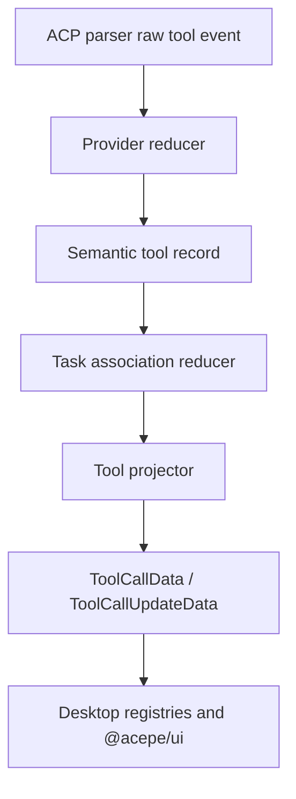

# refactor: Full provider-owned semantic tool pipeline

## Overview

Replace the current transitional tool-call architecture with the full end-state we have been aiming at: provider-owned reducers classify and accumulate raw ACP tool events into a presentation-free semantic model, a pure projector turns that model into a closed desktop view contract, and the frontend renders that contract directly.

This plan intentionally goes beyond `docs/plans/2026-04-18-001-refactor-tool-call-reconciler-plan.md`. That earlier plan is the right direction, but it still preserves a few transitional compromises: classification ownership remains split, streaming normalization is still parallel, and the frontend still flattens some new semantics back to generic buckets. This plan is the clean replacement architecture.

## Problem Frame

Current work moved the repo forward, but the tool-call pipeline is still structurally dual-owned:

| Concern | Current owner(s) | Target owner |
|---|---|---|
| Provider tool naming and classification | `acp/reconciler/`, `acp/tool_classification.rs`, `acp/parsers/kind.rs`, `acp/parsers/adapters/` | `acp/reconciler/providers/` only |
| Streaming tool delta normalization | `acp/streaming_accumulator.rs` plus partial reconciler reuse | Provider reducer state in `acp/reconciler/` |
| Semantic tool identity | `ToolKind` plus scattered helper heuristics | Internal semantic union |
| Desktop view shaping | Mixed between Rust naming, generated wire types, and TS repair helpers | Pure projector layer in Rust |
| UI labels and generic-card fallback | Rust `canonical_name_for_kind`, TS registries, TS legacy label maps | TS/UI registry only |

The concrete symptom that exposed this was the SQL regression: a provider emitted weak identity (`name: "unknown"`, `kind: "other"`) while the arguments clearly contained a SQL query. The deeper lesson was not merely “teach the classifier SQL.” It was that the repo still lacks one canonical owner for tool-call semantics.

Recent streaming logs exposed the second half of the same architectural problem: providers such as Copilot can emit rich read/update payloads containing source-aware details like `path:line:` excerpts, raw `path` / `view_range` metadata, and other tool-result context. Today those details exist in raw tool updates and logs, but they are not carried through the contract intentionally. That leaves the desktop with the wrong choices: either silently drop useful source context or leak raw payload text accidentally.

The god-clean target for this repo is:

```text
raw ACP tool event
    │
    ▼
provider reducer
  - provider-specific name map
  - provider-specific streaming quirks
  - provider-owned state
    │
    ▼
semantic tool model
  - presentation-free
  - typed
  - closed
    │
    ▼
task / association reducer
    │
    ▼
tool projector
    │
    ▼
desktop wire/view contract
    │
    ▼
frontend renderer
```

That means:

- shared code never matches provider strings,
- streaming and non-streaming tool events go through the same reducer,
- the UI does not reclassify or repair backend output,
- and every fallback is intentional and diagnosable.

## Requirements Trace

- R1. Provider-specific tool naming, aliases, and streaming quirks live only in `packages/desktop/src-tauri/src/acp/reconciler/providers/`.
- R2. Shared Rust code introduces a presentation-free internal semantic union for tool calls and tool-call updates. Shared code must not use `ToolKind` alone as the semantic answer.
- R3. A pure projector maps semantic tool records into the desktop wire/view contract. Rendering consumes the projected union directly instead of reconstructing meaning from `name`, `title`, or `ToolKind`.
- R4. Streaming and non-streaming tool events share one reducer pipeline. `packages/desktop/src-tauri/src/acp/streaming_accumulator.rs` no longer owns tool-call semantic normalization.
- R5. Live classification misses emit a first-class `Unclassified` semantic/view variant with diagnostics. The live path must not silently fall through to `Other`.
- R6. `Sql`, `Todo`, `Question`, browser, task-output, and other known tool categories remain typed and intentional across live updates, replay/import, storage, and export.
- R7. UI labels and generic-card naming live in TypeScript/UI registries only. Rust may carry stable discriminators and markdown/export-safe fallback labels, but it must not be the desktop UI label authority.
- R8. Task parent/child reconciliation happens on canonical semantic records, not on already-projected UI-shaped data.
- R9. Persisted sessions and session-import paths continue to decode older `Other`/legacy records, but the new live pipeline emits only intentional typed variants.
- R10. The frontend removes redundant normalization and generic flattening such as mapping `sql` and `unclassified` back to `"other"` for agent-panel surfaces.
- R11. Structured diagnostics for `Unclassified` frames and reducer failures are emitted to the per-session streaming log with enough detail to triage misses without replaying the UI.
- R12. This plan may change how `Question` tool calls are classified and projected, but it does not change the approval/association state machine for permission/question interactions; that contract remains intact.
- R13. Provider-supplied rich tool context such as line-numbered read excerpts, source locations, and raw read metadata (`path`, `view_range`, similar typed fields) survives semantic reduction and projection as intentional typed data. The desktop must not recover this information by parsing display text.

## Scope Boundaries

- This plan covers the tool-call architecture from ACP parser output through desktop rendering, persistence/replay, and export surfaces touched by tool-call semantics.
- This plan does **not** replace the broader assistant transcript architecture. The assistant streaming/transcript clean-up remains the separate concern documented in `docs/plans/2026-04-16-003-refactor-canonical-streaming-projection-plan.md`.
- This plan does **not** redesign tool-call visuals. It changes the contract and ownership model feeding those visuals.
- This plan does **not** change provider transport protocols or ACP schema ownership outside the repo.
- `packages/desktop/src-tauri/src/acp/parsers/edit_normalizers/` is explicitly out of scope for this refactor. Those modules normalize provider-shaped edit payloads into structural edit data, which is a different boundary from tool semantic classification.

### Deferred to Separate Tasks

- Full assistant transcript reducer and canonical assistant streaming projection.
- Visual redesign of tool cards or broader `@acepe/ui` component taxonomy changes unrelated to the semantic contract.
- Non-tool artifacts such as filesystem-backed plan-file watching when they are not part of tool-call semantic classification.

## Context & Research

### Relevant Code and Patterns

- `packages/desktop/src-tauri/src/acp/reconciler/mod.rs` is the new center of gravity, but it still shares ownership with older layers.
- `packages/desktop/src-tauri/src/acp/tool_classification.rs` still orchestrates identity resolution, canonical naming, and post-classification promotions.
- `packages/desktop/src-tauri/src/acp/parsers/kind.rs` and `packages/desktop/src-tauri/src/acp/parsers/adapters/` still contain provider and title/name heuristics that belong at the provider edge.
- `packages/desktop/src-tauri/src/acp/streaming_accumulator.rs` still owns progressive todo/question/tool-argument normalization for streamed tool input.
- `packages/desktop/src-tauri/src/acp/task_reconciler.rs` currently reconciles parent/child relationships on projected `ToolCallData`, which is later than the true semantic boundary.
- `packages/desktop/src-tauri/src/acp/session_update/tool_calls.rs` still coordinates classification, streaming normalization, and raw-to-view conversion at once.
- `packages/desktop/src-tauri/src/acp/session_update/types/tool_calls.rs` is the current wire contract and the natural landing zone for the projected desktop union.
- `packages/desktop/src/lib/acp/registry/tool-kind-ui-registry.ts`, `packages/desktop/src/lib/acp/components/tool-calls/tool-kind-to-agent-tool-kind.ts`, and `packages/desktop/src/lib/acp/logic/entry-converter.ts` still carry frontend repair or flattening logic that should disappear once the projected union is authoritative.
- `packages/desktop/src-tauri/src/session_jsonl/parser/convert.rs`, `packages/desktop/src-tauri/src/session_converter/fullsession.rs`, and `packages/desktop/src-tauri/src/session_converter/opencode.rs` currently re-run tool classification during replay/import and therefore must be brought onto the same semantic pipeline.

### Institutional Learnings

- `docs/solutions/best-practices/deterministic-tool-call-reconciler-2026-04-18.md` confirms the repo already benefits from deterministic backend-owned classification and first-class `Unclassified`.
- `docs/solutions/best-practices/provider-owned-policy-and-identity-not-ui-projections-2026-04-09.md` reinforces the central rule for this refactor: provider meaning must stay below projection boundaries.
- `docs/solutions/logic-errors/operation-interaction-association-2026-04-07.md` shows the same architectural lesson from another seam: canonical domain ownership must sit below the UI, or multiple surfaces drift.

### External References

- None. The problem is internal architecture and repo-specific ownership.

## Key Technical Decisions

| Decision | Rationale |
|---|---|
| Introduce an internal semantic layer, not just a stronger `ToolKind`. | The full target is a typed semantic model that can express meaning before any UI projection or display naming occurs. |
| Keep the provider boundary as the only place allowed to know provider-specific strings. | This is the cleanest enforcement of agent-agnostic architecture and removes the current leak across `kind.rs`, adapters, and shared helpers. |
| Make the projector a pure shared layer from semantic model to desktop view contract. | Projection is where UI-shaped concerns belong. It should be deterministic, presentation-aware, and provider-agnostic. |
| Replace the current `Reconciler` trait shape instead of stretching it. | Today `reconciler/mod.rs` still returns `ClassificationOutput { kind, arguments, signals_tried }`, which is a transitional classification result, not the god-clean architecture. The replacement boundary is a provider reducer that returns semantic transitions plus state and diagnostics. |
| Move task parent/child reconciliation earlier, onto semantic records. | Parent/child relationships are domain identity, not presentation. Projecting first and reconciling later preserves the wrong ownership order. |
| Treat streaming as reducer state, not as a separate normalization subsystem. | A streamed Todo/Question/Sql tool and a non-streamed one must end in the same semantic variant through the same pipeline. |
| Demote `ToolKind` to a derived mirror where needed; never let it be the sole semantic owner again. | The projected payload union is authoritative. If a scalar discriminator survives for storage or indexing, the projector derives it from the payload exactly once. |
| Keep `Other` as decode-only compatibility, not as a live-path fallback. | Legacy sessions still need to load, but the new live path must produce `Unclassified` when nothing matches. |
| Move desktop UI labels fully to TypeScript registries and props. | Rust should not decide desktop copy like `"Run"` or `"Find"`. That belongs at the rendering layer and aligns with the repo’s UI boundary rules. |
| Preserve provider-supplied source context as typed projected data, not opaque text blobs. | Copilot and similar agents already stream line-numbered file excerpts and read metadata. If the semantic layer collapses that to plain text, the UI either loses useful context or re-parses display strings. |
| Remove shared `ProviderNameMap` ownership from `reconciler/mod.rs`. | A shared struct whose primary job is provider-string matching already violates the invariant this refactor is trying to enforce. Provider-owned reducers may still use static lookup tables, but those tables live inside provider modules, not shared reconciler code. |
| Keep `acp/projections/mod.rs`, but narrow it to non-tool-call projection snapshots only. | The repo already has session and interaction projection types there. The clean end-state is one canonical owner for tool-call projection (`reconciler/projector.rs`), not wholesale deletion of all projection infrastructure. |
| Keep `acp/providers/*.rs` as transport/session adapters only after Unit 3. | The repo still needs provider transport, process, and protocol code. What moves out is classification and tool-semantic policy, not provider connectivity. |
| `shared_chat.rs` is a provider-family helper inside the provider subtree, not shared reconciler logic. | Chat-style providers legitimately share a narrow vocabulary surface, but it must remain scoped under `reconciler/providers/` and must not become a backdoor for shared semantic policy. |
| The session-update orchestrator owns reducer-state cleanup. | Cleanup needs one explicit owner so terminal-event and session-teardown behavior does not drift across provider reducers, batchers, or projection helpers. |
| Keep plan-file filesystem watching out of the semantic tool reducer unless implementation proves it is actually the same domain. | The god-clean target here is the tool-call pipeline. Filesystem-driven plan streaming is adjacent but not automatically the same semantic concern. |

## Open Questions

### Resolved During Planning

- **Does this plan cover the broader assistant transcript architecture?** No. It is strictly the full tool-call architecture.
- **Should the existing 001 reconciler plan be edited in place?** No. This plan supersedes it because the scope is materially broader and cleaner.
- **Should provider parsers continue returning projected `ToolCallData` directly?** No. They should return raw tool events or raw provider frames, with semantic reduction and projection happening later.
- **Should `TaskReconciler` keep operating on `ToolCallData`?** No. It should reconcile canonical semantic records before projection.
- **Should the desktop renderer switch on `ToolKind` after this refactor?** No. It should switch on the projected payload union and treat any scalar kind as derived metadata only.
- **Can live tool events still emit `Other`?** No. `Other` remains only for persisted backwards compatibility and explicitly preserved legacy decode paths.
- **What stays out of scope for question flows?** Question tool-call classification and projection are in scope; the approval/association state machine for permissions and question responses is not.
- **Does the projected desktop union keep a scalar `kind` field?** Yes, but only as projector-derived metadata for storage/search and compatibility. Frontend rendering, routing, and semantic decisions must switch on the projected payload union instead.
- **Should provider-supplied line numbers, file locations, and read metadata survive projection?** Yes. When a provider emits meaningful source context (for example `path:line:` excerpts, explicit source ranges, `path`, or `view_range`), the semantic model and projector should preserve that context as typed optional fields rather than stripping it or forcing the desktop to parse prose later.

### Deferred to Implementation

- Exact naming of new Rust modules (`semantic.rs` vs `model.rs`, `projector.rs` vs `projection.rs`).

## Alternative Approaches Considered

| Approach | Why not chosen |
|---|---|
| Finish only the current transitional reconciler work | Improves classification but preserves split ownership, duplicated streaming logic, and frontend repair seams. |
| Delete old classifier layers but keep `ToolKind` as the main semantic contract | Better than today, but still collapses semantic identity and projected view into one enum-driven layer. |
| Full provider-owned semantic pipeline with projector (chosen) | Highest churn, but it is the clean architecture the repo vision actually points toward. |

## Output Structure

    packages/desktop/src-tauri/src/acp/reconciler/
    ├── mod.rs                    # Public reduction entry points
    ├── raw_events.rs             # RawToolEvent / RawToolUpdate DTOs from parsers
    ├── semantic.rs               # SemanticToolCall / SemanticToolUpdate / semantic enums
    ├── state.rs                  # Per-call streaming reducer state
    ├── projector.rs              # Semantic -> desktop wire/view contract
    ├── diagnostics.rs            # Unclassified previews, signals_tried, structured warnings
    └── providers/
        ├── mod.rs
        ├── shared_chat.rs
        ├── claude_code.rs
        ├── copilot.rs
        ├── cursor.rs
        ├── codex.rs
        └── open_code.rs

## High-Level Technical Design

> *This illustrates the intended approach and is directional guidance for review, not implementation specification. The implementing agent should treat it as context, not code to reproduce.*



```text
ProviderReducer::reduce(event, state) -> SemanticTransition

SemanticTransition {
  semantic_call_or_update
  next_state
  diagnostics
}

TaskAssociationReducer::apply(semantic_transition) -> CanonicalSemanticGraph

ToolProjector::project(canonical_semantic_graph) -> ProjectedToolView

ProjectedToolView is the only contract the frontend renders.
```

Core invariants:

1. Shared code does not compare provider strings.
2. The reducer owns streaming state for added/delta/completed tool events.
3. The projector is pure and deterministic.
4. Legacy decode compatibility is isolated to replay/import seams, not the live pipeline.

## Implementation Units

- [x] **Unit 1: Characterize the current live, replay, and rendering seams**

**Goal:** Lock the current provider behaviors, replay paths, and UI contract seams so the replacement architecture improves ownership without silently dropping working coverage.

**Requirements:** R6, R9, R10, R13

**Dependencies:** None

**Files:**
- Modify: `packages/desktop/src-tauri/src/acp/reconciler/mod.rs`
- Modify: `packages/desktop/src-tauri/src/acp/parsers/tests/provider_conformance.rs`
- Modify: `packages/desktop/src-tauri/src/acp/session_update/tests.rs`
- Create: `packages/desktop/src-tauri/src/acp/reconciler/tests/mod.rs`
- Create: `packages/desktop/src-tauri/src/acp/reconciler/tests/semantic_pipeline_characterization.rs`
- Create: `packages/desktop/src-tauri/src/acp/reconciler/tests/streaming_semantic_characterization.rs`
- Create: `packages/desktop/src-tauri/src/acp/reconciler/tests/fixtures/historical-tool-call-session.jsonl`
- Modify: `packages/desktop/src/lib/acp/logic/__tests__/entry-converter.test.ts`
- Modify: `packages/desktop/src/lib/acp/registry/__tests__/tool-kind-ui-registry.test.ts`

**Approach:**
- Capture provider-specific classification and replay cases that must remain correct after the architecture replacement.
- Add characterization around SQL, Todo, Question, task children, and explicit unclassified fallbacks.
- Add characterization for the current streamed Todo/Question/tool-argument path so Unit 4 can delete semantic work from `streaming_accumulator.rs` without guessing at parity.
- Add characterization for provider-supplied rich read/update payloads, especially Copilot cases where tool updates contain line-numbered file excerpts plus `path` / `view_range`-style metadata.
- Add at least one representative historical JSONL fixture so Unit 6 proves compatibility against real stored-shape data, not only synthesized inputs.
- Add frontend contract tests that document the current flattening seams that must disappear, especially the `sql` / `unclassified` to `"other"` collapse.

**Execution note:** Start characterization-first. The replacement architecture should be driven by failing or constraining tests at the semantic and projection seams, not by ad hoc file deletion.

**Patterns to follow:**
- `packages/desktop/src-tauri/src/acp/parsers/tests/`
- `packages/desktop/src-tauri/src/acp/session_update/tests.rs`
- `packages/desktop/src/lib/acp/components/tool-calls/__tests__/permission-visibility.test.ts`

**Test scenarios:**
- Happy path: known provider tool names still classify correctly across Claude Code, Copilot, Cursor, Codex, and OpenCode.
- Happy path: replay/import of persisted sessions still reconstructs Todo, Question, and task-child surfaces correctly.
- Happy path: current streamed Todo/Question input produces the same normalized semantics as the corresponding final non-streamed payload.
- Happy path: Copilot-style read/tool updates carrying file excerpts and line numbers are pinned as intentional data, not incidental display text.
- Edge case: SQL input with weak provider identity is pinned as a first-class semantic case.
- Edge case: truly unmatched input is pinned as intentional `Unclassified`, not generic `Other`.
- Integration: at least one representative historical JSONL/session fixture still decodes through the compatibility path before Unit 6 rewires replay/import.
- Integration: current frontend surfaces that flatten `sql` / `unclassified` back to generic buckets are covered so they can be removed deliberately.

**Verification:**
- The repo has an explicit characterization harness for live parsing, replay/import, and projection seams before architecture replacement begins.

- [x] **Unit 2: Introduce the internal semantic model and pure projector**

**Goal:** Create the semantic layer and projection layer that become the canonical owners of tool-call meaning and desktop view shape.

**Requirements:** R2, R3, R5, R6, R7, R13

**Dependencies:** Unit 1

**Files:**
- Create: `packages/desktop/src-tauri/src/acp/reconciler/raw_events.rs`
- Create: `packages/desktop/src-tauri/src/acp/reconciler/semantic.rs`
- Create: `packages/desktop/src-tauri/src/acp/reconciler/state.rs`
- Create: `packages/desktop/src-tauri/src/acp/reconciler/projector.rs`
- Create: `packages/desktop/src-tauri/src/acp/reconciler/diagnostics.rs`
- Modify: `packages/desktop/src-tauri/src/acp/reconciler/mod.rs`
- Modify: `packages/desktop/src-tauri/src/acp/session_update/types/tool_calls.rs`
- Test: `packages/desktop/src-tauri/src/acp/reconciler/tests/projector_contract.rs`

**Approach:**
- Introduce raw event DTOs that parsers can emit without prematurely projecting into UI-shaped `ToolCallData`.
- Define a closed semantic union that represents known tool semantics and first-class `Unclassified`.
- Define a pure projector that transforms semantic records into the desktop wire/view contract in one place.
- Add typed optional source-context fields to the semantic/projected contract where providers can supply meaningful read/update context such as source locations, excerpt ranges, and raw read metadata without forcing consumers to parse formatted text.
- Keep the layering explicit: `packages/desktop/src-tauri/src/acp/session_update/types/tool_calls.rs` remains the wire/view contract definition, while `packages/desktop/src-tauri/src/acp/session_update/tool_calls.rs` is the live construction/orchestration seam that will switch to the new reducer path in Units 3 and 4.
- Keep any surviving scalar `kind` field strictly projector-derived and documented as non-authoritative.

**Technical design:** *(directional guidance, not implementation specification)*  
- `providers/mod.rs` uses enum dispatch on `AgentType`, not trait objects, so the replacement reducer boundary does not need to preserve the current object-safe `Reconciler` trait shape.  
- `RawToolEvent` is a single event enum covering initial tool calls, tool-call updates, and streaming deltas.  
- `SemanticTransition` is a named struct with typed fields for semantic output, diagnostics, and state effects.  
- Reducers operate on `&mut ProviderReducerState`, with per-session/per-tool-call state allocated by the live orchestrator and cleaned up by the orchestrator at terminal events and session teardown.

**Patterns to follow:**
- `packages/desktop/src-tauri/src/acp/session_update/types/tool_calls.rs` as the existing wire contract seam
- `packages/desktop/src-tauri/src/acp/reconciler/mod.rs` as the emerging classification hub

**Test scenarios:**
- Happy path: semantic `Sql`, `Todo`, `Question`, `Browser`, and `TaskOutput` records project into stable desktop view variants with no frontend repair required.
- Happy path: projector-derived scalar discriminators, if retained, always match the projected payload variant.
- Happy path: read-like or task-output-like payloads preserve provider-supplied source context such as file locations, line-numbered excerpts, and explicit range metadata when available.
- Edge case: `Unclassified` projection preserves raw name, kind hint, title, preview, and diagnostics.
- Integration: projection output remains specta-safe and usable by `converted-session-types.ts`.

**Verification:**
- The repo has one explicit semantic model and one explicit projector, and neither shared layer depends on provider-specific strings or desktop copy labels.
- The generated `packages/desktop/src/lib/services/converted-session-types.ts` reflects the projected contract changes before later frontend units begin.
- The repo’s existing Specta/export generation step is run as part of Unit 2 completion so downstream TS units never work against stale generated types.

- [x] **Unit 3: Move provider-owned classification and raw parsing fully to the provider edge**

**Goal:** Make provider reducers the only owners of provider strings, aliases, and tool-event quirks; delete the old split classification layers.

**Requirements:** R1, R2, R5, R6

**Dependencies:** Unit 2

**Files:**
- Modify: `packages/desktop/src-tauri/src/acp/parsers/mod.rs`
- Modify: `packages/desktop/src-tauri/src/acp/parsers/shared_chat.rs`
- Modify: `packages/desktop/src-tauri/src/acp/parsers/argument_enrichment.rs`
- Modify: `packages/desktop/src-tauri/src/acp/parsers/types.rs`
- Modify: `packages/desktop/src-tauri/src/acp/parsers/claude_code_parser.rs`
- Modify: `packages/desktop/src-tauri/src/acp/parsers/copilot_parser.rs`
- Modify: `packages/desktop/src-tauri/src/acp/parsers/codex_parser.rs`
- Modify: `packages/desktop/src-tauri/src/acp/providers/claude_code.rs`
- Modify: `packages/desktop/src-tauri/src/acp/providers/copilot.rs`
- Modify: `packages/desktop/src-tauri/src/acp/providers/cursor.rs`
- Modify: `packages/desktop/src-tauri/src/acp/providers/codex.rs`
- Modify: `packages/desktop/src-tauri/src/acp/providers/opencode.rs`
- Modify: `packages/desktop/src-tauri/src/acp/providers/cursor_session_update_enrichment.rs`
- Modify: `packages/desktop/src-tauri/src/acp/client/cc_sdk_client.rs`
- Modify: `packages/desktop/src-tauri/src/acp/reconciler/providers/mod.rs`
- Modify: `packages/desktop/src-tauri/src/acp/reconciler/mod.rs`
- Modify: `packages/desktop/src-tauri/src/acp/session_update/tool_calls.rs`
- Modify: `packages/desktop/src-tauri/src/acp/streaming_accumulator.rs`
- Modify: `packages/desktop/src-tauri/src/acp/session_jsonl/display_names.rs`
- Modify: `packages/desktop/src-tauri/src/session_jsonl/parser/convert.rs`
- Modify: `packages/desktop/src-tauri/src/session_converter/fullsession.rs`
- Modify: `packages/desktop/src-tauri/src/session_converter/opencode.rs`
- Modify: `packages/desktop/src-tauri/src/acp/client_loop.rs`
- Modify: `packages/desktop/src-tauri/src/acp/inbound_request_router/helpers.rs`
- Modify: `packages/desktop/src-tauri/src/acp/inbound_request_router/permission_handlers.rs`
- Modify: `packages/desktop/src-tauri/src/acp/inbound_request_router/forwarded_permission_request.rs`
- Create: `packages/desktop/src-tauri/src/acp/reconciler/providers/shared_chat.rs`
- Create: `packages/desktop/src-tauri/src/acp/reconciler/providers/claude_code.rs`
- Create: `packages/desktop/src-tauri/src/acp/reconciler/providers/copilot.rs`
- Create: `packages/desktop/src-tauri/src/acp/reconciler/providers/cursor.rs`
- Create: `packages/desktop/src-tauri/src/acp/reconciler/providers/codex.rs`
- Create: `packages/desktop/src-tauri/src/acp/reconciler/providers/open_code.rs`
- Delete: `packages/desktop/src-tauri/src/acp/reconciler/acp_kind.rs`
- Delete: `packages/desktop/src-tauri/src/acp/reconciler/argument_shape.rs`
- Delete: `packages/desktop/src-tauri/src/acp/reconciler/title_heuristic.rs`
- Delete: `packages/desktop/src-tauri/src/acp/reconciler/unclassified.rs`
- Delete: `packages/desktop/src-tauri/src/acp/tool_classification.rs`
- Delete: `packages/desktop/src-tauri/src/acp/parsers/kind.rs`
- Delete: `packages/desktop/src-tauri/src/acp/parsers/adapters/mod.rs`
- Delete: `packages/desktop/src-tauri/src/acp/parsers/adapters/claude_code.rs`
- Delete: `packages/desktop/src-tauri/src/acp/parsers/adapters/copilot.rs`
- Delete: `packages/desktop/src-tauri/src/acp/parsers/adapters/cursor.rs`
- Delete: `packages/desktop/src-tauri/src/acp/parsers/adapters/codex.rs`
- Delete: `packages/desktop/src-tauri/src/acp/parsers/adapters/open_code.rs`
- Delete: `packages/desktop/src-tauri/src/acp/parsers/adapters/shared_chat.rs`
- Test: `packages/desktop/src-tauri/src/acp/reconciler/tests/provider_boundary.rs`

**Approach:**
- Make each provider reducer own its name map, alias table, and provider-specific promotions.
- Limit shared reconciler code to provider-agnostic signals and semantic reduction helpers.
- Route parser output into raw event DTOs and provider reducers instead of directly constructing projected tool calls.
- Replace the old shared `Reconciler` / `ProviderNameMap` classification contract rather than layering new semantic types beside it.
- Phase A: create the new provider reducer files, rewrite `reconciler/providers/mod.rs` and `reconciler/mod.rs`, and update all external callers that currently import `reconciler::providers` or `parsers::kind` helpers so the repo compiles against the new reducer API.
- Phase A also reroutes compile-critical replay/import and display helper call-sites away from deleted `tool_classification` / `parsers::kind` helpers. These changes are minimal compile-stability adaptations only; Unit 6 still owns the final replay/import parity and documentation pass.
- Phase B: once all providers compile and conformance tests pass, delete the legacy adapter modules and the old reconciler submodules (`acp_kind.rs`, `argument_shape.rs`, `title_heuristic.rs`, `unclassified.rs`) that implemented the transitional classifier chain.
- Sequence provider migration per provider, with a compile-stable checkpoint after each provider reducer is wired, before removing the corresponding legacy adapter/module. The implementation unit lands as one logical unit, but execution should not delete every adapter before the replacement reducers compile.
- Leave `packages/desktop/src-tauri/src/acp/providers/*.rs` responsible only for transport, session lifecycle, and provider-protocol concerns after the migration; all tool-semantic policy moves below `reconciler/providers/`.
- Keep `shared_chat.rs` limited to a provider-family helper for chat-style reducers under `reconciler/providers/`; it must not be imported by shared non-provider modules.
- Treat `reconciler/providers/mod.rs` as a full dispatch-surface replacement, not an incremental edit to the old adapter-backed file. Its post-refactor job is routing `AgentType + RawToolEvent` to the correct provider reducer with no adapter imports.
- Delete shared legacy classifier layers in the same implementation unit so ownership does not remain split.

**Checkpoints:**
- After each provider reducer is wired, the repo must compile and the provider’s conformance tests must still pass before the corresponding legacy adapter logic is removed.
- Legacy adapter deletions happen only after all provider reducers have reached the compile-stable checkpoint.

**Patterns to follow:**
- Existing provider-specific files under `packages/desktop/src-tauri/src/acp/providers/`
- The emerging `reconciler/providers/` directory as the new single provider boundary

**Test scenarios:**
- Happy path: each provider still classifies its established tool vocabulary correctly through the new reducer path.
- Edge case: provider-specific aliases such as Codex shell/edit terms or Copilot todo/sql terms never appear in shared reconciler files.
- Edge case: `shared_chat.rs` is only referenced from provider reducers and does not become a general shared-semantic import path.
- Edge case: unknown provider inputs fail closed into `Unclassified`, not panic paths.
- Integration: deleting legacy classifier files does not break provider conformance tests or replay fixtures.

**Verification:**
- Provider-specific strings exist only inside `packages/desktop/src-tauri/src/acp/reconciler/providers/`.
- No caller outside the provider subtree still imports the deleted `parsers::kind` helpers or the old `reconciler::providers` classification API.
- At Unit 3 exit, `session_update/tool_calls.rs` no longer imports `tool_classification` or `parsers::kind`, but it still retains live-event orchestration duties that Unit 4 will narrow further when streaming and task association move fully below projection.

- [x] **Unit 4: Unify streaming reduction and semantic task association**

**Goal:** Replace the parallel streaming-normalization path and move task-child assembly onto canonical semantic records before projection.

**Requirements:** R4, R6, R8, R11

**Dependencies:** Unit 3

**Files:**
- Modify: `packages/desktop/src-tauri/src/acp/streaming_accumulator.rs`
- Modify: `packages/desktop/src-tauri/src/acp/task_reconciler.rs`
- Modify: `packages/desktop/src-tauri/src/acp/opencode/sse/task_hydrator.rs`
- Modify: `packages/desktop/src-tauri/src/acp/streaming_delta_batcher.rs`
- Modify: `packages/desktop/src-tauri/src/acp/projections/mod.rs`
- Modify: `packages/desktop/src-tauri/src/acp/session_update/tool_calls.rs`
- Modify: `packages/desktop/src-tauri/src/acp/session_update/normalize.rs`
- Modify: `packages/desktop/src-tauri/src/acp/client_updates/reconciler.rs`
- Test: `packages/desktop/src-tauri/src/acp/reconciler/tests/streaming_reducer.rs`
- Test: `packages/desktop/src-tauri/src/acp/reconciler/tests/task_association.rs`

**Approach:**
- Move tool-call delta accumulation into reducer-owned state keyed by session and tool-call identity.
- Remove todo/question/tool-argument semantic normalization from `streaming_accumulator.rs`; leave only any truly non-semantic residual responsibilities.
- Reconcile task parents and children on semantic tool records, then project the assembled graph once across both the generic `task_reconciler.rs` path and the OpenCode-specific `opencode/sse/task_hydrator.rs` path.
- Narrow `streaming_delta_batcher.rs` to transport batching only. It may carry already-projected payloads through IPC, but it must not become a second semantic owner for `ToolArguments`, todos, questions, or plan/tool state.
- Resolve the relationship between the new projector and `acp/projections/mod.rs` by removing tool-call projection logic from `projections/mod.rs` while keeping session/interaction snapshot projection there.
- Keep Unit 4 atomic because streaming reducer ownership, semantic task association, batching boundaries, and tool-call projection ownership all intersect in the same live-event seam; landing them separately would knowingly preserve duplicate semantic owners mid-refactor.
- Make `session_update/tool_calls.rs` the explicit cleanup owner: it invokes reducer cleanup on terminal tool events and session teardown, while reducers remain pure owners of per-call state and transition logic.
- Ensure cleanup happens at terminal events and session teardown without reintroducing current deadlock or leak risks.

**Patterns to follow:**
- `packages/desktop/src-tauri/src/acp/task_reconciler.rs` for the existing task-child behavior that must survive
- `packages/desktop/src-tauri/src/acp/streaming_accumulator.rs` for current delta-accumulation mechanics

**Test scenarios:**
- Happy path: streamed and non-streamed Todo/Question/Sql tools end in identical projected payloads.
- Happy path: parent task plus child tool events assemble once and project once, without duplicate child rendering.
- Happy path: OpenCode child-session hydration and generic task reconciliation both land on the same semantic association rules before projection.
- Edge case: partial deltas that change apparent kind mid-stream settle on the final semantic answer from completed input.
- Edge case: reducer cleanup on terminal events and session cleanup removes per-call state without deadlocks.
- Integration: no semantic normalization for tool calls remains in `streaming_accumulator.rs` or `streaming_delta_batcher.rs`.
- Integration: `acp/projections/mod.rs` no longer projects tool-call semantics after Unit 4; tool-call projection lives only in `reconciler/projector.rs`.

**Verification:**
- Tool-call streaming and task association have one semantic owner before projection.

- [x] **Unit 5: Replace frontend repair logic with direct rendering of the projected union**

**Goal:** Make the desktop frontend consume the projected tool union directly and remove legacy label repair, scalar-kind flattening, and generic fallback heuristics.

**Requirements:** R3, R7, R9, R10, R13

**Dependencies:** Unit 4

**Files:**
- Modify: `packages/desktop/src/lib/services/converted-session-types.ts`
- Modify: `packages/desktop/src/lib/acp/logic/entry-converter.ts`
- Modify: `packages/desktop/src/lib/acp/converters/stored-entry-converter.ts`
- Modify: `packages/desktop/src/lib/acp/types/operation.ts`
- Modify: `packages/desktop/src/lib/acp/logic/aggregate-file-edits.ts`
- Modify: `packages/desktop/src/lib/acp/registry/tool-kind-ui-registry.ts`
- Modify: `packages/desktop/src/lib/acp/components/tool-calls/tool-kind-to-agent-tool-kind.ts`
- Modify: `packages/desktop/src/lib/acp/components/tool-calls/tool-call-router.svelte`
- Modify: `packages/desktop/src-tauri/src/acp/tool_call_presentation.rs`
- Modify: `packages/desktop/src/lib/acp/utils/tool-display-utils.ts`
- Modify: `packages/desktop/src/lib/components/ui/session-item/session-item.svelte`
- Modify: `packages/desktop/src/lib/components/main-app-view/components/content/kanban-view.svelte`
- Modify: `packages/desktop/src/lib/acp/logic/todo-state-manager.svelte.ts`
- Test: `packages/desktop/src/lib/acp/logic/__tests__/entry-converter.test.ts`
- Test: `packages/desktop/src/lib/acp/converters/stored-entry-converter.test.ts`
- Test: `packages/desktop/src/lib/acp/utils/__tests__/tool-display-utils.test.ts`
- Test: `packages/desktop/src/lib/acp/components/tool-calls/tool-kind-to-agent-tool-kind.test.ts`
- Test: `packages/desktop/src/lib/acp/components/agent-panel/logic/__tests__/tool-renderer-routing.vitest.ts`
- Create: `packages/desktop/src/lib/acp/components/tool-calls/__tests__/semantic-tool-rendering.test.ts`

**Approach:**
- Remove frontend heuristics that infer meaning from raw `name`, legacy labels, or `ToolKind` flattening.
- Render SQL and Unclassified intentionally from their projected payloads rather than routing through generic `"other"` paths.
- Render provider-supplied source context intentionally from projected fields so transcript/session-item/agent-panel surfaces can show file excerpts, line references, and similar read metadata without scraping text blobs.
- Move desktop display-label ownership into TS registries and renderer props only.
- Update operation-derivation and aggregate-file-edit helpers to read the projected payload union directly so kanban/session-list surfaces do not preserve an enum-shaped repair seam.
- Narrow `tool_call_presentation.rs` to export/markdown-safe fallback title and location helpers only, as allowed by R7. UI-facing placeholder/title synthesis and repair logic are removed from Rust.
- Keep `@acepe/ui` presentational by passing already-resolved labels and payload-derived metadata from desktop controllers.

**Patterns to follow:**
- Existing union-driven branches in `tool-kind-ui-registry.ts`
- The repo’s presentational-boundary rules for `@acepe/ui`

**Test scenarios:**
- Happy path: projected `sql` payload renders as SQL across session-item, transcript, and agent-panel surfaces without remapping to `"other"`.
- Happy path: projected `unclassified` payload renders diagnostic content intentionally rather than an empty generic card.
- Happy path: projected read/update payloads with source context render file excerpts and line/location metadata intentionally in desktop surfaces.
- Edge case: legacy persisted `other` payloads still render non-blank generic cards through the compatibility path.
- Integration: no frontend surface, operation helper, or session-list/kanban projection needs to look at raw provider names to decide the rendered tool type.

**Verification:**
- The frontend no longer contains semantic repair logic for tool-call classification.

- [x] **Unit 6: Align replay/import/export, diagnostics, and institutional documentation**

**Goal:** Bring persistence and export paths onto the same semantic pipeline, then document the new architectural rule so the old split ownership does not return.

**Requirements:** R6, R9, R11, R13

**Dependencies:** Unit 5

**Files:**
- Modify: `packages/desktop/src-tauri/src/session_jsonl/parser/convert.rs`
- Modify: `packages/desktop/src-tauri/src/session_converter/fullsession.rs`
- Modify: `packages/desktop/src-tauri/src/session_converter/opencode.rs`
- Modify: `packages/desktop/src-tauri/src/acp/session_to_markdown.rs`
- Modify: `packages/desktop/src-tauri/src/acp/streaming_log.rs`
- Create: `docs/solutions/architectural/provider-owned-semantic-tool-pipeline-2026-04-18.md`
- Modify: `packages/desktop/src-tauri/src/acp/reconciler/mod.rs`

**Approach:**
- Route replay/import conversion through the same semantic reducer and projector used by live events instead of re-running classification from scattered helpers.
- Delete the old direct tool-classification call-sites inside replay/import converters once they route through the shared semantic pipeline.
- Ensure markdown/export surfaces consume projected semantics cleanly and intentionally.
- Emit structured diagnostics for `Unclassified` and reducer failures into per-session logs.
- If the stored tool-call discriminator shape changes, add the narrow serde compatibility shim required to keep existing JSONL/session history decodable.
- Capture the architectural rule in `docs/solutions/` so future tool kinds extend the provider reducer + semantic model + projector, not shared heuristics or UI helpers.

**Patterns to follow:**
- Existing replay/import converters under `packages/desktop/src-tauri/src/session_converter/`
- Existing solution-doc format in `docs/solutions/`

**Test scenarios:**
- Happy path: importing or replaying historical sessions uses the same semantic/projection pipeline as live events.
- Edge case: legacy `Other` entries still decode, but live paths no longer emit them.
- Integration: markdown/export output for SQL, task children, read/update source context, and Unclassified remains intentional and non-empty.
- Integration: `Unclassified` log events include enough structured fields to debug misses without replaying the UI.

**Verification:**
- Live, replay/import, and export paths share one semantic pipeline and one projection layer.

## System-Wide Impact

- **Interaction graph:** ACP parsers, provider reducers, streaming reducer state, task association, session-update conversion, replay/import converters, session export, frontend registries, transcript/session-item/agent-panel surfaces.
- **Projection seams:** `packages/desktop/src-tauri/src/acp/projections/mod.rs`, `packages/desktop/src-tauri/src/acp/streaming_delta_batcher.rs`, and `packages/desktop/src-tauri/src/acp/opencode/sse/task_hydrator.rs` are explicit blast-radius files because they already carry tool semantics or projection logic.
- **Error propagation:** Provider parse failures stay explicit; semantic unknowns become `Unclassified` with diagnostics instead of silent `Other` fallback.
- **State lifecycle risks:** Reducer-owned per-tool-call state must be cleaned up on completion, failure, resume, and session teardown; task-child assembly must not resurrect or duplicate completed tools.
- **API surface parity:** Specta-generated desktop types, persisted entries, session JSONL conversion, markdown export, frontend operation derivation, and existing projection snapshots must all reflect the new semantic/projected ownership model.
- **Rich source context:** Provider-supplied file excerpts, line references, and read metadata must stay available as typed projected data across transcript, session-item, agent-panel, replay/import, and export surfaces.
- **Integration coverage:** The plan requires live-event tests, replay/import tests, task-association tests, and frontend rendering tests so the replacement architecture holds across layers.
- **Unchanged invariants:** This plan does not alter assistant transcript ownership, the approval/association state machine for permission/question interactions, or unrelated content-block/session-usage schemas beyond the tool-call contract surfaces they already consume.

## Risks & Dependencies

| Risk | Mitigation |
|---|---|
| Provider regressions during deletion of legacy classifier layers | Characterization-first Unit 1 and provider-boundary tests in Unit 3 keep per-provider behavior pinned. |
| Churn from replacing enum-driven assumptions across Rust and TS | Unit 2 introduces the semantic/projected layers first, and Unit 5 explicitly treats compiler exhaustiveness as the migration checklist. |
| Replay/import paths silently drifting from live behavior | Unit 6 moves replay/import onto the same reducer + projector rather than re-implementing classification there. |
| Streaming reducer state leaks or deadlocks | Unit 4 makes cleanup and concurrency a first-class test target instead of incidental behavior. |
| Transitional code surviving and reintroducing split ownership | Unit 3 deletes the old classifier layers in the same unit that ports the provider reducers. |
| Duplicate projection ownership surviving in `projections/mod.rs` or batching/hydration helpers | Unit 4 explicitly names those files and requires a single canonical projection owner before Unit 5 consumes the new contract. |

## Documentation / Operational Notes

- This plan should become the canonical architectural reference for tool-call ownership once implemented.
- `docs/plans/2026-04-18-001-refactor-tool-call-reconciler-plan.md` remains useful as the transitional stepping-stone record, but this plan supersedes it as the target end-state.
- No rollout flag is recommended. The replacement should land as one coherent architectural change rather than parallel live pipelines.

## Sources & References

- Related prior plan: `docs/plans/2026-04-18-001-refactor-tool-call-reconciler-plan.md`
- Related streaming architecture plan: `docs/plans/2026-04-16-003-refactor-canonical-streaming-projection-plan.md`
- Solution: `docs/solutions/best-practices/deterministic-tool-call-reconciler-2026-04-18.md`
- Solution: `docs/solutions/best-practices/provider-owned-policy-and-identity-not-ui-projections-2026-04-09.md`
- Solution: `docs/solutions/logic-errors/operation-interaction-association-2026-04-07.md`
- Current code: `packages/desktop/src-tauri/src/acp/reconciler/mod.rs`
- Current code: `packages/desktop/src-tauri/src/acp/tool_classification.rs`
- Current code: `packages/desktop/src-tauri/src/acp/parsers/kind.rs`
- Current code: `packages/desktop/src-tauri/src/acp/streaming_accumulator.rs`
- Current code: `packages/desktop/src-tauri/src/acp/task_reconciler.rs`
- Current code: `packages/desktop/src/lib/acp/registry/tool-kind-ui-registry.ts`
- Current code: `packages/desktop/src/lib/acp/components/tool-calls/tool-kind-to-agent-tool-kind.ts`
