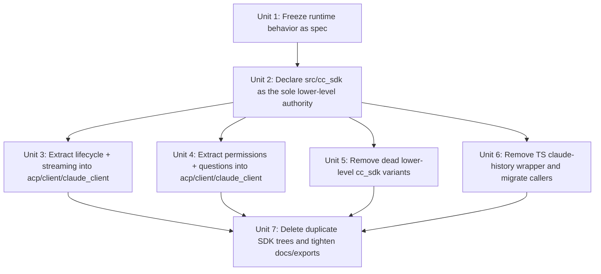
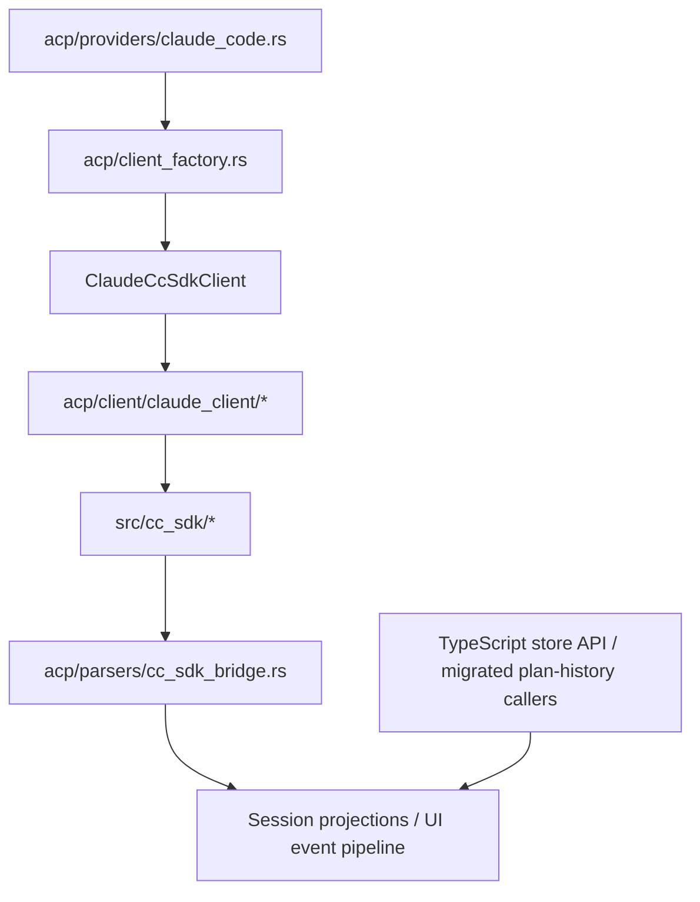

# Refactor: establish one clean internal Claude Code runtime

## Overview

Acepe already runs Claude Code through one real runtime path:

```text
ClaudeCodeProvider
  -> CommunicationMode::CcSdk
  -> client_factory.rs
  -> ClaudeCcSdkClient
  -> crate::cc_sdk::ClaudeSDKClient
  -> Claude CLI
```

The problem is not that the app still uses the old sidecar path at runtime. It does not.
The problem is that the *real* path is still buried inside transitional structure:

- a giant `ClaudeCcSdkClient`
- multiple dead or legacy `cc_sdk` client variants
- duplicate `cc-sdk-local/` and `vendor/cc-sdk/` trees
- a redundant TypeScript `claude-history.ts` wrapper and re-export seam

This plan turns the currently used path into one explicit, owned Claude runtime with:

```text
one authoritative lower-level runtime
+ one product-facing integration layer
+ zero duplicate SDK trees
```

## Problem Frame

Acepe wants to own the Claude integration because raw/upstream snapshots were not sufficient for product needs. The codebase reflects that intent, but the architecture is still transitional.

Today:

- production behavior depends on `ClaudeCcSdkClient` plus the in-repo `src-tauri/src/cc_sdk` tree
- lower-level ownership is obscured by duplicate trees and dead exports
- the runtime wrapper owns lifecycle, streaming, permission, and question logic in one giant file
- the TypeScript side still carries a redundant Claude-specific history wrapper even though the real runtime/API path already exists elsewhere

The cleanest target is not “support upstream and our implementation.” It is:

```text
ClaudeCodeProvider
   -> ClaudeCcSdkClient
        -> clean product-facing integration layer
        -> owned lower-level runtime in src/cc_sdk
             -> one transport seam
             -> one message/protocol seam
             -> one CLI install/discovery seam
        -> zero parallel copies
```

## Requirements Trace

- **R1.** Acepe uses exactly one authoritative lower-level Claude runtime for production Claude sessions.
- **R2.** The production behavior of the current runtime path remains the behavioral baseline: new session, resume, fork, prompt send, interrupt, permission handling, question handling, and streaming updates continue to work.
- **R3.** `ClaudeCodeProvider` and `client_factory.rs` depend on a clean, explicit Claude runtime boundary with one owned lower-level implementation and one product-facing integration layer.
- **R4.** The current `ClaudeCcSdkClient` responsibilities are decomposed into coherent modules: lifecycle/options, streaming bridge, permission bridge, and question handling.
- **R5.** Duplicate or dead Claude implementations (`cc-sdk-local/`, `vendor/cc-sdk/`, dead `cc_sdk` client variants, redundant TS wrapper layers) are removed or clearly retired.
- **R6.** Test coverage preserves the current runtime path as the behavioral spec and moves with extracted modules so parity regressions are caught at the correct seam.

## Scope Boundaries

- This plan is **not** a from-scratch Claude CLI protocol rewrite.
- This plan does **not** change the user-facing Claude feature set or invent new Claude product behavior.
- This plan does **not** redesign the generic ACP event model for every provider.
- This plan does **not** move provider semantics into the UI.

### Deferred to Separate Tasks

- A broader unification of the full ACP session/event architecture across all providers
- UI/controller refactors outside the Claude-specific TypeScript service cleanup
- Any later namespace rename from `src/cc_sdk/` to a different lower-level module name once the runtime is simplified

## Context & Research

### Relevant Code and Patterns

- `packages/desktop/src-tauri/src/acp/providers/claude_code.rs` — production provider path; `communication_mode()` already returns `CommunicationMode::CcSdk`
- `packages/desktop/src-tauri/src/acp/client_factory.rs` — central dispatch point; `CommunicationMode::CcSdk` instantiates `ClaudeCcSdkClient`
- `packages/desktop/src-tauri/src/acp/client/cc_sdk_client.rs` — current product-facing runtime wrapper and main refactor target
- `packages/desktop/src-tauri/src/acp/client/cc_sdk_client/permissions.rs` — existing partial extraction seam that should be either absorbed or retired explicitly
- `packages/desktop/src-tauri/src/acp/parsers/cc_sdk_bridge.rs` — existing `cc_sdk::Message` → `SessionUpdate` translation seam
- `packages/desktop/src-tauri/src/cc_sdk/client.rs` — currently used lower-level Claude runtime client
- `packages/desktop/src-tauri/src/cc_sdk/transport/subprocess.rs` — subprocess and Claude CLI transport seam
- `packages/desktop/src-tauri/src/acp/agent_installer.rs` — lower-level CLI install/discovery seam currently coupled to `cc_sdk::cli_download`
- `packages/desktop/src/lib/acp/store/api.ts` — authoritative frontend store/API boundary
- `packages/desktop/src/lib/services/claude-history.ts` — redundant Claude-specific runtime/type wrapper to retire after explicit caller migration

### Institutional Learnings

- `docs/solutions/best-practices/provider-owned-policy-and-identity-not-ui-projections-2026-04-09.md`
  - keep provider identity and lifecycle policy in explicit provider-owned contracts, not UI projections
- `docs/solutions/best-practices/deterministic-tool-call-reconciler-2026-04-18.md`
  - backend semantic normalization must stay backend-owned; UI consumes typed outcomes
- `docs/solutions/architectural/provider-owned-semantic-tool-pipeline-2026-04-18.md`
  - streaming and non-streaming paths must share the same semantic pipeline instead of inventing parallel classifiers

### Related Prior Art

- `docs/plans/2026-03-24-001-refactor-migrate-claude-acp-to-cc-sdk-plan.md`
  - confirms the separation between Provider (metadata/config) and Client (runtime), and the need to preserve the event pipeline
- `docs/plans/2026-04-15-001-feat-claude-1m-context-and-remove-acp-sidecar-plan.md`
  - confirms the live Claude path is `CommunicationMode::CcSdk`, not the old sidecar

### External References

- None needed. The repo already has strong local patterns and direct runtime evidence for this refactor.

## Key Technical Decisions

| Decision | Rationale |
|---|---|
| Use the **current runtime path as the behavioral spec** | The runtime already works. This refactor should clarify ownership and boundaries, not replace the product behavior with a speculative rewrite. |
| Keep **`src/cc_sdk/` as the authoritative lower-level runtime for this refactor** | The repo already runs through this tree. Keeping the namespace avoids rename churn while still letting us establish one owned lower-level authority and remove duplicates. |
| Keep `ClaudeCodeProvider` metadata-only and `ClaudeCcSdkClient` product-facing | This matches the existing provider/client separation and prevents runtime policy from drifting into provider metadata or UI code. |
| Extract the product-facing bridge under **`acp/client/claude_client/`** | A separately named bridge layer avoids recreating the dual-authority ambiguity with two different `claude_runtime` directories. |
| Extract by **responsibility**, not by arbitrary file size | The point is durable boundaries: lifecycle/options, streaming bridge, permissions, question handling, and lower-level transport/protocol ownership. |
| Do **not** add a compatibility facade | A temporary facade would immediately recreate a second authority. |

## Open Questions

### Resolved During Planning

- **Should Acepe keep both the internal implementation and the extra SDK copies?** No. One lower-level authority only.
- **Should this be a from-scratch rewrite of Claude transport behavior?** No. The current runtime path is the spec; use it to drive extraction and cleanup.
- **Should UI layers keep repairing Claude semantics?** No. Existing backend-owned normalization patterns stay in place.
- **Should this refactor rename the lower-level `src/cc_sdk/` namespace?** No. Keep `src/cc_sdk/` for this refactor and reserve any namespace rename for a later, smaller cleanup.
- **Should this refactor introduce a temporary compatibility facade?** No. The plan explicitly avoids creating a second long-term authority.

### Deferred to Implementation

- Whether some lower-level helper modules in `src/cc_sdk/` (for example token/perf helpers) should be deleted outright or retained behind non-runtime/test-only gates
- Whether the diagnostic/example binary `src/bin/inspect_cc_sdk_stream.rs` should be updated to the final cleaned boundary or removed entirely after the lower-level API settles

## Output Structure

```text
packages/desktop/src-tauri/src/
├── acp/
│   ├── client/
│   │   ├── claude_client/
│   │   │   ├── mod.rs
│   │   │   ├── client.rs
│   │   │   ├── lifecycle.rs
│   │   │   ├── streaming_bridge.rs
│   │   │   ├── permissions.rs
│   │   │   └── questions.rs
│   │   └── ...
│   └── providers/
│       └── claude_code.rs
├── cc_sdk/
│   ├── mod.rs
│   ├── client.rs
│   ├── types.rs
│   ├── errors.rs
│   ├── message_parser.rs
│   ├── cli_download.rs
│   ├── transport/
│   │   ├── mod.rs
│   │   └── subprocess.rs
│   └── ...
└── lib.rs

packages/desktop/src/lib/
├── acp/store/api.ts
├── services/claude-history.ts   (removed)
└── ...
```

This illustrates the intended output shape, not an implementation script.

## High-Level Technical Design

> *This illustrates the intended approach and is directional guidance for review, not implementation specification. The implementing agent should treat it as context, not code to reproduce.*

### Current vs target ownership

```text
CURRENT
=======

ClaudeCodeProvider
   -> ClaudeCcSdkClient
        -> giant runtime wrapper
        -> src/cc_sdk
        -> duplicate legacy trees still present
        -> redundant TS wrapper still present

TARGET
======

ClaudeCodeProvider
   -> ClaudeCcSdkClient
        -> clean product-facing integration layer
        -> owned lower-level runtime in src/cc_sdk
        -> zero duplicate trees
        -> zero Claude-specific TS wrapper layer
```

### Boundary model

```text
Acepe app / ACP domain
        |
        v
ClaudeCodeProvider
        |
        v
ClaudeCcSdkClient
  (AgentClient impl; Acepe-facing orchestration)
        |
        +--> acp/client/claude_client/*
        |
        v
src/cc_sdk/*
  (owned lower-level runtime)
        |
        v
Claude CLI
```

## Implementation Units



- [ ] **Unit 1: Freeze the currently used runtime behavior as the refactor spec**

**Goal:** Capture the live Claude runtime path as the behavioral baseline before moving boundaries.

**Requirements:** R2, R6

**Dependencies:** None

**Files:**
- Modify: `packages/desktop/src-tauri/src/acp/client/cc_sdk_client.rs`
- Modify: `packages/desktop/src-tauri/src/acp/parsers/cc_sdk_bridge.rs`
- Modify: `packages/desktop/src-tauri/src/acp/client_factory.rs`
- Test: `packages/desktop/src-tauri/src/acp/client/cc_sdk_client.rs`
- Test: `packages/desktop/src-tauri/src/acp/parsers/cc_sdk_bridge.rs`
- Test: `packages/desktop/src-tauri/tests/history_integration_test.rs`

**Approach:**
- Identify the minimal runtime behaviors that define parity for the currently used path:
  - new session
  - resume session
  - fork session
  - prompt send / streaming
  - cancel / interrupt
  - permission request + resolution
  - question request + resolution
  - provider-backed history load
- Strengthen tests at stable runtime seams rather than around dead code paths.
- Treat the current behavior as the spec to preserve while refactoring internals.

**Execution note:** Start with characterization-first coverage for the live runtime path before extracting modules.

**Patterns to follow:**
- `docs/solutions/best-practices/provider-owned-policy-and-identity-not-ui-projections-2026-04-09.md`
- `docs/solutions/best-practices/deterministic-tool-call-reconciler-2026-04-18.md`

**Test scenarios:**
- Happy path — creating a Claude session through the `CommunicationMode::CcSdk` factory path produces the Claude runtime client and starts the message bridge.
- Happy path — resuming and forking a Claude session preserve provider-owned session identity and continue to emit projected updates.
- Happy path — a normal streaming assistant/tool sequence still yields the same `SessionUpdate` flow expected by the store pipeline.
- Edge case — sparse permission/question payloads still normalize into stable internal requests instead of crashing or closing the stream.
- Error path — Claude transport/permission denial failures still surface through the same error pathways instead of silently disappearing during refactor.
- Integration — provider-backed history loading continues to use the correct provider-owned identity rather than the local Acepe session id.

**Verification:**
- The active Claude runtime path has a binary coverage bar: each of the eight listed behaviors has at least one test that exercises the live `CommunicationMode::CcSdk` factory path or its stable downstream seam and fails if the path is removed, bypassed, or behaviorally changed.

- [ ] **Unit 2: Declare `src/cc_sdk/` as the sole lower-level Claude runtime authority**

**Goal:** Make the already-used `src/cc_sdk/` tree the only declared lower-level authority and route all production Claude call sites through that owned boundary.

**Requirements:** R1, R3

**Dependencies:** Unit 1

**Files:**
- Modify: `packages/desktop/src-tauri/src/cc_sdk/mod.rs`
- Modify: `packages/desktop/src-tauri/src/cc_sdk/client.rs`
- Modify: `packages/desktop/src-tauri/src/cc_sdk/types.rs`
- Modify: `packages/desktop/src-tauri/src/cc_sdk/errors.rs`
- Modify: `packages/desktop/src-tauri/src/cc_sdk/message_parser.rs`
- Modify: `packages/desktop/src-tauri/src/cc_sdk/cli_download.rs`
- Modify: `packages/desktop/src-tauri/src/cc_sdk/transport/mod.rs`
- Modify: `packages/desktop/src-tauri/src/cc_sdk/transport/subprocess.rs`
- Modify: `packages/desktop/src-tauri/src/lib.rs`
- Modify: `packages/desktop/src-tauri/src/acp/providers/claude_code.rs`
- Modify: `packages/desktop/src-tauri/src/acp/client_factory.rs`
- Modify: `packages/desktop/src-tauri/src/acp/client/cc_sdk_client.rs`
- Modify: `packages/desktop/src-tauri/src/acp/client/mod.rs`
- Modify: `packages/desktop/src-tauri/src/acp/agent_installer.rs`
- Modify: `packages/desktop/src-tauri/src/acp/parsers/cc_sdk_bridge.rs`
- Modify: `packages/desktop/src-tauri/src/acp/parsers/mod.rs`
- Modify: `packages/desktop/src-tauri/src/acp/commands/interaction_commands.rs`
- Modify: `packages/desktop/src-tauri/src/acp/attachment_token_expander.rs`
- Modify: `packages/desktop/src-tauri/src/bin/inspect_cc_sdk_stream.rs`
- Test: `packages/desktop/src-tauri/src/acp/parsers/tests/provider_composition_boundary.rs`

**Approach:**
- Tighten `src/cc_sdk/` so it is explicitly the owned lower-level Claude runtime used by Acepe, not a broad mixed bag of active and legacy implementations.
- Update all production Claude call sites that currently reach into `crate::cc_sdk` so they depend only on the intended lower-level runtime surface while preserving the existing provider/client split:
  - `ClaudeCodeProvider` remains metadata/config oriented
  - `ClaudeCcSdkClient` remains the product-facing `AgentClient`
- Re-target bridge/import and installer seams explicitly so this unit closes the lower-level authority question instead of deferring it.
- Update `src/bin/inspect_cc_sdk_stream.rs` only enough to keep it aligned with the tightened `src/cc_sdk/` imports and lower-level API surface; final keep-or-delete disposition remains deferred to Unit 7.

**Technical design:** Directional intent only: `src/cc_sdk/` remains the lower-level runtime namespace for this refactor, but its public surface becomes intentionally smaller and clearly owned by Acepe.

**Patterns to follow:**
- `packages/desktop/src-tauri/src/acp/client_factory.rs`
- `packages/desktop/src-tauri/src/acp/providers/claude_code.rs`

**Test scenarios:**
- Happy path — production Claude call sites resolve through the tightened `src/cc_sdk/` boundary without changing provider dispatch behavior.
- Edge case — model discovery, availability checks, transport spawning, and installer repair still use the same lower-level runtime authority after the cleanup.
- Integration — `CommunicationMode::CcSdk` factory dispatch, provider usage, bridge imports, and installer flows remain correct after the lower-level authority is tightened.

**Verification:**
- Every production Claude call site depends on the intended `src/cc_sdk/` lower-level surface, and no second lower-level authority is introduced.

- [ ] **Unit 3: Extract lifecycle and streaming into `acp/client/claude_client/`**

**Goal:** Separate connection/options lifecycle and streaming/event-loop behavior from the giant wrapper into an explicit product-facing bridge layer.

**Requirements:** R3, R4, R6

**Dependencies:** Unit 2

**Files:**
- Create: `packages/desktop/src-tauri/src/acp/client/claude_client/mod.rs`
- Create: `packages/desktop/src-tauri/src/acp/client/claude_client/client.rs`
- Create: `packages/desktop/src-tauri/src/acp/client/claude_client/lifecycle.rs`
- Create: `packages/desktop/src-tauri/src/acp/client/claude_client/streaming_bridge.rs`
- Modify: `packages/desktop/src-tauri/src/acp/client/cc_sdk_client.rs`
- Modify: `packages/desktop/src-tauri/src/acp/parsers/cc_sdk_bridge.rs`
- Test: `packages/desktop/src-tauri/src/acp/client/cc_sdk_client.rs`
- Test: `packages/desktop/src-tauri/src/acp/parsers/cc_sdk_bridge.rs`

**Approach:**
- Extract by responsibility:
  - lifecycle/options building and session connect/resume/fork
  - streaming bridge and event dispatch
- Keep `cc_sdk_bridge.rs` as the message-to-`SessionUpdate` translation seam instead of duplicating classification/translation logic in multiple modules.
- Ensure the extracted modules still feed the same downstream projection/event pipeline.

**Execution note:** Implement test-first for each extraction seam; move tests with the responsibility they verify.

**Patterns to follow:**
- `docs/solutions/architectural/provider-owned-semantic-tool-pipeline-2026-04-18.md`

**Test scenarios:**
- Happy path — session connect, resume, and fork route through the extracted lifecycle module and preserve provider-owned session identity.
- Happy path — the extracted streaming bridge still emits the same assistant/tool/session updates for a representative Claude message sequence.
- Edge case — bridge restart/reset correctly clears transient runtime state without converting old in-flight requests into incorrect denials.
- Error path — unresolved transport or stream anomalies still surface through diagnostics instead of being swallowed during extraction.
- Integration — extracted lifecycle/streaming modules still preserve the existing AcpUiEventDispatcher / projection interactions expected by the rest of the ACP stack.

**Verification:**
- `ClaudeCcSdkClient` becomes materially thinner for lifecycle and streaming concerns, and those concerns are owned by the new `acp/client/claude_client/` bridge layer.

- [ ] **Unit 4: Extract permissions and questions into `acp/client/claude_client/`**

**Goal:** Move permission and question handling out of the giant wrapper into the product-facing bridge layer without orphaning the existing partial extraction.

**Requirements:** R3, R4, R6

**Dependencies:** Unit 2

**Files:**
- Create: `packages/desktop/src-tauri/src/acp/client/claude_client/permissions.rs`
- Create: `packages/desktop/src-tauri/src/acp/client/claude_client/questions.rs`
- Modify: `packages/desktop/src-tauri/src/acp/client/cc_sdk_client.rs`
- Delete: `packages/desktop/src-tauri/src/acp/client/cc_sdk_client/permissions.rs`
- Test: `packages/desktop/src-tauri/src/acp/client/cc_sdk_client.rs`
- Test: `packages/desktop/src-tauri/src/acp/parsers/cc_sdk_bridge.rs`

**Approach:**
- Build on the existing partial extraction instead of leaving it half-retired.
- Move permission bridge logic, hook integration, reusable approvals, and stream-only question handling into the new `acp/client/claude_client/` bridge layer.
- Delete the old `acp/client/cc_sdk_client/permissions.rs` path once its responsibilities are absorbed so there is only one product-facing bridge location.

**Patterns to follow:**
- Existing `packages/desktop/src-tauri/src/acp/client/cc_sdk_client/permissions.rs`
- `docs/solutions/best-practices/provider-owned-policy-and-identity-not-ui-projections-2026-04-09.md`

**Test scenarios:**
- Happy path — permission callbacks and hook-based permission requests still converge on the same reusable approval flow after extraction.
- Happy path — question requests still bind to the correct interaction/session and resolve into projections after extraction.
- Edge case — reusable approval state and pending question state survive bridge reset boundaries the same way they do today.
- Error path — permission and question anomalies still surface diagnostics instead of being swallowed during extraction.
- Integration — no live caller still depends on the old `acp/client/cc_sdk_client/permissions.rs` path after the new bridge layer is introduced.

**Verification:**
- Permission and question handling now live in the named bridge layer, and the old partial extraction path is removed rather than left ambiguous.

- [ ] **Unit 5: Remove dead lower-level `cc_sdk` variants**

**Goal:** Remove exported lower-level `cc_sdk` client variants that are not part of the live production path.

**Requirements:** R1, R5

**Dependencies:** Unit 2

**Files:**
- Modify: `packages/desktop/src-tauri/src/cc_sdk/mod.rs`
- Delete: `packages/desktop/src-tauri/src/cc_sdk/interactive.rs`
- Delete: `packages/desktop/src-tauri/src/cc_sdk/client_working.rs`
- Delete: `packages/desktop/src-tauri/src/cc_sdk/optimized_client.rs`
- Test: `packages/desktop/src-tauri/src/acp/parsers/tests/provider_composition_boundary.rs`

**Approach:**
- Remove exported lower-level variants that are not part of production Claude execution.
- Retain helper modules only when they are still used by the authoritative lower-level runtime or tests.

**Patterns to follow:**
- `packages/desktop/src-tauri/src/cc_sdk/mod.rs`

**Test scenarios:**
- Happy path — production Claude creation still compiles and runs with only the authoritative lower-level client exported.
- Edge case — no production caller depends on removed dead `cc_sdk` variants.
- Integration — module exports no longer imply multiple live lower-level Claude clients.

**Verification:**
- `src/cc_sdk/` exposes one live lower-level client path for production use, not several competing variants.

- [ ] **Unit 6: Remove the TypeScript `claude-history.ts` wrapper and migrate callers**

**Goal:** Delete the redundant TypeScript Claude history wrapper and move its remaining runtime/type callers onto the authoritative API/type surfaces.

**Requirements:** R1, R5

**Dependencies:** Unit 2

**Files:**
- Modify: `packages/desktop/src/lib/acp/store/api.ts`
- Modify: `packages/desktop/src/lib/acp/store/session-store.svelte.ts`
- Modify: `packages/desktop/src/lib/acp/store/services/session-repository.ts`
- Modify: `packages/desktop/src/lib/acp/components/agent-panel/logic/plan-loader.ts`
- Modify: `packages/desktop/src/lib/acp/components/agent-panel/types/plan-state.ts`
- Modify: `packages/desktop/src/lib/acp/components/plan-dialog.svelte`
- Modify: `packages/desktop/src/lib/acp/components/agent-panel/scene/desktop-agent-panel-scene.ts`
- Modify: `packages/desktop/src/lib/acp/components/agent-panel/scene/desktop-agent-panel-scene.test.ts`
- Modify: `packages/desktop/src/lib/utils/tauri-client/history.ts`
- Modify: `packages/desktop/src/lib/services/claude-history-types.ts`
- Delete: `packages/desktop/src/lib/services/claude-history.ts`
- Test: `packages/desktop/src/lib/acp/store/services/__tests__/session-repository-startup-sessions.test.ts`
- Test: `packages/desktop/src/lib/acp/store/services/__tests__/session-repository-refresh-source-path.test.ts`
- Test: `packages/desktop/src/lib/acp/components/agent-panel/scene/desktop-agent-panel-scene.test.ts`

**Approach:**
- Enumerate the remaining runtime and type callers of `claude-history.ts` up front rather than discovering them mid-unit.
- Move service callers to the authoritative `acp/store/api.ts` path.
- Move type callers to the stable type source they actually depend on instead of preserving a service-wrapper re-export indefinitely.
- Resolve `claude-history-types.ts` in the same unit instead of deferring it:
  - either retain it explicitly as the pure Claude-history type home with no runtime wrapper dependency
  - or move its remaining types to their stable home and delete it in the same change

**Patterns to follow:**
- `packages/desktop/src/lib/acp/store/api.ts`
- `packages/desktop/src/lib/acp/store/services/session-repository.ts`

**Test scenarios:**
- Happy path — session repository startup/session refresh flows still produce the same observable state transitions after callers move off the wrapper.
- Happy path — plan-related UI/state callers (`plan-loader`, `plan-state`, `plan-dialog`, `desktop-agent-panel-scene`) still receive the same plan/content types after type import migration.
- Edge case — no remaining runtime or type caller imports from `claude-history.ts` after the unit completes.
- Integration — the migrated callers use the authoritative API/type surfaces and preserve existing history/plan loading behavior.

**Verification:**
- `claude-history.ts` is deleted, its callers are explicitly migrated, `claude-history-types.ts` has an explicit final state (retained pure-types module or deleted after migration), and the user-observable store/UI behavior remains unchanged.

- [ ] **Unit 7: Delete duplicate SDK trees and tighten docs, exports, and parity safeguards**

**Goal:** Remove the remaining duplicate Claude SDK trees and make the one-authority decision obvious and durable for future contributors.

**Requirements:** R1, R3, R5, R6

**Dependencies:** Units 3, 4, 5, and 6

**Files:**
- Modify: `packages/desktop/src-tauri/Cargo.toml`
- Modify: `README.md`
- Modify: `packages/desktop/src-tauri/src/lib.rs`
- Modify: `packages/desktop/src-tauri/src/acp/providers/claude_code.rs`
- Modify: `packages/desktop/src-tauri/src/bin/inspect_cc_sdk_stream.rs`
- Modify: `CHANGELOG.md`
- Delete: `packages/desktop/src-tauri/cc-sdk-local/Cargo.toml`
- Delete: `packages/desktop/src-tauri/cc-sdk-local/`
- Delete: `packages/desktop/src-tauri/vendor/cc-sdk/`
- Test: `packages/desktop/src-tauri/src/acp/parsers/tests/provider_composition_boundary.rs`

**Approach:**
- Delete inert duplicate SDK trees once the owned lower-level runtime and product-facing bridges are stable.
- Update docs and module comments so the architecture clearly states:
  - Acepe owns one lower-level runtime in `src/cc_sdk/`
  - `ClaudeCcSdkClient` is the product-facing integration layer
  - provider/client boundaries remain explicit
- Add one concrete parity safeguard that prevents silent authority drift, for example a provider-composition test that proves the Claude provider resolves only to the intended production path and no duplicate runtime tree is referenced.
- Make the final decision for `src/bin/inspect_cc_sdk_stream.rs`: either keep it as a diagnostic binary pointed only at the authoritative runtime surface or delete it entirely if it no longer adds value after the cleanup.

**Patterns to follow:**
- `docs/solutions/best-practices/provider-owned-policy-and-identity-not-ui-projections-2026-04-09.md`
- `docs/plans/2026-04-15-001-feat-claude-1m-context-and-remove-acp-sidecar-plan.md`

**Test scenarios:**
- Happy path — provider/client composition tests prove the Claude provider resolves only to the intended production path.
- Edge case — contributor-facing docs/comments no longer point to removed or legacy Claude runtime implementations.
- Integration — repo/build/docs surfaces no longer reference `cc-sdk-local/` or `vendor/cc-sdk/`, and the composition safeguard fails if a second Claude authority is reintroduced.

**Verification:**
- The repo clearly communicates one owned Claude runtime, duplicate SDK trees are gone, and one concrete composition safeguard makes accidental drift visible.

## System-Wide Impact



- **Interaction graph:** provider dispatch, client factory, product-facing Claude client, lower-level runtime, parser bridge, projections, and TS store/API callers are all touched.
- **Error propagation:** transport, permission, and question failures must continue to surface through the same runtime/projection pathways; refactor must not introduce silent drop points.
- **State lifecycle risks:** session identity, bridge reset, reusable approvals, stream-only questions, and CLI install/discovery are the highest-risk lifecycle seams.
- **API surface parity:** the frontend should keep the same generated command/types surface; the TS wrapper removal is an internal simplification, not a contract redesign.
- **Integration coverage:** the most important proofs are cross-layer: provider dispatch → client creation, bridge → lower-level runtime, runtime message stream → `SessionUpdate`, permission/question callbacks → projections, and TS caller migration → unchanged visible state.
- **Unchanged invariants:** `ClaudeCodeProvider` stays metadata-oriented, backend-owned tool semantics remain backend-owned, and the UI does not become the repair layer for Claude runtime behavior.

## Alternative Approaches Considered

| Approach | Why not chosen |
|---|---|
| Rewrite the Claude CLI protocol/client from scratch in one step | Too risky. The current runtime path already works and provides the behavioral spec. |
| Rename `src/cc_sdk/` during the same refactor | Too much churn for one plan. Ownership clarity can be achieved now without a namespace move. |
| Keep `src/cc_sdk`, `cc-sdk-local`, and `vendor/cc-sdk` in parallel as “insurance” | This preserves the ambiguity that caused the problem. |
| Only split files without declaring one lower-level authority | Cosmetic improvement only; contributors would still have to reason about multiple implementations. |

## Risks & Dependencies

| Risk | Mitigation |
|------|------------|
| Refactor changes runtime behavior while cleaning structure | Characterization-first parity coverage in Unit 1; move tests with extracted behavior |
| Hidden callers still depend on old lower-level exports or TS wrapper re-exports | Explicit caller enumeration in Units 2 and 6 before deletion |
| Duplicate-tree removal happens before the authoritative runtime is fully stable | Sequence deletion after bridge extraction, dead-variant removal, and TS migration |
| Provider-owned identity or semantic logic drifts into UI/store code during cleanup | Follow existing provider-owned policy and semantic-tool-pipeline learnings; keep normalization backend-owned |

## Documentation / Operational Notes

- Document that Acepe intentionally owns one lower-level Claude runtime because product requirements outgrew raw/upstream snapshots.
- Keep contributor-facing comments aligned with the actual runtime path; no historical ambiguity in module docs.
- Release notes should frame this as a maintainability and reliability refactor with no intended user-facing behavior change.

## Sources & References

- Related issues: #143, #145, #146, #147
- Related code:
  - `packages/desktop/src-tauri/src/acp/providers/claude_code.rs`
  - `packages/desktop/src-tauri/src/acp/client_factory.rs`
  - `packages/desktop/src-tauri/src/acp/client/cc_sdk_client.rs`
  - `packages/desktop/src-tauri/src/acp/parsers/cc_sdk_bridge.rs`
  - `packages/desktop/src-tauri/src/cc_sdk/client.rs`
  - `packages/desktop/src-tauri/src/acp/agent_installer.rs`
  - `packages/desktop/src/lib/acp/store/api.ts`
  - `packages/desktop/src/lib/services/claude-history.ts`
- Related plans:
  - `docs/plans/2026-03-24-001-refactor-migrate-claude-acp-to-cc-sdk-plan.md`
  - `docs/plans/2026-04-15-001-feat-claude-1m-context-and-remove-acp-sidecar-plan.md`
- Institutional learnings:
  - `docs/solutions/best-practices/provider-owned-policy-and-identity-not-ui-projections-2026-04-09.md`
  - `docs/solutions/best-practices/deterministic-tool-call-reconciler-2026-04-18.md`
  - `docs/solutions/architectural/provider-owned-semantic-tool-pipeline-2026-04-18.md`
