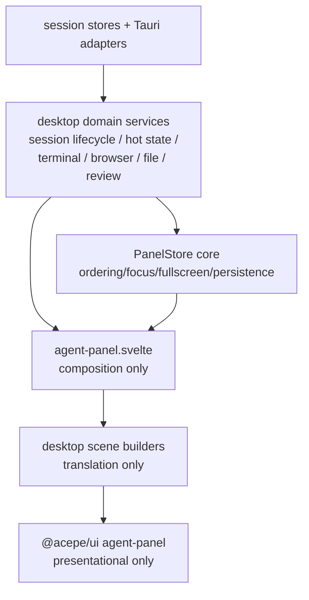
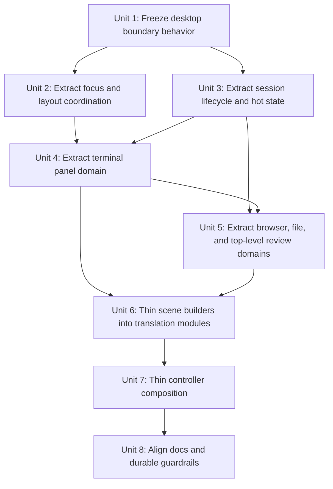
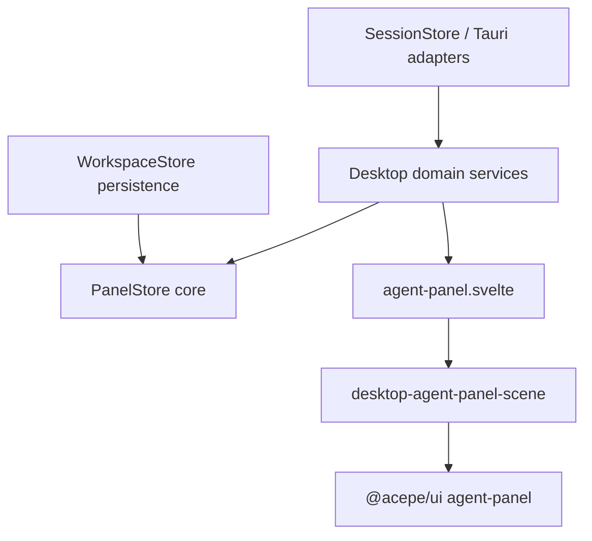

# refactor: split desktop agent-panel orchestration into domain services

## Overview

Sharpen the boundary between `@acepe/ui` and desktop orchestration by turning the current desktop agent-panel/controller layer into a set of explicit domain services plus thin scene mappers, while keeping `@acepe/ui` fully presentational and preserving current panel behavior.

This plan is **not** the 2026-04-10 shared-UI reset plan rewritten. That plan focused on extracting real desktop presentation into `packages/ui` and making website parity credible. Issue **#147** is the architectural cleanup underneath that work: the desktop side must stop behaving like a second monolith if the shared/UI boundary is going to stay trustworthy.

## Problem Frame

Acepe already has the right high-level architecture:

- `packages/ui` holds dumb, reusable presentational components
- desktop owns stores, runtime orchestration, and Tauri integrations
- the agent-panel scene/model layer is meant to translate desktop state into shared view models

The problem is that the desktop boundary is no longer sharp enough:

- `packages/desktop/src/lib/acp/store/panel-store.svelte.ts` centralizes panel lifecycle, hot state, browser/review/file/terminal behavior, session-materialization guards, focus/fullscreen logic, and workspace persistence
- `packages/desktop/src/lib/acp/components/agent-panel/scene/desktop-agent-panel-scene.ts` mixes pure translation with desktop policy decisions about cards, strips, sidebars, and action wiring
- `packages/desktop/src/lib/acp/components/agent-panel/components/agent-panel.svelte` still combines many stores and controller concerns directly

That creates a subtle but important failure mode: `@acepe/ui` stays “presentational” on paper, while desktop orchestration remains too broad to be reasoned about by domain. This plan fixes the desktop side of the seam without moving policy into shared UI or inventing a new parallel abstraction.

## Requirements Trace

- **R1.** `@acepe/ui` remains fully presentational: props in, callbacks out, no Tauri, store, or app-specific policy.
- **R2.** `panel-store.svelte.ts` stops acting as the cross-feature owner for every panel concern; panel-family and hot-state policies move into named desktop domain services/stores.
- **R3.** Focus, fullscreen, close-order, and workspace ordering remain canonical and behaviorally unchanged during the split.
- **R4.** `desktop-agent-panel-scene.ts` becomes primarily translation/composition; policy decisions move into named desktop domain services or controller-owned state builders.
- **R5.** `agent-panel.svelte` consumes resolved desktop facades/domain state instead of recomputing broad policy from many raw stores in one file.
- **R6.** Inline review mode and top-level review panels stay explicitly separate concerns; the refactor must not collapse them into one ambiguous “review” owner.
- **R7.** Existing user-facing behavior for panel lifecycle, session materialization, terminal groups, browser sidebars, review state, and plan/sidebar state remains intact.
- **R8.** Boundary guardrails become explicit and durable through behavioral tests and aligned documentation, not brittle source-structure assertions.

## Scope Boundaries

- Do not move desktop runtime policy, Tauri listeners, session stores, or workspace persistence into `packages/ui`.
- Do not redesign the visible agent-panel UI or reopen the website-parity scope from the 2026-04-10 reset plan.
- Do not replace `PanelStore` with multiple independent coordinators that can drift on panel ordering or fullscreen semantics.
- Do not merge inline review mode and top-level review workspaces into one generalized review abstraction.
- Do not add source-reading “architecture tests” that assert on file contents; all enforcement must stay behavioral or import-surface based.

### Deferred to Separate Tasks

- Additional shared-UI extraction work from `docs/plans/2026-04-10-004-refactor-agent-panel-ui-extraction-reset-plan.md`
- Any later migration of truly generic scene helpers from desktop into `packages/ui` after the desktop virtualization boundary is stable
- Pane-body extraction work for embedded browser, terminal drawer body, attached-file pane body, or checkpoint timeline shells

## Context & Research

### Relevant Code and Patterns

- `packages/ui/src/components/agent-panel/types.ts` is the canonical presentational boundary and explicitly forbids Tauri/store/desktop dependencies.
- `packages/desktop/src/lib/acp/store/panel-store.svelte.ts` is the current desktop orchestration bottleneck: it owns workspace ordering, panel lifecycle, session panel creation, hot state, focus/fullscreen, and multiple panel families.
- `packages/desktop/src/lib/acp/store/embedded-terminal-store.svelte.ts` proves a useful decomposition pattern already exists inside desktop: focused state can live in a companion store while `PanelStore` coordinates ownership.
- `packages/desktop/src/lib/acp/store/services/` already exists for session-oriented services; new panel-domain services should live alongside that existing service layer rather than inventing a second coordination directory.
- `packages/desktop/src/lib/acp/components/agent-panel/scene/desktop-agent-panel-scene.ts` is the current model/scene adapter; it should stay desktop-owned but lose policy-heavy responsibilities.
- `packages/desktop/src/lib/acp/components/agent-panel/components/agent-panel.svelte` is the desktop controller/composition root; it should stay the runtime owner but consume narrower facades.
- `packages/desktop/src/lib/acp/components/agent-panel/components/review-workspace-model.ts` and `packages/ui/src/components/agent-panel/review-workspace.test.ts` show the intended separation between resolved selection policy and dumb shared rendering.
- `packages/desktop/src/lib/acp/store/__tests__/panel-store-workspace-panels.vitest.ts`, `panel-store-background-open.vitest.ts`, `panel-store-terminal-groups.vitest.ts`, and `workspace-fullscreen-migration.test.ts` are the most important characterization anchors for this refactor.

### Institutional Learnings

- `docs/solutions/best-practices/provider-owned-policy-and-identity-not-ui-projections-2026-04-09.md` — presentation data must not become the hidden authority for runtime policy.
- `docs/solutions/best-practices/reactive-state-async-callbacks-svelte-2026-04-15.md` — selection/defaulting/navigation policy belongs in the desktop controller, not shared UI components.
- `docs/solutions/best-practices/deterministic-tool-call-reconciler-2026-04-18.md` — canonical classification/policy must stay in the owning layer; UI consumes typed outputs instead of repairing them.
- `docs/solutions/architectural/provider-owned-semantic-tool-pipeline-2026-04-18.md` — large monoliths become safer when split into narrow, named stages with one clear owner per concern.

### Related Prior Art

- `docs/brainstorms/2026-04-10-agent-panel-ui-extraction-reset-requirements.md` — important because R16-R19 require thin desktop adapters and explicitly reject a second product-facing abstraction.
- `docs/plans/2026-04-10-004-refactor-agent-panel-ui-extraction-reset-plan.md` — adjacent plan focused on shared extraction/parity; this plan complements it by cleaning up the desktop orchestration seam underneath.

### External References

- None. The repo already contains the relevant architectural patterns and failure examples.

## Key Technical Decisions

| Decision | Rationale |
|---|---|
| Keep `PanelStore` as the canonical workspace coordinator, but make it thin | `workspacePanels` ordering, fullscreen/focus behavior, and workspace persistence are cross-domain invariants that still need one owner. |
| Extract focus/fullscreen/close-order into a dedicated desktop coordination module before splitting panel families | The current capture/apply close-state pair is the highest-risk coupling; panel-family extraction is unsafe until this coordination seam is explicit. Because it works with reactive panel state, this coordinator must be a `.svelte.ts` companion rather than a plain helper file. |
| Split hot state and session-materialization guards from panel-family logic | Drafts, plan sidebar, pending user entry, session open guards, and auto-materialization suppression are not the same concern as terminal/review/browser/file panels. |
| Treat terminal, browser, file, and review as separate desktop domains | The current store overload comes from managing unlike panel families through one policy blob. |
| Keep inline review mode and top-level review panels distinct | They share vocabulary but not ownership, lifecycle, or UI shape. Inline review state stays with agent-panel-local hot state; top-level review panels move to their own panel-domain service. |
| Keep scene builders in desktop and make them translation-first | `desktop-agent-panel-scene.ts` should still produce shared models, but policy selection must come from named desktop state builders. |
| Let the controller read direct presentation-scoped facades from domain services, but route all workspace mutations through `PanelStore` core | This prevents domain services from mutating `workspacePanels` independently while still allowing the controller to stop recomputing policy from raw store fragments. |
| Preserve `@acepe/ui` and website independence with behavioral guardrails | The repo currently cites an enforcement test that no longer exists; this refactor should restore real, maintainable guardrails rather than relying on convention alone. |

## Open Questions

### Resolved During Planning

- **Update the 2026-04-10 reset plan or create a new plan?** Create a new plan. The older plan is about shared extraction and website parity; issue #147 is about desktop boundary ownership.
- **Should `PanelStore` disappear entirely?** No. It becomes a thin workspace coordinator above named domain services.
- **Should the scene-model builder move into `packages/ui`?** No. It stays desktop-owned for now because it still translates desktop/runtime state and desktop-only types.
- **Should the refactor use structural architecture tests?** No. Guardrails must stay behavioral or import-surface based.
- **Should review be modeled as one domain?** No. Inline review mode and top-level review panels remain separate concerns.

### Deferred to Implementation

- The final file/module names for domain services if implementation reveals a better repo-local naming pattern than `*-domain.svelte.ts`
- Whether browser/file concerns warrant full companion stores or smaller pure helper services once the code is physically extracted
- Whether some scene translation helpers become generic enough to move into `packages/ui` in a later, smaller cleanup

## Output Structure

```text
packages/desktop/src/lib/acp/store/
├── panel-store.svelte.ts
├── panel-hot-state-store.svelte.ts
├── services/
│   ├── panel-focus-manager.svelte.ts
│   ├── session-panel-lifecycle.svelte.ts
│   ├── terminal-panel-domain.svelte.ts
│   ├── review-panel-domain.svelte.ts
│   ├── browser-panel-domain.svelte.ts
│   └── file-panel-domain.svelte.ts
└── __tests__/

packages/desktop/src/lib/acp/components/agent-panel/
├── scene/
│   ├── desktop-agent-panel-scene.ts
│   ├── conversation-entry-mapper.ts
│   ├── composer-model-builder.ts
│   ├── context-strip-builders.ts
│   └── card-model-builders.ts
└── components/
    └── agent-panel.svelte
```

This is the intended output shape, not a fixed implementation script. The per-unit file lists remain authoritative.

## High-Level Technical Design

> *This illustrates the intended approach and is directional guidance for review, not implementation specification. The implementing agent should treat it as context, not code to reproduce.*



The end state is:

- one thin workspace coordinator for canonical panel ordering and fullscreen/focus semantics
- one named desktop owner per domain concern
- one translation-focused scene layer
- one controller that composes resolved desktop state instead of inventing cross-domain policy
- zero desktop policy leaking into `@acepe/ui`

### Residual `PanelStore` surface after extraction

After Units 2-6, `PanelStore` should retain only:

- canonical `workspacePanels` ownership and mutation routing
- top-level view state (`viewMode`, `focusedViewProjectPath`, `scrollX`)
- composition of companion services/stores
- workspace persistence/restore handoff with `workspace-store.svelte.ts`
- the cross-service `closePanel` orchestration entry point, because it still coordinates lifecycle suppression, focus transitions, and canonical workspace removal

It should no longer directly own:

- session-materialization guards
- per-panel hot-state maps
- terminal/browser/file/review panel-family mutation logic
- panel-family-specific policy branching

## Implementation Dependency Graph



## Implementation Units

- [ ] **Unit 1: Freeze desktop boundary behavior with characterization coverage**

**Goal:** Lock the current desktop boundary behavior in place before extraction so the refactor preserves panel lifecycle, workspace ordering, focus/fullscreen semantics, session materialization, and scene output shape.

**Requirements:** R3, R6, R7, R8

**Dependencies:** None

**Files:**
- Modify: `packages/desktop/src/lib/acp/store/__tests__/panel-store-workspace-panels.vitest.ts`
- Modify: `packages/desktop/src/lib/acp/store/__tests__/panel-store-background-open.vitest.ts`
- Modify: `packages/desktop/src/lib/acp/store/__tests__/panel-store-terminal-groups.vitest.ts`
- Modify: `packages/desktop/src/lib/acp/store/__tests__/panel-store-terminal-fullscreen.vitest.ts`
- Modify: `packages/desktop/src/lib/acp/store/__tests__/workspace-fullscreen-migration.test.ts`
- Modify: `packages/desktop/src/lib/acp/components/agent-panel/scene/desktop-agent-panel-scene.test.ts`
- Modify: `packages/ui/src/components/agent-panel/__tests__/agent-panel.test.ts`

**Approach:**
- Strengthen the tests that already encode desktop boundary invariants instead of inventing new top-level abstractions first.
- Capture the highest-risk invariants explicitly. At minimum this unit must add or tighten coverage for:
  - close/focus/fullscreen sequencing
  - workspace panel ordering
  - background session materialization and suppression guards
  - terminal group and pop-out behavior
  - terminal fullscreen transitions
  - scene translation outputs for representative session/review/plan/composer states
- Add an early import-surface guardrail for `@acepe/ui/agent-panel` so boundary regressions are caught throughout the refactor instead of waiting until the last unit.
- Keep the tests behavioral; avoid structure assertions tied to file names or implementation layout.

**Execution note:** Start characterization-first. The refactor should not move code until these invariants fail when behavior changes.

**Patterns to follow:**
- `packages/desktop/src/lib/acp/store/__tests__/panel-store-workspace-panels.vitest.ts`
- `packages/desktop/src/lib/acp/store/__tests__/panel-store-background-open.vitest.ts`
- `packages/desktop/src/lib/acp/components/agent-panel/scene/desktop-agent-panel-scene.test.ts`

**Test scenarios:**
- Happy path — closing the focused top-level panel in single mode promotes the correct next visible panel and preserves single-mode semantics.
- Happy path — restoring a fullscreen agent panel from workspace persistence resolves to focused single-mode state without auxiliary fullscreen drift.
- Happy path — session materialization reuses an existing panel and preserves explicit-open versus auto-created behavior.
- Edge case — suppressed auto-session signals stay suppressed until the live signal changes or the user explicitly reopens.
- Edge case — terminal tab pop-out preserves runtime state and panel ordering when moving a selected tab into a new terminal group.
- Integration — scene output for conversation entries, attached-file sidebar, plan sidebar, and composer state remains equivalent for representative session snapshots.
- Integration — shared `@acepe/ui/agent-panel` imports remain desktop-store-free and renderable from plain props throughout the refactor.

**Verification:**
- The current desktop boundary has a clear behavioral safety net for the seams this plan is about to split.

- [ ] **Unit 2: Extract focus, fullscreen, and close-order coordination**

**Goal:** Remove the most dangerous cross-domain coupling from `PanelStore` by giving focus/fullscreen/close-order logic one explicit desktop coordination owner.

**Requirements:** R2, R3, R7

**Dependencies:** Unit 1

**Files:**
- Create: `packages/desktop/src/lib/acp/store/services/panel-focus-manager.svelte.ts`
- Create: `packages/desktop/src/lib/acp/store/services/__tests__/panel-focus-manager.test.ts`
- Modify: `packages/desktop/src/lib/acp/store/panel-store.svelte.ts`
- Modify: `packages/desktop/src/lib/acp/store/workspace-store.svelte.ts`
- Modify: `packages/desktop/src/lib/acp/store/__tests__/panel-store-workspace-panels.vitest.ts`
- Modify: `packages/desktop/src/lib/acp/store/__tests__/workspace-fullscreen-migration.test.ts`

**Approach:**
- Lift the capture/apply close-state logic and fullscreen-target rules into one narrow coordination module used by `PanelStore`.
- Keep `PanelStore` as the canonical owner of `workspacePanels`, but stop making it the only place where the focus/fullscreen rules can be understood.
- Keep `closePanel` in `PanelStore` as the cross-service orchestration entry point while the new focus manager owns the reactive focus/fullscreen rules it applies.
- Ensure all panel-family closers still flow through one coordination path instead of each domain reimplementing focus behavior.

**Patterns to follow:**
- Existing close-state helpers in `packages/desktop/src/lib/acp/store/panel-store.svelte.ts`
- Workspace restore behavior in `packages/desktop/src/lib/acp/store/workspace-store.svelte.ts`

**Test scenarios:**
- Happy path — closing the currently focused top-level workspace panel chooses the correct next panel through the coordinator.
- Happy path — switching fullscreen between top-level agent panels continues to normalize to focused single-mode state.
- Edge case — closing an auxiliary fullscreen target clears fullscreen without corrupting the focused top-level workspace panel.
- Edge case — restore flows for legacy fullscreen indices still map to the same modern workspace state.
- Integration — all panel-family close paths still share one close-order/focus coordinator rather than diverging by domain.

**Verification:**
- Focus/fullscreen semantics are owned by one explicit coordination module and remain behaviorally unchanged.

- [ ] **Unit 3: Extract session panel lifecycle and hot-state ownership**

**Goal:** Separate session-materialization policy and per-panel hot state from panel-family management so `PanelStore` stops owning unrelated transient concerns.

**Requirements:** R2, R3, R5, R7

**Dependencies:** Unit 1

**Files:**
- Create: `packages/desktop/src/lib/acp/store/panel-hot-state-store.svelte.ts`
- Create: `packages/desktop/src/lib/acp/store/services/session-panel-lifecycle.svelte.ts`
- Create: `packages/desktop/src/lib/acp/store/services/__tests__/session-panel-lifecycle.vitest.ts`
- Modify: `packages/desktop/src/lib/acp/store/panel-store.svelte.ts`
- Modify: `packages/desktop/src/lib/acp/store/types.ts`
- Modify: `packages/desktop/src/lib/acp/store/__tests__/panel-store-background-open.vitest.ts`
- Modify: `packages/desktop/src/lib/acp/store/__tests__/hot-state.test.ts`

**Approach:**
- Move `openingSessionIds`, auto-materialization suppression, and session-panel reuse/open policy into a dedicated session lifecycle owner.
- Move the `hotState` map and hot-state mutation helpers into a dedicated hot-state store that `PanelStore` can compose rather than directly implement.
- Keep inline review mode in the hot-state owner as an agent-panel-local concern; reserve `review-panel-domain.svelte.ts` for top-level review workspace panels only.
- Preserve a stable facade for hot-state reads during the transition so controller subscriptions do not explode into broad recompute churn.

**Patterns to follow:**
- Existing `EmbeddedTerminalStore` companion-store pattern in `packages/desktop/src/lib/acp/store/embedded-terminal-store.svelte.ts`
- Existing hot-state tests in `packages/desktop/src/lib/acp/store/__tests__/hot-state.test.ts`

**Test scenarios:**
- Happy path — opening a session explicitly and materializing a session automatically still produce the same panel reuse/promotion behavior.
- Happy path — message draft, plan sidebar, browser sidebar, embedded terminal drawer, and pending user entry state remain scoped to the correct panel.
- Edge case — in-flight open guards prevent duplicate session panels during concurrent open/materialize sequences.
- Edge case — hot-state updates for one concern do not clear or corrupt unrelated concern state for the same panel.
- Edge case — inline review mode state remains panel-local hot state and does not drift into the later top-level review panel domain.
- Integration — `agent-panel.svelte` can keep reading resolved hot state through a stable facade while ownership moves underneath.

**Verification:**
- Session lifecycle guards and per-panel hot state have named owners outside the main `PanelStore` class.

- [ ] **Unit 4: Extract the terminal panel domain first**

**Goal:** Pull the highest-risk panel family out of `PanelStore` first so PTY state, tab pop-out, and terminal fullscreen/order behavior can be stabilized independently before the lower-risk panel families move.

**Requirements:** R2, R3, R7

**Dependencies:** Units 2 and 3

**Files:**
- Create: `packages/desktop/src/lib/acp/store/services/terminal-panel-domain.svelte.ts`
- Create: `packages/desktop/src/lib/acp/store/services/__tests__/terminal-panel-domain.vitest.ts`
- Modify: `packages/desktop/src/lib/acp/store/panel-store.svelte.ts`
- Modify: `packages/desktop/src/lib/acp/store/embedded-terminal-store.svelte.ts`
- Modify: `packages/desktop/src/lib/acp/store/types.ts`
- Modify: `packages/desktop/src/lib/acp/store/__tests__/panel-store-terminal-groups.vitest.ts`
- Modify: `packages/desktop/src/lib/acp/store/__tests__/panel-store-terminal-fullscreen.vitest.ts`
- Modify: `packages/desktop/src/lib/acp/store/__tests__/panel-store-workspace-panels.vitest.ts`

**Approach:**
- Extract terminal groups/tabs and top-level terminal panels into one terminal-specific domain service with its own tests.
- Keep `PanelStore` as the coordinator that commits canonical `workspacePanels` changes, while the terminal domain decides terminal-specific mutations.
- Use this unit to prove the pattern for later panel-family splits before applying it to browser/file/review.

**Patterns to follow:**
- `packages/desktop/src/lib/acp/store/embedded-terminal-store.svelte.ts`
- `packages/desktop/src/lib/acp/store/file-panel-ownership.ts`
- `packages/desktop/src/lib/acp/store/__tests__/panel-store-terminal-groups.vitest.ts`

**Test scenarios:**
- Happy path — opening, resizing, and closing top-level terminal panels still updates workspace ordering and selected tab state correctly.
- Happy path — moving a terminal tab into a new panel preserves PTY/runtime state and produces the same workspace panel ordering.
- Edge case — terminal fullscreen transitions still coordinate correctly with the workspace focus manager.
- Integration — each panel-family domain service routes final workspace mutations through the canonical workspace coordinator instead of bypassing it.

**Verification:**
- Terminal behavior has a named owner outside `PanelStore`, while workspace ordering and fullscreen semantics remain canonical.

- [ ] **Unit 5: Extract browser, file, and top-level review panel domains**

**Goal:** Move the remaining lower-risk panel-family policies out of `PanelStore` once the terminal-domain extraction pattern is proven.

**Requirements:** R2, R3, R6, R7

**Dependencies:** Units 3 and 4

**Files:**
- Create: `packages/desktop/src/lib/acp/store/services/review-panel-domain.svelte.ts`
- Create: `packages/desktop/src/lib/acp/store/services/browser-panel-domain.svelte.ts`
- Create: `packages/desktop/src/lib/acp/store/services/file-panel-domain.svelte.ts`
- Create: `packages/desktop/src/lib/acp/store/services/__tests__/review-panel-domain.vitest.ts`
- Create: `packages/desktop/src/lib/acp/store/services/__tests__/browser-panel-domain.vitest.ts`
- Create: `packages/desktop/src/lib/acp/store/services/__tests__/file-panel-domain.vitest.ts`
- Modify: `packages/desktop/src/lib/acp/store/panel-store.svelte.ts`
- Modify: `packages/desktop/src/lib/acp/store/file-panel-ownership.ts`
- Modify: `packages/desktop/src/lib/acp/store/types.ts`
- Modify: `packages/desktop/src/lib/acp/store/__tests__/panel-store-workspace-panels.vitest.ts`
- Modify: `packages/desktop/src/lib/acp/store/__tests__/workspace-sidebar-state-persistence.test.ts`

**Approach:**
- Extract top-level review workspace panels, browser panels/browser sidebar policy, and file-panel ownership into separate domain services.
- Keep inline review mode explicitly out of this unit; it already belongs to the hot-state owner from Unit 3.
- Continue routing final workspace mutations through `PanelStore` core rather than letting any of these services mutate `workspacePanels` independently.

**Patterns to follow:**
- `packages/desktop/src/lib/acp/store/file-panel-ownership.ts`
- `packages/desktop/src/lib/acp/store/__tests__/workspace-sidebar-state-persistence.test.ts`

**Test scenarios:**
- Happy path — browser panels and browser sidebar state still resolve the same visibility and persistence behavior after extraction.
- Happy path — attached/top-level file panels still preserve ownership, active selection, and owner-panel width coordination.
- Happy path — opening and closing top-level review workspace panels still leaves inline review mode untouched.
- Edge case — removing the last attached file panel restores the owning agent panel width to the expected default.
- Edge case — top-level review workspace state and inline review state do not share ownership or leak into each other.
- Integration — browser/file/review services expose domain-specific behavior while `PanelStore` remains the only canonical workspace mutation owner.

**Verification:**
- Browser, file, and top-level review panel behavior each have named owners outside `PanelStore`, with inline review still owned separately.

- [ ] **Unit 6: Thin the scene layer into translation-first builders**

**Goal:** Reduce `desktop-agent-panel-scene.ts` to translation/composition by moving domain policy selection into desktop state builders and splitting pure mapping helpers into smaller modules.

**Requirements:** R1, R4, R5, R6, R7

**Dependencies:** Units 3, 4, and 5

**Files:**
- Create: `packages/desktop/src/lib/acp/components/agent-panel/scene/conversation-entry-mapper.ts`
- Create: `packages/desktop/src/lib/acp/components/agent-panel/scene/composer-model-builder.ts`
- Create: `packages/desktop/src/lib/acp/components/agent-panel/scene/context-strip-builders.ts`
- Create: `packages/desktop/src/lib/acp/components/agent-panel/scene/card-model-builders.ts`
- Modify: `packages/desktop/src/lib/acp/components/agent-panel/scene/desktop-agent-panel-scene.ts`
- Modify: `packages/desktop/src/lib/acp/components/agent-panel/scene/desktop-agent-panel-scene.test.ts`
- Modify: `packages/desktop/src/lib/acp/components/agent-panel/components/review-workspace-model.ts`
- Modify: `packages/desktop/src/lib/acp/components/agent-panel/components/agent-panel-review-workspace.svelte`
- Modify: `packages/ui/src/components/agent-panel/review-workspace.test.ts`

**Approach:**
- Move “what should this panel show?” decisions into the named desktop domain services introduced earlier, then have the scene layer only translate those resolved decisions into shared UI models.
- Split `desktop-agent-panel-scene.ts` into smaller translation modules for:
  - conversation/tool-call entry mapping
  - composer model mapping
  - context strip/sidebar mapping
  - card/chrome model mapping
- Keep shared UI dumb: any selection defaults, invalid-index recovery, or runtime-derived visibility rules must be resolved before props reach `@acepe/ui`.

**Patterns to follow:**
- `docs/solutions/best-practices/reactive-state-async-callbacks-svelte-2026-04-15.md`
- Existing pure mapping tests in `packages/desktop/src/lib/acp/components/agent-panel/scene/desktop-agent-panel-scene.test.ts`

**Test scenarios:**
- Happy path — representative session entries still map to the same conversation/tool-call models after the mapper split.
- Happy path — composer, plan sidebar, and modified-files/review context still produce the same presentational state for equivalent input.
- Edge case — review workspace default selection is resolved in desktop state builders before shared UI receives `selectedFileIndex`.
- Edge case — trailing streaming tool-call behavior still marks only the correct tool row as live.
- Integration — shared review workspace components still render the same behavior when fed resolved props from desktop-owned selection logic.

**Verification:**
- `desktop-agent-panel-scene.ts` is materially smaller and primarily composes translation helpers instead of carrying desktop policy.

- [ ] **Unit 7: Thin `agent-panel.svelte` into a composition root**

**Goal:** Keep `agent-panel.svelte` as the desktop runtime owner, but make it consume domain facades/state builders rather than directly recomputing broad cross-domain policy from many stores.

**Requirements:** R1, R4, R5, R7

**Dependencies:** Unit 6

**Files:**
- Modify: `packages/desktop/src/lib/acp/components/agent-panel/components/agent-panel.svelte`
- Modify: `packages/desktop/src/lib/acp/components/agent-panel/components/agent-panel-content.svelte`
- Modify: `packages/desktop/src/lib/acp/components/agent-panel/components/agent-panel-review-workspace.svelte`
- Modify: `packages/desktop/src/lib/acp/components/agent-panel/__tests__/agent-panel-component.test.ts`
- Modify: `packages/desktop/src/lib/acp/components/agent-panel/components/__tests__/planning-labels.svelte.vitest.ts`
- Modify: `packages/desktop/src/lib/acp/components/agent-panel/components/__tests__/virtualized-entry-list.svelte.vitest.ts`

**Approach:**
- Keep component-local state and runtime subscriptions in desktop, but stop making the component itself the place where every domain rule is derived.
- Thread resolved domain state into the controller from:
  - session lifecycle/hot-state ownership
  - panel-family services
  - scene-facing translation builders
- Keep the read/write split explicit: the controller may read presentation-scoped facades from domain services directly, but all workspace mutations still route through `PanelStore` core.
- Preserve desktop ownership of virtualization, thread-follow, reveal behavior, Tauri listeners, and pane-body runtime integrations.

**Patterns to follow:**
- Existing controller role described in `CLAUDE.md`
- `packages/desktop/src/lib/acp/components/agent-panel/components/agent-panel.svelte`

**Test scenarios:**
- Happy path — the controller still renders the same shell/content/review/worktree/plan states for representative live and historical sessions.
- Happy path — virtualization and thread-follow behavior remain desktop-owned and unaffected by the domain-state extraction.
- Edge case — local UI state such as drag/resize/dialog state remains component-local and is not accidentally promoted into shared UI.
- Integration — the controller no longer needs to recompute review/browser/plan/hot-state policy from raw store fragments in multiple places.

**Verification:**
- `agent-panel.svelte` remains the runtime composition root, but its responsibilities are visibly narrower and domain-oriented.

- [ ] **Unit 8: Restore durable boundary guardrails and align docs**

**Goal:** Make the sharpened boundary durable by adding explicit behavioral guardrails and aligning documentation with the real enforcement surface.

**Requirements:** R1, R5, R8

**Dependencies:** Unit 7

**Files:**
- Create: `packages/desktop/src/lib/acp/components/agent-panel/__tests__/desktop-agent-panel-boundary.vitest.ts`
- Modify: `packages/ui/src/components/agent-panel/__tests__/agent-panel.test.ts`
- Modify: `packages/ui/src/components/agent-panel/review-workspace.test.ts`
- Modify: `CLAUDE.md`

**Approach:**
- Replace the current “enforced by `agent-panel-architecture.test.ts`” narrative with the actual guardrail set that exists after this refactor.
- Add behavioral/integration coverage that proves:
  - shared UI renders from resolved props without desktop stores
  - desktop state builders/controllers remain the owners of selection/defaulting/policy
  - the controller/scene/domain-service split can be exercised without importing Tauri or store logic into `@acepe/ui`
- Keep the guardrails behavior-based; do not add brittle source-structure tests.

**Patterns to follow:**
- `packages/ui/src/components/agent-panel/__tests__/agent-panel.test.ts`
- `docs/solutions/best-practices/reactive-state-async-callbacks-svelte-2026-04-15.md`

**Test scenarios:**
- Happy path — shared `@acepe/ui/agent-panel` components still render from plain fixture props without desktop store dependencies.
- Happy path — desktop review/workspace state builders resolve selected indices and defaults before the shared review workspace renders.
- Edge case — the boundary tests fail if controller-owned policy is pushed down into shared UI props/components.
- Integration — documentation and tests describe the same real boundary guardrails instead of pointing at a missing or obsolete enforcement file.

**Verification:**
- The desktop/shared boundary is backed by active tests and accurate documentation, not just architectural intent.

## System-Wide Impact



- **Interaction graph:** runtime stores and Tauri listeners feed desktop domain services; `PanelStore` core coordinates workspace ordering/persistence; the controller composes resolved state; the scene layer translates; `@acepe/ui` renders.
- **Error propagation:** session open/materialization errors, review/browser/file routing errors, and panel close/focus mistakes must continue to surface through desktop state owners rather than disappearing into helper layers.
- **State lifecycle risks:** fullscreen/focus transitions, background session materialization, workspace restore, embedded terminal runtime preservation, and inline-review versus top-level-review separation are the highest-risk state seams.
- **API surface parity:** `@acepe/ui/agent-panel` prop contracts should stay stable or grow only in ways that preserve presentational ownership; this plan should not create a new shared contract package or second scene abstraction.
- **Integration coverage:** the highest-value proofs are cross-layer — workspace restore → panel focus state, panel-family mutation → canonical workspace ordering, domain-state builder → scene output, and controller state → dumb shared component behavior.
- **Unchanged invariants:** `@acepe/ui` stays presentational; `PanelStore` remains the canonical workspace coordinator; virtualization/thread-follow stay desktop-owned; review mode remains two distinct ownership paths instead of one merged abstraction.

## Risks & Dependencies

| Risk | Mitigation |
|------|------------|
| Splitting panel families breaks canonical workspace ordering | Keep `PanelStore` as the final workspace mutation owner and characterize ordering behavior first |
| Focus/fullscreen behavior regresses during close-path extraction | Extract the focus coordinator before panel-family splits and cover it with dedicated tests |
| Hot-state extraction creates broader recompute churn or state loss | Preserve a stable facade while moving ownership under it; strengthen hot-state tests first |
| Review behavior regresses because inline review and top-level review get conflated | Keep them as explicitly separate domains in both plan structure and test coverage |
| Scene split becomes cosmetic and policy simply relocates into helpers | Require policy decisions to come from named desktop domain services and keep scene modules translation-first |
| Docs keep describing obsolete enforcement | Finish with a guardrail/doc alignment unit that updates the real enforcement story |

## Documentation / Operational Notes

- Align `CLAUDE.md` with the actual guardrail surface after implementation; it should not continue pointing to a missing architecture test.
- Treat this plan as a prerequisite-quality refactor for future shared-UI and website-parity work, not as a replacement for the 2026-04-10 extraction plan.
- Because this is a non-trivial refactor, implementation should begin with characterization coverage and proceed unit by unit with clear rollback points.

## Sources & References

- Related issue: #147
- Related code:
  - `packages/ui/src/components/agent-panel/types.ts`
  - `packages/desktop/src/lib/acp/store/panel-store.svelte.ts`
  - `packages/desktop/src/lib/acp/store/embedded-terminal-store.svelte.ts`
  - `packages/desktop/src/lib/acp/store/workspace-store.svelte.ts`
  - `packages/desktop/src/lib/acp/components/agent-panel/scene/desktop-agent-panel-scene.ts`
  - `packages/desktop/src/lib/acp/components/agent-panel/components/agent-panel.svelte`
  - `packages/desktop/src/lib/acp/components/agent-panel/components/review-workspace-model.ts`
- Related tests:
  - `packages/desktop/src/lib/acp/store/__tests__/panel-store-workspace-panels.vitest.ts`
  - `packages/desktop/src/lib/acp/store/__tests__/panel-store-background-open.vitest.ts`
  - `packages/desktop/src/lib/acp/store/__tests__/panel-store-terminal-groups.vitest.ts`
  - `packages/desktop/src/lib/acp/store/__tests__/workspace-fullscreen-migration.test.ts`
  - `packages/desktop/src/lib/acp/components/agent-panel/scene/desktop-agent-panel-scene.test.ts`
  - `packages/ui/src/components/agent-panel/review-workspace.test.ts`
- Related prior art:
  - `docs/brainstorms/2026-04-10-agent-panel-ui-extraction-reset-requirements.md`
  - `docs/plans/2026-04-10-004-refactor-agent-panel-ui-extraction-reset-plan.md`
- Institutional learnings:
  - `docs/solutions/best-practices/provider-owned-policy-and-identity-not-ui-projections-2026-04-09.md`
  - `docs/solutions/best-practices/reactive-state-async-callbacks-svelte-2026-04-15.md`
  - `docs/solutions/best-practices/deterministic-tool-call-reconciler-2026-04-18.md`
  - `docs/solutions/architectural/provider-owned-semantic-tool-pipeline-2026-04-18.md`
