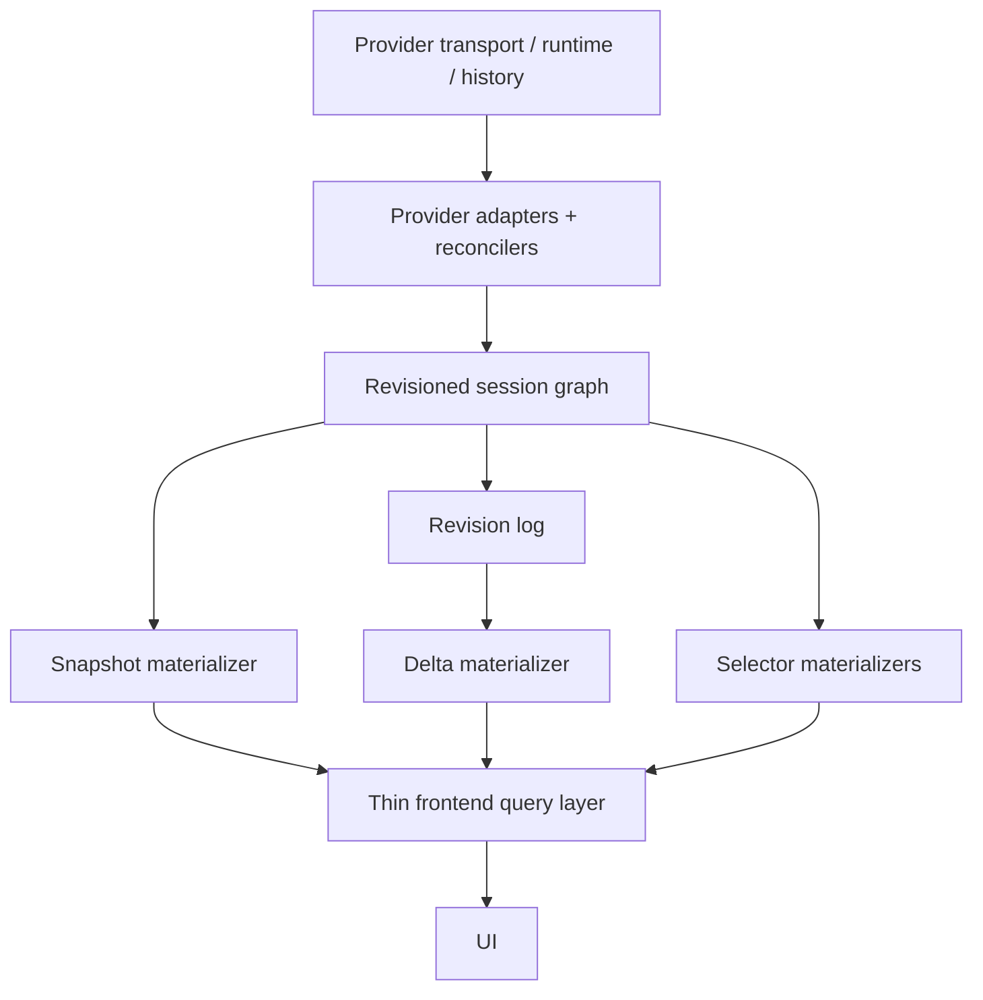
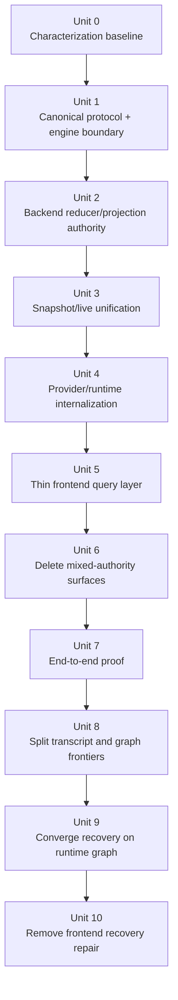

# refactor: revisioned session graph architecture

> Superseded by `docs/plans/2026-04-25-002-refactor-final-god-architecture-stack-plan.md`. This plan remains as historical graph-architecture research; the final GOD stack is the active endpoint. Session identity closure is documented in `docs/solutions/architectural/provider-owned-session-identity-2026-04-27.md`.

## Overview

Replace the remaining mixed-authority session architecture with **one backend-owned revisioned session graph** that carries **two explicit semantic frontiers**: a graph frontier for any canonical graph change, and a transcript frontier for transcript-bearing changes only.

That graph becomes the only product truth for:

- transcript,
- operations,
- interactions,
- lifecycle,
- capabilities,
- metadata,
- graph frontier,
- transcript frontier,
- and every user-visible session fact.

Provider/runtime traffic remains real, but it becomes **internal input**, not shared product state. The desktop consumes **materializations of the same graph**: a snapshot is the graph at graph frontier `G` and transcript frontier `T`; a delta is the graph change from `G` to `G+1`, with transcript lineage carried only when transcript state changed. Lifecycle and capabilities are not separate semantic authorities; they are fields inside the same canonical model.

## Problem Frame

Acepe is close to the right architecture, but not there yet.

Recent work established most of the right ingredients:

- backend-owned `SessionOpenResult`
- `openToken` and `last_event_seq`
- canonical transcript/projection/domain-event work
- agent-agnostic reconnect policy seams
- restore-time replay suppression that stabilizes reopened sessions

But the product still leaks transport/runtime semantics into shared desktop logic:

- some raw provider-flavored live updates still influence shared frontend paths;
- restore correctness still depends on compatibility seams that distinguish replay from live;
- snapshot/open and live/reconnect are still adjacent systems rather than one revisioned model;
- frontend stores still know too much about buffering, replay, bridging, and transport timing.

That is the deeper architectural smell: **transport is still too close to product truth**.

The clean end state is stricter:

1. A session opens from one canonical backend graph materialized at one coherent graph/transcript state.
2. Transcript continuity is validated against a transcript frontier, and graph continuity is validated against a graph frontier. The two are never cross-compared.
3. Live updates, reopen, reconnect, and explicit refresh all materialize from the same runtime-owned graph source.
4. Frontend renderers and stores never infer whether data is historical replay or live transport, and never repair missing semantics from guessed lifecycle state.
5. Provider quirks stop at adapters/runtime boundaries.

This is not speculative cleanup. The current product already needed a restore-specific replay suppression seam to stop reopened sessions from visibly re-streaming persisted history during reconnect. That fix stabilized the symptom, but it also proved the deeper issue: shared desktop code still has to understand transport timing and replay behavior to stay correct. The same architectural smell is visible in multiple places today: reconnect replay suppression in shared frontend code, operation/interaction live refresh via refetch instead of one authority path, transport-payload merging in `tool-call-manager.svelte.ts`, and lingering `sessionUpdate` semantic ownership beside canonical transcript/projection work. The latest reopened-panel failure makes the remaining gap concrete: the desktop compared transcript continuity against `delta.fromRevision.graphRevision`, triggered `acp_get_session_state(...)` on a false mismatch, then received a synthetic `idle` + empty-capabilities snapshot instead of runtime-owned live state. That corrupted the desktop lifecycle view, buffered live chunks as disconnected traffic, and dropped them later as orphaned pending events. The purpose of this plan is to remove that entire failure class at the authority boundary rather than keep adding smarter frontend accommodations.

This plan supersedes the narrower restore-focused cleanup and replaces it with the actual target architecture.

## Requirements Trace

### Canonical Graph Authority

- R1. Backend owns a single canonical session graph for transcript, operations, interactions, lifecycle, capabilities, metadata, and recovery state.
- R2. Every durable graph-state change advances one monotonic graph frontier.
- R3. Every transcript-bearing graph change advances a distinct monotonic transcript frontier.
- R4. Session open, restore, reconnect, explicit refresh, and crash recovery are all views over the same runtime-owned revisioned session graph rather than separate product paths.

### Revision and Delivery Model

- R5. A snapshot is the graph materialized at graph frontier `G` plus transcript frontier `T`, not a separate architecture.
- R6. A delta is the graph change from `G` to `G+1`, not a provider-shaped live event stream; transcript continuity is validated only against transcript lineage carried by the delta.
- R7. Lifecycle and capabilities are graph fields surfaced through selectors/materializations, not separate semantic authorities.
- R8. Provider/runtime replay or initialization traffic remains internal and never reaches shared desktop consumers as authoritative live state.

### Frontend Reduction and Provider Containment

- R9. Shared frontend code is reduced to orchestration, subscription, query selection, and user command routing; it no longer repairs protocol semantics, infers connection truth, or reconstructs missing semantics from transport timing.
- R10. Provider-specific behavior remains explicit and backend-owned inside adapters, reconcilers, runtime contracts, and capability declarations.

### Cross-Session Identity and Proof

- R11. Fresh sessions, restored sessions, externally-originated sessions, and reconnecting sessions share canonical identity and graph semantics.
- R12. Legacy mixed-authority surfaces (`ConvertedSession` open-time authority, raw `sessionUpdate` semantic ownership, frontend replay guards as correctness owners, graph-vs-transcript cross-comparison, and synthetic refresh snapshots) are deleted rather than preserved as fallback.
- R13a. End-to-end proof covers fresh session, restored session, reconnect during active tool execution, pending permission/question flows, and crash/recovery determinism.
- R13b. End-to-end proof covers explicit refresh after stale lineage and reopened-send flows without transcript loss, orphaned live chunks, or malformed assistant tails.
- R14. Persisted sessions created before the dual-frontier contract continue to open through the canonical engine with an explicit upgrade/default rule rather than silent schema breakage.

## Scope Boundaries

- In scope is the end-state session architecture across Rust/backend authority, frontend state consumption, and provider/runtime containment.
- In scope is defining and delivering a revisioned session-graph model over the existing ACP transport.
- In scope is unifying snapshot and live around one canonical graph plus distinct graph/transcript semantic frontiers.
- In scope is deleting restore/live compatibility seams whose only purpose is to survive leaked transport semantics.
- Not in scope is redesigning the visual shell of the agent panel or broader product UX unrelated to state authority.
- Not in scope is inventing a second transport stack; the existing ACP bridge remains the delivery mechanism.
- Not in scope is provider feature redesign unrelated to normalization, runtime contracts, or canonical state production.

### Deferred to Separate Tasks

- Performance tuning after the canonical state engine is correct.
- UX improvements that sit above the canonical state contract rather than shaping it, including renderer/reveal polish, panel affordance changes, and presentation-only workflow refinements. These are intentionally treated as parallelizable follow-ons, not hidden prerequisites for this refactor.
- Non-authoritative export/history utilities that may continue to use legacy conversion models after runtime/open authority has been deleted.

### Product Trade-offs

- While this refactor is active, new provider integrations, presentation-layer panel polish, and workflow affordances that do not change state authority are intentionally deferred.
- The plan prioritizes removing a recurring correctness and trust failure class in session state over short-term feature throughput in adjacent desktop UX areas.

## Context & Research

### Relevant Code and Patterns

- `docs/plans/2026-04-07-005-refactor-canonical-agent-runtime-journal-plan.md` remains the umbrella architectural predecessor: one runtime owner, many read-only projections, and one canonicalization path for live/replay/history.
- `packages/desktop/src-tauri/src/acp/session_open_snapshot/mod.rs` already proves the right backend-owned snapshot seam exists.
- `packages/desktop/src-tauri/src/acp/projections/mod.rs` and `packages/desktop/src-tauri/src/acp/transcript_projection/runtime.rs` already prove deterministic reducer/projection patterns exist in Rust; the remaining gap is to make them views over one graph/revision model instead of parallel semantic lanes.
- `packages/desktop/src-tauri/src/acp/event_hub.rs` already owns reservation, buffering, and `last_event_seq`-adjacent session sequencing concerns.
- `packages/desktop/src-tauri/src/acp/ui_event_dispatcher.rs` is still a key mixed-authority seam because transport-shaped updates and canonicalized outputs coexist.
- `packages/desktop/src-tauri/src/acp/reconciler/` already provides the right edge-normalization posture for provider semantics.
- `packages/desktop/src-tauri/src/acp/session_update_parser.rs` and `packages/desktop/src-tauri/src/acp/client_updates/mod.rs` are still on the live ingress path today, so the canonical engine cut must explicitly absorb or retire them rather than route around them.
- `packages/desktop/src-tauri/src/acp/client_loop.rs`, `packages/desktop/src-tauri/src/acp/client/session_lifecycle.rs`, and `packages/desktop/src-tauri/src/acp/client/replay_guard.rs` are where runtime/provider replay can be trapped before it becomes shared product state.
- `packages/desktop/src-tauri/src/acp/session_state_engine/protocol.rs` and `packages/desktop/src-tauri/src/acp/session_state_engine/bridge.rs` are the contract boundary that must encode separate graph and transcript lineage instead of one overloaded frontier.
- `packages/desktop/src-tauri/src/acp/commands/session_commands.rs` is the current query-time recovery seam; it must stop synthesizing idle/empty snapshots and instead materialize from the same runtime-owned graph source as live envelopes.
- `packages/desktop/src/lib/acp/session-state/session-state-query-service.ts` is the current desktop authority seam that still cross-compares transcript state with `graphRevision`.
- `packages/desktop/src/lib/acp/store/session-event-service.svelte.ts` and `packages/desktop/src/lib/acp/store/session-store.svelte.ts` are still too semantically heavy for the desired end state.
- `packages/desktop/src/lib/acp/store/services/tool-call-manager.svelte.ts` is the main frontend transport-payload merger today and therefore the concrete blocker to deleting `acp-session-update` as a frontend authority.
- `packages/desktop/src/lib/services/acp-types.ts` and `packages/desktop/src/lib/services/converted-session-types.ts` are both specta-generated today, but they still duplicate part of the shared ACP/session vocabulary. The end state should not require desktop code to choose between two generated semantic owners for the same concepts.
- `packages/desktop/src/lib/acp/store/services/transcript-snapshot-entry-adapter.ts`, `packages/desktop/src/lib/acp/application/dto/session-entry.ts`, `packages/desktop/src/lib/acp/types/thread-entry.ts`, and `packages/agent-panel-contract/src/agent-panel-conversation-model.ts` reveal a second split: transcript/session semantics are represented through multiple parallel entry models, some domain-facing and some presentation-facing. The canonical graph cut must leave only one semantic owner and make every other model a derived projection.
- `packages/desktop/src/lib/acp/store/session-entry-store.svelte.ts`, `packages/desktop/src/lib/acp/components/messages/assistant-message.svelte`, `packages/desktop/src/lib/acp/components/agent-panel/logic/virtualized-entry-display.ts`, and `packages/desktop/src/lib/acp/components/agent-panel/scene/desktop-agent-panel-scene.ts` show the current consequence of that split: renderer code still assumes repaired entry invariants such as `message.chunks` always existing instead of consuming one guaranteed canonical entry shape.
- `packages/desktop/src/lib/acp/store/session-connection-service.svelte.ts` and `packages/desktop/src/lib/acp/logic/session-ui-state.ts` already express the right runtime contract direction, but `packages/desktop/src/lib/acp/store/session-store.svelte.ts` and `packages/desktop/src/lib/acp/session-state/session-state-command-router.ts` still allow graph refresh to update hot state without fully reconciling the connection machine. That leaves the desktop with two competing authorities for "running" truth.
- `packages/desktop/src/lib/acp/logic/session-domain-event-subscriber.ts` and `packages/desktop/src/lib/acp/store/services/live-interaction-projection-sync.ts` prove the frontend can already consume typed backend-owned semantics when given the right contract.
- `packages/desktop/src/lib/components/main-app-view/logic/open-persisted-session.ts` and `packages/desktop/src/lib/acp/store/services/session-open-hydrator.ts` already establish the correct snapshot-first open posture.
- `docs/plans/2026-04-13-004-refactor-single-source-tauri-command-surface-plan.md` established the repo rule that new Tauri command surface area should be registry-first and generated, not expanded through ad hoc frontend invoke strings.
- `docs/plans/2026-04-16-001-refactor-canonical-session-open-model-plan.md` and `docs/plans/2026-04-18-001-refactor-canonical-live-acp-event-pipeline-plan.md` are direct predecessors: they moved authority inward but intentionally stopped short of the full final form.

### Institutional Learnings

- `docs/solutions/logic-errors/kanban-live-session-panel-sync-2026-04-02.md` — the durable rule is one runtime owner and many read-only projections; parallel owners create architectural bugs, not just local defects.
- `docs/solutions/logic-errors/operation-interaction-association-2026-04-07.md` — ownership beats clever matching; if a UI surface has to infer associations or replay identity, the domain boundary is wrong.
- `docs/solutions/best-practices/provider-owned-policy-and-identity-not-ui-projections-2026-04-09.md` — provider policy and identity must remain backend/provider contracts, not UI repair logic.
- `docs/solutions/architectural/provider-owned-semantic-tool-pipeline-2026-04-18.md` — semantic meaning belongs at provider reducers plus shared projectors, not in the UI.
- `docs/solutions/best-practices/deterministic-tool-call-reconciler-2026-04-18.md` — the product is more reliable when the UI renders deterministic semantics instead of inferring them.
- `docs/solutions/logic-errors/worktree-session-restore-2026-03-27.md` — restore bugs should be fixed at the earliest identity/state boundary.
- `docs/solutions/best-practices/reactive-state-async-callbacks-svelte-2026-04-15.md` — frontend async guards are valuable, but they should protect orchestration from staleness, not own correctness semantics.
- `docs/solutions/best-practices/autonomous-mode-as-rust-side-policy-hook-2026-04-11.md` — when session policy matters, Rust-side ownership is the durable fix; the frontend should render policy state, not enforce it in parallel.

### External References

- None. The repo already contains sufficient recent local patterns and architectural context.

## Key Technical Decisions

| Decision | Rationale |
|---|---|
| Create one backend-owned revisioned session graph as the sole product authority. | The root issue is not a missing guard; it is split authority between transport, runtime, and desktop state. |
| Treat provider/runtime traffic as internal ingress, not desktop-facing state. | Agent-agnostic architecture requires provider quirks to stop at the backend edge. |
| Treat `snapshot`, `delta`, `lifecycle`, and `capabilities` as materializations of one graph rather than first-class peer architectures. | The purest model is state-first: one graph, many views. |
| Make snapshot, live delta, reopen, reconnect claim, and explicit refresh outputs views over the same runtime-owned graph and revision model. | Restore and live correctness only truly unify when they share state shape, IDs, and authority source. |
| Use two semantic frontiers: graph frontier for any graph mutation, transcript frontier for transcript-bearing mutations only. | The reopened-panel bug proved that graph continuity and transcript continuity are different contracts and must never be cross-compared. |
| Treat `last_event_seq`, reservation state, and `openToken` as delivery/claim watermarks, not as a substitute for semantic graph or transcript lineage. | Delivery ordering and semantic continuity are related but not identical; overloading one into the other caused false refreshes. |
| Query-time refresh must materialize from the same runtime registry graph source as live envelopes. | `acp_get_session_state(...)` returning synthetic idle state created the corruption window; refresh cannot be a second authority. |
| Keep multiple read models, but drive them from one revisioned graph in Rust. | The product needs several selectors/materializations, but it does not need several semantic authorities. |
| Collapse duplicated generated TypeScript session-state vocabulary into one canonical generated surface. | A graph-first architecture is still split-brain if desktop consumers must choose between parallel specta outputs for the same semantic types. |
| Canonical runtime activity truth must be reconciled through the graph/materialization path, not left split between hot-state turn flags and the XState connection machine. | The stuck "Running command…" failure shows that UI lifecycle truth is still partially inferred from a parallel runtime owner. |
| Normalize legacy or malformed session-entry invariants at the canonical adapter/store boundary rather than treating panel renderers as correctness owners. | Renderer crashes from missing `message.chunks` are evidence that the canonical entry boundary is still too weak; the UI should consume proven invariants and only keep light defense-in-depth. |
| Presentation-layer conversation models may remain, but they must be projections of one semantic session-entry contract rather than an independent authority lane. | Shared UI components need display-oriented DTOs, but those DTOs must not become a second place where transcript semantics are invented, repaired, or widened. |
| Graph frontier is the only continuity contract for non-transcript state. | Operations, interactions, lifecycle, capabilities, and metadata all mutate only through the graph reducer path; transcript is the only partial-apply lane that needs its own continuity frontier. |
| Persisted snapshots act as revision-compaction anchors. | Revision growth is an architectural concern, not a later optimization; long-running sessions cannot require unbounded in-memory delta history. |
| Persist canonical snapshots at stable checkpoints and trim older deltas behind the newest anchor. | The retention policy should persist at turn completion and session close/disconnect, retain only post-anchor deltas, and trigger a background checkpoint once retained delta depth crosses a configurable threshold that is calibrated during implementation rather than hard-coded into the architecture. |
| Background compaction must coordinate with live reducer progress before trimming deltas behind a new anchor. | Compaction is part of correctness, not just performance; the engine needs an explicit trim-boundary handoff so a durable checkpoint cannot race ahead of in-flight graph mutations. |
| If a reconnect or refresh request arrives with stale or invalid lineage, the engine falls back to fresh snapshot materialization instead of guessing a continuation. | Recovery correctness matters more than forcing delta replay across stale or invalid lineage. |
| Preserve instant open/restore as an architectural property by reusing persisted canonical snapshot components rather than replaying full history on demand. | `SessionOpenResult` already reads stored transcript/projection state today; the goal architecture should strengthen that property, not trade it away and hope to optimize later. |
| Shrink frontend stores into query/orchestration layers instead of business-logic owners. | Shared Svelte code should render and route, not repair protocol behavior, connection truth, or transcript identity. |
| Any new desktop command surface required by this architecture must follow the single-source Tauri command registry pattern. | The repo already learned that duplicated command declarations create silent runtime drift. |
| Delete compatibility paths after proof instead of preserving fallback coexistence. | A fallback that can still mutate desktop state from raw replay preserves the architectural smell. |
| Clean replacement architecture takes precedence over migration comfort. | The user explicitly asked for the final form, not another transitional plan. |

## Open Questions

### Resolved During Planning

- **Is this still a restore-focused plan?** No. Restore is one manifestation of the broader session-state architecture problem.
- **Should the final architecture still let raw provider updates shape shared UI state?** No.
- **Should the frontend distinguish replay from live after snapshot apply?** No. That distinction belongs behind backend/runtime boundaries.
- **Should the end state preserve additive coexistence between raw updates and canonical events?** No. Canonical product state must become the only authority.
- **Does this require Copilot-specific logic?** No. Provider-specific behavior remains allowed only inside provider/runtime seams.
- **Should snapshot and live be modeled separately?** No. They are different materializations of the same revisioned graph.
- **Should transcript and graph share one frontier?** No. Transcript continuity and graph continuity are different contracts and must be represented separately.
- **Is `last_event_seq` the semantic session frontier?** No. It is a delivery/claim watermark, not a substitute for graph or transcript lineage.
- **Should `acp_get_session_state(...)` be allowed to synthesize `idle` lifecycle and empty capabilities for an active runtime?** No. Query-time refresh must materialize from runtime-owned graph state.
- **Is graph frontier sufficient for non-transcript continuity?** Yes. Operations, interactions, lifecycle, capabilities, and metadata are graph-owned and mutate only through the reducer path; transcript is the only lane that can validly no-op while other graph state advances.
- **Can existing projection modules simply be promoted into the final graph layer without a new graph boundary?** No. They already prove reducer/projection patterns, but they do not yet provide one graph identity, one revision model, or one place where lifecycle/capabilities/frontier semantics become product truth.
- **How does the plan preserve instant snapshot open/restore?** By continuing to read persisted canonical snapshot components at open time; the engine does not replay full historical streams synchronously just to build `SessionOpenResult`.
- **What is the boundary between `protocol.rs` and `envelope.rs`?** `protocol.rs` owns the semantic vocabulary and payload contracts; `envelope.rs` owns the bridge/wire container that carries those payloads to the desktop.
- **Is the desktop protocol one stream or several?** Conceptually it is one revisioned graph. Delivery may still use several payload families, but they are only transport/materialization choices over the same graph and shared envelope.
- **Which legacy consumers are exempt from the `ConvertedSession` cleanup?** Only explicitly non-authoritative export/history utilities are exempt. Product-state authorities such as open, restore, reconnect, and live desktop state are not exempt.
- **Should the canonical desktop protocol be documented as a stable internal contract?** Yes. It should be documented for future contributors and provider/runtime work as an internal architectural contract even though it is not a public external API.
- **Should `acp-types.ts` and `converted-session-types.ts` continue as parallel generated semantic sources for shared session/runtime vocabulary?** No. The architecture should converge on one canonical generated session-state vocabulary, with any remaining secondary file reduced to a derived compatibility surface or deleted.
- **Should runtime "running" truth remain split between hot-state turn flags and the XState connection machine after the graph cut?** No. Canonical graph/materialization updates must reconcile the runtime machine so activity truth is not inferred from two competing authorities.
- **Should malformed assistant/session entry invariants such as missing `message.chunks` be solved primarily inside panel renderers?** No. The canonical session-entry boundary should normalize or reject invalid shapes first, with renderer guards treated as defense-in-depth rather than correctness owners.
- **When older persisted snapshots lack `transcript_revision`, what is the canonical upgrade rule?** Treat them as pre-dual-frontier snapshots and derive the initial transcript frontier from persisted transcript state at load time; if derivation cannot be made coherent, force a fresh canonical snapshot on first reconnect rather than silently defaulting to zero.

### Deferred to Implementation

- **Exact Rust module file names inside the new session-state engine** — the listed semantic boundaries are fixed, but final filenames may vary if implementation ergonomics require a different split.

## Alternative Approaches Considered

| Approach | Why not chosen |
|---|---|
| Keep the current restore fix and stop there. | That solves one symptom while preserving transport leakage into shared product state. |
| Keep one semantic frontier and just make refresh smarter. | The root bug is cross-comparing different semantic axes; better refresh logic cannot make a single frontier represent both correctly. |
| Make `transcript_revision` nullable or event-local only for transcript deltas. | The cleaner contract is an always-present transcript frontier on every graph revision; state frontiers should describe current canonical state, not depend on event-type-specific null handling. |
| Continue thinning the frontend incrementally without defining a new canonical session engine. | File moves alone do not remove split authority. |
| Make the frontend the canonical reducer and keep Rust as a bridge. | This conflicts with existing backend ownership of frontier, reservations, snapshots, and provider/runtime contracts. |
| Keep raw `sessionUpdate` and canonical events as permanent dual inputs. | That institutionalizes mixed authority. |
| Promote the existing `acp/projections/mod.rs` + `transcript_projection/runtime.rs` pair to final authority without introducing an explicit graph boundary. | Those modules prove reducer patterns, but they do not yet define one graph identity, one revision model, or one place where lifecycle/capabilities/frontier semantics become canonical product truth. |
| Rebuild state from provider replay on reopen instead of trusting canonical snapshots. | That throws away the strongest architectural work Acepe already landed. |

## Output Structure

```text
packages/desktop/src-tauri/src/acp/session_state_engine/
  mod.rs
  graph.rs
  revision.rs
  selectors.rs
  protocol.rs
  envelope.rs
  reducer.rs
  snapshot_builder.rs
  bridge.rs
  frontier.rs
  runtime_registry.rs

packages/desktop/src/lib/acp/session-state/
  session-state-protocol.ts
  session-state-query-service.ts
  session-state-command-router.ts
```

The new engine files are intended to **absorb and supersede** adjacent authority in existing modules, not coexist as a second permanent architecture. During implementation, `acp/projections/mod.rs`, `acp/event_hub.rs`, `acp/session_open_snapshot/mod.rs`, and related seams become implementation details or cleanup targets behind the canonical graph boundary.

## High-Level Technical Design

> *This illustrates the intended approach and is directional guidance for review, not implementation specification. The implementing agent should treat it as context, not code to reproduce.*



```text
provider/runtime ingress
  -> normalize once at adapter edge
  -> emit canonical graph input
  -> reduce into revisioned session graph
  -> advance graph frontier
  -> advance transcript frontier only when transcript state changed
  -> materialize any needed view:
       - snapshot at graph frontier G / transcript frontier T
       - delta from G to G+1 with transcript lineage when present
       - selectors for lifecycle/capabilities/render state

frontend
  -> hydrate from graph snapshot
  -> subscribe to later graph changes/materializations
  -> query derived selectors for rendering
  -> route user commands back to backend
```

## Phased Delivery

### Phase 1: Graph and revision model

- Define the canonical session graph boundary and revision model.
- Stop treating transport-shaped events or delivery families as shared product state.

### Phase 2: Backend graph authority cut

- Route provider/runtime ingress through one canonical graph reducer pipeline.
- Make snapshot and live outputs come from the same graph and recovery authority.
- Deliver the first meaningful user-visible win here: after Unit 3, restored sessions and reconnects no longer depend on raw provider replay to stay visually correct.

### Phase 3: Frontend thinning and deletion

- Replace heavy frontend merge/replay logic with query/subscription layers.
- Delete compatibility seams once Unit 0-5 graph-authority gates are green, then run the final end-to-end confirmation pass.

### Phase 4: Frontier split and recovery-path convergence

- Separate transcript lineage from graph lineage on the canonical contract.
- Make query-time refresh materialize from the same runtime-owned graph source as live envelopes.
- Remove any remaining desktop repair logic that guesses disconnect state or drops live chunks during canonical recovery.
- This phase closes the concrete failure described in Problem Frame: the desktop must stop cross-comparing transcript continuity against graph revision, and refresh must stop synthesizing `idle` + empty-capabilities snapshots for active runtimes.
- Until Units 8-10 land, the concrete reopened-panel corruption described in Problem Frame remains a known live defect even if earlier architectural groundwork is complete.

**Phase mapping:** Phase 1 = Units 0-1; Phase 2 = Units 2-4; Phase 3 = Units 5-7; Phase 4 = Units 8-10.

## Execution Posture

- Execute on `main` directly for this workstream by explicit user request. Keep edits surgical and avoid unrelated dirty-worktree files.
- Treat the unit dependency chain as authoritative for semantic sequencing: Unit 0 -> 1 -> 2 -> 3 -> 4 -> 5 -> 6 -> 7 -> 8 -> 9 -> 10 still governs architecture delivery.
- Parallelize only where file ownership and semantic dependencies are independent. In practice, that means parallel work should happen **inside** a unit or phase slice, not by skipping ahead across dependent units.
- If two candidate slices modify the same file, touch the same authority seam, or depend on the same not-yet-landed protocol/reducer contract, run them serially.
- The default safe parallelization posture for this plan is:
  - Unit 0: parallelize characterization additions across independent frontend and Rust test files.
  - Unit 1: parallelize graph-contract type work between Rust engine files and TypeScript protocol mirrors, then reconcile through shared contract tests.
  - Units 2-4: mostly serial, because reducer, frontier, snapshot/live, and runtime containment all share the same backend authority seam.
  - Unit 5: parallelize thin-query extraction vs. consumer adoption only when slices do not overlap on the same store/service file.
  - Units 6-7: mostly serial, because cleanup and end-to-end proof are verification-gated.
  - Unit 8: parallelize Rust contract work vs. TypeScript protocol/query updates only after the dual-frontier wire contract is fixed.
  - Units 9-10: serial, because recovery-path convergence and frontend repair deletion share the same canonical recovery seam.
- Before dispatching parallel work, build a file-to-slice map and downgrade to serial execution for any overlap.

## Parallel Execution Batches

### Batch A - Unit 0 characterization

- Slice A1: `session-connection-manager.test.ts`
- Slice A2: `session-event-service.test.ts`
- Slice A3: `src-tauri/src/acp/commands/tests.rs`

These slices may run in parallel because they are test-only and target separate files. Reconcile them before moving to Unit 1.

### Batch B - Unit 1 graph contract

- Slice B1: Rust graph/revision/protocol/envelope/selectors skeleton in `session_state_engine/` plus `acp/mod.rs`
- Slice B2: TypeScript protocol mirrors in `acp-types.ts` and `session-state-protocol.ts`
- Slice B3: Contract tests in Rust and TypeScript

Slices B1 and B2 may run in parallel if they align on one shared contract shape first; Slice B3 runs after both land.

### Batch C - Unit 5 frontend thinning

- Slice C1: query/router extraction in `session-state-query-service.ts` and `session-state-command-router.ts`
- Slice C2: store/orchestration adoption in `session-store.svelte.ts`, `session-event-service.svelte.ts`, and `session-connection-manager.ts`
- Slice C3: `tool-call-manager.svelte.ts` authority transfer

Only run C1 in parallel with one other slice if file overlap is zero. C2 and C3 should be treated as serial if both need `session-event-service`-adjacent semantics at the same time.

### Batch D - Unit 8 dual-frontier contract

- Slice D1: Rust lineage contract updates in `session_state_engine/protocol.rs`, `session_state_engine/bridge.rs`, `session_state_engine/runtime_registry.rs`, and command tests
- Slice D2: TypeScript protocol/query updates in `acp-types.ts`, `session-state-protocol.ts`, and `session-state-query-service.ts`

Begin Unit 8 with one shared, non-parallel contract checkpoint: define and type-check the dual-frontier wire shape in `revision.rs` + `protocol.rs`, including the always-present `transcript_revision` field and constructor updates. Once that contract compiles cleanly, D1 (Rust wiring) and D2 (TypeScript mirrors) may run in parallel. Integrate through shared contract tests before starting Unit 9.



## Success Metrics

- Restored sessions paint the persisted thread immediately with no visible replay artifacts while reconnect attaches. *(satisfied: Unit 3)*
- Reconnect during active tool execution or pending permission/question flow never duplicates transcript rows or loses the in-flight canonical operation/interaction state. *(partially satisfied: Unit 7; transcript-lineage correctness closes in Unit 9)*
- Given the same raw provider event sequence and the same persisted session record, the graph yields identical thread, tool, interaction, runtime, and telemetry state whether the session is fresh, restored, reconnecting, or crash-recovered. *(satisfied: Unit 9)*
- Open and restore materialize from persisted canonical snapshot components without replaying full historical revision streams, preserving the current instant-open property. *(satisfied: Unit 3)*
- Shared frontend code no longer contains replay-classification or transport-repair logic as correctness owners. *(satisfied: Unit 10)*
- Provider reconnect or initialization behavior can evolve internally without requiring shared desktop-store changes. *(satisfied: Unit 10)*
- Interim milestone: by the end of Unit 3, reconnect correctness no longer depends on raw provider replay reaching shared desktop state, but the transcript/graph frontier mismatch described in Problem Frame remains open until Unit 9.
- Reopened sessions accept a new user send immediately, retain prior history while the response streams, and never corrupt the canonical assistant tail because refresh and live state now come from the same runtime-owned graph authority. *(satisfied: Unit 10)*

## Implementation Units

- [x] **Unit 0: Characterize current end-state invariants**

**Goal:** Lock down the user-visible and architectural invariants the final architecture must preserve while authority moves inward.

**Requirements:** R2, R4, R10

**Dependencies:** None

**Files:**
- Test: `packages/desktop/src/lib/acp/store/services/session-connection-manager.test.ts`
- Test: `packages/desktop/src/lib/acp/store/session-event-service.test.ts`
- Test: `packages/desktop/src-tauri/src/acp/commands/tests.rs`

**Approach:**
- Capture the current snapshot-first, post-frontier, no-duplicate invariants as characterization coverage before deleting compatibility seams.
- Focus on observable behavior, not current implementation shape.
- Keep Unit 0 test-only so the baseline describes pre-refactor behavior rather than a partially modified intermediate state.

**Execution note:** Start with failing characterization coverage for restore/reconnect and active-work recovery paths.

**Patterns to follow:**
- `docs/plans/2026-04-18-001-refactor-canonical-live-acp-event-pipeline-plan.md`
- existing connection-manager and session-event-service test organization

**Test scenarios:**
- Happy path: restored session paints full persisted thread immediately, then reconnect adds only new canonical state.
- Integration: reconnect during an active tool call preserves one in-progress operation and does not duplicate transcript rows.
- Integration: pending permission/question flow remains answerable exactly once after reopen/reconnect.
- Error path: reconnect failure leaves restored snapshot intact and surfaces lifecycle failure without clearing canonical state.

**Verification:**
- The architecture has a behavioral safety net that proves the current user-visible invariants before deeper replacement begins.

- [x] **Unit 1: Define the canonical session graph and revision model**

**Goal:** Define the backend-owned session graph, revision model, and the minimal delivery/materialization contract derived from them.

**Requirements:** R1, R2, R3, R4, R5, R6, R7

**Dependencies:** Unit 0

**Files:**
- Create: `packages/desktop/src-tauri/src/acp/session_state_engine/mod.rs`
- Create: `packages/desktop/src-tauri/src/acp/session_state_engine/graph.rs`
- Create: `packages/desktop/src-tauri/src/acp/session_state_engine/revision.rs`
- Create: `packages/desktop/src-tauri/src/acp/session_state_engine/selectors.rs`
- Create: `packages/desktop/src-tauri/src/acp/session_state_engine/protocol.rs`
- Create: `packages/desktop/src-tauri/src/acp/session_state_engine/envelope.rs`
- Modify: `packages/desktop/src-tauri/src/acp/mod.rs`
- Regenerate: `packages/desktop/src/lib/services/acp-types.ts`
- Regenerate: `packages/desktop/src/lib/services/converted-session-types.ts`
- Create: `packages/desktop/src/lib/acp/session-state/session-state-protocol.ts`
- Test: `packages/desktop/src-tauri/src/acp/commands/tests.rs`
- Test: `packages/desktop/src/lib/services/acp-types.test.ts`

**Approach:**
- Define the canonical graph shape and revision semantics first.
- Define `snapshot`, `delta`, lifecycle, and capabilities as materializations/selectors over that graph rather than parallel semantic lanes.
- Keep protocol/envelope types as delivery details derived from the graph/revision model so the transport shape stays subordinate to product truth.
- Collapse the duplicated generated TypeScript vocabulary for session/runtime state as part of the contract cut so there is one canonical generated semantic surface for shared desktop consumers.
- Treat the TypeScript files above as specta outputs, not hand-edited sources: change the Rust-side contract/export inputs first, then regenerate the TS surface from that updated source of truth.
- If new Tauri commands or exports are needed, add them through the registry-first command surface pattern rather than new handwritten invoke strings.
- Assign the graph-contract documentation here so contributors have one canonical description of the model as soon as the boundary exists.

**Patterns to follow:**
- `packages/desktop/src-tauri/src/acp/domain_events.rs`
- `packages/desktop/src/lib/acp/logic/session-domain-event-subscriber.ts`
- `packages/desktop/src-tauri/src/acp/session_open_snapshot/mod.rs`
- `docs/plans/2026-04-13-004-refactor-single-source-tauri-command-surface-plan.md`

**Test scenarios:**
- Happy path: graph and revision types can represent open snapshot, post-frontier change, lifecycle state, and capabilities without provider-specific fields leaking into shared types.
- Edge case: protocol supports restored, fresh, and externally-originated session identity without changing frontend session key semantics.
- Error path: lifecycle failure payload remains separate from content/delta payloads and does not require desktop fallback content reconstruction.

**Verification:**
- The repo has one explicit contract for product-facing session state rather than multiple implicit event families.

- [x] **Unit 2: Build backend graph reducer and selector authority**

**Goal:** Route provider/runtime ingress through one backend graph reducer and selector engine.

**Requirements:** R1, R2, R5, R6, R7, R9, R10

**Dependencies:** Unit 1

**Files:**
- Create: `packages/desktop/src-tauri/src/acp/session_state_engine/reducer.rs`
- Create: `packages/desktop/src-tauri/src/acp/session_state_engine/frontier.rs`
- Create: `packages/desktop/src-tauri/src/acp/session_state_engine/runtime_registry.rs`
- Modify: `packages/desktop/src-tauri/src/acp/session_update_parser.rs`
- Modify: `packages/desktop/src-tauri/src/acp/client_updates/mod.rs`
- Modify: `packages/desktop/src-tauri/src/acp/reconciler/mod.rs`
- Modify: `packages/desktop/src-tauri/src/acp/projections/mod.rs`
- Modify: `packages/desktop/src-tauri/src/acp/transcript_projection/runtime.rs`
- Modify: `packages/desktop/src-tauri/src/acp/event_hub.rs`
- Test: `packages/desktop/src-tauri/src/acp/projections/mod.rs`
- Test: `packages/desktop/src-tauri/src/acp/transcript_projection/runtime.rs`
- Test: `packages/desktop/src-tauri/src/acp/event_hub.rs`

**Approach:**
- Feed transcript, runtime, operations, interactions, and telemetry selectors from one canonical graph reducer entrypoint.
- Make frontier ownership explicit inside the engine so downstream consumers never infer ordering from transport-shaped events.
- Absorb the current `session_update_parser.rs` / `client_updates/mod.rs` ingress path into the canonical engine entrypoint so provider updates cannot bypass the reducer.
- Existing `acp/projections/mod.rs` and transcript projection runtime become implementation details or compatibility façades until Unit 6 removes the old authority path.

**Patterns to follow:**
- existing Rust projection registries and reducer tests
- `packages/desktop/src-tauri/src/acp/reconciler/`

**Test scenarios:**
- Happy path: provider-normalized ingress updates all relevant projections through one reducer path.
- Edge case: out-of-order or duplicate provider ingress does not create duplicate canonical state when semantic frontier rules are applied.
- Integration: event-hub buffering and reservation claim honor the canonical frontier and publish only post-frontier outputs.
- Error path: malformed or unsupported provider ingress fails at adapter/reconciler boundaries instead of producing partially authoritative desktop state.
- Error path: non-monotonic sequence input is rejected as a delta continuation candidate and forces snapshot recovery rather than silent graph corruption.

**Verification:**
- Rust has one canonical state engine path that owns semantic sequencing and projection updates.

- [x] **Unit 3: Unify snapshot and live over the same revisioned graph**

**Goal:** Make open snapshots and live deltas two materializations of the same graph and revision frontier.

**Requirements:** R3, R4, R5, R6, R14

**Dependencies:** Unit 2

**Files:**
- Create: `packages/desktop/src-tauri/src/acp/session_state_engine/snapshot_builder.rs`
- Create: `packages/desktop/src-tauri/src/acp/session_state_engine/bridge.rs`
- Modify: `packages/desktop/src-tauri/src/acp/session_open_snapshot/mod.rs`
- Modify: `packages/desktop/src-tauri/src/acp/commands/session_commands.rs`
- Modify: `packages/desktop/src-tauri/src/history/commands/session_loading.rs`
- Modify: `packages/desktop/src-tauri/src/acp/ui_event_dispatcher.rs`
- Test: `packages/desktop/src-tauri/src/acp/commands/session_commands.rs`
- Test: `packages/desktop/src-tauri/src/history/commands/session_loading.rs`

**Approach:**
- Make `SessionOpenResult` serialization come from the same graph/revision model used for live changes.
- Ensure reconnect claim/attach publishes only engine outputs newer than the snapshot frontier.
- Preserve instant open/restore by building snapshots from persisted canonical snapshot components and projection state, not by replaying full historical event streams on demand.
- `snapshot_builder.rs` owns graph snapshot assembly, while `session_open_snapshot/mod.rs` becomes the open-result serialization seam and `bridge.rs` owns desktop-facing post-frontier materialization delivery.
- Keep Unit 3 edits to `session_commands.rs` limited to snapshot/open/restore materialization call sites; query-time refresh authority remains intentionally deferred to Unit 9.
- Replace authoritative `session_converter` open-time call sites in `history/commands/session_loading.rs` here so Unit 6 only has residual cleanup left to delete.
- If a reconnect frontier predates retained revisions, emit a fresh snapshot materialization instead of an error or partial delta replay.
- Snapshot persistence doubles as revision compaction so retained delta history remains bounded behind the latest stable snapshot anchor.
- The compaction policy is: persist a canonical snapshot at turn completion and session close/disconnect, retain only deltas newer than the latest persisted anchor, and trigger a background checkpoint once retained delta depth crosses a configurable threshold calibrated during implementation.
- Background compaction must freeze the trim boundary against live reducer progress until the new snapshot anchor is durable so retained deltas cannot be trimmed past an in-flight mutation.

**Patterns to follow:**
- `packages/desktop/src-tauri/src/acp/session_open_snapshot/mod.rs`
- `packages/desktop/src-tauri/src/acp/event_hub.rs`

**Test scenarios:**
- Happy path: fresh session creation and restored open both hydrate from engine-built snapshots with matching identity/state semantics.
- Integration: reconnect after snapshot apply emits only deltas newer than `last_event_seq`.
- Edge case: crash/recovery rebuilds the same canonical snapshot as a clean reopen from the same persisted inputs.
- Edge case: reconnect with a stale frontier older than retained revisions falls back to a fresh snapshot instead of replaying an incomplete delta window.
- Integration: open/restore reads persisted canonical snapshot components directly and does not replay full historical revision streams to rebuild `SessionOpenResult`.
- Error path: missing or invalid session-open state returns explicit open failure without falling back to transport-driven reconstruction.

**Verification:**
- Snapshot/live parity becomes an actual property of the backend architecture rather than a convention.

- [x] **Unit 4: Internalize provider/runtime transport semantics**

**Goal:** Keep replay, initialization, and provider transport quirks fully behind backend/runtime seams.

**Requirements:** R4, R5, R7, R8, R10

**Dependencies:** Unit 3

**Files:**
- Modify: `packages/desktop/src-tauri/src/acp/client_loop.rs`
- Modify: `packages/desktop/src-tauri/src/acp/client/session_lifecycle.rs`
- Modify: `packages/desktop/src-tauri/src/acp/client/replay_guard.rs`
- Modify: `packages/desktop/src-tauri/src/acp/client/state.rs`
- Modify: `packages/desktop/src-tauri/src/acp/client_updates/reconciler.rs`
- Modify: `packages/desktop/src-tauri/src/acp/providers/mod.rs`
- Modify: `packages/desktop/src-tauri/src/acp/providers/claude_code.rs`
- Modify: `packages/desktop/src-tauri/src/acp/providers/cursor.rs`
- Modify: `packages/desktop/src-tauri/src/acp/provider.rs`
- Test: `packages/desktop/src-tauri/src/acp/client/replay_guard.rs`
- Test: `packages/desktop/src-tauri/src/acp/commands/tests.rs`

**Approach:**
- Move replay-window and attach-state correctness into backend/runtime coordination, keyed to canonical frontier semantics.
- Preserve provider-specific reconnect/init behavior where necessary, but prevent it from escaping as desktop-facing state authority.
- Absorb `client_updates/reconciler.rs` into the provider/runtime normalization boundary so it cannot remain a second semantic authority beside the canonical engine.
- Update provider-owned history/runtime files directly where open-time `session_converter` or transport-era behavior still leaks across the shared boundary.

**Patterns to follow:**
- existing provider-owned reconnect policy seams
- `docs/solutions/best-practices/provider-owned-policy-and-identity-not-ui-projections-2026-04-09.md`

**Test scenarios:**
- Happy path: provider init/replay traffic may occur internally while the desktop receives only canonical post-frontier outputs.
- Edge case: providers with different reconnect verbs or replay behaviors still satisfy the same desktop-facing contract.
- Integration: concurrent reconnect and buffered-event claim do not leak sub-frontier replay into shared outputs.
- Integration: monotonic frontier guarantees hold across reconnect, crash recovery, and externally-originated session reopen flows; invalid frontier transitions trigger snapshot fallback rather than silent continuation.
- Error path: provider attach failure emits lifecycle failure without partial replay mutating canonical desktop state.

**Verification:**
- Provider/runtime differences are contained to backend seams and no longer force shared frontend accommodations.

- [x] **Unit 5: Replace heavy frontend stores with thin graph query layers**

**Goal:** Convert shared frontend state handling from merge/repair ownership into subscription/query/orchestration.

**Requirements:** R6, R8, R9, R10

**Dependencies:** Unit 4

**Files:**
- Create: `packages/desktop/src/lib/acp/session-state/session-state-query-service.ts`
- Create: `packages/desktop/src/lib/acp/session-state/session-state-command-router.ts`
- Modify: `packages/desktop/src/lib/acp/store/session-store.svelte.ts`
- Modify: `packages/desktop/src/lib/acp/store/session-event-service.svelte.ts`
- Modify: `packages/desktop/src/lib/acp/store/session-connection-service.svelte.ts`
- Modify: `packages/desktop/src/lib/acp/logic/session-ui-state.ts`
- Modify: `packages/desktop/src/lib/acp/store/services/tool-call-manager.svelte.ts`
- Modify: `packages/desktop/src/lib/acp/store/services/session-open-hydrator.ts`
- Modify: `packages/desktop/src/lib/acp/store/services/session-connection-manager.ts`
- Modify: `packages/desktop/src/lib/acp/logic/event-subscriber.ts`
- Modify: `packages/desktop/src/lib/acp/logic/session-domain-event-subscriber.ts`
- Test: `packages/desktop/src/lib/acp/store/session-store.test.ts`
- Test: `packages/desktop/src/lib/acp/store/session-event-service.test.ts`
- Test: `packages/desktop/src/lib/acp/store/services/session-open-hydrator.test.ts`
- Test: `packages/desktop/src/lib/acp/store/__tests__/session-store-projection-state.vitest.ts`

**Approach:**
- Keep the frontend responsible for panel/session orchestration, command routing, and rendering queries, but remove transport repair and replay-classification ownership.
- Prefer subscribing to graph materializations and deriving render state from query selectors.
- Reconcile canonical graph/materialization updates into the runtime machine so `SessionRuntimeState` becomes the single shared answer for running/idle/ready truth instead of an overlay on top of partially independent hot-state flags.
- Thin `tool-call-manager.svelte.ts` in place so it no longer owns transport-payload merge authority; by the end of this unit it is either a graph-backed adapter or trivial glue awaiting deletion in Unit 6.

**Patterns to follow:**
- existing hydrator orchestration
- `packages/desktop/src/lib/acp/store/services/live-interaction-projection-sync.ts`

**Test scenarios:**
- Happy path: frontend hydrates from canonical snapshot and renders later canonical deltas without replay-specific branching.
- Edge case: stale async completions are ignored by orchestration guards without changing canonical state semantics.
- Integration: lifecycle/capabilities updates continue to drive UI readiness and controls without requiring content fallback logic.
- Error path: lifecycle failure does not clear or reconstruct content from raw transport events.

**Verification:**
- Shared frontend code becomes a thin consumer of canonical state rather than a repair engine.

- [x] **Unit 6: Delete mixed-authority surfaces**

**Goal:** Remove legacy open/live authorities and compatibility seams once canonical ownership is proven.

**Requirements:** R8, R10, R11, R12, R14

**Dependencies:** Unit 5

**Files:**
- Modify: `packages/desktop/src-tauri/src/acp/ui_event_dispatcher.rs`
- Modify: `packages/desktop/src-tauri/src/acp/domain_events.rs`
- Modify: `packages/desktop/src-tauri/src/history/commands/session_loading.rs`
- Modify: `packages/desktop/src-tauri/src/acp/projections/mod.rs`
- Modify: `packages/desktop/src-tauri/src/acp/transcript_projection/runtime.rs`
- Modify: `packages/desktop/src/lib/acp/store/services/transcript-snapshot-entry-adapter.ts`
- Modify: `packages/desktop/src/lib/acp/types/thread-entry.ts`
- Modify: `packages/agent-panel-contract/src/agent-panel-conversation-model.ts`
- Modify: `packages/desktop/src-tauri/src/session_converter/`
- Modify: `packages/desktop/src-tauri/src/session_jsonl/commands.rs`
- Modify: `packages/desktop/src-tauri/src/session_jsonl/export_types.rs`
- Test: `packages/desktop/src-tauri/src/acp/commands/tests.rs`
- Test: `packages/desktop/src/lib/acp/store/session-event-service.test.ts`

**Approach:**
- Delete raw transport/state bridge paths and frontend compatibility shims that are no longer authoritative.
- Keep non-authoritative export/history paths only if they remain cleanly outside the product-state engine.
- Delete any remaining `session_loading.rs` fallback or compatibility logic that survived Unit 3's canonical cut, while preserving explicitly non-authoritative export/history utilities only when they are cleanly outside the product-state engine.
- Delete `ConvertedSession` open-time and product-state authority usages, not necessarily every export/history utility module that still reads legacy conversion shapes for non-authoritative purposes.
- Remove or demote the remaining pre-graph projection modules so they cannot continue acting as shadow semantic owners once the canonical engine is in place.
- Retire parallel semantic entry ownership where it only exists to bridge transport-era shapes; any surviving entry or conversation models must become clearly derived presentation contracts rather than alternative semantic sources.
- Limit `session_jsonl/commands.rs` and `session_jsonl/export_types.rs` changes to removing any remaining product-state authority claims or call sites; do not redesign export type shapes or pull explicit export workflows into scope.

**Execution note:** Treat deletion as gated by successful Unit 0-5 verification and Unit 6 integration scenarios; Unit 7 is the final end-to-end confirmation pass after cleanup lands.

**Deletion gate checklist:** Do not begin Unit 6 deletion until all of the following are true:
- Unit 0 characterization scenarios are green for restored open, reconnect during active tool execution, pending permission/question survival, and reconnect failure preserving canonical state.
- Unit 3 snapshot/live parity scenarios are green, including stale-frontier snapshot fallback and crash/recovery rebuild.
- Unit 4 provider/runtime containment scenarios are green, including replay-active suppression and provider-neutral reconnect behavior.
- Unit 5 graph-query consumer scenarios are green, including lifecycle/capability-driven UI readiness without raw transport fallback logic.
- The desktop can consume canonical `acp-session-state` as the only shared session-state lane before any raw update compatibility path is deleted.
- Any refresh-path semantic repair remains protected until Unit 9 proves `acp_get_session_state(...)` returns runtime-owned lifecycle/capability state for active sessions rather than a synthetic idle/empty placeholder.

**Patterns to follow:**
- completed cleanup posture from prior canonical open/live plans

**Test scenarios:**
- Integration: no desktop-facing flow can mutate shared state from raw provider replay after snapshot apply.
- Edge case: older persisted sessions still open through the canonical engine without needing legacy open-time authority.
- Error path: cleanup does not remove explicit failure surfaces for missing/open/connect errors.

**Verification:**
- The mixed-authority architecture no longer exists in shared product paths.

- [x] **Unit 7: Prove deterministic end-to-end core session flows**

**Goal:** Prove the final architecture across the core product-critical session flows that do not depend on the later dual-frontier recovery cut.

**Requirements:** R13a

**Dependencies:** Unit 6

**Files:**
- Test: `packages/desktop/src-tauri/src/acp/commands/tests.rs`
- Test: `packages/desktop/src-tauri/src/history/commands/session_loading.rs`
- Test: `packages/desktop/src/lib/acp/store/services/session-connection-manager.test.ts`
- Test: `packages/desktop/src/lib/acp/store/session-event-service.test.ts`
- Test: `packages/desktop/src/lib/acp/store/session-store.test.ts`
- Create: `docs/solutions/architectural/revisioned-session-graph-contract-2026-04-20.md`

**Approach:**
- Add end-to-end and integration proof for the session-state-engine invariants that define the architecture.
- Prove equivalence across fresh, restored, reconnecting, and crash-recovered flows.
- Finish the contributor-facing architecture documentation here by writing `docs/solutions/architectural/revisioned-session-graph-contract-2026-04-20.md` as the canonical contributor reference for the landed graph-first design, then updating any onboarding/reference material that should point at it.
- If Units 8-10 are still outstanding when this document is written, mark it as pre-dual-frontier so contributors do not mistake it for the final recovery contract.

**Patterns to follow:**
- existing desktop store integration tests
- Rust session command integration tests

**Test scenarios:**
- Happy path: fresh session creation, restored open, and externally-originated session open all hydrate the same canonical state shape.
- Integration: reconnect during active tool execution preserves one canonical operation/transcript/interactions state set.
- Integration: permission/question prompts survive reopen and remain answerable exactly once.
- Integration: crash/recovery rebuilds canonical state and resumes at the correct frontier with no historical replay visible in shared desktop state.
- Error path: connect/open failures remain explicit lifecycle/open failures and do not leave half-authoritative mixed state behind.

**Verification:**
- The product demonstrates one deterministic session architecture across all critical flows.

- [ ] **Unit 8: Split transcript frontier from graph frontier**

**Goal:** Correct the canonical session-state contract so transcript continuity is validated against transcript lineage only, while graph continuity remains a separate semantic axis.

**Requirements:** R2, R3, R5, R6, R9, R11

**Dependencies:** Unit 7

**Files:**
- Modify: `packages/desktop/src-tauri/src/acp/session_state_engine/protocol.rs`
- Modify: `packages/desktop/src-tauri/src/acp/session_state_engine/bridge.rs`
- Modify: `packages/desktop/src-tauri/src/acp/session_state_engine/revision.rs`
- Modify: `packages/desktop/src-tauri/src/acp/session_state_engine/frontier.rs`
- Modify: `packages/desktop/src-tauri/src/acp/session_state_engine/runtime_registry.rs`
- Modify: `packages/desktop/src-tauri/src/acp/session_state_engine/reducer.rs`
- Modify: `packages/desktop/src-tauri/src/acp/session_state_engine/snapshot_builder.rs`
- Modify: `packages/desktop/src-tauri/src/acp/commands/session_commands.rs`
- Modify: `packages/desktop/src-tauri/src/acp/commands/tests.rs`
- Regenerate: `packages/desktop/src/lib/services/acp-types.ts`
- Regenerate: `packages/desktop/src/lib/services/converted-session-types.ts`
- Modify: `packages/desktop/src/lib/acp/session-state/session-state-protocol.ts`
- Modify: `packages/desktop/src/lib/acp/session-state/session-state-query-service.ts`
- Test: `packages/desktop/src/lib/services/acp-types.test.ts`
- Test: `packages/desktop/src/lib/acp/store/__tests__/session-store-projection-state.vitest.ts`

**Approach:**
- Extend the canonical envelope contract so graph lineage and transcript lineage are both explicit and cannot be confused by desktop consumers.
- Make `SessionGraphRevision.graph_revision` an engine-owned graph counter rather than a mirror of transcript or journal event sequence, while preserving `last_event_seq` as a delivery/claim watermark.
- Require transcript-bearing deltas and transcript refresh logic to use transcript-specific lineage/frontier fields rather than `graphRevision`.
- Make `transcript_revision` an always-present frontier field on every canonical revision; non-transcript graph mutations advance graph frontier while carrying the prior transcript frontier unchanged.
- Collapse the current convention where `runtime_registry.rs` derives both semantic axes from `event_seq` or transcript revision; the engine should own both counters directly.
- Keep the canonical generated TypeScript mirror aligned with that dual-frontier split so desktop consumers cannot accidentally mix legacy/duplicate revision vocabulary back into shared state code.
- Fresh sessions seed `graph_revision` and `transcript_revision` from zero; restored sessions seed `graph_revision` from a persisted engine-owned counter when available, or from a documented one-time compatibility seed derived from existing persisted state before subsequent mutations advance it independently.
- Define transcript-bearing classification at the reducer boundary by canonical transcript operations: deltas with non-empty transcript operations advance `transcript_revision`; graph-only mutations carry the prior transcript frontier unchanged.
- Extend frontier handling with an explicit transcript-lineage decision path so transcript-bearing deltas with broken transcript continuity force canonical snapshot refresh, while graph-only deltas bypass transcript continuity checks.
- Treat `changed_fields` as a diagnostic or optimization hint only; no correctness behavior may depend on it instead of graph/transcript frontier semantics.
- Document the relationship between `graph_revision` and `last_event_seq` explicitly: delivery filtering remains keyed to `last_event_seq`, while semantic continuity uses graph/transcript lineage, and a single delivery event must update those counters atomically.
- Update all `SessionGraphRevision` constructor call sites atomically in Unit 8 so the repo stays compile-clean before Unit 9 changes refresh authority semantics.

**Patterns to follow:**
- `packages/desktop/src-tauri/src/acp/session_state_engine/frontier.rs`
- `packages/desktop/src-tauri/src/acp/session_state_engine/bridge.rs`
- `packages/desktop/src/lib/acp/session-state/session-state-query-service.ts`

**Test scenarios:**
- Happy path: a non-transcript graph event advances graph lineage without forcing transcript refresh or invalidating transcript continuity.
- Edge case: a transcript-bearing delta with matching transcript lineage applies cleanly even when graph frontier advanced for earlier non-transcript changes.
- Error path: a delta with broken transcript lineage is rejected and triggers canonical snapshot refresh instead of blind transcript merge.
- Integration: shared Rust and TypeScript contract tests prove the dual-frontier wire shape stays aligned across bridge boundaries.
- Edge case: a persisted pre-dual-frontier snapshot upgrades into a coherent canonical transcript frontier without silently defaulting to zero lineage.

**Verification:**
- Desktop and backend no longer cross-compare graph and transcript continuity.

- [ ] **Unit 9: Converge refresh, reopen, and live state on one runtime-owned graph source**

**Goal:** Ensure `acp_get_session_state(...)`, session open, reconnect claim, and live envelopes all materialize from the same runtime-owned graph source.

**Requirements:** R4, R5, R7, R8, R11

**Dependencies:** Unit 8

**Files:**
- Modify: `packages/desktop/src-tauri/src/acp/commands/session_commands.rs`
- Modify: `packages/desktop/src-tauri/src/acp/session_state_engine/snapshot_builder.rs`
- Modify: `packages/desktop/src-tauri/src/acp/session_state_engine/bridge.rs`
- Modify: `packages/desktop/src-tauri/src/acp/session_state_engine/runtime_registry.rs`
- Modify: `packages/desktop/src-tauri/src/acp/ui_event_dispatcher.rs`
- Modify: `packages/desktop/src-tauri/src/acp/session_open_snapshot/mod.rs`
- Test: `packages/desktop/src-tauri/src/acp/commands/tests.rs`
- Test: `packages/desktop/src-tauri/src/history/commands/session_loading.rs`

**Approach:**
- Route query-time session-state refresh through the same runtime registry and snapshot builder that already own live canonical envelopes, instead of fabricating lifecycle/capability state inside `session_commands.rs`.
- Keep Unit 9's `session_commands.rs` scope focused on explicit refresh and live-runtime query paths so it cleanly finishes the recovery authority cut left intentionally open after Unit 3.
- Preserve instant open/restore by continuing to materialize from persisted canonical snapshot components when no live runtime exists, but keep that persisted materialization on the same canonical graph contract.
- Replace the current additive co-emission shape in `ui_event_dispatcher.rs` so canonical `acp-session-state` becomes the only product-state authority and `acp-session-update` stops racing it on shared state.
- Make stale-lineage fallback return a fresh authoritative snapshot, not a synthetic idle/empty placeholder.
- Audit the `runtime_registry`-absent refresh path explicitly so offline/non-live sessions still materialize persisted canonical state while active runtimes can no longer silently fall back to idle lifecycle and empty capabilities.

**Patterns to follow:**
- `packages/desktop/src-tauri/src/acp/session_state_engine/snapshot_builder.rs`
- `packages/desktop/src-tauri/src/acp/session_open_snapshot/mod.rs`
- `packages/desktop/src-tauri/src/acp/session_state_engine/runtime_registry.rs`

**Test scenarios:**
- Happy path: refreshing an active session returns authoritative lifecycle/capabilities and preserves in-flight interaction/operation state.
- Edge case: refreshing a non-live persisted session materializes canonical stored state without inventing provider-specific recovery semantics.
- Integration: reconnect claim, explicit refresh, and live envelopes produce matching canonical graph fields for the same runtime state.
- Error path: when lineage is stale or retained deltas are insufficient, the backend returns a fresh canonical snapshot instead of a partial delta continuation or synthetic idle graph.

**Verification:**
- Refresh is no longer a second authority lane; it is another materialization of the canonical runtime-owned graph.

- [ ] **Unit 10: Remove frontend semantic recovery repair and prove reopened-send stability**

**Goal:** Delete desktop recovery logic that guesses disconnect state or drops live state during refresh, and prove the reopened-send panel flow stays stable.

**Requirements:** R9, R12, R13b

**Dependencies:** Unit 9

**Files:**
- Modify: `packages/desktop/src/lib/acp/store/session-event-service.svelte.ts`
- Modify: `packages/desktop/src/lib/acp/store/session-store.svelte.ts`
- Modify: `packages/desktop/src/lib/acp/store/services/session-connection-manager.ts`
- Modify: `packages/desktop/src/lib/acp/store/services/tool-call-manager.svelte.ts`
- Modify: `packages/desktop/src/lib/acp/store/session-entry-store.svelte.ts`
- Test: `packages/desktop/src/lib/acp/store/__tests__/session-event-service-streaming.vitest.ts`
- Test: `packages/desktop/src/lib/acp/store/__tests__/session-store-projection-state.vitest.ts`
- Test: `packages/desktop/src/lib/acp/store/services/session-connection-manager.test.ts`

**Approach:**
- Remove any remaining recovery behavior that infers canonical connection truth from guessed disconnected state, buffered replay windows, raw `attempt_id` waiters, or missing frontend-owned assistant identity repair.
- Retire `scheduleAssistantFallbackUpdate`, `waitForLifecycleEvent`, and other timing-based compatibility seams that only exist because raw `acp-session-update` and canonical graph envelopes race each other today.
- Keep orchestration guards for stale async completions, but make lifecycle/capability truth and recovery semantics come entirely from canonical backend materializations.
- Normalize assistant/session entry invariants such as `message.chunks` at the canonical desktop entry boundary so downstream renderers consume one guaranteed shape; any remaining presenter-layer defense-in-depth is a separate follow-on if upstream canonical-state fixes prove insufficient.
- Treat the panel crash/disappearing-history chain as a state-authority regression, not a panel-shell bug; only touch panel-boundary UI code if upstream canonical-state fixes prove insufficient.

**Execution note:** Start with a failing reopened-send regression that reproduces the history disappearance / orphaned-live-chunk failure before deleting the remaining repair logic.

**Patterns to follow:**
- `packages/desktop/src/lib/acp/session-state/session-state-command-router.ts`
- `packages/desktop/src/lib/acp/store/services/session-open-hydrator.ts`
- `docs/solutions/best-practices/provider-owned-policy-and-identity-not-ui-projections-2026-04-09.md`

**Test scenarios:**
- Happy path: reopening a session and sending a new user message preserves the full prior transcript while appending the new turn immediately.
- Integration: assistant streaming after reopen keeps earlier conversation history intact and does not drop live chunks as orphaned disconnected traffic.
- Integration: active-session refresh followed by new live output preserves one canonical assistant tail and one canonical in-flight interaction/tool state set.
- Error path: lifecycle failure surfaces as canonical connection state without clearing prior canonical transcript or triggering transport-shaped reconstruction.

**Verification:**
- The reopened-send flow no longer depends on frontend semantic repair and does not reintroduce the panel corruption window.

**Residual gap discovered after implementation:**
- The broad authority cut landed, but one coexistence-window seam still exists in the user-message path: raw `sessionUpdate` traffic still carries semantic product weight while canonical transcript deltas also materialize the same user message.
- Concretely, `userMessageChunk` still participates in shared desktop user-message handling in `packages/desktop/src/lib/acp/store/session-event-service.svelte.ts`, while the canonical transcript runtime also emits a user `appendEntry` through the session-state envelope path.
- The duplicate-user-message bug fixed on 2026-04-20 proved this overlap is still real. The immediate product bug is fixed by reconciling optimistic and canonical user entries in `packages/desktop/src/lib/acp/store/session-entry-store.svelte.ts`, but that is a local reconciliation fix, not the final architecture cut.

**What is still not finished:**
- Raw `sessionUpdate` traffic has not been fully demoted to coordination-only behavior in every shared frontend path.
- The user-message path still has dual semantic lanes:
  - raw `userMessageChunk`
  - canonical transcript `appendEntry` / snapshot materialization
- Live tool-call state still has dual semantic lanes:
  - raw `toolCall` / `toolCallUpdate` events in `packages/desktop/src/lib/acp/store/session-event-service.svelte.ts`
  - canonical graph `operations` carried by open/snapshot materialization in `packages/desktop/src/lib/acp/store/session-store.svelte.ts`
- Capability / mode / config state still has dual semantic lanes:
  - raw `availableCommandsUpdate`, `currentModeUpdate`, and `configOptionUpdate` handlers in `packages/desktop/src/lib/acp/store/session-event-service.svelte.ts`
  - canonical graph / capabilities materializations applied through `applySessionStateGraph(...)` and `applySessionStateEnvelope(...)` in `packages/desktop/src/lib/acp/store/session-store.svelte.ts`
- Canonical lifecycle envelopes still do not fully own the desktop runtime machine: `applyLifecycle` updates hot state, but raw `turnComplete` / `turnError` still remain the only paths that advance the XState connection machine in `packages/desktop/src/lib/acp/store/services/session-messaging-service.ts`.
- Usage telemetry still has a raw-event-owned product-state lane in `packages/desktop/src/lib/acp/store/session-event-service.svelte.ts`, where the frontend accumulates spend and derives `contextBudget` instead of reading those values from the canonical graph.
- Session open still injects desktop-synthesized lifecycle/capabilities defaults in `packages/desktop/src/lib/acp/session-state/session-state-protocol.ts` / `session-open-hydrator.ts` rather than opening from runtime-owned canonical lifecycle/capabilities state.
- Initial connect still has a second capabilities projection path through `waitForConnectionMaterialization(...)` / `handleConnectionComplete(...)`, so initial connect and later canonical capabilities updates do not share one projection/machine-reconciliation path.
- The current session-state command router still treats canonical live deltas as transcript-only; it does not yet provide one canonical live-update path for operations/interactions/capabilities on the desktop side (`packages/desktop/src/lib/acp/session-state/session-state-command-router.ts`).
- `SessionStateGraph.interactions` is carried by the backend graph contract, but the desktop graph-application path still does not apply a first-class canonical interaction projection from that field. That means part of the graph model is still structurally ahead of the desktop consumer cut.
- The pending event buffer in `packages/desktop/src/lib/acp/store/session-event-service.svelte.ts` still explicitly supports both raw `sessionUpdate` and canonical `sessionState` events, which means the coexistence architecture is still encoded in a shared desktop primitive rather than reduced to canonical-only buffering.
- The plan intent for Unit 9 / Unit 10 was that canonical session-state materializations become the only desktop-facing product authority. That intent is not fully closed until user-message rendering and transcript growth depend on the canonical lane alone.

**Remaining work to finish the migration:**
1. Decide and document the final role of `userMessageChunk`:
   - either coordination-only (preferred end state), or
   - an explicitly non-authoritative compatibility signal with no transcript/UI ownership.
2. Remove any remaining shared-state behavior where `userMessageChunk` can create or mutate durable transcript-visible user entries once canonical transcript deltas are present.
3. Move live tool-call creation and mutation off raw `toolCall` / `toolCallUpdate` as desktop correctness owners. Raw events may still be coordination input, but rendered operation/tool-call state should converge from one canonical graph lane rather than parallel raw event mutation plus canonical snapshot replacement.
4. Move live capability/model/mode/config application off raw `availableCommandsUpdate` / `currentModeUpdate` / `configOptionUpdate` as desktop correctness owners. Canonical capabilities / graph materializations should become the sole owner of those user-visible fields.
5. Make canonical lifecycle state the owner of the desktop runtime machine as well as hot state. `applyLifecycle` / canonical transcript application must drive the `IConnectionManager` transitions that are still owned by raw `turnComplete` / `turnError` today.
6. Move usage telemetry accumulation and `contextBudget` derivation into the backend-owned graph so reconnect/open/refresh do not depend on frontend accumulation over raw `usageTelemetryUpdate` events.
7. Extend `SessionOpenFound` (or its canonical successor) so session open carries runtime-owned lifecycle/capabilities immediately, then delete the desktop-side synthetic `defaultSnapshotLifecycle()` / `defaultSnapshotCapabilities()` injection path.
8. Collapse the duplicate initial-connect capabilities path: initial connect and subsequent canonical capabilities updates must run through one projection + machine-reconciliation path, making the connection waiter removable once canonical open/lifecycle/capabilities are complete.
9. Extend the desktop canonical session-state routing layer beyond transcript-only delta handling so canonical live updates can carry the non-transcript graph facts that are still arriving through raw `sessionUpdate` handlers today.
10. Either wire `SessionStateGraph.interactions` into a canonical desktop consumer path or explicitly narrow the graph contract/documentation until interactions are actually backend-owned end-to-end.
11. Audit the rest of `acp-session-update` for similar overlap with canonical state materializations, especially any event types that can still create transcript/interaction/tool-call/state visible to shared desktop consumers rather than merely coordinate boundaries/timing.
12. After the raw-product-state cuts land, simplify the pending event buffer so it only buffers canonical `sessionState` envelopes; if `PendingSessionEvent` still has a `sessionUpdate` variant, the migration is not done.
13. Add explicit regression coverage proving one semantic fact cannot enter the rendered transcript or operation/capability/runtime state through both lanes at once:
   - optimistic user entry + raw user chunk + canonical user appendEntry => one visible user row
   - live tool call/update + canonical operation refresh => one canonical operation/tool-call state set
   - raw capability/mode/config updates + canonical capability materialization => one user-visible capability state source
   - canonical lifecycle envelope alone can advance the machine from streaming/error back to ready/idle without raw `turnComplete` / `turnError`
   - initial open starts with correct runtime-owned lifecycle/capabilities without a follow-up synthetic correction step
   - reopened session + new send + canonical transcript delta => one canonical transcript growth path
14. Add missing proof for the pre-dual-frontier snapshot upgrade rule in `packages/desktop/src-tauri/src/history/commands/session_loading.rs`: old persisted snapshots must derive a coherent transcript frontier from stored transcript state, and incoherent lineage must force a fresh canonical snapshot instead of silently defaulting to zero.
15. Add integration-level proof for `acp_get_session_state` in `packages/desktop/src-tauri/src/acp/commands/tests.rs`: active runtime sessions must return runtime-owned lifecycle/capabilities, persisted-only sessions must materialize stored canonical state without fabricated runtime semantics, and missing runtime-registry state must not silently devolve to synthetic idle/empty placeholders.
16. Add TypeScript-side contract/query proofs so the dual-frontier rules are mirrored across layers:
   - `packages/desktop/src/lib/services/acp-types.test.ts` should prove lifecycle-only and capabilities-only envelopes preserve the prior `transcriptRevision`
   - `packages/desktop/src/lib/acp/session-state/session-state-query-service.test.ts` should prove a transcript-bearing delta with matching continuity applies without forcing a snapshot refresh
17. Write the contributor-facing architecture contract promised by Unit 7 at `docs/solutions/architectural/revisioned-session-graph-contract-2026-04-20.md`, explicitly marked as pre-dual-frontier / pre-final-authority-cut so contributors do not misread the current state as fully finished.
18. Update contributor-facing documentation to state that the duplicate-user-message fix closed the symptom, but the architectural cleanup is only done when raw session updates are coordination-only and canonical session-state is the sole transcript / operation / capability / lifecycle authority.

## System-Wide Impact

- **Interaction graph:** provider adapters/reconcilers, event hub, session-open snapshot, runtime lifecycle, generated TS contract exports, transcript snapshot adapters, frontend query/store layers, XState runtime reconciliation, and UI readiness/capability flows all converge on the revisioned session graph.
- **Error propagation:** provider/runtime/open failures remain explicit backend lifecycle/open results; frontend consumers render them without inventing fallback state.
- **State lifecycle risks:** incorrect graph/transcript frontier handling, incorrect delivery-watermark interpretation, or incomplete graph-to-runtime-machine reconciliation could duplicate, drop, incorrectly refresh, or leave stale running-state projections after snapshot recovery; the engine must own semantic lineage, claim-time filtering, and runtime truth handoff.
- **API surface parity:** create/open/restore/reconnect/external-session flows must all speak the same canonical contract, and any added Tauri commands must remain single-source declared.
- **Integration coverage:** reconnect during active work, pending prompts, explicit refresh, reopened-send flows, crash recovery, renderer consumption of normalized entries, and runtime-machine parity after graph refresh all require cross-layer proof beyond unit tests.
- **Unchanged invariants:** agent-agnostic provider support remains; the ACP bridge remains the transport; visual UI layout remains unchanged.

## Risk Analysis & Mitigation

| Risk | Likelihood | Impact | Mitigation |
|---|---|---|---|
| Backend protocol cut introduces a long coexistence window | Medium | High | Treat the plan as a clean replacement architecture and proof-gate cleanup so coexistence is temporary, not the design target |
| Graph/transcript frontier mistakes cause false refreshes, dropped live chunks, or duplicated state | Medium | High | Centralize both semantic frontiers inside the engine, keep delivery watermarks distinct, and prove refresh/reconnect behavior with integration tests |
| Query-time refresh diverges from live runtime state | Medium | High | Force `acp_get_session_state(...)` through the same runtime-owned graph materialization path as live envelopes |
| Duplicate generated contract files or parallel entry models survive the refactor and preserve split semantic ownership in desktop code | Medium | High | Make Unit 1 and Unit 6 explicitly collapse or demote duplicate semantic surfaces so shared consumers have one canonical contract path |
| Frontend thinning accidentally removes necessary orchestration guards | Medium | Medium | Preserve request-token/stale-completion guards while deleting semantic repair responsibilities |
| Provider-specific reconnect behavior leaks back into shared layers during implementation | Medium | High | Keep provider behavior explicit in Rust/runtime traits and reject shared-layer provider branches |
| Legacy export/history paths create pressure to preserve `ConvertedSession` authority | Low | Medium | Explicitly keep those paths non-authoritative and exclude them from product-state ownership |

## Documentation / Operational Notes

- Update adjacent architectural docs and any onboarding/reference material that still describes `sessionUpdate` or frontend replay suppression as a correctness owner.
- Document the revisioned session graph as the internal contract, with any `snapshot`, `delta`, `lifecycle`, and `capabilities` payloads explicitly described as materializations over that graph rather than separate semantic authorities.
- Document the split between graph frontier, transcript frontier, and delivery/claim watermarks so future work does not collapse them back into one overloaded field.
- The promised contributor contract doc (`docs/solutions/architectural/revisioned-session-graph-contract-2026-04-20.md`) still needs to be written; until it exists, adjacent best-practices docs still lack a canonical cross-reference for the session-graph authority cut.
- Implementation should land with explicit proof that the new canonical contract is the only desktop-facing authority before cleanup is declared complete.

## Sources & References

- Related plan: `docs/plans/2026-04-16-001-refactor-canonical-session-open-model-plan.md`
- Related plan: `docs/plans/2026-04-18-001-refactor-canonical-live-acp-event-pipeline-plan.md`
- Related plan: `docs/plans/2026-04-07-005-refactor-canonical-agent-runtime-journal-plan.md`
- Related plan: `docs/plans/2026-04-13-004-refactor-single-source-tauri-command-surface-plan.md`
- Related requirements context: `docs/brainstorms/2026-04-12-async-session-resume-requirements.md`
- Related requirements context: `docs/brainstorms/2026-04-19-unified-agent-runtime-resolution-requirements.md`
- Related learning: `docs/solutions/best-practices/provider-owned-policy-and-identity-not-ui-projections-2026-04-09.md`
- Related learning: `docs/solutions/best-practices/deterministic-tool-call-reconciler-2026-04-18.md`
- Related learning: `docs/solutions/logic-errors/operation-interaction-association-2026-04-07.md`
- Related code: `packages/desktop/src-tauri/src/acp/session_open_snapshot/mod.rs`
- Related code: `packages/desktop/src-tauri/src/acp/projections/mod.rs`
- Related code: `packages/desktop/src/lib/acp/store/session-event-service.svelte.ts`
- Related code: `packages/desktop/src/lib/services/acp-types.ts`
- Related code: `packages/desktop/src/lib/services/converted-session-types.ts`
- Related code: `packages/desktop/src/lib/acp/store/session-entry-store.svelte.ts`
- Related code: `packages/desktop/src/lib/acp/store/session-connection-service.svelte.ts`
